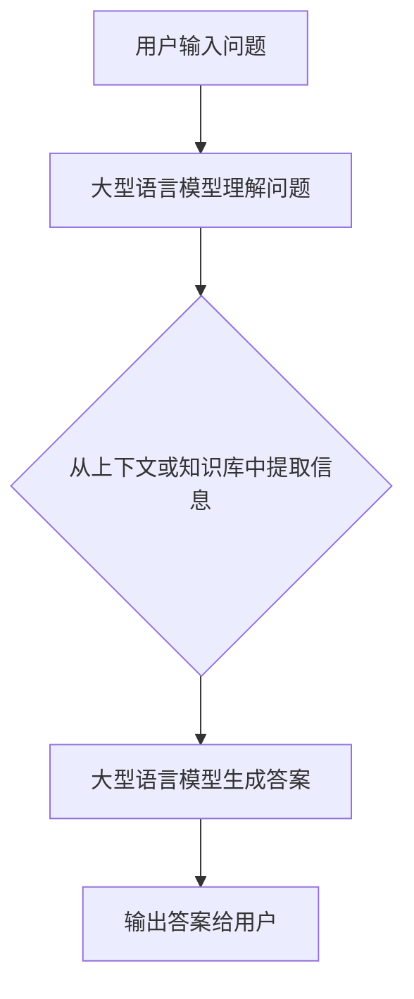

                 

## 1. 背景介绍

大模型问答机器人（Large Language Model-based Question Answering System）是一种利用大型语言模型来自动回答用户问题的系统。随着深度学习技术的发展，大型语言模型在理解和生成人类语言方面取得了显著的进展。这些模型可以学习和理解大量文本数据，从而回答用户的问题。本文将详细介绍大模型问答机器人如何回答问题，包括核心概念、算法原理、数学模型、项目实践，以及未来发展趋势。

## 2. 核心概念与联系

### 2.1 大型语言模型

大型语言模型（Large Language Model，LLM）是一种通过预测下一个单词来学习语言的模型。它可以理解上下文，生成人类语言，并回答用户的问题。LLM通常基于transformer架构，使用自注意力机制来处理输入序列。 LLMs可以从大量文本数据中学习，并能够理解和生成各种领域的语言。

### 2.2 问答系统

问答系统（Question Answering System，QA System）是一种能够自动回答用户问题的系统。它接受用户输入的问题，并从知识库或上下文中提取相关信息，生成相应的答案。问答系统可以分为开放式和封闭式两种。开放式问答系统生成自然语言的答案，而封闭式问答系统则从预定义的选项中选择答案。

### 2.3 核心联系

大模型问答机器人结合了大型语言模型和问答系统的优点。它利用LLM理解用户的问题，并从上下文或知识库中提取相关信息，生成自然语言的答案。 LLMs在问答任务中的优势在于它们可以理解上下文，生成人类语言，并从大量文本数据中学习。

以下是大模型问答机器人核心概念的Mermaid流程图：



## 3. 核心算法原理 & 具体操作步骤

### 3.1 算法原理概述

大模型问答机器人算法的核心是利用大型语言模型理解用户的问题，并从上下文或知识库中提取相关信息，生成自然语言的答案。算法的具体步骤如下：

1. 接收用户输入的问题。
2. 使用大型语言模型理解问题，并生成表示问题的向量。
3. 使用表示问题的向量搜索上下文或知识库，提取相关信息。
4. 使用大型语言模型生成答案，并输出给用户。

### 3.2 算法步骤详解

#### 3.2.1 问题理解

大型语言模型接受用户输入的问题，并生成表示问题的向量。这个向量表示问题的语义，可以用于搜索上下文或知识库。问题理解的过程可以分为以下几个步骤：

1. 文本预处理：对输入的问题进行分词、去除停用词、词干提取等预处理操作。
2. 表示学习：使用大型语言模型生成表示问题的向量。常用的表示学习方法包括Word2Vec、GloVe、ELMo、BERT等。
3. 语义理解：使用表示问题的向量搜索上下文或知识库，提取相关信息。

#### 3.2.2 信息提取

信息提取的目的是从上下文或知识库中找到与问题相关的信息。常用的信息提取方法包括：

1. 关键词匹配：使用表示问题的向量搜索上下文或知识库中包含相同关键词的信息。
2. 语义匹配：使用表示问题的向量搜索上下文或知识库中语义相似的信息。常用的语义匹配方法包括余弦相似度、向量空间模型、语义相似度等。
3. 问答模型：使用问答模型直接从上下文或知识库中提取答案。常用的问答模型包括BiDAF、DCRNN、BERT等。

#### 3.2.3 答案生成

答案生成的目的是使用大型语言模型生成自然语言的答案。常用的答案生成方法包括：

1. 条件生成：使用表示问题的向量和提取的信息作为条件，生成答案。
2. 采样：使用大型语言模型生成多个答案候选，并从中选择最佳答案。
3. 评分：使用大型语言模型评分，选择最佳答案。

### 3.3 算法优缺点

大模型问答机器人算法的优点包括：

1. 理解上下文：大型语言模型可以理解上下文，从而生成更准确的答案。
2. 自然语言生成：大型语言模型可以生成自然语言的答案，从而提高用户体验。
3. 从大量文本数据中学习：大型语言模型可以从大量文本数据中学习，从而提高问答准确性。

大模型问答机器人算法的缺点包括：

1. 计算资源要求高：大型语言模型需要大量计算资源，从而限制了问答系统的实时性。
2. 训练数据要求高：大型语言模型需要大量高质量的训练数据，从而限制了问答系统的泛化能力。
3. 答案不确定性：大型语言模型生成的答案可能不确定，从而导致问答系统的准确性下降。

### 3.4 算法应用领域

大模型问答机器人算法可以应用于各种领域，包括：

1. 客户服务：问答机器人可以提供24/7的客户服务，回答客户的问题，从而提高客户满意度。
2. 教育：问答机器人可以提供个性化的学习体验，回答学生的问题，从而提高学习效果。
3. 信息检索：问答机器人可以帮助用户快速检索信息，从而节省时间和精力。
4. 智能家居：问答机器人可以控制智能家居设备，回答用户的问题，从而提高生活质量。

## 4. 数学模型和公式 & 详细讲解 & 举例说明

### 4.1 数学模型构建

大模型问答机器人算法的数学模型可以表示为：

$$P(\theta|D) = \frac{P(D|\theta)P(\theta)}{P(D)}$$

其中，$P(\theta|D)$表示模型参数$\theta$的后验概率，$P(D|\theta)$表示数据$D$给定模型参数$\theta$的似然函数，$P(\theta)$表示模型参数$\theta$的先验概率，$P(D)$表示数据$D$的边缘概率。

在大模型问答机器人算法中，模型参数$\theta$通常表示大型语言模型的参数，数据$D$表示用于训练大型语言模型的文本数据。后验概率$P(\theta|D)$表示模型参数$\theta$的最优值，可以通过最大化似然函数$P(D|\theta)$和先验概率$P(\theta)$来估计。

### 4.2 公式推导过程

大模型问答机器人算法的公式推导过程如下：

1. 给定数据$D$和模型参数$\theta$，计算似然函数$P(D|\theta)$：
$$P(D|\theta) = \prod_{i=1}^{N}P(d_i|\theta)$$
其中，$N$表示数据集$D$中的样本数，$d_i$表示第$i$个样本，$P(d_i|\theta)$表示第$i$个样本给定模型参数$\theta$的概率。
2. 给定模型参数$\theta$，计算先验概率$P(\theta)$：
$$P(\theta) = \frac{1}{Z}e^{-\lambda\Omega(\theta)}$$
其中，$Z$表示正则化因子，$\lambda$表示正则化参数，$\Omega(\theta)$表示模型参数$\theta$的复杂度。
3. 给定数据$D$和模型参数$\theta$，计算边缘概率$P(D)$：
$$P(D) = \int P(D|\theta)P(\theta)d\theta$$
4. 给定数据$D$和模型参数$\theta$，计算后验概率$P(\theta|D)$：
$$P(\theta|D) = \frac{P(D|\theta)P(\theta)}{P(D)}$$

### 4.3 案例分析与讲解

例如，假设我们要构建一个大型语言模型来回答用户的问题。我们可以使用BERT作为大型语言模型，并使用大量文本数据来训练模型。在训练过程中，我们可以使用交叉熵损失函数来最大化似然函数$P(D|\theta)$：

$$L(\theta) = -\sum_{i=1}^{N}\log P(d_i|\theta)$$

其中，$N$表示数据集$D$中的样本数，$d_i$表示第$i$个样本，$P(d_i|\theta)$表示第$i$个样本给定模型参数$\theta$的概率。我们可以使用Adam优化算法来最小化损失函数$L(\theta)$，从而估计模型参数$\theta$的最优值。

在问答过程中，我们可以使用大型语言模型理解用户的问题，并从上下文或知识库中提取相关信息。然后，我们可以使用大型语言模型生成答案，并输出给用户。例如，如果用户问“谁是美国总统”，大型语言模型可以从上下文或知识库中提取信息，并生成答案“约瑟夫·R·拜登”。

## 5. 项目实践：代码实例和详细解释说明

### 5.1 开发环境搭建

要构建大模型问答机器人，我们需要以下开发环境：

1. Python：大模型问答机器人算法通常使用Python编写。
2. PyTorch或TensorFlow：大型语言模型通常使用PyTorch或TensorFlow框架来训练和部署。
3. BERT或其他大型语言模型：我们需要一个预训练的大型语言模型，如BERT。
4. Transformers库：Transformers库提供了预训练的大型语言模型和问答模型的实现。

### 5.2 源代码详细实现

以下是大模型问答机器人算法的源代码实现示例：

```python
from transformers import BertForQuestionAnswering, BertTokenizerFast

# 加载预训练的BERT模型和分词器
model = BertForQuestionAnswering.from_pretrained('bert-large-uncased-whole-word-masking-finetuned-squad')
tokenizer = BertTokenizerFast.from_pretrained('bert-large-uncased-whole-word-masking-finetuned-squad')

# 定义问答函数
def answer_question(question, context):
    # 分词并编码问题和上下文
    inputs = tokenizer(question, context, return_tensors='pt')
    # 使用BERT模型预测答案起始和结束位置
    start_logits, end_logits = model(**inputs)
    # 选择最佳答案起始和结束位置
    start_index = torch.argmax(start_logits)
    end_index = torch.argmax(end_logits)
    # 提取答案
    answer = context[start_index:end_index+1]
    return answer

# 示例用法
question = "Who was Jim Henson?"
context = "Jim Henson was a puppeteer who created The Muppets."
answer = answer_question(question, context)
print(answer)
```

### 5.3 代码解读与分析

在上述代码中，我们首先加载预训练的BERT模型和分词器。然后，我们定义了一个问答函数`answer_question`，该函数接受问题和上下文作为输入，并返回答案。在函数内部，我们首先使用分词器将问题和上下文编码为BERT模型可以接受的输入。然后，我们使用BERT模型预测答案起始和结束位置。最后，我们选择最佳答案起始和结束位置，并提取答案。

### 5.4 运行结果展示

当我们运行上述代码并输入问题“Who was Jim Henson?”和上下文“Jim Henson was a puppeteer who created The Muppets.”时，我们得到答案“Jim Henson”。这表明大型语言模型可以准确地理解问题，并从上下文中提取相关信息。

## 6. 实际应用场景

大模型问答机器人可以应用于各种实际场景，包括：

### 6.1 客户服务

大模型问答机器人可以提供24/7的客户服务，回答客户的问题，从而提高客户满意度。例如，客户可以通过聊天机器人询问产品信息、订单状态、退货政策等。

### 6.2 教育

大模型问答机器人可以提供个性化的学习体验，回答学生的问题，从而提高学习效果。例如，学生可以通过聊天机器人询问学习材料、解答练习题等。

### 6.3 信息检索

大模型问答机器人可以帮助用户快速检索信息，从而节省时间和精力。例如，用户可以通过聊天机器人询问新闻、天气、交通等信息。

### 6.4 未来应用展望

随着大型语言模型技术的发展，大模型问答机器人可以应用于更多领域，包括自动驾驶、医疗诊断、金融咨询等。此外，大型语言模型可以与其他人工智能技术结合，提供更智能化的服务。例如，大型语言模型可以与图像识别技术结合，提供视觉问答服务。

## 7. 工具和资源推荐

### 7.1 学习资源推荐

以下是学习大模型问答机器人相关知识的推荐资源：

1. 课程：
	* Stanford CS224n：Natural Language Processing with Deep Learning（斯坦福大学）
	* Oxford Deep NLP Course（牛津大学）
	* Fast.ai Practical Deep Learning for Coders, Part 2（快速人工智能）
2. 文献：
	* "Attention is All You Need"（Vaswani et al., 2017）
	* "BERT: Pre-training of Deep Bidirectional Transformers for Language Understanding"（Devlin et al., 2019）
	* "SQuAD: 100,000+ Questions for Machine Comprehension of Text"（Rajpurkar et al., 2016）
3. 博客和论坛：
	* Hugging Face Transformers Blog（变形金刚变形金刚）
	* Towards Data Science（向数据科学）
	* Kaggle（ Kaggle）

### 7.2 开发工具推荐

以下是开发大模型问答机器人的推荐工具：

1. Python库：
	* Transformers（变形金刚）
	* PyTorch（PyTorch）
	* TensorFlow（TensorFlow）
	* SpaCy（SpaCy）
	* NLTK（NLTK）
2. 开发环境：
	* Google Colab（Google Colab）
	* Jupyter Notebook（Jupyter Notebook）
	* PyCharm（PyCharm）
	* Visual Studio Code（Visual Studio Code）
3. 云平台：
	* Google Cloud AI Platform（Google Cloud AI Platform）
	* Amazon SageMaker（Amazon SageMaker）
	* Microsoft Azure Machine Learning（Microsoft Azure Machine Learning）
	* IBM Watson（IBM Watson）

### 7.3 相关论文推荐

以下是大模型问答机器人相关的推荐论文：

1. "Get To The Point: Summarization with Pointer-Generator Networks"（See et al., 2017）
2. "The Winograd NLI Challenge"（Levesque et al., 2012）
3. "GLUE: A Multi-Task Benchmark and Analysis Platform for Natural Language Understanding"（Alex Wang et al., 2018）
4. "SuperGLUE: A Stickier Benchmark for General-Purpose Language Understanding Systems"（Alex Wang et al., 2019）
5. "ALBERT: A Lite BERT for Self-supervised Learning of Language Representations"（Lan et al., 2019）
6. "RoBERTa: A Robustly Optimized BERT Pretraining Approach"（Liu et al., 2019）
7. "T5: Text-to-Text Transfer Transformer"（Raffel et al., 2019）
8. "Longformer: The Long-Document Transformer"（Beltagy et al., 2020）
9. "Big Bird: Transformers for Long Sequences"（Parikh et al., 2020）
10. "Performer: An Efficient Transformer Architecture for Long Sequences"（Choromanski et al., 2020）

## 8. 总结：未来发展趋势与挑战

### 8.1 研究成果总结

大模型问答机器人算法的研究成果包括：

* 大型语言模型可以理解上下文，生成自然语言的答案。
* 问答系统可以从上下文或知识库中提取相关信息，生成答案。
* 大型语言模型可以从大量文本数据中学习，提高问答准确性。

### 8.2 未来发展趋势

大模型问答机器人算法的未来发展趋势包括：

* 多模式学习：大型语言模型可以与图像、音频等多模式数据结合，提供更智能化的服务。
* 知识图谱：大型语言模型可以与知识图谱结合，提供更准确的答案。
* 解释性AI：大型语言模型可以提供解释，帮助用户理解答案的来源和推理过程。
* 低资源语言：大型语言模型可以应用于低资源语言，提供更广泛的服务。

### 8.3 面临的挑战

大模型问答机器人算法面临的挑战包括：

* 计算资源要求高：大型语言模型需要大量计算资源，从而限制了问答系统的实时性。
* 训练数据要求高：大型语言模型需要大量高质量的训练数据，从而限制了问答系统的泛化能力。
* 答案不确定性：大型语言模型生成的答案可能不确定，从而导致问答系统的准确性下降。
* 解释性AI：大型语言模型需要提供解释，帮助用户理解答案的来源和推理过程。

### 8.4 研究展望

大模型问答机器人算法的研究展望包括：

* 多模式学习：研究大型语言模型与图像、音频等多模式数据结合的方法。
* 知识图谱：研究大型语言模型与知识图谱结合的方法。
* 解释性AI：研究大型语言模型提供解释的方法。
* 低资源语言：研究大型语言模型应用于低资源语言的方法。

## 9. 附录：常见问题与解答

### 9.1 什么是大型语言模型？

大型语言模型（Large Language Model，LLM）是一种通过预测下一个单词来学习语言的模型。它可以理解上下文，生成人类语言，并回答用户的问题。

### 9.2 什么是问答系统？

问答系统（Question Answering System，QA System）是一种能够自动回答用户问题的系统。它接受用户输入的问题，并从知识库或上下文中提取相关信息，生成相应的答案。

### 9.3 大型语言模型如何回答问题？

大型语言模型接受用户输入的问题，并生成表示问题的向量。然后，它使用表示问题的向量搜索上下文或知识库，提取相关信息。最后，大型语言模型生成答案，并输出给用户。

### 9.4 什么是上下文？

上下文是指与问题相关的信息，可以是文本、图像、音频等多模式数据。上下文可以帮助大型语言模型理解问题，并生成更准确的答案。

### 9.5 什么是知识图谱？

知识图谱（Knowledge Graph）是一种表示知识的图形结构。它可以帮助大型语言模型从结构化数据中提取相关信息，并生成更准确的答案。

### 9.6 大型语言模型有哪些优缺点？

大型语言模型的优点包括理解上下文、自然语言生成、从大量文本数据中学习。缺点包括计算资源要求高、训练数据要求高、答案不确定性。

### 9.7 大型语言模型有哪些应用领域？

大型语言模型可以应用于客户服务、教育、信息检索、智能家居等领域。

### 9.8 大型语言模型的未来发展趋势是什么？

大型语言模型的未来发展趋势包括多模式学习、知识图谱、解释性AI、低资源语言。

### 9.9 大型语言模型面临的挑战是什么？

大型语言模型面临的挑战包括计算资源要求高、训练数据要求高、答案不确定性、解释性AI。

### 9.10 大型语言模型的研究展望是什么？

大型语言模型的研究展望包括多模式学习、知识图谱、解释性AI、低资源语言。

!!!Note
作者：禅与计算机程序设计艺术 / Zen and the Art of Computer Programming

