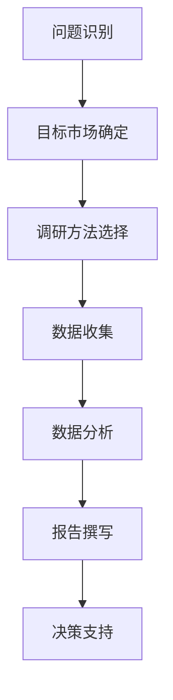

                 

## 1. 背景介绍

在当今快速变化的商业环境中，市场调研已成为创业者和企业家必备的技能。市场调研是获取市场信息、理解客户需求、评估市场机会，并为决策提供依据的过程。本文将深入探讨市场调研的方法、技术、工具，并提供实践指南，帮助创业者提高市场调研能力。

## 2. 核心概念与联系

### 2.1 市场调研的定义与目标

市场调研是系统收集、整理、分析和利用市场信息的过程，目的是为企业决策提供依据，帮助企业更好地适应市场变化，提高竞争力。

### 2.2 市场调研的类型

市场调研可以分为两大类：定性市场调研和定量市场调研。

- 定性市场调研：侧重于理解市场现象背后的原因，常用的方法包括访谈、焦点小组、观察等。
- 定量市场调研：侧重于量化市场现象，常用的方法包括问卷调查、抽样调查等。

### 2.3 核心概念原理与架构的 Mermaid 流程图



## 3. 核心算法原理 & 具体操作步骤

### 3.1 算法原理概述

市场调研的核心是数据收集、分析和利用。本节将介绍常用的市场调研算法，包括聚类算法、回归算法和预测算法。

### 3.2 算法步骤详解

#### 3.2.1 聚类算法

聚类算法用于将市场细分为不同的群组，以便更好地理解市场结构。常用的聚类算法包括K-means算法、层次聚类算法等。

1. 确定聚类的数量（K）
2. 初始化K个聚类中心
3. 将每个数据点分配到最近的聚类中心
4. 重新计算聚类中心
5. 重复步骤3和4，直到聚类中心不再改变

#### 3.2.2 回归算法

回归算法用于建立因变量和自变量之间的关系，帮助预测市场变化。常用的回归算法包括线性回归、多元回归等。

1. 选择自变量和因变量
2. 收集数据
3. 计算回归系数
4. 评估模型拟合度
5. 使用模型进行预测

#### 3.2.3 预测算法

预测算法用于预测市场未来趋势。常用的预测算法包括时间序列预测、 ARIMA模型等。

1. 选择预测变量
2. 收集历史数据
3. 选择合适的预测模型
4. 训练模型
5. 使用模型进行预测

### 3.3 算法优缺点

- **优点**：市场调研算法可以帮助创业者更好地理解市场，做出数据驱动的决策。
- **缺点**：市场调研算法需要大量的数据，且数据质量直接影响算法的准确性。此外，市场调研算法无法预测市场的意外变化。

### 3.4 算法应用领域

市场调研算法广泛应用于市场细分、需求预测、竞争分析等领域，帮助企业更好地理解市场，提高竞争力。

## 4. 数学模型和公式 & 详细讲解 & 举例说明

### 4.1 数学模型构建

市场调研常用的数学模型包括线性回归模型、时间序列模型等。

### 4.2 公式推导过程

#### 4.2.1 线性回归模型

线性回归模型的公式为：

$$Y = \beta_0 + \beta_1X + \epsilon$$

其中，Y为因变量，X为自变量，$\beta_0$和$\beta_1$为回归系数，$\epsilon$为误差项。

回归系数可以通过最小平方法求得：

$$\beta_1 = \frac{\sum_{i=1}^{n}(X_i - \bar{X})(Y_i - \bar{Y})}{\sum_{i=1}^{n}(X_i - \bar{X})^2}$$

$$\beta_0 = \bar{Y} - \beta_1\bar{X}$$

#### 4.2.2 时间序列模型

时间序列模型的公式为：

$$Y_t = c + \phi_1Y_{t-1} + \phi_2Y_{t-2} + \cdots + \phi_pY_{t-p} + \epsilon_t$$

其中，Y_t为时间序列的当前值，c为常数项，$\phi_1, \phi_2, \cdots, \phi_p$为自回归系数，$\epsilon_t$为误差项。

自回归系数可以通过最小平方法求得：

$$\phi = (X'X)^{-1}X'Y$$

### 4.3 案例分析与讲解

例如，某企业想预测未来一年销售额，可以使用线性回归模型，将销售额作为因变量，广告投入、销售人员数量等作为自变量。通过收集历史数据，求得回归系数，即可预测未来一年销售额。

## 5. 项目实践：代码实例和详细解释说明

### 5.1 开发环境搭建

本项目使用Python语言，建议使用Anaconda环境，并安装以下库：pandas、numpy、matplotlib、scikit-learn。

### 5.2 源代码详细实现

以下是使用线性回归模型预测销售额的示例代码：

```python
import pandas as pd
from sklearn.linear_model import LinearRegression

# 加载数据
data = pd.read_csv('sales_data.csv')

# 定义自变量和因变量
X = data[['advertising','sales_team']]
Y = data['sales']

# 创建线性回归模型
model = LinearRegression()

# 训练模型
model.fit(X, Y)

# 预测未来一年销售额
future_sales = model.predict([[10000, 10]])  # 广告投入1万，销售人员10人
print('未来一年销售额预测为：', future_sales[0])
```

### 5.3 代码解读与分析

本示例使用线性回归模型预测未来一年销售额。首先，加载销售数据，定义自变量和因变量。然后，创建线性回归模型，并使用历史数据训练模型。最后，使用模型预测未来一年销售额。

### 5.4 运行结果展示

运行示例代码，输出未来一年销售额预测结果。

## 6. 实际应用场景

### 6.1 市场细分

市场调研可以帮助企业更好地理解市场结构，进行市场细分。例如，某企业可以通过聚类算法将客户细分为不同的群组，并针对不同群组开展不同的营销策略。

### 6.2 需求预测

市场调研可以帮助企业预测市场需求，从而进行生产计划。例如，某企业可以使用时间序列模型预测未来一年市场需求，并根据预测结果调整生产计划。

### 6.3 竞争分析

市场调研可以帮助企业更好地理解竞争对手，进行竞争分析。例如，某企业可以通过调查竞争对手的市场份额、产品特点等信息，分析竞争对手的优势和劣势，并据此调整自己的策略。

### 6.4 未来应用展望

随着大数据和人工智能技术的发展，市场调研将更加智能化。例如，企业可以使用自然语言处理技术分析社交媒体数据，获取市场信息。此外，企业可以使用深度学习技术预测市场需求，并进行动态调整。

## 7. 工具和资源推荐

### 7.1 学习资源推荐

- 书籍：《市场调研与分析》《数据科学与机器学习》《统计学习方法》
- 在线课程：Coursera、Udacity、edX上的市场调研和数据科学课程

### 7.2 开发工具推荐

- Python：Anaconda、Jupyter Notebook
- R：RStudio
- 可视化工具：Tableau、Power BI

### 7.3 相关论文推荐

- "Market Research: A Review of Methods and Techniques"（市场调研：方法和技术回顾）
- "Big Data Analytics for Market Research"（大数据分析在市场调研中的应用）
- "Machine Learning in Market Research"（市场调研中的机器学习）

## 8. 总结：未来发展趋势与挑战

### 8.1 研究成果总结

本文介绍了市场调研的方法、技术、工具，并提供了实践指南。市场调研是企业决策的重要依据，创业者应重视市场调研，提高市场调研能力。

### 8.2 未来发展趋势

未来，市场调研将更加智能化，企业可以使用大数据和人工智能技术获取市场信息，进行动态调整。此外，市场调研将更加跨界，企业可以从不同领域获取市场信息，进行创新。

### 8.3 面临的挑战

市场调研面临的挑战包括数据质量问题、数据安全问题、数据分析能力不足等。创业者应重视这些挑战，并采取相应措施加以解决。

### 8.4 研究展望

未来，市场调研将更加注重实时性、个性化和跨界性。企业可以使用实时数据进行市场调研，并根据个性化需求进行调整。此外，企业可以从不同领域获取市场信息，进行创新。

## 9. 附录：常见问题与解答

**Q1：市场调研需要花费多少时间和资源？**

**A1：市场调研的时间和资源投入取决于调研的范围和深度。通常，市场调研需要数周到数月的时间，并需要一定的人力、物力和财力投入。创业者应根据企业的实际情况，合理规划市场调研的时间和资源投入。**

**Q2：市场调研的数据从哪里获取？**

**A2：市场调研的数据可以从多个渠道获取，包括问卷调查、访谈、焦点小组、观察、二手数据等。创业者应根据调研的目标和需求，选择合适的数据来源。**

**Q3：如何评估市场调研的有效性？**

**A3：评估市场调研有效性的指标包括数据准确性、数据代表性、数据时效性等。创业者应根据调研的目标和需求，选择合适的评估指标，并定期评估市场调研的有效性。**

!!!Note
作者：禅与计算机程序设计艺术 / Zen and the Art of Computer Programming

