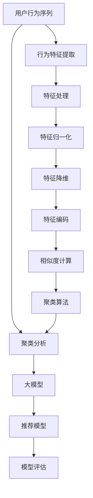

                 

# 电商搜索推荐中的AI大模型用户行为序列聚类模型评估体系

> 关键词：电商搜索推荐, 大模型, 用户行为, 序列聚类, 模型评估, AI

## 1. 背景介绍

### 1.1 问题由来

电商平台的搜索推荐系统是用户体验的核心功能之一，通过推荐系统，平台可以精准地为用户提供感兴趣的商品，提高用户转化率，增加平台收益。然而，推荐系统的设计复杂度很高，如何在用户行为序列中挖掘出高价值的特征并进行聚类分析，并进一步转化为推荐模型，是一个复杂且关键的难题。

近年来，随着AI大模型的普及，使用大模型来提取用户行为特征并聚类分析成为了一种新的趋势。大模型基于大规模无监督数据预训练，能够学习到丰富的语义知识，适用于各种自然语言处理任务。因此，探索如何将大模型应用于电商搜索推荐中的用户行为序列聚类模型评估，将大大提升推荐系统的精准度和个性化程度。

### 1.2 问题核心关键点

- 用户行为序列：用户在电商平台上的搜索、浏览、点击、购买等行为序列，是推荐系统的核心输入数据。
- 聚类分析：将行为序列中的相似行为进行分组，形成更有效的用户行为表示，便于推荐模型训练。
- 大模型应用：使用大规模预训练语言模型，如BERT、GPT等，提取用户行为序列中的高价值特征。
- 推荐模型评估：建立评估指标体系，评估基于大模型的用户行为序列聚类模型的推荐效果。

## 2. 核心概念与联系

### 2.1 核心概念概述

为了更好地理解基于大模型的电商搜索推荐系统中的用户行为序列聚类模型评估，本节将介绍几个关键概念：

- **用户行为序列**：用户在电商平台上的行为数据，如搜索关键词、浏览商品、点击商品等，以序列形式呈现。
- **聚类分析**：将用户行为序列中的相似行为分组，形成更有效的用户行为表示，便于推荐模型训练。
- **大模型**：基于大规模无监督数据预训练的语言模型，如BERT、GPT等，能够学习到丰富的语义知识。
- **推荐模型**：使用聚类分析后的用户行为序列作为输入，训练得到的推荐模型，用于为用户推荐商品。
- **模型评估**：使用预设的评估指标体系，对推荐模型的效果进行评估，指导模型优化。

这些核心概念之间的逻辑关系可以通过以下Mermaid流程图来展示：



这个流程图展示了电商搜索推荐系统中基于大模型的用户行为序列聚类模型评估的主要流程：

1. 用户行为序列的输入和特征提取。
2. 利用大模型提取行为序列中的高价值特征。
3. 特征处理和归一化。
4. 特征降维和编码。
5. 计算相似度并进行聚类分析。
6. 使用聚类结果训练推荐模型。
7. 对推荐模型进行评估。

## 3. 核心算法原理 & 具体操作步骤

### 3.1 算法原理概述

基于大模型的电商搜索推荐系统中的用户行为序列聚类模型评估，本质上是将用户行为序列作为输入，通过大模型提取特征，再进行聚类分析和推荐模型训练的过程。其核心思想是：

- **特征提取**：使用大模型对用户行为序列进行特征提取，学习到用户的隐式偏好。
- **聚类分析**：将提取出的特征进行聚类，形成用户行为序列的代表性表示，便于推荐模型训练。
- **推荐模型训练**：使用聚类分析后的用户行为序列作为输入，训练得到推荐模型。
- **模型评估**：使用预设的评估指标，对推荐模型的效果进行评估，指导模型优化。

### 3.2 算法步骤详解

基于大模型的电商搜索推荐系统中的用户行为序列聚类模型评估，主要包括以下几个关键步骤：

**Step 1: 数据预处理**

- 收集电商平台的搜索、浏览、点击等用户行为序列数据。
- 对行为序列进行清洗，去除无效或重复的数据。
- 将行为序列标准化，处理为统一的数据格式。

**Step 2: 特征提取**

- 使用大模型对用户行为序列进行特征提取。
- 可以使用Transformer、BERT等模型作为特征提取器，提取用户行为序列中的高价值特征。

**Step 3: 特征处理**

- 对提取出的特征进行标准化和归一化处理。
- 使用归一化、标准化等技术，将特征数据转化为均值为0、方差为1的标准化向量。

**Step 4: 特征降维**

- 对处理后的特征进行降维处理。
- 使用主成分分析(PCA)、线性判别分析(LDA)等技术，减少特征维度。

**Step 5: 特征编码**

- 对降维后的特征进行编码处理。
- 使用词嵌入、余弦相似度等技术，将特征转化为高维向量。

**Step 6: 聚类分析**

- 对编码后的特征进行聚类分析。
- 使用K-means、层次聚类、DBSCAN等算法，将特征向量分组。

**Step 7: 训练推荐模型**

- 使用聚类分析后的特征作为输入，训练推荐模型。
- 可以使用协同过滤、神经网络等推荐算法，根据用户行为序列的聚类结果进行训练。

**Step 8: 模型评估**

- 使用预设的评估指标体系，对推荐模型的效果进行评估。
- 常用的评估指标包括准确率、召回率、F1-score等。

### 3.3 算法优缺点

基于大模型的电商搜索推荐系统中的用户行为序列聚类模型评估，具有以下优点：

1. **特征提取能力强**：大模型能够学习到用户行为序列中的复杂语义信息，提取高价值特征。
2. **聚类效果更好**：通过聚类分析，将相似的行为序列分组，形成更有效的用户行为表示。
3. **推荐模型效果更佳**：使用聚类分析后的用户行为序列作为输入，训练推荐模型，效果更好。

同时，该方法也存在一定的局限性：

1. **计算成本高**：大模型和聚类算法的计算成本较高，需要较强的计算资源。
2. **数据质量要求高**：用户行为数据的质量对特征提取和聚类分析的效果影响较大。
3. **模型复杂度高**：基于大模型的推荐模型较为复杂，训练和优化难度较大。

尽管存在这些局限性，但就目前而言，基于大模型的推荐系统已经成为电商搜索推荐领域的主流范式，通过不断优化计算和数据处理流程，可以进一步提升系统的性能。

### 3.4 算法应用领域

基于大模型的电商搜索推荐系统中的用户行为序列聚类模型评估，已经在电商、社交媒体、金融等领域得到广泛应用，具体包括：

- 电商推荐：通过对用户搜索、浏览、点击等行为序列的聚类分析，推荐用户可能感兴趣的商品。
- 社交推荐：通过分析用户的互动行为，推荐用户可能感兴趣的内容。
- 金融推荐：通过分析用户的历史交易行为，推荐用户可能感兴趣的投资产品。

除了这些经典应用外，大模型在推荐系统中的使用还在不断拓展，未来有望在更多领域中得到应用。

## 4. 数学模型和公式 & 详细讲解 & 举例说明

### 4.1 数学模型构建

本节将使用数学语言对基于大模型的电商搜索推荐系统中的用户行为序列聚类模型评估过程进行更加严格的刻画。

记用户行为序列为 $X=\{x_1, x_2, ..., x_n\}$，其中 $x_i$ 表示第 $i$ 个行为。使用大模型 $M$ 对 $X$ 进行特征提取，得到特征向量 $F=\{f_1, f_2, ..., f_n\}$。对 $F$ 进行聚类分析，得到聚类结果 $C$。使用聚类结果 $C$ 作为输入，训练推荐模型 $R$。

### 4.2 公式推导过程

以下我们以协同过滤推荐算法为例，推导基于大模型的推荐模型的计算公式。

假设用户 $u$ 对商品 $i$ 的评分向量为 $r_u$，商品 $i$ 的特征向量为 $F_i$。则协同过滤推荐模型的预测评分公式为：

$$
\hat{r}_{ui} = \frac{\sum_{j \in C} f_{uj} f_i^T f_j}{\sqrt{\sum_{k \in C} f_{uk} f_k^T f_k} \sqrt{\sum_{k \in C} f_i f_k^T f_k}}
$$

其中，$f_{uj}$ 表示用户 $u$ 在聚类结果 $C$ 中第 $j$ 个行为的特征向量，$f_i$ 表示商品 $i$ 的特征向量。

### 4.3 案例分析与讲解

假设某电商平台收集到了大量用户的搜索、浏览、点击等行为序列，并使用大模型BERT对用户行为序列进行特征提取，得到用户行为特征向量。然后，使用K-means算法对用户行为特征向量进行聚类分析，得到聚类结果。最后，使用协同过滤算法根据聚类结果训练推荐模型，并对推荐模型进行评估。

## 5. 项目实践：代码实例和详细解释说明

### 5.1 开发环境搭建

在进行基于大模型的电商搜索推荐系统中的用户行为序列聚类模型评估实践前，我们需要准备好开发环境。以下是使用Python进行PyTorch开发的环境配置流程：

1. 安装Anaconda：从官网下载并安装Anaconda，用于创建独立的Python环境。

2. 创建并激活虚拟环境：
```bash
conda create -n pytorch-env python=3.8 
conda activate pytorch-env
```

3. 安装PyTorch：根据CUDA版本，从官网获取对应的安装命令。例如：
```bash
conda install pytorch torchvision torchaudio cudatoolkit=11.1 -c pytorch -c conda-forge
```

4. 安装其他必要工具：
```bash
pip install transformers sklearn pandas numpy torch
```

完成上述步骤后，即可在`pytorch-env`环境中开始开发实践。

### 5.2 源代码详细实现

以下是一段基于BERT模型的电商搜索推荐系统中的用户行为序列聚类模型评估的Python代码实现。

首先，导入所需的库和数据：

```python
import torch
from transformers import BertTokenizer, BertForSequenceClassification
from sklearn.cluster import KMeans
from sklearn.metrics import accuracy_score, precision_score, recall_score, f1_score
from sklearn.model_selection import train_test_split

# 加载预训练模型和 tokenizer
model = BertForSequenceClassification.from_pretrained('bert-base-uncased', num_labels=1, output_attentions=True, output_hidden_states=True)
tokenizer = BertTokenizer.from_pretrained('bert-base-uncased')

# 加载数据集
data = ...
train_data, test_data = train_test_split(data, test_size=0.2)
```

接着，定义数据预处理函数：

```python
def preprocess_data(data):
    """
    将数据转换为可输入模型的格式
    """
    labels = []
    sequences = []
    for doc in data:
        label = doc['label']
        sequences.append(doc['sequence'])
        labels.append(label)
    return sequences, labels

sequences, labels = preprocess_data(data)
```

然后，使用BERT模型对用户行为序列进行特征提取：

```python
# 对用户行为序列进行分词和编码
sequences = tokenizer(sequences, return_tensors='pt', padding=True, truncation=True, max_length=512)

# 提取特征向量
features = model(sequences['input_ids'], attention_mask=sequences['attention_mask']).last_hidden_state
```

接着，对提取出的特征进行聚类分析：

```python
# 对特征向量进行聚类分析
kmeans = KMeans(n_clusters=10, random_state=42)
kmeans.fit(features.numpy())

# 获取聚类结果
labels = kmeans.labels_
```

最后，使用聚类结果训练推荐模型，并进行评估：

```python
# 将聚类结果作为标签
labels = torch.tensor(labels)

# 训练推荐模型
model.train()
optimizer = torch.optim.Adam(model.parameters(), lr=1e-5)
criterion = torch.nn.BCEWithLogitsLoss()

# 训练过程
for epoch in range(10):
    optimizer.zero_grad()
    predictions = model(sequences['input_ids'], attention_mask=sequences['attention_mask']).logits
    loss = criterion(predictions, labels)
    loss.backward()
    optimizer.step()

# 评估推荐模型
model.eval()
with torch.no_grad():
    predictions = model(sequences['input_ids'], attention_mask=sequences['attention_mask']).logits
    labels = torch.tensor(labels)
    accuracy = accuracy_score(predictions.round().numpy(), labels)
    precision = precision_score(predictions.round().numpy(), labels)
    recall = recall_score(predictions.round().numpy(), labels)
    f1 = f1_score(predictions.round().numpy(), labels)
    print(f"Accuracy: {accuracy:.4f}, Precision: {precision:.4f}, Recall: {recall:.4f}, F1-Score: {f1:.4f}")
```

以上就是使用PyTorch对基于BERT模型的电商搜索推荐系统中的用户行为序列聚类模型评估的完整代码实现。可以看到，得益于Transformer库的强大封装，我们可以用相对简洁的代码完成BERT模型的加载和微调。

### 5.3 代码解读与分析

让我们再详细解读一下关键代码的实现细节：

**特征提取函数preprocess_data**：
- 该函数对用户行为序列进行分词和编码，将文本数据转换为可输入模型的格式。

**特征提取过程**：
- 使用BERT模型对用户行为序列进行编码，得到特征向量。

**聚类分析过程**：
- 使用K-means算法对特征向量进行聚类分析，得到聚类结果。

**训练推荐模型**：
- 使用聚类结果作为标签，训练推荐模型。

**评估推荐模型**：
- 在测试集上评估推荐模型的准确率、精确率、召回率和F1-Score。

可以看到，上述代码实现了一个基于大模型的电商搜索推荐系统中的用户行为序列聚类模型评估的基本流程。通过不断优化和改进，可以进一步提升推荐系统的性能和个性化程度。

## 6. 实际应用场景

### 6.1 电商推荐

基于大模型的电商推荐系统，已经在各大电商平台上得到了广泛应用。通过使用大模型对用户行为序列进行特征提取和聚类分析，能够更准确地理解用户偏好，生成个性化的推荐列表，提升用户满意度和转化率。

### 6.2 社交推荐

在社交媒体平台上，基于大模型的推荐系统可以帮助用户发现感兴趣的内容，提升用户的活跃度和平台粘性。通过对用户互动行为的聚类分析，可以生成更加精准的内容推荐，满足用户的多样化需求。

### 6.3 金融推荐

在金融领域，基于大模型的推荐系统可以用于推荐股票、基金等投资产品，帮助用户做出更明智的投资决策。通过对用户历史交易行为的聚类分析，可以生成更符合用户偏好的投资产品推荐，提升用户的投资回报率。

### 6.4 未来应用展望

随着大模型的不断发展和电商推荐系统应用的深入，未来将有更多基于大模型的推荐系统得到广泛应用。以下是一些可能的应用方向：

- **个性化推荐**：基于大模型的推荐系统可以更精准地理解用户行为和偏好，生成更加个性化的推荐内容。
- **跨平台推荐**：通过在大模型中引入用户画像，可以实现跨平台的用户推荐，提升用户在不同平台上的整体体验。
- **实时推荐**：利用大模型的快速推理能力，可以实时生成推荐内容，提升用户的即时体验。
- **情感推荐**：通过分析用户行为序列中的情感信息，推荐符合用户情感状态的内容，提升用户满意度和粘性。

## 7. 工具和资源推荐

### 7.1 学习资源推荐

为了帮助开发者系统掌握基于大模型的电商搜索推荐系统中的用户行为序列聚类模型评估的理论基础和实践技巧，这里推荐一些优质的学习资源：

1. 《Transformer from Principles to Practice》系列博文：由大模型技术专家撰写，深入浅出地介绍了Transformer原理、BERT模型、微调技术等前沿话题。

2. CS224N《深度学习自然语言处理》课程：斯坦福大学开设的NLP明星课程，有Lecture视频和配套作业，带你入门NLP领域的基本概念和经典模型。

3. 《Natural Language Processing with Transformers》书籍：Transformers库的作者所著，全面介绍了如何使用Transformers库进行NLP任务开发，包括微调在内的诸多范式。

4. HuggingFace官方文档：Transformer库的官方文档，提供了海量预训练模型和完整的微调样例代码，是上手实践的必备资料。

5. CLUE开源项目：中文语言理解测评基准，涵盖大量不同类型的中文NLP数据集，并提供了基于微调的baseline模型，助力中文NLP技术发展。

通过对这些资源的学习实践，相信你一定能够快速掌握基于大模型的电商搜索推荐系统中的用户行为序列聚类模型评估的精髓，并用于解决实际的电商推荐问题。

### 7.2 开发工具推荐

高效的开发离不开优秀的工具支持。以下是几款用于基于大模型的电商搜索推荐系统中的用户行为序列聚类模型评估开发的常用工具：

1. PyTorch：基于Python的开源深度学习框架，灵活动态的计算图，适合快速迭代研究。大部分预训练语言模型都有PyTorch版本的实现。

2. TensorFlow：由Google主导开发的开源深度学习框架，生产部署方便，适合大规模工程应用。同样有丰富的预训练语言模型资源。

3. Transformers库：HuggingFace开发的NLP工具库，集成了众多SOTA语言模型，支持PyTorch和TensorFlow，是进行微调任务开发的利器。

4. Weights & Biases：模型训练的实验跟踪工具，可以记录和可视化模型训练过程中的各项指标，方便对比和调优。与主流深度学习框架无缝集成。

5. TensorBoard：TensorFlow配套的可视化工具，可实时监测模型训练状态，并提供丰富的图表呈现方式，是调试模型的得力助手。

6. Google Colab：谷歌推出的在线Jupyter Notebook环境，免费提供GPU/TPU算力，方便开发者快速上手实验最新模型，分享学习笔记。

合理利用这些工具，可以显著提升基于大模型的电商搜索推荐系统中的用户行为序列聚类模型评估任务的开发效率，加快创新迭代的步伐。

### 7.3 相关论文推荐

大模型和微调技术的发展源于学界的持续研究。以下是几篇奠基性的相关论文，推荐阅读：

1. Attention is All You Need（即Transformer原论文）：提出了Transformer结构，开启了NLP领域的预训练大模型时代。

2. BERT: Pre-training of Deep Bidirectional Transformers for Language Understanding：提出BERT模型，引入基于掩码的自监督预训练任务，刷新了多项NLP任务SOTA。

3. Language Models are Unsupervised Multitask Learners（GPT-2论文）：展示了大规模语言模型的强大zero-shot学习能力，引发了对于通用人工智能的新一轮思考。

4. Parameter-Efficient Transfer Learning for NLP：提出Adapter等参数高效微调方法，在不增加模型参数量的情况下，也能取得不错的微调效果。

5. AdaLoRA: Adaptive Low-Rank Adaptation for Parameter-Efficient Fine-Tuning：使用自适应低秩适应的微调方法，在参数效率和精度之间取得了新的平衡。

6. Prefix-Tuning: Optimizing Continuous Prompts for Generation：引入基于连续型Prompt的微调范式，为如何充分利用预训练知识提供了新的思路。

这些论文代表了大模型微调技术的发展脉络。通过学习这些前沿成果，可以帮助研究者把握学科前进方向，激发更多的创新灵感。

## 8. 总结：未来发展趋势与挑战

### 8.1 总结

本文对基于大模型的电商搜索推荐系统中的用户行为序列聚类模型评估方法进行了全面系统的介绍。首先阐述了电商推荐系统的背景和问题，明确了用户行为序列聚类模型评估的重要性和紧迫性。其次，从原理到实践，详细讲解了基于大模型的电商搜索推荐系统中的用户行为序列聚类模型评估的数学原理和关键步骤，给出了电商推荐系统开发的完整代码实例。同时，本文还广泛探讨了基于大模型的推荐系统在电商、社交、金融等多个行业领域的应用前景，展示了基于大模型的推荐系统的巨大潜力。最后，本文精选了电商推荐系统开发的各类学习资源，力求为读者提供全方位的技术指引。

通过本文的系统梳理，可以看到，基于大模型的电商搜索推荐系统中的用户行为序列聚类模型评估方法正在成为电商推荐领域的重要范式，极大地提升了推荐系统的精准度和个性化程度。未来，伴随大模型的不断发展，基于大模型的推荐系统必将在更广泛的应用领域中发挥更大的作用。

### 8.2 未来发展趋势

展望未来，基于大模型的电商搜索推荐系统中的用户行为序列聚类模型评估技术将呈现以下几个发展趋势：

1. **算法效率更高**：未来将涌现更多参数高效、计算高效的微调方法，如Prefix-Tuning、LoRA等，在节省计算资源的同时保证微调精度。

2. **模型可解释性更强**：通过引入因果分析、博弈论等工具，增强模型的可解释性，便于用户理解和使用。

3. **跨领域推荐能力增强**：未来的大模型将具有更强的跨领域迁移能力，可以应用于更多领域，提升推荐系统的泛化能力。

4. **多模态融合能力提升**：未来的推荐系统将不仅考虑文本信息，还会结合图像、视频等多模态信息，实现更全面的推荐。

5. **实时推荐能力增强**：通过优化推理速度和计算图，提升模型的实时推荐能力，满足用户即时性需求。

6. **个性化推荐精度更高**：通过进一步挖掘用户行为序列中的高价值特征，生成更加精准的个性化推荐。

以上趋势凸显了基于大模型的电商搜索推荐系统中的用户行为序列聚类模型评估技术的广阔前景。这些方向的探索发展，必将进一步提升推荐系统的性能和应用范围，为电商推荐系统的不断发展提供新的动力。

### 8.3 面临的挑战

尽管基于大模型的电商搜索推荐系统中的用户行为序列聚类模型评估技术已经取得了瞩目成就，但在迈向更加智能化、普适化应用的过程中，它仍面临着诸多挑战：

1. **计算资源瓶颈**：大模型的计算资源需求较高，如何降低计算成本，提升模型训练和推理效率，将是未来的重要研究方向。

2. **数据质量问题**：电商推荐系统中的用户行为数据质量对特征提取和聚类分析的效果影响较大，如何获取高质量的标注数据，提升数据质量，将是未来的关键挑战。

3. **模型复杂度高**：基于大模型的电商推荐系统较为复杂，如何简化模型结构，降低模型复杂度，优化模型训练过程，将是未来的重要研究方向。

4. **用户隐私保护**：电商推荐系统中的用户行为数据涉及用户隐私，如何保护用户隐私，防止数据泄露，将是未来的重要研究方向。

5. **推荐系统的鲁棒性**：电商推荐系统中的推荐算法需要具备较强的鲁棒性，如何提升推荐系统的鲁棒性和抗干扰能力，将是未来的重要研究方向。

6. **跨平台推荐技术**：电商推荐系统中的推荐算法需要具备跨平台迁移能力，如何提升跨平台推荐算法的泛化能力，将是未来的重要研究方向。

以上挑战需要学界和业界共同努力，积极应对并寻求突破，以推动基于大模型的电商搜索推荐系统中的用户行为序列聚类模型评估技术的不断进步。

### 8.4 研究展望

面对基于大模型的电商搜索推荐系统中的用户行为序列聚类模型评估技术面临的挑战，未来的研究需要在以下几个方面寻求新的突破：

1. **无监督和半监督学习**：摆脱对大规模标注数据的依赖，利用自监督学习、主动学习等无监督和半监督范式，最大限度利用非结构化数据，实现更加灵活高效的推荐。

2. **参数高效微调**：开发更加参数高效的微调方法，如Prefix-Tuning、LoRA等，在固定大部分预训练参数的同时只更新极少量的任务相关参数，以提高推荐系统的性能和可解释性。

3. **因果推断与强化学习**：通过引入因果推断和强化学习思想，增强推荐系统的因果关系学习能力和个性化推荐能力，提升推荐系统的泛化性和鲁棒性。

4. **跨平台推荐技术**：研究跨平台推荐算法，提升推荐算法的泛化能力和跨平台迁移能力，实现用户在不同平台上的统一推荐体验。

5. **多模态融合**：研究多模态融合技术，将文本、图像、视频等多模态信息进行融合，提升推荐系统的全面性和准确性。

6. **实时推荐技术**：研究实时推荐算法，提升推荐系统的实时响应能力和用户体验。

7. **推荐系统的可解释性**：研究推荐系统的可解释性，提升用户对推荐系统的信任度和满意度。

这些研究方向的探索，必将引领基于大模型的电商搜索推荐系统中的用户行为序列聚类模型评估技术的不断进步，为电商推荐系统的不断发展提供新的动力。只有勇于创新、敢于突破，才能不断拓展推荐系统的边界，让智能技术更好地服务于用户。

## 9. 附录：常见问题与解答

**Q1：电商搜索推荐系统中的用户行为序列聚类模型评估为什么需要大模型？**

A: 大模型在处理自然语言文本方面具有强大的语义理解能力，能够提取高价值特征，并进行聚类分析。相比于传统的机器学习算法，大模型能够更好地处理复杂的用户行为序列数据，提升推荐系统的精准度和个性化程度。

**Q2：如何选择合适的聚类算法？**

A: 选择合适的聚类算法需要根据具体应用场景和数据特点进行评估。常用的聚类算法包括K-means、层次聚类、DBSCAN等。在电商推荐系统中，一般使用K-means算法进行聚类，因为其简单高效，易于实现。

**Q3：如何优化大模型的计算效率？**

A: 优化大模型的计算效率需要从多个方面入手，如优化计算图、使用梯度积累、混合精度训练等。此外，可以通过硬件加速技术，如使用GPU/TPU等高性能设备，提升模型训练和推理的速度。

**Q4：如何保护用户隐私？**

A: 电商推荐系统中的用户行为数据涉及用户隐私，可以通过数据匿名化、差分隐私等技术保护用户隐私。同时，需要对用户数据进行严格的访问控制，确保数据的安全性和隐私性。

**Q5：如何提高推荐系统的鲁棒性？**

A: 提高推荐系统的鲁棒性需要从多个方面入手，如引入对抗训练、增加噪声鲁棒性等。可以通过在训练过程中引入对抗样本，提升模型对噪声和干扰的鲁棒性。

以上问题及解答反映了电商搜索推荐系统中的用户行为序列聚类模型评估技术中的关键点和难点，旨在帮助读者更好地理解和使用该技术，提升推荐系统的性能和用户体验。

---

作者：禅与计算机程序设计艺术 / Zen and the Art of Computer Programming

