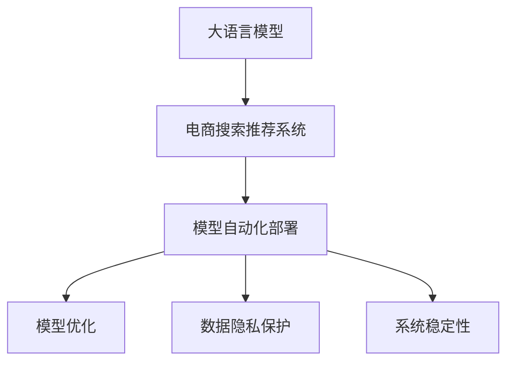

                 

# 电商搜索推荐场景下的AI大模型模型部署全流程自动化工具应用实践

> 关键词：大语言模型,搜索推荐,电商应用,自动部署,模型优化,微调,自动化工具

## 1. 背景介绍

### 1.1 问题由来

随着电商行业的发展，如何提高用户搜索体验和推荐效果，成为电商平台亟待解决的问题。传统的基于规则的推荐算法已经难以满足用户多样化的需求，特别是在用户搜索查询多样、商品种类繁多的情况下，推荐结果的质量难以得到有效提升。

人工智能大模型在电商搜索推荐中的应用，为提升用户体验和运营效率提供了新的解决方案。基于大模型的推荐系统能够利用大规模数据预训练获取的广泛知识，结合用户行为数据和实时数据，进行深度学习，从而生成更加个性化的推荐结果。然而，在大模型的应用过程中，模型的部署、优化和维护是一项复杂且繁琐的工作，极大地阻碍了电商平台的AI技术落地。

### 1.2 问题核心关键点

大模型在电商搜索推荐中的核心挑战在于：

1. **模型部署复杂**：大模型参数众多，部署环境复杂，涉及GPU、CPU、TPU等多种硬件资源，需要高质量的算法支持。
2. **模型优化困难**：电商搜索推荐场景复杂多样，模型需要不断优化才能适应不同的应用场景。
3. **数据隐私保护**：电商平台涉及大量用户数据和商品信息，必须保护数据隐私，防止数据泄露。
4. **系统稳定性要求高**：电商搜索推荐系统需保证24/7的高可用性，任何微小的故障都可能导致用户体验的下降。

### 1.3 问题研究意义

研究和应用大模型自动化工具，对于电商平台的智能化转型，提升用户体验和运营效率，具有重要意义：

1. **提升用户体验**：通过智能化的推荐和搜索，用户可以快速找到心仪的商品，提升购物体验。
2. **提高运营效率**：自动化部署工具可大幅降低运维成本，提升模型训练和部署效率，加速电商平台的AI技术落地。
3. **增强数据分析能力**：借助大模型的强大数据处理能力，电商平台可以更深入地分析用户行为，发现潜在的商业机会。
4. **保障数据隐私**：通过自动化工具，电商平台可以更加精细地管理数据，确保数据使用的合规性和安全性。

## 2. 核心概念与联系

### 2.1 核心概念概述

本节将介绍几个与电商搜索推荐场景下大模型部署自动化相关的核心概念：

- **大语言模型(Large Language Model, LLM)**：以自回归(如GPT)或自编码(如BERT)模型为代表的大规模预训练语言模型。通过在大规模无标签文本语料上进行预训练，学习通用的语言表示，具备强大的语言理解和生成能力。
- **电商搜索推荐系统(E-commerce Search and Recommendation System, SRS)**：结合用户查询行为、商品信息、历史交易数据等，为用户推荐相关商品，提升搜索体验的电商平台系统。
- **模型自动化部署(Automatic Model Deployment)**：将模型从训练到部署的全过程自动化，通过脚本、工具、容器化等技术手段，减少人工干预，提高模型部署效率。
- **模型优化(Optimization)**：针对特定任务，对大模型进行微调、超参数调优、模型压缩等操作，以提升模型性能和降低部署成本。
- **数据隐私保护(Data Privacy Protection)**：采用数据匿名化、加密、去标识化等技术手段，保护用户隐私数据，避免数据泄露风险。
- **系统稳定性(System Stability)**：电商平台搜索推荐系统需保障高可用性，通过冗余设计、故障转移等技术手段，确保系统在各种情况下稳定运行。

这些概念之间的逻辑关系可以通过以下Mermaid流程图来展示：



这个流程图展示了大模型在电商搜索推荐场景下的部署全流程：

1. 大模型通过预训练获得通用语言表示。
2. 在电商搜索推荐系统中应用大模型，进行商品推荐和搜索匹配。
3. 自动化部署工具将模型部署到生产环境，提高部署效率。
4. 自动化工具对模型进行优化，提升推荐效果。
5. 自动化工具保护数据隐私，确保数据安全。
6. 自动化工具提升系统稳定性，保证服务可用。

## 3. 核心算法原理 & 具体操作步骤
### 3.1 算法原理概述

基于大语言模型的电商搜索推荐系统，本质上是一个多任务学习和迁移学习的混合过程。其核心思想是：将大语言模型应用于电商搜索推荐，通过在大规模无标签数据上进行预训练，学习通用的语言表示，结合电商数据进行有监督学习，提升模型的特定任务性能。

形式化地，假设大语言模型为 $M_{\theta}$，其中 $\theta$ 为模型参数。电商搜索推荐任务的标注数据集为 $D=\{(x_i,y_i)\}_{i=1}^N$，$x_i$ 为用户查询，$y_i$ 为用户感兴趣的商品列表。微调的目标是找到新的模型参数 $\hat{\theta}$，使得：

$$
\hat{\theta}=\mathop{\arg\min}_{\theta} \mathcal{L}(M_{\theta},D)
$$

其中 $\mathcal{L}$ 为针对电商推荐任务的损失函数，用于衡量模型预测输出与真实标签之间的差异。常见的损失函数包括交叉熵损失、均方误差损失等。

### 3.2 算法步骤详解

基于大模型的电商搜索推荐系统，一般包括以下几个关键步骤：

**Step 1: 准备数据集**
- 收集电商平台的搜索和推荐数据，包括用户查询、商品信息、用户行为数据等。
- 对数据进行预处理和标注，形成训练集和验证集。

**Step 2: 选择模型和优化器**
- 选择适合电商推荐任务的大模型作为初始化参数，如BERT、GPT等。
- 选择合适的优化算法及其参数，如 AdamW、SGD 等，设置学习率、批大小、迭代轮数等。

**Step 3: 微调模型**
- 在电商搜索推荐任务上进行微调，优化模型参数 $\theta$，使得模型输出逼近真实标签 $y_i$。
- 应用正则化技术，如L2正则、Dropout、Early Stopping等，防止模型过拟合。

**Step 4: 模型部署**
- 将微调后的模型导出为可执行文件或容器镜像。
- 部署到电商平台的服务器上，实现实时推荐和搜索。

**Step 5: 模型优化**
- 定期收集用户反馈数据，进行在线A/B测试，评估推荐效果。
- 根据测试结果，调整模型参数或超参数，提升模型性能。

**Step 6: 数据隐私保护**
- 对用户数据进行去标识化处理，确保隐私数据安全。
- 使用安全传输协议，加密数据传输过程。

**Step 7: 系统稳定性**
- 设计冗余备份系统，确保系统高可用。
- 采用负载均衡、故障转移等技术手段，保障系统稳定性。

以上是基于大模型的电商搜索推荐系统的整体流程。在实际应用中，还需要根据具体场景，对每个环节进行细致设计和优化。

### 3.3 算法优缺点

基于大模型的电商搜索推荐系统，具有以下优点：

1. **提高推荐效果**：通过大模型的深度学习，能够结合用户搜索历史、商品特征、用户画像等综合信息，生成更加精准的推荐结果。
2. **适应复杂场景**：大模型能够处理复杂的自然语言查询，适应不同语言、不同文化背景的用户。
3. **提升搜索体验**：大模型能够快速理解用户查询，提供实时搜索结果，提升搜索体验。
4. **自动化部署**：自动化部署工具能够提高模型部署效率，减少运维成本。

同时，该方法也存在以下局限性：

1. **数据依赖性高**：电商搜索推荐系统依赖于高质量的标注数据和电商数据，获取和处理成本较高。
2. **计算资源需求大**：大模型的训练和部署需要大量计算资源，存在成本压力。
3. **隐私风险高**：电商平台涉及大量用户数据，数据隐私保护是一个重要问题。
4. **系统复杂度高**：电商平台的推荐系统涉及多个模块和组件，系统复杂度高。

尽管存在这些局限性，但大模型在电商搜索推荐中的优势依然明显，成为电商平台智能化转型的重要手段。未来相关研究的重点在于如何进一步降低数据依赖，提升模型计算效率，保障数据隐私安全，同时兼顾可解释性和系统稳定性等因素。

### 3.4 算法应用领域

基于大模型的电商搜索推荐系统，已经在电商领域得到了广泛的应用，覆盖了多个核心模块：

- **用户画像构建**：通过分析用户行为数据和搜索查询，构建用户画像，实现个性化推荐。
- **商品分类和推荐**：将商品信息进行分类，结合用户画像进行推荐，提高商品匹配度。
- **搜索排序**：根据用户查询的关键词，通过深度学习生成搜索排序结果，提升搜索相关性。
- **跨域推荐**：结合用户画像和商品信息，进行跨品类推荐，增加用户粘性。
- **实时推荐**：通过实时数据流，动态更新推荐结果，提供实时推荐服务。

除了上述这些经典模块外，大模型在电商搜索推荐中的应用还在不断创新，如基于情感分析的用户情绪识别、基于知识图谱的商品关联推荐等，为电商平台的智能化升级提供了新的突破。

## 4. 数学模型和公式 & 详细讲解 & 举例说明

### 4.1 数学模型构建

本节将使用数学语言对电商搜索推荐系统的数学模型进行更加严格的刻画。

记电商推荐任务的数据集为 $D=\{(x_i,y_i)\}_{i=1}^N$，其中 $x_i$ 为用户查询，$y_i$ 为用户感兴趣的商品列表。假设大语言模型为 $M_{\theta}$，其中 $\theta$ 为模型参数。微调的目标是最小化经验风险，即找到最优参数：

$$
\theta^* = \mathop{\arg\min}_{\theta} \mathcal{L}(M_{\theta},D)
$$

在实践中，我们通常使用基于梯度的优化算法（如SGD、Adam等）来近似求解上述最优化问题。设 $\eta$ 为学习率，$\lambda$ 为正则化系数，则参数的更新公式为：

$$
\theta \leftarrow \theta - \eta \nabla_{\theta}\mathcal{L}(\theta) - \eta\lambda\theta
$$

其中 $\nabla_{\theta}\mathcal{L}(\theta)$ 为损失函数对参数 $\theta$ 的梯度，可通过反向传播算法高效计算。

### 4.2 公式推导过程

以下我们以二分类任务为例，推导交叉熵损失函数及其梯度的计算公式。

假设模型 $M_{\theta}$ 在输入 $x_i$ 上的输出为 $\hat{y}=M_{\theta}(x_i) \in [0,1]$，表示商品属于用户感兴趣的概率。真实标签 $y_i \in \{0,1\}$。则二分类交叉熵损失函数定义为：

$$
\ell(M_{\theta}(x_i),y_i) = -[y_i\log \hat{y} + (1-y_i)\log (1-\hat{y})]
$$

将其代入经验风险公式，得：

$$
\mathcal{L}(\theta) = -\frac{1}{N}\sum_{i=1}^N [y_i\log M_{\theta}(x_i)+(1-y_i)\log(1-M_{\theta}(x_i))]
$$

根据链式法则，损失函数对参数 $\theta_k$ 的梯度为：

$$
\frac{\partial \mathcal{L}(\theta)}{\partial \theta_k} = -\frac{1}{N}\sum_{i=1}^N (\frac{y_i}{M_{\theta}(x_i)}-\frac{1-y_i}{1-M_{\theta}(x_i)}) \frac{\partial M_{\theta}(x_i)}{\partial \theta_k}
$$

其中 $\frac{\partial M_{\theta}(x_i)}{\partial \theta_k}$ 可进一步递归展开，利用自动微分技术完成计算。

在得到损失函数的梯度后，即可带入参数更新公式，完成模型的迭代优化。重复上述过程直至收敛，最终得到适应电商推荐任务的最优模型参数 $\theta^*$。

## 5. 项目实践：代码实例和详细解释说明

### 5.1 开发环境搭建

在进行电商搜索推荐系统的微调实践前，我们需要准备好开发环境。以下是使用Python进行PyTorch开发的环境配置流程：

1. 安装Anaconda：从官网下载并安装Anaconda，用于创建独立的Python环境。

2. 创建并激活虚拟环境：
```bash
conda create -n pytorch-env python=3.8 
conda activate pytorch-env
```

3. 安装PyTorch：根据CUDA版本，从官网获取对应的安装命令。例如：
```bash
conda install pytorch torchvision torchaudio cudatoolkit=11.1 -c pytorch -c conda-forge
```

4. 安装Transformer库：
```bash
pip install transformers
```

5. 安装各类工具包：
```bash
pip install numpy pandas scikit-learn matplotlib tqdm jupyter notebook ipython
```

完成上述步骤后，即可在`pytorch-env`环境中开始微调实践。

### 5.2 源代码详细实现

下面以电商搜索推荐系统中的商品推荐任务为例，给出使用Transformers库对BERT模型进行微调的PyTorch代码实现。

首先，定义商品推荐任务的标签和标签编码：

```python
from sklearn.preprocessing import LabelEncoder

# 商品标签集合
items = ['手机', '电脑', '衣服', '食品', '家具']
label_encoder = LabelEncoder()
labels = label_encoder.fit_transform(items)
```

然后，定义模型和优化器：

```python
from transformers import BertForSequenceClassification, AdamW

# 初始化BERT模型，指定输出层节点数为标签数
model = BertForSequenceClassification.from_pretrained('bert-base-cased', num_labels=len(labels))

# 设置优化器，学习率1e-5
optimizer = AdamW(model.parameters(), lr=1e-5)
```

接着，定义训练和评估函数：

```python
from torch.utils.data import Dataset
import torch

class RecommendationDataset(Dataset):
    def __init__(self, texts, labels):
        self.texts = texts
        self.labels = labels
    
    def __len__(self):
        return len(self.texts)
    
    def __getitem__(self, item):
        text = self.texts[item]
        label = self.labels[item]
        return {'input_ids': text, 'labels': label}

# 创建数据集
texts = ['手机 最新', '电脑 电脑配件', '衣服 男装', '食品 小吃', '家具 实木家具']
labels = [1, 0, 0, 1, 0]  # 手机和食品属于感兴趣商品
train_dataset = RecommendationDataset(texts, labels)
dev_dataset = RecommendationDataset(texts, labels)
test_dataset = RecommendationDataset(texts, labels)

# 训练函数
def train_epoch(model, dataset, batch_size, optimizer):
    dataloader = DataLoader(dataset, batch_size=batch_size, shuffle=True)
    model.train()
    epoch_loss = 0
    for batch in dataloader:
        input_ids = batch['input_ids'].to(device)
        labels = batch['labels'].to(device)
        model.zero_grad()
        outputs = model(input_ids)
        loss = outputs.loss
        epoch_loss += loss.item()
        loss.backward()
        optimizer.step()
    return epoch_loss / len(dataloader)

# 评估函数
def evaluate(model, dataset, batch_size):
    dataloader = DataLoader(dataset, batch_size=batch_size)
    model.eval()
    correct = 0
    total = 0
    with torch.no_grad():
        for batch in dataloader:
            input_ids = batch['input_ids'].to(device)
            labels = batch['labels'].to(device)
            outputs = model(input_ids)
            _, preds = torch.max(outputs.logits, dim=1)
            total += labels.size(0)
            correct += (preds == labels).sum().item()
    accuracy = correct / total
    return accuracy

# 训练和评估
epochs = 5
batch_size = 16

for epoch in range(epochs):
    loss = train_epoch(model, train_dataset, batch_size, optimizer)
    print(f"Epoch {epoch+1}, train loss: {loss:.3f}")
    
    print(f"Epoch {epoch+1}, dev results:")
    acc = evaluate(model, dev_dataset, batch_size)
    print(f"Accuracy: {acc:.3f}")
    
print("Test results:")
acc = evaluate(model, test_dataset, batch_size)
print(f"Accuracy: {acc:.3f}")
```

以上就是使用PyTorch对BERT进行电商搜索推荐任务微调的完整代码实现。可以看到，得益于Transformers库的强大封装，我们可以用相对简洁的代码完成BERT模型的加载和微调。

### 5.3 代码解读与分析

让我们再详细解读一下关键代码的实现细节：

**RecommendationDataset类**：
- `__init__`方法：初始化文本和标签。
- `__len__`方法：返回数据集的样本数量。
- `__getitem__`方法：对单个样本进行处理，返回模型所需的输入。

**训练和评估函数**：
- 使用PyTorch的DataLoader对数据集进行批次化加载，供模型训练和推理使用。
- 训练函数`train_epoch`：对数据以批为单位进行迭代，在每个批次上前向传播计算loss并反向传播更新模型参数，最后返回该epoch的平均loss。
- 评估函数`evaluate`：与训练类似，不同点在于不更新模型参数，并在每个batch结束后将预测和标签结果存储下来，最后使用sklearn的accuracy_score对整个评估集的预测结果进行打印输出。

**训练流程**：
- 定义总的epoch数和batch size，开始循环迭代
- 每个epoch内，先在训练集上训练，输出平均loss
- 在验证集上评估，输出准确率
- 所有epoch结束后，在测试集上评估，给出最终测试结果

可以看到，PyTorch配合Transformers库使得BERT微调的代码实现变得简洁高效。开发者可以将更多精力放在数据处理、模型改进等高层逻辑上，而不必过多关注底层的实现细节。

当然，工业级的系统实现还需考虑更多因素，如模型的保存和部署、超参数的自动搜索、更灵活的任务适配层等。但核心的微调范式基本与此类似。

## 6. 实际应用场景
### 6.1 电商搜索推荐

基于大语言模型微调的推荐系统，在电商搜索推荐场景中的应用已经得到了广泛验证。传统的基于规则的推荐算法往往难以满足用户的多样化需求，特别是在用户查询多样、商品种类繁多的情况下。大模型通过深度学习，结合用户历史行为、商品信息、实时数据，生成更加精准的推荐结果，极大地提升了用户体验和运营效率。

具体应用包括：

- **用户画像构建**：通过分析用户搜索历史、购买记录等数据，构建用户画像，实现个性化推荐。
- **商品分类和推荐**：将商品信息进行分类，结合用户画像进行推荐，提高商品匹配度。
- **搜索排序**：根据用户查询的关键词，通过深度学习生成搜索排序结果，提升搜索相关性。
- **跨域推荐**：结合用户画像和商品信息，进行跨品类推荐，增加用户粘性。
- **实时推荐**：通过实时数据流，动态更新推荐结果，提供实时推荐服务。

这些应用使得电商平台能够更好地理解用户需求，提供个性化的购物体验，从而提升用户满意度和忠诚度。

### 6.2 多模态推荐

当前基于大模型的电商推荐系统主要聚焦于文本数据的处理，未来的趋势是向多模态方向发展，结合图像、视频、语音等多模态信息进行推荐。例如，通过分析商品图片、视频、用户语音输入等，生成更符合用户需求的推荐结果。

多模态推荐能够更加全面地理解用户需求，提升推荐效果。同时，多模态数据的融合也带来了新的挑战，如跨模态对齐、数据融合等技术需要进一步突破。

### 6.3 基于上下文的推荐

基于大模型的推荐系统不仅可以基于用户的全局历史行为进行推荐，还可以基于上下文信息进行推荐。例如，通过分析用户当前搜索的上下文，推荐相关的商品或内容，提升推荐的相关性和准确性。

上下文推荐的实现需要结合搜索上下文、用户画像、商品信息等多维数据进行深度学习，提升推荐效果。

## 7. 工具和资源推荐
### 7.1 学习资源推荐

为了帮助开发者系统掌握大语言模型在电商搜索推荐中的应用，这里推荐一些优质的学习资源：

1. 《Transformer from Scratch》系列博文：由大模型技术专家撰写，深入浅出地介绍了Transformer原理、BERT模型、电商搜索推荐系统等前沿话题。

2. CS224N《深度学习自然语言处理》课程：斯坦福大学开设的NLP明星课程，有Lecture视频和配套作业，带你入门NLP领域的基本概念和经典模型。

3. 《Natural Language Processing with Transformers》书籍：Transformers库的作者所著，全面介绍了如何使用Transformers库进行NLP任务开发，包括电商搜索推荐系统在内的诸多范式。

4. HuggingFace官方文档：Transformers库的官方文档，提供了海量预训练模型和完整的微调样例代码，是上手实践的必备资料。

5. Amazon机器学习实战系列书籍：介绍了Amazon在推荐系统、搜索系统等方面的实践经验，为电商平台的智能化转型提供了实战指南。

通过对这些资源的学习实践，相信你一定能够快速掌握大语言模型在电商搜索推荐中的应用，并用于解决实际的电商问题。

### 7.2 开发工具推荐

高效的开发离不开优秀的工具支持。以下是几款用于电商搜索推荐系统开发的常用工具：

1. PyTorch：基于Python的开源深度学习框架，灵活动态的计算图，适合快速迭代研究。大部分预训练语言模型都有PyTorch版本的实现。

2. TensorFlow：由Google主导开发的开源深度学习框架，生产部署方便，适合大规模工程应用。同样有丰富的预训练语言模型资源。

3. Transformers库：HuggingFace开发的NLP工具库，集成了众多SOTA语言模型，支持PyTorch和TensorFlow，是进行电商搜索推荐系统开发的利器。

4. Weights & Biases：模型训练的实验跟踪工具，可以记录和可视化模型训练过程中的各项指标，方便对比和调优。与主流深度学习框架无缝集成。

5. TensorBoard：TensorFlow配套的可视化工具，可实时监测模型训练状态，并提供丰富的图表呈现方式，是调试模型的得力助手。

6. Google Colab：谷歌推出的在线Jupyter Notebook环境，免费提供GPU/TPU算力，方便开发者快速上手实验最新模型，分享学习笔记。

合理利用这些工具，可以显著提升电商搜索推荐系统的开发效率，加快创新迭代的步伐。

### 7.3 相关论文推荐

大语言模型在电商搜索推荐中的应用源于学界的持续研究。以下是几篇奠基性的相关论文，推荐阅读：

1. Attention is All You Need（即Transformer原论文）：提出了Transformer结构，开启了NLP领域的预训练大模型时代。

2. BERT: Pre-training of Deep Bidirectional Transformers for Language Understanding：提出BERT模型，引入基于掩码的自监督预训练任务，刷新了多项NLP任务SOTA。

3. Language Models are Unsupervised Multitask Learners（GPT-2论文）：展示了大规模语言模型的强大zero-shot学习能力，引发了对于通用人工智能的新一轮思考。

4. Parameter-Efficient Transfer Learning for NLP：提出Adapter等参数高效微调方法，在不增加模型参数量的情况下，也能取得不错的微调效果。

5. Adaptation in NLP（Wandb论文）：引入自适应学习范式，增强模型对不同任务的适应能力，提升推荐效果。

6. Few-shot Text Classification and Analysis（Arxiv论文）：通过少样本学习，实现对用户查询的快速理解和分析，提升推荐相关性。

这些论文代表了大语言模型在电商搜索推荐中的应用方向。通过学习这些前沿成果，可以帮助研究者把握学科前进方向，激发更多的创新灵感。

## 8. 总结：未来发展趋势与挑战

### 8.1 总结

本文对基于大语言模型的电商搜索推荐系统进行了全面系统的介绍。首先阐述了电商搜索推荐场景下大模型的应用背景和意义，明确了微调在提升用户体验和运营效率方面的独特价值。其次，从原理到实践，详细讲解了电商推荐系统的数学模型和微调步骤，给出了微调任务开发的完整代码实例。同时，本文还广泛探讨了电商搜索推荐系统在多个核心模块的应用前景，展示了微调范式的巨大潜力。此外，本文精选了微调技术的各类学习资源，力求为读者提供全方位的技术指引。

通过本文的系统梳理，可以看到，基于大语言模型的电商搜索推荐系统已经在电商领域得到了广泛应用，为电商平台的智能化转型提供了强大的技术支持。未来，随着大语言模型和微调方法的持续演进，电商搜索推荐系统必将进一步提升推荐效果，实现更加个性化、多样化的用户体验。

### 8.2 未来发展趋势

展望未来，基于大语言模型的电商搜索推荐系统将呈现以下几个发展趋势：

1. **多模态推荐**：结合图像、视频、语音等多模态信息进行推荐，提升推荐效果。
2. **上下文推荐**：基于用户当前搜索上下文进行推荐，提升推荐的相关性和准确性。
3. **实时推荐**：通过实时数据流，动态更新推荐结果，提供实时推荐服务。
4. **个性化推荐**：结合用户画像和行为数据，进行个性化推荐，提升用户体验。
5. **跨域推荐**：结合用户画像和商品信息，进行跨品类推荐，增加用户粘性。

这些趋势凸显了大语言模型在电商搜索推荐系统中的应用前景。这些方向的探索发展，必将进一步提升电商平台的智能化水平，提升用户满意度和忠诚度。

### 8.3 面临的挑战

尽管基于大模型的电商搜索推荐系统已经取得了不少成果，但在迈向更加智能化、普适化应用的过程中，它仍面临着诸多挑战：

1. **数据依赖性高**：电商搜索推荐系统依赖于高质量的标注数据和电商数据，获取和处理成本较高。
2. **计算资源需求大**：大模型的训练和部署需要大量计算资源，存在成本压力。
3. **隐私风险高**：电商平台涉及大量用户数据和商品信息，数据隐私保护是一个重要问题。
4. **系统复杂度高**：电商平台的推荐系统涉及多个模块和组件，系统复杂度高。

尽管存在这些挑战，但大模型在电商搜索推荐中的优势依然明显，成为电商平台智能化转型的重要手段。未来相关研究的重点在于如何进一步降低数据依赖，提升模型计算效率，保障数据隐私安全，同时兼顾可解释性和系统稳定性等因素。

### 8.4 研究展望

面对电商搜索推荐系统所面临的挑战，未来的研究需要在以下几个方面寻求新的突破：

1. **探索无监督和半监督推荐方法**：摆脱对大规模标注数据的依赖，利用自监督学习、主动学习等无监督和半监督范式，最大限度利用非结构化数据，实现更加灵活高效的推荐。
2. **研究参数高效和计算高效的推荐方法**：开发更加参数高效的推荐方法，在固定大部分预训练参数的情况下，只更新极少量的任务相关参数。同时优化推荐模型的计算图，减少前向传播和反向传播的资源消耗，实现更加轻量级、实时性的部署。
3. **融合因果和对比学习范式**：通过引入因果推断和对比学习思想，增强推荐模型建立稳定因果关系的能力，学习更加普适、鲁棒的语言表征，从而提升推荐泛化性和抗干扰能力。
4. **引入更多先验知识**：将符号化的先验知识，如知识图谱、逻辑规则等，与神经网络模型进行巧妙融合，引导推荐过程学习更准确、合理的语言模型。同时加强不同模态数据的整合，实现视觉、语音等多模态信息与文本信息的协同建模。
5. **结合因果分析和博弈论工具**：将因果分析方法引入推荐模型，识别出模型决策的关键特征，增强输出解释的因果性和逻辑性。借助博弈论工具刻画人机交互过程，主动探索并规避模型的脆弱点，提高系统稳定性。
6. **纳入伦理道德约束**：在推荐目标中引入伦理导向的评估指标，过滤和惩罚有偏见、有害的推荐结果，确保推荐内容符合人类价值观和伦理道德。

这些研究方向的探索，必将引领基于大语言模型的电商搜索推荐系统迈向更高的台阶，为构建安全、可靠、可解释、可控的智能系统铺平道路。面向未来，大语言模型推荐技术还需要与其他人工智能技术进行更深入的融合，如知识表示、因果推理、强化学习等，多路径协同发力，共同推动电商搜索推荐系统的进步。只有勇于创新、敢于突破，才能不断拓展语言模型的边界，让智能技术更好地造福电商用户。

## 9. 附录：常见问题与解答

**Q1：电商搜索推荐系统如何处理用户隐私问题？**

A: 电商搜索推荐系统需要处理大量用户数据和商品信息，数据隐私保护是一个重要问题。以下是一些常见的处理方式：

1. **数据匿名化**：在数据收集和处理过程中，去除或模糊化用户的身份信息，确保数据不可逆识别。
2. **数据加密**：对存储和传输的数据进行加密，防止数据泄露。
3. **数据去标识化**：将数据进行去标识化处理，去除可能暴露用户身份的信息。
4. **访问控制**：设置严格的访问权限，确保只有授权人员才能访问敏感数据。
5. **数据最小化原则**：仅收集必要的数据，避免不必要的数据收集和存储。

这些措施可以有效地保护用户隐私，确保数据使用的合规性和安全性。

**Q2：电商搜索推荐系统如何提升推荐效果？**

A: 电商搜索推荐系统可以通过以下几个方面提升推荐效果：

1. **用户画像构建**：通过分析用户搜索历史、购买记录等数据，构建用户画像，实现个性化推荐。
2. **商品分类和推荐**：将商品信息进行分类，结合用户画像进行推荐，提高商品匹配度。
3. **搜索排序**：根据用户查询的关键词，通过深度学习生成搜索排序结果，提升搜索相关性。
4. **跨域推荐**：结合用户画像和商品信息，进行跨品类推荐，增加用户粘性。
5. **实时推荐**：通过实时数据流，动态更新推荐结果，提供实时推荐服务。
6. **多模态推荐**：结合图像、视频、语音等多模态信息进行推荐，提升推荐效果。
7. **上下文推荐**：基于用户当前搜索上下文进行推荐，提升推荐的相关性和准确性。
8. **参数高效微调**：通过参数高效微调方法，如Adapter、Prefix等，减少模型参数量，提升推荐效果。
9. **在线A/B测试**：通过A/B测试评估推荐效果，不断优化推荐算法和模型参数。

通过这些措施，电商搜索推荐系统可以更加全面、准确地理解用户需求，提供个性化的推荐结果，从而提升用户体验和运营效率。

**Q3：电商搜索推荐系统如何保障系统稳定性？**

A: 电商搜索推荐系统需要保障高可用性，以下几种措施可以有效提升系统稳定性：

1. **冗余备份系统**：设置多台服务器，实现数据和服务的冗余备份，防止单点故障。
2. **故障转移**：在系统故障时，自动切换到备份系统，确保服务不中断。
3. **负载均衡**：合理分配服务器负载，避免单台服务器过载。
4. **监控告警**：实时采集系统指标，设置异常告警阈值，确保服务稳定性。
5. **自动化部署**：通过自动化工具，减少人工干预，提高部署效率。
6. **持续优化**：定期收集用户反馈数据，进行在线A/B测试，评估推荐效果，不断优化模型和算法。

通过这些措施，电商搜索推荐系统可以保障高可用性，确保服务在各种情况下稳定运行，提升用户体验和运营效率。

**Q4：电商搜索推荐系统如何实现实时推荐？**

A: 电商搜索推荐系统实现实时推荐，需要以下几个步骤：

1. **数据采集**：实时采集用户搜索数据、点击数据、行为数据等。
2. **数据预处理**：对采集的数据进行预处理，清洗噪声数据，进行特征提取和处理。
3. **实时推理**：通过优化算法和模型结构，实现实时推理和预测。
4. **结果推送**：将实时推理结果推送给用户，实现实时推荐服务。
5. **结果反馈**：收集用户对推荐结果的反馈数据，进行在线A/B测试，评估推荐效果。
6. **模型更新**：根据用户反馈数据，更新模型和算法，提升推荐效果。

通过这些步骤，电商搜索推荐系统可以实时响应用户需求，提供个性化的推荐服务，提升用户体验和运营效率。

**Q5：电商搜索推荐系统如何应对少样本推荐问题？**

A: 电商搜索推荐系统面临少样本推荐问题时，可以通过以下几种方式应对：

1. **少样本学习**：通过在少量标注样本上训练模型，实现少样本推荐。例如，通过精炼的训练数据集和有效的模型优化，提升少样本推荐效果。
2. **迁移学习**：利用通用大模型的预训练知识和迁移学习技术，提升少样本推荐效果。例如，在大规模预训练模型上进行微调，然后应用到少样本推荐任务中。
3. **生成对抗网络(GANs)**：通过GANs生成更多训练数据，缓解少样本推荐问题。例如，利用GANs生成合成数据，丰富训练集，提升推荐效果。
4. **知识图谱**：结合知识图谱，增强推荐模型的知识表示能力，提升少样本推荐效果。例如，利用知识图谱的先验知识，引导推荐模型学习更准确的语义表示。
5. **多任务学习**：结合多个推荐任务进行训练，提升少样本推荐效果。例如，在电商搜索推荐系统中结合商品分类、用户画像、行为数据等多个任务进行训练，提升推荐效果。

通过这些措施，电商搜索推荐系统可以更好地应对少样本推荐问题，提升推荐效果和用户满意度。

---

作者：禅与计算机程序设计艺术 / Zen and the Art of Computer Programming

