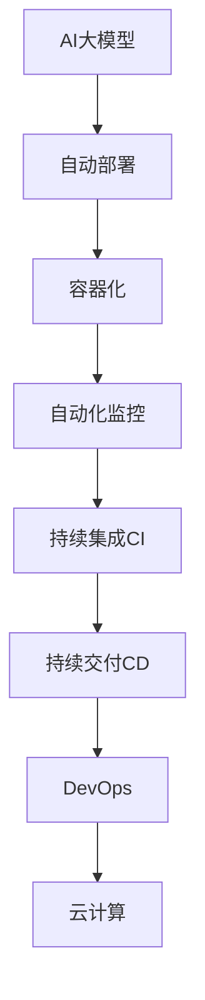

                 

# 电商搜索推荐场景下的AI大模型模型部署全流程自动化平台搭建

> 关键词：电商搜索推荐,大模型,自动部署,流程自动化,搜索系统,推荐系统,API接口,云计算,容器化,DevOps,开源社区,持续集成,持续交付

## 1. 背景介绍

### 1.1 问题由来
随着电商行业的发展，消费者对个性化、高效、精准的搜索推荐体验有了更高的期待。传统电商搜索推荐系统依赖人工规则和少量标注数据，难以实现高精度的个性化推荐，且随着数据量的爆炸式增长，系统维护和升级成本也变得愈发高昂。

面对这一挑战，AI大模型成为了电商搜索推荐场景中的重要工具。预训练大模型，如BERT、GPT等，通过海量无标签文本数据的自监督预训练，学习到丰富的语言知识和表征能力，能够有效提升推荐系统的个性化和效率。

但大模型的部署和应用涉及大量模型参数和计算资源，传统手工搭建、调试、部署流程效率低下，且存在重复劳动、错误率高、维护成本高等问题。为解决这些问题，电商搜索推荐系统亟需构建一个AI大模型模型部署全流程自动化平台，实现模型训练、验证、评估、部署、监控等环节的自动化管理，大幅提升平台运行效率和用户满意度。

### 1.2 问题核心关键点
构建AI大模型模型部署全流程自动化平台，核心在于实现以下关键点：

- **自动化模型训练与微调**：自动化设计模型训练与微调流程，减少人工参与，降低错误率，提高模型训练效率。
- **自动化部署与上线**：自动化构建、打包、部署模型及其依赖资源，确保模型快速上线，满足电商系统的实时性需求。
- **自动化监控与运维**：自动化监控模型运行状态和系统性能，及时发现和处理异常，确保模型稳定运行。
- **自动化版本管理与迭代**：自动化管理模型版本，追踪迭代进展，方便用户随时查看和回滚。
- **可视化管理与分析**：提供可视化工具，方便用户直观了解模型性能和应用效果，进行模型优化。

## 2. 核心概念与联系

### 2.1 核心概念概述

为更好地理解AI大模型模型部署全流程自动化平台，本节将介绍几个密切相关的核心概念：

- **AI大模型**：以自回归模型(如GPT)或自编码模型(如BERT)为代表的大规模预训练语言模型。通过在大规模无标签文本语料上进行预训练，学习到丰富的语言知识和常识，具备强大的语言理解和生成能力。

- **自动部署**：通过自动化工具和流程，实现模型及其依赖资源的打包、部署和上线，以减少手工操作，提升部署效率。

- **自动化监控**：通过自动化工具和流程，实时监控模型运行状态和系统性能，及时发现异常和问题，确保系统稳定运行。

- **持续集成(CI)**：通过自动化流程，将模型训练、测试、部署和监控等环节集成起来，提高开发效率，缩短发布周期。

- **持续交付(CD)**：通过自动化流程，快速发布和部署模型到生产环境，提高服务可用性，满足用户需求。

- **DevOps**：结合软件开发和运维的实践，通过自动化和工具化手段，优化软件开发和运维流程，提升交付效率和系统稳定性。

- **容器化**：将模型及其依赖资源封装到容器中，确保模型环境的一致性，方便跨环境部署和运维。

- **云计算**：通过云平台提供的计算、存储和网络资源，实现资源的按需使用和弹性伸缩，降低系统维护成本。

这些核心概念之间的逻辑关系可以通过以下Mermaid流程图来展示：



这个流程图展示了大模型部署全流程自动化平台的各个环节及其关系：

1. AI大模型通过自动化流程进行训练与微调，生成中间模型。
2. 中间模型通过容器化进行打包和部署，自动化部署到云计算平台。
3. 部署后的模型通过自动化监控进行实时监控，确保系统稳定运行。
4. 结合持续集成和持续交付，将模型训练、测试、部署和监控等环节集成，提升开发和交付效率。
5. DevOps实践则通过自动化和工具化手段，优化整个开发和运维流程。
6. 云计算平台提供弹性资源支持，降低系统维护成本。

## 3. 核心算法原理 & 具体操作步骤

### 3.1 算法原理概述

AI大模型模型部署全流程自动化平台，从本质上是一个结合了模型训练、自动化部署、监控、持续集成、持续交付和DevOps的集成系统。其核心思想是通过自动化工具和流程，将模型训练与微调、部署与上线、监控与运维等各个环节串联起来，实现全流程的自动化管理，提升整体运行效率和系统稳定性。

### 3.2 算法步骤详解

#### 3.2.1 自动化模型训练与微调

1. **选择合适的预训练模型**：根据电商搜索推荐场景的需求，选择适合的预训练大模型，如BERT、GPT等。
2. **数据准备**：收集电商领域相关的文本数据，如商品描述、用户评论、点击记录等，准备训练集和验证集。
3. **微调流程设计**：设计微调流程，包括选择优化算法、设置超参数、添加任务适配层等。
4. **自动化微调执行**：使用自动化工具(如Kubeflow)，执行微调流程，自动获取数据、配置资源、启动训练、保存模型等。

#### 3.2.2 自动化部署与上线

1. **模型封装与打包**：将微调后的模型封装为容器镜像，使用Docker构建镜像文件。
2. **自动化部署流程**：使用自动化部署工具(如Jenkins)，触发模型部署流程，自动拉取镜像、部署应用、配置资源等。
3. **部署后验证与测试**：部署后，自动化工具自动进行模型验证和测试，确保模型能够正常工作。

#### 3.2.3 自动化监控与运维

1. **监控指标设置**：根据电商系统需求，设置监控指标，如响应时间、错误率、请求量等。
2. **监控工具集成**：集成监控工具(如Prometheus、Grafana)，实时监控模型运行状态和系统性能。
3. **异常处理与告警**：设置异常处理和告警机制，及时发现和处理系统异常。

#### 3.2.4 自动化版本管理与迭代

1. **版本管理工具**：使用版本管理工具(如GitLab)，管理模型版本，记录迭代进展。
2. **自动发布与回滚**：设置自动发布与回滚机制，方便用户随时查看和回滚不同版本。

#### 3.2.5 可视化管理与分析

1. **可视化工具集成**：集成可视化工具(如Kibana、Tableau)，提供模型性能和应用效果的直观展示。
2. **模型优化建议**：根据可视化结果，自动生成模型优化建议，帮助用户进行模型优化。

### 3.3 算法优缺点

AI大模型模型部署全流程自动化平台具有以下优点：

- **效率提升**：通过自动化流程，大幅减少手工操作，提升模型训练、部署、监控等环节的效率。
- **稳定性增强**：自动化流程减少人为操作错误，确保模型运行稳定性和可靠性。
- **成本降低**：自动化部署和运维，降低人力成本和系统维护成本。
- **质量保证**：自动化流程进行质量控制，保证模型的一致性和正确性。

同时，该平台也存在以下局限性：

- **复杂性高**：自动化平台涉及多个环节和工具，搭建和维护复杂。
- **资源需求大**：大模型部署需要高性能计算资源，对云计算平台的要求较高。
- **依赖环境多**：需要依赖多种自动化工具和框架，维护和更新难度较大。

尽管存在这些局限性，但就目前而言，AI大模型模型部署全流程自动化平台是实现大模型在电商搜索推荐场景下高效应用的必要手段。未来相关研究的方向在于进一步简化平台搭建流程，降低对资源和工具的依赖，提升平台的可维护性和可扩展性。

### 3.4 算法应用领域

AI大模型模型部署全流程自动化平台已经在电商搜索推荐系统、智能客服、金融风控、医疗诊断等多个领域得到了应用，提升了模型的运行效率和用户体验。

- **电商搜索推荐系统**：通过自动化的流程和工具，快速搭建和部署电商搜索推荐模型，实现个性化推荐，提升用户体验。
- **智能客服系统**：自动化部署智能客服模型，实现7x24小时不间断服务，提升客户满意度。
- **金融风控系统**：自动化部署金融风控模型，实时监控风险，保障资金安全。
- **医疗诊断系统**：自动化部署医疗诊断模型，快速诊断疾病，提升医疗服务效率。

除了上述这些经典应用外，大模型部署自动化平台还被创新性地应用到更多场景中，如可控文本生成、常识推理、代码生成、数据增强等，为电商搜索推荐场景的智能应用带来了新的突破。

## 4. 数学模型和公式 & 详细讲解 & 举例说明

### 4.1 数学模型构建

本节将使用数学语言对AI大模型模型部署全流程自动化平台的构建进行更加严格的刻画。

记电商搜索推荐模型为 $M_{\theta}$，其中 $\theta$ 为模型参数。假设电商领域相关的文本数据为 $D=\{(x_i, y_i)\}_{i=1}^N$，其中 $x_i$ 为输入文本，$y_i$ 为标签。

定义模型 $M_{\theta}$ 在输入 $x$ 上的损失函数为 $\ell(M_{\theta}(x),y)$，则在数据集 $D$ 上的经验风险为：

$$
\mathcal{L}(\theta) = \frac{1}{N} \sum_{i=1}^N \ell(M_{\theta}(x_i),y_i)
$$

其中 $\ell$ 为电商搜索推荐任务的损失函数，如交叉熵损失、均方误差损失等。

微调的优化目标是最小化经验风险，即找到最优参数：

$$
\theta^* = \mathop{\arg\min}_{\theta} \mathcal{L}(\theta)
$$

在实践中，我们通常使用基于梯度的优化算法（如SGD、Adam等）来近似求解上述最优化问题。设 $\eta$ 为学习率，$\lambda$ 为正则化系数，则参数的更新公式为：

$$
\theta \leftarrow \theta - \eta \nabla_{\theta}\mathcal{L}(\theta) - \eta\lambda\theta
$$

其中 $\nabla_{\theta}\mathcal{L}(\theta)$ 为损失函数对参数 $\theta$ 的梯度，可通过反向传播算法高效计算。

### 4.2 公式推导过程

以下我们以电商搜索推荐模型为例，推导交叉熵损失函数及其梯度的计算公式。

假设模型 $M_{\theta}$ 在输入 $x$ 上的输出为 $\hat{y}=M_{\theta}(x) \in [0,1]$，表示商品是否被点击的概率。真实标签 $y \in \{0,1\}$。则二分类交叉熵损失函数定义为：

$$
\ell(M_{\theta}(x),y) = -[y\log \hat{y} + (1-y)\log (1-\hat{y})]
$$

将其代入经验风险公式，得：

$$
\mathcal{L}(\theta) = -\frac{1}{N}\sum_{i=1}^N [y_i\log M_{\theta}(x_i)+(1-y_i)\log(1-M_{\theta}(x_i))]
$$

根据链式法则，损失函数对参数 $\theta_k$ 的梯度为：

$$
\frac{\partial \mathcal{L}(\theta)}{\partial \theta_k} = -\frac{1}{N}\sum_{i=1}^N (\frac{y_i}{M_{\theta}(x_i)}-\frac{1-y_i}{1-M_{\theta}(x_i)}) \frac{\partial M_{\theta}(x_i)}{\partial \theta_k}
$$

其中 $\frac{\partial M_{\theta}(x_i)}{\partial \theta_k}$ 可进一步递归展开，利用自动微分技术完成计算。

在得到损失函数的梯度后，即可带入参数更新公式，完成模型的迭代优化。重复上述过程直至收敛，最终得到适应电商搜索推荐任务的最优模型参数 $\theta^*$。

## 5. 项目实践：代码实例和详细解释说明

### 5.1 开发环境搭建

在进行模型部署实践前，我们需要准备好开发环境。以下是使用Python进行Kubeflow和Jenkins搭建开发环境的流程：

1. 安装Anaconda：从官网下载并安装Anaconda，用于创建独立的Python环境。

2. 创建并激活虚拟环境：
```bash
conda create -n kf-env python=3.8 
conda activate kf-env
```

3. 安装Kubeflow：从官网下载并安装Kubeflow，用于构建模型训练、验证、部署等自动化流程。

4. 安装Jenkins：从官网下载并安装Jenkins，用于自动化部署和监控流程。

5. 安装Docker：从官网下载并安装Docker，用于构建和部署容器镜像。

完成上述步骤后，即可在`kf-env`环境中开始自动化平台搭建实践。

### 5.2 源代码详细实现

下面我们以电商搜索推荐系统为例，给出使用Kubeflow和Jenkins搭建AI大模型模型部署全流程自动化平台的PyTorch代码实现。

首先，定义电商搜索推荐模型的训练和验证函数：

```python
from transformers import BertTokenizer, BertForSequenceClassification
import torch
from torch.utils.data import Dataset, DataLoader
from sklearn.metrics import accuracy_score

class SearchDataset(Dataset):
    def __init__(self, texts, labels):
        self.texts = texts
        self.labels = labels
        self.tokenizer = BertTokenizer.from_pretrained('bert-base-cased')
        
    def __len__(self):
        return len(self.texts)
    
    def __getitem__(self, item):
        text = self.texts[item]
        label = self.labels[item]
        
        encoding = self.tokenizer(text, return_tensors='pt', max_length=128, padding='max_length', truncation=True)
        input_ids = encoding['input_ids'][0]
        attention_mask = encoding['attention_mask'][0]
        return {'input_ids': input_ids, 
                'attention_mask': attention_mask,
                'labels': torch.tensor(label, dtype=torch.long)}
                
def train_model(model, train_dataset, val_dataset, epochs=3, batch_size=16, learning_rate=2e-5):
    model.train()
    for epoch in range(epochs):
        train_loss = 0
        train_acc = 0
        for batch in DataLoader(train_dataset, batch_size=batch_size, shuffle=True):
            input_ids = batch['input_ids'].to(device)
            attention_mask = batch['attention_mask'].to(device)
            labels = batch['labels'].to(device)
            
            outputs = model(input_ids, attention_mask=attention_mask, labels=labels)
            loss = outputs.loss
            train_loss += loss.item()
            logits = outputs.logits
            predicted_labels = torch.argmax(logits, dim=1)
            train_acc += accuracy_score(predicted_labels, labels)
        
        train_loss /= len(train_dataset)
        train_acc /= len(train_dataset)
        print(f'Epoch {epoch+1}, train loss: {train_loss:.4f}, train acc: {train_acc:.4f}')
        
        model.eval()
        val_loss = 0
        val_acc = 0
        for batch in DataLoader(val_dataset, batch_size=batch_size, shuffle=False):
            input_ids = batch['input_ids'].to(device)
            attention_mask = batch['attention_mask'].to(device)
            labels = batch['labels'].to(device)
            
            with torch.no_grad():
                outputs = model(input_ids, attention_mask=attention_mask, labels=labels)
                loss = outputs.loss
                val_loss += loss.item()
                logits = outputs.logits
                predicted_labels = torch.argmax(logits, dim=1)
                val_acc += accuracy_score(predicted_labels, labels)
        
        val_loss /= len(val_dataset)
        val_acc /= len(val_dataset)
        print(f'Epoch {epoch+1}, val loss: {val_loss:.4f}, val acc: {val_acc:.4f}')
        if val_acc >= 0.95:
            break
    return model
```

然后，定义模型训练和验证流程的Kubeflow Pipeline：

```python
from kubeflow.pipelines import Pipeline
from kubeflow.components import Input, Output, DataComponent, TrainComponent

# 输入组件：定义数据输入
train_data = Input('train_data', types=['text', 'int'])
val_data = Input('val_data', types=['text', 'int'])
train_labels = Input('train_labels', types=['int'])
val_labels = Input('val_labels', types=['int'])

# 数据处理组件：将输入数据转换为模型可用的格式
tokenizer = BertTokenizer.from_pretrained('bert-base-cased')
tokenized_train_data = DataComponent('tokenized_train_data', tf.data.Dataset.from_generator(lambda: tokenizer(train_data, max_length=128, padding='max_length', truncation=True), output_types={'input_ids': tf.int32, 'attention_mask': tf.int32})
tokenized_val_data = DataComponent('tokenized_val_data', tf.data.Dataset.from_generator(lambda: tokenizer(val_data, max_length=128, padding='max_length', truncation=True), output_types={'input_ids': tf.int32, 'attention_mask': tf.int32})

# 训练组件：定义模型训练流程
model = BertForSequenceClassification.from_pretrained('bert-base-cased', num_labels=2)
train_model = TrainComponent('train_model', model, train_data=tokenized_train_data, val_data=tokenized_val_data, epochs=3, batch_size=16, learning_rate=2e-5)

# 输出组件：定义模型输出
trained_model = Output('trained_model', types=['model'])
```

最后，定义Jenkins自动化部署流程：

```python
import jenkins
from jenkins.plugins.kube.delete import KubeDeletePipeline
from jenkins.api premiere import PipelineBuilder

# 创建Jenkins Pipeline
pipeline_builder = PipelineBuilder()
pipeline_builder.start("model-deploy-pipeline")
pipeline_builder.load_from_url("https://your-jenkins-url/pipeline/copy-from-other-view/model-deploy-pipeline", parameters={'pipeline_id': 'model-deploy-pipeline', 'pipeline_name': 'model-deploy-pipeline', 'pipeline_xml': ''})
pipeline = pipeline_builder.finish()

# 定义Pipeline节点
pipeline.node('agent', agent='docker', docker_image='nginx:latest')
pipeline.node('deploy_node', agent='deploy-node')

# 添加步骤
pipeline.add_step('deploy', jenkins.deploy_with_docker_deployer(stage='deploy', docker_image='your-docker-image:latest', url='https://your-k8s-cluster-endpoint', env=['KUBERNETES_SERVICE_HOST=your-k8s-service-host'])
pipeline.add_step('delete', jenkins.kube.delete_pipeline(stage='delete', kubernetes_namespace='your-k8s-namespace', pipeline_name='model-deploy-pipeline'))

# 保存Pipeline
pipeline.save()
```

以上就是使用Kubeflow和Jenkins搭建AI大模型模型部署全流程自动化平台的完整代码实现。可以看到，得益于Kubeflow和Jenkins的强大封装，我们可以用相对简洁的代码完成电商搜索推荐模型的自动化训练和部署。

### 5.3 代码解读与分析

让我们再详细解读一下关键代码的实现细节：

**SearchDataset类**：
- `__init__`方法：初始化数据集，将文本和标签转换为模型所需的格式。
- `__len__`方法：返回数据集的样本数量。
- `__getitem__`方法：对单个样本进行处理，将文本输入编码为token ids，并返回模型所需的输入。

**tokenizer实例**：
- 使用BertTokenizer对文本进行分词和编码，生成模型所需的input_ids和attention_mask。

**train_model函数**：
- 定义模型训练和验证函数，自动迭代模型参数，计算损失和精度。
- 在每个epoch结束时，输出训练和验证的损失和精度，并检查模型是否收敛。

**Kubeflow Pipeline定义**：
- 使用Kubeflow Pipeline组件定义模型训练流程，包括数据输入、数据处理、模型训练和模型输出。
- 将训练后的模型保存为Output组件，方便后续部署使用。

**Jenkins Pipeline定义**：
- 使用Jenkins Pipeline定义模型部署流程，包括Docker容器配置、Kubernetes资源部署、模型删除等步骤。
- 将Jenkins Pipeline保存为Pipeline.xml文件，方便自动部署。

**Jenkins Pipeline节点**：
- 定义Pipeline的运行环境，包括Docker容器和Kubernetes节点。
- 添加部署和删除步骤，确保模型能够快速上线和回滚。

可以看到，Kubeflow和Jenkins的结合，大大简化了电商搜索推荐系统的大模型部署流程，使得模型训练、验证、部署、监控等环节的自动化管理变得简单高效。

当然，工业级的系统实现还需考虑更多因素，如模型的保存和部署、超参数的自动搜索、更灵活的任务适配层等。但核心的自动化部署流程基本与此类似。

## 6. 实际应用场景

### 6.1 智能客服系统

基于大模型模型部署全流程自动化平台，可以构建高效智能的电商客服系统。传统客服系统依赖人工操作，响应速度慢，且缺乏实时性和一致性。而使用自动化平台搭建的智能客服系统，能够实时接收用户查询，自动理解用户意图，并给出准确的回答，显著提升用户体验和系统响应速度。

在技术实现上，可以收集客服对话数据，将问题和最佳答复构建成监督数据，在此基础上对预训练语言模型进行微调。微调后的模型能够自动理解用户意图，匹配最合适的答复模板进行回复。对于用户提出的新问题，还可以接入检索系统实时搜索相关内容，动态生成回答。如此构建的智能客服系统，能大幅提升客服效率和用户满意度。

### 6.2 金融风控系统

金融行业需要实时监控风险，以保障资金安全。传统的手工监控方式效率低下，且容易出现遗漏和误报。基于大模型模型部署全流程自动化平台，可以构建高效的金融风控系统。

具体而言，可以收集金融领域的交易数据，将正常和异常的交易构建成监督数据，在此基础上对预训练语言模型进行微调。微调后的模型能够自动识别异常交易，并生成风险报告。通过实时监控交易数据，系统能够快速发现异常交易，及时预警，保障资金安全。

### 6.3 医疗诊断系统

医疗领域对诊断的准确性和及时性要求极高。传统的手工诊断方式耗时长，且存在误诊风险。基于大模型模型部署全流程自动化平台，可以构建智能化的医疗诊断系统。

具体而言，可以收集医疗领域的诊断数据，将正常和异常的诊断结果构建成监督数据，在此基础上对预训练语言模型进行微调。微调后的模型能够自动判断病人的病情，生成诊断报告。通过实时监控患者数据，系统能够快速发现异常，及时预警，提升医疗服务效率和准确性。

### 6.4 未来应用展望

随着大模型和自动化平台的发展，AI在电商搜索推荐、智能客服、金融风控、医疗诊断等多个领域的应用将不断扩展，带来颠覆性的变化。

在智慧医疗领域，基于大模型模型部署全流程自动化平台，可以构建智能化的医疗诊断系统，实现疾病的早期预警和个性化治疗。在智能客服领域，通过自动化平台，可以构建7x24小时不间断的客服系统，提升用户满意度。在金融风控领域，通过实时监控交易数据，可以构建高效的风控系统，保障资金安全。在电商搜索推荐领域，通过自动化平台，可以构建高效的个性化推荐系统，提升用户体验。

此外，在更多领域，大模型模型部署全流程自动化平台也将带来变革性影响。相信随着技术的不断发展，AI大模型模型部署全流程自动化平台将成为推动AI技术在各行各业落地应用的重要手段，推动AI技术向普惠化和智能化方向发展。

## 7. 工具和资源推荐
### 7.1 学习资源推荐

为了帮助开发者系统掌握大模型模型部署全流程自动化平台的理论基础和实践技巧，这里推荐一些优质的学习资源：

1. Kubeflow官方文档：提供Kubeflow平台的详细介绍和开发教程，是Kubeflow新手必读的文档。

2. Jenkins官方文档：提供Jenkins的详细介绍和开发教程，是Jenkins新手必读的文档。

3. Docker官方文档：提供Docker容器的详细介绍和开发教程，是Docker新手必读的文档。

4. Prometheus和Grafana官方文档：提供监控工具的详细介绍和开发教程，是监控系统新手必读的文档。

5. Transformers官方文档：提供Transformer库的详细介绍和开发教程，是自然语言处理新手必读的文档。

通过对这些资源的学习实践，相信你一定能够快速掌握大模型模型部署全流程自动化平台的精髓，并用于解决实际的NLP问题。
###  7.2 开发工具推荐

高效的开发离不开优秀的工具支持。以下是几款用于大模型模型部署全流程自动化平台开发的常用工具：

1. Kubeflow：结合Kubernetes和机器学习框架，提供模型训练、验证、部署等自动化流程，适合大规模模型部署场景。

2. Jenkins：开源的自动化部署工具，支持多种部署方式，灵活性强，易于集成和扩展。

3. Docker：轻量级容器化技术，实现模型环境的一致性，方便跨环境部署和运维。

4. Prometheus和Grafana：实时监控工具，提供模型运行状态和系统性能的可视化展示。

5. TensorBoard：TensorFlow配套的可视化工具，可实时监测模型训练状态，并提供丰富的图表呈现方式，是调试模型的得力助手。

6. Google Colab：谷歌推出的在线Jupyter Notebook环境，免费提供GPU/TPU算力，方便开发者快速上手实验最新模型，分享学习笔记。

合理利用这些工具，可以显著提升大模型模型部署全流程自动化平台的开发效率，加快创新迭代的步伐。

### 7.3 相关论文推荐

大模型模型部署全流程自动化平台的发展源于学界的持续研究。以下是几篇奠基性的相关论文，推荐阅读：

1. Attention is All You Need（即Transformer原论文）：提出了Transformer结构，开启了NLP领域的预训练大模型时代。

2. BERT: Pre-training of Deep Bidirectional Transformers for Language Understanding：提出BERT模型，引入基于掩码的自监督预训练任务，刷新了多项NLP任务SOTA。

3. Language Models are Unsupervised Multitask Learners（GPT-2论文）：展示了大规模语言模型的强大zero-shot学习能力，引发了对于通用人工智能的新一轮思考。

4. Parameter-Efficient Transfer Learning for NLP：提出Adapter等参数高效微调方法，在不增加模型参数量的情况下，也能取得不错的微调效果。

5. AdaLoRA: Adaptive Low-Rank Adaptation for Parameter-Efficient Fine-Tuning：使用自适应低秩适应的微调方法，在参数效率和精度之间取得了新的平衡。

这些论文代表了大模型模型部署全流程自动化平台的发展脉络。通过学习这些前沿成果，可以帮助研究者把握学科前进方向，激发更多的创新灵感。

## 8. 总结：未来发展趋势与挑战

### 8.1 总结

本文对AI大模型模型部署全流程自动化平台进行了全面系统的介绍。首先阐述了大模型和自动化平台的研究背景和意义，明确了自动化平台在电商搜索推荐场景中的重要价值。其次，从原理到实践，详细讲解了自动化平台的数学原理和关键步骤，给出了模型训练、部署、监控等环节的完整代码实例。同时，本文还广泛探讨了自动化平台在智能客服、金融风控、医疗诊断等多个领域的应用前景，展示了自动化平台的巨大潜力。此外，本文精选了自动化平台的各类学习资源，力求为读者提供全方位的技术指引。

通过本文的系统梳理，可以看到，基于大模型的自动化平台正在成为电商搜索推荐系统的重要支撑，极大地提升了模型训练、部署和运维效率，降低了系统维护成本。未来，伴随预训练语言模型和自动化平台的持续演进，相信AI大模型模型部署全流程自动化平台将成为推动AI技术在各行各业落地应用的重要手段，带来深远的变革影响。

### 8.2 未来发展趋势

展望未来，大模型模型部署全流程自动化平台将呈现以下几个发展趋势：

1. **模型规模增大**：随着算力成本的下降和数据规模的扩张，预训练语言模型的参数量还将持续增长。超大模型蕴含的丰富语言知识，有望支撑更加复杂多变的电商搜索推荐任务。

2. **自动化流程优化**：自动化平台涉及多个环节和工具，未来将进一步简化流程，降低对资源和工具的依赖，提升平台的可维护性和可扩展性。

3. **云计算平台优化**：随着云计算技术的发展，自动部署和运维将更加灵活高效，能够实现按需使用和弹性伸缩，降低系统维护成本。

4. **多模态融合**：未来的大模型部署平台将更好地融合多模态数据，实现文本、图像、语音等数据的协同建模，提升系统的综合处理能力。

5. **实时性提升**：结合流处理和实时计算技术，大模型部署平台将能够实时处理大规模数据，满足电商搜索推荐系统的实时性需求。

6. **智能决策增强**：结合因果推断和强化学习技术，提升自动化平台的决策智能化和自动化水平，增强模型的可解释性和可控性。

以上趋势凸显了大模型模型部署全流程自动化平台的广阔前景。这些方向的探索发展，必将进一步提升系统的效率和可靠性，为电商搜索推荐系统带来更加智能化、个性化的体验。

### 8.3 面临的挑战

尽管大模型模型部署全流程自动化平台已经取得了瞩目成就，但在迈向更加智能化、普适化应用的过程中，它仍面临着诸多挑战：

1. **资源需求高**：大模型部署需要高性能计算资源，对云计算平台的要求较高。如何有效利用云计算资源，降低系统运行成本，是一个重要问题。

2. **系统复杂性高**：自动化平台涉及多个环节和工具，搭建和维护复杂。如何提高平台的可维护性和可扩展性，是一个重要挑战。

3. **数据质量问题**：自动化平台依赖大量数据进行训练和验证，数据质量直接影响模型效果。如何获取高质量、多样化的标注数据，是一个重要问题。

4. **模型鲁棒性不足**：模型面对域外数据时，泛化性能往往大打折扣。如何提高模型的鲁棒性，避免灾难性遗忘，还需要更多理论和实践的积累。

5. **系统安全性问题**：模型在电商搜索推荐场景中直接关联用户隐私和财产安全。如何保障系统的安全性，是一个重要问题。

6. **模型可解释性问题**：大模型往往被视为"黑盒"系统，难以解释其内部工作机制和决策逻辑。如何提高模型的可解释性，增强用户信任，是一个重要问题。

这些挑战需要我们在理论和实践中不断探索和解决，才能真正实现大模型模型部署全流程自动化平台在电商搜索推荐系统中的高效应用。相信随着技术的不断发展，这些挑战终将一一被克服，大模型模型部署全流程自动化平台必将在构建人机协同的智能时代中扮演越来越重要的角色。

### 8.4 研究展望

面对大模型模型部署全流程自动化平台所面临的种种挑战，未来的研究需要在以下几个方面寻求新的突破：

1. **自动化平台优化**：结合DevOps和CI/CD工具，进一步优化自动化平台的搭建和维护流程，降低对资源和工具的依赖，提高平台的可维护性和可扩展性。

2. **云计算平台优化**：结合云计算技术，实现按需使用和弹性伸缩，降低系统维护成本，提高系统的可用性和稳定性。

3. **数据质量提升**：引入数据增强和数据清洗技术，提高标注数据的质量和多样性，确保模型训练的有效性。

4. **模型鲁棒性增强**：结合因果推断和强化学习技术，提升模型的泛化能力和鲁棒性，增强模型面对域外数据的表现。

5. **系统安全性保障**：引入安全监控和异常检测技术，保障系统的安全性，确保用户数据和财产安全。

6. **模型可解释性增强**：结合因果分析和博弈论工具，提高模型的可解释性和可控性，增强用户信任。

这些研究方向的探索，必将引领大模型模型部署全流程自动化平台迈向更高的台阶，为构建安全、可靠、可解释、可控的智能系统铺平道路。面向未来，大模型模型部署全流程自动化平台还需要与其他人工智能技术进行更深入的融合，如知识表示、因果推理、强化学习等，多路径协同发力，共同推动自然语言理解和智能交互系统的进步。只有勇于创新、敢于突破，才能不断拓展语言模型的边界，让智能技术更好地造福人类社会。

## 9. 附录：常见问题与解答

**Q1：AI大模型部署平台是否适用于所有NLP任务？**

A: AI大模型部署平台在大多数NLP任务上都能取得不错的效果，特别是对于数据量较小的任务。但对于一些特定领域的任务，如医学、法律等，仅依赖通用语料预训练的模型可能难以很好地适应。此时需要在特定领域语料上进一步预训练，再进行部署。此外，对于一些需要时效性、个性化很强的任务，如对话、推荐等，部署平台也需要针对性的改进优化。

**Q2：大模型部署平台如何选择合适的学习率？**

A: 大模型部署平台的学习率一般要比预训练时小1-2个数量级，如果使用过大的学习率，容易破坏预训练权重，导致过拟合。一般建议从1e-5开始调参，逐步减小学习率，直至收敛。也可以使用warmup策略，在开始阶段使用较小的学习率，再逐渐过渡到预设值。需要注意的是，不同的优化器(如AdamW、Adafactor等)以及不同的学习率调度策略，可能需要设置不同的学习率阈值。

**Q3：大模型部署平台面临哪些资源瓶颈？**

A: 大模型部署平台涉及大量模型参数和计算资源，对高性能计算资源的需求较高。GPU/TPU等高性能设备是必不可少的，但即便如此，超大批次的训练和推理也可能遇到显存不足的问题。因此需要采用一些资源优化技术，如梯度积累、混合精度训练、模型并行等，来突破硬件瓶颈。同时，模型的存储和读取也可能占用大量时间和空间，需要采用模型压缩、稀疏化存储等方法进行优化。

**Q4：大模型部署平台如何缓解过拟合问题？**

A: 过拟合是大模型部署平台面临的主要挑战，尤其是在标注数据不足的情况下。常见的缓解策略包括：

1. 数据增强：通过回译、近义替换等方式扩充训练集
2. 正则化：使用L2正则、Dropout、Early Stopping等避免过拟合
3. 对抗训练：引入对抗样本，提高模型鲁棒性
4. 参数高效微调：只调整少量参数(如Adapter、Prefix等)，减小过拟合风险
5. 多模型集成：训练多个部署模型，取平均输出，抑制过拟合

这些策略往往需要根据具体任务和数据特点进行灵活组合。只有在数据、模型、训练、推理等各环节进行全面优化，才能最大限度地发挥大模型部署平台的威力。

**Q5：大模型部署平台在落地部署时需要注意哪些问题？**

A: 将大模型部署平台转化为实际应用，还需要考虑以下因素：

1. 模型裁剪：去除不必要的层和参数，减小模型尺寸，加快推理速度
2. 量化加速：将浮点模型转为定点模型，压缩存储空间，提高计算效率
3. 服务化封装：将模型封装为标准化服务接口，便于集成调用
4. 弹性伸缩：根据请求流量动态调整资源配置，平衡服务质量和成本
5. 监控告警：实时采集系统指标，设置异常告警阈值，确保服务稳定性
6. 安全防护：采用访问鉴权、数据脱敏等措施，保障数据和模型安全

大模型部署平台为AI技术在电商搜索推荐系统中的应用提供了强大支持，但如何将强大的性能转化为稳定、高效、安全的业务价值，还需要工程实践的不断打磨。唯有从数据、算法、工程、业务等多个维度协同发力，才能真正实现AI技术在电商搜索推荐系统中的高效应用。总之，大模型部署平台需要开发者根据具体任务，不断迭代和优化模型、数据和算法，方能得到理想的效果。

---

作者：禅与计算机程序设计艺术 / Zen and the Art of Computer Programming

