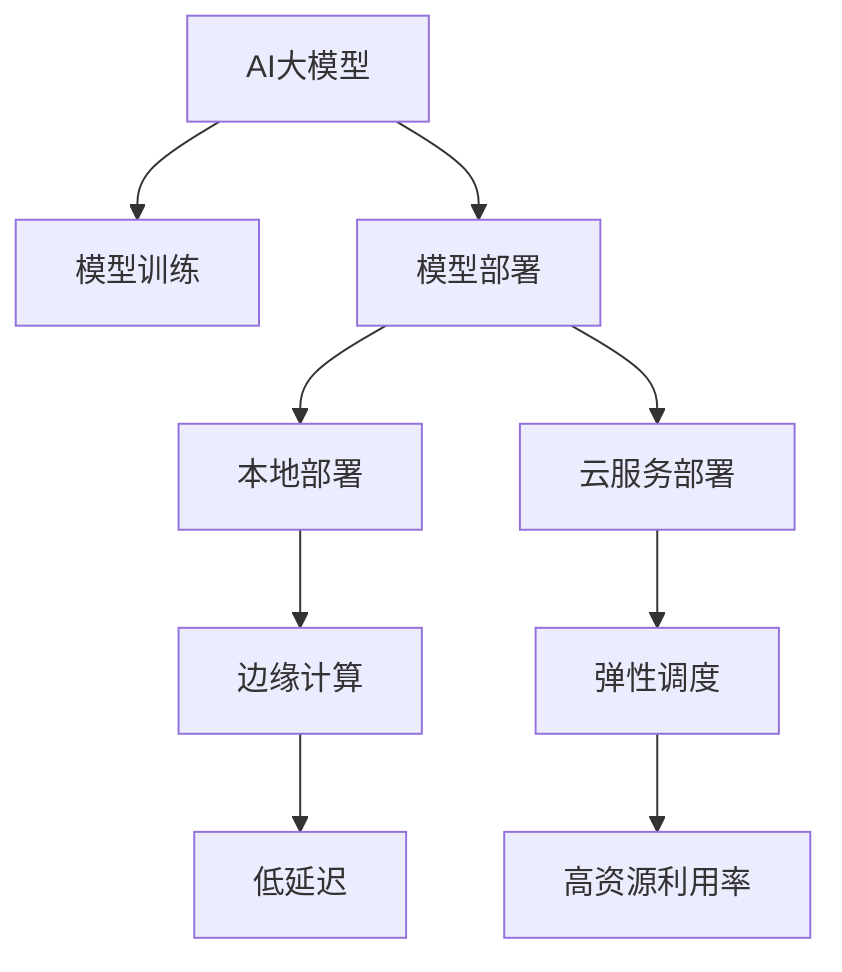

                 

# 电商搜索推荐场景下的AI大模型模型部署混合云方案设计

> 关键词：电商搜索推荐,混合云,AI大模型,模型部署,算法优化

## 1. 背景介绍

### 1.1 问题由来

随着电子商务平台的迅速崛起，用户体验和精准推荐变得至关重要。智能推荐系统通过对用户行为数据进行分析，能够为其提供个性化的商品推荐，提升购物体验，增加用户粘性和购买率。传统的推荐算法基于规则或矩阵分解等，难以处理大规模非结构化数据，也无法捕捉用户行为变化的时序特征。

近年来，人工智能（AI）技术特别是大语言模型（Large Language Model, LLM）在电商推荐领域得到了广泛应用。AI大模型能够通过大规模预训练学习到丰富的语义知识，结合用户行为数据进行联合建模，输出更精准的推荐结果。

然而，电商推荐系统面临的挑战还远不止于此。推荐模型通常基于海量的用户数据进行训练，因此模型庞大复杂，计算资源需求高。如何将大模型高效部署到电商搜索推荐系统中，是一个亟需解决的问题。

### 1.2 问题核心关键点

电商搜索推荐场景下，AI大模型的部署需要考虑以下关键问题：

1. **计算资源需求**：大模型的训练和推理需要高性能计算资源，电商推荐系统一般不具备充足的算力支持。
2. **数据隐私保护**：电商数据涉及用户隐私，需要在数据传输和存储过程中加强安全防护。
3. **模型实时性要求**：推荐系统需要实时响应，在大规模用户请求下保证模型的高效运行。
4. **模型效果评估**：电商推荐效果需根据实际用户行为进行评估，获取有意义的业务指标。

针对这些挑战，混合云（Hybrid Cloud）成为电商推荐系统中AI大模型部署的重要解决方案。混合云将本地计算与云服务结合，形成异构、弹性的计算架构，既满足模型计算需求，又保障数据隐私，提升推荐系统性能。

## 2. 核心概念与联系

### 2.1 核心概念概述

为更好地理解AI大模型在电商推荐场景下的混合云部署方案，本节将介绍几个关键概念：

- **AI大模型**：指通过大规模无监督学习在大规模数据集上预训练得到的大型神经网络模型，如BERT、GPT等。
- **混合云**：指将本地计算资源与云服务资源进行混合部署，形成异构、弹性的计算架构。
- **模型部署**：将训练好的模型从模型仓库迁移到生产环境，供业务系统调用。
- **边缘计算**：在靠近数据源的本地设备上进行计算，减小网络传输压力，提升响应速度。
- **弹性调度**：根据系统负载动态调整计算资源，保障服务稳定性和成本效益。

这些概念之间的逻辑关系可以通过以下Mermaid流程图来展示：



这个流程图展示了大模型训练、部署和运行的全流程，其中本地部署和云服务部署是混合云部署的核心环节。

## 3. 核心算法原理 & 具体操作步骤
### 3.1 算法原理概述

AI大模型在电商推荐场景下的混合云部署，本质上是将大模型的训练和推理过程分别部署到本地和云环境中，结合边缘计算和弹性调度技术，保障系统性能和数据安全。

### 3.2 算法步骤详解

#### 3.2.1 模型训练

1. **数据准备**：收集电商推荐系统所需的各类数据，包括用户行为数据、商品信息、用户画像等，并进行预处理和标注。
2. **模型构建**：选择合适的AI大模型框架，如TensorFlow、PyTorch等，结合电商推荐业务需求构建推荐模型。
3. **分布式训练**：使用分布式训练技术，将模型在本地高性能计算集群中进行训练，加速模型收敛。
4. **模型保存**：训练完成后，将模型保存在本地模型仓库中，供后续部署使用。

#### 3.2.2 本地部署

1. **模型加载**：将本地模型仓库中的模型加载到本地计算节点中。
2. **边缘计算**：在本地计算节点中进行推荐模型的推理计算，减小网络传输压力，提升响应速度。
3. **数据加密**：对本地处理的数据进行加密，保护用户隐私。

#### 3.2.3 云服务部署

1. **模型加载**：将本地模型仓库中的模型备份到云存储中。
2. **云服务推理**：通过云服务接口对模型进行推理调用，获取推荐结果。
3. **弹性调度**：根据系统负载动态调整云资源，保障服务稳定性和成本效益。

#### 3.2.4 性能优化

1. **模型压缩**：对模型进行量化、剪枝等操作，减小模型尺寸，提升推理效率。
2. **算法优化**：采用GPU加速、混合精度等技术，优化模型推理速度。
3. **负载均衡**：在本地和云环境中合理分配负载，保障系统高性能和低延迟。

### 3.3 算法优缺点

混合云部署AI大模型的优势在于：

- **异构资源融合**：结合本地高性能计算资源和云服务弹性资源，提升系统计算能力和资源利用率。
- **数据隐私保护**：本地处理敏感数据，保障用户隐私。
- **低延迟高可用**：边缘计算与弹性调度结合，提升系统响应速度和可用性。

然而，混合云部署也面临一些挑战：

- **系统复杂度增加**：本地和云环境中需同时进行数据处理和模型推理，系统架构复杂。
- **资源管理难度高**：需动态调整本地和云资源，管理复杂。
- **部署成本高**：本地高性能计算资源成本较高，且需要搭建和维护。

## 4. 数学模型和公式 & 详细讲解 & 举例说明
### 4.1 数学模型构建

在本节中，我们以电商推荐系统为例，构建推荐模型并给出数学公式。

假设电商推荐系统需为每个用户推荐商品，模型输入为用户的特征向量 $x_u$ 和商品的特征向量 $x_i$，输出为推荐商品的点击率 $y_{ui}$。推荐模型可以表示为：

$$
y_{ui} = \sigma(\langle x_u, W x_i + b \rangle)
$$

其中，$W$ 为模型参数，$b$ 为偏置项，$\sigma$ 为激活函数。模型的损失函数通常采用交叉熵损失：

$$
\mathcal{L}(y_{ui}, \hat{y}_{ui}) = -(y_{ui}\log \hat{y}_{ui} + (1-y_{ui})\log(1-\hat{y}_{ui}))
$$

在训练阶段，最小化损失函数 $\mathcal{L}$，得到最优参数 $W$ 和 $b$。在推理阶段，给定用户 $u$ 和商品 $i$，预测其点击率 $\hat{y}_{ui}$。

### 4.2 公式推导过程

以下是详细推导过程：

**目标函数推导**：

$$
\mathcal{L}(y_{ui}, \hat{y}_{ui}) = -(y_{ui}\log \hat{y}_{ui} + (1-y_{ui})\log(1-\hat{y}_{ui}))
$$

**梯度计算**：

$$
\nabla_{W} \mathcal{L} = \frac{\partial \mathcal{L}}{\partial W} = \langle x_u, x_i \rangle - \hat{y}_{ui} x_u x_i^T
$$

$$
\nabla_{b} \mathcal{L} = \frac{\partial \mathcal{L}}{\partial b} = \hat{y}_{ui} - \sigma(\langle x_u, W x_i + b \rangle)
$$

**训练过程**：

$$
W \leftarrow W - \eta \nabla_{W} \mathcal{L}
$$

$$
b \leftarrow b - \eta \nabla_{b} \mathcal{L}
$$

其中，$\eta$ 为学习率，$\nabla_{W} \mathcal{L}$ 和 $\nabla_{b} \mathcal{L}$ 分别为 $W$ 和 $b$ 的梯度。

### 4.3 案例分析与讲解

以用户商品推荐为例，具体步骤如下：

1. **数据收集**：收集用户行为数据和商品信息，进行预处理和标注。
2. **模型构建**：使用TensorFlow或PyTorch构建推荐模型，选择合适的网络结构如全连接网络。
3. **模型训练**：在本地高性能计算集群上进行分布式训练，最小化交叉熵损失函数。
4. **模型保存**：将训练好的模型保存至本地模型仓库。
5. **本地推理**：在本地计算节点中加载模型，使用用户特征和商品特征计算预测点击率。
6. **云服务推理**：将模型备份至云存储，通过云服务接口进行推理调用，获取推荐结果。

## 5. 项目实践：代码实例和详细解释说明
### 5.1 开发环境搭建

为了搭建电商搜索推荐场景下的AI大模型部署混合云方案，需要以下开发环境：

1. **计算资源**：高性能计算集群，具备GPU/TPU等硬件资源。
2. **存储资源**：云存储和本地模型仓库。
3. **网络资源**：低延迟网络环境，支持边缘计算和云服务通信。

**5.1.1 高性能计算集群**

搭建高性能计算集群，需考虑以下因素：

- **硬件选择**：选择高性能计算节点，配备GPU/TPU等硬件资源。
- **网络架构**：设计低延迟、高带宽的网络架构，支持模型训练和推理。
- **分布式计算**：使用分布式计算框架，如Spark、TensorFlow等，进行模型训练。

**5.1.2 云存储**

选择可靠的云存储服务，如AWS S3、阿里云OSS等，用于备份模型和存储数据。需考虑以下因素：

- **存储容量**：根据模型大小和数据量选择合适的存储容量。
- **数据加密**：对存储数据进行加密，保障数据安全。
- **数据备份**：定期备份数据，防止数据丢失。

**5.1.3 边缘计算**

在靠近用户设备或数据源的设备上部署推荐模型，进行边缘计算，减小网络传输压力。需考虑以下因素：

- **计算节点选择**：选择性能高、低延迟的计算节点。
- **网络通信**：优化网络通信协议，保障数据传输速度。
- **本地缓存**：使用本地缓存技术，提升响应速度。

### 5.2 源代码详细实现

以下是一个简单的电商推荐系统代码示例，使用TensorFlow实现：

```python
import tensorflow as tf
from tensorflow.keras import layers

# 构建推荐模型
model = tf.keras.Sequential([
    layers.Dense(128, activation='relu'),
    layers.Dense(1, activation='sigmoid')
])

# 编译模型
model.compile(optimizer=tf.keras.optimizers.Adam(0.001),
              loss='binary_crossentropy',
              metrics=['accuracy'])

# 训练模型
model.fit(x_train, y_train, epochs=10, batch_size=32)

# 推理模型
predictions = model.predict(x_test)
```

### 5.3 代码解读与分析

**代码解析**：

- `import tensorflow as tf`：导入TensorFlow库。
- `from tensorflow.keras import layers`：导入Keras模块，用于构建神经网络。
- `model = tf.keras.Sequential([...])`：定义推荐模型，包含两个全连接层。
- `model.compile(...)`：编译模型，设置优化器、损失函数和评估指标。
- `model.fit(...)`：训练模型，使用交叉熵损失函数。
- `predictions = model.predict(...)`：在训练完成后，进行模型推理。

**代码分析**：

1. **模型构建**：使用Keras模块构建推荐模型，包含两个全连接层。
2. **模型编译**：设置优化器、损失函数和评估指标，进行模型编译。
3. **模型训练**：使用训练集进行模型训练，最小化交叉熵损失函数。
4. **模型推理**：在测试集上进行模型推理，得到预测结果。

## 6. 实际应用场景

### 6.1 智能搜索推荐

电商搜索推荐系统可以通过AI大模型实现智能推荐。用户输入搜索词，系统根据预训练语言模型分析查询意图，结合商品推荐模型输出推荐结果。这种融合AI大模型的搜索推荐系统，能够更精准地理解用户需求，提升用户体验。

具体实现步骤如下：

1. **用户输入**：用户输入搜索词，系统调用预训练语言模型进行分析。
2. **意图识别**：预训练语言模型分析用户意图，输出意图向量。
3. **商品推荐**：推荐模型结合用户意图向量，输出推荐商品列表。
4. **用户反馈**：用户对推荐结果进行反馈，系统根据反馈调整模型参数。

### 6.2 个性化推荐

AI大模型可以用于电商个性化推荐，根据用户历史行为和偏好，输出个性化推荐商品。这种基于AI大模型的推荐系统，能够更好地理解用户需求，提高推荐精度。

具体实现步骤如下：

1. **用户画像**：收集用户历史行为数据，构建用户画像。
2. **商品画像**：收集商品信息，构建商品画像。
3. **联合建模**：将用户画像和商品画像进行联合建模，输出推荐结果。
4. **推荐展示**：将推荐结果展示给用户，根据用户反馈进行模型调整。

### 6.3 实时推荐

电商推荐系统需实时响应，根据用户实时行为进行推荐。AI大模型可以通过边缘计算和云服务结合，实现实时推荐。

具体实现步骤如下：

1. **实时数据采集**：实时采集用户行为数据，包括浏览、点击、购买等。
2. **本地推理**：将用户行为数据传入本地计算节点，使用AI大模型进行实时推理。
3. **云服务推理**：将本地推理结果上传至云存储，通过云服务接口进行实时推荐。
4. **推荐展示**：根据实时推荐结果，向用户展示推荐商品。

### 6.4 未来应用展望

未来，AI大模型在电商搜索推荐场景中的应用将更加广泛和深入。以下是一些未来应用展望：

1. **多模态推荐**：结合图像、视频等多元数据源，提升推荐精度。
2. **跨域推荐**：跨行业、跨平台的推荐系统，提升推荐覆盖率。
3. **实时协同过滤**：结合用户行为数据和商品数据，实现实时协同过滤推荐。
4. **知识图谱推荐**：利用知识图谱技术，实现更精准的商品推荐。
5. **AI大模型联合**：多个AI大模型的联合推荐，提升推荐效果。

这些应用将进一步提升电商推荐系统的智能化水平，为用户带来更优质的购物体验。

## 7. 工具和资源推荐
### 7.1 学习资源推荐

为了帮助开发者系统掌握电商搜索推荐场景下AI大模型部署的技术，这里推荐一些优质的学习资源：

1. **《深度学习在电商推荐中的应用》**：详解深度学习在电商推荐中的应用，涵盖电商推荐模型的构建、训练、部署等全流程。
2. **《TensorFlow官方文档》**：TensorFlow官方文档，详细介绍了TensorFlow的使用方法，包括分布式计算、模型优化等。
3. **《边缘计算与人工智能》**：介绍边缘计算与AI结合的技术，适合了解边缘计算在电商推荐中的应用。
4. **《混合云架构设计》**：介绍混合云架构设计，适合了解混合云在电商推荐中的应用。
5. **《AI大模型与电商推荐》**：全面介绍AI大模型在电商推荐中的应用，适合系统掌握电商推荐场景下的AI大模型部署。

通过对这些资源的学习实践，相信你一定能够快速掌握电商搜索推荐场景下AI大模型部署的精髓，并用于解决实际的电商推荐问题。

### 7.2 开发工具推荐

高效的开发离不开优秀的工具支持。以下是几款用于电商搜索推荐场景下AI大模型部署的常用工具：

1. **TensorFlow**：基于Python的开源深度学习框架，适合构建推荐模型并进行分布式训练。
2. **PyTorch**：基于Python的开源深度学习框架，适合构建推荐模型并进行分布式训练。
3. **AWS S3**：亚马逊云存储服务，适合存储和备份模型数据。
4. **AWS EC2**：亚马逊云计算服务，适合搭建高性能计算集群。
5. **AWS SageMaker**：亚马逊机器学习服务，适合进行模型训练和推理。

合理利用这些工具，可以显著提升电商搜索推荐场景下AI大模型部署的效率，加快创新迭代的步伐。

### 7.3 相关论文推荐

电商搜索推荐场景下AI大模型部署的研究涉及多个领域，以下是几篇奠基性的相关论文，推荐阅读：

1. **《基于深度学习的电商推荐系统》**：介绍深度学习在电商推荐中的应用，涵盖模型构建、训练、部署等全流程。
2. **《混合云环境下的电商推荐系统》**：介绍混合云在电商推荐中的应用，涵盖本地计算与云服务的结合。
3. **《边缘计算在电商推荐中的应用》**：介绍边缘计算在电商推荐中的应用，涵盖边缘计算与AI的结合。
4. **《AI大模型在电商推荐中的应用》**：介绍AI大模型在电商推荐中的应用，涵盖模型构建、训练、推理等全流程。

这些论文代表了大模型在电商推荐领域的发展脉络。通过学习这些前沿成果，可以帮助研究者把握学科前进方向，激发更多的创新灵感。

## 8. 总结：未来发展趋势与挑战
### 8.1 研究成果总结

本文对电商搜索推荐场景下AI大模型模型部署的混合云方案进行了全面系统的介绍。首先阐述了电商推荐系统面临的计算资源需求、数据隐私保护、实时性要求等核心挑战，明确了混合云部署的必要性。其次，从原理到实践，详细讲解了混合云部署的数学模型、算法步骤、具体操作步骤，给出了完整的代码实例。同时，本文还广泛探讨了混合云部署在智能搜索推荐、个性化推荐、实时推荐等电商推荐场景中的应用，展示了混合云部署的巨大潜力。此外，本文精选了混合云部署的学习资源、开发工具、相关论文，力求为读者提供全方位的技术指引。

通过本文的系统梳理，可以看到，AI大模型在电商推荐场景下的混合云部署，已成为电商推荐系统的重要技术手段。混合云部署能够有效结合本地高性能计算资源和云服务弹性资源，保障系统高性能和低延迟，同时保障数据隐私。未来，随着AI大模型和混合云技术的不断演进，相信电商推荐系统将能够更好地适应海量用户需求，提升用户体验，实现业务价值最大化。

### 8.2 未来发展趋势

展望未来，AI大模型在电商搜索推荐场景中的应用将呈现以下几个发展趋势：

1. **计算资源更加丰富**：AI大模型的计算资源需求将进一步增加，云计算和边缘计算的结合将更加紧密，保障高性能和低延迟。
2. **数据处理更加高效**：数据处理技术将更加高效，能够更好地处理海量用户数据和商品数据，提升推荐系统精度。
3. **模型算法更加优化**：推荐算法将更加优化，结合深度学习、强化学习等技术，提升推荐效果。
4. **系统架构更加灵活**：系统架构将更加灵活，支持多模态数据融合、跨域推荐等新技术。
5. **业务价值更加显著**：AI大模型将更好地结合电商业务，提升推荐系统的业务价值，为用户带来更多价值。

以上趋势凸显了AI大模型在电商推荐领域的广阔前景。这些方向的探索发展，必将进一步提升电商推荐系统的智能化水平，为电商企业带来更大的商业价值。

### 8.3 面临的挑战

尽管AI大模型在电商推荐场景中的应用前景广阔，但在迈向更加智能化、普适化应用的过程中，仍面临诸多挑战：

1. **计算资源成本高**：AI大模型计算资源需求高，云计算和边缘计算的结合需要投入大量成本。
2. **数据隐私保护难度大**：电商数据涉及用户隐私，如何在保障隐私的前提下进行推荐，仍是一大难题。
3. **模型复杂度增加**：AI大模型复杂度增加，对模型训练和推理技术提出更高要求。
4. **系统稳定性保障难**：推荐系统需实时响应，如何保障系统在高并发场景下的稳定性，还需进一步优化。
5. **用户满意度提升难**：推荐系统需不断优化，如何提升用户满意度，还需更多探索。

正视这些挑战，积极应对并寻求突破，将是大模型在电商推荐领域走向成熟的必由之路。相信随着学界和产业界的共同努力，这些挑战终将一一被克服，大模型在电商推荐领域的潜力将得到充分释放。

### 8.4 研究展望

未来，AI大模型在电商搜索推荐场景中的应用需要从以下几个方向进行深入研究：

1. **多模态数据融合**：结合图像、视频等多模态数据，提升推荐系统精度。
2. **跨域推荐**：跨行业、跨平台的推荐系统，提升推荐覆盖率。
3. **实时协同过滤**：结合用户行为数据和商品数据，实现实时协同过滤推荐。
4. **知识图谱推荐**：利用知识图谱技术，实现更精准的商品推荐。
5. **AI大模型联合**：多个AI大模型的联合推荐，提升推荐效果。

这些研究方向将进一步提升电商推荐系统的智能化水平，为用户带来更优质的购物体验。

## 9. 附录：常见问题与解答

**Q1：AI大模型在电商推荐系统中如何保证数据隐私？**

A: AI大模型在电商推荐系统中，可以通过以下方式保护数据隐私：

1. **数据加密**：在数据传输和存储过程中进行加密，保障数据安全。
2. **本地处理**：在本地计算节点中处理敏感数据，减小数据传输风险。
3. **匿名化处理**：对用户数据进行匿名化处理，保护用户隐私。

**Q2：电商推荐系统如何优化模型推理速度？**

A: 电商推荐系统可以通过以下方式优化模型推理速度：

1. **模型压缩**：对模型进行量化、剪枝等操作，减小模型尺寸，提升推理效率。
2. **算法优化**：采用GPU加速、混合精度等技术，优化模型推理速度。
3. **分布式推理**：利用云服务分布式推理技术，提升推理效率。

**Q3：混合云部署AI大模型的挑战有哪些？**

A: 混合云部署AI大模型的挑战主要有以下几点：

1. **系统复杂度增加**：本地和云环境中需同时进行数据处理和模型推理，系统架构复杂。
2. **资源管理难度高**：需动态调整本地和云资源，管理复杂。
3. **部署成本高**：本地高性能计算资源成本较高，且需要搭建和维护。

**Q4：电商推荐系统如何实时响应？**

A: 电商推荐系统可以通过以下方式实现实时响应：

1. **边缘计算**：在靠近用户设备或数据源的设备上部署推荐模型，进行边缘计算，减小网络传输压力，提升响应速度。
2. **云服务推理**：将本地推理结果上传至云存储，通过云服务接口进行实时推荐。
3. **弹性调度**：根据系统负载动态调整计算资源，保障服务稳定性和成本效益。

**Q5：如何评估电商推荐系统的推荐效果？**

A: 电商推荐系统的推荐效果可以通过以下指标进行评估：

1. **点击率（CTR）**：用户点击推荐商品的概率，反映推荐相关性。
2. **转化率（CVR）**：用户点击推荐商品并完成购买的比例，反映推荐效果。
3. **召回率（Recall）**：推荐系统能够召回多少用户感兴趣的商品，反映推荐覆盖率。
4. **平均点击率（APC）**：推荐系统平均点击率，反映推荐效果。

这些指标可以综合评估推荐系统的性能，提升用户体验。

---

作者：禅与计算机程序设计艺术 / Zen and the Art of Computer Programming

