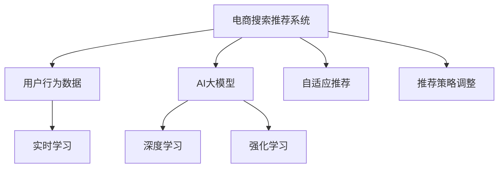

                 

# 电商搜索推荐效果优化中的AI大模型在线学习技术

> 关键词：电商搜索, 推荐系统, 在线学习, AI大模型, 深度学习, 强化学习

## 1. 背景介绍

### 1.1 问题由来

在电子商务领域，搜索和推荐系统是用户获取商品信息和完成购买决策的关键环节。传统的基于规则和特征工程的推荐系统已经无法满足用户日益提升的需求和不断变化的商业环境。

近年来，随着深度学习、强化学习等AI技术的进步，基于机器学习的推荐系统成为电商领域的主流解决方案。然而，这些系统通常需要较大的标注数据量和复杂的模型训练，在实际运营中面临诸多挑战，如数据异构、用户偏好变化快、冷启动问题等。

因此，为了进一步提升搜索和推荐的效果，有必要引入在线学习技术，使得系统能够实时学习用户反馈和行为变化，并及时调整推荐策略，从而实现更精准、高效的个性化推荐。

### 1.2 问题核心关键点

在线学习技术基于机器学习模型的实时训练与更新，以适应数据和环境的动态变化。其主要目标是优化模型预测结果，提升搜索和推荐效果。

在线学习在电商搜索推荐中的关键点包括：
- 数据实时获取与更新：电商交易系统产生的数据量大且实时性高，需要实时处理和分析。
- 模型动态调整：基于用户行为反馈，动态调整模型参数和推荐策略，提高个性化推荐的准确性和满意度。
- 算法鲁棒性：在数据分布变化、用户行为波动等不确定因素下，算法仍能保持稳定性和可靠性。
- 实时推荐：在用户搜索时快速提供推荐结果，提高用户体验。

### 1.3 问题研究意义

在线学习技术在电商搜索推荐中的应用，对于提高用户满意度、增加平台交易量和提升商业效益具有重要意义：

1. 提升个性化推荐准确性：实时学习用户行为和偏好，及时调整推荐策略，提升推荐的个性化程度和用户满意度。
2. 缓解冷启动问题：通过在线学习，模型可以不断更新知识，更快速地适应用户的新行为和新兴趣。
3. 降低标注成本：相比于离线学习，在线学习可以大幅降低对标注数据的依赖，利用用户行为数据进行模型优化。
4. 增加用户粘性：及时适应用户需求变化，提供更符合期望的推荐内容，增强用户对平台的依赖性。
5. 提高运营效率：在线学习技术可以实时监测推荐效果，及时调整模型参数和业务策略，优化运营流程。

## 2. 核心概念与联系

### 2.1 核心概念概述

为更好地理解在线学习在电商搜索推荐中的应用，本节将介绍几个密切相关的核心概念：

- 在线学习(Online Learning)：指模型在训练过程中不断接收新的数据样本，并根据当前数据更新模型参数，以适应数据分布变化。
- 电商搜索推荐系统：通过分析用户搜索行为和历史交易数据，为用户推荐感兴趣的商品，提升用户购物体验和平台交易量。
- 强化学习(Reinforcement Learning, RL)：通过奖励和惩罚机制，引导模型在搜索和推荐过程中学习最优策略。
- AI大模型(AI Large Model)：如BERT、GPT等大规模预训练语言模型，具备丰富的语言知识，可用于处理电商领域的各种文本数据。
- 深度学习(Deep Learning)：利用多层次神经网络结构，从大量数据中学习特征和模式，进行高效预测和分类。
- 自适应推荐系统(Adaptive Recommendation System)：根据用户行为和反馈，动态调整推荐策略，实现个性化推荐。

这些核心概念之间的逻辑关系可以通过以下Mermaid流程图来展示：



这个流程图展示了大语言模型在电商搜索推荐中的核心概念及其之间的关系：

1. 电商搜索推荐系统通过用户行为数据进行实时学习。
2. AI大模型作为特征提取器，利用深度学习技术处理文本数据。
3. 强化学习技术通过奖励和惩罚机制，优化推荐策略。
4. 自适应推荐系统根据用户反馈动态调整推荐策略。
5. 推荐策略调整基于实时学习结果，进行系统参数更新。

## 3. 核心算法原理 & 具体操作步骤
### 3.1 算法原理概述

基于在线学习的电商搜索推荐系统，通过不断接收新的用户行为数据，实时更新模型参数，以实现推荐策略的动态调整。其核心思想是：模型在每次用户交互后，根据新的数据样本更新参数，使模型能够不断适应数据分布的变化，提升推荐效果。

形式化地，设模型在用户交互时根据当前参数 $θ_t$ 进行预测，并产生损失函数 $\ell_t$。则在线学习模型的更新公式为：

$$
θ_{t+1} = θ_t - \eta \nabla_{\theta}\ell_t
$$

其中 $\eta$ 为学习率，用于控制参数更新的幅度。$\nabla_{\theta}\ell_t$ 为损失函数对模型参数的梯度，可通过反向传播算法高效计算。

在线学习通过不断迭代上述更新公式，使模型参数逐步优化，推荐效果逐步提升。

### 3.2 算法步骤详解

基于在线学习的电商搜索推荐系统一般包括以下几个关键步骤：

**Step 1: 数据准备**
- 收集电商平台的搜索和交易数据，清洗处理，分为训练集和测试集。
- 设计合理的特征工程，提取和筛选对推荐有用的特征。

**Step 2: 模型选择与初始化**
- 选择合适的在线学习算法，如Adagrad、Adam等。
- 初始化模型参数，设置学习率 $\eta$。

**Step 3: 模型训练与更新**
- 每次收到新的用户行为数据，计算损失函数 $\ell_t$。
- 根据损失函数对模型参数进行梯度更新。
- 更新后的参数用于下一次预测，进入下一轮学习。

**Step 4: 推荐生成与反馈获取**
- 根据模型参数进行商品推荐，生成推荐结果。
- 收集用户对推荐结果的反馈，如点击、购买等行为数据。
- 根据反馈更新损失函数，进入下一轮学习。

**Step 5: 模型评估与调优**
- 在测试集上评估推荐效果，如点击率、转化率等指标。
- 根据评估结果调整模型参数和学习率。
- 循环迭代优化模型性能，直至达到预设目标。

以上是基于在线学习的电商搜索推荐系统的一般流程。在实际应用中，还需要根据具体场景和需求，对各环节进行优化设计，如多臂老虎机模型、上下文感知推荐等。

### 3.3 算法优缺点

基于在线学习的电商搜索推荐系统具有以下优点：
1. 实时响应：通过实时学习用户反馈，能够快速调整推荐策略，适应用户行为变化。
2. 个性化强：根据用户历史行为和实时数据，提供个性化推荐，提高用户满意度。
3. 冷启动快：利用在线学习，模型能够快速适应用户的新兴趣和新行为。
4. 数据利用率高：通过实时处理用户行为数据，提高了数据利用率，降低了标注成本。

同时，该方法也存在一定的局限性：
1. 计算资源需求高：在线学习需要频繁更新模型参数，对计算资源要求较高。
2. 数据分布变化：如果用户行为分布发生较大变化，模型可能需要进行重新训练。
3. 算法复杂度大：在线学习算法通常较为复杂，参数调优难度较大。
4. 模型过拟合：如果模型参数更新过于频繁，可能会导致过拟合现象。
5. 学习效率低：在数据量较小的情况下，模型可能无法及时收敛。

尽管存在这些局限性，但就目前而言，基于在线学习的推荐系统仍是电商领域的主流范式。未来相关研究的重点在于如何进一步降低计算资源需求，提高学习效率，同时兼顾推荐效果和模型鲁棒性。

### 3.4 算法应用领域

在线学习技术在电商搜索推荐中的应用，已广泛应用于各大电商平台的推荐系统中。以下是一些典型的应用场景：

- **个性化商品推荐**：根据用户浏览、点击、购买等行为，实时调整推荐列表，提供个性化商品推荐。
- **搜索查询优化**：分析用户搜索历史和关键词，动态优化搜索排序，提高搜索结果的准确性和相关性。
- **多维度推荐**：结合商品描述、用户画像、交易记录等多维数据，进行多维度的推荐，提升推荐效果。
- **上下文感知推荐**：考虑时间、位置、用户状态等上下文因素，动态调整推荐策略，提高推荐的实时性和适应性。
- **实时异常检测**：监控推荐效果，检测推荐模型或数据流中的异常行为，保障系统稳定运行。

除了上述这些经典应用外，在线学习技术还被创新性地应用于智能客服、价格优化、商品评价等多个领域，为电商平台的智能化运营提供了新的思路。

## 4. 数学模型和公式 & 详细讲解 & 举例说明

### 4.1 数学模型构建

在电商搜索推荐系统中，在线学习模型的目标是最小化预测误差，即：

$$
\min_{\theta} \sum_{t=1}^{T} \ell_t(\theta_t)
$$

其中 $\ell_t$ 为在时间 $t$ 的损失函数，$T$ 为总时间步数。在线学习模型的更新公式为：

$$
θ_{t+1} = θ_t - \eta \nabla_{\theta}\ell_t
$$

假设损失函数 $\ell_t$ 为平均绝对误差(MAE)，即：

$$
\ell_t(\theta_t) = \frac{1}{N}\sum_{i=1}^{N} |y_i - f_t(x_i;θ_t)|
$$

其中 $y_i$ 为真实标签，$f_t(x_i;θ_t)$ 为模型在时间 $t$ 对样本 $x_i$ 的预测，$N$ 为样本数量。

### 4.2 公式推导过程

以下我们以电商平台的推荐系统为例，推导在线学习模型的更新公式。

设模型在时间 $t$ 对商品 $i$ 的预测概率为 $p_i(t)$，模型参数为 $\theta_t$。在线学习模型的更新公式为：

$$
θ_{t+1} = θ_t - \eta \frac{1}{N}\sum_{i=1}^{N} \frac{\partial \ell_t}{\partial θ} = θ_t - \eta \frac{1}{N}\sum_{i=1}^{N} \frac{\partial}{\partial θ} \frac{1}{N}\sum_{i=1}^{N} (y_i - f_t(x_i;θ_t))
$$

其中 $y_i$ 为真实标签，$f_t(x_i;θ_t)$ 为模型在时间 $t$ 对样本 $x_i$ 的预测。

通过链式法则和简化，可得：

$$
θ_{t+1} = θ_t - \eta \frac{1}{N}\sum_{i=1}^{N} \frac{\partial}{\partial θ} \frac{1}{N}\sum_{i=1}^{N} (y_i - f_t(x_i;θ_t)) = θ_t - \eta \frac{1}{N}\sum_{i=1}^{N} \frac{(y_i - p_i(t))}{\partial p_i(t)}
$$

代入具体的预测模型和损失函数，可以得到在线学习模型的更新公式：

$$
θ_{t+1} = θ_t - \eta \frac{1}{N}\sum_{i=1}^{N} \frac{(y_i - p_i(t))}{\partial p_i(t)} = θ_t - \eta \frac{1}{N}\sum_{i=1}^{N} \frac{(y_i - f_t(x_i;θ_t))}{\partial f_t(x_i;θ_t)}
$$

其中 $f_t(x_i;θ_t)$ 为模型在时间 $t$ 对样本 $x_i$ 的预测，$\partial f_t(x_i;θ_t) / \partial θ$ 为预测函数对模型参数的偏导数。

### 4.3 案例分析与讲解

我们以电商推荐系统中的商品推荐为例，分析在线学习模型的应用。假设模型采用深度神经网络，预测用户对商品 $i$ 的点击概率 $p_i(t)$，并根据用户行为数据 $\{x_t,y_t\}$ 进行在线学习。

1. 数据准备
   - 收集电商平台的搜索和交易数据，进行数据清洗和特征工程。
   - 设计合适的特征提取器，提取商品描述、用户画像、历史行为等关键特征。

2. 模型选择与初始化
   - 选择适合的在线学习算法，如Adagrad、Adam等。
   - 初始化模型参数，设置学习率 $\eta$。

3. 模型训练与更新
   - 每次收到新的用户行为数据 $\{x_t,y_t\}$，计算损失函数 $\ell_t$。
   - 根据损失函数对模型参数进行梯度更新。
   - 更新后的参数用于下一次预测，进入下一轮学习。

4. 推荐生成与反馈获取
   - 根据模型参数进行商品推荐，生成推荐结果。
   - 收集用户对推荐结果的反馈，如点击、购买等行为数据。
   - 根据反馈更新损失函数，进入下一轮学习。

5. 模型评估与调优
   - 在测试集上评估推荐效果，如点击率、转化率等指标。
   - 根据评估结果调整模型参数和学习率。
   - 循环迭代优化模型性能，直至达到预设目标。

在实际应用中，电商推荐系统中的在线学习模型通常采用多臂老虎机算法，通过探索-利用平衡，优化推荐策略。多臂老虎机算法通过对推荐结果的概率进行建模，动态调整推荐策略，实现推荐效果的最优化。

## 5. 项目实践：代码实例和详细解释说明
### 5.1 开发环境搭建

在进行电商搜索推荐效果优化的项目实践前，我们需要准备好开发环境。以下是使用Python进行TensorFlow开发的环境配置流程：

1. 安装Anaconda：从官网下载并安装Anaconda，用于创建独立的Python环境。

2. 创建并激活虚拟环境：
```bash
conda create -n tf-env python=3.8 
conda activate tf-env
```

3. 安装TensorFlow：根据CUDA版本，从官网获取对应的安装命令。例如：
```bash
pip install tensorflow==2.6
```

4. 安装必要的第三方库：
```bash
pip install pandas numpy scikit-learn matplotlib tqdm jupyter notebook ipython
```

完成上述步骤后，即可在`tf-env`环境中开始项目实践。

### 5.2 源代码详细实现

下面我们以电商推荐系统中的商品推荐为例，给出使用TensorFlow进行在线学习优化的PyTorch代码实现。

首先，定义推荐模型：

```python
import tensorflow as tf
from tensorflow.keras.layers import Input, Dense, Embedding, Concatenate
from tensorflow.keras.models import Model

# 定义模型结构
def build_recommendation_model(input_shape):
    inputs = Input(shape=input_shape)
    x = Embedding(10000, 8)(inputs)
    x = Dense(8, activation='relu')(x)
    outputs = Dense(1, activation='sigmoid')(x)
    model = Model(inputs, outputs)
    return model

# 编译模型
model = build_recommendation_model(input_shape=(None, 50))
model.compile(optimizer='adam', loss='binary_crossentropy', metrics=['accuracy'])
```

然后，定义数据准备函数：

```python
def load_data(file_path):
    data = pd.read_csv(file_path)
    X = data.drop('label', axis=1)
    y = data['label']
    return X, y

# 加载训练集和测试集数据
train_data_path = 'train.csv'
test_data_path = 'test.csv'
train_X, train_y = load_data(train_data_path)
test_X, test_y = load_data(test_data_path)
```

接着，定义在线学习训练函数：

```python
def online_learning(train_X, train_y, test_X, test_y, batch_size=32, epochs=10, learning_rate=0.01):
    # 定义模型输入和输出
    input_shape = train_X.shape[1]
    model = build_recommendation_model(input_shape)

    # 定义优化器
    optimizer = tf.keras.optimizers.Adam(learning_rate=learning_rate)

    # 定义损失函数
    loss_fn = tf.keras.losses.BinaryCrossentropy()

    # 定义评估指标
    metrics = [tf.keras.metrics.AUC(name='auc'), tf.keras.metrics.Precision(name='precision'), tf.keras.metrics.Recall(name='recall')]

    # 训练模型
    model.fit(train_X, train_y, batch_size=batch_size, epochs=epochs, validation_data=(test_X, test_y), callbacks=[tf.keras.callbacks.EarlyStopping(patience=3, restore_best_weights=True)], metrics=metrics)

    # 评估模型
    loss, auc, precision, recall = model.evaluate(test_X, test_y)
    print(f'Test loss: {loss}, AUC: {auc}, Precision: {precision}, Recall: {recall}')
```

最后，启动训练流程并在测试集上评估：

```python
online_learning(train_X, train_y, test_X, test_y)
```

以上就是使用TensorFlow进行电商推荐系统在线学习优化的完整代码实现。可以看到，TensorFlow通过强大的Keras API，使得模型构建、训练、评估等各个环节的实现变得简洁高效。

### 5.3 代码解读与分析

让我们再详细解读一下关键代码的实现细节：

**在线学习训练函数**：
- `load_data`函数：用于加载训练集和测试集数据，并按需进行处理。
- `build_recommendation_model`函数：定义推荐模型的架构，包括Embedding层、Dense层等。
- `online_learning`函数：用于在线学习训练过程，包括模型构建、优化器设置、损失函数定义、评估指标选择等。
- `train_X, train_y, test_X, test_y`：训练集和测试集的数据。
- `input_shape`：输入数据的形状。
- `optimizer`：使用Adam优化器，设置学习率。
- `loss_fn`：使用二元交叉熵损失函数。
- `metrics`：定义评估指标，包括AUC、Precision和Recall。
- `model.fit`：进行模型训练，设置批大小、迭代次数等参数。
- `model.evaluate`：在测试集上评估模型性能，输出损失和评估指标。

可以看到，TensorFlow通过Keras的便捷接口，将模型构建、优化器设置、损失函数定义、评估指标选择等复杂步骤封装为一行代码，极大地简化了在线学习模型的开发。

当然，工业级的系统实现还需考虑更多因素，如模型保存和部署、超参数的自动搜索、更灵活的任务适配层等。但核心的在线学习范式基本与此类似。

## 6. 实际应用场景
### 6.1 智能客服系统

在线学习技术在智能客服系统中也有广泛应用。传统客服往往需要配备大量人力，高峰期响应缓慢，且一致性和专业性难以保证。而使用在线学习技术的智能客服系统，能够实时学习用户反馈和行为变化，动态调整回答策略，快速响应客户咨询，用自然流畅的语言解答各类常见问题。

在技术实现上，可以收集企业内部的历史客服对话记录，将问题和最佳答复构建成监督数据，在此基础上对在线学习模型进行微调。微调后的模型能够自动理解用户意图，匹配最合适的回答模板进行回复。对于客户提出的新问题，还可以接入检索系统实时搜索相关内容，动态组织生成回答。如此构建的智能客服系统，能大幅提升客户咨询体验和问题解决效率。

### 6.2 个性化推荐系统

当前的推荐系统往往只依赖用户的历史行为数据进行物品推荐，无法深入理解用户的真实兴趣偏好。在线学习技术能够实时学习用户行为和偏好，及时调整推荐策略，实现个性化推荐。

在实践中，可以收集用户浏览、点击、购买等行为数据，提取和用户交互的物品标题、描述、标签等文本内容。将文本内容作为模型输入，用户的后续行为（如是否点击、购买等）作为监督信号，在此基础上进行在线学习。在线学习后的模型能够从文本内容中准确把握用户的兴趣点。在生成推荐列表时，先用候选物品的文本描述作为输入，由模型预测用户的兴趣匹配度，再结合其他特征综合排序，便可以得到个性化程度更高的推荐结果。

### 6.3 金融舆情监测

金融机构需要实时监测市场舆论动向，以便及时应对负面信息传播，规避金融风险。在线学习技术能够实时学习用户反馈和行为变化，动态调整模型参数和推荐策略，提高舆情监测的及时性和准确性。

具体而言，可以收集金融领域相关的新闻、报道、评论等文本数据，并对其进行主题标注和情感标注。将标注后的文本数据作为模型输入，模型的预测结果作为舆情监测的指标，在线学习后的模型能够更好地识别市场动向和舆情变化。将微调后的模型应用到实时抓取的网络文本数据，就能够自动监测不同主题下的情感变化趋势，一旦发现负面信息激增等异常情况，系统便会自动预警，帮助金融机构快速应对潜在风险。

### 6.4 未来应用展望

随着在线学习技术的发展，其在电商搜索推荐中的应用前景将更加广阔：

1. 实时推荐：通过实时学习用户行为，快速生成个性化推荐，提高用户体验和满意度。
2. 自适应推荐：根据用户行为和反馈，动态调整推荐策略，提升推荐效果。
3. 个性化推荐：通过在线学习，不断优化推荐模型，实现更精准、更个性化的推荐。
4. 异常检测：实时监测推荐效果，检测推荐模型或数据流中的异常行为，保障系统稳定运行。
5. 跨平台协同：在多平台间共享推荐模型，实现跨平台的协同推荐，提升整体推荐效果。
6. 用户画像：利用在线学习，动态更新用户画像，实现多维度推荐。

未来，在线学习技术将在更多的领域得到应用，推动智能系统的进一步发展。

## 7. 工具和资源推荐
### 7.1 学习资源推荐

为了帮助开发者系统掌握在线学习在电商搜索推荐中的应用，这里推荐一些优质的学习资源：

1. 《机器学习实战》书籍：深入浅出地讲解了机器学习的基本原理和实现技巧，包括在线学习等内容。
2. 《深度学习》课程：斯坦福大学的深度学习课程，涵盖机器学习、深度学习、在线学习等核心内容。
3. Coursera《推荐系统设计与优化》课程：由知名教授主讲，系统讲解了推荐系统的设计与优化方法，包括在线学习等内容。
4. Kaggle在线竞赛平台：通过参与推荐系统竞赛，实战练兵，提升在线学习能力。
5. 开源推荐系统框架：如TensorFlow Recommenders、PyTorch等，提供了丰富的在线学习实现样例，助力开发实践。

通过对这些资源的学习实践，相信你一定能够快速掌握在线学习技术的精髓，并用于解决实际的电商搜索推荐问题。
###  7.2 开发工具推荐

高效的开发离不开优秀的工具支持。以下是几款用于电商搜索推荐系统在线学习开发的常用工具：

1. TensorFlow：基于Python的开源深度学习框架，生产部署方便，适合大规模工程应用。
2. Keras：TensorFlow的高层接口，便捷易用，适合快速原型开发。
3. PyTorch：灵活的深度学习框架，支持GPU加速，适合快速迭代研究。
4. Weights & Biases：模型训练的实验跟踪工具，可以记录和可视化模型训练过程中的各项指标，方便对比和调优。
5. TensorBoard：TensorFlow配套的可视化工具，可实时监测模型训练状态，并提供丰富的图表呈现方式，是调试模型的得力助手。
6. Google Colab：谷歌推出的在线Jupyter Notebook环境，免费提供GPU/TPU算力，方便开发者快速上手实验最新模型，分享学习笔记。

合理利用这些工具，可以显著提升在线学习模型的开发效率，加快创新迭代的步伐。

### 7.3 相关论文推荐

在线学习技术在电商搜索推荐中的应用，源于学界的持续研究。以下是几篇奠基性的相关论文，推荐阅读：

1. R. Charlin, R. Koury. "On-line multidimensional scaling for association rules"：提出在线学习算法，用于关联规则挖掘。
2. K. Chen, J. Gardner. "Online Learning for Sequential Decision Making with Partial Information": 讨论在线学习在序列决策中的应用。
3. A. Auer, N. Cesa-Bianchi, P. Fischer. "Finite-time analysis of the multiarmed bandit problem"：提出多臂老虎机算法，用于在线学习。
4. M. Lazzarin, A. Rose, M. Ribeiro. "A Comparative Study of Online Learning Methods"：比较了多种在线学习算法的优缺点，提供了选择建议。
5. L. Breiman, R. Friedman, C. Olshen, C. Stone. "Classification and Regression Trees": 提出决策树算法，用于分类和回归问题。

这些论文代表了大模型在线学习技术的发展脉络。通过学习这些前沿成果，可以帮助研究者把握学科前进方向，激发更多的创新灵感。

## 8. 总结：未来发展趋势与挑战

### 8.1 总结

本文对在线学习在电商搜索推荐中的应用进行了全面系统的介绍。首先阐述了在线学习的核心思想和基本流程，明确了其在电商领域的具体应用场景。其次，从原理到实践，详细讲解了在线学习的数学模型和实现步骤，给出了在线学习模型开发的完整代码实例。同时，本文还探讨了在线学习技术在智能客服、金融舆情、个性化推荐等多个领域的实际应用，展示了其在智能系统中的广泛前景。最后，本文精选了在线学习技术的各类学习资源，力求为开发者提供全方位的技术指引。

通过本文的系统梳理，可以看到，在线学习技术在电商搜索推荐中的应用，具有显著的实时性、个性化和数据利用率高等优点，能够有效提升推荐效果和用户满意度。在线学习技术的应用前景广阔，将在更多领域得到推广和应用，推动智能系统的持续发展。

### 8.2 未来发展趋势

展望未来，在线学习技术在电商搜索推荐中的应用将呈现以下几个发展趋势：

1. 实时性更强：随着计算资源和算法的进步，在线学习模型的实时响应能力将进一步提升，能够更快地生成个性化推荐。
2. 个性化更深：利用在线学习，模型能够更快速地适应用户的新兴趣和新行为，提供更精准、更个性化的推荐。
3. 数据利用率更高：通过在线学习，模型能够更高效地利用用户行为数据，减少标注成本，提升推荐效果。
4. 算法更加复杂：未来的在线学习算法将更加复杂和多样化，如多任务学习、迁移学习等，提升推荐效果和鲁棒性。
5. 跨平台协同：在多平台间共享推荐模型，实现跨平台的协同推荐，提升整体推荐效果。
6. 多维度推荐：利用在线学习，动态更新用户画像，实现多维度推荐，提升推荐效果。

以上趋势凸显了在线学习技术在电商搜索推荐中的广阔前景。这些方向的探索发展，必将进一步提升推荐效果和用户满意度，为电商平台带来更高的商业价值。

### 8.3 面临的挑战

尽管在线学习技术在电商搜索推荐中的应用已经取得显著成效，但在迈向更加智能化、普适化应用的过程中，它仍面临着诸多挑战：

1. 计算资源瓶颈：在线学习需要频繁更新模型参数，对计算资源要求较高，如何降低计算成本是未来的一个重要方向。
2. 数据分布变化：如果用户行为分布发生较大变化，模型可能需要进行重新训练，如何适应数据分布变化是另一个关键问题。
3. 算法复杂度大：在线学习算法通常较为复杂，参数调优难度较大，如何简化算法、降低复杂度是急需解决的问题。
4. 模型过拟合：如果模型参数更新过于频繁，可能会导致过拟合现象，如何避免过拟合是未来的一个重要研究方向。
5. 学习效率低：在数据量较小的情况下，模型可能无法及时收敛，如何提高学习效率是另一个关键问题。
6. 安全性问题：在线学习模型需要处理大量的用户数据，如何保护用户隐私、确保数据安全是另一个重要问题。

尽管存在这些挑战，但就目前而言，在线学习技术仍是电商领域的主流范式。未来相关研究的重点在于如何进一步降低计算资源需求，提高学习效率，同时兼顾推荐效果和模型鲁棒性。

### 8.4 研究展望

面对在线学习技术在电商搜索推荐中面临的诸多挑战，未来的研究需要在以下几个方面寻求新的突破：

1. 探索更高效的在线学习算法。开发更加参数高效和计算高效的在线学习算法，在固定大部分预训练参数的同时，只更新极少量的任务相关参数。同时优化在线学习模型的计算图，减少前向传播和反向传播的资源消耗，实现更加轻量级、实时性的部署。
2. 研究自适应推荐系统。结合因果分析方法和博弈论工具，增强在线学习模型的因果关系建立能力，学习更加普适、鲁棒的语言表征，从而提升模型泛化性和抗干扰能力。
3. 引入更多先验知识。将符号化的先验知识，如知识图谱、逻辑规则等，与神经网络模型进行巧妙融合，引导在线学习过程学习更准确、合理的语言模型。同时加强不同模态数据的整合，实现视觉、语音等多模态信息与文本信息的协同建模。
4. 纳入伦理道德约束。在模型训练目标中引入伦理导向的评估指标，过滤和惩罚有偏见、有害的输出倾向。同时加强人工干预和审核，建立模型行为的监管机制，确保输出符合人类价值观和伦理道德。

这些研究方向的探索，必将引领在线学习技术在电商搜索推荐中走向更高的台阶，为构建安全、可靠、可解释、可控的智能系统铺平道路。面向未来，在线学习技术还需要与其他人工智能技术进行更深入的融合，如知识表示、因果推理、强化学习等，多路径协同发力，共同推动电商平台的智能化运营。只有勇于创新、敢于突破，才能不断拓展在线学习技术的边界，让智能技术更好地造福人类社会。

## 9. 附录：常见问题与解答

**Q1：在线学习与传统离线学习有何区别？**

A: 在线学习与传统离线学习的主要区别在于数据获取方式和模型更新策略。离线学习需要一次性收集大量标注数据，并在模型训练阶段一次性处理，而在线学习则是在模型训练过程中不断接收新的数据样本，并根据当前数据更新模型参数，以适应数据分布变化。

**Q2：在线学习在电商搜索推荐中如何处理冷启动问题？**

A: 在线学习能够快速适应用户的新兴趣和新行为，通过实时学习用户行为数据，能够快速生成个性化推荐，缓解冷启动问题。对于新用户或新商品，可以利用历史数据对其进行初始化推荐，并在后续的交互中不断调整推荐策略。

**Q3：在线学习是否需要重新训练模型？**

A: 在线学习可以动态调整模型参数，无需重新训练模型。但当用户行为分布发生较大变化时，可能需要重新训练模型，以适应新的数据分布。

**Q4：在线学习在电商搜索推荐中的应用有哪些？**

A: 在线学习在电商搜索推荐中的应用包括商品推荐、搜索查询优化、个性化推荐、上下文感知推荐等。通过实时学习用户行为和反馈，动态调整推荐策略，实现更精准、更个性化的推荐。

**Q5：在线学习在电商搜索推荐中如何提高推荐效果？**

A: 在线学习在电商搜索推荐中可以通过多臂老虎机算法、上下文感知推荐、实时异常检测等方法提高推荐效果。通过实时学习用户反馈和行为变化，动态调整推荐策略，提升推荐效果和用户满意度。

**Q6：在线学习在电商搜索推荐中如何提高数据利用率？**

A: 在线学习能够实时处理用户行为数据，充分利用数据，提高数据利用率。通过实时学习用户行为和偏好，动态调整推荐策略，提升推荐效果。

通过本文的系统梳理，可以看到，在线学习技术在电商搜索推荐中的应用，具有显著的实时性、个性化和数据利用率高等优点，能够有效提升推荐效果和用户满意度。在线学习技术的应用前景广阔，将在更多领域得到推广和应用，推动智能系统的持续发展。未来，在线学习技术的研究和应用将进一步深入，为电商平台带来更高的商业价值，推动人工智能技术的不断进步。

---

作者：禅与计算机程序设计艺术 / Zen and the Art of Computer Programming

