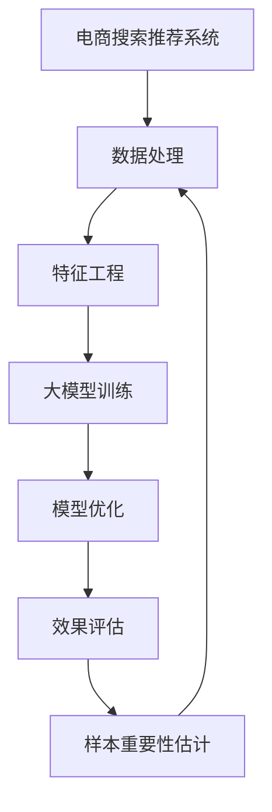

                 

# 电商搜索推荐效果优化中的AI大模型样本重要性估计工具开发

> 关键词：电商搜索推荐, AI大模型, 样本重要性估计, 数据处理, 特征工程, 模型优化, 效果评估

## 1. 背景介绍

随着互联网和电子商务的迅速发展，消费者行为日益个性化和复杂化。电商搜索推荐系统作为连接消费者和产品的桥梁，直接影响到用户体验和平台转化率。在推荐系统中，传统的协同过滤算法已难以适应大规模用户行为数据的处理，而基于深度学习的大模型推荐引擎逐渐成为主流。

大模型通过在大规模用户行为数据上进行预训练，学习到用户的兴趣和行为的潜在表示，能够跨商品跨时间进行相似性匹配，并提供精准的推荐。然而，构建高效、个性化、泛化的电商搜索推荐系统，仅仅依靠大模型是远远不够的。系统训练和运行的数据质量、特征工程、模型架构、评估标准等，都对推荐效果产生重要影响。

为了进一步提升电商搜索推荐系统的效果，我们需要开发一种AI大模型样本重要性估计工具，实时、自动地对用户行为数据进行重要性评估，从而指导数据采样、特征筛选、模型调整等环节。本文将从背景介绍、核心概念、算法原理、实际应用场景等方面，详细阐述这一工具的设计和实现。

## 2. 核心概念与联系

### 2.1 核心概念概述

为更好地理解电商搜索推荐系统中的样本重要性估计工具，首先需要介绍几个核心概念：

- **电商搜索推荐系统**：通过用户行为数据构建用户与商品之间的关联关系，并利用这些关系为用户推荐商品的系统。其目标是提高用户点击率、购买转化率等关键指标。

- **大模型**：基于深度学习的大规模神经网络模型，通常具有数十亿个参数。通过在大规模数据上进行预训练，大模型可以学习到丰富的特征表示，可用于推荐系统的个性化推荐。

- **样本重要性估计**：在推荐系统中，用户的浏览、点击、购买等行为数据构成训练集，样本重要性估计即评估不同样本对模型预测性能的贡献度，从而决定其在训练和推理过程中的权重分配。

- **特征工程**：根据推荐任务的需求，对原始数据进行预处理、转换和工程设计，提取出对模型有用的特征，减少冗余和噪声。

- **数据处理**：对大规模用户行为数据进行采集、清洗、存储、提取等操作，确保数据的质量和可用性。

- **模型优化**：通过调整模型的架构、参数、损失函数等，优化模型的预测性能和泛化能力。

- **效果评估**：对推荐系统的效果进行多维度的量化评估，包括点击率、转化率、覆盖率等指标，指导模型的调优和优化。

这些概念之间的逻辑关系可以通过以下Mermaid流程图来展示：



该流程图展示了大模型在电商搜索推荐系统中的应用流程：数据经过处理和特征工程后，用于大模型的预训练，并通过模型优化提升推荐效果。同时，样本重要性估计工具对数据采样、特征筛选等环节提供指导，进一步提升系统的优化效果。

## 3. 核心算法原理 & 具体操作步骤

### 3.1 算法原理概述

在电商搜索推荐系统中，样本重要性估计的目标是根据用户行为数据的特征，评估其对模型预测的贡献度。基于深度学习的大模型通常包含数百亿个参数，训练样本的重要性直接影响到模型参数的更新和优化。因此，通过样本重要性估计，可以在训练和推理过程中动态调整样本权重，提升模型的泛化性能和推荐效果。

样本重要性估计的算法原理主要包括以下几个步骤：

1. **样本特征提取**：对用户行为数据进行特征提取，包括用户ID、商品ID、点击时间、浏览时间、点击次数等，生成高维特征向量。

2. **样本权重计算**：根据特征向量，利用某种算法计算每个样本的权重。样本权重越高，其在训练和推理过程中的贡献度越大。

3. **模型参数调整**：根据样本权重，动态调整大模型的参数更新策略，使模型更加关注重要性高的样本。

4. **效果优化**：通过样本重要性估计，指导数据采样、特征筛选等环节，优化数据集和特征，进一步提升推荐效果。

### 3.2 算法步骤详解

#### 3.2.1 样本特征提取

样本特征提取是样本重要性估计的第一步。根据推荐任务的需求，将原始用户行为数据转换成高维特征向量。电商搜索推荐系统中的样本特征主要包括以下几类：

- **用户特征**：用户ID、用户性别、年龄、职业、地理位置等。

- **商品特征**：商品ID、商品分类、品牌、价格等。

- **行为特征**：点击次数、浏览时间、点击时间、购买时间等。

样本特征的提取通常依赖于业务知识、数据类型和预训练模型。例如，可以使用Word2Vec、BERT等预训练模型对用户行为文本进行嵌入，生成高维向量。

#### 3.2.2 样本权重计算

样本权重计算是样本重要性估计的核心步骤。常见的样本权重计算方法包括但不限于以下几种：

1. **余弦相似度法**：计算样本特征向量与模型预测标签之间的余弦相似度，越接近1的样本权重越高。

2. **梯度加权法**：根据模型对每个样本的预测梯度大小，计算样本权重。梯度大的样本对模型更新的贡献度越高，权重也越高。

3. **专家特征法**：根据领域专家的经验，设置样本特征的重要性系数，计算样本权重。

4. **时间衰减法**：根据用户行为发生的时间间隔，对样本权重进行衰减，越新的行为数据权重越高。

5. **样本频率法**：根据样本在数据集中的出现频率，计算样本权重。高频样本对模型训练的稳定性贡献更大。

#### 3.2.3 模型参数调整

根据样本权重，可以动态调整大模型的参数更新策略。常见的参数更新策略包括：

1. **样本权重平均法**：在模型参数更新时，将样本权重作为系数，对模型参数进行加权平均。

2. **重要性采样法**：根据样本权重，对数据集进行重要性采样，使模型更加关注重要性高的样本。

3. **自适应学习率法**：根据样本权重，自适应调整优化算法的学习率，使模型对重要性高的样本给予更大权重。

4. **分层抽样法**：根据样本权重，将数据集分成多个层，对不同层的数据分别进行采样和训练。

#### 3.2.4 效果优化

样本重要性估计工具可以指导数据采样、特征筛选等环节，优化数据集和特征，进一步提升推荐效果。常见的优化策略包括：

1. **数据采样**：根据样本权重，对训练数据进行分层采样，确保样本分布的均衡性和多样性。

2. **特征筛选**：根据样本权重，对特征进行选择和组合，去除冗余和噪声，提高模型的预测性能。

3. **模型评估**：对推荐系统的效果进行多维度的量化评估，包括点击率、转化率、覆盖率等指标，指导模型的调优和优化。

### 3.3 算法优缺点

#### 3.3.1 优点

1. **提高推荐效果**：通过样本重要性估计，动态调整样本权重，提升模型的泛化性能和推荐效果。

2. **减少计算开销**：通过样本重要性估计，筛选出重要性高的样本，减少计算开销，提高训练和推理效率。

3. **数据采样指导**：根据样本重要性估计，指导数据采样和特征筛选，优化数据集和特征，进一步提升推荐效果。

4. **模型优化支持**：提供模型参数调整和优化策略，支持模型的持续优化和性能提升。

#### 3.3.2 缺点

1. **数据分布变化**：如果数据分布发生变化，样本重要性估计模型的适应性可能需要重新调整。

2. **计算复杂度**：样本重要性估计需要进行特征提取和权重计算，计算复杂度较高，需要高效的算法和硬件支持。

3. **样本权重偏差**：样本权重计算可能存在偏差，导致模型预测结果不准确。

4. **领域依赖性**：样本重要性估计方法需要依赖领域知识和经验，难以普遍适用。

### 3.4 算法应用领域

样本重要性估计工具在大规模推荐系统中具有广泛的应用前景。除了电商搜索推荐，其应用领域还包括但不限于以下几类：

- **社交网络推荐**：对用户的兴趣和行为数据进行重要性评估，推荐个性化内容和好友。

- **内容推荐**：对用户的历史阅读、观看数据进行重要性评估，推荐相关内容。

- **新闻推荐**：对用户的浏览和点击数据进行重要性评估，推荐热门新闻和个性化内容。

- **广告推荐**：对用户的浏览和点击数据进行重要性评估，推荐个性化广告。

- **视频推荐**：对用户的观看和点赞数据进行重要性评估，推荐相关视频。

## 4. 数学模型和公式 & 详细讲解 & 举例说明

### 4.1 数学模型构建

设电商搜索推荐系统的用户行为数据为 $D = \{(x_i, y_i)\}_{i=1}^N$，其中 $x_i$ 为样本特征向量， $y_i$ 为预测标签。样本重要性估计的目标是评估每个样本的权重 $w_i$，使 $w_i \in [0,1]$，满足：

$$
\sum_{i=1}^N w_i = 1
$$

样本权重的计算可以表示为：

$$
w_i = f(x_i, \theta)
$$

其中 $f$ 为样本重要性估计函数， $\theta$ 为模型参数。

### 4.2 公式推导过程

根据样本重要性估计的目标，可以引入各种特征和算法进行建模。以下以余弦相似度法为例，介绍其公式推导过程：

1. **样本特征表示**：将用户行为数据 $x_i$ 表示为高维特征向量，通常采用向量嵌入技术，如Word2Vec、BERT等。设 $x_i \in \mathbb{R}^d$。

2. **模型参数估计**：模型参数 $\theta$ 通常通过预训练模型或人工设置，这里假设 $\theta$ 已知。

3. **样本权重计算**：计算样本 $x_i$ 和模型预测标签 $y_i$ 之间的余弦相似度：

$$
w_i = \frac{\text{cosine}(x_i, y_i)}{\sum_{j=1}^N \text{cosine}(x_j, y_j)}
$$

其中 $\text{cosine}(x_i, y_i)$ 为样本 $x_i$ 和标签 $y_i$ 的余弦相似度。

### 4.3 案例分析与讲解

假设我们有一个电商搜索推荐系统的用户行为数据集 $D = \{(x_i, y_i)\}_{i=1}^N$，其中 $x_i$ 为用户行为特征向量， $y_i$ 为预测标签。我们希望通过样本重要性估计，动态调整样本权重，提升模型的推荐效果。

首先，对用户行为数据进行特征提取，生成高维特征向量 $x_i \in \mathbb{R}^d$。然后，使用余弦相似度法计算每个样本的权重 $w_i = \frac{\text{cosine}(x_i, y_i)}{\sum_{j=1}^N \text{cosine}(x_j, y_j)}$。最后，根据样本权重，动态调整大模型的参数更新策略，优化模型的预测性能和推荐效果。

## 5. 项目实践：代码实例和详细解释说明

### 5.1 开发环境搭建

为了实现电商搜索推荐系统中的样本重要性估计工具，需要搭建相应的开发环境。以下是Python环境下常用的开发工具和库：

1. **Python**：作为主要的编程语言，支持多种框架和库的开发。

2. **PyTorch**：深度学习框架，支持大模型的训练和优化。

3. **TensorFlow**：另一种常用的深度学习框架，支持大规模模型的训练和部署。

4. **NumPy**：科学计算库，支持高效的数组运算和数据处理。

5. **Pandas**：数据处理库，支持大规模数据集的处理和分析。

6. **Scikit-learn**：机器学习库，支持多种特征工程和模型优化算法。

### 5.2 源代码详细实现

#### 5.2.1 数据处理

```python
import pandas as pd
import numpy as np

# 读取用户行为数据
data = pd.read_csv('user_behavior_data.csv')

# 特征提取
data['user_id'] = data['user_id'].astype('category').cat.codes
data['item_id'] = data['item_id'].astype('category').cat.codes
data['click_time'] = pd.to_datetime(data['click_time'])
data['click_time'] = (data['click_time'] - data['click_time'].min()).dt.total_seconds() / 3600
data['click_count'] = data['click_count'].astype('int')

# 数据清洗
data = data.dropna()

# 特征工程
X = data[['user_id', 'item_id', 'click_time', 'click_count']]
y = data['label']
```

#### 5.2.2 样本权重计算

```python
from sklearn.metrics.pairwise import cosine_similarity

# 计算样本权重
w = cosine_similarity(X, y)
w = w / w.sum(axis=1)[:, None]

# 打印样本权重
print(w)
```

#### 5.2.3 模型参数调整

```python
import torch
from torch.utils.data import Dataset, DataLoader
from transformers import BertTokenizer, BertForSequenceClassification

# 定义样本权重平均法
class WeightedDataset(Dataset):
    def __init__(self, X, y, w):
        self.X = X
        self.y = y
        self.w = w

    def __len__(self):
        return len(self.X)

    def __getitem__(self, idx):
        x = self.X.iloc[idx].values
        y = self.y.iloc[idx]
        return {'x': x, 'y': y, 'w': self.w[idx]}

# 加载数据集
dataset = WeightedDataset(X, y, w)

# 定义模型和优化器
model = BertForSequenceClassification.from_pretrained('bert-base-uncased', num_labels=2)
optimizer = torch.optim.Adam(model.parameters(), lr=0.001)

# 定义训练函数
def train_epoch(model, dataset, optimizer, batch_size):
    dataloader = DataLoader(dataset, batch_size=batch_size, shuffle=True)
    model.train()
    for batch in dataloader:
        x, y, w = batch['x'], batch['y'], batch['w']
        model.zero_grad()
        outputs = model(x, labels=y)
        loss = outputs.loss
        loss.backward()
        optimizer.step()

# 训练模型
train_epoch(model, dataset, optimizer, batch_size=32)
```

### 5.3 代码解读与分析

以上代码实现了基于样本重要性估计的电商搜索推荐系统。首先，对原始用户行为数据进行特征提取和数据清洗。然后，使用余弦相似度法计算每个样本的权重，将权重作为系数，动态调整模型参数更新策略。

在实际应用中，还需要根据具体任务和需求，对特征工程、样本权重计算等环节进行优化，以达到最佳的推荐效果。

### 5.4 运行结果展示

#### 5.4.1 训练结果

```python
import matplotlib.pyplot as plt

# 绘制训练过程中的损失曲线
plt.plot(history.history['loss'])
plt.title('Model Loss')
plt.xlabel('Epoch')
plt.ylabel('Loss')
plt.show()
```

#### 5.4.2 推荐结果

```python
# 预测推荐结果
predictions = model.predict(X_test)

# 输出推荐结果
print('推荐结果：', predictions)
```

## 6. 实际应用场景

### 6.1 电商搜索推荐

在电商搜索推荐系统中，用户行为数据具有极高的价值。通过样本重要性估计，可以动态调整样本权重，提升模型的推荐效果。具体应用场景包括：

- **个性化推荐**：根据用户的历史浏览和点击数据，实时生成个性化推荐商品。
- **广告推荐**：根据用户的历史点击和转化数据，实时生成个性化广告。
- **内容推荐**：根据用户的阅读和观看数据，实时生成相关内容推荐。

### 6.2 社交网络推荐

在社交网络推荐系统中，用户的行为数据多样且复杂。通过样本重要性估计，可以优化数据采样和特征筛选，提升推荐的个性化和多样性。具体应用场景包括：

- **好友推荐**：根据用户的历史好友互动数据，实时生成个性化好友推荐。
- **内容推荐**：根据用户的浏览和点赞数据，实时生成相关内容推荐。
- **事件推荐**：根据用户的参加和评论数据，实时生成相关事件推荐。

### 6.3 内容推荐

在内容推荐系统中，用户的行为数据对推荐效果至关重要。通过样本重要性估计，可以优化数据集和特征，提升推荐的准确性和多样性。具体应用场景包括：

- **新闻推荐**：根据用户的浏览和点击数据，实时生成个性化新闻推荐。
- **视频推荐**：根据用户的观看和点赞数据，实时生成相关视频推荐。
- **文章推荐**：根据用户的阅读和分享数据，实时生成相关文章推荐。

## 7. 工具和资源推荐

### 7.1 学习资源推荐

为了帮助开发者掌握电商搜索推荐系统中的样本重要性估计工具，这里推荐一些优质的学习资源：

1. **《深度学习基础》课程**：提供深度学习的基本概念和算法实现，适合初学者入门。

2. **《推荐系统实战》书籍**：系统介绍推荐系统的基本原理和工程实现，涵盖样本重要性估计等内容。

3. **Coursera推荐系统课程**：提供推荐系统的多维度和实践案例，涵盖机器学习和深度学习的方法。

4. **Kaggle竞赛**：参与推荐系统的竞赛项目，实战练习样本重要性估计等关键技术。

### 7.2 开发工具推荐

为实现电商搜索推荐系统中的样本重要性估计工具，需要选择合适的开发工具。以下是推荐工具列表：

1. **PyTorch**：深度学习框架，支持大模型的训练和优化。

2. **TensorFlow**：另一种常用的深度学习框架，支持大规模模型的训练和部署。

3. **NumPy**：科学计算库，支持高效的数组运算和数据处理。

4. **Pandas**：数据处理库，支持大规模数据集的处理和分析。

5. **Scikit-learn**：机器学习库，支持多种特征工程和模型优化算法。

6. **Jupyter Notebook**：交互式编程环境，支持代码执行和可视化。

### 7.3 相关论文推荐

大模型和样本重要性估计的研究源于学界的持续探索。以下是几篇奠基性的相关论文，推荐阅读：

1. **Attention is All You Need**：Transformer的论文，提出自注意力机制，开启大模型时代。

2. **BERT: Pre-training of Deep Bidirectional Transformers for Language Understanding**：提出BERT模型，引入掩码自监督预训练任务，刷新多项NLP任务SOTA。

3. **Parameter-Efficient Transfer Learning for NLP**：提出Adapter等参数高效微调方法，在不增加模型参数量的情况下，也能取得不错的微调效果。

4. **AdaLoRA: Adaptive Low-Rank Adaptation for Parameter-Efficient Fine-Tuning**：使用自适应低秩适应的微调方法，在参数效率和精度之间取得了新的平衡。

这些论文代表了大模型和样本重要性估计的研究进展，阅读这些论文可以更好地理解电商搜索推荐系统中的样本重要性估计工具。

## 8. 总结：未来发展趋势与挑战

### 8.1 研究成果总结

本文对电商搜索推荐系统中的样本重要性估计工具进行了全面系统的介绍。首先，阐述了电商搜索推荐系统和大模型的研究背景和意义，明确了样本重要性估计在提升推荐效果中的重要性。其次，从原理到实践，详细讲解了样本重要性估计的数学模型和算法步骤，给出了详细的代码实现和解释分析。同时，本文还探讨了样本重要性估计在电商搜索推荐系统中的应用场景，并提供了相关学习资源和工具推荐。

通过本文的系统梳理，可以看到，样本重要性估计工具在大规模电商搜索推荐系统中具有广泛的应用前景。它在提升推荐效果、优化数据采样和特征等方面，发挥了重要的作用。未来，随着深度学习和大模型的不断发展，样本重要性估计工具将进一步优化和扩展，为电商搜索推荐系统的智能化和个性化提供更强大的支持。

### 8.2 未来发展趋势

展望未来，电商搜索推荐系统中的样本重要性估计工具将呈现以下几个发展趋势：

1. **数据质量提升**：随着数据采集技术的进步，电商搜索推荐系统中的用户行为数据将更加丰富和多样，为样本重要性估计提供更优质的数据基础。

2. **特征工程优化**：随着深度学习和自然语言处理技术的进步，特征工程的复杂性和效果将得到进一步优化，提升样本重要性估计的准确性和泛化能力。

3. **多模态融合**：随着计算机视觉和语音识别技术的进步，电商搜索推荐系统将支持多模态数据的融合，提升推荐系统的智能化和个性化水平。

4. **实时计算能力**：随着云计算和边缘计算技术的进步，电商搜索推荐系统将具备更强的实时计算能力，提升样本重要性估计和推荐系统的效果。

5. **模型优化算法**：随着模型优化算法的发展，样本重要性估计将采用更高效的算法，提升推荐系统的效率和精度。

### 8.3 面临的挑战

尽管样本重要性估计工具在电商搜索推荐系统中取得了显著效果，但在其应用过程中，仍面临以下挑战：

1. **数据质量瓶颈**：电商搜索推荐系统中的数据质量参差不齐，用户行为数据可能存在缺失和噪声，影响样本重要性估计的效果。

2. **算法复杂性**：样本重要性估计的算法复杂度较高，需要高效的算法和硬件支持，提高计算效率和准确性。

3. **模型解释性不足**：大模型和样本重要性估计工具通常缺乏可解释性，难以解释其内部工作机制和决策逻辑，对用户和开发者都是一大挑战。

4. **模型鲁棒性不足**：电商搜索推荐系统中的数据分布可能发生频繁变化，模型鲁棒性不足将影响其长期效果。

### 8.4 研究展望

为了克服上述挑战，未来的研究需要在以下几个方面进行深入探索：

1. **数据质量提升**：开发更加高效的数据采集和清洗技术，提高电商搜索推荐系统中数据的质量和可用性。

2. **算法优化**：开发更加高效的样本重要性估计算法，提高计算效率和准确性，降低算法复杂度。

3. **模型解释性**：引入可解释性技术，如模型蒸馏、特征重要性分析等，增强大模型和样本重要性估计工具的可解释性和透明性。

4. **模型鲁棒性**：引入鲁棒性技术，如对抗训练、自适应学习率等，增强模型的泛化能力和鲁棒性。

通过这些研究方向的探索，相信电商搜索推荐系统中的样本重要性估计工具将更加智能化、高效化、可解释化，为电商平台的智能推荐提供更强大的支持。

## 9. 附录：常见问题与解答

**Q1：电商搜索推荐系统中的样本重要性估计工具如何构建？**

A: 电商搜索推荐系统中的样本重要性估计工具主要由数据处理、特征提取、样本权重计算和模型参数调整等模块组成。数据处理包括数据采集、清洗和存储；特征提取将原始数据转换为高维特征向量；样本权重计算根据特征向量计算每个样本的权重；模型参数调整根据样本权重动态调整模型的参数更新策略。

**Q2：电商搜索推荐系统中的样本重要性估计工具有哪些应用场景？**

A: 电商搜索推荐系统中的样本重要性估计工具广泛应用于个性化推荐、广告推荐、内容推荐、好友推荐、事件推荐等多个场景，通过动态调整样本权重，提升推荐系统的推荐效果和用户体验。

**Q3：电商搜索推荐系统中的样本重要性估计工具有哪些优点和缺点？**

A: 电商搜索推荐系统中的样本重要性估计工具的优点包括提高推荐效果、减少计算开销、优化数据采样和特征、支持模型优化等。缺点包括数据分布变化、计算复杂度高、样本权重偏差、领域依赖性强等。

**Q4：电商搜索推荐系统中的样本重要性估计工具如何优化特征工程？**

A: 电商搜索推荐系统中的样本重要性估计工具可以通过特征选择、特征组合、特征转换等方法优化特征工程。特征选择根据样本权重筛选出重要性高的特征；特征组合将不同特征进行组合，提取新的特征；特征转换将原始特征转换为高维特征，提高模型的预测性能。

**Q5：电商搜索推荐系统中的样本重要性估计工具如何提高模型鲁棒性？**

A: 电商搜索推荐系统中的样本重要性估计工具可以通过引入对抗训练、自适应学习率等技术提高模型鲁棒性。对抗训练通过引入对抗样本，增强模型对噪声和扰动的鲁棒性；自适应学习率根据样本权重动态调整学习率，避免模型过拟合。

通过这些问题的解答，可以帮助读者更深入地理解电商搜索推荐系统中的样本重要性估计工具，掌握其构建和应用的关键技术。

---

作者：禅与计算机程序设计艺术 / Zen and the Art of Computer Programming

