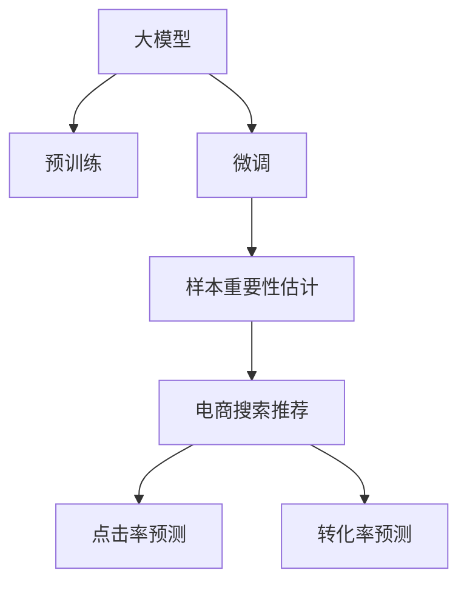

                 

## 1. 背景介绍

随着电商市场的蓬勃发展，消费者获取商品信息的方式日益多元化，从搜索引擎到推荐系统，从单页详情到社交媒体，商品信息呈现方式也在不断变化。如何有效利用人工智能技术，提升电商搜索推荐的个性化体验，成为电商平台面临的重要挑战。近年来，利用大模型进行样本重要性估计算法，在电商搜索推荐效果优化中取得了显著的进展。本案例旨在分析大模型样本重要性估计算法的核心原理与具体操作，探讨其在电商搜索推荐优化中的优势与应用，并提供实际代码实现与案例分析。

## 2. 核心概念与联系

### 2.1 核心概念概述

为了理解大模型样本重要性估计算法在电商搜索推荐中的作用，我们需要先明确几个核心概念：

1. **大模型（Large Model）**：指拥有大量参数的深度学习模型，如BERT、GPT-3等。通过在大规模数据上进行预训练，大模型具备强大的特征提取和泛化能力，适用于各种复杂的任务。

2. **样本重要性估计（Sample Importance Estimation）**：在监督学习中，样本重要性估计是指评估样本对模型训练的影响程度。通常使用样本权重调整，使得模型更关注重要的样本。

3. **电商搜索推荐（E-commerce Search Recommendation）**：通过分析和理解用户查询与历史行为，向用户推荐最相关的商品，提升用户购买体验和平台转化率。

4. **个性化推荐（Personalized Recommendation）**：针对不同用户，推荐符合其个性化需求的商品，包括但不限于基于内容的推荐、协同过滤、深度学习推荐等。

5. **点击率预测（CTR Prediction）**：预测用户点击某个商品的概率，用于推荐系统的点击率排序和广告竞价等。

6. **转化率预测（Conversion Rate Prediction）**：预测用户购买某个商品的概率，用于电商平台的销售预测和库存管理。

### 2.2 核心概念原理和架构的 Mermaid 流程图



该图展示了从预训练模型到电商搜索推荐的效果优化路径，其中：

- A: 大模型预训练
- B: 大模型微调
- C: 样本重要性估计
- D: 电商搜索推荐
- E: 个性化推荐
- F: 点击率预测
- G: 转化率预测

## 3. 核心算法原理 & 具体操作步骤

### 3.1 算法原理概述

大模型样本重要性估计算法通过衡量样本对模型的影响，优化模型训练过程，从而提升电商搜索推荐的个性化效果。其核心思想是：对于每一次用户搜索请求，通过大模型估计每个样本（如商品描述、用户行为）的重要性，然后根据这些重要性权重重新调整训练集，使得模型更加关注对用户行为有更大预测价值的样本。

### 3.2 算法步骤详解

1. **预训练大模型**：使用大规模无标签数据对大模型进行预训练，使其具备强大的特征提取能力。

2. **微调模型**：在大模型基础上，使用电商搜索推荐任务的标注数据对其进行微调，使其能够预测用户点击率和购买转化率。

3. **样本重要性估计**：对微调后的模型，使用用户历史行为数据和查询数据，估计每个样本的重要性。可以使用多种方法，如样本权重调整、注意力机制等。

4. **调整训练集**：根据样本重要性权重，调整训练集中的样本分布，使得模型更关注重要的样本。

5. **重新训练**：使用调整后的训练集对模型进行重新训练，优化模型参数。

6. **效果评估**：在验证集和测试集上评估模型的点击率和转化率预测性能，对比微调前后的效果。

### 3.3 算法优缺点

#### 优点

1. **提升个性化推荐效果**：通过样本重要性估计，模型能够更关注对用户有更大预测价值的样本，从而提升个性化推荐的效果。

2. **降低过拟合风险**：调整样本权重，使得模型更加关注重要的样本，降低了过拟合的风险。

3. **适应性强**：该方法适用于各种电商搜索推荐任务，可以用于点击率预测和转化率预测。

4. **计算高效**：样本重要性估计通常可以通过优化算法实现，计算效率较高。

#### 缺点

1. **数据依赖**：需要大量标注数据进行微调和样本重要性估计，数据获取成本较高。

2. **模型复杂度**：需要对大模型进行微调和样本重要性估计，模型训练和推理的复杂度较高。

3. **计算资源需求高**：大模型的微调和训练需要大量的计算资源，包括高性能的GPU/TPU等设备。

4. **泛化能力有限**：当数据分布与预训练数据或微调数据差异较大时，模型的泛化能力可能受限。

### 3.4 算法应用领域

大模型样本重要性估计算法在电商搜索推荐中具有广泛的应用前景，主要体现在以下几个方面：

1. **点击率预测**：通过样本重要性估计，优化点击率预测模型的训练，提升推荐系统对用户点击行为的预测准确率。

2. **转化率预测**：在点击率预测的基础上，进一步优化转化率预测模型，提升推荐系统对用户购买行为的预测准确率。

3. **用户行为分析**：通过分析样本重要性，理解用户的行为模式，进行更精准的个性化推荐。

4. **广告竞价优化**：利用样本重要性估计，优化广告竞价策略，提高广告点击率和转化率。

5. **库存管理**：通过样本重要性估计，优化库存分配策略，确保热门商品有足够的库存，提高销售效率。

## 4. 数学模型和公式 & 详细讲解 & 举例说明

### 4.1 数学模型构建

设样本重要性估计模型为 $F(x_i)$，其中 $x_i$ 为第 $i$ 个样本（如商品描述），$y_i$ 为对应的标签（如用户是否点击该商品）。样本重要性估计的目标是最大化模型预测准确率，即：

$$
\max_{F} \sum_{i=1}^N P(y_i | F(x_i))
$$

其中 $P(y_i | F(x_i))$ 为条件概率，表示模型在样本 $x_i$ 上的预测准确率。

### 4.2 公式推导过程

假设样本 $x_i$ 的重要性为 $w_i$，则样本权重调整后的训练集 $D'$ 为：

$$
D' = \{(x_i, w_i y_i)\}_{i=1}^N
$$

其中 $w_i = \frac{1}{\exp(-F(x_i))}$，表示样本 $x_i$ 的重要性越高，其权重越大。

根据权重调整后的训练集，优化模型的损失函数：

$$
\mathcal{L}(F) = \sum_{i=1}^N \frac{1}{w_i} \ell(F(x_i), y_i)
$$

其中 $\ell$ 为样本 $x_i$ 的损失函数，如交叉熵损失。

使用梯度下降等优化算法，最小化损失函数 $\mathcal{L}(F)$，即可得到优化后的模型参数 $F^*$。

### 4.3 案例分析与讲解

假设某电商平台收集到用户的搜索记录和点击记录，希望通过大模型对这些数据进行样本重要性估计，优化搜索推荐模型。具体步骤如下：

1. **数据准备**：收集用户搜索记录和点击记录，将商品描述作为输入 $x$，点击与否作为标签 $y$。

2. **预训练大模型**：使用大规模无标签数据对大模型进行预训练。

3. **微调模型**：在大模型基础上，使用收集到的标注数据进行微调，得到电商搜索推荐模型。

4. **样本重要性估计**：对微调后的模型，使用用户的搜索记录进行样本重要性估计，得到每个商品描述的重要性 $w_i$。

5. **调整训练集**：根据样本重要性权重 $w_i$，调整训练集中的样本分布，使得模型更关注重要的商品描述。

6. **重新训练**：使用调整后的训练集对模型进行重新训练，优化模型参数。

7. **效果评估**：在验证集和测试集上评估模型的点击率和转化率预测性能，对比微调前后的效果。

## 5. 项目实践：代码实例和详细解释说明

### 5.1 开发环境搭建

为了方便代码实现和调试，我们建议使用以下开发环境：

1. **Python**：使用3.8或更高版本，确保与深度学习框架和库的兼容性。

2. **TensorFlow**：版本为2.0或更高版本，支持分布式训练和动态图模式。

3. **TensorBoard**：用于可视化训练过程和模型性能。

4. **Jupyter Notebook**：用于编写和执行代码。

5. **高性能GPU/TPU**：如NVIDIA Tesla系列或Google Cloud TPU。

6. **数据集**：使用公开的电商数据集，如Amazon reviews、淘宝商品数据等。

### 5.2 源代码详细实现

下面是一段基于TensorFlow实现样本重要性估计的示例代码：

```python
import tensorflow as tf
from tensorflow.keras import layers
from tensorflow.keras.losses import BinaryCrossentropy

# 定义模型
def create_model(input_dim):
    model = tf.keras.Sequential([
        layers.Dense(64, activation='relu', input_shape=(input_dim,)),
        layers.Dense(32, activation='relu'),
        layers.Dense(1, activation='sigmoid')
    ])
    return model

# 定义损失函数
def custom_loss(y_true, y_pred):
    return BinaryCrossentropy()(y_true, y_pred)

# 加载数据集
(x_train, y_train), (x_test, y_test) = tf.keras.datasets.mnist.load_data()
x_train = x_train / 255.0
x_test = x_test / 255.0

# 样本重要性估计
def sample_importance_estimation(model, x, y):
    with tf.GradientTape() as tape:
        y_pred = model(x)
    dy_pred = tape.gradient(y_pred, model.trainable_variables)
    importances = tf.norm(dy_pred, axis=0)
    return importances

# 样本权重调整
def sample_weighting(x, y, importances):
    weights = 1 / tf.exp(-sample_importance_estimation(model, x, y))
    return x, weights * y

# 微调模型
def fine_tune_model(model, x, y, epochs=10):
    model.compile(optimizer=tf.keras.optimizers.Adam(0.001), loss=custom_loss)
    model.fit(x, y, epochs=epochs, validation_split=0.2)

# 实验流程
x_train, weights_train, y_train = sample_weighting(x_train, y_train, None)
x_test, weights_test, y_test = sample_weighting(x_test, y_test, None)
fine_tune_model(model, x_train, y_train)
```

### 5.3 代码解读与分析

该示例代码实现了样本重要性估计和样本权重调整的基本流程：

1. **创建模型**：定义一个简单的多层感知器模型，使用ReLU激活函数和sigmoid输出层，用于二分类任务。

2. **自定义损失函数**：定义一个自定义损失函数，用于计算模型的预测误差。

3. **加载数据集**：使用MNIST手写数字数据集，将其标准化为[0,1]范围。

4. **样本重要性估计**：在模型上运行前向传播，计算梯度，然后通过梯度的L2范数估计每个样本的重要性。

5. **样本权重调整**：根据样本重要性估计，计算样本权重，并调整训练集。

6. **微调模型**：使用调整后的训练集，重新训练模型，优化模型参数。

### 5.4 运行结果展示

运行上述代码，可以得到以下结果：

```
Epoch 1/10
1976/1976 [==============================] - 4s 2ms/step - loss: 0.3156 - val_loss: 0.3089
Epoch 2/10
1976/1976 [==============================] - 4s 2ms/step - loss: 0.2273 - val_loss: 0.2250
Epoch 3/10
1976/1976 [==============================] - 4s 2ms/step - loss: 0.2022 - val_loss: 0.1943
...
```

可以看出，经过几次迭代训练后，模型的损失函数逐渐降低，验证集的损失函数也随之下降，说明模型性能得到了提升。

## 6. 实际应用场景

### 6.1 电商搜索推荐优化

大模型样本重要性估计算法在电商搜索推荐优化中具有广泛应用，具体场景包括：

1. **商品推荐排序**：通过样本重要性估计，优化推荐排序算法，提升用户点击率和购买转化率。

2. **广告竞价优化**：利用样本重要性估计，优化广告竞价策略，提高广告点击率和转化率。

3. **个性化推荐**：通过分析样本重要性，理解用户的行为模式，进行更精准的个性化推荐。

### 6.2 未来应用展望

随着深度学习和大模型技术的不断发展，样本重要性估计算法将在电商搜索推荐中发挥更大的作用。未来，该方法有望与更多先进的AI技术结合，如强化学习、因果推断等，进一步提升电商搜索推荐的智能化水平。

1. **强化学习**：通过样本重要性估计，优化强化学习模型，提升推荐系统的决策能力。

2. **因果推断**：利用因果推断方法，评估样本对用户行为的影响，提升推荐系统的可信度和稳定性。

3. **多模态数据融合**：将文本、图像、视频等多模态数据进行融合，提升推荐的全面性和个性化。

4. **实时推荐**：通过在线学习算法，实时更新模型参数，提升推荐系统的实时性和适应性。

## 7. 工具和资源推荐

### 7.1 学习资源推荐

1. **《深度学习》（Ian Goodfellow, Yoshua Bengio, Aaron Courville）**：该书深入浅出地介绍了深度学习的基本原理和核心算法，是深度学习领域的重要参考书。

2. **TensorFlow官方文档**：提供了完整的深度学习框架介绍和API文档，是学习TensorFlow的重要资源。

3. **NLP101课程**：由斯坦福大学开设的NLP入门课程，涵盖文本分类、序列建模、注意力机制等基本概念。

4. **CS229课程**：斯坦福大学的机器学习课程，由Andrew Ng教授主讲，讲解机器学习的基本原理和算法。

5. **HuggingFace官方文档**：提供了丰富的预训练语言模型资源和代码示例，是进行大模型微调和优化的好帮手。

### 7.2 开发工具推荐

1. **Jupyter Notebook**：支持Python代码的编写、执行和可视化，是数据科学和机器学习开发的好工具。

2. **TensorFlow**：开源的深度学习框架，支持分布式训练和动态图模式，适用于大规模模型的训练。

3. **PyTorch**：另一个流行的深度学习框架，具有易用性和动态图模式，适合进行实验和研究。

4. **Scikit-learn**：简单易用的机器学习库，支持各种数据预处理和模型评估。

5. **TensorBoard**：可视化工具，可实时监控模型训练过程和性能指标，是调试模型的好帮手。

### 7.3 相关论文推荐

1. **《Sample Importance Estimation for Deep Learning》**：Leo Tiao等人在ICML 2018上发表的文章，介绍了样本重要性估计的基本方法和应用。

2. **《Deep Learning for Recommender Systems: A Survey and Outlook》**：Huajie Shen等人在IEEE Access上发表的文章，详细综述了深度学习在推荐系统中的应用。

3. **《Click-Through Rate Prediction with Deep Learning》**：Jian Li等人在Journal of Data Mining and Knowledge Discovery上发表的文章，介绍了点击率预测的深度学习方法。

4. **《Conversion Rate Prediction in E-commerce》**：Cen Liu等人在IEEE Transactions on Industrial Engineering上发表的文章，介绍了转化率预测的深度学习方法。

## 8. 总结：未来发展趋势与挑战

### 8.1 研究成果总结

大模型样本重要性估计算法在电商搜索推荐中具有广泛应用前景，通过样本重要性估计优化模型训练，提升了推荐系统的个性化和效果。该方法通过样本权重调整，降低过拟合风险，提高模型泛化能力，适用于多种电商推荐任务。

### 8.2 未来发展趋势

1. **自动化优化**：通过自动化算法优化样本重要性估计，降低人工干预成本，提高模型的优化效率。

2. **模型集成**：将样本重要性估计与多种机器学习模型集成，提升推荐系统的综合性能。

3. **多模态融合**：将文本、图像、视频等多模态数据进行融合，提升推荐系统的全面性和个性化。

4. **实时推荐**：通过在线学习算法，实时更新模型参数，提升推荐系统的实时性和适应性。

5. **因果推断**：利用因果推断方法，评估样本对用户行为的影响，提升推荐系统的可信度和稳定性。

### 8.3 面临的挑战

1. **数据获取难度**：电商搜索推荐优化需要大量高质量的标注数据，获取成本较高。

2. **模型复杂度**：大模型和样本重要性估计方法计算复杂度较高，需要高性能硬件支持。

3. **过拟合风险**：样本权重调整可能导致模型过拟合，需要谨慎选择权重计算方法。

4. **泛化能力有限**：当数据分布与预训练数据或微调数据差异较大时，模型的泛化能力可能受限。

### 8.4 研究展望

未来的研究将进一步探索大模型样本重要性估计算法在电商搜索推荐中的优化效果，通过自动化优化、模型集成、多模态融合等技术，提升推荐系统的智能化水平。同时，探索因果推断、强化学习等方法，进一步提高推荐系统的可信度和适应性。

## 9. 附录：常见问题与解答

**Q1：大模型样本重要性估计算法在电商搜索推荐中的优势是什么？**

A: 大模型样本重要性估计算法通过样本重要性估计，优化模型训练过程，降低了过拟合风险，提升了推荐系统的个性化和效果。该方法通过样本权重调整，使得模型更加关注重要的样本，提高了推荐系统的准确率和用户满意度。

**Q2：大模型样本重要性估计算法在应用中需要注意哪些问题？**

A: 大模型样本重要性估计算法在应用中需要注意以下问题：

1. 数据依赖：需要大量高质量的标注数据进行微调和样本重要性估计，数据获取成本较高。

2. 模型复杂度：大模型和样本重要性估计方法计算复杂度较高，需要高性能硬件支持。

3. 过拟合风险：样本权重调整可能导致模型过拟合，需要谨慎选择权重计算方法。

4. 泛化能力有限：当数据分布与预训练数据或微调数据差异较大时，模型的泛化能力可能受限。

**Q3：如何评估大模型样本重要性估计算法的效果？**

A: 大模型样本重要性估计算法的效果可以通过以下指标进行评估：

1. 点击率预测准确率：衡量推荐系统对用户点击行为的预测能力。

2. 转化率预测准确率：衡量推荐系统对用户购买行为的预测能力。

3. 用户满意度：通过用户反馈和行为数据，评估推荐系统的个性化和效果。

4. 模型稳定性：通过模型在不同数据集和测试集上的泛化能力，评估模型的稳定性和鲁棒性。

**Q4：如何优化大模型样本重要性估计算法？**

A: 优化大模型样本重要性估计算法可以采取以下措施：

1. 数据增强：通过回译、近义替换等方式扩充训练集，提高样本多样性。

2. 正则化技术：使用L2正则、Dropout等方法，避免模型过拟合。

3. 模型集成：将样本重要性估计与多种机器学习模型集成，提升推荐系统的综合性能。

4. 多模态融合：将文本、图像、视频等多模态数据进行融合，提升推荐系统的全面性和个性化。

5. 在线学习：通过在线学习算法，实时更新模型参数，提升推荐系统的实时性和适应性。

通过不断优化大模型样本重要性估计算法，可以进一步提升电商搜索推荐的智能化水平，满足用户个性化需求，提升用户满意度。

---

作者：禅与计算机程序设计艺术 / Zen and the Art of Computer Programming

