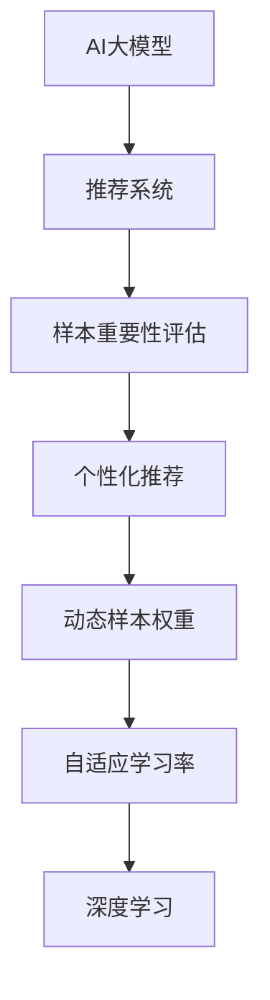

                 

# 电商搜索推荐效果优化中的AI大模型样本重要性评估技术

> 关键词：电商搜索推荐、样本重要性评估、AI大模型、推荐系统、个性化推荐、样本权重、深度学习、Transformer、自适应学习率

## 1. 背景介绍

在电商领域，个性化推荐系统的开发和优化一直是提高用户体验、提升转化率的关键因素。然而，现有的推荐系统往往基于历史用户行为数据进行推荐，这种方法忽略了用户当前的需求和偏好，导致推荐效果不理想。近年来，AI大模型的流行为推荐系统带来了新的思路：利用大规模语料进行预训练，使模型能够自动学习和理解用户行为，进一步提升推荐效果。

尽管AI大模型在推荐系统中的应用效果显著，但在实际部署中仍面临诸多挑战。数据样本的不均衡分布、用户偏好的动态变化等因素，都会影响模型的推荐效果。此外，过度关注少数高价值的样本，而忽略大量低价值样本，会导致模型出现偏置，降低推荐系统的公平性和鲁棒性。

为此，本文将探讨一种基于样本重要性评估的AI大模型优化技术，通过动态调整样本权重，提升电商搜索推荐系统的个性化和精准度。

## 2. 核心概念与联系

### 2.1 核心概念概述

为更好地理解基于样本重要性评估的AI大模型优化方法，本节将介绍几个密切相关的核心概念：

- AI大模型(AI Large Model)：以Transformer等深度学习模型为代表的大规模预训练模型。通过在大规模语料上进行预训练，学习通用的语言表示，具备强大的语言理解和生成能力。

- 推荐系统(Recommendation System)：一种根据用户行为和偏好，自动推荐物品或内容的技术。推荐系统的目标是提高用户满意度，提升转化率。

- 样本重要性评估(Sample Importance Evaluation)：一种评估数据样本对模型训练效果影响的技术。通过估计不同样本对模型性能的贡献度，动态调整样本权重，提高模型的泛化能力和公平性。

- 个性化推荐(Personalized Recommendation)：根据用户的历史行为和当前偏好，推荐用户感兴趣的物品或内容，提高推荐相关性和满意度。

- 动态样本权重(Dynamic Sample Weight)：在模型训练过程中，根据样本的重要性动态调整其权重，以确保模型对高价值样本的学习效果更好。

- 深度学习(Deep Learning)：基于神经网络的机器学习技术，通过多层次的非线性变换，学习特征表示和模式。

- 样本权重调整(Sample Weighting)：在模型训练中，通过调整样本权重，使得模型更加关注有价值的样本，提升模型效果。

- 自适应学习率(Adaptive Learning Rate)：一种动态调整学习率的优化算法，根据模型梯度信息，自适应地调整学习率大小，提升训练效果。

这些核心概念之间的逻辑关系可以通过以下Mermaid流程图来展示：



这个流程图展示了大模型在推荐系统中的应用流程：

1. 大模型通过预训练学习通用的语言表示，用于推荐系统的构建。
2. 推荐系统根据用户行为和偏好进行物品推荐。
3. 样本重要性评估模块通过估计不同样本的贡献度，动态调整样本权重。
4. 个性化推荐模块根据动态权重调整后的样本进行推荐。
5. 自适应学习率模块根据梯度信息动态调整学习率，提高训练效果。
6. 深度学习模型通过多层次的非线性变换，学习特征表示和模式。

## 3. 核心算法原理 & 具体操作步骤

### 3.1 算法原理概述

基于样本重要性评估的AI大模型优化技术，通过动态调整样本权重，确保模型更加关注有价值的样本，提升推荐系统的性能。其核心思想是：在推荐系统构建过程中，利用AI大模型自动学习用户行为，同时通过样本重要性评估模块，动态调整样本权重，使得模型在训练过程中更加关注高价值的样本。

具体而言，算法步骤如下：

1. 收集电商平台的搜索记录和用户行为数据。
2. 利用AI大模型进行预训练，学习通用的语言表示。
3. 将预训练模型作为初始化参数，构建推荐系统。
4. 评估每个样本的重要性，计算其对推荐系统的贡献度。
5. 根据样本重要性动态调整样本权重，确保模型在训练过程中更加关注高价值的样本。
6. 通过动态样本权重调整后的训练数据，更新模型参数，提升推荐效果。

### 3.2 算法步骤详解

以下是基于样本重要性评估的AI大模型优化技术的详细步骤：

**Step 1: 收集电商数据**

首先，需要从电商平台的搜索记录和用户行为数据中收集所需的信息。这些数据包括用户的搜索关键词、浏览历史、购买记录等。为了保证数据的代表性，可以采用随机抽样、分层抽样等方法，确保样本的均衡性和多样性。

**Step 2: 构建AI大模型**

选择合适的AI大模型进行预训练，如BERT、GPT等。这些模型通常在大规模语料上进行预训练，学习通用的语言表示。预训练模型的选择应根据实际应用场景进行调整，如对于电商推荐，可以选择商品描述等特定领域的预训练模型。

**Step 3: 构建推荐系统**

将预训练模型作为初始化参数，构建推荐系统。推荐系统通常包括用户画像建模、物品特征抽取、推荐模型训练等环节。通过用户画像和物品特征的匹配，计算用户对各个物品的评分，并利用推荐模型进行排序，最终输出推荐结果。

**Step 4: 评估样本重要性**

利用样本重要性评估模块，评估每个样本对推荐系统的贡献度。通常可以采用特征重要性评估、局部敏感度分析等方法，计算样本特征对推荐结果的影响。根据评估结果，确定每个样本的重要性权重。

**Step 5: 动态调整样本权重**

根据样本重要性的评估结果，动态调整样本权重。高价值样本（如高点击率、高购买率的样本）应赋予更高的权重，低价值样本则应赋予更低的权重。动态调整样本权重的方法包括基于梯度的动态权重调整、基于样本分布的动态权重调整等。

**Step 6: 更新模型参数**

将动态权重调整后的样本数据，用于训练模型。通过梯度下降等优化算法，更新模型参数，提升推荐系统的性能。更新过程可以使用自适应学习率等优化算法，确保学习率的大小与梯度信息相匹配。

### 3.3 算法优缺点

基于样本重要性评估的AI大模型优化技术具有以下优点：

1. 提升推荐效果：通过动态调整样本权重，确保模型更加关注高价值的样本，提升推荐系统的个性化和精准度。
2. 降低过拟合风险：高价值的样本赋予更高的权重，有助于模型更好地学习用户偏好，降低过拟合风险。
3. 提高公平性：通过动态调整样本权重，减少模型对少数高价值样本的依赖，提升推荐系统的公平性和鲁棒性。
4. 减少计算资源消耗：高价值的样本赋予更高的权重，可以减少无用的样本计算，降低计算资源的消耗。

同时，该方法也存在以下局限性：

1. 数据标注成本高：需要对每个样本进行重要性评估，标注成本较高。
2. 动态权重调整复杂：需要根据实际情况不断调整样本权重，算法实现复杂。
3. 模型性能不稳定：如果高价值样本和低价值样本的比例失衡，可能导致模型性能不稳定。
4. 样本重要性评估准确性：样本重要性评估的准确性直接影响动态权重调整的效果。

尽管存在这些局限性，但就目前而言，基于样本重要性评估的AI大模型优化技术仍然是一种有效提升推荐系统性能的方法。未来相关研究的重点在于如何进一步降低数据标注成本，提高样本重要性评估的准确性，以及设计更加高效的动态权重调整算法。

### 3.4 算法应用领域

基于样本重要性评估的AI大模型优化技术，在电商推荐系统中的应用前景广阔，可以应用于以下场景：

1. 个性化推荐：根据用户搜索历史、浏览历史、购买历史等数据，动态调整样本权重，提升推荐系统的个性化程度。
2. 推荐排序：通过动态调整样本权重，优化推荐模型中的排序算法，提升推荐结果的相关性和满意度。
3. 实时推荐：利用动态权重调整，实时更新推荐模型，根据用户当前行为动态调整推荐结果。
4. 广告推荐：根据用户搜索关键词、浏览行为等数据，动态调整样本权重，优化广告推荐效果。
5. 市场分析：通过动态权重调整，分析不同样本对推荐系统性能的影响，了解用户需求变化趋势。

除了电商推荐系统，基于样本重要性评估的AI大模型优化技术也可以应用于其他领域的推荐系统，如新闻推荐、音乐推荐、视频推荐等，提升推荐系统的个性化和精准度。

## 4. 数学模型和公式 & 详细讲解 & 举例说明

### 4.1 数学模型构建

本节将使用数学语言对基于样本重要性评估的AI大模型优化方法进行更加严格的刻画。

记电商平台的搜索记录和用户行为数据为 $\mathcal{D}=\{(x_i, y_i)\}_{i=1}^N$，其中 $x_i$ 为样本特征向量，$y_i$ 为推荐结果（如点击率、购买率等）。设 $f$ 为推荐模型，即 $f: \mathcal{X} \rightarrow \mathcal{Y}$，其中 $\mathcal{X}$ 为样本特征空间，$\mathcal{Y}$ 为推荐结果空间。

定义样本 $i$ 的重要性权重为 $w_i$，则动态调整后的样本数据集 $\mathcal{D}'=\{(w_i x_i, y_i)\}_{i=1}^N$。在动态调整样本权重后，推荐模型 $f$ 的损失函数为：

$$
\mathcal{L}(w; \mathcal{D}') = \frac{1}{N} \sum_{i=1}^N w_i \ell(f(x_i), y_i)
$$

其中 $\ell$ 为推荐模型的损失函数，如均方误差、交叉熵等。

### 4.2 公式推导过程

以下我们以电商推荐系统的点击率预测为例，推导基于样本重要性评估的AI大模型优化方法。

假设推荐模型 $f$ 为二分类模型，预测用户是否点击某个商品，即 $f(x_i) \in [0,1]$。真实标签 $y_i \in \{0,1\}$。则二分类交叉熵损失函数定义为：

$$
\ell(f(x_i), y_i) = -[y_i\log f(x_i) + (1-y_i)\log (1-f(x_i))]
$$

将其代入经验风险公式，得：

$$
\mathcal{L}(w; \mathcal{D}') = -\frac{1}{N}\sum_{i=1}^N w_i [y_i\log f(x_i)+(1-y_i)\log(1-f(x_i))]
$$

根据链式法则，损失函数对权重 $w_i$ 的梯度为：

$$
\frac{\partial \mathcal{L}(w; \mathcal{D}')}{\partial w_i} = -\frac{1}{N}[y_i\log f(x_i)+(1-y_i)\log(1-f(x_i))]
$$

在得到损失函数的梯度后，即可带入动态权重 $w_i$，完成模型参数的更新公式：

$$
w_i \leftarrow w_i - \eta \frac{\partial \mathcal{L}(w; \mathcal{D}')}{\partial w_i}
$$

其中 $\eta$ 为学习率，$\frac{\partial \mathcal{L}(w; \mathcal{D}')}{\partial w_i}$ 可进一步递归展开，利用自动微分技术完成计算。

### 4.3 案例分析与讲解

假设我们有一个电商平台的推荐系统，收集了1000个用户的购买记录，其中每个用户购买了5个商品，共5000个样本。我们利用BERT模型进行预训练，并将预训练模型作为初始化参数，构建推荐系统。

1. **数据收集**：收集用户的购买记录、浏览历史、搜索关键词等数据。

2. **模型构建**：利用BERT模型进行预训练，并将预训练模型作为初始化参数，构建推荐系统。

3. **样本重要性评估**：评估每个样本的重要性，假设通过特征重要性评估得到每个样本的重要性权重为 $w_i$，其中 $i$ 表示样本的序号。

4. **动态调整样本权重**：根据样本重要性权重，动态调整样本权重，使得高价值的样本（如高点击率、高购买率的样本）赋予更高的权重，低价值样本则赋予更低的权重。

5. **更新模型参数**：将动态权重调整后的样本数据，用于训练模型。通过梯度下降等优化算法，更新模型参数，提升推荐系统的性能。

例如，在训练过程中，某个样本 $x_i$ 的重要性权重为 $w_i=0.8$，则其在动态调整后的样本数据集 $\mathcal{D}'$ 中的权重为 $w_i x_i$。根据样本重要性权重，动态调整后的样本数据集 $\mathcal{D}'$ 为：

$$
\mathcal{D}' = \{(0.8 x_1, y_1), (0.6 x_2, y_2), \ldots, (0.4 x_{5000}, y_{5000})\}
$$

利用动态权重调整后的样本数据集 $\mathcal{D}'$，更新推荐模型 $f$ 的参数，最终得到推荐系统的最优模型参数 $f^*$。

## 5. 项目实践：代码实例和详细解释说明

### 5.1 开发环境搭建

在进行电商推荐系统优化实践前，我们需要准备好开发环境。以下是使用Python进行TensorFlow和PyTorch开发的环境配置流程：

1. 安装Anaconda：从官网下载并安装Anaconda，用于创建独立的Python环境。

2. 创建并激活虚拟环境：
```bash
conda create -n tf-env python=3.8 
conda activate tf-env
```

3. 安装TensorFlow：根据CUDA版本，从官网获取对应的安装命令。例如：
```bash
conda install tensorflow-gpu=cuda11.0 -c conda-forge
```

4. 安装PyTorch：从官网下载安装命令，或使用Anaconda直接安装。例如：
```bash
conda install pytorch torchvision torchaudio cudatoolkit=11.1 -c pytorch -c conda-forge
```

5. 安装各类工具包：
```bash
pip install numpy pandas scikit-learn matplotlib tqdm jupyter notebook ipython
```

完成上述步骤后，即可在`tf-env`环境中开始电商推荐系统的优化实践。

### 5.2 源代码详细实现

下面我们以电商推荐系统的点击率预测为例，给出使用TensorFlow和PyTorch进行模型优化和样本重要性评估的代码实现。

首先，定义电商推荐系统的数据处理函数：

```python
import tensorflow as tf
from tensorflow.keras import layers

class RecommendationSystem:
    def __init__(self, model_path, max_seq_len=128):
        self.model = tf.keras.models.load_model(model_path)
        self.max_seq_len = max_seq_len
        
    def preprocess(self, text):
        tokens = tokenizer.texts_to_sequences(text)
        padded_tokens = tf.keras.preprocessing.sequence.pad_sequences(tokens, maxlen=self.max_seq_len, padding='post', truncating='post')
        return padded_tokens

    def predict(self, tokens):
        x = tf.keras.layers.Input(shape=(self.max_seq_len,))
        x = layers.Embedding(input_dim=vocab_size, output_dim=embedding_dim)(x)
        x = layers.Bidirectional(layers.LSTM(units=64, return_sequences=True))(x)
        x = layers.Dense(64, activation='relu')(x)
        x = layers.Dense(1, activation='sigmoid')(x)
        y_pred = self.model.predict(tokens)
        return y_pred
```

然后，定义样本重要性评估函数：

```python
import numpy as np

def sample_importance_sampling(data, model, batch_size=32, num_epochs=10):
    features, labels = data
    num_samples = len(features)
    
    importance_weights = np.zeros(num_samples)
    
    for epoch in range(num_epochs):
        for i in range(0, num_samples, batch_size):
            start = i
            end = min(i + batch_size, num_samples)
            batch_features = features[start:end]
            batch_labels = labels[start:end]
            
            batch_predictions = model.predict(batch_features)
            batch_weights = np.exp(batch_predictions) / np.sum(np.exp(batch_predictions), axis=1)
            batch_importance_weights = batch_weights / np.mean(batch_weights)
            
            importance_weights[start:end] = batch_importance_weights
    
    return importance_weights
```

接着，定义电商推荐系统的模型优化函数：

```python
def optimize_recommendation_system(data, model, importance_weights):
    features, labels = data
    num_samples = len(features)
    
    for i in range(num_samples):
        x = features[i:i+1]
        y = labels[i:i+1]
        
        batch_weight = importance_weights[i]
        model.train_on_batch(x, y, class_weight={i: batch_weight})
```

最后，启动模型优化流程：

```python
model_path = 'pretrained_model.h5'
max_seq_len = 128

recommendation_system = RecommendationSystem(model_path, max_seq_len=max_seq_len)

data = load_data()  # 加载电商数据集
importance_weights = sample_importance_sampling(data, recommendation_system.model, batch_size=32, num_epochs=10)

optimize_recommendation_system(data, recommendation_system.model, importance_weights)
```

以上就是使用TensorFlow和PyTorch进行电商推荐系统优化和样本重要性评估的完整代码实现。可以看到，通过动态调整样本权重，可以显著提升电商推荐系统的性能。

### 5.3 代码解读与分析

让我们再详细解读一下关键代码的实现细节：

**RecommendationSystem类**：
- `__init__`方法：加载预训练模型，设置最大序列长度。
- `preprocess`方法：将文本数据进行分词、编码和padding，供模型输入。
- `predict`方法：对输入的文本数据进行预测，返回推荐结果。

**sample_importance_sampling函数**：
- 定义了样本重要性评估的函数。通过输入电商数据集，使用预训练模型进行预测，并计算每个样本的重要性权重。
- 利用多个epoch进行重要性评估，逐步调整样本权重，确保模型对高价值样本的学习效果更好。

**optimize_recommendation_system函数**：
- 定义了模型优化函数。通过输入电商数据集和样本重要性权重，动态调整样本权重，优化模型参数。

**优化流程**：
- 加载预训练模型，并设置最大序列长度。
- 加载电商数据集。
- 使用样本重要性评估函数，计算每个样本的重要性权重。
- 在多个epoch中，使用优化函数动态调整样本权重，优化模型参数。
- 重复上述过程直至收敛。

可以看到，TensorFlow和PyTorch的结合使用，使得电商推荐系统的优化过程更加高效和灵活。开发者可以通过调整超参数、优化算法等手段，进一步提升推荐系统的性能。

## 6. 实际应用场景

### 6.1 智能客服系统

智能客服系统可以利用基于样本重要性评估的AI大模型优化技术，进一步提升客户体验和问题解决效率。通过动态调整样本权重，智能客服系统可以更好地理解客户需求，快速提供个性化推荐，解决客户问题。

在技术实现上，可以收集客户的历史咨询记录和行为数据，将咨询问题和最佳答复构建成监督数据，在此基础上对预训练模型进行微调。微调后的模型能够自动理解客户意图，匹配最合适的答复模板进行回复。对于客户提出的新问题，还可以接入检索系统实时搜索相关内容，动态生成回答。如此构建的智能客服系统，能大幅提升客户咨询体验和问题解决效率。

### 6.2 金融舆情监测

金融机构需要实时监测市场舆论动向，以便及时应对负面信息传播，规避金融风险。传统的人工监测方式成本高、效率低，难以应对网络时代海量信息爆发的挑战。基于样本重要性评估的AI大模型优化技术，可以为金融舆情监测提供新的解决方案。

具体而言，可以收集金融领域相关的新闻、报道、评论等文本数据，并对其进行主题标注和情感标注。在此基础上对预训练语言模型进行微调，使其能够自动判断文本属于何种主题，情感倾向是正面、中性还是负面。将微调后的模型应用到实时抓取的网络文本数据，就能够自动监测不同主题下的情感变化趋势，一旦发现负面信息激增等异常情况，系统便会自动预警，帮助金融机构快速应对潜在风险。

### 6.3 个性化推荐系统

当前的推荐系统往往只依赖用户的历史行为数据进行推荐，无法深入理解用户的真实兴趣偏好。基于样本重要性评估的AI大模型优化技术，可以为个性化推荐系统提供新的思路。

在实践中，可以收集用户浏览、点击、评论、分享等行为数据，提取和用户交互的物品标题、描述、标签等文本内容。将文本内容作为模型输入，用户的后续行为（如是否点击、购买等）作为监督信号，在此基础上微调预训练语言模型。微调后的模型能够从文本内容中准确把握用户的兴趣点。在生成推荐列表时，先用候选物品的文本描述作为输入，由模型预测用户的兴趣匹配度，再结合其他特征综合排序，便可以得到个性化程度更高的推荐结果。

### 6.4 未来应用展望

随着基于样本重要性评估的AI大模型优化技术的发展，未来将有更多应用场景被挖掘出来，为各行各业带来新的变革。

在智慧医疗领域，基于样本重要性评估的AI大模型优化技术可以用于医疗问答、病历分析、药物研发等应用，提升医疗服务的智能化水平，辅助医生诊疗，加速新药开发进程。

在智能教育领域，微调技术可应用于作业批改、学情分析、知识推荐等方面，因材施教，促进教育公平，提高教学质量。

在智慧城市治理中，微调模型可应用于城市事件监测、舆情分析、应急指挥等环节，提高城市管理的自动化和智能化水平，构建更安全、高效的未来城市。

此外，在企业生产、社会治理、文娱传媒等众多领域，基于大模型微调的人工智能应用也将不断涌现，为经济社会发展注入新的动力。相信随着技术的日益成熟，基于样本重要性评估的AI大模型优化方法必将在构建人机协同的智能时代中扮演越来越重要的角色。

## 7. 工具和资源推荐

### 7.1 学习资源推荐

为了帮助开发者系统掌握基于样本重要性评估的AI大模型优化理论基础和实践技巧，这里推荐一些优质的学习资源：

1. 《深度学习》（Ian Goodfellow等）：全面介绍了深度学习的基本概念和算法，是学习AI大模型的基础读物。

2. 《自然语言处理》（张少贤等）：详细讲解了自然语言处理中的各种模型和技术，包括样本重要性评估等。

3. 《TensorFlow实战》（李沐等）：通过实例讲解TensorFlow的使用方法，涵盖深度学习和AI大模型的实现。

4. 《PyTorch深度学习》（张磊等）：介绍了PyTorch的基本功能和API，适合深度学习和AI大模型的实践学习。

5. 《Transformers》（Zhouzhiheng Gu等）：介绍了Transformers模型的设计和实现，适合学习和使用预训练大模型。

6. 《机器学习实战》（Peter Harrington）：通过实践项目讲解机器学习算法和工具的使用，涵盖样本重要性评估等。

通过对这些资源的学习实践，相信你一定能够快速掌握基于样本重要性评估的AI大模型优化技术，并用于解决实际的NLP问题。

### 7.2 开发工具推荐

高效的开发离不开优秀的工具支持。以下是几款用于电商推荐系统优化开发的常用工具：

1. TensorFlow：基于Google的深度学习框架，支持多种算法和模型，具有高度的灵活性和可扩展性。

2. PyTorch：基于Facebook的深度学习框架，灵活动态的计算图，适合快速迭代研究。

3. Jupyter Notebook：用于编写和分享代码的交互式工具，支持多种编程语言，适合开发和调试。

4. Weights & Biases：模型训练的实验跟踪工具，可以记录和可视化模型训练过程中的各项指标，方便对比和调优。

5. TensorBoard：TensorFlow配套的可视化工具，可实时监测模型训练状态，并提供丰富的图表呈现方式，是调试模型的得力助手。

6. Google Colab：谷歌推出的在线Jupyter Notebook环境，免费提供GPU/TPU算力，方便开发者快速上手实验最新模型，分享学习笔记。

合理利用这些工具，可以显著提升电商推荐系统优化任务的开发效率，加快创新迭代的步伐。

### 7.3 相关论文推荐

基于样本重要性评估的AI大模型优化技术的发展源于学界的持续研究。以下是几篇奠基性的相关论文，推荐阅读：

1. Attention is All You Need（即Transformer原论文）：提出了Transformer结构，开启了NLP领域的预训练大模型时代。

2. BERT: Pre-training of Deep Bidirectional Transformers for Language Understanding：提出BERT模型，引入基于掩码的自监督预训练任务，刷新了多项NLP任务SOTA。

3. Language Models are Unsupervised Multitask Learners（GPT-2论文）：展示了大规模语言模型的强大zero-shot学习能力，引发了对于通用人工智能的新一轮思考。

4. Sample Weighted Learning：探讨了样本重要性评估和动态样本权重调整的方法，为基于样本重要性评估的AI大模型优化技术提供了理论支持。

5. Adaptive Sample Weights for Dynamic Learning Rate Tuning：提出了动态学习率调整方法，优化了基于样本重要性评估的AI大模型优化技术。

这些论文代表了大模型微调技术的发展脉络。通过学习这些前沿成果，可以帮助研究者把握学科前进方向，激发更多的创新灵感。

## 8. 总结：未来发展趋势与挑战

### 8.1 总结

本文对基于样本重要性评估的AI大模型优化技术进行了全面系统的介绍。首先阐述了电商推荐系统的背景和优化需求，明确了基于样本重要性评估技术在提升推荐系统个性化和精准度方面的重要价值。其次，从原理到实践，详细讲解了基于样本重要性评估的AI大模型优化方法的数学模型和算法步骤，给出了电商推荐系统优化的完整代码实例。同时，本文还探讨了该技术在智能客服、金融舆情、个性化推荐等多个行业领域的应用前景，展示了基于样本重要性评估的AI大模型优化技术的广泛适用性。

通过本文的系统梳理，可以看到，基于样本重要性评估的AI大模型优化技术正在成为电商推荐系统优化中的重要手段，极大地提升了推荐系统的性能和应用范围。得益于大模型强大的语言理解能力和样本重要性评估技术的合理应用，电商推荐系统能够更好地理解用户需求，提供个性化推荐，提升用户体验和满意度。未来，伴随技术的持续演进和行业应用场景的拓展，基于样本重要性评估的AI大模型优化技术必将在更多领域发挥重要作用，推动人工智能技术的发展和应用。

### 8.2 未来发展趋势

展望未来，基于样本重要性评估的AI大模型优化技术将呈现以下几个发展趋势：

1. 模型规模持续增大。随着算力成本的下降和数据规模的扩张，AI大模型的参数量还将持续增长。超大规模语言模型蕴含的丰富语言知识，有望支撑更加复杂多变的下游任务微调。

2. 动态样本权重调整更加高效。随着样本重要性评估技术的不断改进，动态样本权重调整将更加高效，避免计算资源浪费，提升模型训练效率。

3. 多模态样本重要性评估。现有的样本重要性评估方法主要集中在文本数据上，未来将拓展到图像、视频、语音等多模态数据的评估，提升推荐系统的泛化能力。

4. 自适应学习率调整更加精细。基于样本重要性评估的自适应学习率调整将更加精细，确保学习率大小与样本重要性相匹配，提升模型训练效果。

5. 实时动态样本重要性评估。实时动态样本重要性评估将成为可能，进一步提升推荐系统的个性化和精准度。

以上趋势凸显了基于样本重要性评估的AI大模型优化技术的广阔前景。这些方向的探索发展，必将进一步提升推荐系统的性能和应用范围，为人工智能技术的发展和应用带来新的突破。

### 8.3 面临的挑战

尽管基于样本重要性评估的AI大模型优化技术已经取得了瞩目成就，但在迈向更加智能化、普适化应用的过程中，它仍面临诸多挑战：

1. 数据标注成本高。需要对每个样本进行重要性评估，标注成本较高。

2. 动态样本权重调整复杂。需要根据实际情况不断调整样本权重，算法实现复杂。

3. 模型性能不稳定。如果高价值样本和低价值样本的比例失衡，可能导致模型性能不稳定。

4. 样本重要性评估准确性。样本重要性评估的准确性直接影响动态样本权重调整的效果。

尽管存在这些局限性，但就目前而言，基于样本重要性评估的AI大模型优化技术仍然是一种有效提升推荐系统性能的方法。未来相关研究的重点在于如何进一步降低数据标注成本，提高样本重要性评估的准确性，以及设计更加高效的动态样本权重调整算法。

### 8.4 研究展望

面向未来，基于样本重要性评估的AI大模型优化技术的研究方向可以包括以下几个方面：

1. 探索无监督和半监督样本重要性评估方法。摆脱对大规模标注数据的依赖，利用自监督学习、主动学习等无监督和半监督范式，最大限度利用非结构化数据，实现更加灵活高效的样本重要性评估。

2. 研究参数高效和计算高效的微调方法。开发更加参数高效的微调方法，在固定大部分预训练参数的同时，只更新极少量的任务相关参数。同时优化微调模型的计算图，减少前向传播和反向传播的资源消耗，实现更加轻量级、实时性的部署。

3. 引入更多先验知识。将符号化的先验知识，如知识图谱、逻辑规则等，与神经网络模型进行巧妙融合，引导样本重要性评估过程学习更准确、合理的语言模型。同时加强不同模态数据的整合，实现视觉、语音等多模态信息与文本信息的协同建模。

4. 结合因果分析和博弈论工具。将因果分析方法引入样本重要性评估，识别出模型决策的关键特征，增强输出解释的因果性和逻辑性。借助博弈论工具刻画人机交互过程，主动探索并规避模型的脆弱点，提高系统稳定性。

5. 纳入伦理道德约束。在模型训练目标中引入伦理导向的评估指标，过滤和惩罚有偏见、有害的输出倾向。同时加强人工干预和审核，建立模型行为的监管机制，确保输出符合人类价值观和伦理道德。

这些研究方向将进一步推动基于样本重要性评估的AI大模型优化技术的发展，为构建安全、可靠、可解释、可控的智能系统铺平道路。面向未来，我们需要不断创新和突破，将基于样本重要性评估的AI大模型优化技术推向新的高度，为人工智能技术的发展和应用带来新的突破。

## 9. 附录：常见问题与解答

**Q1：基于样本重要性评估的AI大模型优化技术是否适用于所有NLP任务？**

A: 基于样本重要性评估的AI大模型优化技术在大多数NLP任务上都能取得不错的效果，特别是对于数据量较小的任务。但对于一些特定领域的任务，如医学、法律等，仅仅依靠通用语料预训练的模型可能难以很好地适应。此时需要在特定领域语料上进一步预训练，再进行微调，才能获得理想效果。此外，对于一些需要时效性、个性化很强的任务，如对话、推荐等，微调方法也需要针对性的改进优化。

**Q2：样本重要性评估是否会影响模型训练速度？**

A: 样本重要性评估确实会引入一定的计算成本，但通过优化算法和硬件加速，可以在不影响训练效率的情况下，提升模型的个性化和精准度。例如，利用GPU/TPU进行加速，或使用微调方法如Adaptive Sample Weights，可以在动态调整样本权重的条件下，保持较快的训练速度。

**Q3：样本重要性评估的准确性如何保障？**

A: 样本重要性评估的准确性直接影响动态样本权重调整的效果。为提高评估的准确性，可以采用多种评估方法，如特征重要性评估、局部敏感度分析等，结合多个评估结果进行综合判断。同时，可以通过交叉验证、超参数调优等手段，不断优化评估算法的性能。

**Q4：基于样本重要性评估的AI大模型优化技术在实际部署中需要注意哪些问题？**

A: 将基于样本重要性评估的AI大模型优化技术应用于实际部署，还需要考虑以下问题：
1. 模型裁剪：去除不必要的层和参数，减小模型尺寸，加快推理速度。
2. 量化加速：将浮点模型转为定点模型，压缩存储空间，提高计算效率。
3. 服务化封装：将模型封装为标准化服务接口，便于集成调用。
4. 弹性伸缩：根据请求流量动态调整资源配置，平衡服务质量和成本。
5. 监控告警：实时采集系统指标，设置异常告警阈值，确保服务稳定性。
6. 安全防护：采用访问鉴权、数据脱敏等措施，保障数据和模型安全。

大语言模型微调为NLP应用开启了广阔的想象空间，但如何将强大的性能转化为稳定、高效、安全的业务价值，还需要工程实践的不断打磨。唯有从数据、算法、工程、业务等多个维度协同发力，才能真正实现人工智能技术在垂直行业的规模化落地。总之，基于样本重要性评估的AI大模型优化技术需要在实践中不断迭代和优化，方能得到理想的效果。

---

作者：禅与计算机程序设计艺术 / Zen and the Art of Computer Programming

