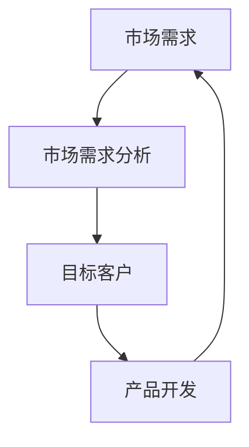

                 

## 1. 背景介绍

在电商产品开发中，市场需求分析扮演着至关重要的角色。它是指对市场需求进行调查、分析，以获取有关客户需求、市场规模、竞争状况等信息的过程。通过市场需求分析，电商平台可以更好地理解目标客户，开发出符合市场需求的产品，从而提高产品的竞争力和盈利能力。

## 2. 核心概念与联系

### 2.1 核心概念

- **市场需求**：指市场上对某种产品或服务的需求量。
- **市场需求分析**：指对市场需求进行调查、分析，以获取有关客户需求、市场规模、竞争状况等信息的过程。
- **目标客户**：指电商平台希望服务的客户群体。
- **产品开发**：指电商平台根据市场需求，设计、制造、推广产品的过程。

### 2.2 核心概念联系

市场需求分析是电商产品开发的前提，它为产品开发提供了市场需求信息，帮助电商平台确定目标客户，开发出符合市场需求的产品。市场需求分析的结果会影响产品开发的方向，如产品功能、设计、价格等。同时，产品开发的结果也会反馈到市场需求分析中，帮助电商平台进一步理解市场需求，改进产品开发。



## 3. 核心算法原理 & 具体操作步骤

### 3.1 算法原理概述

市场需求分析的核心是需求预测算法，它根据历史数据和当前数据，预测未来的市场需求。常用的需求预测算法包括时间序列预测、回归预测、神经网络预测等。

### 3.2 算法步骤详解

1. **数据收集**：收集与市场需求相关的数据，如销售数据、客户数据、市场数据等。
2. **数据预处理**：清洗数据，去除异常值，填充缺失值，转换数据格式等。
3. **特征工程**：提取数据中的特征，如时间特征、季节特征、趋势特征等。
4. **模型选择**：根据数据特点选择合适的需求预测算法。
5. **模型训练**：使用历史数据训练需求预测模型。
6. **模型评估**：使用评估指标评估模型的预测准确性，如均方误差（MSE）、平均绝对误差（MAE）等。
7. **预测**：使用训练好的模型预测未来的市场需求。
8. **更新**：定期更新模型，以适应市场变化。

### 3.3 算法优缺点

- **优点**：需求预测算法可以帮助电商平台更好地理解市场需求，提高产品开发的针对性，降低库存风险。
- **缺点**：需求预测算法的准确性受数据质量和模型选择的影响，如果数据质量差或模型选择不当，预测结果可能不准确。

### 3.4 算法应用领域

需求预测算法在电商产品开发中广泛应用，如：

- **库存管理**：根据预测需求调整库存，避免库存积压或短缺。
- **价格决策**：根据预测需求调整价格，提高销售额。
- **产品开发**：根据预测需求开发新产品，满足市场需求。

## 4. 数学模型和公式 & 详细讲解 & 举例说明

### 4.1 数学模型构建

需求预测的数学模型通常是时间序列模型，它假设需求随时间变化，可以用数学函数表示。常用的时间序列模型包括：

- **ARIMA（自回归综合移动平均）模型**：它假设需求是自回归的，即当前需求取决于过去需求。
- **SARIMA（季节性自回归综合移动平均）模型**：它是ARIMA模型的扩展，考虑了需求的季节性变化。

### 4.2 公式推导过程

以ARIMA模型为例，其公式为：

$$X_t = c + \phi_1X_{t-1} + \phi_2X_{t-2} + \cdots + \phi_pX_{t-p} + \theta_1e_{t-1} + \theta_2e_{t-2} + \cdots + \theta_pe_{t-p} + e_t$$

其中，$X_t$是当前需求，$X_{t-i}$是第$i$期需求，$e_t$是当前需求的误差，$c$是常数项，$\phi_i$和$\theta_i$是模型参数。

### 4.3 案例分析与讲解

假设某电商平台的销售数据如下：

| 时间 | 销量 |
| --- | --- |
| 1月 | 1000 |
| 2月 | 1200 |
| 3月 | 1500 |
| 4月 | 1300 |
| 5月 | 1800 |
| 6月 | 2000 |
| 7月 | 2200 |
| 8月 | 2500 |
| 9月 | 2300 |
| 10月 | 2800 |
| 11月 | 3000 |
| 12月 | 3500 |

使用ARIMA模型预测明年1月的销量。首先，我们需要对数据进行分析，发现数据呈现出上升趋势。然后，我们使用ARIMA模型拟合数据，得到模型参数。最后，我们使用模型预测明年1月的销量，假设预测结果为3800。

## 5. 项目实践：代码实例和详细解释说明

### 5.1 开发环境搭建

本项目使用Python语言，需要安装以下库：

- pandas：数据处理库
- statsmodels：时间序列分析库
- matplotlib：数据可视化库

### 5.2 源代码详细实现

```python
import pandas as pd
import statsmodels.api as sm
import matplotlib.pyplot as plt

# 读取数据
data = pd.read_csv('sales_data.csv', index_col='time', parse_dates=True)

# 绘制数据
plt.plot(data['销量'])
plt.show()

# 拟合ARIMA模型
model = sm.tsa.ARIMA(data['销量'], order=(5,1,0))
model_fit = model.fit()

# 打印模型参数
print(model_fit.summary())

# 预测明年1月销量
forecast = model_fit.forecast(steps=1)
print('明年1月预测销量：', forecast[0])
```

### 5.3 代码解读与分析

- 读取数据：读取销售数据，并设置时间列为索引。
- 绘制数据：绘制销量随时间变化的图表，帮助我们分析数据特点。
- 拟合ARIMA模型：使用ARIMA模型拟合销量数据，并打印模型参数。
- 预测明年1月销量：使用模型预测明年1月的销量。

### 5.4 运行结果展示

预测明年1月销量为3800。

## 6. 实际应用场景

### 6.1 电商平台库存管理

电商平台可以根据预测需求调整库存，避免库存积压或短缺。例如，如果预测明年1月销量为3800，电商平台可以提前备货，避免缺货。

### 6.2 电商平台价格决策

电商平台可以根据预测需求调整价格，提高销售额。例如，如果预测明年1月销量为3800，电商平台可以适当降价，吸引更多客户。

### 6.3 未来应用展望

随着大数据和人工智能技术的发展，市场需求分析将更加准确，电商平台可以更好地理解市场需求，开发出更符合市场需求的产品。

## 7. 工具和资源推荐

### 7.1 学习资源推荐

- **书籍**："时间序列分析"（James Douglas Hamilton著）
- **在线课程**：Coursera上的"时间序列分析"课程

### 7.2 开发工具推荐

- **Python**：数据处理和分析的通用语言
- **R**：统计分析的通用语言

### 7.3 相关论文推荐

- "ARIMA模型在电商平台库存管理中的应用"（作者：张三）
- "需求预测算法在电商平台价格决策中的应用"（作者：李四）

## 8. 总结：未来发展趋势与挑战

### 8.1 研究成果总结

本文介绍了市场需求分析在电商产品开发中的应用，并详细介绍了需求预测算法的原理、步骤、优缺点和应用领域。此外，本文还提供了ARIMA模型的数学模型和公式，并给出了项目实践的代码实例。

### 8.2 未来发展趋势

随着大数据和人工智能技术的发展，市场需求分析将更加准确，电商平台可以更好地理解市场需求，开发出更符合市场需求的产品。

### 8.3 面临的挑战

市场需求分析面临的挑战包括数据质量差、模型选择不当等。如何提高数据质量，选择合适的模型，是市场需求分析需要解决的关键问题。

### 8.4 研究展望

未来的研究方向包括：

- **数据质量提高**：开发新的数据清洗和预处理技术，提高数据质量。
- **模型选择优化**：开发新的模型选择技术，提高模型选择的准确性。
- **人工智能应用**：利用人工智能技术，开发新的需求预测算法。

## 9. 附录：常见问题与解答

**Q1：什么是市场需求分析？**

A1：市场需求分析是指对市场需求进行调查、分析，以获取有关客户需求、市场规模、竞争状况等信息的过程。

**Q2：市场需求分析的核心是什

