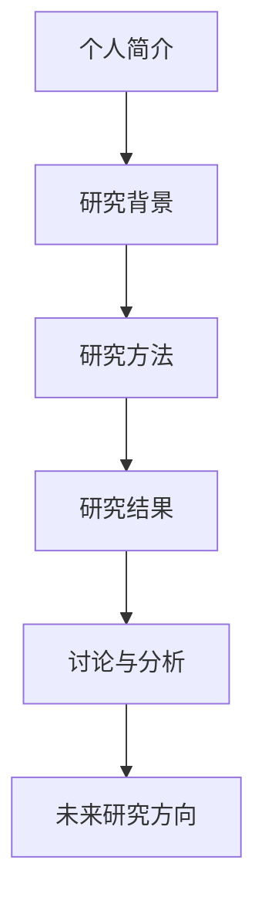

                 

**建立个人品牌数据报告：展示你的研究能力**

## 1. 背景介绍

在当今竞争激烈的职场环境中，建立个人品牌至关重要。对于科技从业者来说，展示自己的研究能力是个人品牌的关键组成部分。本文将介绍如何创建一份个人品牌数据报告，以展示你的研究能力，帮助你在竞争中脱颖而出。

## 2. 核心概念与联系

### 2.1 个人品牌的定义

个人品牌是指个体在职业生涯中建立的名誉和声誉，它反映了个体的技能、知识、经验和成就。对于科技从业者来说，个人品牌是展示研究能力的关键。

### 2.2 数据报告的作用

数据报告是一种有效的沟通工具，它可以帮助个体展示其研究能力，并与雇主、同行和潜在客户建立联系。数据报告可以提供详细的研究结果，展示个体的分析和解决问题的能力。

### 2.3 个人品牌数据报告的构成

个人品牌数据报告应包含以下组成部分：

- 个人简介
- 研究背景
- 研究方法
- 研究结果
- 讨论与分析
- 未来研究方向

下图是个人品牌数据报告的架构图：



## 3. 核心算法原理 & 具体操作步骤

### 3.1 算法原理概述

创建个人品牌数据报告的算法原理基于以下步骤：

1. 确定研究主题
2. 收集数据
3. 分析数据
4. 可视化数据
5. 编写报告

### 3.2 算法步骤详解

#### 3.2.1 确定研究主题

选择一个与你的研究能力相关的主题，并确保它对你的目标受众（雇主、同行、客户）有吸引力。

#### 3.2.2 收集数据

收集与研究主题相关的数据。数据可以来自公开来源（如政府统计数据、学术文献）或私人来源（如公司内部数据、调查问卷）。

#### 3.2.3 分析数据

使用统计方法和数据分析工具（如Python、R、Excel）分析数据。这可能包括数据清洗、数据转换、数据建模等步骤。

#### 3.2.4 可视化数据

使用数据可视化工具（如Tableau、Power BI、Matplotlib）将数据转化为图表、图形和可视化表示。这有助于受众更好地理解数据。

#### 3.2.5 编写报告

使用Word、LaTeX或其他文档编辑工具编写报告。报告应包含以下部分：

- 封面：包括报告标题、作者姓名、日期等信息。
- 目录：列出报告的各个部分。
- 个人简介：简要介绍你的背景和研究能力。
- 研究背景：提供研究主题的背景信息。
- 研究方法：描述你使用的数据收集、分析和可视化方法。
- 研究结果：展示你的研究结果，包括图表和数据分析。
- 讨论与分析：解释研究结果的意义，并提供分析和见解。
- 未来研究方向：提出未来研究的可能方向。

### 3.3 算法优缺点

**优点：**

- 有助于展示研究能力
- 有助于与雇主、同行和客户建立联系
- 有助于提高个人品牌知名度

**缺点：**

- 需要大量时间和精力
- 需要数据分析和可视化技能
- 需要良好的写作技能

### 3.4 算法应用领域

个人品牌数据报告适用于以下领域：

- 学术研究
- 商业分析
- 政府政策分析
- 非营利组织研究
- 科技从业者个人品牌建设

## 4. 数学模型和公式 & 详细讲解 & 举例说明

### 4.1 数学模型构建

在分析数据时，你可能需要构建数学模型。例如，在预测分析中，你可能会使用线性回归模型：

$$y = β_0 + β_1x + ε$$

其中，$y$是预测变量，$x$是自变量，$β_0$和$β_1$是模型参数，$ε$是误差项。

### 4.2 公式推导过程

线性回归模型的推导过程如下：

1. 假设误差项$ε$服从正态分布$N(0, σ^2)$。
2. 最大化对数似然函数，得到参数$β_0$和$β_1$的估计值。
3. 使用估计值进行预测。

### 4.3 案例分析与讲解

例如，假设你想预测公司销售额与广告支出之间的关系。你可以使用线性回归模型进行预测。首先，收集数据：

| 广告支出（千元） | 销售额（千元） |
| --- | --- |
| 10 | 50 |
| 20 | 70 |
| 30 | 90 |
| 40 | 110 |
| 50 | 130 |

然后，使用线性回归模型进行预测。假设模型参数的估计值为$β_0 = 30$和$β_1 = 2$。那么，当广告支出为60千元时，预测的销售额为：

$$y = 30 + 2 \times 60 = 150$$

这意味着，如果公司将广告支出增加到60千元，预测的销售额为150千元。

## 5. 项目实践：代码实例和详细解释说明

### 5.1 开发环境搭建

要创建个人品牌数据报告，你需要以下软件：

- 数据分析工具：Python（Pandas、NumPy、Matplotlib）、R或Excel
- 数据可视化工具：Tableau、Power BI或Matplotlib
- 文档编辑工具：Word或LaTeX

### 5.2 源代码详细实现

以下是使用Python分析数据并创建可视化图表的示例代码：

```python
import pandas as pd
import matplotlib.pyplot as plt

# 读取数据
data = pd.read_csv('sales_data.csv')

# 分析数据
data['sales'] = data['sales'] * 1000  # 将销售额单位转换为千元
data['advertising'] = data['advertising'] * 1000  # 将广告支出单位转换为千元

# 可视化数据
plt.scatter(data['advertising'], data['sales'])
plt.xlabel('Advertising (thousand yuan)')
plt.ylabel('Sales (thousand yuan)')
plt.title('Sales vs Advertising')
plt.show()
```

### 5.3 代码解读与分析

这段代码使用Pandas读取数据，并将销售额和广告支出单位转换为千元。然后，使用Matplotlib创建散点图，展示销售额与广告支出之间的关系。

### 5.4 运行结果展示

运行代码后，你会得到一个散点图，展示销售额与广告支出之间的关系。你可以使用这个图表在报告中展示你的研究结果。

## 6. 实际应用场景

### 6.1 学术研究

个人品牌数据报告可以用于展示学术研究成果，并与同行分享。

### 6.2 商业分析

个人品牌数据报告可以用于展示商业分析成果，并帮助公司做出数据驱动的决策。

### 6.3 政府政策分析

个人品牌数据报告可以用于展示政府政策分析成果，并帮助政府部门做出数据驱动的政策决策。

### 6.4 未来应用展望

随着大数据和人工智能的发展，个人品牌数据报告的应用将变得越来越重要。未来，个人品牌数据报告可能会与人工智能和机器学习技术结合，提供更深入的数据分析和见解。

## 7. 工具和资源推荐

### 7.1 学习资源推荐

-  Coursera：数据分析和可视化课程
-  Udemy：数据分析和可视化课程
-  Kaggle：数据分析和可视化竞赛

### 7.2 开发工具推荐

-  Python：数据分析和可视化
-  R：数据分析和可视化
-  Tableau：数据可视化
-  Power BI：数据可视化
-  LaTeX：文档编辑

### 7.3 相关论文推荐

-  "Data Visualization: A Practical Approach" by K. T. Wallwork and D. A. Packer
-  "Storytelling with Data" by Cole Nussbaumer Knaflic
-  "The Truthful Art" by Alberto Cairo

## 8. 总结：未来发展趋势与挑战

### 8.1 研究成果总结

本文介绍了如何创建个人品牌数据报告，以展示研究能力。我们讨论了个人品牌的定义，数据报告的作用，以及创建数据报告的步骤。我们还介绍了数学模型和公式，并提供了代码实例和实际应用场景。

### 8.2 未来发展趋势

随着大数据和人工智能的发展，个人品牌数据报告的应用将变得越来越重要。未来，个人品牌数据报告可能会与人工智能和机器学习技术结合，提供更深入的数据分析和见解。

### 8.3 面临的挑战

创建个人品牌数据报告需要大量时间和精力。此外，数据分析和可视化技能以及良好的写作技能都是必需的。

### 8.4 研究展望

未来的研究可以探索个人品牌数据报告与人工智能和机器学习技术的结合，提供更深入的数据分析和见解。此外，研究可以关注如何使用数据报告帮助个体在竞争中脱颖而出。

## 9. 附录：常见问题与解答

**Q：我应该选择哪种数据分析工具？**

**A：**选择数据分析工具取决于你的需求和技能水平。Python和R是流行的数据分析工具，它们都有丰富的库和包。如果你更喜欢可视化，你可以选择Tableau或Power BI。

**Q：我应该选择哪种数据可视化工具？**

**A：**选择数据可视化工具取决于你的需求和技能水平。Matplotlib和Seaborn是流行的Python数据可视化库。如果你更喜欢拖放式可视化，你可以选择Tableau或Power BI。

**Q：我应该如何编写报告？**

**A：**编写报告时，要确保它是清晰、简洁和易于理解的。使用简洁的语言，并提供足够的细节。使用图表和图形帮助受众理解数据。

## 作者：禅与计算机程序设计艺术 / Zen and the Art of Computer Programming

