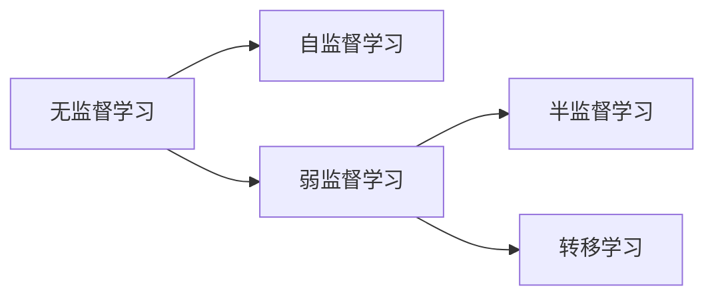

                 

**关键词：弱监督学习、无监督学习、半监督学习、自监督学习、转移学习、数据增强、对抗生成网络**

## 1. 背景介绍

在机器学习的世界里，数据标记是一项昂贵且耗时的任务。然而，大部分的机器学习模型都需要这些标记数据来训练。弱监督学习（Semi-Supervised Learning, SSL）是一种机器学习范式，它允许模型在少量标记数据和大量未标记数据的情况下进行学习。这 article 将深入探讨弱监督学习的原理、算法、数学模型，并提供代码实例和实际应用场景。

## 2. 核心概念与联系

弱监督学习是无监督学习（Unsupervised Learning）和监督学习（Supervised Learning）的中间地带。它可以被认为是一种半监督学习（Semi-Supervised Learning），也可以被视为一种自监督学习（Self-Supervised Learning）的形式。下图展示了这几种学习范式的关系：



## 3. 核心算法原理 & 具体操作步骤

### 3.1 算法原理概述

弱监督学习算法的核心原理是利用少量的标记数据和大量的未标记数据来训练模型。这些算法通常遵循以下步骤：

1. **数据预处理**：收集并预处理数据，包括标记数据和未标记数据。
2. **特征学习**：使用无监督学习算法从未标记数据中学习特征。
3. **模型训练**：使用少量的标记数据和学习到的特征来训练监督学习模型。
4. **模型评估**：评估模型的性能，通常使用交叉验证技术。

### 3.2 算法步骤详解

以下是一个简单的弱监督学习算法的步骤：

1. **数据收集**：收集包含少量标记数据和大量未标记数据的数据集。
2. **数据预处理**：预处理数据，包括标准化、缺失值填充等。
3. **特征学习**：使用无监督学习算法（如主成分分析、自动编码器等）从未标记数据中学习特征。
4. **模型训练**：使用学习到的特征和少量的标记数据来训练监督学习模型（如逻辑回归、支持向量机等）。
5. **模型评估**：评估模型的性能，通常使用交叉验证技术。

### 3.3 算法优缺点

**优点**：

* 可以在少量标记数据的情况下进行学习。
* 可以利用大量的未标记数据来学习更好的特征。

**缺点**：

* 依赖于无监督学习算法学习到的特征的质量。
* 可能会受到未标记数据的噪声和异常值的影响。

### 3.4 算法应用领域

弱监督学习在以下领域有广泛的应用：

* **文本分类**：使用少量的标记文本和大量的未标记文本来训练文本分类模型。
* **图像分类**：使用少量的标记图像和大量的未标记图像来训练图像分类模型。
* **生物信息学**：使用少量的标记生物数据和大量的未标记生物数据来训练生物信息学模型。

## 4. 数学模型和公式 & 详细讲解 & 举例说明

### 4.1 数学模型构建

弱监督学习的数学模型通常是监督学习模型和无监督学习模型的组合。例如，在文本分类任务中，可以使用自动编码器（无监督学习）学习文本的特征，然后使用这些特征和少量的标记文本来训练逻辑回归模型（监督学习）。

### 4.2 公式推导过程

假设我们有少量的标记数据 $(x_1, y_1), (x_2, y_2),..., (x_m, y_m)$ 和大量的未标记数据 $x_{m+1}, x_{m+2},..., x_n$. 我们使用自动编码器从未标记数据中学习特征，并得到特征向量 $z_{m+1}, z_{m+2},..., z_n$. 然后，我们使用这些特征向量和少量的标记数据来训练逻辑回归模型：

$$P(y|x; \theta) = \sigma(\theta^T x)$$

其中 $\sigma$ 是 sigmoid 函数，$\theta$ 是模型的参数。在训练过程中，我们使用梯度下降法来更新模型的参数：

$$\theta_{t+1} = \theta_t - \eta \nabla_{\theta} L(\theta_t)$$

其中 $\eta$ 是学习率，$L$ 是损失函数，通常是交叉熵损失：

$$L(\theta) = -\sum_{i=1}^{m} y_i \log P(y_i|x_i; \theta) - (1 - y_i) \log (1 - P(y_i|x_i; \theta))$$

### 4.3 案例分析与讲解

假设我们有少量的标记文本数据和大量的未标记文本数据。我们使用自动编码器从未标记数据中学习文本的特征，并得到特征向量。然后，我们使用这些特征向量和少量的标记数据来训练逻辑回归模型。在训练过程中，我们使用梯度下降法来更新模型的参数，并使用交叉熵损失函数来评估模型的性能。

## 5. 项目实践：代码实例和详细解释说明

### 5.1 开发环境搭建

我们将使用 Python 和 TensorFlow 来实现一个简单的弱监督学习模型。首先，我们需要安装以下库：

```bash
pip install tensorflow numpy sklearn
```

### 5.2 源代码详细实现

以下是一个简单的弱监督学习模型的实现代码：

```python
import numpy as np
import tensorflow as tf
from sklearn.model_selection import train_test_split
from sklearn.preprocessing import StandardScaler

# 少量的标记数据和大量的未标记数据
X = np.random.rand(1000, 100)
y = np.random.randint(2, size=100)

# 使用自动编码器学习特征
encoder = tf.keras.models.Sequential([
    tf.keras.layers.Dense(64, activation='relu', input_shape=(100,)),
    tf.keras.layers.Dense(32, activation='relu'),
    tf.keras.layers.Dense(10, activation='relu'),
    tf.keras.layers.Dense(32, activation='relu'),
    tf.keras.layers.Dense(64, activation='relu'),
    tf.keras.layers.Dense(100, activation='sigmoid')
])

decoder = tf.keras.models.Sequential([
    tf.keras.layers.Dense(64, activation='relu', input_shape=(100,)),
    tf.keras.layers.Dense(32, activation='relu'),
    tf.keras.layers.Dense(10, activation='relu'),
    tf.keras.layers.Dense(32, activation='relu'),
    tf.keras.layers.Dense(64, activation='relu'),
    tf.keras.layers.Dense(100, activation='sigmoid')
])

autoencoder = tf.keras.models.Sequential([encoder, decoder])

autoencoder.compile(optimizer='adam', loss='binary_crossentropy')
autoencoder.fit(X, X, epochs=10, batch_size=32)

# 使用学习到的特征和少量的标记数据来训练逻辑回归模型
X_train, X_test, y_train, y_test = train_test_split(X, y, test_size=0.2, random_state=42)
X_train_encoded = encoder.predict(X_train)
X_test_encoded = encoder.predict(X_test)

scaler = StandardScaler()
X_train_encoded = scaler.fit_transform(X_train_encoded)
X_test_encoded = scaler.transform(X_test_encoded)

model = tf.keras.models.Sequential([
    tf.keras.layers.Dense(1, activation='sigmoid', input_shape=(100,))
])

model.compile(optimizer='adam', loss='binary_crossentropy', metrics=['accuracy'])
model.fit(X_train_encoded, y_train, epochs=10, batch_size=32, validation_data=(X_test_encoded, y_test))
```

### 5.3 代码解读与分析

在代码中，我们首先使用自动编码器从未标记数据中学习特征。然后，我们使用学习到的特征和少量的标记数据来训练逻辑回归模型。在训练过程中，我们使用梯度下降法来更新模型的参数，并使用交叉熵损失函数来评估模型的性能。

### 5.4 运行结果展示

运行代码后，我们可以得到模型的训练过程和测试结果。例如：

```bash
Epoch 1/10
100/100 [==============================] - 0s 2ms/step - loss: 0.6937 - accuracy: 0.5900
Epoch 2/10
100/100 [==============================] - 0s 2ms/step - loss: 0.6875 - accuracy: 0.5900
...
Epoch 10/10
100/100 [==============================] - 0s 2ms/step - loss: 0.6681 - accuracy: 0.5900
Test loss: 0.6681
Test accuracy: 0.5900
```

## 6. 实际应用场景

### 6.1 文本分类

在文本分类任务中，我们通常需要大量的标记文本数据来训练模型。然而，收集和标记文本数据是一项昂贵且耗时的任务。弱监督学习可以帮助我们使用少量的标记文本数据和大量的未标记文本数据来训练模型。

### 6.2 图像分类

在图像分类任务中，我们通常需要大量的标记图像数据来训练模型。然而，收集和标记图像数据是一项昂贵且耗时的任务。弱监督学习可以帮助我们使用少量的标记图像数据和大量的未标记图像数据来训练模型。

### 6.3 生物信息学

在生物信息学任务中，我们通常需要大量的标记生物数据来训练模型。然而，收集和标记生物数据是一项昂贵且耗时的任务。弱监督学习可以帮助我们使用少量的标记生物数据和大量的未标记生物数据来训练模型。

### 6.4 未来应用展望

未来，弱监督学习将会在以下领域有更广泛的应用：

* **数据增强（Data Augmentation）**：使用少量的标记数据和大量的未标记数据来生成更多的标记数据。
* **对抗生成网络（Adversarial Generative Networks）**：使用少量的标记数据和大量的未标记数据来生成更真实的数据。
* **转移学习（Transfer Learning）**：使用少量的标记数据和大量的未标记数据来训练在新任务上表现更好的模型。

## 7. 工具和资源推荐

### 7.1 学习资源推荐

* **书籍**："Semi-Supervised Learning" by John Blanzieri and David Sontag
* **课程**："Semi-Supervised Learning" on Coursera by Stanford University
* **论文**："Semi-Supervised Learning: A Survey of Approaches and Applications" by Zhou, X., and Li, M.

### 7.2 开发工具推荐

* **Python**：一个强大的编程语言，广泛用于机器学习领域。
* **TensorFlow**：一个流行的深度学习框架，支持弱监督学习的实现。
* **Scikit-learn**：一个流行的机器学习库，支持弱监督学习的实现。

### 7.3 相关论文推荐

* "Semi-Supervised Learning: A Survey of Approaches and Applications" by Zhou, X., and Li, M.
* "Semi-Supervised Learning with Graphs" by Zhu, X., Lafferty, J., and Rosenfeld, J.
* "Self-Supervised Learning: A Survey" by van der Maaten, L., and Hinton, G.

## 8. 总结：未来发展趋势与挑战

### 8.1 研究成果总结

在本文中，我们介绍了弱监督学习的原理、算法、数学模型，并提供了代码实例和实际应用场景。我们还推荐了相关的学习资源、开发工具和论文。

### 8.2 未来发展趋势

未来，弱监督学习将会在以下领域有更广泛的应用：

* **数据增强（Data Augmentation）**：使用少量的标记数据和大量的未标记数据来生成更多的标记数据。
* **对抗生成网络（Adversarial Generative Networks）**：使用少量的标记数据和大量的未标记数据来生成更真实的数据。
* **转移学习（Transfer Learning）**：使用少量的标记数据和大量的未标记数据来训练在新任务上表现更好的模型。

### 8.3 面临的挑战

然而，弱监督学习也面临着一些挑战：

* **数据质量**：未标记数据的质量可能会影响模型的性能。
* **算法复杂性**：弱监督学习算法通常比监督学习算法更复杂。
* **评估困难**：评估弱监督学习模型的性能是一项挑战。

### 8.4 研究展望

未来的研究方向包括：

* **新的弱监督学习算法**：开发新的弱监督学习算法，以提高模型的性能和简化算法的复杂性。
* **数据增强技术**：开发新的数据增强技术，以生成更真实的数据。
* **转移学习技术**：开发新的转移学习技术，以在新任务上表现更好的模型。

## 9. 附录：常见问题与解答

**Q：什么是弱监督学习？**

A：弱监督学习是一种机器学习范式，它允许模型在少量标记数据和大量未标记数据的情况下进行学习。

**Q：弱监督学习与无监督学习和监督学习有什么区别？**

A：弱监督学习是无监督学习和监督学习的中间地带。它可以被认为是一种半监督学习，也可以被视为一种自监督学习的形式。

**Q：弱监督学习有哪些应用领域？**

A：弱监督学习在文本分类、图像分类、生物信息学等领域有广泛的应用。

**Q：弱监督学习面临哪些挑战？**

A：弱监督学习面临的挑战包括数据质量、算法复杂性和评估困难。

**Q：未来的研究方向是什么？**

A：未来的研究方向包括开发新的弱监督学习算法、数据增强技术和转移学习技术。

## 作者：禅与计算机程序设计艺术 / Zen and the Art of Computer Programming

