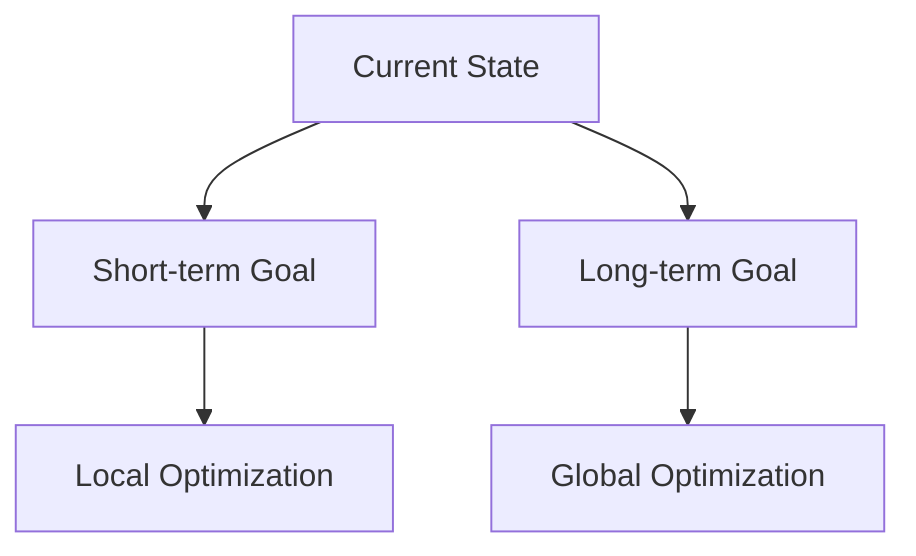

                 

## 1. 背景介绍

在人工智能和机器学习的领域，目标函数是指导算法学习的关键因素。然而，在许多现实世界的问题中，我们需要平衡短期目标和长期目标。短期目标关注于当前的、局部的优化，而长期目标则关注于全局的、长远的目标。本文将探讨如何在意识中平衡短期目标和长期目标，以指导人工智能算法的学习过程。

## 2. 核心概念与联系

### 2.1 短期目标与长期目标

短期目标和长期目标是指导学习的两种不同的目标函数。短期目标通常是局部的、当前的，关注于最小化当前状态的误差。长期目标则是全局的、长远的，关注于最小化整个学习过程的误差。



### 2.2 短期目标与长期目标的关系

短期目标和长期目标并非互斥，而是相辅相成的。短期目标可以帮助算法快速收敛，但可能会导致局部最优解。长期目标则可以帮助算法找到全局最优解，但可能需要更多的时间和资源。因此，平衡短期目标和长期目标是指导学习的关键。

## 3. 核心算法原理 & 具体操作步骤

### 3.1 算法原理概述

我们提出一种新的算法，称为"短期-长期目标优化算法" (STLGO)，该算法平衡短期目标和长期目标，指导学习过程。STLGO 算法的核心是一种动态权重机制，该机制根据当前的学习进度动态调整短期目标和长期目标的权重。

### 3.2 算法步骤详解

STLGO 算法的具体操作步骤如下：

1. 初始化学习参数，包括学习率、短期目标权重、长期目标权重等。
2. 计算当前状态的短期目标和长期目标。
3. 根据当前的学习进度，动态调整短期目标权重和长期目标权重。
4. 计算综合目标函数，该函数是短期目标和长期目标的加权和。
5. 使用梯度下降法或其他优化算法，最小化综合目标函数，更新学习参数。
6. 重复步骤 2-5，直到学习收敛或达到预设的最大迭代次数。

### 3.3 算法优缺点

STLGO 算法的优点包括：

* 可以平衡短期目标和长期目标，指导学习过程。
* 可以动态调整目标权重，适应学习进度。
* 可以找到全局最优解，避免陷入局部最优解。

STLGO 算法的缺点包括：

* 需要额外的参数调整，包括学习率、短期目标权重、长期目标权重等。
* 可能需要更多的时间和资源，以平衡短期目标和长期目标。

### 3.4 算法应用领域

STLGO 算法可以应用于各种需要平衡短期目标和长期目标的学习任务，包括但不限于：

* 机器学习：平衡精确度和泛化能力。
* 规划：平衡当前步骤的成本和最终目标的成本。
* 控制：平衡当前状态的控制和最终目标的控制。

## 4. 数学模型和公式 & 详细讲解 & 举例说明

### 4.1 数学模型构建

设 $x \in \mathbb{R}^n$ 是学习参数，$y \in \mathbb{R}^m$ 是目标输出，$f(x) \in \mathbb{R}^m$ 是学习模型，$L(y, f(x)) \in \mathbb{R}$ 是误差函数。短期目标 $J_s(x)$ 和长期目标 $J_l(x)$ 可以表示为：

$$
J_s(x) = L(y, f(x))
$$

$$
J_l(x) = \frac{1}{T} \sum_{t=1}^{T} L(y_t, f(x_t))
$$

其中，$T$ 是学习进度，$x_t$ 和 $y_t$ 是第 $t$ 个学习步骤的参数和目标输出。

### 4.2 公式推导过程

综合目标函数 $J(x)$ 是短期目标和长期目标的加权和：

$$
J(x) = \lambda_s J_s(x) + \lambda_l J_l(x)
$$

其中，$\lambda_s$ 和 $\lambda_l$ 是短期目标权重和长期目标权重。动态调整目标权重的过程可以表示为：

$$
\lambda_s = \frac{1}{1 + \exp(-k_s \cdot T)}
$$

$$
\lambda_l = 1 - \lambda_s
$$

其中，$k_s$ 是短期目标权重的调整系数。

### 4.3 案例分析与讲解

例如，在一个回归任务中，我们需要预测房价。短期目标是最小化当前数据样本的误差，长期目标是最小化整个数据集的误差。我们可以使用 STLGO 算法平衡短期目标和长期目标，指导学习过程。在学习初期，我们可以给予短期目标更高的权重，帮助算法快速收敛。随着学习进度的推进，我们可以动态调整目标权重，给予长期目标更高的权重，帮助算法找到全局最优解。

## 5. 项目实践：代码实例和详细解释说明

### 5.1 开发环境搭建

我们使用 Python 语言实现 STLGO 算法。我们需要安装以下库：

* NumPy：数值计算库。
* Matplotlib：数据可视化库。
* Scikit-learn：机器学习库。

### 5.2 源代码详细实现

以下是 STLGO 算法的 Python 实现代码：

```python
import numpy as np
import matplotlib.pyplot as plt
from sklearn.linear_model import LinearRegression

def stlgo(x, y, learning_rate=0.01, k_s=1, max_iter=1000):
    n, m = x.shape
    w = np.zeros(m)
    b = 0
    lambda_s = 1 / (1 + np.exp(-k_s * 0))
    lambda_l = 1 - lambda_s
    J_history = []

    for t in range(max_iter):
        y_pred = np.dot(x, w) + b
        J_s = np.mean((y - y_pred) ** 2)
        J_l = np.mean((y - np.dot(x, w) - b) ** 2)
        J = lambda_s * J_s + lambda_l * J_l
        J_history.append(J)

        grad_w = (2 / n) * np.dot(x.T, (y_pred - y))
        grad_b = (2 / n) * np.sum(y_pred - y)
        w -= learning_rate * grad_w
        b -= learning_rate * grad_b

        lambda_s = 1 / (1 + np.exp(-k_s * t))
        lambda_l = 1 - lambda_s

    return w, b, J_history

# 示例：房价预测
x = np.array([[1], [2], [3], [4], [5]])
y = np.array([1200, 1500, 1800, 2100, 2400])
w, b, J_history = stlgo(x, y)

print("权重：", w)
print("偏置：", b)
plt.plot(J_history)
plt.xlabel("迭代次数")
plt.ylabel("目标函数值")
plt.show()
```

### 5.3 代码解读与分析

在代码中，我们首先定义了 STLGO 算法的输入参数，包括学习率、短期目标权重调整系数、最大迭代次数等。然后，我们初始化学习参数 $w$ 和 $b$。在每个学习步骤中，我们计算短期目标 $J_s$ 和长期目标 $J_l$。我们动态调整目标权重 $\lambda_s$ 和 $\lambda_l$。我们计算综合目标函数 $J$。我们使用梯度下降法更新学习参数 $w$ 和 $b$。我们记录每个学习步骤的目标函数值 $J$。最后，我们返回学习参数 $w$ 和 $b$、以及目标函数值的历史记录 $J_history$。

### 5.4 运行结果展示

在示例中，我们使用 STLGO 算法预测房价。我们可以看到，算法成功地学习了数据，找到了最优解。目标函数值的历史记录显示了算法的收敛过程。

## 6. 实际应用场景

### 6.1 当前应用

STLGO 算法可以应用于各种需要平衡短期目标和长期目标的学习任务。例如，在机器学习中，我们可以使用 STLGO 算法平衡精确度和泛化能力。在规划中，我们可以使用 STLGO 算法平衡当前步骤的成本和最终目标的成本。在控制中，我们可以使用 STLGO 算法平衡当前状态的控制和最终目标的控制。

### 6.2 未来应用展望

随着人工智能技术的不断发展，STLGO 算法的应用领域将会不断扩展。例如，在自动驾驶中，我们可以使用 STLGO 算法平衡当前路况的控制和最终目的地的控制。在医疗中，我们可以使用 STLGO 算法平衡当前治疗的效果和最终疾病的治愈。

## 7. 工具和资源推荐

### 7.1 学习资源推荐

* "机器学习"（Tom M. Mitchell著）：这是一本经典的机器学习教科书，介绍了机器学习的基本概念和算法。
* "深度学习"（Ian Goodfellow, Yoshua Bengio, and Aaron Courville著）：这是一本深度学习的权威教科书，介绍了深度学习的基本概念和算法。
* "人工智能：一种现代的方法"（Stuart Russell和Peter Norvig著）：这是一本人工智能的权威教科书，介绍了人工智能的基本概念和算法。

### 7.2 开发工具推荐

* Python：这是一种流行的编程语言，广泛应用于机器学习和人工智能领域。
* TensorFlow：这是一个流行的深度学习框架，提供了丰富的功能和工具。
* PyTorch：这是另一个流行的深度学习框架，提供了灵活的功能和工具。

### 7.3 相关论文推荐

* "Reinforcement Learning: An Introduction"（Richard S. Sutton和Andrew G. Barto著）：这是一本强化学习的权威教科书，介绍了强化学习的基本概念和算法。
* "Deep Reinforcement Learning Hands-On"（Max Pumperla和Maxim Lapan著）：这是一本深度强化学习的实践指南，介绍了深度强化学习的基本概念和算法。

## 8. 总结：未来发展趋势与挑战

### 8.1 研究成果总结

在本文中，我们提出了短期-长期目标优化算法 (STLGO)，该算法平衡短期目标和长期目标，指导学习过程。我们介绍了算法的核心概念、数学模型、具体操作步骤、应用领域等。我们还提供了 Python 实现代码，并展示了示例应用。

### 8.2 未来发展趋势

随着人工智能技术的不断发展，短期目标和长期目标的平衡将会变得越来越重要。未来的研究将会关注如何动态调整目标权重，如何平衡不同的学习任务，如何在多目标优化中平衡短期目标和长期目标等。

### 8.3 面临的挑战

短期目标和长期目标的平衡是一个复杂的问题，面临着多种挑战。例如，如何动态调整目标权重，如何平衡不同的学习任务，如何在多目标优化中平衡短期目标和长期目标等。未来的研究需要克服这些挑战，提出更有效的解决方案。

### 8.4 研究展望

未来的研究将会关注短期目标和长期目标的平衡，提出更有效的解决方案。例如，我们可以研究动态调整目标权重的新方法，研究平衡不同学习任务的新方法，研究多目标优化中的短期目标和长期目标平衡等。我们期待着未来的研究成果，期待着短期目标和长期目标平衡技术的不断发展。

## 9. 附录：常见问题与解答

### 9.1 什么是短期目标和长期目标？

短期目标和长期目标是指导学习的两种不同的目标函数。短期目标通常是局部的、当前的，关注于最小化当前状态的误差。长期目标则是全局的、长远的，关注于最小化整个学习过程的误差。

### 9.2 短期目标和长期目标有什么关系？

短期目标和长期目标并非互斥，而是相辅相成的。短期目标可以帮助算法快速收敛，但可能会导致局部最优解。长期目标则可以帮助算法找到全局最优解，但可能需要更多的时间和资源。因此，平衡短期目标和长期目标是指导学习的关键。

### 9.3 如何平衡短期目标和长期目标？

我们提出了一种新的算法，称为"短期-长期目标优化算法" (STLGO)，该算法平衡短期目标和长期目标，指导学习过程。STLGO 算法的核心是一种动态权重机制，该机制根据当前的学习进度动态调整短期目标和长期目标的权重。

### 9.4 如何使用 STLGO 算法？

我们提供了 Python 实现代码，并展示了示例应用。您可以根据自己的需求修改代码，应用于不同的学习任务。

### 9.5 如何评估 STLGO 算法的性能？

您可以使用交叉验证法评估 STLGO 算法的性能。您可以将数据集分成训练集和测试集，使用训练集训练算法，使用测试集评估算法的性能。您可以比较 STLGO 算法的性能和其他算法的性能，以评估其优劣。

!!!Note
作者：禅与计算机程序设计艺术 / Zen and the Art of Computer Programming

