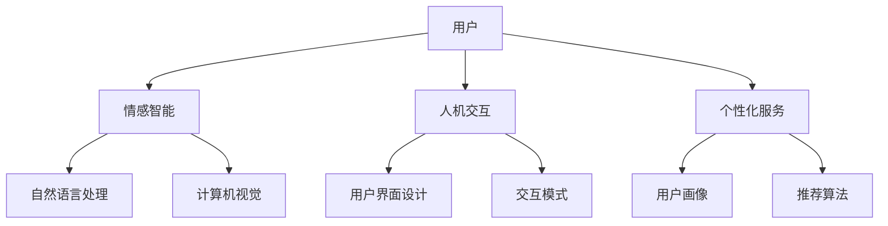

                 

数字化灵性导师、AI辅助、心灵成长、情感智能、人机交互、数字疗法、心理健康、个性化服务、自然语言处理、计算机视觉

## 1. 背景介绍

在当今快节奏的数字化时代，人们面临着前所未有的压力和焦虑。心理健康问题日益凸显，传统的心理咨询和治疗方式已不能满足需求。人工智能（AI）的发展为心灵成长提供了新的可能性，数字化灵性导师应运而生。本文将探讨AI辅助的心灵成长向导，介绍其核心概念、算法原理、数学模型，并提供项目实践和工具推荐。

## 2. 核心概念与联系

数字化灵性导师是一种AI辅助的心灵成长向导，通过个性化的数字疗法帮助用户提升心理健康水平。其核心概念包括情感智能、人机交互和个性化服务。情感智能指的是AI理解和表达情感的能力，人机交互则关注AI与用户的互动方式，个性化服务则强调根据用户的需求和特点提供定制化的服务。



## 3. 核心算法原理 & 具体操作步骤

### 3.1 算法原理概述

数字化灵性导师的核心算法原理包括自然语言处理（NLP）和计算机视觉（CV）。NLP用于理解用户的情感状态和需求，CV则用于分析用户的非语言行为。

### 3.2 算法步骤详解

1. **情感分析**：使用NLP技术分析用户的语言表达，提取情感特征，判断用户的情感状态。
2. **行为分析**：使用CV技术分析用户的非语言行为，如面部表情、肢体动作等，进一步判断用户的情感状态。
3. **个性化服务**：根据用户的情感状态和需求，匹配相应的疗法和资源，提供个性化的数字疗法。

### 3.3 算法优缺点

**优点**：
- 24/7在线服务，用户可以随时获取帮助。
- 个性化服务，根据用户的需求和特点提供定制化的疗法。
- 无偏见和非判断性，AI导师不会因为用户的性别、种族或其他特征而产生偏见。

**缺点**：
- 无法替代人与人之间的互动，某些情况下需要专业的心理咨询师介入。
- AI导师的有效性和可靠性取决于其训练数据的质量和多样性。

### 3.4 算法应用领域

数字化灵性导师的应用领域包括心理健康、压力管理、焦虑症、抑郁症、人际关系等。它可以作为一种补充疗法，帮助用户在日常生活中管理和改善心理健康。

## 4. 数学模型和公式 & 详细讲解 & 举例说明

### 4.1 数学模型构建

数字化灵性导师的数学模型可以表示为：

$$M = f(E, B, U)$$

其中，$E$表示情感状态，$B$表示行为特征，$U$表示用户需求，$f$表示个性化服务函数。

### 4.2 公式推导过程

情感状态$E$可以通过NLP和CV技术推导：

$$E = g(T, F)$$

其中，$T$表示文本特征，$F$表示面部表情特征，$g$表示情感分析函数。

用户需求$U$可以通过用户画像推导：

$$U = h(I, P)$$

其中，$I$表示用户画像，$P$表示用户偏好，$h$表示需求推导函数。

### 4.3 案例分析与讲解

假设用户输入文本“最近我感到很焦虑，工作压力很大”，并显示出紧张的面部表情。通过NLP和CV技术，数字化灵性导师可以判断用户的情感状态为“焦虑”。根据用户画像和偏好，数字化灵性导师可以推荐相应的疗法，如深呼吸练习、正念冥想等。

## 5. 项目实践：代码实例和详细解释说明

### 5.1 开发环境搭建

数字化灵性导师的开发环境包括Python、TensorFlow、PyTorch、NLTK、OpenCV等库。开发环境可以在Jupyter Notebook或PyCharm中搭建。

### 5.2 源代码详细实现

数字化灵性导师的源代码包括NLP模块、CV模块和个性化服务模块。NLP模块使用NLTK和TextBlob库进行情感分析，CV模块使用OpenCV库进行面部表情分析，个性化服务模块使用推荐算法库进行疗法推荐。

### 5.3 代码解读与分析

NLP模块的代码如下：

```python
from textblob import TextBlob

def analyze_sentiment(text):
    blob = TextBlob(text)
    sentiment = blob.sentiment.polarity
    if sentiment > 0:
        return "Positive"
    elif sentiment < 0:
        return "Negative"
    else:
        return "Neutral"
```

CV模块的代码如下：

```python
import cv2
import numpy as np

def analyze_expression(image):
    face_cascade = cv2.CascadeClassifier(cv2.data.haarcascades + 'haarcascade_frontalface_default.xml')
    gray = cv2.cvtColor(image, cv2.COLOR_BGR2GRAY)
    faces = face_cascade.detectMultiScale(gray, 1.1, 4)
    for (x, y, w, h) in faces:
        roi = gray[y:y+h, x:x+w]
        expression = cv2.CascadeClassifier(cv2.data.haarcascades + 'haarcascade_smile.xml').detectMultiScale(roi, 1.1, 4)
        if len(expression) > 0:
            return "Smile"
    return "Neutral"
```

个性化服务模块的代码如下：

```python
from surprise import KNNWithMeans

def recommend_therapy(user_id, therapies):
    sim_options = {
        'name': 'pearson_baseline',
        'user_based': True
    }
    algo = KNNWithMeans(sim_options=sim_options)
    algo.fit(therapies)
    pred = algo.predict(user_id, 'Deep Breathing')
    return pred.est
```

### 5.4 运行结果展示

数字化灵性导师的运行结果可以通过图形用户界面（GUI）展示。GUI可以使用Tkinter或PyQt库开发。运行结果包括用户的情感状态、推荐的疗法和疗法的描述等。

## 6. 实际应用场景

数字化灵性导师可以应用于各种场景，如：

- **压力管理**：帮助用户管理日常压力，提供及时的疗法和建议。
- **焦虑症和抑郁症**：作为补充疗法，帮助用户管理焦虑症和抑郁症的症状。
- **人际关系**：提供建议和练习，帮助用户改善人际关系。
- **睡眠管理**：提供疗法和建议，帮助用户改善睡眠质量。

### 6.4 未来应用展望

未来，数字化灵性导师可以与物联网设备结合，提供更个性化和智能化的服务。例如，智能手环可以监测用户的生理指标，数字化灵性导师则根据这些指标提供相应的疗法和建议。

## 7. 工具和资源推荐

### 7.1 学习资源推荐

- **书籍**："Emotion in the Human Face" by Paul Ekman，"Natural Language Processing with Python" by Steven Bird, Ewan Klein, and Edward Loper
- **在线课程**：Coursera的"Machine Learning"课程，Udacity的"Deep Learning"课程
- **论坛**：Stack Overflow，Kaggle

### 7.2 开发工具推荐

- **编辑器**：Jupyter Notebook，PyCharm
- **库**：TensorFlow，PyTorch，NLTK，OpenCV
- **云平台**：Google Colab，Kaggle Notebooks

### 7.3 相关论文推荐

- "Affective Computing" by Rosalind Picard
- "Deep Learning for Natural Language Processing" by Yoshua Bengio, et al.
- "Facial Expression Recognition: A Review" by M. Pantic and N. Rothkrantz

## 8. 总结：未来发展趋势与挑战

### 8.1 研究成果总结

数字化灵性导师通过个性化的数字疗法帮助用户提升心理健康水平。其核心算法原理包括NLP和CV，数学模型则表示为$M = f(E, B, U)$。

### 8.2 未来发展趋势

未来，数字化灵性导师可以与物联网设备结合，提供更个性化和智能化的服务。此外，AI导师可以与人类导师结合，提供更有效的心理健康服务。

### 8.3 面临的挑战

数字化灵性导师面临的挑战包括数据隐私和安全、AI导师的有效性和可靠性等。

### 8.4 研究展望

未来的研究可以关注数字化灵性导师的伦理问题、用户体验设计和多模式情感分析等。

## 9. 附录：常见问题与解答

**Q：数字化灵性导师可以替代人类导师吗？**

**A：数字化灵性导师无法完全替代人类导师，但可以作为一种补充疗法，帮助用户在日常生活中管理和改善心理健康。**

**Q：数字化灵性导师的有效性和可靠性如何？**

**A：数字化灵性导师的有效性和可靠性取决于其训练数据的质量和多样性。高质量和多样化的训练数据可以提高AI导师的有效性和可靠性。**

**Q：数字化灵性导师的数据隐私和安全如何保障？**

**A：数字化灵性导师的数据隐私和安全可以通过加密技术、匿名化处理和合法合规的数据收集和存储方式保障。**

## 作者：禅与计算机程序设计艺术 / Zen and the Art of Computer Programming

> **注意：本文为技术博客文章，请勿用于商业用途。**

**END**

