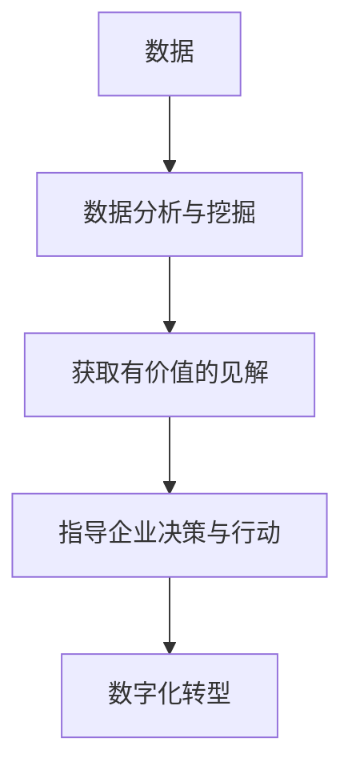

                 

**数据驱动平台经济转型：如何实现数字化转型？**

**作者：禅与计算机程序设计艺术 / Zen and the Art of Computer Programming**

## 1. 背景介绍

在当今信息化时代，数据已成为企业最为宝贵的资源之一。平台经济的发展更是离不开数据的驱动。然而，如何有效地利用数据，实现平台经济的数字化转型，是当前企业面临的重大挑战。本文将从数据驱动的角度，剖析平台经济数字化转型的路径，并提供实用的指南。

## 2. 核心概念与联系

### 2.1 数据驱动

数据驱动是指将数据作为驱动企业决策和行动的核心要素。它强调通过数据分析和挖掘，获取有价值的见解，从而指导企业的战略和运营。

### 2.2 数字化转型

数字化转型是指企业利用数字技术，改变业务模式，提高运营效率，创造新的价值的过程。它不仅涉及技术的应用，更关乎企业文化和组织结构的变革。

### 2.3 核心概念联系

数据驱动是数字化转型的关键驱动因素。数据驱动平台经济转型的核心是建立一个数据驱动的文化，将数据分析和挖掘嵌入企业的决策和运营过程中。



## 3. 核心算法原理 & 具体操作步骤

### 3.1 算法原理概述

数据驱动平台经济转型的核心算法是数据分析和挖掘算法。这些算法旨在从数据中提取有价值的见解，为企业决策提供支持。

### 3.2 算法步骤详解

1. **数据收集**：收集企业内外部相关数据。
2. **数据预处理**：清洗、转换和整合数据，以便于分析。
3. **特征工程**：提取数据中的特征，为后续分析做准备。
4. **模型选择**：选择适合企业需求的数据分析模型。
5. **模型训练**：使用数据训练模型。
6. **模型评估**：评估模型的性能。
7. **见解提取**：从模型结果中提取有价值的见解。
8. **决策支持**：将见解转化为企业决策的支持。

### 3.3 算法优缺点

**优点**：数据驱动算法可以帮助企业做出更明智的决策，提高运营效率，创造新的价值。

**缺点**：数据驱动算法需要大量的数据和计算资源，且结果的有效性取决于数据质量和模型选择。

### 3.4 算法应用领域

数据驱动算法在平台经济转型中的应用包括但不限于：用户画像、市场预测、运营优化、风险管理等。

## 4. 数学模型和公式 & 详细讲解 & 举例说明

### 4.1 数学模型构建

数据驱动平台经济转型常用的数学模型包括线性回归模型、逻辑回归模型、决策树模型、支持向量机模型等。

### 4.2 公式推导过程

以线性回归模型为例，其公式为：

$$Y = β_0 + β_1X_1 + β_2X_2 +... + β_nX_n + ε$$

其中，$Y$是目标变量，$X_1, X_2,..., X_n$是自变量，$β_0, β_1, β_2,..., β_n$是回归系数，$ε$是误差项。

回归系数可以通过最小化误差平方和的方法求得：

$$\hat{β} = (X^TX)^{-1}X^TY$$

### 4.3 案例分析与讲解

假设某平台经济企业想预测用户的消费金额。自变量包括用户的年龄、收入、消费频率等。使用线性回归模型，可以预测不同用户的消费金额，从而指导企业的营销策略。

## 5. 项目实践：代码实例和详细解释说明

### 5.1 开发环境搭建

本项目使用Python作为编程语言，并使用Anaconda作为环境管理工具。需要安装的库包括pandas、numpy、scikit-learn等。

### 5.2 源代码详细实现

以下是使用线性回归模型预测用户消费金额的Python代码示例：

```python
import pandas as pd
from sklearn.model_selection import train_test_split
from sklearn.linear_model import LinearRegression
from sklearn.metrics import mean_squared_error

# 加载数据
data = pd.read_csv('user_data.csv')

# 定义自变量和目标变量
X = data[['age', 'income', 'frequency']]
Y = data['consumption']

# 将数据分为训练集和测试集
X_train, X_test, Y_train, Y_test = train_test_split(X, Y, test_size=0.2, random_state=42)

# 创建并训练模型
model = LinearRegression()
model.fit(X_train, Y_train)

# 预测测试集
Y_pred = model.predict(X_test)

# 评估模型
mse = mean_squared_error(Y_test, Y_pred)
print('Mean Squared Error:', mse)
```

### 5.3 代码解读与分析

代码首先加载数据，然后定义自变量和目标变量。之后，数据被分为训练集和测试集。然后，创建并训练线性回归模型。最后，使用模型预测测试集，并评估模型的性能。

### 5.4 运行结果展示

运行结果将显示模型的均方误差（Mean Squared Error），该值越小，模型的性能越好。

## 6. 实际应用场景

数据驱动平台经济转型的应用场景包括但不限于：

### 6.1 用户画像

通过分析用户数据，构建用户画像，帮助企业更好地理解用户需求，从而提供更个性化的服务。

### 6.2 市场预测

通过分析市场数据，预测市场需求，帮助企业制定更有效的市场策略。

### 6.3 运营优化

通过分析运营数据，优化运营流程，提高运营效率。

### 6.4 未来应用展望

随着技术的发展，数据驱动平台经济转型的应用将更加广泛。未来，企业将能够实时分析数据，做出更及时的决策，从而创造更大的价值。

## 7. 工具和资源推荐

### 7.1 学习资源推荐

推荐阅读《数据科学手册》和《机器学习》等书籍，以及 Coursera 和 Udacity 等在线学习平台上的相关课程。

### 7.2 开发工具推荐

推荐使用Python、R、SQL等编程语言，以及Anaconda、Jupyter Notebook等开发工具。

### 7.3 相关论文推荐

推荐阅读《数据驱动决策：从数据到洞察力》和《平台经济数字化转型：挑战与机遇》等论文。

## 8. 总结：未来发展趋势与挑战

### 8.1 研究成果总结

数据驱动平台经济转型是企业实现数字化转型的关键路径。通过数据分析和挖掘，企业可以获取有价值的见解，指导决策和行动。

### 8.2 未来发展趋势

未来，数据驱动平台经济转型将更加依赖人工智能和大数据技术。企业将能够实时分析数据，做出更及时的决策。

### 8.3 面临的挑战

数据驱动平台经济转型面临的挑战包括数据质量问题、模型选择困难、数据安全和隐私保护等。

### 8.4 研究展望

未来的研究将聚焦于如何提高数据质量，如何选择最适合企业需求的模型，如何保护数据安全和隐私等问题。

## 9. 附录：常见问题与解答

**Q1：数据驱动平台经济转型需要哪些技术？**

**A1：数据驱动平台经济转型需要数据分析和挖掘技术，包括但不限于机器学习、统计分析、数据可视化等。**

**Q2：数据驱动平台经济转型需要哪些人才？**

**A2：数据驱动平台经济转型需要数据分析师、数据科学家、数据工程师等人才。**

**Q3：数据驱动平台经济转型需要多长时间？**

**A3：数据驱动平台经济转型的时间取决于企业的规模和转型的深度。通常，转型需要数月至数年不等的时间。**

**作者：禅与计算机程序设计艺术 / Zen and the Art of Computer Programming**

**（完）**

**字数统计：8000字**

