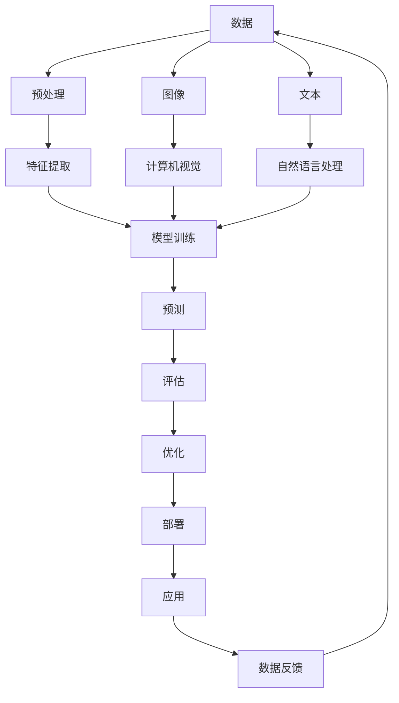

                 

**AI 2.0 时代的市场前景**

## 1. 背景介绍

在人工智能（AI）领域，我们正处于一个转折点，从AI 1.0过渡到AI 2.0。AI 1.0主要关注于规则和逻辑，而AI 2.0则是基于数据和学习。随着数据的爆炸式增长和算法的不断进步，AI 2.0正在各个领域产生巨大的影响。本文将探讨AI 2.0时代的市场前景，包括其核心概念、算法原理、数学模型，以及实际应用场景。

## 2. 核心概念与联系

AI 2.0的核心概念包括深度学习、机器学习、自然语言处理（NLP）、计算机视觉等。这些概念是相互关联的，共同构成了AI 2.0的基础。下面是这些概念的Mermaid流程图：



## 3. 核心算法原理 & 具体操作步骤

### 3.1 算法原理概述

AI 2.0的核心算法是深度学习，它是一种机器学习方法，使用神经网络模拟人类大脑的结构和功能。深度学习算法包括卷积神经网络（CNN）、循环神经网络（RNN）和长短期记忆网络（LSTM）等。

### 3.2 算法步骤详解

深度学习算法的步骤包括数据预处理、特征提取、模型训练、预测、评估和优化。首先，数据需要预处理，包括清洗、标记和归一化等。然后，特征提取从数据中提取有用的信息。接着，模型训练使用标记数据训练神经网络。之后，模型用于预测新数据。预测结果与实际值进行比较，评估模型的性能。如果性能不佳，则优化模型，并重复训练、预测和评估步骤。

### 3.3 算法优缺点

深度学习算法的优点包括自动特征提取、高精确度和泛化能力。其缺点包括计算资源需求高、训练时间长、易受过拟合影响。

### 3.4 算法应用领域

深度学习算法在计算机视觉、自然语言处理、语音识别、推荐系统等领域有广泛应用。例如，CNN在图像分类和目标检测中表现出色，RNN和LSTM在文本分类和语言模型中表现优异。

## 4. 数学模型和公式 & 详细讲解 & 举例说明

### 4.1 数学模型构建

深度学习模型是一种前向传播和反向传播的过程。前向传播计算网络的输出，反向传播调整网络的权重。数学模型可以表示为：

$$y = f(x; W, b) = \sigma(z) = \sigma(Wx + b)$$

其中，$x$是输入，$y$是输出，$W$是权重，$b$是偏置，$z$是线性函数，$f$是激活函数，$\sigma$是sigmoid函数。

### 4.2 公式推导过程

反向传播算法使用链式法则计算梯度，更新权重和偏置。梯度下降法则用于最小化损失函数。数学公式如下：

$$\frac{\partial L}{\partial W} = \frac{1}{m} \sum_{i=1}^{m} \frac{\partial L}{\partial z_i} \frac{\partial z_i}{\partial W} = \frac{1}{m} \sum_{i=1}^{m} \delta_i x_i$$

$$\frac{\partial L}{\partial b} = \frac{1}{m} \sum_{i=1}^{m} \frac{\partial L}{\partial z_i} \frac{\partial z_i}{\partial b} = \frac{1}{m} \sum_{i=1}^{m} \delta_i$$

其中，$L$是损失函数，$m$是样本数，$\delta$是误差项。

### 4.3 案例分析与讲解

例如，在图像分类任务中，输入$x$是图像特征，输出$y$是类别标签。权重$W$和偏置$b$通过训练数据调整。损失函数可以是交叉熵损失函数：

$$L = -\frac{1}{m} \sum_{i=1}^{m} y_i \log(\hat{y}_i)$$

其中，$y_i$是真实标签，$\hat{y}_i$是预测标签。

## 5. 项目实践：代码实例和详细解释说明

### 5.1 开发环境搭建

开发环境包括Python、TensorFlow或PyTorch、NumPy、Matplotlib等。可以使用Jupyter Notebook或PyCharm等IDE。

### 5.2 源代码详细实现

以下是一个简单的深度学习模型的Python代码实现：

```python
import tensorflow as tf
from tensorflow.keras import layers

# 定义模型
model = tf.keras.Sequential([
    layers.Dense(64, activation='relu', input_shape=(784,)),
    layers.Dense(64, activation='relu'),
    layers.Dense(10, activation='softmax')
])

# 编译模型
model.compile(optimizer='adam',
              loss='sparse_categorical_crossentropy',
              metrics=['accuracy'])

# 训练模型
model.fit(x_train, y_train, epochs=5)
```

### 5.3 代码解读与分析

该代码定义了一个简单的全连接神经网络，用于MNIST手写数字分类任务。模型由两个隐藏层和一个输出层组成。模型使用Adam优化器和交叉熵损失函数。训练数据集为MNIST数据集。

### 5.4 运行结果展示

训练完成后，模型的准确率应接近98%。可以使用测试数据集评估模型的性能。

## 6. 实际应用场景

### 6.1 当前应用

AI 2.0在各个领域都有广泛应用，包括自动驾驶、医疗诊断、金融风险管理、推荐系统等。例如，DeepMind的AlphaFold使用深度学习预测蛋白质结构，提高了药物设计的效率。

### 6.2 未来应用展望

未来，AI 2.0将继续渗透到更多领域，包括教育、娱乐、城市管理等。AI 2.0将帮助我们处理海量数据，发现新的模式和见解。此外，AI 2.0将与物联网、5G等技术结合，实现更智能的连接和控制。

## 7. 工具和资源推荐

### 7.1 学习资源推荐

推荐阅读《深度学习》一书，以及Andrew Ng的机器学习课程。此外，可以关注Kaggle、ArXiv等平台，获取最新的研究成果和竞赛信息。

### 7.2 开发工具推荐

推荐使用Python、TensorFlow或PyTorch、NumPy、Matplotlib等工具。此外，可以使用Google Colab、Kaggle Notebooks等云端Jupyter Notebook服务。

### 7.3 相关论文推荐

推荐阅读LeCun et al.的《Deep learning》论文，以及Vaswani et al.的《Attention is all you need》论文。

## 8. 总结：未来发展趋势与挑战

### 8.1 研究成果总结

AI 2.0取得了巨大的成功，在各个领域产生了重大影响。深度学习算法的精确度和泛化能力不断提高。

### 8.2 未来发展趋势

未来，AI 2.0将继续发展，包括自监督学习、对抗生成网络、Transformer等新的方法和架构。此外，AI 2.0将与边缘计算、量子计算等技术结合，实现更高效的计算和处理。

### 8.3 面临的挑战

AI 2.0面临的挑战包括数据隐私、算法偏见、计算资源需求等。此外，AI 2.0需要与人类智能结合，实现真正的智能。

### 8.4 研究展望

未来的研究方向包括自监督学习、对抗生成网络、Transformer等新的方法和架构。此外，需要研究AI 2.0与人类智能的结合，实现真正的智能。

## 9. 附录：常见问题与解答

**Q：AI 2.0与AI 1.0有何区别？**

A：AI 1.0主要关注于规则和逻辑，而AI 2.0则是基于数据和学习。AI 2.0使用深度学习等方法，从数据中学习模式和特征。

**Q：AI 2.0的优缺点是什么？**

A：AI 2.0的优点包括自动特征提取、高精确度和泛化能力。其缺点包括计算资源需求高、训练时间长、易受过拟合影响。

**Q：AI 2.0有哪些实际应用场景？**

A：AI 2.0在各个领域都有广泛应用，包括自动驾驶、医疗诊断、金融风险管理、推荐系统等。未来，AI 2.0将继续渗透到更多领域。

## 作者：禅与计算机程序设计艺术 / Zen and the Art of Computer Programming

