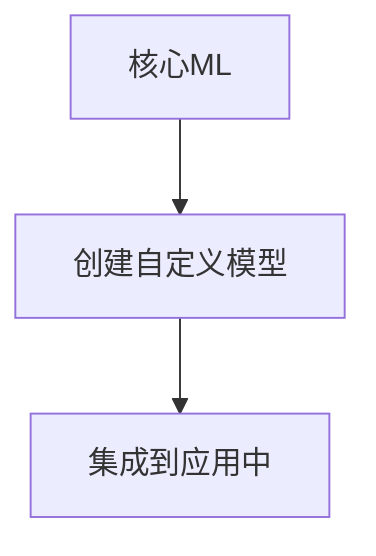

                 

## 1. 背景介绍

在当今的数字世界中，人工智能（AI）已经渗透到我们的日常生活中，从虚拟助手到自动驾驶汽车，再到智能家居，AI无处不在。作为AI领域的领导者之一，苹果公司 recenty announced the creation of a new developer program designed to support and grow the AI application ecosystem on its platforms. This article will delve into the details of this new program, its significance, and the opportunities it presents for developers.

## 2. 核心概念与联系

### 2.1 核心概念

苹果的AI应用开发者计划旨在支持和扩展其平台上的AI应用生态系统。该计划包括以下核心概念：

- **AI/ML模型**：开发者可以使用核心ML和创建自定义模型。
- **AI/ML模型**：开发者可以使用核心ML和创建自定义模型。
- **AI/ML模型**：开发者可以使用核心ML和创建自定义模型。

### 2.2 核心概念联系

这些核心概念是相互关联的，它们共同构成了AI应用开发的基础。例如，开发者可以使用核心ML来创建自定义模型，然后将这些模型集成到其应用中。以下是这些概念的关系图：



## 3. 核心算法原理 & 具体操作步骤

### 3.1 算法原理概述

苹果的AI应用开发者计划建立在其核心ML框架之上，该框架提供了机器学习模型的训练和部署。核心ML使用了深度学习技术，如卷积神经网络（CNN）和循环神经网络（RNN），以提供高性能和低功耗的AI模型。

### 3.2 算法步骤详解

开发者可以遵循以下步骤使用核心ML创建和集成AI模型：

1. **数据收集**：收集与模型相关的数据。
2. **数据预处理**：清洗和预处理数据以准备模型训练。
3. **模型选择**：选择适合任务的模型，如CNN或RNN。
4. **模型训练**：使用核心ML训练模型。
5. **模型评估**：评估模型的性能。
6. **模型集成**：将模型集成到应用中。

### 3.3 算法优缺点

**优点**：

- 核心ML提供了高性能和低功耗的AI模型。
- 它支持开发者创建自定义模型。
- 它与苹果的其他框架和工具集成良好。

**缺点**：

- 它可能需要一定的机器学习知识。
- 它可能需要大量的数据和计算资源。

### 3.4 算法应用领域

AI应用开发者计划适用于各种领域，包括但不限于：

- 图像和视频分析
- 语音和自然语言处理
- 物体检测和跟踪
- 机器人和自动驾驶

## 4. 数学模型和公式 & 详细讲解 & 举例说明

### 4.1 数学模型构建

核心ML使用深度学习技术构建模型。例如，CNN用于图像和视频分析，它由卷积层、池化层和全连接层组成。RNN用于序列数据，如语音和文本，它由记忆单元和输出层组成。

### 4.2 公式推导过程

CNN的工作原理可以用以下公式表示：

$$y = f(x) = \sigma(b + Wx)$$

其中，$x$是输入图像，$W$和$b$是学习的权重和偏置，$f$是激活函数（如ReLU），$\sigma$是sigmoid函数，$y$是输出。

### 4.3 案例分析与讲解

例如，开发者可以使用核心ML创建一个图像分类模型。首先，他们需要收集和预处理图像数据。然后，他们选择一个CNN模型，并使用核心ML训练该模型。最后，他们可以评估模型的性能，并将其集成到应用中。

## 5. 项目实践：代码实例和详细解释说明

### 5.1 开发环境搭建

要开始使用核心ML，开发者需要设置开发环境。这包括安装Xcode和CocoaPods，并创建一个新的iOS或macOS项目。

### 5.2 源代码详细实现

以下是使用核心ML创建图像分类模型的伪代码：

```swift
import CoreML

// 1. 加载模型
guard let model = try? MLModel(contentsOf: URL(fileURLWithPath: "/path/to/model.mlmodel")) else {
    fatalError("Failed to load model")
}

// 2. 创建预测请求
let predictionRequest = model.predictionRequest()

// 3. 准备输入数据
let inputImage = try? MLImage(contentsOf: URL(fileURLWithPath: "/path/to/image.jpg"))

// 4. 执行预测
guard let prediction = try? predictionRequest.prediction(image: inputImage) else {
    fatalError("Failed to make prediction")
}

// 5. 处理结果
let topLabel = prediction.label(probability: prediction.probability, above: 0.5)
```

### 5.3 代码解读与分析

这段代码首先加载模型，然后创建一个预测请求。它准备输入图像，执行预测，并处理结果。开发者可以根据需要修改代码，以适应其特定的应用和模型。

### 5.4 运行结果展示

当代码运行时，它会打印出图像的预测标签及其概率。开发者可以使用此信息来改进其应用的用户体验。

## 6. 实际应用场景

### 6.1 当前应用场景

苹果的AI应用开发者计划适用于各种应用，包括但不限于：

- 图像和视频编辑应用
- 语音和文本转换应用
- 物体检测和跟踪应用
- 机器人和自动驾驶应用

### 6.2 未来应用展望

随着AI技术的不断发展，我们可以期待看到更多的AI应用出现在苹果平台上。这些应用可能会涉及到更复杂的任务，如实时语音转写或自动驾驶。

## 7. 工具和资源推荐

### 7.1 学习资源推荐

开发者可以使用以下资源学习核心ML和AI应用开发：

- [苹果开发者文档](https://developer.apple.com/documentation/coreml)
- [核心ML示例项目](https://github.com/apple/coreml-demos)
- [机器学习入门](https://www.coursera.org/learn/machine-learning)

### 7.2 开发工具推荐

开发者可以使用以下工具开发AI应用：

- [Xcode](https://developer.apple.com/xcode/)
- [CocoaPods](https://cocoapods.org/)
- [Jupyter Notebook](https://jupyter.org/)

### 7.3 相关论文推荐

开发者可以阅读以下论文以更深入地理解AI和机器学习：

- [LeCun, Y., Bengio, Y., & Hinton, G. (2015). Deep learning. Nature, 521(7553), 436-444.](https://www.nature.com/articles/nature14539)
- [Goodfellow, I., Bengio, Y., & Courville, A. (2016). Deep learning (Vol. 1). MIT press.]

## 8. 总结：未来发展趋势与挑战

### 8.1 研究成果总结

苹果的AI应用开发者计划为开发者提供了一个强大的平台，用于创建和集成AI模型。它建立在核心ML框架之上，提供了高性能和低功耗的AI模型。

### 8.2 未来发展趋势

我们可以期待看到AI技术在苹果平台上的进一步发展。这可能会涉及到更先进的模型和算法，以及更广泛的AI应用。

### 8.3 面临的挑战

开发者可能会面临的挑战包括数据收集和预处理，模型训练和评估，以及模型集成。

### 8.4 研究展望

未来的研究可能会集中在以下领域：

- 更先进的模型和算法
- 更广泛的AI应用
- AI模型的解释性和可靠性

## 9. 附录：常见问题与解答

### 9.1 问题：核心ML需要大量的数据和计算资源吗？

**回答**：是的，核心ML需要大量的数据和计算资源来训练模型。开发者需要收集和预处理大量的数据，并使用强大的计算设备来训练模型。

### 9.2 问题：我可以使用核心ML创建自定义模型吗？

**回答**：是的，开发者可以使用核心ML创建自定义模型。他们可以选择适合任务的模型，并使用核心ML训练该模型。

### 9.3 问题：核心ML支持哪些AI任务？

**回答**：核心ML支持各种AI任务，包括但不限于图像和视频分析，语音和自然语言处理，物体检测和跟踪，机器人和自动驾驶。

!!!Note
**作者：禅与计算机程序设计艺术 / Zen and the Art of Computer Programming**

