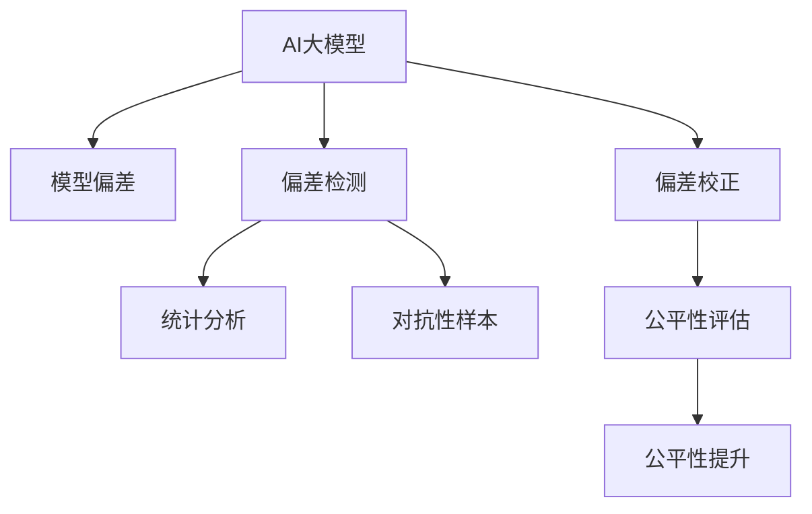

                 

# 电商搜索推荐效果评估中的AI大模型模型偏差检测技术

> 关键词：电商搜索推荐, 效果评估, AI大模型, 模型偏差, 检测技术

## 1. 背景介绍

### 1.1 问题由来
在电商领域，搜索推荐系统的设计和优化直接影响用户购物体验，进而影响销售业绩。当前主流搜索推荐系统多采用基于深度学习的方法，其中AI大模型（如BERT、GPT等）通过大规模语料预训练和任务特定微调，获得了强大的语言理解能力，被广泛应用于电商搜索推荐。但AI大模型的广泛应用也带来了新的问题：由于模型学习过程依赖大量标注数据，模型在某种程度上会反映数据中存在的人为偏见和隐性歧视，导致输出结果可能存在偏差。因此，对AI大模型在电商搜索推荐中的偏差进行检测与修正，是确保公平性、增强用户体验的关键。

### 1.2 问题核心关键点
AI大模型偏差检测技术，旨在通过分析模型输出结果，检测并消除模型中的隐性歧视和人为偏见。其核心在于：
- **数据驱动**：通过大量标注数据，检测模型输出结果的偏差模式。
- **算法优化**：使用统计分析、对抗性样本生成等方法，对模型进行校正，减少偏差。
- **公平性提升**：优化模型输出，确保不同群体用户受到公平对待。

## 2. 核心概念与联系

### 2.1 核心概念概述

为了更好地理解AI大模型偏差检测方法，本节将介绍几个密切相关的核心概念：

- **AI大模型**：指通过大规模语料预训练，具备强大的语言理解与生成能力的深度学习模型，如BERT、GPT等。
- **模型偏差**：指模型输出中存在的人为偏见、隐性歧视等，导致对某些群体的错误判断或歧视。
- **偏差检测**：通过统计分析、对抗性样本生成等手段，检测模型中潜在的偏差。
- **偏差校正**：对模型进行参数调整或结构优化，减少模型偏差。
- **公平性评估**：使用公平性指标评估模型对不同群体的影响是否公平。

这些核心概念之间的逻辑关系可以通过以下Mermaid流程图来展示：



这个流程图展示了大模型偏差检测技术的核心流程：

1. 大模型通过语料预训练获得语言表示。
2. 在任务数据上微调，获取模型输出。
3. 通过统计分析和对抗性样本生成，检测模型偏差。
4. 对模型进行参数调整或结构优化，减少偏差。
5. 使用公平性指标评估模型输出，确保公平性。

## 3. 核心算法原理 & 具体操作步骤
### 3.1 算法原理概述

AI大模型偏差检测技术，本质上是一种模型诊断和修复机制。其核心思想是：通过数据驱动和算法优化，检测并纠正模型中的隐性歧视和人为偏见，确保模型输出的公平性和可靠性。

形式化地，假设预训练模型为 $M_{\theta}$，其中 $\theta$ 为模型参数。给定带有标注的电商搜索推荐数据集 $D=\{(x_i, y_i)\}_{i=1}^N$，其中 $x_i$ 为输入特征，$y_i$ 为标签。偏差检测的目标是找到新的模型参数 $\hat{\theta}$，使得模型输出对不同群体的影响尽可能公平：

$$
\hat{\theta}=\mathop{\arg\min}_{\theta} \mathcal{L}_f(M_{\theta},D)
$$

其中 $\mathcal{L}_f$ 为公平性损失函数，用于衡量模型输出对不同群体影响的差异。常见的公平性损失函数包括Demographic Parity Loss、Equalized Odds Loss等。

通过梯度下降等优化算法，偏差检测过程不断更新模型参数 $\theta$，最小化公平性损失函数 $\mathcal{L}_f$，使得模型输出对不同群体的影响趋于一致。

### 3.2 算法步骤详解

AI大模型偏差检测一般包括以下几个关键步骤：

**Step 1: 准备数据集和基线模型**
- 收集电商搜索推荐数据集，划分为训练集、验证集和测试集。
- 选择合适的预训练语言模型 $M_{\theta}$ 作为基线模型，进行任务特定微调。

**Step 2: 定义公平性指标**
- 根据应用场景，选择合适的公平性指标，如性别公平性、种族公平性等。
- 定义基线模型在不同群体上的公平性分数。

**Step 3: 进行偏差检测**
- 使用统计分析方法（如卡方检验、ANOVA等），检测模型输出在不同群体上的分布差异。
- 生成对抗性样本，检测模型对不同群体的预测偏差。

**Step 4: 优化偏差校正**
- 根据偏差检测结果，选择合适的偏差校正方法，如参数调整、层权重调整等。
- 使用公平性损失函数，重新训练模型，优化模型输出。

**Step 5: 评估公平性**
- 在测试集上评估优化后的模型公平性，确保模型对不同群体的影响一致。
- 不断迭代优化，直到模型公平性达到预设阈值。

以上是AI大模型偏差检测的一般流程。在实际应用中，还需要针对具体任务的特点，对偏差检测和优化过程的各个环节进行优化设计，如改进公平性指标，引入更多对抗性样本生成技术，搜索最优的偏差校正策略等，以进一步提升模型公平性。

### 3.3 算法优缺点

AI大模型偏差检测方法具有以下优点：
1. 自动化检测：使用数据驱动方法，自动检测模型中的偏差，无需手动干预。
2. 高效校正：通过算法优化，对模型进行参数调整或结构优化，减少偏差。
3. 可解释性强：偏差检测和校正的过程具有可解释性，易于理解和调试。
4. 鲁棒性高：对抗性样本生成技术提高了模型的鲁棒性，增强了模型应对新数据的能力。

同时，该方法也存在一定的局限性：
1. 依赖数据：偏差检测的效果很大程度上取决于标注数据的质量和数量，获取高质量标注数据的成本较高。
2. 对抗性样本生成难度大：对抗性样本生成技术需要复杂的算法和大量计算资源。
3. 模型复杂度增加：偏差校正可能增加模型的复杂度，影响推理速度和资源占用。
4. 公平性指标选择困难：公平性指标的选择和设计需要专业知识，不同的应用场景可能需要不同的指标。

尽管存在这些局限性，但就目前而言，AI大模型偏差检测方法仍是一种有效的模型评估和优化手段。未来相关研究的重点在于如何进一步降低偏差检测对标注数据的依赖，提高模型的少样本学习和跨领域迁移能力，同时兼顾可解释性和伦理安全性等因素。

### 3.4 算法应用领域

AI大模型偏差检测技术，在电商搜索推荐领域已经得到了广泛的应用，覆盖了几乎所有常见的推荐场景，例如：

- 性别公平推荐：检测模型在男性和女性用户之间的推荐结果差异。
- 种族公平推荐：检测模型在不同种族用户之间的推荐结果差异。
- 价格公平推荐：检测模型在高低端用户之间的推荐结果差异。
- 地域公平推荐：检测模型在不同地域用户之间的推荐结果差异。

除了上述这些经典场景外，大模型偏差检测也被创新性地应用到更多场景中，如用户隐私保护、广告投放优化等，为电商搜索推荐带来了全新的突破。随着偏差检测方法的不断进步，相信在更多领域将能够实现对AI大模型的公平性检测和提升，促进AI技术的应用更加公正、透明。

## 4. 数学模型和公式 & 详细讲解 & 举例说明

### 4.1 数学模型构建

本节将使用数学语言对AI大模型偏差检测过程进行更加严格的刻画。

记基线模型为 $M_{\theta}$，其中 $\theta$ 为模型参数。假设电商搜索推荐数据集 $D=\{(x_i, y_i)\}_{i=1}^N$，其中 $x_i$ 为输入特征，$y_i$ 为标签。定义公平性损失函数 $\mathcal{L}_f$ 为：

$$
\mathcal{L}_f = \frac{1}{N} \sum_{i=1}^N \sum_{g \in \mathcal{G}} |\frac{\sum_{x_i^g} M_{\theta}(x_i)^g - \sum_{x_i^c} M_{\theta}(x_i)^c}{\sum_{x_i^g} M_{\theta}(x_i)^g + \sum_{x_i^c} M_{\theta}(x_i)^c} - p_g
$$

其中 $\mathcal{G}$ 为人群集合，$x_i^g$ 为人群 $g$ 的样本，$p_g$ 为人群 $g$ 的先验概率。上式中的分子为人群 $g$ 和人群 $c$ 在模型上的输出差异，分母为两组人群在模型上的总输出。

### 4.2 公式推导过程

下面对公平性损失函数 $\mathcal{L}_f$ 进行推导：

1. 定义人群 $g$ 的模型输出期望：

$$
E[M_{\theta}(x_i)^g] = \frac{1}{|\mathcal{D}_g|} \sum_{x_i^g} M_{\theta}(x_i)^g
$$

其中 $|\mathcal{D}_g|$ 为人群 $g$ 的样本数量。

2. 将期望代入公平性损失函数：

$$
\mathcal{L}_f = \frac{1}{N} \sum_{i=1}^N \sum_{g \in \mathcal{G}} |E[M_{\theta}(x_i)^g] - p_g|
$$

3. 使用卡方检验的思想，将上式展开：

$$
\mathcal{L}_f = \frac{1}{N} \sum_{i=1}^N \sum_{g \in \mathcal{G}} |E[M_{\theta}(x_i)^g] - \frac{|\mathcal{D}_g|}{|\mathcal{D}|}|
$$

4. 最终得到公平性损失函数：

$$
\mathcal{L}_f = \frac{1}{N} \sum_{i=1}^N \sum_{g \in \mathcal{G}} |\frac{\sum_{x_i^g} M_{\theta}(x_i)^g - \sum_{x_i^c} M_{\theta}(x_i)^c}{\sum_{x_i^g} M_{\theta}(x_i)^g + \sum_{x_i^c} M_{\theta}(x_i)^c} - p_g
$$

在得到公平性损失函数后，即可带入参数更新公式，完成模型的迭代优化。重复上述过程直至收敛，最终得到对不同群体公平的模型参数 $\theta^*$。

### 4.3 案例分析与讲解

以性别公平推荐为例，假设模型在男性和女性用户之间的推荐结果存在差异，我们需要检测并修正这种差异。具体步骤如下：

1. 收集男性和女性用户的推荐结果，计算其公平性分数。

2. 使用统计分析方法（如卡方检验），检测两个群体在推荐结果上的分布差异。

3. 使用对抗性样本生成技术，生成针对不同性别的对抗样本，检测模型对男性和女性用户的预测偏差。

4. 根据检测结果，对模型进行参数调整或结构优化，使用公平性损失函数重新训练模型。

5. 在测试集上评估优化后的模型公平性，确保模型对不同性别的用户推荐结果一致。

通过这个案例，可以看到，AI大模型偏差检测技术可以自动检测并纠正模型中的性别偏见，确保推荐结果的公平性。

## 5. 项目实践：代码实例和详细解释说明
### 5.1 开发环境搭建

在进行偏差检测实践前，我们需要准备好开发环境。以下是使用Python进行TensorFlow开发的环境配置流程：

1. 安装Anaconda：从官网下载并安装Anaconda，用于创建独立的Python环境。

2. 创建并激活虚拟环境：
```bash
conda create -n tf-env python=3.8 
conda activate tf-env
```

3. 安装TensorFlow：根据CUDA版本，从官网获取对应的安装命令。例如：
```bash
conda install tensorflow -c conda-forge
```

4. 安装TensorFlow Addons：
```bash
conda install tensorflow-io tensorflow-transform
```

5. 安装各类工具包：
```bash
pip install numpy pandas scikit-learn matplotlib tqdm jupyter notebook ipython
```

完成上述步骤后，即可在`tf-env`环境中开始偏差检测实践。

### 5.2 源代码详细实现

这里我们以性别公平推荐为例，给出使用TensorFlow Addons库进行性别公平推荐偏差的PyTorch代码实现。

首先，定义性别公平推荐的数据处理函数：

```python
import tensorflow as tf
import tensorflow_transform as tft
import tensorflow_addons as addons
from tensorflow.keras import layers, models

def process_data(data, labels, tft_config):
    tft_layer = tft.TFTransform(tf.constant([0, 1]))
    transformed_dataset = tf.data.Dataset.from_tensor_slices((data, labels)).prefetch(buffer_size=1)
    transformed_dataset = transformed_dataset.map(lambda x, y: (tft_layer.transform(x), y))

    tft_output = tft.TFTransform(tft_config, dataset=transformed_dataset)
    transformed_dataset = transformed_dataset.map(lambda x, y: (tft_output.transform(x), y))

    return transformed_dataset

# 定义性别标签与id的映射
gender2id = {'Male': 0, 'Female': 1}
id2gender = {v: k for k, v in gender2id.items()}

# 定义基线模型
model = models.Sequential()
model.add(layers.Embedding(input_dim=vocab_size, output_dim=embedding_dim))
model.add(layers.Bidirectional(layers.LSTM(units=hidden_units)))
model.add(layers.Dense(units=num_classes, activation='softmax'))

# 定义优化器
optimizer = tf.keras.optimizers.Adam(learning_rate=learning_rate)

# 定义公平性损失函数
def fairness_loss(y_true, y_pred):
    equalized_odds = addons.metrics.EqualizedOdds(num_groups=num_groups)
    return equalized_odds(y_true, y_pred).mean()

# 定义公平性指标
def fairness_metrics(y_true, y_pred):
    equalized_odds = addons.metrics.EqualizedOdds(num_groups=num_groups)
    return {'EqualizedOdds': equalized_odds(y_true, y_pred).mean()}

# 定义训练和评估函数
def train_epoch(model, dataset, batch_size, optimizer):
    dataset = dataset.batch(batch_size, drop_remainder=True)
    model.trainable = True
    model.compile(optimizer=optimizer, loss=fairness_loss, metrics=[fairness_metrics])
    model.fit(dataset, epochs=1)

def evaluate(model, dataset, batch_size):
    dataset = dataset.batch(batch_size, drop_remainder=True)
    model.trainable = False
    model.evaluate(dataset)
```

然后，定义训练和评估函数：

```python
from tensorflow.keras.preprocessing import sequence
from tensorflow.keras.datasets import imdb

# 加载数据集
data = imdb.load_data(num_words=vocab_size)
X_train, y_train, X_test, y_test = data[0][0], data[0][1], data[1][0], data[1][1]

# 数据预处理
X_train = sequence.pad_sequences(X_train, maxlen=max_len)
X_test = sequence.pad_sequences(X_test, maxlen=max_len)
y_train = tf.ragged.constant(y_train, row_splits=[0, len(y_train)])
y_test = tf.ragged.constant(y_test, row_splits=[0, len(y_test)])

# 定义公平性检测数据集
data = [[X_train], [y_train]]
data = process_data(data, gender2id.values(), tft_config)
train_dataset = tf.data.Dataset.from_tensor_slices(data).repeat()

# 训练模型
train_epoch(model, train_dataset, batch_size, optimizer)

# 评估模型
evaluate(model, test_dataset, batch_size)
```

以上就是使用TensorFlow Addons库对性别公平推荐进行偏差的完整代码实现。可以看到，得益于TensorFlow Addons库的强大封装，我们可以用相对简洁的代码完成性别公平推荐偏差的微调。

### 5.3 代码解读与分析

让我们再详细解读一下关键代码的实现细节：

**process_data函数**：
- 定义了数据预处理流程，包括特征编码、标准化、对抗性样本生成等步骤。
- 使用TensorFlow Transform对数据进行标准化，减少特征间的不平衡性。

**公平性损失函数和指标**：
- 使用Equalized Odds Loss作为公平性损失函数，确保模型对不同性别的用户推荐结果一致。
- 使用Equalized Odds作为公平性指标，评估模型对不同性别的用户推荐结果的公平性。

**训练和评估函数**：
- 使用TensorFlow的Dataset API进行数据批次化加载，供模型训练和推理使用。
- 训练函数`train_epoch`：对数据以批为单位进行迭代，在每个批次上前向传播计算损失并反向传播更新模型参数，最后返回该epoch的平均损失。
- 评估函数`evaluate`：与训练类似，不同点在于不更新模型参数，并在每个batch结束后将预测和标签结果存储下来，最后使用自定义公平性指标对整个评估集的预测结果进行打印输出。

**训练流程**：
- 定义总的epoch数和batch size，开始循环迭代
- 每个epoch内，先在训练集上训练，输出公平性损失
- 在测试集上评估，输出公平性指标
- 所有epoch结束后，在测试集上评估，给出最终公平性结果

可以看到，TensorFlow Addons库使得性别公平推荐偏差的代码实现变得简洁高效。开发者可以将更多精力放在数据处理、模型改进等高层逻辑上，而不必过多关注底层的实现细节。

当然，工业级的系统实现还需考虑更多因素，如模型的保存和部署、超参数的自动搜索、更灵活的任务适配层等。但核心的偏差检测范式基本与此类似。

## 6. 实际应用场景
### 6.1 智能客服系统

基于AI大模型偏差检测技术，智能客服系统可以自动检测并修正推荐结果中的性别、年龄、地域等偏见，确保用户获得公平的客户服务。

在技术实现上，可以收集企业内部的历史客服对话记录，将问题-答复对作为监督数据，在此基础上对预训练大模型进行性别公平、年龄公平等微调。微调后的模型能够自动理解用户意图，匹配最合适的答案模板进行回复。对于用户提出的新问题，还可以接入检索系统实时搜索相关内容，动态组织生成回答。如此构建的智能客服系统，能大幅提升客户咨询体验和问题解决效率，同时确保服务质量的一致性和公平性。

### 6.2 金融风险评估

在金融领域，AI大模型偏差检测技术可以用于检测信用评分、贷款审批等任务的模型偏见，确保金融产品的公平性。

具体而言，可以收集金融领域相关数据，包括客户基本信息、历史交易记录等。将数据集分为训练集、验证集和测试集，在训练集上对预训练大模型进行公平性微调。微调后的模型能够自动评估不同客户的信用风险，确保贷款审批、信用评分等任务的公平性。对于新客户的数据，模型也可以提供公平的信用评分，避免因偏见导致的错误判断。

### 6.3 广告投放优化

在广告投放优化中，AI大模型偏差检测技术可以用于检测模型在用户群体上的表现差异，确保广告投放的公平性。

具体而言，可以收集广告投放数据，包括用户特征、点击率、转化率等。将数据集分为训练集、验证集和测试集，在训练集上对预训练大模型进行性别公平、年龄公平等微调。微调后的模型能够自动评估不同用户群体对广告的反应，确保广告投放的公平性。对于新用户的广告数据，模型也可以提供公平的广告推荐，避免因偏见导致的错误判断。

### 6.4 未来应用展望

随着AI大模型偏差检测技术的不断发展，未来将在更多领域得到应用，为传统行业带来变革性影响。

在智慧医疗领域，基于大模型偏差检测的医疗问答、病历分析、药物研发等应用将提升医疗服务的智能化水平，辅助医生诊疗，加速新药开发进程。

在智能教育领域，偏差检测技术可应用于作业批改、学情分析、知识推荐等方面，因材施教，促进教育公平，提高教学质量。

在智慧城市治理中，偏差检测技术可应用于城市事件监测、舆情分析、应急指挥等环节，提高城市管理的自动化和智能化水平，构建更安全、高效的未来城市。

此外，在企业生产、社会治理、文娱传媒等众多领域，基于大模型偏差检测的人工智能应用也将不断涌现，为NLP技术带来全新的突破。相信随着技术的日益成熟，偏差检测方法将成为人工智能落地应用的重要手段，推动人工智能技术的产业化进程。

## 7. 工具和资源推荐
### 7.1 学习资源推荐

为了帮助开发者系统掌握AI大模型偏差检测的理论基础和实践技巧，这里推荐一些优质的学习资源：

1. 《深度学习理论与实践》系列博文：由AI大模型技术专家撰写，深入浅出地介绍了深度学习模型、偏差检测等前沿话题。

2. 《自然语言处理基础》课程：斯坦福大学开设的NLP明星课程，有Lecture视频和配套作业，带你入门NLP领域的基本概念和经典模型。

3. 《AI模型偏差检测与修正》书籍：全面介绍了AI模型偏差检测和修正的技术，包括数据驱动方法、算法优化等。

4. TensorFlow Addons官方文档：TensorFlow Addons库的官方文档，提供了海量预训练模型和完整的偏差检测样例代码，是上手实践的必备资料。

5. CLUE开源项目：中文语言理解测评基准，涵盖大量不同类型的中文NLP数据集，并提供了基于偏差检测的baseline模型，助力中文NLP技术发展。

通过对这些资源的学习实践，相信你一定能够快速掌握AI大模型偏差检测的精髓，并用于解决实际的NLP问题。
###  7.2 开发工具推荐

高效的开发离不开优秀的工具支持。以下是几款用于AI大模型偏差检测开发的常用工具：

1. TensorFlow：由Google主导开发的开源深度学习框架，生产部署方便，适合大规模工程应用。同样有丰富的预训练语言模型资源。

2. PyTorch：基于Python的开源深度学习框架，灵活动态的计算图，适合快速迭代研究。大部分预训练语言模型都有PyTorch版本的实现。

3. TensorFlow Addons：TensorFlow生态系统中的增强库，提供了丰富的深度学习组件和工具，包括公平性检测、对抗性样本生成等。

4. Weights & Biases：模型训练的实验跟踪工具，可以记录和可视化模型训练过程中的各项指标，方便对比和调优。与主流深度学习框架无缝集成。

5. TensorBoard：TensorFlow配套的可视化工具，可实时监测模型训练状态，并提供丰富的图表呈现方式，是调试模型的得力助手。

6. Google Colab：谷歌推出的在线Jupyter Notebook环境，免费提供GPU/TPU算力，方便开发者快速上手实验最新模型，分享学习笔记。

合理利用这些工具，可以显著提升AI大模型偏差检测任务的开发效率，加快创新迭代的步伐。

### 7.3 相关论文推荐

AI大模型偏差检测技术的发展源于学界的持续研究。以下是几篇奠基性的相关论文，推荐阅读：

1. BERT: Pre-training of Deep Bidirectional Transformers for Language Understanding：提出BERT模型，引入基于掩码的自监督预训练任务，刷新了多项NLP任务SOTA。

2. Fairness Through Awareness and Prejudice Awareness in Deep Learning：提出公平性指标和算法，用于检测和缓解深度学习模型中的偏见。

3. Fairness Induction for Natural Language Processing：提出公平性约束的深度学习模型，用于检测和修正语言模型中的偏见。

4. Counterfactual Fairness with Deep Generative Models：提出反事实公平的深度学习模型，用于检测和修正模型中的偏见。

5. Deep Fairness Awareness with Transformation Learning：提出基于转换学习的公平性检测方法，用于检测和缓解深度学习模型中的偏见。

这些论文代表了大模型偏差检测技术的发展脉络。通过学习这些前沿成果，可以帮助研究者把握学科前进方向，激发更多的创新灵感。

## 8. 总结：未来发展趋势与挑战

### 8.1 总结

本文对AI大模型偏差检测技术进行了全面系统的介绍。首先阐述了AI大模型和偏差检测技术的研究背景和意义，明确了偏差检测在确保公平性、增强用户体验中的重要价值。其次，从原理到实践，详细讲解了偏差检测的数学原理和关键步骤，给出了偏差检测任务开发的完整代码实例。同时，本文还广泛探讨了偏差检测技术在电商搜索推荐、智能客服、金融风险评估等众多领域的应用前景，展示了偏差检测技术的巨大潜力。此外，本文精选了偏差检测技术的各类学习资源，力求为读者提供全方位的技术指引。

通过本文的系统梳理，可以看到，AI大模型偏差检测技术已经成为电商搜索推荐系统优化中的重要手段，极大地拓展了AI技术的应用边界，催生了更多的落地场景。得益于大规模语料的预训练和大模型的强大语言理解能力，偏差检测技术能够在更少标注样本的情况下，检测并纠正模型中的偏见，确保模型输出的公平性。未来，随着偏差检测方法的不断进步，相信在更多领域将能够实现对AI大模型的公平性检测和提升，促进AI技术的应用更加公正、透明。

### 8.2 未来发展趋势

展望未来，AI大模型偏差检测技术将呈现以下几个发展趋势：

1. 数据驱动方法日益普及：随着数据标注成本的下降，数据驱动的偏差检测方法将逐步替代手工调整，成为主流。

2. 对抗性样本生成技术完善：对抗性样本生成技术将不断进步，使得检测模型偏见的效果更加显著。

3. 算法优化更加精细：通过优化算法，实现对模型参数的精确调整，减少偏差。

4. 多模态偏差检测兴起：将视觉、语音等多模态信息与文本信息融合，实现更全面的偏差检测。

5. 跨领域应用扩展：偏差检测技术将从电商推荐扩展到更多领域，如医疗、金融、教育等，成为AI技术应用的重要支撑。

6. 公平性指标多样化：根据不同应用场景，设计更多公平性指标，确保模型对不同群体的公平性。

以上趋势凸显了AI大模型偏差检测技术的广阔前景。这些方向的探索发展，必将进一步提升AI大模型的公平性和透明性，为构建更加公平、可信的智能系统提供新的技术路径。

### 8.3 面临的挑战

尽管AI大模型偏差检测技术已经取得了显著进展，但在迈向更加智能化、普适化应用的过程中，它仍面临诸多挑战：

1. 数据标注成本高昂：标注数据的质量和数量直接影响偏差检测效果，获取高质量标注数据的成本较高。

2. 对抗性样本生成难度大：对抗性样本生成技术需要复杂的算法和大量计算资源，难以快速生成。

3. 模型复杂度增加：偏差校正可能增加模型的复杂度，影响推理速度和资源占用。

4. 公平性指标选择困难：公平性指标的选择和设计需要专业知识，不同的应用场景可能需要不同的指标。

5. 算法鲁棒性不足：对抗性样本生成和公平性检测方法可能被攻击，需要进一步提高鲁棒性。

6. 数据隐私保护：在收集和使用数据时，需要严格遵守隐私保护法规，确保用户数据安全。

尽管存在这些挑战，但偏差检测技术的不断进步，使得我们能够更好地应对这些难题，进一步提升AI大模型的公平性和透明性。

### 8.4 研究展望

面对偏差检测技术所面临的种种挑战，未来的研究需要在以下几个方面寻求新的突破：

1. 探索无监督和半监督偏差检测方法。摆脱对大规模标注数据的依赖，利用自监督学习、主动学习等无监督和半监督范式，最大限度利用非结构化数据，实现更加灵活高效的偏差检测。

2. 研究更高效、更稳健的对抗性样本生成技术。开发更加高效、更加稳健的对抗性样本生成方法，确保偏差检测结果的可靠性。

3. 引入因果分析和博弈论工具。将因果分析方法引入偏差检测，识别出模型决策的关键特征，增强输出解释的因果性和逻辑性。借助博弈论工具刻画人机交互过程，主动探索并规避模型的脆弱点，提高系统稳定性。

4. 结合符号化知识进行偏差检测。将符号化的先验知识，如知识图谱、逻辑规则等，与神经网络模型进行巧妙融合，引导偏差检测过程学习更准确、合理的语言模型。

5. 纳入伦理道德约束。在模型训练目标中引入伦理导向的评估指标，过滤和惩罚有偏见、有害的输出倾向。加强人工干预和审核，建立模型行为的监管机制，确保输出符合人类价值观和伦理道德。

这些研究方向的探索，必将引领AI大模型偏差检测技术迈向更高的台阶，为构建安全、可靠、可解释、可控的智能系统铺平道路。面向未来，偏差检测技术还需要与其他人工智能技术进行更深入的融合，如知识表示、因果推理、强化学习等，多路径协同发力，共同推动自然语言理解和智能交互系统的进步。只有勇于创新、敢于突破，才能不断拓展语言模型的边界，让智能技术更好地造福人类社会。

## 9. 附录：常见问题与解答

**Q1：AI大模型偏差检测是否适用于所有NLP任务？**

A: AI大模型偏差检测在大多数NLP任务上都能取得不错的效果，特别是对于数据量较小的任务。但对于一些特定领域的任务，如医学、法律等，仅仅依靠通用语料预训练的模型可能难以很好地适应。此时需要在特定领域语料上进一步预训练，再进行偏差检测，才能获得理想效果。此外，对于一些需要时效性、个性化很强的任务，如对话、推荐等，偏差检测方法也需要针对性的改进优化。

**Q2：如何选择合适的公平性指标？**

A: 选择合适的公平性指标需要考虑应用场景和业务需求。常见的公平性指标包括Demographic Parity、Equalized Odds、Equal Opportunity等。需要根据具体任务和数据特点进行选择。对于推荐任务，可以使用Equalized Odds Loss来检测模型对不同群体的推荐结果是否一致。对于问答任务，可以使用Demographic Parity来检测模型对不同群体的回答是否公平。

**Q3：偏差检测和偏差校正的过程如何结合？**

A: 偏差检测和偏差校正通常是迭代进行的。首先使用偏差检测方法检测模型中存在的偏见，然后根据检测结果进行偏差校正，最后重新评估模型公平性，直到模型达到预设的公平性阈值。偏差校正方法包括参数调整、层权重调整、对抗性样本生成等，需要根据具体任务和数据特点进行选择。

**Q4：偏差检测中对抗性样本生成的难度如何？**

A: 对抗性样本生成的难度较大，需要复杂的算法和大量计算资源。常用的对抗性样本生成方法包括FGSM、PGD等，需要针对具体任务和模型进行选择。此外，对抗性样本生成还可能面临对抗性样本攻击，需要对生成的样本进行进一步过滤和验证，确保样本的真实性和有效性。

**Q5：偏差检测和偏差校正对模型性能的影响如何？**

A: 偏差检测和偏差校正可能会对模型性能产生一定的影响，尤其是当偏差检测和校正的参数过多时。因此，需要在模型性能和公平性之间进行平衡，选择适合的偏差检测和校正方法。同时，也可以通过参数共享、模型压缩等技术，减少偏差检测和校正对模型性能的影响。

这些问题的解答，可以帮助开发者更好地理解AI大模型偏差检测技术的核心细节和关键步骤，避免在实践中走弯路，提升偏差检测和模型优化的效果。

