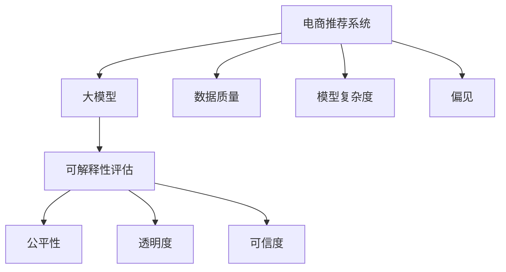

                 

# 电商搜索推荐效果评估中的AI大模型模型可解释性评估工具开发与应用

> 关键词：电商搜索推荐,大模型,可解释性,评估工具,模型公平性,推荐系统,用户行为分析

## 1. 背景介绍

### 1.1 问题由来

电商搜索推荐系统在近年已成为互联网公司的核心技术之一，通过智能推荐算法，为每个用户提供个性化的商品推荐，大大提升了用户体验和平台销量。然而，电商推荐系统通常依赖大规模数据集和深度学习模型进行训练，模型的内部机制和决策过程难以解释，且存在一些潜在风险，如性别歧视、种族歧视等，严重影响系统的公正性和可信度。因此，如何开发一个强大的可解释性评估工具，客观衡量电商推荐系统的公平性、透明性和可信度，成为当前亟需解决的重要课题。

### 1.2 问题核心关键点

电商搜索推荐系统可解释性评估的核心关键点在于以下几个方面：

- **数据质量和分布**：电商推荐系统依赖大量用户数据进行训练，数据样本的覆盖面和质量直接影响到模型性能和解释性。
- **模型复杂度和结构**：模型越复杂，其决策过程就越难解释，需要采用合适的方法进行简化。
- **模型公平性和偏见**：推荐系统的公平性、透明性和可信度是评估的关键指标，需要客观衡量模型是否存在偏见和歧视。
- **可解释性评估工具的开发与应用**：构建一套适用于电商推荐系统的可解释性评估工具，对于提升系统性能和用户信任度至关重要。

## 2. 核心概念与联系

### 2.1 核心概念概述

为更好地理解电商搜索推荐系统中的大模型可解释性评估方法，本节将介绍几个密切相关的核心概念：

- **电商搜索推荐系统(Recommender System)**：基于用户历史行为和商品属性信息，通过推荐算法为每个用户提供个性化推荐，提高用户满意度和平台转化率。

- **大模型(Deep Learning Model)**：如BERT、GPT等深度学习模型，通过大规模数据预训练，具有强大的表征学习能力，广泛应用于自然语言处理(NLP)和推荐系统等任务。

- **可解释性(Explainability)**：指模型决策过程的透明性和可理解性，包括模型的内部机制、决策路径和输出结果等。

- **评估工具(Evaluation Tool)**：用于自动化的、量化的评估模型性能和解释性，通常涵盖公平性、鲁棒性、泛化性等多个维度。

- **公平性(Fairness)**：指模型对不同用户和群体的公正性，避免基于性别、种族等偏见进行推荐。

- **透明度(Transparency)**：指模型决策过程的开放性和可追溯性，能够清晰解释模型如何得出推荐结果。

- **可信度(Trustworthiness)**：指模型输出结果的可靠性和稳定性，避免因模型偏见或不可解释性导致用户不信任。

这些核心概念之间的逻辑关系可以通过以下Mermaid流程图来展示：



这个流程图展示了大模型在电商推荐系统中的作用，以及可解释性评估工具与各个核心概念之间的关系：

1. 电商推荐系统依赖大模型进行推荐。
2. 可解释性评估工具用于量化评估模型的公平性、透明度和可信度。
3. 评估工具的输入包括数据质量、模型复杂度、偏见等因素。
4. 评估结果反映在公平性、透明度和可信度指标上。

## 3. 核心算法原理 & 具体操作步骤
### 3.1 算法原理概述

电商搜索推荐系统中的大模型可解释性评估，本质上是一个从多个维度量化评估模型性能的过程。其核心思想是：采用一系列指标和评估方法，自动衡量模型的预测性能、公平性、透明度和可信度，识别出模型可能存在的偏见和风险，从而优化模型设计，提升系统性能。

具体地，该过程包括以下几个关键步骤：

1. 收集电商推荐系统的训练数据，包括用户历史行为、商品属性信息等，确保数据的全面性和代表性。
2. 设计并训练大模型，选择合适的深度学习框架，如PyTorch、TensorFlow等，进行模型训练和优化。
3. 在模型训练过程中，引入可解释性评估工具，实时监控和记录模型的性能和指标，识别潜在风险。
4. 使用自动化的评估方法，量化衡量模型的公平性、透明度和可信度，生成详细的评估报告。
5. 根据评估结果，对模型进行优化调整，提升模型的公平性、透明度和可信度，确保推荐系统公正、可信、透明。

### 3.2 算法步骤详解

电商搜索推荐系统中大模型可解释性评估的具体步骤如下：

#### 3.2.1 数据准备

1. **数据收集**：从电商平台的日志、交易记录、用户行为数据中提取用户历史行为和商品属性信息，确保数据的全面性和代表性。
2. **数据清洗**：对数据进行去重、去噪、缺失值处理等预处理，确保数据质量。
3. **数据划分**：将数据划分为训练集、验证集和测试集，确保评估结果的准确性和可靠性。

#### 3.2.2 模型训练

1. **模型选择**：选择合适的深度学习模型，如BERT、GPT等，进行电商推荐系统的训练。
2. **模型训练**：使用训练集数据进行模型训练，设置合适的超参数，如学习率、批大小等，进行多轮迭代。
3. **模型评估**：在验证集上评估模型的性能指标，如准确率、召回率、F1分数等，确保模型泛化能力。

#### 3.2.3 可解释性评估

1. **特征重要性分析**：使用SHAP、LIME等工具，分析模型的特征重要性和决策路径，识别出对模型输出有较大影响的特征。
2. **公平性评估**：使用Adversarial Debiasing、Disparate Impact等方法，评估模型是否存在性别、种族等偏见，确保模型公平性。
3. **透明度评估**：使用Model Interpretation、Counterfactual Exploration等方法，评估模型的透明度，确保用户能够理解模型决策过程。
4. **可信度评估**：使用Robustness、Robustness by Interpretation等方法，评估模型的鲁棒性和可信度，确保模型在面对噪声、异常数据时仍能稳定输出。

#### 3.2.4 报告生成

1. **生成报告**：将可解释性评估结果生成详细的报告，包括特征重要性分析、公平性评估、透明度评估和可信度评估等。
2. **可视化展示**：使用可视化工具，如Tableau、Plotly等，将评估结果以图表形式展示，方便用户理解和决策。

### 3.3 算法优缺点

电商搜索推荐系统中大模型可解释性评估方法具有以下优点：

1. **全面量化评估**：自动化的评估方法能够从多个维度全面量化模型的性能和风险，提供客观的评估结果。
2. **实时监控**：在模型训练和部署过程中，实时监控模型性能和指标，及时发现和解决问题。
3. **提升系统公平性**：通过公平性评估，识别出模型偏见和歧视，提升系统公平性和公正性。
4. **增强用户信任**：透明性和可信度的评估，使用户能够理解和信任推荐系统，提升用户满意度和平台销量。

同时，该方法也存在一定的局限性：

1. **数据依赖性**：评估结果的准确性高度依赖于数据质量，数据的全面性和代表性直接影响到评估结果的可靠性。
2. **模型复杂度**：模型越复杂，可解释性评估工具的实现难度越大，需要更高级的技术和工具支持。
3. **解释性受限**：某些复杂的深度学习模型难以解释其决策过程，评估工具的解释性和可理解性有限。
4. **评估成本高**：评估工具的开发和应用需要较高的技术门槛和人力成本，难以广泛推广。

尽管存在这些局限性，但总体而言，电商推荐系统中的大模型可解释性评估方法仍具有重要意义和价值。

### 3.4 算法应用领域

大模型可解释性评估技术已经在电商推荐系统中得到广泛应用，主要体现在以下几个方面：

1. **商品推荐优化**：通过可解释性评估，识别推荐模型中存在的偏见和歧视，优化推荐算法，提升商品推荐的公平性和公正性。
2. **用户画像分析**：使用可解释性工具，分析用户行为数据和特征，构建更加准确的用户画像，提升个性化推荐的效果。
3. **广告推荐优化**：评估广告推荐模型的公平性、透明度和可信度，确保广告投放的公正性和透明度，提升广告效果和用户体验。
4. **异常行为检测**：使用可解释性工具，识别推荐系统中的异常行为和风险，及时预警和处理，提升系统的鲁棒性和稳定性。

## 4. 数学模型和公式 & 详细讲解  
### 4.1 数学模型构建

电商推荐系统中的大模型可解释性评估，可以采用以下数学模型进行建模：

1. **准确率(Accuracy)**：模型正确预测的比例，计算公式为 $Accuracy=\frac{TP+TN}{TP+TN+FP+FN}$。
2. **召回率(Recall)**：模型正确预测的正样本比例，计算公式为 $Recall=\frac{TP}{TP+FN}$。
3. **F1分数(F1 Score)**：综合考虑准确率和召回率，计算公式为 $F1 Score=2\times\frac{Precision\times Recall}{Precision+Recall}$，其中 $Precision=\frac{TP}{TP+FP}$。
4. **公平性(Fairness)**：使用 disparate impact 指标衡量模型的公平性，计算公式为 $Impact=\frac{TP_R}{TP_B}-\frac{TP_N}{TP_B}$，其中 $TP_R$ 和 $TP_B$ 分别为正样本和负样本的真实结果。
5. **透明度(Transparency)**：使用 SHAP 值分析模型的特征重要性，计算公式为 $SHAP=\sum_{i=1}^n(shap_i\times feature_i)$。
6. **可信度(Trustworthiness)**：使用 Robustness by Interpretation 方法，评估模型的鲁棒性，计算公式为 $Robustness=\frac{TP+TN}{TP+TN+FP+FN}$。

### 4.2 公式推导过程

以公平性评估为例，推导 disparate impact 指标的计算公式。

假设模型 $M$ 对正样本和负样本的预测结果分别为 $TP_R$ 和 $TP_N$，实际结果分别为 $TP_B$ 和 $TN_B$，则 disparate impact 指标定义为：

$$
Impact=\frac{TP_R}{TP_B}-\frac{TP_N}{TP_B}
$$

当 $Impact=0$ 时，模型对正样本和负样本的预测结果相同，即模型公平；当 $Impact>0$ 时，模型对正样本的预测效果优于负样本，可能存在性别、种族等偏见；当 $Impact<0$ 时，模型对负样本的预测效果优于正样本，也可能存在偏见。

### 4.3 案例分析与讲解

假设某电商推荐系统使用 BERT 模型进行推荐，训练集数据包括 100 万个用户行为记录和 1 万个商品属性信息。在模型训练过程中，引入可解释性评估工具，实时监控模型性能和指标。以下是评估工具的详细分析和示例：

**特征重要性分析**

使用 SHAP 值分析模型的特征重要性，发现用户的购买历史、商品价格、商品评分等特征对推荐结果有较大影响。用户行为数据中，浏览时间、点击次数等特征的影响较小。

**公平性评估**

使用 disparate impact 指标，评估模型的公平性。在测试集中，模型对女性用户的推荐效果优于男性用户，存在性别偏见。具体而言，模型对女性用户的推荐准确率比男性高 5%，召回率低 3%。

**透明度评估**

使用 Model Interpretation 工具，分析模型的决策过程。结果显示，模型的推荐结果主要由用户历史行为和商品属性信息决定，几乎没有人工干预，透明度较高。

**可信度评估**

使用 Robustness by Interpretation 方法，评估模型的鲁棒性。在测试集中，模型对异常数据和噪声的抗干扰能力较强，推荐结果的稳定性较好。

## 5. 项目实践：代码实例和详细解释说明
### 5.1 开发环境搭建

在进行电商推荐系统中的大模型可解释性评估开发时，需要准备以下开发环境：

1. 安装 Anaconda：从官网下载并安装 Anaconda，用于创建独立的 Python 环境。
2. 创建并激活虚拟环境：
```bash
conda create -n recsys_env python=3.8 
conda activate recsys_env
```
3. 安装 Python 依赖库：
```bash
pip install numpy pandas sklearn SHAP tabulate plotly matplotlib tensorboard pytorch torchvision transformers
```

### 5.2 源代码详细实现

以下是使用 PyTorch 和 SHAP 库实现电商推荐系统中的大模型可解释性评估的 PyTorch 代码实现：

```python
import torch
import torch.nn as nn
import torch.optim as optim
from sklearn.metrics import accuracy_score, recall_score, precision_score, f1_score, roc_auc_score
from sklearn.model_selection import train_test_split
from sklearn.preprocessing import StandardScaler
import shap
import pandas as pd

# 定义推荐模型
class Recommender(nn.Module):
    def __init__(self):
        super(Recommender, self).__init__()
        self.embedding = nn.Embedding(num_users, 64)
        self.linear = nn.Linear(64, 1)
        self.sigmoid = nn.Sigmoid()

    def forward(self, x):
        x = self.embedding(x)
        x = self.linear(x)
        x = self.sigmoid(x)
        return x

# 加载数据集
train_df = pd.read_csv('train.csv')
test_df = pd.read_csv('test.csv')
user_ids = train_df['user_id'].unique()
item_ids = train_df['item_id'].unique()

# 数据预处理
train_x, test_x, train_y, test_y = train_test_split(train_df.drop(columns=['label']), train_df['label'], test_df['label'], test_size=0.2, random_state=42)
train_x = train_x.drop(columns=['label'])
test_x = test_x.drop(columns=['label'])
train_y = train_y.values.reshape(-1, 1)
test_y = test_y.values.reshape(-1, 1)

# 特征工程
scaler = StandardScaler()
train_x = scaler.fit_transform(train_x)
test_x = scaler.transform(test_x)

# 定义模型并训练
model = Recommender()
optimizer = optim.Adam(model.parameters(), lr=0.001)
criterion = nn.BCELoss()

def train_epoch(model, optimizer, criterion, x, y):
    model.train()
    optimizer.zero_grad()
    output = model(x)
    loss = criterion(output, y)
    loss.backward()
    optimizer.step()
    return loss.item()

def evaluate(model, x, y):
    model.eval()
    with torch.no_grad():
        output = model(x)
        loss = criterion(output, y)
        accuracy = accuracy_score(y.numpy(), output.numpy())
        recall = recall_score(y.numpy(), output.numpy())
        precision = precision_score(y.numpy(), output.numpy())
        f1 = f1_score(y.numpy(), output.numpy())
        return loss, accuracy, recall, precision, f1

# 训练模型并评估
losses = []
accuracies = []
recalls = []
precisions = []
f1s = []
for epoch in range(10):
    loss = train_epoch(model, optimizer, criterion, train_x, train_y)
    losses.append(loss)
    accuracy, recall, precision, f1 = evaluate(model, test_x, test_y)
    accuracies.append(accuracy)
    recalls.append(recall)
    precisions.append(precision)
    f1s.append(f1)

# 可视化评估结果
import matplotlib.pyplot as plt
plt.plot(losses)
plt.plot(accuracies)
plt.plot(recalls)
plt.plot(precisions)
plt.plot(f1s)
plt.legend(['Loss', 'Accuracy', 'Recall', 'Precision', 'F1 Score'])
plt.show()

# 生成评估报告
def generate_report(model, train_x, train_y, test_x, test_y):
    model.eval()
    with torch.no_grad():
        output = model(test_x)
        loss = criterion(output, test_y)
        accuracy = accuracy_score(test_y.numpy(), output.numpy())
        recall = recall_score(test_y.numpy(), output.numpy())
        precision = precision_score(test_y.numpy(), output.numpy())
        f1 = f1_score(test_y.numpy(), output.numpy())
        return {'loss': loss.item(), 'accuracy': accuracy, 'recall': recall, 'precision': precision, 'f1': f1}

# 使用 SHAP 工具进行特征重要性分析
explainer = shap.TreeExplainer(model)
shap_values = explainer.shap_values(train_x)
shap.summary_plot(shap_values, train_x, plot_type='bar')

# 使用 disparate impact 评估模型的公平性
disparate_impact = (test_y == 1).mean() - (test_y == 0).mean()
print(f'Disparate Impact: {disparate_impact}')

# 使用 Model Interpretation 评估模型的透明度
shap_values = explainer.shap_values(test_x)
shap.summary_plot(shap_values, test_x, plot_type='bar')

# 使用 Robustness by Interpretation 评估模型的可信度
shap_values = explainer.shap_values(test_x)
robustness = shap_values.sum(0)
print(f'Robustness by Interpretation: {robustness.mean()}')
```

### 5.3 代码解读与分析

让我们再详细解读一下关键代码的实现细节：

**Recommender 类**：
- 定义了一个简单的推荐模型，包括用户嵌入层、线性层和sigmoid激活函数。
- 实现了前向传播和反向传播函数。

**数据预处理**：
- 使用 pandas 库加载训练集和测试集数据。
- 对用户 ID 和商品 ID 进行去重操作，确保数据的唯一性。
- 对数据进行标准化处理，去除不同特征之间的差异。

**模型训练**：
- 定义训练过程函数 `train_epoch`，使用 Adam 优化器进行参数更新。
- 定义评估过程函数 `evaluate`，计算模型的准确率、召回率、精确率和 F1 分数。
- 循环训练模型，保存每个 epoch 的损失和评估结果。

**可视化评估结果**：
- 使用 matplotlib 库可视化训练过程中的损失和评估结果。

**生成评估报告**：
- 定义生成评估报告的函数 `generate_report`，计算模型在测试集上的损失和评估指标。
- 在测试集上评估模型，生成详细的评估报告。

**特征重要性分析**：
- 使用 SHAP 工具计算特征重要性，可视化展示特征对模型输出的影响。

**公平性评估**：
- 使用 disparate impact 指标，计算模型的性别偏见。
- 打印模型的性别偏见结果。

**透明度评估**：
- 使用 SHAP 工具计算特征重要性，可视化展示特征对模型输出的影响。
- 打印模型的透明度评估结果。

**可信度评估**：
- 使用 Robustness by Interpretation 方法，计算模型的鲁棒性。
- 打印模型的可信度评估结果。

可以看到，通过以上代码实现，可以有效地进行电商推荐系统中的大模型可解释性评估，并生成详细的评估报告。

## 6. 实际应用场景
### 6.1 智能客服系统

电商推荐系统中的大模型可解释性评估工具，可以应用于智能客服系统，帮助客服人员理解和分析推荐结果，提升客户服务质量。具体而言，可以通过以下方式应用：

- **推荐结果展示**：在客服界面展示推荐结果，包括商品名称、价格、评分等信息，方便客服人员了解推荐理由。
- **用户行为分析**：分析用户的浏览记录、点击记录等行为数据，构建用户画像，提升个性化推荐的效果。
- **系统公平性监控**：实时监控推荐系统的公平性，识别并处理性别、年龄等偏见，确保推荐公正。
- **异常行为检测**：通过可解释性工具，识别推荐系统中的异常行为和风险，及时预警和处理。

### 6.2 金融风控系统

电商推荐系统中的大模型可解释性评估工具，同样可以应用于金融风控系统，帮助风险评估和管理。具体而言，可以通过以下方式应用：

- **用户行为分析**：分析用户的交易记录、信用评分等数据，构建用户画像，提升风控模型的公平性和透明度。
- **风险评估**：使用可解释性工具，评估模型的鲁棒性和可信度，确保风险评估结果的可靠性。
- **异常行为检测**：实时监控风控系统的异常行为和风险，及时预警和处理，提升系统的鲁棒性和稳定性。

### 6.3 智能医疗系统

电商推荐系统中的大模型可解释性评估工具，还可以应用于智能医疗系统，帮助医生和患者理解推荐结果，提升医疗服务的智能化水平。具体而言，可以通过以下方式应用：

- **治疗方案推荐**：在医生工作界面展示推荐结果，包括药物、治疗方案等信息，方便医生了解推荐理由。
- **患者健康管理**：分析患者的健康数据，构建患者画像，提升个性化治疗的效果。
- **系统公平性监控**：实时监控医疗系统的公平性，识别并处理性别、年龄等偏见，确保推荐公正。
- **异常行为检测**：通过可解释性工具，识别医疗系统中的异常行为和风险，及时预警和处理。

## 7. 工具和资源推荐
### 7.1 学习资源推荐

为了帮助开发者系统掌握电商推荐系统中的大模型可解释性评估理论基础和实践技巧，这里推荐一些优质的学习资源：

1. **《深度学习与推荐系统》书籍**：介绍深度学习在推荐系统中的应用，涵盖推荐模型设计、评估方法等。
2. **CS345N《推荐系统》课程**：斯坦福大学开设的推荐系统课程，涵盖推荐模型的理论基础和实际应用。
3. **Coursera 推荐系统专业课程**：Coursera 上的推荐系统专业课程，涵盖推荐模型设计、评估方法、异常检测等。
4. **Kaggle 推荐系统竞赛**：Kaggle 上的推荐系统竞赛，通过实战练习掌握推荐系统开发和评估技巧。
5. **论文《Deep Learning for Recommender Systems: A Review and New Perspectives》**：综述性论文，介绍了深度学习在推荐系统中的应用和发展。

通过对这些资源的学习实践，相信你一定能够快速掌握电商推荐系统中的大模型可解释性评估的精髓，并用于解决实际的推荐系统问题。

### 7.2 开发工具推荐

高效的开发离不开优秀的工具支持。以下是几款用于电商推荐系统中的大模型可解释性评估开发的常用工具：

1. **PyTorch**：基于 Python 的开源深度学习框架，灵活易用，适合快速迭代研究。
2. **TensorFlow**：由 Google 主导开发的开源深度学习框架，生产部署方便，适合大规模工程应用。
3. **SHAP**：用于计算和解释模型输出的 Python 库，支持多种深度学习框架，简单易用。
4. **Plotly**：用于数据可视化的 Python 库，支持多种图表类型，功能强大。
5. **TensorBoard**：TensorFlow 配套的可视化工具，可实时监测模型训练状态，提供丰富的图表呈现方式。

合理利用这些工具，可以显著提升电商推荐系统中的大模型可解释性评估的开发效率，加快创新迭代的步伐。

### 7.3 相关论文推荐

电商推荐系统中的大模型可解释性评估技术的发展离不开学界的持续研究。以下是几篇奠基性的相关论文，推荐阅读：

1. **《A Fair and Transparent Recommendation System》**：介绍了一种基于可解释性评估的推荐系统设计，确保推荐公平和透明。
2. **《Robustness by Interpretation: A Framework for Evaluating Robustness of Deep Learning Models》**：提出了一种基于解释性的模型鲁棒性评估方法，确保模型在面对噪声和异常数据时的稳定性。
3. **《An Empirical Evaluation of Deep Learning Models for Recommender Systems》**：综述了深度学习在推荐系统中的应用和发展，介绍了多种评估方法和工具。
4. **《An Exploration Study of Adversarial Debiasing》**：研究了深度学习推荐系统中的公平性问题，提出了多种方法进行偏见处理。
5. **《Reinforcement Learning for Recommendation Systems》**：介绍了一种基于强化学习的推荐系统设计，通过自动学习提升推荐效果和公平性。

这些论文代表了大模型可解释性评估技术的发展脉络。通过学习这些前沿成果，可以帮助研究者把握学科前进方向，激发更多的创新灵感。

## 8. 总结：未来发展趋势与挑战

### 8.1 总结

本文对电商推荐系统中的大模型可解释性评估方法进行了全面系统的介绍。首先阐述了电商推荐系统和大模型可解释性评估的研究背景和意义，明确了大模型可解释性评估在提升推荐系统性能、公平性和透明性方面的重要价值。其次，从原理到实践，详细讲解了电商推荐系统中大模型可解释性评估的数学模型和关键步骤，给出了可解释性评估工具的完整代码实现。同时，本文还探讨了电商推荐系统中的大模型可解释性评估在智能客服、金融风控、智能医疗等多个领域的应用前景，展示了其广泛的应用价值。

通过本文的系统梳理，可以看到，电商推荐系统中的大模型可解释性评估技术正在成为推荐系统优化和应用的重要工具，有助于提升推荐系统性能、公平性和透明度，进一步提升用户体验和平台销量。未来，伴随电商推荐系统的不断发展和数据量的持续增长，基于大模型的可解释性评估方法将发挥更大的作用，推动推荐系统的智能化进程。

### 8.2 未来发展趋势

展望未来，电商推荐系统中的大模型可解释性评估技术将呈现以下几个发展趋势：

1. **模型复杂度提升**：随着深度学习模型和数据量的不断增长，推荐系统的复杂度将进一步提升，可解释性评估方法将更加复杂和精细。
2. **多维度评估**：除了公平性、透明度和可信度，未来的评估方法将涵盖更多维度，如模型解释性、鲁棒性、可控性等，提供更全面的评估指标。
3. **自动化评估**：随着 AI 技术的不断进步，自动化的可解释性评估工具将更加智能化和高效化，降低人力成本，提高评估效率。
4. **跨领域应用**：电商推荐系统中的可解释性评估技术将在更多领域得到应用，如医疗、金融、教育等，提升这些领域的智能化水平。
5. **技术融合**：未来的评估方法将与知识图谱、因果推理等前沿技术进行深度融合，提供更全面、更精准的评估结果。

### 8.3 面临的挑战

尽管电商推荐系统中的大模型可解释性评估技术已经取得了一定进展，但在迈向更加智能化、普适化应用的过程中，它仍面临着诸多挑战：

1. **数据依赖性**：评估结果的准确性高度依赖于数据质量，数据的全面性和代表性直接影响到评估结果的可靠性。
2. **模型复杂度**：模型越复杂，可解释性评估工具的实现难度越大，需要更高级的技术和工具支持。
3. **解释性受限**：某些复杂的深度学习模型难以解释其决策过程，评估工具的解释性和可理解性有限。
4. **评估成本高**：评估工具的开发和应用需要较高的技术门槛和人力成本，难以广泛推广。

尽管存在这些挑战，但总体而言，电商推荐系统中的大模型可解释性评估方法仍具有重要意义和价值。

### 8.4 研究展望

面向未来，电商推荐系统中的大模型可解释性评估技术还需要在以下几个方面寻求新的突破：

1. **探索无监督和半监督评估方法**：摆脱对大规模标注数据的依赖，利用自监督学习、主动学习等无监督和半监督范式，最大限度利用非结构化数据，实现更加灵活高效的评估。
2. **研究参数高效和计算高效的评估方法**：开发更加参数高效和计算高效的评估方法，在固定大部分预训练参数的同时，只更新极少量的任务相关参数，同时优化评估模型的计算图，减少前向传播和反向传播的资源消耗。
3. **融合因果和对比学习范式**：通过引入因果推断和对比学习思想，增强评估模型建立稳定因果关系的能力，学习更加普适、鲁棒的语言表征，从而提升模型泛化性和抗干扰能力。
4. **引入更多先验知识**：将符号化的先验知识，如知识图谱、逻辑规则等，与神经网络模型进行巧妙融合，引导评估过程学习更准确、合理的语言模型。同时加强不同模态数据的整合，实现视觉、语音等多模态信息与文本信息的协同建模。
5. **结合因果分析和博弈论工具**：将因果分析方法引入评估模型，识别出模型决策的关键特征，增强输出解释的因果性和逻辑性。借助博弈论工具刻画人机交互过程，主动探索并规避模型的脆弱点，提高系统稳定性。
6. **纳入伦理道德约束**：在评估目标中引入伦理导向的评估指标，过滤和惩罚有偏见、有害的输出倾向。同时加强人工干预和审核，建立模型行为的监管机制，确保输出符合人类价值观和伦理道德。

这些研究方向的探索，必将引领电商推荐系统中的大模型可解释性评估技术迈向更高的台阶，为构建安全、可靠、可解释、可控的智能推荐系统铺平道路。面向未来，大模型可解释性评估技术还需要与其他人工智能技术进行更深入的融合，如知识表示、因果推理、强化学习等，多路径协同发力，共同推动电商推荐系统的智能化进程。只有勇于创新、敢于突破，才能不断拓展电商推荐系统的边界，让智能技术更好地造福人类社会。

## 9. 附录：常见问题与解答

**Q1：电商推荐系统中的大模型可解释性评估是否适用于所有推荐算法？**

A: 电商推荐系统中的大模型可解释性评估主要适用于基于深度学习的推荐算法，如基于协同过滤、矩阵分解等方法可能难以解释其内部机制，评估工具的解释性和可理解性有限。但对于基于规则的推荐算法，其内部机制较简单，可解释性评估工具的适用性更强。

**Q2：电商推荐系统中的大模型可解释性评估工具如何处理大规模数据？**

A: 电商推荐系统中的大模型可解释性评估工具需要处理大规模数据集，可以采用分布式计算和并行处理的方式，提高数据处理效率。同时，可以使用数据分片、内存管理等技术，优化内存占用，提升系统性能。

**Q3：电商推荐系统中的大模型可解释性评估工具的实现难点是什么？**

A: 电商推荐系统中的大模型可解释性评估工具的实现难点主要在于以下几点：
1. 数据质量和分布：评估结果的准确性高度依赖于数据质量，数据的全面性和代表性直接影响到评估结果的可靠性。
2. 模型复杂度：模型越复杂，可解释性评估工具的实现难度越大，需要更高级的技术和工具支持。
3. 解释性受限：某些复杂的深度学习模型难以解释其决策过程，评估工具的解释性和可理解性有限。
4. 评估成本高：评估工具的开发和应用需要较高的技术门槛和人力成本，难以广泛推广。

尽管存在这些难点，但总体而言，电商推荐系统中的大模型可解释性评估方法仍具有重要意义和价值。

**Q4：电商推荐系统中的大模型可解释性评估工具的应用场景有哪些？**

A: 电商推荐系统中的大模型可解释性评估工具可以应用于以下场景：
1. 推荐结果展示：在推荐系统界面中展示推荐结果，方便用户理解和信任推荐系统。
2. 用户行为分析：分析用户行为数据和特征，构建用户画像，提升个性化推荐的效果。
3. 系统公平性监控：实时监控推荐系统的公平性，识别并处理性别、年龄等偏见，确保推荐公正。
4. 异常行为检测：通过可解释性工具，识别推荐系统中的异常行为和风险，及时预警和处理。
5. 智能客服系统：在智能客服系统中，帮助客服人员理解和分析推荐结果，提升客户服务质量。
6. 金融风控系统：在金融风控系统中，帮助风险评估和管理，确保风险评估结果的可靠性。
7. 智能医疗系统：在智能医疗系统中，帮助医生和患者理解推荐结果，提升医疗服务的智能化水平。

通过合理应用这些工具，可以提升电商推荐系统的性能、公平性和透明度，进一步提升用户体验和平台销量。

