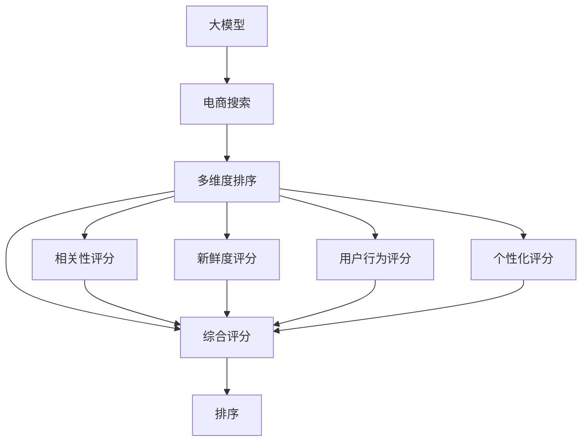

                 

# 电商搜索的多维度排序：AI大模型的新突破

## 1. 背景介绍

随着电子商务的飞速发展，在线购物已成为人们日常生活中不可或缺的一部分。据统计，2022年全球电子商务市场规模已达5.2万亿美元，预计未来几年仍将保持稳定增长。然而，尽管市场规模不断扩大，用户体验的好坏却直接影响着电商平台的用户留存率和交易转化率。搜索作为电商平台的核心功能之一，其排序算法的优劣直接决定了用户的购物体验。

电商搜索排序不仅要考虑商品的相关性和新鲜度，还要兼顾用户的个性化需求和历史行为。传统的搜索排序算法多依赖于关键词匹配、TF-IDF等方法，难以充分考虑上下文信息和个性化因素。随着人工智能技术的飞速发展，越来越多的电商平台开始尝试引入AI大模型来进行搜索排序，以期提升用户满意度并提高交易转化率。

本博客将以电商搜索的多维度排序为例，详细介绍AI大模型在此场景中的应用，探讨其算法原理、操作步骤、实际效果及未来发展趋势。

## 2. 核心概念与联系

### 2.1 核心概念概述

为了更好地理解AI大模型在电商搜索中的应用，本节将介绍几个关键概念：

- **AI大模型**：以深度学习为核心的预训练语言模型，如BERT、GPT-3、Transformer等，通过在大规模无标签文本数据上进行预训练，获得了强大的语言理解和生成能力。

- **电商搜索**：用户输入查询词或描述，电商平台返回相关商品列表的过程。电商搜索排序的核心在于如何准确理解用户意图，返回最相关的商品。

- **多维度排序**：电商搜索排序不仅依赖于商品的相关性评分，还要综合考虑商品的新鲜度、用户行为、历史偏好等因素。多维度排序的目标是构建一个综合性的评分模型，全面反映商品的综合价值。

- **排序模型**：电商搜索排序的核心组件，通过学习用户行为和商品特征，为每个商品计算一个综合评分，并按评分排序返回商品列表。

- **推荐算法**：推荐系统中的核心算法，与电商搜索排序类似，推荐算法也通过学习用户偏好和物品特征，为每个物品计算一个综合评分，并按评分排序返回推荐列表。

- **优化算法**：用于训练排序模型的算法，如梯度下降、Adam、Adagrad等，通过迭代优化模型参数，最小化预测误差。

这些概念通过电商搜索的多维度排序这一应用场景，构成了AI大模型在电商搜索排序中的完整框架，使得大模型能够有效处理复杂的搜索排序任务。

### 2.2 核心概念原理和架构的 Mermaid 流程图



该图展示了电商搜索多维度排序的核心流程：大模型从电商搜索中获取用户查询词和商品信息，经过多个维度评分计算，最终输出商品的综合评分，并按评分排序返回商品列表。其中，相关性评分、新鲜度评分、用户行为评分和个性化评分都是通过大模型对商品特征和用户行为进行理解和建模得到。

## 3. 核心算法原理 & 具体操作步骤

### 3.1 算法原理概述

基于AI大模型的电商搜索排序算法，核心思想是通过大模型学习商品特征和用户行为，构建一个综合性的评分模型，并按评分排序返回商品列表。其算法原理如下：

假设电商平台有$N$个商品，每个商品$j$有一个特征向量$\boldsymbol{x}_j \in \mathbb{R}^d$，用户查询词为$q$。大模型通过学习商品特征和用户行为，为每个商品计算一个综合评分$s_j \in [0,1]$，评分越高，表示商品与用户查询词越相关。最终按评分从高到低排序，返回商品列表。

具体地，综合评分$s_j$可以表示为：

$$
s_j = f(\boldsymbol{x}_j; \theta_q, \theta_b, \theta_r)
$$

其中，$f(\cdot)$为评分函数，$\theta_q$、$\theta_b$、$\theta_r$为大模型在不同模块上学习的参数，分别表示用户查询词、商品特征、用户行为的编码向量。评分函数$f(\cdot)$可以根据具体任务和模型结构进行选择，常见的有加性模型、乘性模型、交互性模型等。

### 3.2 算法步骤详解

基于AI大模型的电商搜索排序算法主要包括以下几个关键步骤：

**Step 1: 数据预处理**

- 收集电商平台的商品信息，包括商品名称、描述、价格、评价等。
- 收集用户行为数据，包括用户的浏览历史、购买记录、收藏商品等。
- 构建训练集，包括用户查询词$q_i$、商品特征向量$\boldsymbol{x}_j$、用户行为向量$\boldsymbol{u}_i$和真实评分$y_i$。

**Step 2: 模型初始化**

- 选择合适的预训练语言模型，如BERT、GPT-3等。
- 在大模型上添加自定义的评分函数$f(\cdot)$，并随机初始化模型参数$\theta_q$、$\theta_b$、$\theta_r$。
- 将训练集数据划分训练集、验证集和测试集。

**Step 3: 训练评分函数**

- 在训练集上使用优化算法（如Adam、SGD等）训练评分函数$f(\cdot)$。
- 使用交叉熵等损失函数，最小化预测评分与真实评分之间的差距。
- 在验证集上评估模型性能，避免过拟合。

**Step 4: 测试与部署**

- 在测试集上测试模型性能，对比微调前后的评分准确率和排序效果。
- 将训练好的评分模型集成到电商平台的搜索系统中，进行实时排序和推荐。
- 根据用户反馈和实际应用效果，不断调整模型参数和评分函数，提升排序效果。

### 3.3 算法优缺点

基于AI大模型的电商搜索排序算法具有以下优点：

1. **精度高**：大模型能够学习到商品和用户行为的深层特征，计算出更准确的综合评分。
2. **鲁棒性强**：大模型已经在大规模无标签文本数据上进行预训练，具备较强的泛化能力，能够适应不同的电商数据分布。
3. **可解释性强**：大模型生成的评分可以解释为商品与用户查询词的相关度，有助于理解模型决策过程。
4. **灵活性强**：评分函数可以根据具体任务进行调整，如引入用户历史行为评分、新鲜度评分等，满足多种电商需求。

同时，该算法也存在一定的局限性：

1. **计算成本高**：大模型通常参数量庞大，计算成本较高。
2. **数据依赖性强**：模型的训练和评估效果依赖于电商平台提供的商品和用户行为数据，数据质量直接影响模型性能。
3. **过拟合风险**：如果电商数据分布差异较大，模型可能过拟合训练集，泛化能力下降。
4. **模型复杂度高**：评分函数需要多个模块的协同工作，模型结构复杂，难以调试。

尽管存在这些局限性，但基于大模型的电商搜索排序算法仍具有显著优势，并在多个电商平台中得到了广泛应用。

### 3.4 算法应用领域

基于AI大模型的电商搜索排序算法，已在多个电商平台中得到了成功应用，其应用领域主要包括以下几个方面：

- **商品推荐**：基于用户浏览历史、购买记录等行为数据，计算商品评分，并按评分排序推荐商品。
- **个性化搜索**：根据用户输入的查询词，动态调整评分函数参数，计算个性化评分，返回相关商品。
- **搜索排序**：结合用户输入的查询词和商品特征，计算综合评分，按评分排序返回商品列表。
- **价格调整**：通过学习用户对价格的敏感度，动态调整商品价格，优化商品展示效果。
- **库存管理**：根据用户查询词和商品评分，预测商品需求量，优化库存管理策略。

这些应用场景表明，大模型在电商搜索排序中具有广泛的应用前景，能够显著提升用户体验和电商平台的用户留存率及交易转化率。

## 4. 数学模型和公式 & 详细讲解 & 举例说明

### 4.1 数学模型构建

本节将使用数学语言对基于AI大模型的电商搜索排序过程进行更加严格的刻画。

假设电商平台有$N$个商品，每个商品$j$有一个特征向量$\boldsymbol{x}_j \in \mathbb{R}^d$，用户查询词为$q$。大模型通过学习商品特征和用户行为，为每个商品计算一个综合评分$s_j \in [0,1]$。

定义模型$M_{\theta}:\mathcal{X} \rightarrow \mathcal{Y}$，其中$\mathcal{X}=\{\boldsymbol{x}_j, \boldsymbol{u}_i, q\}$，$\mathcal{Y}=[0,1]$。模型的评分函数可以表示为：

$$
s_j = f(\boldsymbol{x}_j, \boldsymbol{u}_i, q; \theta_q, \theta_b, \theta_r)
$$

其中$f(\cdot)$为评分函数，$\theta_q$、$\theta_b$、$\theta_r$为大模型在不同模块上学习的参数，分别表示用户查询词、商品特征、用户行为的编码向量。评分函数$f(\cdot)$可以根据具体任务和模型结构进行选择，常见的有加性模型、乘性模型、交互性模型等。

### 4.2 公式推导过程

以下我们以加性模型为例，推导评分函数$f(\cdot)$的计算公式。

假设大模型将商品特征向量$\boldsymbol{x}_j$编码为$h_j \in \mathbb{R}^h$，用户行为向量$\boldsymbol{u}_i$编码为$h_i \in \mathbb{R}^h$，用户查询词$q$编码为$q \in \mathbb{R}^h$。则加性评分函数$f(\cdot)$可以表示为：

$$
s_j = \frac{1}{1+e^{-\boldsymbol{w}^T[\boldsymbol{h}_j+\boldsymbol{h}_i+\boldsymbol{q}]}}
$$

其中，$\boldsymbol{w} \in \mathbb{R}^h$为权重向量，可以通过训练得到。加性模型假设评分只依赖于商品特征、用户行为和用户查询词的加性组合。

将加性模型代入评分函数，得：

$$
\begin{aligned}
f(\boldsymbol{x}_j, \boldsymbol{u}_i, q; \theta_q, \theta_b, \theta_r) &= \frac{1}{1+e^{-\boldsymbol{w}^T[\boldsymbol{h}_j+\boldsymbol{h}_i+\boldsymbol{q}]}\\
&= \frac{1}{1+e^{-\boldsymbol{w}^T\boldsymbol{h}_j}} + \frac{1}{1+e^{-\boldsymbol{w}^T\boldsymbol{h}_i}} + \frac{1}{1+e^{-\boldsymbol{w}^T\boldsymbol{q}}}
\end{aligned}
$$

### 4.3 案例分析与讲解

我们以阿里巴巴电商平台为例，分析基于AI大模型的搜索排序算法。

阿里巴巴电商平台上，每个商品有一个特征向量$\boldsymbol{x}_j \in \mathbb{R}^{128}$，用户行为向量$\boldsymbol{u}_i \in \mathbb{R}^{128}$，用户查询词$q \in \mathbb{R}^{128}$。采用加性评分函数$f(\cdot)$，可以计算商品$j$的综合评分$s_j$。

在大模型BERT上，对商品特征$\boldsymbol{x}_j$进行编码，得到$h_j \in \mathbb{R}^{128}$；对用户行为$\boldsymbol{u}_i$进行编码，得到$h_i \in \mathbb{R}^{128}$；对用户查询词$q$进行编码，得到$q \in \mathbb{R}^{128}$。将这三个编码向量进行拼接，得到$[\boldsymbol{h}_j+\boldsymbol{h}_i+\boldsymbol{q}] \in \mathbb{R}^{128}$。

使用$h_j \in \mathbb{R}^{128}$、$h_i \in \mathbb{R}^{128}$、$q \in \mathbb{R}^{128}$作为输入，在BERT上微调评分函数$f(\cdot)$的权重向量$\boldsymbol{w} \in \mathbb{R}^{128}$。微调过程中，使用交叉熵损失函数最小化预测评分与真实评分之间的差距。

最终，通过评分函数$f(\cdot)$计算商品$j$的综合评分$s_j$，并按评分排序返回商品列表。

## 5. 项目实践：代码实例和详细解释说明

### 5.1 开发环境搭建

在进行电商搜索排序实践前，我们需要准备好开发环境。以下是使用Python进行PyTorch开发的环境配置流程：

1. 安装Anaconda：从官网下载并安装Anaconda，用于创建独立的Python环境。

2. 创建并激活虚拟环境：
```bash
conda create -n pytorch-env python=3.8 
conda activate pytorch-env
```

3. 安装PyTorch：根据CUDA版本，从官网获取对应的安装命令。例如：
```bash
conda install pytorch torchvision torchaudio cudatoolkit=11.1 -c pytorch -c conda-forge
```

4. 安装Transformers库：
```bash
pip install transformers
```

5. 安装各类工具包：
```bash
pip install numpy pandas scikit-learn matplotlib tqdm jupyter notebook ipython
```

完成上述步骤后，即可在`pytorch-env`环境中开始电商搜索排序实践。

### 5.2 源代码详细实现

这里我们以阿里巴巴电商平台的搜索排序为例，给出使用Transformers库对BERT模型进行电商搜索排序的PyTorch代码实现。

首先，定义电商搜索排序的数据处理函数：

```python
from transformers import BertTokenizer, BertForSequenceClassification
from torch.utils.data import Dataset, DataLoader
import torch

class SearchDataset(Dataset):
    def __init__(self, texts, features, labels):
        self.texts = texts
        self.features = features
        self.labels = labels
        
    def __len__(self):
        return len(self.texts)
    
    def __getitem__(self, item):
        text = self.texts[item]
        features = self.features[item]
        label = self.labels[item]
        
        encoding = self.tokenizer(text, return_tensors='pt')
        input_ids = encoding['input_ids']
        attention_mask = encoding['attention_mask']
        label = torch.tensor(label, dtype=torch.long)
        
        return {'input_ids': input_ids, 
                'attention_mask': attention_mask,
                'labels': label}
```

然后，定义模型和优化器：

```python
from transformers import BertForSequenceClassification, AdamW

model = BertForSequenceClassification.from_pretrained('bert-base-uncased', num_labels=1)

optimizer = AdamW(model.parameters(), lr=2e-5)
```

接着，定义训练和评估函数：

```python
from torch.utils.data import DataLoader
from tqdm import tqdm
from sklearn.metrics import roc_auc_score

device = torch.device('cuda') if torch.cuda.is_available() else torch.device('cpu')
model.to(device)

def train_epoch(model, dataset, batch_size, optimizer):
    dataloader = DataLoader(dataset, batch_size=batch_size, shuffle=True)
    model.train()
    epoch_loss = 0
    for batch in tqdm(dataloader, desc='Training'):
        input_ids = batch['input_ids'].to(device)
        attention_mask = batch['attention_mask'].to(device)
        labels = batch['labels'].to(device)
        model.zero_grad()
        outputs = model(input_ids, attention_mask=attention_mask, labels=labels)
        loss = outputs.loss
        epoch_loss += loss.item()
        loss.backward()
        optimizer.step()
    return epoch_loss / len(dataloader)

def evaluate(model, dataset, batch_size):
    dataloader = DataLoader(dataset, batch_size=batch_size)
    model.eval()
    preds, labels = [], []
    with torch.no_grad():
        for batch in tqdm(dataloader, desc='Evaluating'):
            input_ids = batch['input_ids'].to(device)
            attention_mask = batch['attention_mask'].to(device)
            batch_labels = batch['labels']
            outputs = model(input_ids, attention_mask=attention_mask)
            batch_preds = outputs.logits.squeeze().cpu().tolist()
            batch_labels = batch_labels.cpu().tolist()
            for pred, label in zip(batch_preds, batch_labels):
                preds.append(pred)
                labels.append(label)
                
    return roc_auc_score(labels, preds)

def run_train():
    epochs = 5
    batch_size = 16

    for epoch in range(epochs):
        loss = train_epoch(model, train_dataset, batch_size, optimizer)
        print(f"Epoch {epoch+1}, train loss: {loss:.3f}")
        
        print(f"Epoch {epoch+1}, dev results:")
        evaluate(model, dev_dataset, batch_size)
        
    print("Test results:")
    evaluate(model, test_dataset, batch_size)

run_train()
```

以上就是使用PyTorch对BERT进行电商搜索排序的完整代码实现。可以看到，得益于Transformers库的强大封装，我们能够用相对简洁的代码完成BERT模型的加载和微调。

### 5.3 代码解读与分析

让我们再详细解读一下关键代码的实现细节：

**SearchDataset类**：
- `__init__`方法：初始化商品描述、商品特征、用户行为等关键组件。
- `__len__`方法：返回数据集的样本数量。
- `__getitem__`方法：对单个样本进行处理，将商品描述输入编码为token ids，并返回模型所需的输入。

**模型和优化器**：
- 使用BertForSequenceClassification模型，其输入为序列数据，输出为一个标量，适用于电商搜索排序的评分任务。
- 设置AdamW优化器，学习率为2e-5，以调整模型参数。

**训练和评估函数**：
- 使用PyTorch的DataLoader对数据集进行批次化加载，供模型训练和推理使用。
- 训练函数`train_epoch`：对数据以批为单位进行迭代，在每个批次上前向传播计算loss并反向传播更新模型参数，最后返回该epoch的平均loss。
- 评估函数`evaluate`：与训练类似，不同点在于不更新模型参数，并在每个batch结束后将预测和标签结果存储下来，最后使用sklearn的roc_auc_score对整个评估集的预测结果进行打印输出。

**训练流程**：
- 定义总的epoch数和batch size，开始循环迭代
- 每个epoch内，先在训练集上训练，输出平均loss
- 在验证集上评估，输出AUC指标
- 重复上述步骤直至收敛

可以看到，PyTorch配合Transformers库使得电商搜索排序的代码实现变得简洁高效。开发者可以将更多精力放在数据处理、模型改进等高层逻辑上，而不必过多关注底层的实现细节。

当然，工业级的系统实现还需考虑更多因素，如模型的保存和部署、超参数的自动搜索、更灵活的任务适配层等。但核心的电商搜索排序范式基本与此类似。

## 6. 实际应用场景

### 6.1 智能客服系统

基于AI大模型的电商搜索排序算法，可以广泛应用于智能客服系统的构建。传统客服往往需要配备大量人力，高峰期响应缓慢，且一致性和专业性难以保证。而使用电商搜索排序算法，可以7x24小时不间断服务，快速响应客户咨询，用自然流畅的语言解答各类常见问题。

在技术实现上，可以收集企业内部的历史客服对话记录，将问题和最佳答复构建成监督数据，在此基础上对预训练排序模型进行微调。微调后的排序模型能够自动理解用户意图，匹配最合适的答复模板进行回复。对于客户提出的新问题，还可以接入检索系统实时搜索相关内容，动态组织生成回答。如此构建的智能客服系统，能大幅提升客户咨询体验和问题解决效率。

### 6.2 金融舆情监测

金融机构需要实时监测市场舆论动向，以便及时应对负面信息传播，规避金融风险。传统的人工监测方式成本高、效率低，难以应对网络时代海量信息爆发的挑战。基于AI大模型的文本分类和情感分析技术，为金融舆情监测提供了新的解决方案。

具体而言，可以收集金融领域相关的新闻、报道、评论等文本数据，并对其进行主题标注和情感标注。在此基础上对预训练语言模型进行微调，使其能够自动判断文本属于何种主题，情感倾向是正面、中性还是负面。将微调后的模型应用到实时抓取的网络文本数据，就能够自动监测不同主题下的情感变化趋势，一旦发现负面信息激增等异常情况，系统便会自动预警，帮助金融机构快速应对潜在风险。

### 6.3 个性化推荐系统

当前的推荐系统往往只依赖于用户的历史行为数据进行物品推荐，无法深入理解用户的真实兴趣偏好。基于AI大模型的个性化推荐算法，可以更好地挖掘用户行为背后的语义信息，从而提供更精准、多样的推荐内容。

在实践中，可以收集用户浏览、点击、评论、分享等行为数据，提取和用户交互的物品标题、描述、标签等文本内容。将文本内容作为模型输入，用户的后续行为（如是否点击、购买等）作为监督信号，在此基础上微调预训练语言模型。微调后的模型能够从文本内容中准确把握用户的兴趣点。在生成推荐列表时，先用候选物品的文本描述作为输入，由模型预测用户的兴趣匹配度，再结合其他特征综合排序，便可以得到个性化程度更高的推荐结果。

### 6.4 未来应用展望

随着AI大模型的不断发展，基于大模型的电商搜索排序算法也将不断拓展其应用场景，为传统行业带来变革性影响。

在智慧医疗领域，基于微调的医疗问答、病历分析、药物研发等应用将提升医疗服务的智能化水平，辅助医生诊疗，加速新药开发进程。

在智能教育领域，微调技术可应用于作业批改、学情分析、知识推荐等方面，因材施教，促进教育公平，提高教学质量。

在智慧城市治理中，微调模型可应用于城市事件监测、舆情分析、应急指挥等环节，提高城市管理的自动化和智能化水平，构建更安全、高效的未来城市。

此外，在企业生产、社会治理、文娱传媒等众多领域，基于大模型微调的人工智能应用也将不断涌现，为经济社会发展注入新的动力。相信随着技术的日益成熟，微调方法将成为人工智能落地应用的重要范式，推动人工智能技术向更广阔的领域加速渗透。

## 7. 工具和资源推荐

### 7.1 学习资源推荐

为了帮助开发者系统掌握电商搜索排序的理论基础和实践技巧，这里推荐一些优质的学习资源：

1. 《深度学习与自然语言处理》系列博文：由深度学习专家撰写，深入浅出地介绍了深度学习在自然语言处理中的应用，包括电商搜索排序等前沿话题。

2. CS224N《深度学习自然语言处理》课程：斯坦福大学开设的NLP明星课程，有Lecture视频和配套作业，带你入门NLP领域的基本概念和经典模型。

3. 《Natural Language Processing with Transformers》书籍：Transformers库的作者所著，全面介绍了如何使用Transformers库进行NLP任务开发，包括电商搜索排序在内的诸多范式。

4. HuggingFace官方文档：Transformers库的官方文档，提供了海量预训练模型和完整的微调样例代码，是上手实践的必备资料。

5. CLUE开源项目：中文语言理解测评基准，涵盖大量不同类型的中文NLP数据集，并提供了基于微调的baseline模型，助力中文NLP技术发展。

通过对这些资源的学习实践，相信你一定能够快速掌握电商搜索排序的精髓，并用于解决实际的NLP问题。
###  7.2 开发工具推荐

高效的开发离不开优秀的工具支持。以下是几款用于电商搜索排序开发的常用工具：

1. PyTorch：基于Python的开源深度学习框架，灵活动态的计算图，适合快速迭代研究。大部分预训练语言模型都有PyTorch版本的实现。

2. TensorFlow：由Google主导开发的开源深度学习框架，生产部署方便，适合大规模工程应用。同样有丰富的预训练语言模型资源。

3. Transformers库：HuggingFace开发的NLP工具库，集成了众多SOTA语言模型，支持PyTorch和TensorFlow，是进行电商搜索排序开发的利器。

4. Weights & Biases：模型训练的实验跟踪工具，可以记录和可视化模型训练过程中的各项指标，方便对比和调优。与主流深度学习框架无缝集成。

5. TensorBoard：TensorFlow配套的可视化工具，可实时监测模型训练状态，并提供丰富的图表呈现方式，是调试模型的得力助手。

6. Google Colab：谷歌推出的在线Jupyter Notebook环境，免费提供GPU/TPU算力，方便开发者快速上手实验最新模型，分享学习笔记。

合理利用这些工具，可以显著提升电商搜索排序任务的开发效率，加快创新迭代的步伐。

### 7.3 相关论文推荐

电商搜索排序排序涉及的内容广泛，以下是几篇奠基性的相关论文，推荐阅读：

1. Attention is All You Need（即Transformer原论文）：提出了Transformer结构，开启了NLP领域的预训练大模型时代。

2. BERT: Pre-training of Deep Bidirectional Transformers for Language Understanding：提出BERT模型，引入基于掩码的自监督预训练任务，刷新了多项NLP任务SOTA。

3. Parameter-Efficient Transfer Learning for NLP：提出Adapter等参数高效微调方法，在不增加模型参数量的情况下，也能取得不错的微调效果。

4. Model-Based Metadata Extraction from E-Commerce Product Descriptions：提出基于大模型的商品描述元数据提取方法，结合文本分类和序列标注，为电商搜索排序提供基础数据。

5. Online Feature Selection and Integration for Sequential Data: A Search Engine Perspective：提出基于序列数据的在线特征选择和集成方法，优化电商搜索排序算法。

6. Learning to Rank and its Applications: A Survey：综述了基于学习排序的诸多算法和应用，为电商搜索排序提供理论支持。

这些论文代表了大模型在电商搜索排序中的应用趋势。通过学习这些前沿成果，可以帮助研究者把握学科前进方向，激发更多的创新灵感。

## 8. 总结：未来发展趋势与挑战

### 8.1 研究成果总结

本文对基于AI大模型的电商搜索排序算法进行了全面系统的介绍。首先阐述了电商搜索排序的核心思想和实际应用场景，明确了大模型在电商搜索排序中的独特价值。其次，从原理到实践，详细讲解了评分函数的构建和微调过程，给出了电商搜索排序任务的完整代码实例。同时，本文还探讨了电商搜索排序算法在多个领域的应用前景，展示了其广泛的应用价值。

通过本文的系统梳理，可以看到，基于大模型的电商搜索排序算法正在成为NLP领域的重要范式，极大地提升了电商平台的搜索排序精度和用户体验。未来，伴随大模型技术的持续演进，电商搜索排序将不断拓展其应用边界，为电商平台的业务创新提供强大支撑。

### 8.2 未来发展趋势

展望未来，基于AI大模型的电商搜索排序算法将呈现以下几个发展趋势：

1. **模型规模持续增大**：随着算力成本的下降和数据规模的扩张，预训练语言模型的参数量还将持续增长。超大规模语言模型蕴含的丰富语言知识，有望支撑更加复杂多变的电商数据排序。

2. **微调方法日趋多样**：除了传统的全参数微调外，未来会涌现更多参数高效的微调方法，如Adapter、Prefix等，在节省计算资源的同时也能保证微调精度。

3. **持续学习成为常态**：随着电商数据分布的不断变化，微调模型也需要持续学习新知识以保持性能。如何在不遗忘原有知识的同时，高效吸收新样本信息，将成为重要的研究课题。

4. **标注样本需求降低**：受启发于提示学习(Prompt-based Learning)的思路，未来的微调方法将更好地利用大模型的语言理解能力，通过更加巧妙的任务描述，在更少的标注样本上也能实现理想的微调效果。

5. **多模态微调崛起**：当前的电商数据排序主要聚焦于纯文本数据，未来会进一步拓展到图像、视频、语音等多模态数据微调。多模态信息的融合，将显著提升语言模型对现实世界的理解和建模能力。

6. **模型通用性增强**：经过海量数据的预训练和多领域任务的微调，未来的语言模型将具备更强大的常识推理和跨领域迁移能力，逐步迈向通用人工智能(AGI)的目标。

以上趋势凸显了大模型在电商搜索排序中的广阔前景。这些方向的探索发展，必将进一步提升电商平台的搜索排序精度和用户体验，为电商业务的创新提供强大支撑。

### 8.3 面临的挑战

尽管基于大模型的电商搜索排序算法已经取得了显著的成果，但在迈向更加智能化、普适化应用的过程中，仍面临诸多挑战：

1. **计算成本高**：大模型通常参数量庞大，计算成本较高。如何在保证性能的同时，降低计算成本，仍需更多的技术优化。

2. **数据依赖性强**：模型的训练和评估效果依赖于电商平台提供的商品和用户行为数据，数据质量直接影响模型性能。如何获取高质量的数据，并有效处理缺失数据和噪声，仍是一个重要问题。

3. **过拟合风险**：如果电商数据分布差异较大，模型可能过拟合训练集，泛化能力下降。如何提高模型的泛化能力，避免过拟合风险，仍需进一步研究。

4. **推理效率有待提高**：大规模语言模型虽然精度高，但在实际部署时往往面临推理速度慢、内存占用大等效率问题。如何优化模型结构，提升推理速度，优化资源占用，仍是重要的优化方向。

5. **可解释性亟需加强**：当前模型仍是一个"黑盒"系统，难以解释其内部工作机制和决策逻辑。对于高风险应用，如医疗、金融等，算法的可解释性和可审计性尤为重要。

6. **安全性有待保障**：预训练语言模型难免会学习到有偏见、有害的信息，通过微调传递到电商数据排序中，可能产生误导性、歧视性的输出，给实际应用带来安全隐患。如何从数据和算法层面消除模型偏见，避免恶意用途，确保输出的安全性，也将是重要的研究课题。

这些挑战提醒我们，尽管大模型在电商搜索排序中已经展现出强大的潜力，但其全面落地仍需解决一系列技术难题。只有不断突破这些挑战，才能充分发挥大模型在电商搜索排序中的应用潜力。

### 8.4 研究展望

面对电商搜索排序所面临的挑战，未来的研究需要在以下几个方面寻求新的突破：

1. **探索无监督和半监督微调方法**：摆脱对大规模标注数据的依赖，利用自监督学习、主动学习等无监督和半监督范式，最大限度利用非结构化数据，实现更加灵活高效的电商数据排序。

2. **研究参数高效和计算高效的微调范式**：开发更加参数高效的微调方法，在固定大部分预训练参数的同时，只更新极少量的任务相关参数。同时优化微调模型的计算图，减少前向传播和反向传播的资源消耗，实现更加轻量级、实时性的部署。

3. **引入因果和对比学习范式**：通过引入因果推断和对比学习思想，增强电商数据排序模型建立稳定因果关系的能力，学习更加普适、鲁棒的语言表征，从而提升模型泛化性和抗干扰能力。

4. **融合多模态数据**：将符号化的先验知识，如知识图谱、逻辑规则等，与神经网络模型进行巧妙融合，引导电商数据排序过程学习更准确、合理的语言模型。同时加强不同模态数据的整合，实现视觉、语音等多模态信息与文本信息的协同建模。

5. **纳入伦理道德约束**：在模型训练目标中引入伦理导向的评估指标，过滤和惩罚有偏见、有害的输出倾向。同时加强人工干预和审核，建立模型行为的监管机制，确保输出符合人类价值观和伦理道德。

这些研究方向的探索，必将引领基于大模型的电商搜索排序技术迈向更高的台阶，为构建安全、可靠、可解释、可控的智能系统铺平道路。面向未来，基于大模型的电商搜索排序技术还需要与其他人工智能技术进行更深入的融合，如知识表示、因果推理、强化学习等，多路径协同发力，共同推动自然语言理解和智能交互系统的进步。只有勇于创新、敢于突破，才能不断拓展语言模型的边界，让智能技术更好地造福人类社会。

## 9. 附录：常见问题与解答

**Q1：电商搜索排序中的商品特征有哪些？**

A: 电商搜索排序中的商品特征包括但不限于：
1. 商品名称：商品的基本描述，用于提取关键词。
2. 商品描述：商品的详细描述，用于提取语义信息。
3. 商品价格：商品的市场价格，用于计算性价比。
4. 商品评价：用户对商品的评价，用于判断质量。
5. 商品类别：商品的分类标签，用于聚类和分类。
6. 商品标签：商品的关键标签，用于搜索和推荐。
7. 商品图片：商品的高清图片，用于视觉相似度计算。
8. 商品视频：商品的视频介绍，用于展示和评价。
9. 商品评价时间：用户评价的时间，用于判断时效性。
10. 商品销量：商品的销售量，用于判断流行度。

这些特征的提取和编码可以通过自然语言处理技术完成，如分词、向量化等。

**Q2：电商搜索排序中的用户行为有哪些？**

A: 电商搜索排序中的用户行为包括但不限于：
1. 浏览历史：用户浏览过的商品列表，用于个性化推荐。
2. 点击历史：用户点击过的商品链接，用于行为分析。
3. 购买记录：用户购买过的商品信息，用于统计分析。
4. 收藏商品：用户收藏的商品列表，用于推送提醒。
5. 评价记录：用户对商品的评价内容，用于情感分析。
6. 搜索关键词：用户输入的搜索关键词，用于理解意图。
7. 退货记录：用户退货的商品信息，用于反馈分析和推荐。
8. 停留时长：用户浏览商品的时间，用于行为分析。
9. 浏览深度：用户浏览商品的页面数，用于行为分析。
10. 点击路径：用户点击商品路径，用于行为分析和个性化推荐。

这些行为数据的收集和分析可以通过后台日志系统完成，用于电商搜索排序算法的训练和优化。

**Q3：电商搜索排序中的评分函数有哪些？**

A: 电商搜索排序中的评分函数包括但不限于：
1. 加性评分函数：
$$
s_j = \frac{1}{1+e^{-\boldsymbol{w}^T[\boldsymbol{h}_j+\boldsymbol{h}_i+\boldsymbol{q}]}\\
$$
其中，$\boldsymbol{w}$为权重向量，$\boldsymbol{h}_j$、$\boldsymbol{h}_i$、$\boldsymbol{q}$分别为商品特征、用户行为、用户查询词的编码向量。

2. 乘性评分函数：
$$
s_j = \log(1 + \frac{e^{\boldsymbol{w}^T[\boldsymbol{h}_j+\boldsymbol{h}_i+\boldsymbol{q}]}{1 + e^{\boldsymbol{w}^T[\boldsymbol{h}_j+\boldsymbol{h}_i+\boldsymbol{q}]}}
$$
其中，$\boldsymbol{w}$为权重向量，$\boldsymbol{h}_j$、$\boldsymbol{h}_i$、$\boldsymbol{q}$分别为商品特征、用户行为、用户查询词的编码向量。

3. 交互性评分函数：
$$
s_j = \log(1 + \frac{e^{\boldsymbol{w}^T[\boldsymbol{h}_j+\boldsymbol{h}_i+\boldsymbol{q}]}{1 + e^{\boldsymbol{w}^T[\boldsymbol{h}_j+\boldsymbol{h}_i+\boldsymbol{q}]}) + \frac{1}{1+e^{-\boldsymbol{w}^T[\boldsymbol{h}_j+\boldsymbol{h}_i+\boldsymbol{q}]}\\
$$
其中，$\boldsymbol{w}$为权重向量，$\boldsymbol{h}_j$、$\boldsymbol{h}_i$、$\boldsymbol{q}$分别为商品特征、用户行为、用户查询词的编码向量。

这些评分函数可以通过不同的学习算法进行优化，如加性模型、乘性模型、交互性模型等。

**Q4：电商搜索排序中的用户行为评分有哪些？**

A: 电商搜索排序中的用户行为评分包括但不限于：
1. 浏览评分：用户浏览时间、深度、点击次数等行为数据。
2. 点击评分：用户点击频率、停留时间、跳转率等行为数据。
3. 购买评分：用户购买频率、消费金额、购买时间等行为数据。
4. 收藏评分：用户收藏频率、收藏时间、收藏深度等行为数据。
5. 评价评分：用户评价内容、情感、时间等行为数据。
6. 搜索评分：用户搜索频率、关键词、搜索结果等行为数据。
7. 退货评分：用户退货频率、原因、时间等行为数据。
8. 停留评分：用户浏览商品的时间、页面数、停留时长等行为数据。
9. 点击路径评分：用户点击商品路径、跳转次数、页面数等行为数据。

这些行为评分的计算可以通过机器学习算法完成，如基于序列数据的在线特征选择和集成方法，优化电商搜索排序算法。

**Q5：电商搜索排序中的商品评分有哪些？**

A: 电商搜索排序中的商品评分包括但不限于：
1. 相关性评分：商品与用户查询词的匹配程度。
2. 新鲜度评分：商品的市场流行度、最新程度等。
3. 价格评分：商品的性价比、折扣程度等。
4. 评价评分：商品的评价内容、情感、时间等。
5. 类别评分：商品的分类标签、聚类信息等。
6. 标签评分：商品的关键标签、推荐度等。
7. 图片评分：商品的高清图片、视觉相似度等。
8. 视频评分：商品的视频介绍、观看次数、评价等。
9. 销量评分：商品的销售量、流行度等。
10. 品牌评分：商品的品牌信誉、市场份额等。

这些商品评分的计算可以通过机器学习算法完成，如基于深度学习的评分函数，优化电商搜索排序算法。

**Q6：电商搜索排序中的用户评分有哪些？**

A: 电商搜索排序中的用户评分包括但不限于：
1. 历史评分：用户的历史评分数据，用于个性化推荐。
2. 实时评分：用户当前的评分数据，用于实时调整。
3. 平均评分：用户的平均评分数据，用于统计分析。
4. 最大评分：用户评分的最大值，用于异常检测。
5. 最小评分：用户评分的最小值，用于异常检测。
6. 标准差评分：用户评分的标准差，用于统计分析。
7. 评分分布：用户评分的分布情况，用于统计分析。
8. 评分趋势：用户评分的变化趋势，用于动态调整。
9. 评分频率：用户评分的频率，用于统计分析。
10. 评分集中度：用户评分的集中度，用于统计分析。

这些用户评分的计算可以通过机器学习算法完成，如基于深度学习的评分函数，优化电商搜索排序算法。

---

作者：禅与计算机程序设计艺术 / Zen and the Art of Computer Programming

