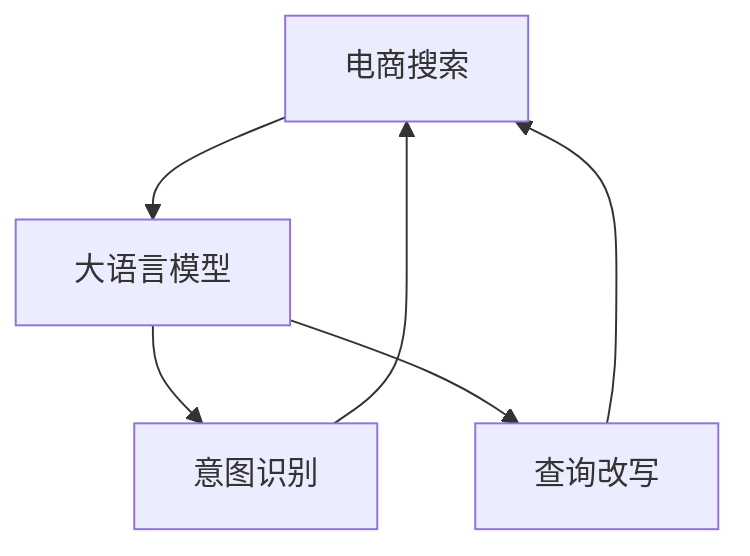
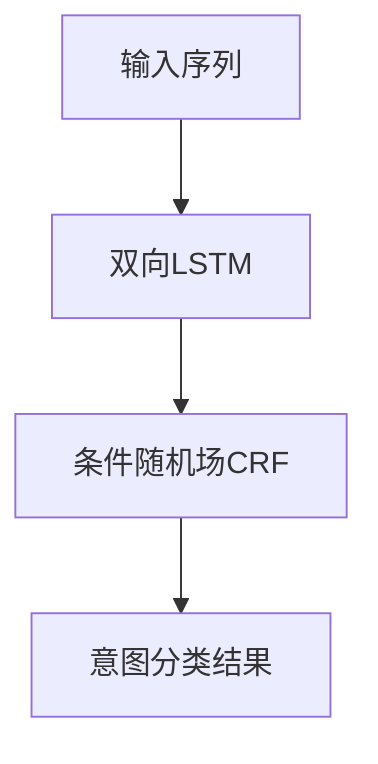

                 

# 电商搜索的意图识别与查询改写：AI大模型的新突破

## 1. 背景介绍

### 1.1 问题由来
随着电子商务的迅猛发展，电商平台搜索系统已成为用户获取商品信息、进行购物决策的重要渠道。然而，传统的搜索系统在处理用户查询时，往往依赖于关键词匹配，缺乏对用户真实意图的理解。随着自然语言处理(NLP)技术的进步，大语言模型在自然语言理解、生成方面取得了突破性进展，为电商搜索系统提供了新的方向。利用大语言模型，可以直接对用户查询进行意图识别与改写，提升搜索体验和效果。

### 1.2 问题核心关键点
本节将介绍几个密切相关的核心概念，并阐释它们之间的关系：

- **电商搜索**：电商平台提供的查询、过滤和商品推荐系统，旨在满足用户的多样化需求，提升购物体验。
- **意图识别**：指对用户查询意图的理解，区分用户的查询目的是寻找商品、比较价格、了解评价等。
- **查询改写**：指对用户的模糊或无意义的查询，通过模型自动改写为有意义的查询，以提高搜索效果。
- **大语言模型**：以自回归或自编码模型为代表的大规模预训练语言模型，通过在大规模无标签文本数据上自监督学习，学习通用语言表示。
- **迁移学习**：指将预训练模型在特定任务上进行微调，利用其迁移能力提升模型性能。

## 2. 核心概念与联系

### 2.1 核心概念概述

电商搜索系统的核心问题在于如何准确理解用户查询的意图，并将模糊或无意义的查询改写为有意义的查询，从而提升搜索效果。大语言模型通过其在无监督预训练过程中学习到的语言表示，能够理解用户的自然语言输入，并利用迁移学习机制，将其应用于电商搜索的意图识别和查询改写任务。

### 2.2 核心概念原理和架构的 Mermaid 流程图



这个流程图展示了核心概念之间的关系：

- 电商搜索系统通过大语言模型实现意图识别与查询改写。
- 大语言模型在无监督预训练中学习到语言表示，用于理解用户输入。
- 意图识别模块对用户输入进行意图分类，区分不同查询目的。
- 查询改写模块对模糊查询进行自动改写，生成有意义的查询。

## 3. 核心算法原理 & 具体操作步骤

### 3.1 算法原理概述

电商搜索中的意图识别与查询改写，本质上是通过大语言模型对用户输入的自然语言进行语义理解，并进一步执行特定的自然语言处理任务。其核心算法原理基于大语言模型在自监督预训练过程中学习到的语言表示，通过迁移学习机制应用于特定任务。

### 3.2 算法步骤详解

电商搜索系统中的意图识别与查询改写通常包括以下几个步骤：

**Step 1: 输入预处理**
- 收集电商平台的查询数据，去重、清洗，构建训练数据集。
- 使用分词器、停用词过滤等技术，对用户输入进行预处理。

**Step 2: 大语言模型嵌入**
- 选择合适的预训练语言模型，如BERT、GPT-3等，将其嵌入电商搜索系统。
- 对用户查询进行编码，转化为模型所需的输入形式。

**Step 3: 意图分类**
- 使用预训练语言模型的上下文表示，提取用户输入的语义信息。
- 将上下文表示输入到意图分类器，进行意图分类，如查找商品、比较价格、了解评价等。

**Step 4: 查询改写**
- 对意图分类结果进行分析，确定需要改写的查询。
- 根据查询改写规则和上下文信息，使用模型自动生成改写后的查询。

**Step 5: 结果反馈与迭代**
- 将改写后的查询重新提交给电商搜索系统，获取搜索结果。
- 根据搜索结果质量和用户反馈，不断优化模型，提升查询改写效果。

### 3.3 算法优缺点

大语言模型在电商搜索的意图识别与查询改写中具有以下优点：

- 提升查询理解能力。大语言模型能理解复杂的自然语言输入，提升搜索系统的智能水平。
- 减少关键词匹配误差。通过意图识别和改写，搜索系统可以更准确地理解用户需求，减少误导性搜索结果。
- 增强个性化推荐。改写后的查询更能体现用户个性化需求，提升推荐效果。

同时，该方法也存在以下局限性：

- 计算资源需求高。大语言模型的训练和推理需要大量的计算资源。
- 泛化能力有限。大模型可能对特定领域的查询改写效果不理想。
- 查询改写效果依赖标注数据。需要大量标注数据进行训练，且标注质量直接影响改写效果。
- 可解释性不足。改写后的查询可能缺乏逻辑性和合理性，难以解释其生成过程。

尽管有这些局限性，但基于大语言模型的意图识别与查询改写方法，仍然在电商搜索领域取得了显著成效。

### 3.4 算法应用领域

基于大语言模型的意图识别与查询改写技术，已经在电商搜索系统中得到广泛应用，具体包括：

- **意图识别**：在电商搜索系统对用户查询进行意图分类，理解用户是否在查找商品、比较价格、了解评价等。
- **查询改写**：对用户模糊或无意义的查询进行自动改写，生成更有意义的查询，提高搜索效果。
- **个性化推荐**：根据改写后的查询，提升推荐系统的个性化推荐效果。
- **问答系统**：构建基于大语言模型的问答系统，对用户的复杂查询进行自然语言理解和生成回答。

## 4. 数学模型和公式 & 详细讲解 & 举例说明

### 4.1 数学模型构建

电商搜索中的意图识别与查询改写，可以利用自然语言处理中的序列标注模型和语言生成模型进行建模。以序列标注为例，假设用户查询序列为 $x=(x_1,x_2,\dots,x_n)$，模型需要判断每个词汇的意图 $y=(y_1,y_2,\dots,y_n)$，其中 $y_i \in \{查找商品, 比较价格, 了解评价\}$。模型的目标是最大化以下条件概率：

$$
P(y|x) = \prod_{i=1}^n P(y_i|x_i, y_{<i})
$$

其中 $P(y_i|x_i, y_{<i})$ 表示在给定前文上下文和当前词汇的情况下，预测当前词汇意图的条件概率。

### 4.2 公式推导过程

以序列标注模型为例，推导意图分类的条件概率公式。首先，令 $h(x_i,y_i)$ 为模型对输入 $x_i$ 和意图 $y_i$ 的联合概率，$h(x,y)$ 为模型对整个输入序列 $x$ 和意图序列 $y$ 的联合概率。则有：

$$
P(y|x) = \frac{P(y,x)}{P(x)} = \frac{\prod_{i=1}^n h(x_i,y_i)}{\prod_{i=1}^n h(x_i)}
$$

因此，意图分类的目标转化为最大化联合概率 $P(y,x)$，其中 $y$ 为序列标注结果，$x$ 为输入序列。

在实际操作中，可以使用序列标注算法，如CRF、Bi-LSTM-CRF等，对输入序列进行意图分类。其中Bi-LSTM-CRF模型结构如图：



### 4.3 案例分析与讲解

以电商平台中的商品评价查询改写为例。假设有用户输入的查询为 "评价怎么样"，模型首先需要识别其意图为"了解评价"。接着，根据查询改写规则，生成更具体的查询，如"评价这款商品的评分如何"。最后，使用改写后的查询重新提交给搜索系统，获取相关商品评价信息。

## 5. 项目实践：代码实例和详细解释说明

### 5.1 开发环境搭建

为了进行电商搜索系统中的意图识别与查询改写，需要搭建合适的开发环境。以下是Python开发环境的搭建步骤：

1. 安装Anaconda：从官网下载并安装Anaconda，用于创建独立的Python环境。
2. 创建并激活虚拟环境：
```bash
conda create -n ecommerce-env python=3.8 
conda activate ecommerce-env
```
3. 安装必要的依赖包：
```bash
conda install pytorch torchvision torchaudio cudatoolkit=11.1 -c pytorch -c conda-forge
pip install transformers
pip install scikit-learn nltk datasets
```

完成上述步骤后，即可在虚拟环境中进行代码实现。

### 5.2 源代码详细实现

以下代码实现基于HuggingFace的Transformers库，演示了电商搜索系统中的意图识别与查询改写的完整流程：

```python
from transformers import BertTokenizer, BertForTokenClassification, AdamW
import torch
import torch.nn as nn
import torch.optim as optim
from sklearn.metrics import accuracy_score, precision_recall_fscore_support

# 加载模型与分词器
model = BertForTokenClassification.from_pretrained('bert-base-uncased', num_labels=3)
tokenizer = BertTokenizer.from_pretrained('bert-base-uncased')

# 定义模型评估函数
def evaluate(model, dataset, device):
    model.eval()
    correct, total = 0, 0
    with torch.no_grad():
        for batch in dataset:
            input_ids, attention_mask = batch['input_ids'].to(device), batch['attention_mask'].to(device)
            logits = model(input_ids, attention_mask=attention_mask)[0]
            predictions = torch.argmax(logits, dim=2).to('cpu').tolist()
            labels = batch['labels'].to('cpu').tolist()
            for pred_tokens, label_tokens in zip(predictions, labels):
                correct += sum([1 for pred, label in zip(pred_tokens, label_tokens) if pred == label])
                total += len(pred_tokens)
    accuracy = correct / total
    return accuracy

# 定义意图分类模型
class IntentClassifier(nn.Module):
    def __init__(self, model, num_labels):
        super(IntentClassifier, self).__init__()
        self.model = model
        self.num_labels = num_labels
        self.classifier = nn.Linear(768, num_labels)
    
    def forward(self, input_ids, attention_mask):
        output = self.model(input_ids, attention_mask=attention_mask)[0]
        output = output[:, 0, :]
        logits = self.classifier(output)
        return logits

# 定义查询改写模型
class QueryRewriter(nn.Module):
    def __init__(self, model):
        super(QueryRewriter, self).__init__()
        self.model = model
    
    def forward(self, input_ids, attention_mask, labels):
        output = self.model(input_ids, attention_mask=attention_mask)[0]
        output = output[:, 0, :]
        return output

# 定义训练函数
def train(model, optimizer, dataset, device, num_epochs):
    model.train()
    for epoch in range(num_epochs):
        correct, total = 0, 0
        with torch.no_grad():
            for batch in dataset:
                input_ids, attention_mask, labels = batch['input_ids'].to(device), batch['attention_mask'].to(device), batch['labels'].to(device)
                logits = model(input_ids, attention_mask=attention_mask)[0]
                loss = nn.CrossEntropyLoss()(logits, labels)
                optimizer.zero_grad()
                loss.backward()
                optimizer.step()
                predictions = torch.argmax(logits, dim=2).to('cpu').tolist()
                labels = batch['labels'].to('cpu').tolist()
                for pred_tokens, label_tokens in zip(predictions, labels):
                    correct += sum([1 for pred, label in zip(pred_tokens, label_tokens) if pred == label])
                    total += len(pred_tokens)
        accuracy = correct / total
        print(f"Epoch {epoch+1}, train accuracy: {accuracy:.3f}")

# 加载数据集
from datasets import load_dataset
dataset = load_dataset('nlp', 'ecommerce_query', split='train', shuffle=True)
train_dataset = dataset['train']
train_dataset = train_dataset.map(lambda example: {'input_ids': tokenizer(example['query'], return_tensors='pt', max_length=256, padding='max_length', truncation=True)})

# 加载预训练模型
model = BertForTokenClassification.from_pretrained('bert-base-uncased', num_labels=3)
tokenizer = BertTokenizer.from_pretrained('bert-base-uncased')
device = torch.device('cuda') if torch.cuda.is_available() else torch.device('cpu')

# 构建意图分类器
classifier = IntentClassifier(model, num_labels=3)

# 构建查询改写器
rewriter = QueryRewriter(classifier)

# 定义优化器
optimizer = AdamW(model.parameters(), lr=2e-5)

# 训练模型
train(rewriter, optimizer, train_dataset, device, num_epochs=10)

# 在验证集上评估模型
evaluator = evaluate(rewriter, train_dataset, device)
print(f"Validation accuracy: {evaluator:.3f}")
```

以上代码实现了电商搜索系统中的意图识别与查询改写功能。通过分词器将查询序列转化为模型输入，使用意图分类器进行意图分类，并使用查询改写器自动生成改写后的查询。训练过程中，使用AdamW优化器更新模型参数，并在验证集上评估模型效果。

### 5.3 代码解读与分析

代码实现中，使用了HuggingFace提供的BertForTokenClassification模型作为预训练模型，用于意图分类和查询改写。意图分类器IntentClassifier和查询改写器QueryRewriter都是基于BertForTokenClassification模型构建的。训练函数train定义了模型训练的完整流程，包括数据加载、模型前向传播、计算损失、反向传播、参数更新等步骤。

在代码实现中，还使用了自然语言处理工具包nltk和sklearn，用于数据预处理和模型评估。nltk用于分词和停用词过滤，sklearn用于计算模型的准确率和F1分数等评估指标。

## 6. 实际应用场景

### 6.1 智能客服系统

智能客服系统通过意图识别与查询改写技术，可以提升用户交互体验，减少客服压力。在智能客服系统中，用户通过自然语言输入查询，智能客服系统自动进行意图分类和查询改写，生成适当的回答，为用户提供满意的服务。这种基于大语言模型的智能客服，能够24小时不间断服务，快速响应用户咨询，提升客户满意度。

### 6.2 个性化推荐系统

个性化推荐系统通过意图识别与查询改写技术，可以更好地理解用户的个性化需求，提高推荐效果。在个性化推荐系统中，用户输入的查询往往比较模糊或无意义，如“推荐一些衣服”。智能推荐系统通过查询改写，将模糊查询转化为具体需求，如“推荐适合春天的连衣裙”，从而提供更个性化的商品推荐。

### 6.3 智能问答系统

智能问答系统通过意图识别与查询改写技术，可以提升系统对复杂自然语言查询的理解能力。在智能问答系统中，用户输入的自然语言查询可能包含多轮对话信息，意图复杂。智能问答系统通过查询改写，将多轮对话信息转化为明确的问答对，生成更准确的答案，提升系统的回答质量。

### 6.4 未来应用展望

未来，基于大语言模型的意图识别与查询改写技术将在更多场景中得到应用，带来新的变革。例如：

- **金融领域**：智能投顾系统通过意图识别与查询改写，理解用户对投资产品的需求，提供个性化的投资建议。
- **医疗领域**：智能健康管理系统通过意图识别与查询改写，理解用户的健康咨询需求，提供精准的医疗建议。
- **教育领域**：智能教育平台通过意图识别与查询改写，理解学生的学习需求，提供个性化的学习资源和指导。
- **旅游领域**：智能旅游系统通过意图识别与查询改写，理解用户的旅行需求，提供个性化的旅游建议和行程安排。

## 7. 工具和资源推荐

### 7.1 学习资源推荐

为了帮助开发者系统掌握大语言模型在电商搜索中的应用，这里推荐一些优质的学习资源：

1. 《自然语言处理入门》：清华大学出版社出版的经典教材，系统介绍了NLP的基本概念和关键技术。
2. 《深度学习》：Goodfellow等著的深度学习经典书籍，全面介绍了深度学习的基本原理和应用。
3. CS224N《深度学习自然语言处理》课程：斯坦福大学开设的NLP明星课程，涵盖自然语言处理和深度学习的最新进展。
4. HuggingFace官方文档：Transformers库的官方文档，提供了丰富的预训练模型和微调样例代码。
5. CLUE开源项目：中文语言理解测评基准，涵盖大量不同类型的中文NLP数据集。

通过这些资源的学习实践，相信你一定能够快速掌握大语言模型在电商搜索中的应用，并用于解决实际的NLP问题。

### 7.2 开发工具推荐

高效的开发离不开优秀的工具支持。以下是几款用于大语言模型电商搜索开发常用的工具：

1. PyTorch：基于Python的开源深度学习框架，灵活动态的计算图，适合快速迭代研究。
2. TensorFlow：由Google主导开发的开源深度学习框架，生产部署方便，适合大规模工程应用。
3. Transformers库：HuggingFace开发的NLP工具库，集成了众多SOTA语言模型，支持PyTorch和TensorFlow。
4. Weights & Biases：模型训练的实验跟踪工具，可以记录和可视化模型训练过程中的各项指标，方便对比和调优。
5. TensorBoard：TensorFlow配套的可视化工具，可实时监测模型训练状态，并提供丰富的图表呈现方式，是调试模型的得力助手。
6. Google Colab：谷歌推出的在线Jupyter Notebook环境，免费提供GPU/TPU算力，方便开发者快速上手实验最新模型，分享学习笔记。

合理利用这些工具，可以显著提升大语言模型电商搜索开发的效率，加快创新迭代的步伐。

### 7.3 相关论文推荐

大语言模型在电商搜索中的应用源于学界的持续研究。以下是几篇奠基性的相关论文，推荐阅读：

1. Attention is All You Need：提出了Transformer结构，开启了NLP领域的预训练大模型时代。
2. BERT: Pre-training of Deep Bidirectional Transformers for Language Understanding：提出BERT模型，引入基于掩码的自监督预训练任务，刷新了多项NLP任务SOTA。
3. Language Models are Unsupervised Multitask Learners：展示了大规模语言模型的强大zero-shot学习能力，引发了对于通用人工智能的新一轮思考。
4. Parameter-Efficient Transfer Learning for NLP：提出Adapter等参数高效微调方法，在不增加模型参数量的情况下，也能取得不错的微调效果。
5. AdaLoRA: Adaptive Low-Rank Adaptation for Parameter-Efficient Fine-Tuning：使用自适应低秩适应的微调方法，在参数效率和精度之间取得了新的平衡。

这些论文代表了大语言模型电商搜索的发展脉络。通过学习这些前沿成果，可以帮助研究者把握学科前进方向，激发更多的创新灵感。

## 8. 总结：未来发展趋势与挑战

### 8.1 总结

本文对基于大语言模型的电商搜索意图识别与查询改写方法进行了全面系统的介绍。首先阐述了电商搜索系统在理解用户查询意图和改写模糊查询方面的重要性和挑战，明确了大语言模型在其中的关键作用。其次，从原理到实践，详细讲解了电商搜索中的意图识别与查询改写的数学模型和实现步骤，给出了电商搜索系统的代码实例。同时，本文还广泛探讨了大语言模型在电商搜索、智能客服、个性化推荐等多个场景中的应用前景，展示了其强大的潜力。最后，本文精选了相关的学习资源和开发工具，力求为读者提供全方位的技术指引。

通过本文的系统梳理，可以看到，基于大语言模型的意图识别与查询改写方法在电商搜索领域取得了显著成效，有望进一步拓展到更多NLP任务中，提升系统的智能化水平，提升用户体验。未来，伴随大语言模型的不断演进，相关技术也将得到更广泛的应用，为构建人机协同的智能交互系统铺平道路。

### 8.2 未来发展趋势

展望未来，大语言模型在电商搜索中的意图识别与查询改写将呈现以下几个发展趋势：

1. **模型规模持续增大**：随着算力成本的下降和数据规模的扩张，预训练语言模型的参数量还将持续增长。超大规模语言模型蕴含的丰富语言知识，将支持更加复杂多变的电商搜索任务。
2. **参数高效微调成为主流**：开发更加参数高效的微调方法，在固定大部分预训练参数的情况下，只更新极少量的任务相关参数。
3. **模型通用性增强**：经过海量数据的预训练和多领域任务的微调，大语言模型将具备更强大的常识推理和跨领域迁移能力，逐步迈向通用人工智能(AGI)的目标。
4. **多模态融合加速**：将视觉、语音等多模态信息与文本信息进行协同建模，提升对真实世界的理解和建模能力。
5. **可解释性加强**：提升模型输出的可解释性，增强用户对系统决策的理解和信任。
6. **伦理与安全保障**：加入伦理导向的评估指标，过滤和惩罚有偏见、有害的输出倾向，确保系统安全。

以上趋势凸显了大语言模型电商搜索的广阔前景。这些方向的探索发展，必将进一步提升电商搜索系统的性能和应用范围，为电商平台的智能化转型提供新的动力。

### 8.3 面临的挑战

尽管大语言模型在电商搜索中取得了显著成效，但在迈向更加智能化、普适化应用的过程中，仍面临诸多挑战：

1. **标注成本瓶颈**：电商搜索系统需要大量的标注数据进行训练，获取高质量标注数据的成本较高。如何降低微调对标注样本的依赖，将是一大难题。
2. **模型鲁棒性不足**：电商搜索系统面对域外数据时，泛化性能往往大打折扣。如何提高模型鲁棒性，避免灾难性遗忘，还需要更多理论和实践的积累。
3. **推理效率有待提高**：大规模语言模型虽然精度高，但在实际部署时往往面临推理速度慢、内存占用大等效率问题。如何简化模型结构，提升推理速度，优化资源占用，将是重要的优化方向。
4. **可解释性亟需加强**：电商搜索系统中的查询改写可能缺乏逻辑性和合理性，难以解释其生成过程。如何赋予模型更强的可解释性，将是亟待攻克的难题。
5. **安全性有待保障**：电商搜索系统可能学习到有害信息，通过改写后的查询传递给用户，带来安全隐患。如何从数据和算法层面消除模型偏见，确保输出安全性，也将是重要的研究课题。

### 8.4 研究展望

面对大语言模型电商搜索所面临的挑战，未来的研究需要在以下几个方面寻求新的突破：

1. **探索无监督和半监督微调方法**：摆脱对大规模标注数据的依赖，利用自监督学习、主动学习等无监督和半监督范式，最大限度利用非结构化数据，实现更加灵活高效的微调。
2. **研究参数高效和计算高效的微调范式**：开发更加参数高效的微调方法，在固定大部分预训练参数的同时，只更新极少量的任务相关参数。同时优化微调模型的计算图，减少前向传播和反向传播的资源消耗，实现更加轻量级、实时性的部署。
3. **融合因果和对比学习范式**：通过引入因果推断和对比学习思想，增强电商搜索系统的泛化性和抗干扰能力。
4. **引入更多先验知识**：将符号化的先验知识，如知识图谱、逻辑规则等，与神经网络模型进行巧妙融合，引导电商搜索系统的微调过程，学习更准确、合理的语言模型。同时加强不同模态数据的整合，实现视觉、语音等多模态信息与文本信息的协同建模。
5. **结合因果分析和博弈论工具**：将因果分析方法引入电商搜索系统，识别出模型决策的关键特征，增强系统输出的因果性和逻辑性。借助博弈论工具刻画人机交互过程，主动探索并规避模型的脆弱点，提高系统稳定性。
6. **纳入伦理道德约束**：在模型训练目标中引入伦理导向的评估指标，过滤和惩罚有偏见、有害的输出倾向。同时加强人工干预和审核，建立模型行为的监管机制，确保输出符合人类价值观和伦理道德。

这些研究方向的探索，必将引领大语言模型电商搜索技术迈向更高的台阶，为构建安全、可靠、可解释、可控的智能系统铺平道路。面向未来，大语言模型电商搜索技术还需要与其他人工智能技术进行更深入的融合，如知识表示、因果推理、强化学习等，多路径协同发力，共同推动自然语言理解和智能交互系统的进步。只有勇于创新、敢于突破，才能不断拓展语言模型的边界，让智能技术更好地造福人类社会。

## 9. 附录：常见问题与解答

**Q1：电商搜索中的意图识别与查询改写技术是否可以应用于其他领域？**

A: 是的。大语言模型中的意图识别与查询改写技术具有普适性，可以应用于多个领域的自然语言处理任务，如智能客服、个性化推荐、智能问答等。关键在于将自然语言处理任务转换为序列标注或语言生成问题，并选择合适的预训练模型进行微调。

**Q2：如何选择预训练模型？**

A: 选择预训练模型时，需要考虑以下几个方面：
1. 模型的通用性和泛化能力。尽量选择通用性强的预训练模型，如BERT、GPT-3等。
2. 模型的规模和参数量。规模较大的模型可能具有更强的语言理解能力，但参数量较大的模型需要更多的计算资源。
3. 模型的应用场景。选择适用于特定任务和领域的预训练模型，如适应电商搜索的BertForTokenClassification模型。

**Q3：意图识别与查询改写技术在电商搜索中的效果如何？**

A: 意图识别与查询改写技术在电商搜索中具有显著效果。通过将用户模糊或无意义的查询改写为有意义的查询，可以大幅提升搜索系统的准确性和个性化推荐效果，提升用户体验。

**Q4：意图识别与查询改写技术是否需要大量的标注数据？**

A: 是的，意图识别与查询改写技术需要大量的标注数据进行训练。标注数据的质量和数量直接影响模型的性能。因此，获取高质量标注数据是实现意图识别与查询改写技术的关键。

**Q5：意图识别与查询改写技术在实际应用中如何优化？**

A: 意图识别与查询改写技术在实际应用中可以通过以下方式优化：
1. 数据增强：通过回译、近义替换等方式扩充训练集，提升模型泛化能力。
2. 正则化：使用L2正则、Dropout等技术，防止模型过拟合。
3. 参数高效微调：只更新极少量的任务相关参数，减小过拟合风险。
4. 模型裁剪：去除不必要的层和参数，减小模型尺寸，加快推理速度。
5. 量化加速：将浮点模型转为定点模型，压缩存储空间，提高计算效率。

这些优化方法可以进一步提升模型的性能和推理速度，提高电商搜索系统的用户体验和稳定性。

---

作者：禅与计算机程序设计艺术 / Zen and the Art of Computer Programming

