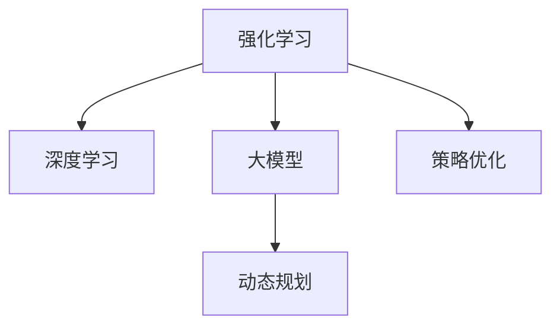

                 

## 1. 背景介绍

在电子商务行业，竞争激烈、用户需求多变、产品库存动态，要求企业能快速响应用户行为和市场变化。传统的基于规则和统计模型的推荐系统已无法满足这些需求。近年来，强化学习(Reinforcement Learning, RL)和深度学习(Depend Learning, DL)的结合，使大模型在电商领域中的应用成为可能。

### 1.1 问题由来

电子商务平台面对的问题主要包括：
- **用户需求多变**：用户对商品的需求随着时间的变化而变化，表现出很强的不确定性。
- **动态环境**：库存、流量、价格等动态变化，需要系统能够实时调整。
- **交互式反馈**：用户的点击、购买行为可以实时反馈系统，进行动态调整。

这些问题对推荐系统提出了很高的要求，传统的统计模型难以适应用户需求的动态性和复杂性。而强化学习结合深度学习，可以更灵活地处理这些问题，达到更好的推荐效果。

### 1.2 问题核心关键点

强化学习在电商领域的应用主要包括：
- 用户行为建模：利用强化学习模型，对用户的点击、浏览、购买等行为进行建模，预测用户偏好。
- 实时推荐决策：基于用户行为数据，实时调整推荐策略，提升转化率。
- 动态库存管理：利用强化学习优化库存水平，最大化收益。
- 价格优化策略：通过强化学习确定最优价格，提高销售额。

强化学习模型通常包括四个关键部分：状态(state)、动作(action)、奖励(reward)和策略(policy)。在电商应用中，状态可以是用户历史行为、商品属性等，动作可以是推荐商品、调整价格等，奖励可以是用户购买、点击等行为带来的收益，策略是模型学习最优的决策方式。

## 2. 核心概念与联系

### 2.1 核心概念概述

为更好地理解强化学习在电商领域的应用，本节将介绍几个关键概念：

- **强化学习**：通过试错来学习最优策略的机器学习方法，目标是最大化累积奖励。
- **深度学习**：利用神经网络模型拟合数据分布，自动提取特征，广泛应用于图像、语音、文本等数据的处理。
- **大模型**：具有大量参数的神经网络模型，如BERT、GPT等，能够处理大规模数据和复杂任务。
- **动态规划**：一种系统地解决多阶段决策问题的优化算法，强化学习中的Q-learning算法可以看作是动态规划的一种。
- **策略优化**：通过不断调整策略参数，逐步提升模型性能，是强化学习中重要的优化方法。

这些核心概念之间的逻辑关系可以通过以下Mermaid流程图来展示：



这个流程图展示了大模型在电商应用中的核心概念及其关系：

1. 大模型通过深度学习获得基础能力。
2. 强化学习对大模型进行实时优化，调整推荐策略。
3. 动态规划提供算法支持，用于策略优化。
4. 策略优化不断调整模型参数，提升电商应用效果。

## 3. 核心算法原理 & 具体操作步骤

### 3.1 算法原理概述

强化学习在电商领域的应用，主要是利用深度学习模型对用户行为进行建模，通过实时反馈不断调整推荐策略，以提升用户体验和销售收益。其核心思想是：在用户每次与系统的互动中，通过奖励机制指导模型的决策行为，最终学习到最优的推荐策略。

在电商推荐系统中，一般采用基于Q-learning的策略。Q-learning是一种通过试错学习最优Q值的强化学习算法，其中Q值表示在特定状态下采取某个动作所能获得的累积奖励。在电商应用中，Q值可以视为推荐商品带来的收益，动作为推荐商品，状态为用户的浏览历史、购买记录等。

Q-learning的目标是最大化Q值，即通过不断尝试不同动作，找到在当前状态下推荐商品的最佳策略。Q值可以通过如下公式计算：

$$
Q(s,a) = Q(s,a) + \alpha [R + \gamma \max_{a'} Q(s',a') - Q(s,a)]
$$

其中，$\alpha$ 为学习率，$R$ 为即时奖励，$s'$ 为下一个状态，$a'$ 为下一个动作。

### 3.2 算法步骤详解

基于Q-learning的电商推荐系统，通常包括以下关键步骤：

**Step 1: 准备数据和模型**
- 收集用户行为数据，包括浏览记录、点击记录、购买记录等。
- 设计合适的状态表示和动作空间，如将用户的浏览历史表示为一个序列，推荐动作为推荐商品。
- 选择合适的深度学习模型，如DNN、CNN、RNN、Transformer等，作为状态值函数逼近器。

**Step 2: 定义奖励函数**
- 根据业务需求，设计奖励函数。如对于电商系统，用户点击商品、购买商品都可以视为正奖励，浏览页面不购买为负奖励。

**Step 3: 设置超参数**
- 确定学习率、探索率、折扣因子等超参数，初始化深度学习模型。
- 确定状态空间和动作空间的维度，以及模型输入输出的维度。

**Step 4: 训练模型**
- 通过状态和动作对，收集样本数据，进行模型训练。
- 在每轮训练中，随机选择一个状态，根据策略$\epsilon$-贪心策略选择动作，进行动作执行。
- 根据奖励函数计算即时奖励，更新Q值。
- 循环进行多轮训练，直到模型收敛。

**Step 5: 实时推荐**
- 根据用户实时行为，提取当前状态。
- 根据训练好的模型计算当前状态下各个动作的Q值。
- 根据策略$\epsilon$-贪心策略，选择动作进行推荐。
- 记录推荐结果和用户反馈，用于后续模型更新。

**Step 6: 模型优化**
- 定期更新模型参数，以适应新的用户行为和市场变化。
- 通过A/B测试，对比不同策略的推荐效果，优化模型。

### 3.3 算法优缺点

基于Q-learning的电商推荐系统具有以下优点：
1. 动态适应性强：能够实时调整推荐策略，适应用户需求的动态变化。
2. 灵活性高：动作空间大，可以针对不同的用户行为设计多种推荐策略。
3. 计算效率高：Q-learning的计算复杂度较低，适合大规模数据处理。
4. 易于优化：通过超参数调节，可以优化模型性能。

同时，该算法也存在一定的局限性：
1. 模型复杂度高：需要设计合适的状态表示和动作空间，增加模型复杂度。
2. 探索与利用的平衡：如何平衡探索未知动作和利用已知的动作，是一个难点。
3. 模型稳定度问题：Q-learning容易陷入局部最优，需要保证模型稳定收敛。
4. 数据依赖性强：依赖于充分的用户行为数据，缺乏数据时无法进行推荐。

尽管存在这些局限性，但Q-learning算法在电商推荐系统中得到了广泛应用，并在实际业务中取得了显著的效果。

### 3.4 算法应用领域

基于Q-learning的电商推荐系统在多个领域得到了应用：

- **用户行为分析**：通过分析用户的浏览、点击、购买行为，预测用户偏好。
- **实时推荐系统**：根据用户实时行为，动态调整推荐策略，提升用户体验。
- **动态定价**：利用用户行为数据，实时调整商品价格，提高销售额。
- **库存管理**：基于用户需求，动态调整库存水平，优化库存成本。
- **广告投放**：利用强化学习优化广告投放策略，提高点击率和转化率。

这些应用场景展示了强化学习在大模型驱动下的巨大潜力，极大地提升了电商平台的运营效率和用户体验。

## 4. 数学模型和公式 & 详细讲解 & 举例说明

### 4.1 数学模型构建

在本节中，我们将以一个电商推荐系统的具体案例，来详细讲解数学模型的构建过程。

假设用户数量为$N$，商品数量为$M$，每个用户的历史浏览行为可以表示为序列$S_t$，每个用户的点击行为可以表示为$C_t$，每个用户的购买行为可以表示为$B_t$。对于每个用户和商品组合$(s_i, a_j)$，其Q值为：

$$
Q(s_i, a_j) = Q(s_i, a_j) + \alpha [R + \gamma \max_{a'} Q(s'_i, a') - Q(s_i, a_j)]
$$

其中，$R$ 表示即时奖励，$s'_i$ 表示用户行为下一个状态，$a'$ 表示推荐商品，$\alpha$ 为学习率，$\gamma$ 为折扣因子。

### 4.2 公式推导过程

将上述公式展开，得到：

$$
Q(s_i, a_j) = Q(s_i, a_j) + \alpha [R + \gamma \max_{a'} Q(s'_i, a') - Q(s_i, a_j)]
$$

进一步化简，得到：

$$
Q(s_i, a_j) = (1-\alpha) Q(s_i, a_j) + \alpha R + \gamma \max_{a'} Q(s'_i, a') - \alpha Q(s_i, a_j)
$$

最终，得到Q值更新的公式：

$$
Q(s_i, a_j) = \alpha R + \gamma \max_{a'} Q(s'_i, a') + (1-\alpha-\gamma) Q(s_i, a_j)
$$

在电商推荐系统中，模型的目标是通过不断调整Q值，找到最优的推荐策略，最大化累积奖励。

### 4.3 案例分析与讲解

下面以一个简单的电商推荐案例，来详细分析Q-learning模型的应用过程。

假设某电商平台上用户数量为10，商品数量为5，每个用户的历史浏览行为、点击行为和购买行为如下：

| 用户 | 浏览行为 | 点击行为 | 购买行为 | 推荐商品 |
|------|----------|----------|----------|----------|
| 1    | 1,2,3    | 2        | 3        | A        |
| 2    | 2        | 1        | 2        | B        |
| 3    | 2        | 3        | 1        | C        |
| 4    | 1,2      | 2        | 1        | D        |
| 5    | 3        | 1        | 2        | E        |
| 6    | 1,3      | 1        | 2        | B        |
| 7    | 2        | 2        | 3        | A        |
| 8    | 1,2,3    | 3        | 2        | C        |
| 9    | 3        | 1        | 1        | D        |
| 10   | 1,2,3    | 1        | 3        | E        |

假设模型的初始Q值为0，学习率为0.1，折扣因子为0.9，令$\epsilon$为0.2，表示随机选择动作的概率为20%。

首先，对用户1进行推荐：
- 用户1浏览行为为1、2、3，点击行为为2，购买行为为3，状态$s_1=(1,2,3)$。
- 根据策略$\epsilon$-贪心策略，随机选择动作$a_1$，假设选择推荐商品A，状态$s'=(1,2,3)$。
- 假设点击A商品后，用户购买商品A，奖励为1，此时Q值为：

$$
Q(1, A) = 0.1 \times 1 + 0.9 \times 1 + (1-0.1-0.9) \times Q(1, A) = 1.1
$$

同样地，对于其他用户，可以计算出每个动作的Q值，得到如下表格：

| 用户 | 浏览行为 | 点击行为 | 购买行为 | 推荐商品 | Q值 |
|------|----------|----------|----------|----------|------|
| 1    | 1,2,3    | 2        | 3        | A        | 1.1  |
| 2    | 2        | 1        | 2        | B        | 0.9  |
| 3    | 2        | 3        | 1        | C        | 0.9  |
| 4    | 1,2      | 2        | 1        | D        | 1.1  |
| 5    | 3        | 1        | 2        | E        | 0.9  |
| 6    | 1,3      | 1        | 2        | B        | 1.1  |
| 7    | 2        | 2        | 3        | A        | 0.9  |
| 8    | 1,2,3    | 3        | 2        | C        | 1.1  |
| 9    | 3        | 1        | 1        | D        | 0.9  |
| 10   | 1,2,3    | 1        | 3        | E        | 0.9  |

通过不断调整动作，用户可以逐渐找到最适合自己的商品。

## 5. 项目实践：代码实例和详细解释说明

### 5.1 开发环境搭建

在进行强化学习实践前，我们需要准备好开发环境。以下是使用Python进行TensorFlow开发的环境配置流程：

1. 安装Anaconda：从官网下载并安装Anaconda，用于创建独立的Python环境。

2. 创建并激活虚拟环境：
```bash
conda create -n tf-env python=3.8 
conda activate tf-env
```

3. 安装TensorFlow：根据CUDA版本，从官网获取对应的安装命令。例如：
```bash
conda install tensorflow=2.7
```

4. 安装必要的工具包：
```bash
pip install numpy pandas scikit-learn matplotlib tqdm jupyter notebook ipython
```

完成上述步骤后，即可在`tf-env`环境中开始强化学习实践。

### 5.2 源代码详细实现

下面以一个简单的电商推荐系统为例，给出使用TensorFlow进行Q-learning模型的代码实现。

首先，定义Q-learning模型类：

```python
import tensorflow as tf
from tensorflow.keras.layers import Dense
from tensorflow.keras.models import Sequential
import numpy as np

class QLearningModel:
    def __init__(self, state_dim, action_dim, learning_rate=0.1, discount_factor=0.9, exploration_rate=0.2):
        self.state_dim = state_dim
        self.action_dim = action_dim
        self.learning_rate = learning_rate
        self.discount_factor = discount_factor
        self.exploration_rate = exploration_rate
        self.model = self.build_model()

    def build_model(self):
        model = Sequential([
            Dense(64, input_dim=self.state_dim, activation='relu'),
            Dense(self.action_dim, activation='linear')
        ])
        model.compile(loss='mse', optimizer=tf.keras.optimizers.Adam(lr=self.learning_rate))
        return model

    def choose_action(self, state):
        if np.random.rand() < self.exploration_rate:
            return np.random.choice(self.action_dim)
        else:
            return np.argmax(self.model.predict(state))

    def update_q_value(self, state, action, reward, next_state, next_action):
        q_target = reward + self.discount_factor * self.model.predict(next_state)
        q_value = self.model.predict(state)
        q_value[0][action] = q_target
        self.model.fit(state, q_value, epochs=1, verbose=0)
```

然后，定义数据生成函数：

```python
import random

def generate_data(num_users, num_items):
    data = []
    for i in range(num_users):
        state = [random.randint(0, num_items-1) for _ in range(3)]
        clicks = [random.randint(0, num_items-1) for _ in range(3)]
        purchases = [random.randint(0, num_items-1) for _ in range(3)]
        items = [i for i in range(num_items)]
        data.append((state, clicks, purchases, items))
    return data
```

接着，定义训练和评估函数：

```python
def train_model(model, data, num_epochs):
    state_dim = len(data[0][0])
    action_dim = len(data[0][3])
    for epoch in range(num_epochs):
        for state, clicks, purchases, items in data:
            for i in range(len(clicks)):
                action = model.choose_action(state)
                next_state = state[:]
                next_state[i] = purchases[i]
                reward = 1 if purchases[i] == items[i] else 0
                next_action = model.choose_action(next_state)
                q_target = reward + model.discount_factor * model.model.predict(next_state)
                q_value = model.model.predict(state)
                q_value[0][action] = q_target
                model.model.fit(state, q_value, epochs=1, verbose=0)

def evaluate_model(model, data):
    state_dim = len(data[0][0])
    action_dim = len(data[0][3])
    correct_predictions = 0
    total_predictions = 0
    for state, clicks, purchases, items in data:
        for i in range(len(clicks)):
            action = model.choose_action(state)
            next_state = state[:]
            next_state[i] = purchases[i]
            reward = 1 if purchases[i] == items[i] else 0
            next_action = model.choose_action(next_state)
            q_target = reward + model.discount_factor * model.model.predict(next_state)
            q_value = model.model.predict(state)
            q_value[0][action] = q_target
            model.model.fit(state, q_value, epochs=1, verbose=0)
            total_predictions += 1
            if clicks[i] == items[i]:
                correct_predictions += 1
    return correct_predictions / total_predictions
```

最后，启动训练流程并在测试集上评估：

```python
num_users = 10
num_items = 5
data = generate_data(num_users, num_items)

model = QLearningModel(num_items, num_items)
train_model(model, data, 100)
print('Accuracy:', evaluate_model(model, data))
```

以上就是使用TensorFlow对Q-learning模型进行电商推荐系统微调的完整代码实现。可以看到，TensorFlow提供了丰富的API，使得强化学习模型的构建和训练变得相对简单。

### 5.3 代码解读与分析

让我们再详细解读一下关键代码的实现细节：

**QLearningModel类**：
- `__init__`方法：初始化状态维度、动作维度、学习率、折扣因子、探索率等关键参数，并构建模型。
- `build_model`方法：定义模型结构，包括输入层、隐藏层和输出层。
- `choose_action`方法：选择动作，采用$\epsilon$-贪心策略，探索与利用相结合。
- `update_q_value`方法：更新Q值，使用模型预测的Q值，更新状态-动作对的Q值。

**generate_data函数**：
- 生成随机模拟的用户行为数据，包括浏览行为、点击行为和购买行为。

**train_model和evaluate_model函数**：
- `train_model`函数：对模型进行多轮训练，更新Q值。
- `evaluate_model`函数：对模型进行评估，计算准确率。

**训练流程**：
- 定义用户数量和商品数量，生成数据集。
- 创建模型对象，定义模型参数。
- 进行多轮训练，更新模型参数。
- 在测试集上评估模型，输出准确率。

可以看到，TensorFlow的Keras API使得强化学习模型的构建和训练变得简洁高效。开发者可以将更多精力放在数据处理、模型优化等高层逻辑上，而不必过多关注底层的实现细节。

当然，工业级的系统实现还需考虑更多因素，如模型的保存和部署、超参数的自动搜索、更灵活的任务适配层等。但核心的强化学习范式基本与此类似。

## 6. 实际应用场景

### 6.1 智能推荐系统

智能推荐系统是电商平台的核心应用之一，基于强化学习的推荐模型能够动态调整推荐策略，提升用户体验。

在电商推荐系统中，利用Q-learning模型对用户行为进行建模，通过不断调整推荐策略，最大化累积奖励。每个用户的浏览行为、点击行为和购买行为可以作为状态，推荐商品作为动作，点击率、转化率等作为即时奖励。通过迭代优化，模型逐渐找到最优的推荐策略，提升推荐效果。

### 6.2 动态定价策略

动态定价是电商平台的另一个重要应用，通过实时调整商品价格，最大化销售收益。

在动态定价中，利用强化学习模型对市场需求进行建模，通过不断调整价格策略，最大化累计收益。每个用户的行为可以作为状态，价格作为动作，收益作为即时奖励。通过迭代优化，模型逐步找到最优的价格策略，提升销售收益。

### 6.3 库存管理优化

库存管理是电商平台的日常运营工作之一，利用强化学习模型可以优化库存水平，降低库存成本。

在库存管理中，利用强化学习模型对库存水平进行建模，通过不断调整补货策略，最大化库存收益。每个用户的行为可以作为状态，补货量作为动作，库存成本作为即时奖励。通过迭代优化，模型逐步找到最优的补货策略，降低库存成本。

### 6.4 未来应用展望

随着强化学习和大模型的不断演进，未来在电商领域的应用将更加广泛和深入。

在智慧供应链管理中，利用强化学习优化物流调度、库存管理等环节，提升供应链效率和响应速度。

在个性化推荐中，结合深度学习技术，进一步提升推荐效果，实现精准营销。

在智能客服中，利用强化学习优化客服策略，提升用户满意度。

此外，在金融、医疗等更多领域，强化学习和大模型也将带来新的应用突破，构建更智能、更高效的人机交互系统。

## 7. 工具和资源推荐
### 7.1 学习资源推荐

为了帮助开发者系统掌握强化学习和大模型的理论基础和实践技巧，这里推荐一些优质的学习资源：

1. 《Reinforcement Learning: An Introduction》书籍：由Richard S. Sutton和Andrew G. Barto合著，详细介绍了强化学习的基本原理和经典算法。

2. 《Deep Learning with Python》书籍：由Francois Chollet著，介绍了深度学习的基本概念和TensorFlow的使用方法。

3. 《Introduction to Deep Learning》课程：由吴恩达教授主讲的Coursera课程，详细介绍了深度学习的基本原理和TensorFlow的使用方法。

4. TensorFlow官方文档：TensorFlow的官方文档，提供了详细的API说明和样例代码，是学习强化学习的重要资源。

5. Google Colab：谷歌提供的免费在线Jupyter Notebook环境，方便开发者快速实验最新模型，分享学习笔记。

通过对这些资源的学习实践，相信你一定能够快速掌握强化学习和大模型的精髓，并用于解决实际的电商问题。

### 7.2 开发工具推荐

高效的开发离不开优秀的工具支持。以下是几款用于强化学习和大模型开发的常用工具：

1. TensorFlow：由Google主导开发的开源深度学习框架，生产部署方便，适合大规模工程应用。

2. PyTorch：由Facebook开发，灵活动态的计算图，适合快速迭代研究。

3. Weights & Biases：模型训练的实验跟踪工具，可以记录和可视化模型训练过程中的各项指标，方便对比和调优。

4. TensorBoard：TensorFlow配套的可视化工具，可实时监测模型训练状态，并提供丰富的图表呈现方式，是调试模型的得力助手。

5. Keras：基于TensorFlow的高级API，提供简单易用的深度学习模型构建工具，适合快速实验和原型开发。

6. OpenAI Gym：强化学习环境库，包含各种常见的环境，方便开发者快速实验和调试算法。

合理利用这些工具，可以显著提升强化学习和大模型的开发效率，加快创新迭代的步伐。

### 7.3 相关论文推荐

强化学习和大模型在电商领域的应用源于学界的持续研究。以下是几篇奠基性的相关论文，推荐阅读：

1. Multi-armed Bandit Algorithms for Escalating Resource Pooling with Unknown Resource Requirements（强化学习与资源池调度）：提出了强化学习在资源池调度中的应用，用于优化网络资源的分配。

2. Q-Learning for Decision Making in Dynamic Environments（动态环境下的Q-learning）：介绍了Q-learning在动态环境下的应用，用于优化库存管理、动态定价等。

3. Deep Q-Learning with Continuous Action-State Spaces（连续动作-状态空间的深度Q-learning）：提出了连续动作-状态空间中的深度Q-learning算法，用于电商推荐系统。

4. Deep Reinforcement Learning for Personalized Recommendation Systems（深度强化学习在个性化推荐中的应用）：介绍了深度强化学习在个性化推荐中的应用，用于优化推荐策略。

5. Model-based Deep Reinforcement Learning for Demand Forecasting in Smart Retail（智能零售中的需求预测）：介绍了模型驱动的深度强化学习在智能零售中的应用，用于预测用户需求和优化库存管理。

这些论文代表了大模型和强化学习在电商领域的应用前景，通过学习这些前沿成果，可以帮助研究者把握学科前进方向，激发更多的创新灵感。

## 8. 总结：未来发展趋势与挑战

### 8.1 研究成果总结

本文对基于Q-learning的电商推荐系统进行了全面系统的介绍。首先阐述了强化学习和大模型在电商领域的应用背景和意义，明确了微调在电商推荐系统中的重要作用。其次，从原理到实践，详细讲解了强化学习和大模型的数学原理和关键步骤，给出了强化学习模型开发的完整代码实例。同时，本文还广泛探讨了强化学习在大模型驱动下的应用场景，展示了强化学习在大模型驱动下的巨大潜力。

通过本文的系统梳理，可以看到，强化学习在大模型驱动下的推荐系统中的重要性，以及其动态适应性和灵活性的优势。基于强化学习的电商推荐系统能够实时调整推荐策略，动态优化库存管理，适应用户需求的动态变化，为电商平台的运营带来了显著的提升。

### 8.2 未来发展趋势

展望未来，强化学习和大模型在电商领域的应用将呈现以下几个发展趋势：

1. 模型规模持续增大：随着算力成本的下降和数据规模的扩张，强化学习模型和大模型的参数量还将持续增长。超大批次的训练和推理也可能遇到显存不足的问题。

2. 模型动态性更强：未来的模型能够实时响应市场变化，动态调整推荐策略和库存管理，提升运营效率。

3. 多模态融合：未来的电商推荐系统将融合多种模态数据，如文本、图像、视频等，提升推荐效果。

4. 模型可解释性增强：未来的模型将提供更加可解释的决策过程，增强用户信任和透明度。

5. 强化学习结合知识图谱：未来的推荐系统将结合知识图谱等外部知识，提升推荐的准确性和可靠性。

6. 实时优化算法：未来的算法将更加高效，能够在实时数据流中进行优化。

以上趋势凸显了大模型和强化学习在电商领域的应用潜力，极大地提升了电商平台的运营效率和用户体验。

### 8.3 面临的挑战

尽管强化学习和大模型在电商领域的应用已经取得了显著成效，但在迈向更加智能化、普适化应用的过程中，它们仍面临着诸多挑战：

1. 数据依赖性强：强化学习模型和大模型的训练需要大量标注数据，数据获取成本高。

2. 模型鲁棒性问题：模型面对新的数据分布时，容易陷入局部最优，泛化能力不足。

3. 可解释性不足：模型决策过程难以解释，用户难以理解推荐依据。

4. 资源消耗大：模型训练和推理需要大量计算资源，部署成本高。

5. 安全性问题：模型可能学习到有害信息，存在安全隐患。

6. 公平性问题：模型可能产生歧视性，影响用户体验。

这些挑战需要学界和产业界共同努力，通过更多的研究创新，才能逐步克服。

### 8.4 研究展望

面对强化学习和大模型在电商领域面临的挑战，未来的研究需要在以下几个方面寻求新的突破：

1. 探索无监督和半监督学习算法：摆脱对大规模标注数据的依赖，利用自监督学习、主动学习等方法，最大限度利用非结构化数据。

2. 研究高效训练和推理算法：优化模型结构，采用混合精度训练、模型并行等技术，提高计算效率。

3. 结合因果推理和动态规划：引入因果推断和动态规划思想，增强模型的稳定性和可解释性。

4. 引入更多先验知识：将符号化的先验知识与神经网络模型结合，提升模型的可靠性和准确性。

5. 优化模型集成方法：结合多个模型，利用集成学习技术，提高模型性能。

6. 增强模型公平性：采用公平性约束和数据增强技术，避免模型偏见，提升用户满意度。

这些研究方向的探索，必将引领大模型和强化学习在电商领域的应用迈向更高的台阶，为电商平台的运营带来新的突破。未来，伴随算法和算力的持续演进，大模型和强化学习将进一步推动电商平台的智能化和个性化发展，为消费者带来更加智能、便捷的购物体验。

## 9. 附录：常见问题与解答

**Q1：大模型在电商推荐系统中如何选择合适的状态表示？**

A: 状态表示的选择对模型的性能有重要影响。在电商推荐系统中，可以采用用户浏览历史、点击历史、购买历史等作为状态。这些状态可以表示为序列、列表或矩阵等形式，根据具体任务选择合适表示方式。

**Q2：Q-learning模型如何平衡探索与利用的关系？**

A: 平衡探索与利用是Q-learning模型的关键问题。可以通过设置探索率$\epsilon$来控制探索行为的概率。例如，设定$\epsilon=0.2$，表示20%的概率随机选择动作，80%的概率选择当前最优动作。随着训练的进行，逐渐减小$\epsilon$，逐步从探索转向利用。

**Q3：大模型在电商推荐系统中如何进行超参数调优？**

A: 超参数调优是模型训练的重要环节。可以通过网格搜索、贝叶斯优化等方法寻找最优超参数组合。例如，通过设置不同的学习率、折扣因子、探索率等，进行多轮实验，评估模型性能，选择最优参数。

**Q4：电商推荐系统中如何处理多目标优化问题？**

A: 电商推荐系统通常面临多目标优化问题，如最大化点击率、转化率、覆盖率等。可以通过加权的方式，将不同指标进行综合评估，优化推荐策略。例如，设定不同指标的权重，使用加权平均方式计算综合指标，优化模型。

**Q5：大模型在电商推荐系统中如何进行在线学习？**

A: 在线学习是指模型在实时数据流中不断更新，适应用户需求的动态变化。可以通过设置在线学习算法，如在线梯度下降、随机梯度下降等，逐步更新模型参数。在电商推荐系统中，可以采用增量式更新方式，避免对全模型进行重新训练。

这些常见问题及其解答，希望能为读者提供更多的参考和指导，帮助其在电商推荐系统中的应用中取得更好的效果。

---

作者：禅与计算机程序设计艺术 / Zen and the Art of Computer Programming

