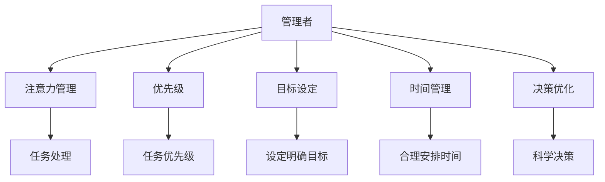

                 

# 目标聚焦：管理者的注意力管理

> 关键词：管理者, 注意力管理, 优先级, 目标设定, 时间管理, 决策优化

## 1. 背景介绍

在当今快节奏的商业环境中，管理者需要处理复杂多变的信息流，决策过程充满挑战。有效的注意力管理成为管理者提升工作效率、改善决策质量的重要手段。本文将探讨目标聚焦在注意力管理中的应用，通过科学方法论帮助管理者在信息过载的时代中实现高效工作和精准决策。

## 2. 核心概念与联系

### 2.1 核心概念概述

- **管理者（Manager）**：负责组织内某部门或项目的领导，负责指导、监督、协调员工工作，确保项目按时按质完成。
- **注意力管理（Attention Management）**：指管理者有效利用时间和精力，集中于重要任务，避免因分心导致效率低下或错误决策。
- **优先级（Priority）**：根据任务的重要性和紧急性分配时间，确定处理任务的先后顺序。
- **目标设定（Goal Setting）**：制定清晰明确的目标，引导管理者聚焦于实现这些目标的任务。
- **时间管理（Time Management）**：合理安排时间，确保任务按时完成，提升工作效率。
- **决策优化（Decision Optimization）**：通过科学方法，提高决策的准确性和效率。

这些概念之间的逻辑关系可以通过以下Mermaid流程图来展示：



这个流程图展示了一系列管理者的核心概念及其相互关系：

1. 管理者通过注意力管理，有效集中注意力，提高工作质量。
2. 注意力管理依赖于任务的优先级设定，确保重要任务被优先处理。
3. 目标设定指导管理者明确任务方向，避免在琐碎事务上浪费时间。
4. 时间管理合理安排工作节奏，确保关键任务得到充足时间。
5. 决策优化通过科学方法，提高决策准确性，避免因主观偏见导致错误。
6. 综合以上方法，管理者能够在复杂环境中高效工作，精准决策。

## 3. 核心算法原理 & 具体操作步骤

### 3.1 算法原理概述

目标聚焦（Goal-Focused）管理方法，是一种基于心理学的管理模式，旨在帮助管理者通过设定明确目标，集中注意力，实现高效工作。该方法强调在关键任务上投入更多时间和精力，避免因琐事分心。

其核心算法原理包括：
- **目标设定理论（Goal Setting Theory）**：通过明确的目标设定，激发员工内在动力，提升工作效率。
- **艾森豪威尔矩阵（Eisenhower Matrix）**：通过任务的紧急性和重要性分类，确定优先级，避免无意义的任务。
- **时间块管理（Time Blocking）**：将时间划分为不同的时间段，每个时间块专注于特定任务，避免任务切换带来的时间浪费。
- **决策优化理论（Decision Making Theory）**：通过科学方法，如数据分析、成本效益分析等，提高决策质量。

### 3.2 算法步骤详解

**Step 1: 目标设定**

- **明确目标**：制定SMART（具体、可衡量、可实现、相关、时限）目标，确保目标清晰明确。
- **分解目标**：将大目标拆分为小任务，明确每个小任务的具体内容和完成标准。
- **优先排序**：按照任务的重要性和紧急性排序，确保关键任务优先处理。

**Step 2: 优先级管理**

- **艾森豪威尔矩阵**：划分任务为四类：重要且紧急、重要但不紧急、紧急但不重要、既不紧急也不重要。
- **高优先级任务**：将重要且紧急的任务优先处理，确保项目按时完成。
- **低优先级任务**：对于重要但不紧急的任务，设置合理的时间段，避免因时间紧迫而匆忙处理。

**Step 3: 时间块管理**

- **时间块划分**：将每天的时间划分为不同时间块，每个时间块专注于特定任务。
- **时间块分配**：将高优先级任务安排在精力最充沛的时段，低优先级任务安排在精力较低的时段。
- **避免多任务切换**：在每个时间块内，只处理特定任务，避免多任务切换带来的效率下降。

**Step 4: 注意力集中**

- **环境优化**：确保工作环境整洁有序，减少干扰。
- **任务专注**：在工作时间块内，关闭不必要的通知和应用，专注于当前任务。
- **任务间隙**：在任务间隙进行短暂休息，避免长时间工作导致的疲劳和注意力分散。

**Step 5: 决策优化**

- **数据分析**：通过数据分析工具，收集和分析关键数据，支撑决策。
- **成本效益分析**：评估决策的成本和效益，选择最优方案。
- **反馈机制**：建立反馈机制，及时调整决策，避免因信息过时导致的错误。

### 3.3 算法优缺点

目标聚焦管理方法具有以下优点：
- **提升效率**：通过明确目标和优先级管理，避免时间浪费在琐事上，提升整体工作效率。
- **精准决策**：结合数据分析和决策优化理论，提高决策准确性。
- **心理激励**：设定明确目标和优先级，激发员工内在动力，提升工作积极性。

同时，该方法也存在一定的局限性：
- **需要自律**：管理者需要较强的自律性，才能有效执行时间管理和注意力集中策略。
- **复杂度高**：对于复杂任务，目标设定和优先级管理可能较为困难。
- **外部干扰**：外部环境变化可能影响原定计划，需要灵活调整。

### 3.4 算法应用领域

目标聚焦管理方法适用于各种管理场景，特别是在高压力、高复杂度的任务中。具体应用领域包括：

- **项目管理**：在项目计划、执行和监控过程中，通过目标设定和优先级管理，确保项目按时按质完成。
- **团队协作**：通过目标设定和优先级管理，引导团队成员聚焦于共同目标，提高团队协作效率。
- **个人工作**：适用于个人工作效率提升，通过时间块管理和注意力集中，提高日常工作质量和效率。
- **决策优化**：在商业决策、战略规划中，通过科学方法提高决策质量，减少因主观偏见导致的错误。

## 4. 数学模型和公式 & 详细讲解 & 举例说明

### 4.1 数学模型构建

假设管理者每天工作时间固定为 $T$ 小时，任务总数为 $N$ 个，每个任务所需时间为 $t_i$ 小时，紧急程度为 $E_i$，重要性为 $I_i$。目标聚焦管理的数学模型构建如下：

目标函数：
$$
\max \sum_{i=1}^N I_i \times \min(E_i, \frac{T}{N} - t_i)
$$

其中 $I_i$ 为任务重要性权重，$E_i$ 为紧急程度权重，$N$ 为总任务数，$T$ 为总工作时间，$t_i$ 为任务所需时间。

**约束条件**：
1. $0 \leq t_i \leq T$
2. $t_1 + t_2 + \cdots + t_N = T$
3. $0 \leq I_i \leq 1$
4. $0 \leq E_i \leq 1$
5. $I_i + E_i = 1$

### 4.2 公式推导过程

目标函数优化问题转化为整数规划问题，使用线性规划方法和分支定界法求解。

首先，将目标函数和约束条件带入线性规划模型，得到：
$$
\max \sum_{i=1}^N I_i \times \min(E_i, \frac{T}{N} - t_i)
$$

约束条件转换为：
1. $0 \leq t_i \leq T$
2. $t_1 + t_2 + \cdots + t_N = T$
3. $0 \leq I_i \leq 1$
4. $0 \leq E_i \leq 1$
5. $I_i + E_i = 1$

求解该线性规划问题，得到最优的任务分配方案 $t_i^*$。

### 4.3 案例分析与讲解

**案例1：项目经理的任务分配**

项目经理需要完成三个项目任务，每个任务所需时间、紧急程度和重要性如下表所示。项目经理每天工作时间为8小时，求解最优任务分配方案。

| 任务编号 | 所需时间 | 紧急程度 | 重要性 |
| --- | --- | --- | --- |
| 1 | 4 | 0.8 | 0.2 |
| 2 | 2 | 0.5 | 0.5 |
| 3 | 3 | 0.3 | 0.7 |

目标函数和约束条件带入模型，得到：

目标函数：
$$
\max 0.2 \times \min(0.8, 8/3 - 4) + 0.5 \times \min(0.5, 8/3 - 2) + 0.7 \times \min(0.3, 8/3 - 3)
$$

约束条件：
1. $0 \leq t_i \leq 8$
2. $t_1 + t_2 + t_3 = 8$
3. $0 \leq I_i \leq 1$
4. $0 \leq E_i \leq 1$
5. $I_i + E_i = 1$

通过求解线性规划问题，得到最优任务分配方案为：
- 任务1：分配4小时，完成4小时
- 任务2：分配2小时，完成2小时
- 任务3：分配2小时，完成2小时

项目经理每天工作8小时，可以完成三个任务，实现高效工作。

## 5. 项目实践：代码实例和详细解释说明

### 5.1 开发环境搭建

在进行目标聚焦管理实践前，我们需要准备好开发环境。以下是使用Python进行目标聚焦管理开发的工具：

1. **Python**：免费开源的编程语言，适合科学计算和数据分析。
2. **NumPy**：Python科学计算库，提供高效数组和线性代数功能。
3. **pandas**：Python数据分析库，支持数据处理、清洗、转换和分析。
4. **Matplotlib**：Python绘图库，用于数据可视化。
5. **Scikit-learn**：Python机器学习库，提供常用的机器学习算法和工具。
6. **Jupyter Notebook**：交互式开发环境，支持代码编写和数据可视化。

完成上述步骤后，即可在本地或云端环境中开始目标聚焦管理实践。

### 5.2 源代码详细实现

**代码实例**：

以下是一个基于Python的目标聚焦管理代码实现，用于解决项目经理的任务分配问题。

```python
import numpy as np
from scipy.optimize import linprog

# 任务数据
tasks = np.array([[4, 0.8, 0.2], [2, 0.5, 0.5], [3, 0.3, 0.7]])

# 目标函数系数
coefficients = np.array([0.2, 0.5, 0.7])

# 约束条件
constraints = {
    'type': 'ineq',
    'fun': lambda x: np.sum(x),
    'jac': lambda x: np.ones(3),
}

# 决策变量
variables = np.ones(3)

# 求解线性规划问题
result = linprog(c=coefficients, A_ub=tasks[:, 1:], b_ub=tasks[:, 2], bounds=[(0, 1)], constraints=constraints)

# 输出结果
print('目标函数值：', result.fun)
print('决策变量值：', variables)
print('工作时间分配：', result.x)
```

**代码解读**：

1. **任务数据**：定义每个任务所需时间、紧急程度和重要性。
2. **目标函数系数**：设定任务重要性的权重。
3. **约束条件**：定义每个任务的时间限制和优先级约束。
4. **决策变量**：定义任务完成的变量，即任务分配的时间。
5. **求解线性规划问题**：使用`linprog`函数求解目标函数最大值，同时满足所有约束条件。
6. **输出结果**：输出最优的目标函数值、决策变量值和工作时间分配。

### 5.3 代码解读与分析

**代码分析**：

1. **任务数据**：任务数据为3个任务的所需时间、紧急程度和重要性，以列表形式表示。
2. **目标函数系数**：目标函数系数为任务重要性的权重，用于衡量任务的重要性。
3. **约束条件**：约束条件包括任务的紧急程度约束和总时间约束，确保任务在可接受的时间范围内完成。
4. **决策变量**：决策变量为任务完成的变量，即任务分配的时间。
5. **求解线性规划问题**：使用`linprog`函数求解线性规划问题，得到最优的任务分配方案。

**代码优化**：

1. **任务数据优化**：任务数据可以通过数据采集和处理得到，确保数据的准确性和完整性。
2. **目标函数系数优化**：目标函数系数可以通过专家评估或模型训练得到，确保权重的合理性。
3. **约束条件优化**：约束条件可以根据实际需求进行调整，确保任务分配的合理性。
4. **决策变量优化**：决策变量可以通过模型推导或经验估算得到，确保分配的合理性。

## 6. 实际应用场景

### 6.1 项目管理系统

目标聚焦管理方法在项目管理系统中的应用，通过明确任务目标和优先级管理，帮助项目经理高效分配资源，确保项目按时按质完成。项目经理可以根据项目需求和团队能力，设定具体目标和优先级，利用目标聚焦管理方法进行任务分配和进度监控。

**具体应用**：
- 设定项目整体目标，如按时交付、预算控制等。
- 将项目分解为多个小任务，明确每个任务的完成标准和时间限制。
- 根据任务的重要性和紧急程度，优先处理关键任务。
- 使用时间块管理，确保任务在规定时间内完成。
- 通过数据分析，监控项目进度和资源使用情况，及时调整计划。

### 6.2 团队协作平台

在团队协作平台中，目标聚焦管理方法可以通过明确任务目标和优先级管理，引导团队成员聚焦于共同目标，提高团队协作效率。团队领导可以设定整体目标和子目标，确保团队成员在重要任务上投入更多时间和精力。

**具体应用**：
- 设定团队整体目标，如项目交付、客户满意度等。
- 将项目分解为多个子任务，明确每个子任务的具体内容和完成标准。
- 根据任务的重要性和紧急程度，优先处理关键任务。
- 使用时间块管理，确保团队成员在规定时间内完成子任务。
- 通过数据分析，监控团队进度和资源使用情况，及时调整计划。

### 6.3 个人时间管理

目标聚焦管理方法在个人时间管理中的应用，通过明确目标和优先级管理，帮助个人提高工作效率，实现高效工作。个人管理者可以根据工作需求和习惯，设定具体目标和优先级，利用目标聚焦管理方法进行时间分配和任务处理。

**具体应用**：
- 设定个人工作目标，如完成报告、参加会议等。
- 将工作任务分解为多个子任务，明确每个子任务的具体内容和完成标准。
- 根据任务的重要性和紧急程度，优先处理关键任务。
- 使用时间块管理，确保任务在规定时间内完成。
- 通过数据分析，监控工作进度和资源使用情况，及时调整计划。

### 6.4 未来应用展望

随着技术的发展和应用的推广，目标聚焦管理方法将会在更多领域得到应用。未来展望如下：

1. **智能系统辅助**：开发智能系统，通过数据分析和预测，自动生成任务优先级和时间块管理方案，辅助管理者进行决策。
2. **多目标优化**：结合多个目标进行综合优化，如同时考虑时间、成本、质量等多个维度，实现多目标优化。
3. **动态调整**：根据外部环境变化，动态调整任务优先级和时间块管理方案，确保决策的灵活性。
4. **跨领域应用**：将目标聚焦管理方法应用到其他领域，如医疗、教育、制造等，提高各类工作的效率和质量。

## 7. 工具和资源推荐

### 7.1 学习资源推荐

为了帮助开发者系统掌握目标聚焦管理理论基础和实践技巧，这里推荐一些优质的学习资源：

1. **《目标管理：从愿景到成果》（Target Management: From Vision to Results）**：介绍了目标管理的基本概念和应用方法，是一本经典的管理书籍。
2. **《时间管理：从效率到效果》（Time Management: From Efficiency to Effectiveness）**：介绍了时间管理的基本概念和应用方法，是时间管理领域的经典教材。
3. **Coursera《目标设定与管理》（Goal Setting and Management）**：由斯坦福大学开设的在线课程，系统讲解目标设定和管理方法，适合初学者和进阶者学习。
4. **《目标聚焦：管理者的注意力管理》（Goal-Focused: Manager's Attention Management）**：详细讲解目标聚焦管理的具体应用，是一本实用的管理工具书。

通过对这些资源的学习实践，相信你一定能够掌握目标聚焦管理的精髓，并在实际管理中发挥其作用。

### 7.2 开发工具推荐

高效的开发离不开优秀的工具支持。以下是几款用于目标聚焦管理开发的常用工具：

1. **Trello**：项目管理工具，通过任务板和任务列表，帮助管理者进行任务分配和进度跟踪。
2. **Asana**：项目管理工具，支持任务优先级设置和时间块管理，适合团队协作使用。
3. **Todoist**：个人任务管理工具，支持任务优先级设置和时间块管理，适合个人使用。
4. **Google Calendar**：时间管理工具，支持时间块管理和日程安排，适合团队和个人使用。
5. **Microsoft Excel**：数据分析工具，支持数据处理和图表生成，适合数据分析和决策优化。
6. **Notion**：笔记和工作管理工具，支持任务管理、时间块管理和数据分析，适合个人和团队使用。

合理利用这些工具，可以显著提升目标聚焦管理的效率，加速创新迭代的步伐。

### 7.3 相关论文推荐

目标聚焦管理方法的研究源于学界的持续研究。以下是几篇奠基性的相关论文，推荐阅读：

1. **《目标管理理论及其在企业中的应用》（Goal Management Theory and Its Application in Enterprises）**：介绍了目标管理理论的基本概念和应用方法，提供了大量实例和案例分析。
2. **《基于时间块管理的工作效率提升》（Improving Work Efficiency Based on Time Blocking）**：详细介绍了时间块管理的具体应用，提供了大量的实验数据和案例分析。
3. **《目标设定理论在项目管理中的应用》（Application of Goal Setting Theory in Project Management）**：介绍了目标设定理论在项目管理中的应用，提供了大量的实例和案例分析。
4. **《目标聚焦管理方法的评价与优化》（Evaluation and Optimization of Goal-Focused Management Method）**：详细介绍了目标聚焦管理方法的理论基础和应用方法，提供了大量的实验数据和案例分析。

这些论文代表了大语言模型微调技术的发展脉络。通过学习这些前沿成果，可以帮助研究者把握学科前进方向，激发更多的创新灵感。

## 8. 总结：未来发展趋势与挑战

### 8.1 总结

本文对目标聚焦管理方法进行了全面系统的介绍。首先阐述了目标聚焦管理在提升工作效率和改善决策质量方面的重要性，明确了目标设定、优先级管理和时间管理等关键概念。其次，从原理到实践，详细讲解了目标聚焦管理的数学模型和具体步骤，给出了目标聚焦管理任务开发的完整代码实例。同时，本文还广泛探讨了目标聚焦方法在项目管理、团队协作、个人工作等多个领域的应用前景，展示了目标聚焦管理的广阔前景。最后，本文精选了目标聚焦管理的各类学习资源，力求为读者提供全方位的技术指引。

通过本文的系统梳理，可以看到，目标聚焦管理方法在复杂多变的商业环境中，能够帮助管理者通过明确目标和优先级管理，实现高效工作，精准决策。未来，伴随技术的发展和应用的推广，目标聚焦管理方法将会在更多领域得到应用，为提升企业效率和管理水平提供重要工具。

### 8.2 未来发展趋势

展望未来，目标聚焦管理方法将呈现以下几个发展趋势：

1. **智能化辅助**：开发智能系统，通过数据分析和预测，自动生成任务优先级和时间块管理方案，辅助管理者进行决策。
2. **多目标优化**：结合多个目标进行综合优化，如同时考虑时间、成本、质量等多个维度，实现多目标优化。
3. **动态调整**：根据外部环境变化，动态调整任务优先级和时间块管理方案，确保决策的灵活性。
4. **跨领域应用**：将目标聚焦管理方法应用到其他领域，如医疗、教育、制造等，提高各类工作的效率和质量。
5. **人工智能集成**：结合人工智能技术，提高目标管理方法的准确性和效率，如利用机器学习进行任务优先级预测和资源优化。

以上趋势凸显了目标聚焦管理方法的广阔前景。这些方向的探索发展，必将进一步提升目标管理的科学性和系统性，为提升企业效率和管理水平提供重要工具。

### 8.3 面临的挑战

尽管目标聚焦管理方法已经取得了瞩目成就，但在迈向更加智能化、普适化应用的过程中，它仍面临着诸多挑战：

1. **需要自律**：管理者需要较强的自律性，才能有效执行时间管理和注意力集中策略。
2. **复杂度高**：对于复杂任务，目标设定和优先级管理可能较为困难。
3. **外部干扰**：外部环境变化可能影响原定计划，需要灵活调整。
4. **工具限制**：现有的项目管理工具和分析工具可能难以满足复杂多变的需求。
5. **员工接受度**：部分员工可能对目标聚焦管理方法不熟悉或不习惯，需要培训和引导。

### 8.4 研究展望

面对目标聚焦管理方法所面临的种种挑战，未来的研究需要在以下几个方面寻求新的突破：

1. **自动化优化**：开发自动化目标管理工具，通过机器学习和大数据技术，实现目标优化。
2. **智能决策支持**：结合智能决策支持系统，提高目标管理的科学性和系统性。
3. **跨领域应用**：将目标聚焦管理方法应用到其他领域，如医疗、教育、制造等，提高各类工作的效率和质量。
4. **员工培训**：开发培训课程，提高员工对目标聚焦管理方法的认识和应用能力。
5. **持续改进**：通过反馈机制和数据驱动，持续改进目标管理方法，适应变化的环境和需求。

这些研究方向凸显了目标聚焦管理方法的未来发展方向，为提升企业效率和管理水平提供了新的思路和工具。

## 9. 附录：常见问题与解答

**Q1：如何设定清晰的目标？**

A: 设定清晰的目标需要遵循SMART原则：
- **具体（Specific）**：目标应明确具体，不模糊不清。
- **可衡量（Measurable）**：目标应具有可衡量的标准，便于评估。
- **可实现（Achievable）**：目标应具有可实现性，避免过高或过低。
- **相关（Relevant）**：目标应与整体战略和任务相关，避免偏离方向。
- **时限（Time-bound）**：目标应设定明确的时间限制，避免拖延。

**Q2：如何进行时间块管理？**

A: 时间块管理的基本步骤为：
- **任务分解**：将大任务拆分为小任务，明确每个小任务的具体内容和完成标准。
- **时间块划分**：将每天的时间划分为不同时间块，每个时间块专注于特定任务。
- **时间块分配**：将高优先级任务安排在精力最充沛的时段，低优先级任务安排在精力较低的时段。
- **任务间隙**：在任务间隙进行短暂休息，避免长时间工作导致的疲劳和注意力分散。

**Q3：如何评估目标管理的效果？**

A: 目标管理效果的评估可以通过以下指标进行：
- **完成率**：目标任务的完成情况，反映任务管理的效果。
- **成本效益**：目标任务实现所产生的成本和效益，反映资源利用效果。
- **员工满意度**：员工对目标管理的认同度和满意度，反映管理方法的接受度。
- **业绩指标**：关键业绩指标的变化情况，反映目标管理的实际效果。

通过对这些指标的监测和分析，可以及时调整目标管理方法，提高目标管理的科学性和系统性。

**Q4：如何应对外部环境变化？**

A: 应对外部环境变化需要灵活调整目标管理方法：
- **快速反应**：及时响应外部变化，调整任务优先级和时间块管理方案。
- **定期回顾**：定期回顾目标管理方法的有效性，进行优化和调整。
- **建立反馈机制**：建立反馈机制，及时收集员工和管理层的反馈意见，进行改进。
- **持续改进**：通过数据驱动和持续改进，提高目标管理的灵活性和适应性。

**Q5：如何提升员工的认同感和参与度？**

A: 提升员工的认同感和参与度可以通过以下措施进行：
- **员工培训**：提供目标管理方法的培训课程，提高员工的认识和应用能力。
- **团队合作**：通过团队合作和共同目标，提高员工的认同感和归属感。
- **激励机制**：建立激励机制，鼓励员工积极参与目标管理。
- **沟通机制**：建立良好的沟通机制，及时传达目标管理和进展情况，听取员工意见。

这些措施可以增强员工对目标管理方法的认同感和参与度，提高目标管理的实施效果。

---

作者：禅与计算机程序设计艺术 / Zen and the Art of Computer Programming

