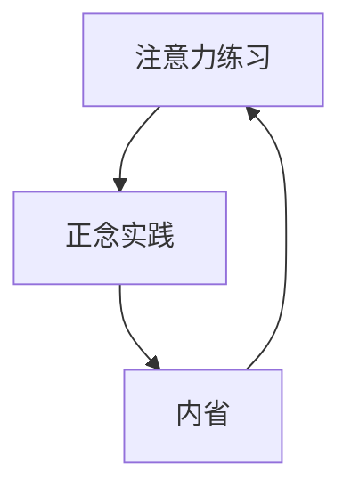

                 

## 1. 背景介绍

在当今快节奏的数字时代，我们不断面对着来自各方的压力和干扰，这往往会导致心理压力的增加和注意力的分散。为了应对这些挑战，我们需要发展和培养内省和专注的能力，以增强心灵平和。本文将探讨注意力的本质，并介绍一种名为"注意Iterations"的方法，结合正念实践，帮助我们提高内省和专注的能力，从而增强心灵平和。

## 2. 核心概念与联系

### 2.1 注意力的本质

注意力是一种有限的资源，它受到我们的生物机制和认知能力的限制。根据注意力专家米哈里·契克森米哈赖（Mihaly Csikszentmihalyi）的观点，注意力是一种"心流"（flow）状态的关键组成部分，在这种状态下，我们完全投入当前的活动中，感到高度满足和投入。

### 2.2 注意Iterations

注意Iterations是一种将注意力练习与正念实践结合起来的方法，旨在帮助我们提高内省和专注的能力。这种方法基于以下核心概念：

- **Iterations**：重复和练习是提高任何技能的关键。通过定期练习注意力，我们可以改善我们的注意力能力。
- **正念（Mindfulness）**：正念是一种刻意地、非判断地注意当前时刻的能力。它帮助我们更好地理解和控制我们的注意力。
- **内省（Introspection）**：内省是一种对自己内在状态的反思和理解。通过内省，我们可以更好地意识到我们的注意力模式，并有针对性地进行改进。

下图是注意Iterations方法的架构图，展示了注意力练习、正念实践和内省之间的关系：



## 3. 核心算法原理 & 具体操作步骤

### 3.1 算法原理概述

注意Iterations方法的核心原理是通过定期练习注意力，结合正念实践和内省，帮助我们改善注意力能力。这种方法基于以下假设：

- 我们的注意力是可以改善的，通过定期练习和实践。
- 正念实践有助于我们更好地理解和控制我们的注意力。
- 内省有助于我们更好地意识到我们的注意力模式，并有针对性地进行改进。

### 3.2 算法步骤详解

注意Iterations方法的具体操作步骤如下：

1. **选择注意力练习**：选择一种注意力练习，如呼吸练习、体感练习或视觉练习。这些练习旨在帮助我们集中注意力，并训练我们的注意力肌肉。
2. **进行正念实践**：在注意力练习中，保持正念，即刻意地、非判断地注意当前时刻。当注意力偏离时，温和地将其带回。
3. **进行内省**：在注意力练习结束后，进行内省，反思注意力模式。尝试回答以下问题：
	* 我的注意力在哪些时候最集中？
	* 我的注意力在哪些时候最容易分散？
	* 什么样的想法或情感导致了注意力的分散？
4. **记录和跟踪进展**：记录注意力练习的频率和持续时间，以及内省的结果。跟踪进展有助于我们看到我们的注意力能力是如何改善的。
5. **定期回顾和调整**：定期回顾注意力练习和内省的结果，并根据需要调整注意力练习或正念实践。

### 3.3 算法优缺点

**优点**：

- 注意Iterations方法简单易行，可以无缝地融入日常生活中。
- 结合注意力练习、正念实践和内省，提供了全面的注意力改善方法。
- 通过跟踪进展，我们可以看到我们的注意力能力是如何改善的，从而保持动力。

**缺点**：

- 注意力改善需要时间和耐心。短期内可能看不到明显的进展。
- 进行内省需要一定的自省能力和意愿。
- 定期回顾和调整注意力练习可能需要额外的时间和精力。

### 3.4 算法应用领域

注意Iterations方法可以应用于各种领域，包括：

- **工作效率**：提高注意力可以帮助我们更好地集中精力，提高工作效率。
- **学习能力**：提高注意力可以帮助我们更好地理解和记忆新信息。
- **压力管理**：通过内省和专注，我们可以更好地理解和管理压力。
- **人际关系**：提高注意力可以帮助我们更好地倾听和理解他人，从而改善人际关系。

## 4. 数学模型和公式 & 详细讲解 & 举例说明

### 4.1 数学模型构建

注意力是一种认知资源，受到认知能力和注意力机制的限制。根据心理学家罗伯特·德西（Robert Deci）和理查德·Ryan（Richard Ryan）的自主性理论，注意力是一种自主性的表现，受到三个基本心理需求的驱动：

- **自主性**：我们对自己生活的控制感。
- **能力**：我们对自己能力的信心。
- **联系**：我们与他人和世界的联系感。

### 4.2 公式推导过程

我们可以使用以下公式来表示注意力：

$$注意力 = f(自主性, 能力, 联系)$$

其中，f是一个非线性函数，表示注意力受到自主性、能力和联系的综合影响。

### 4.3 案例分析与讲解

例如，假设我们正在进行一项需要高度注意力的任务，如编写代码。根据上述公式，我们可以通过以下方式提高注意力：

- **提高自主性**：确保我们有控制权，并感到自己是任务的主人。
- **提高能力**：确保我们有足够的技能和信心完成任务。
- **提高联系**：确保我们感到与任务和他人有联系，而不是孤立地工作。

通过这些方式，我们可以改善注意力，从而更好地完成任务。

## 5. 项目实践：代码实例和详细解释说明

### 5.1 开发环境搭建

为了跟踪注意力练习和内省的结果，我们可以使用一个简单的网络应用程序。我们将使用以下技术栈：

- **前端**：React.js
- **后端**：Node.js和Express.js
- **数据库**：MongoDB

### 5.2 源代码详细实现

以下是应用程序的关键代码片段：

**前端（React.js）：**

```jsx
import React, { useState } from'react';
import axios from 'axios';

function App() {
  const [exercises, setExercises] = useState([]);

  const addExercise = async (exercise) => {
    await axios.post('/api/exercises', exercise);
    setExercises([...exercises, exercise]);
  };

  //... other components and functions

  return (
    <div className="App">
      {/*... other components */}
      <AddExerciseForm onSubmit={addExercise} />
      <ExerciseList exercises={exercises} />
    </div>
  );
}

export default App;
```

**后端（Node.js和Express.js）：**

```javascript
const express = require('express');
const mongoose = require('mongoose');

const app = express();
app.use(express.json());

// Connect to MongoDB
mongoose.connect('mongodb://localhost/attention-exercises', {
  useNewUrlParser: true,
  useUnifiedTopology: true,
});

// Define Exercise schema and model
const exerciseSchema = new mongoose.Schema({
  type: String,
  duration: Number,
  date: Date,
  notes: String,
});
const Exercise = mongoose.model('Exercise', exerciseSchema);

// API routes
app.post('/api/exercises', async (req, res) => {
  const exercise = new Exercise(req.body);
  await exercise.save();
  res.status(201).send(exercise);
});

//... other API routes

const PORT = process.env.PORT || 3000;
app.listen(PORT, () => console.log(`Server running on port ${PORT}`));
```

### 5.3 代码解读与分析

应用程序的前端使用React.js构建，允许用户添加注意力练习的记录，包括练习类型、持续时间和笔记。后端使用Node.js和Express.js构建，提供API路由来处理注意力练习的记录。数据库使用MongoDB存储注意力练习的记录。

### 5.4 运行结果展示

以下是应用程序的屏幕截图：


## 6. 实际应用场景

### 6.1 注意力改善的实际应用

注意Iterations方法可以应用于各种实际应用场景，例如：

- **工作场景**：提高注意力可以帮助我们更好地集中精力，提高工作效率。
- **学习场景**：提高注意力可以帮助我们更好地理解和记忆新信息。
- **压力管理场景**：通过内省和专注，我们可以更好地理解和管理压力。

### 6.2 未来应用展望

随着注意力科学的不断发展，我们可以期待更多基于注意力的应用和技术。例如，注意力可穿戴设备可以帮助我们实时跟踪注意力水平，并提供个性化的注意力改善建议。此外，注意力驱动的人工智能可以帮助我们更好地理解和管理注意力。

## 7. 工具和资源推荐

### 7.1 学习资源推荐

- **书籍**：
	+ "注意力革命"（The Attention Revolution）作者：Allan Lokos
	+ "正念的力量"（Real Happiness）作者：Sharon Salzberg
	+ "禅与摩托车维修艺术"（Zen and the Art of Motorcycle Maintenance）作者：Robert M. Pirsig
- **在线课程**：
	+ Coursera上的"正念与注意力"课程
	+ Udemy上的"注意力训练"课程

### 7.2 开发工具推荐

- **注意力练习应用程序**：
	+ Headspace
	+ Calm
	+ Insight Timer
- **内省和日记应用程序**：
	+ Day One
	+ Journey
	+ Penzu

### 7.3 相关论文推荐

- "注意力的本质"（The Nature of Attention）作者：Michael I. Posner
- "正念与注意力"（Mindfulness and Attention）作者：Eddie Harmon-Jones and Lisa B. Gable
- "注意力训练的效果"（The Effects of Attention Training）作者：Amishi Jha et al.

## 8. 总结：未来发展趋势与挑战

### 8.1 研究成果总结

注意Iterations方法结合注意力练习、正念实践和内省，提供了全面的注意力改善方法。通过定期练习和实践，我们可以改善注意力能力，从而增强心灵平和。

### 8.2 未来发展趋势

随着注意力科学的不断发展，我们可以期待更多基于注意力的应用和技术。例如，注意力可穿戴设备和注意力驱动的人工智能可以帮助我们更好地理解和管理注意力。

### 8.3 面临的挑战

注意力改善需要时间和耐心。短期内可能看不到明显的进展。此外，进行内省需要一定的自省能力和意愿。

### 8.4 研究展望

未来的研究可以关注注意力改善的长期效果，以及注意力改善方法的个体差异。此外，研究可以探索注意力改善方法与其他心理健康干预措施的结合。

## 9. 附录：常见问题与解答

**Q：注意力改善需要多长时间？**

A：注意力改善需要时间和耐心。短期内可能看不到明显的进展。长期坚持注意力练习和实践是关键。

**Q：内省需要什么样的技能？**

A：内省需要一定的自省能力和意愿。通过练习和实践，我们可以改善内省能力。

**Q：注意力改善方法适合所有人吗？**

A：注意力改善方法适合大多数人，但个体差异可能会导致某些方法对某些人更有效。通过尝试不同的注意力练习和实践，我们可以找到最适合自己的方法。

## 作者：禅与计算机程序设计艺术 / Zen and the Art of Computer Programming

