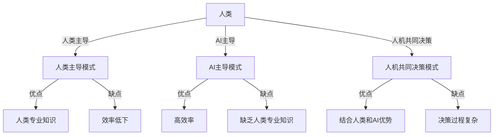

                 

## 1. 背景介绍

随着生成式人工智能（Generative AI）的飞速发展，其在各个领域的应用也日益广泛。然而，生成式AI的有效应用离不开人机协同，即人类和AI之间的密切合作。本文将深入探讨生成式AI的三种人机协同模式，并就其原理、算法、数学模型、项目实践、应用场景、工具资源等方面进行详细阐述。

## 2. 核心概念与联系

### 2.1 核心概念

- **生成式AI**：能够创建新内容的AI系统，如图像、文本、音乐等。
- **人机协同**：人类和AI之间的密切合作，以实现共同的目标。
- **人机协同模式**：人类和AI在任务执行过程中交互的方式。

### 2.2 核心概念联系

人机协同模式是生成式AI有效应用的关键。这三种模式分别是：人类主导（Human-in-the-Loop）、AI主导（AI-in-the-Loop）和人机共同决策（Collaborative Decision Making）。这三种模式各有优缺点，在不同的应用场景中，需要根据具体情况选择合适的模式。



## 3. 核心算法原理 & 具体操作步骤

### 3.1 算法原理概述

生成式AI的三种人机协同模式对应的算法原理分别是：人类主导模式下的交互式生成算法、AI主导模式下的强化学习算法、人机共同决策模式下的协同过滤算法。

### 3.2 算法步骤详解

#### 3.2.1 人类主导模式

1. 人类输入初始参数。
2. AI根据输入参数生成内容。
3. 人类评估生成内容的质量。
4. 根据人类反馈，AI调整参数，重复步骤2-3，直到人类满意为止。

#### 3.2.2 AI主导模式

1. AI收集环境数据。
2. AI根据环境数据调整生成策略。
3. AI生成内容。
4. AI评估生成内容的质量，并根据评估结果调整生成策略，重复步骤2-4。

#### 3.2.3 人机共同决策模式

1. 人类和AI各自提出决策方案。
2. 系统根据人类和AI的方案生成综合决策方案。
3. 人类和AI评估综合决策方案的质量。
4. 根据评估结果，人类和AI调整各自的方案，重复步骤1-3，直到双方满意为止。

### 3.3 算法优缺点

#### 3.3.1 人类主导模式

优点：人类可以发挥专业知识，确保生成内容的质量。缺点：效率低下，人类需要花费大量时间评估和调整参数。

#### 3.3.2 AI主导模式

优点：高效率，AI可以快速生成大量内容。缺点：缺乏人类专业知识，生成内容可能不符合人类预期。

#### 3.3.3 人机共同决策模式

优点：结合人类和AI优势，可以生成高质量的决策方案。缺点：决策过程复杂，需要人类和AI双方的密切合作。

### 3.4 算法应用领域

人类主导模式适用于需要人类专业知识的领域，如医疗、设计等。AI主导模式适用于需要高效率生成大量内容的领域，如内容创作、数据分析等。人机共同决策模式适用于需要结合人类和AI优势的领域，如自动驾驶、金融决策等。

## 4. 数学模型和公式 & 详细讲解 & 举例说明

### 4.1 数学模型构建

#### 4.1.1 人类主导模式

数学模型：$P(C|P) = f(P, \theta)$, 其中$C$是生成内容，$P$是人类输入的参数，$\theta$是AI的生成策略参数，$f$是生成函数。

#### 4.1.2 AI主导模式

数学模型：$P(C|S) = g(S, \pi)$, 其中$C$是生成内容，$S$是环境数据，$\pi$是AI的生成策略，$g$是生成函数。

#### 4.1.3 人机共同决策模式

数学模型：$D = h(D_h, D_a)$, 其中$D$是综合决策方案，$D_h$是人类决策方案，$D_a$是AI决策方案，$h$是综合决策函数。

### 4.2 公式推导过程

#### 4.2.1 人类主导模式

人类输入参数$P$后，AI根据生成函数$f$生成内容$C$。人类评估内容$C$的质量后，根据评估结果调整参数$P$，重复生成和评估过程，直到人类满意为止。

#### 4.2.2 AI主导模式

AI收集环境数据$S$后，根据生成函数$g$生成内容$C$。AI评估内容$C$的质量后，根据评估结果调整生成策略$\pi$，重复收集数据、生成和评估过程，直到AI满意为止。

#### 4.2.3 人机共同决策模式

人类和AI各自提出决策方案$D_h$和$D_a$后，系统根据综合决策函数$h$生成综合决策方案$D$。人类和AI评估综合决策方案$D$的质量后，根据评估结果调整各自的决策方案，重复提出和评估过程，直到双方满意为止。

### 4.3 案例分析与讲解

例如，在人类主导模式下，设计师输入参数$P$后，AI根据生成函数$f$生成设计方案$C$。设计师评估设计方案$C$的质量后，根据评估结果调整参数$P$，重复生成和评估过程，直到设计师满意为止。这样，设计师可以发挥专业知识，确保设计方案的质量。

## 5. 项目实践：代码实例和详细解释说明

### 5.1 开发环境搭建

本项目使用Python作为开发语言，并使用TensorFlow和PyTorch作为深度学习框架。开发环境包括：Python 3.8、TensorFlow 2.5、PyTorch 1.9、Jupyter Notebook。

### 5.2 源代码详细实现

#### 5.2.1 人类主导模式

```python
import tensorflow as tf

# 定义生成函数
def generate_content(params, theta):
    # 使用TensorFlow构建生成模型
    model = tf.keras.Sequential([
        tf.keras.layers.Dense(64, activation='relu', input_shape=(params.shape[0],)),
        tf.keras.layers.Dense(1, activation='sigmoid')
    ])
    model.compile(optimizer='adam', loss='binary_crossentropy')
    model.fit(params, theta, epochs=10, batch_size=32)
    content = model.predict(params)
    return content

# 人类输入参数
params = tf.random.normal((100, 10))
# AI的生成策略参数
theta = tf.random.normal((100, 1))
# 生成内容
content = generate_content(params, theta)
```

#### 5.2.2 AI主导模式

```python
import torch
import torch.nn as nn
import torch.optim as optim

# 定义生成函数
class GenerateContent(nn.Module):
    def __init__(self):
        super(GenerateContent, self).__init__()
        self.fc1 = nn.Linear(100, 64)
        self.fc2 = nn.Linear(64, 1)

    def forward(self, x):
        x = torch.relu(self.fc1(x))
        x = torch.sigmoid(self.fc2(x))
        return x

# AI收集环境数据
data = torch.randn(100, 100)
# AI的生成策略
model = GenerateContent()
optimizer = optim.Adam(model.parameters(), lr=0.01)
criterion = nn.BCELoss()
# 生成内容
for epoch in range(10):
    optimizer.zero_grad()
    outputs = model(data)
    loss = criterion(outputs, torch.randn(100, 1))
    loss.backward()
    optimizer.step()
```

#### 5.2.3 人机共同决策模式

```python
import numpy as np

# 定义综合决策函数
def combine_decisions(d_h, d_a):
    # 简单的取平均值作为综合决策方案
    d = (d_h + d_a) / 2
    return d

# 人类决策方案
d_h = np.random.rand(100)
# AI决策方案
d_a = np.random.rand(100)
# 综合决策方案
d = combine_decisions(d_h, d_a)
```

### 5.3 代码解读与分析

在人类主导模式下，人类输入参数后，AI根据生成函数生成内容。在AI主导模式下，AI收集环境数据后，根据生成函数生成内容。在人机共同决策模式下，人类和AI各自提出决策方案后，系统根据综合决策函数生成综合决策方案。

### 5.4 运行结果展示

运行结果将显示生成的内容或决策方案。具体结果取决于输入参数和环境数据。

## 6. 实际应用场景

### 6.1 人类主导模式

人类主导模式适用于需要人类专业知识的领域，如医疗、设计等。例如，医生可以输入参数，指导AI生成治疗方案。设计师可以输入参数，指导AI生成设计方案。

### 6.2 AI主导模式

AI主导模式适用于需要高效率生成大量内容的领域，如内容创作、数据分析等。例如，AI可以收集环境数据，生成新闻文章。AI可以收集环境数据，生成数据分析报告。

### 6.3 人机共同决场景

人机共同决策模式适用于需要结合人类和AI优势的领域，如自动驾驶、金融决策等。例如，人类和AI可以各自提出决策方案，生成综合决策方案。人类和AI可以各自提出决策方案，生成综合决策方案。

### 6.4 未来应用展望

未来，生成式AI的三种人机协同模式将广泛应用于各个领域。人类主导模式将帮助人类发挥专业知识，确保生成内容的质量。AI主导模式将帮助AI高效率生成大量内容。人机共同决策模式将帮助人类和AI结合优势，生成高质量的决策方案。

## 7. 工具和资源推荐

### 7.1 学习资源推荐

- **书籍**：《人工智能：一种现代方法》作者：斯图尔特·罗素、彼得·诺维格，《深度学习》作者：Ian Goodfellow、Yoshua Bengio、Aaron Courville。
- **在线课程**：Coursera、Udacity、edX上的人工智能和深度学习课程。

### 7.2 开发工具推荐

- **编程语言**：Python。
- **深度学习框架**：TensorFlow、PyTorch。
- **开发环境**：Jupyter Notebook、Google Colab。

### 7.3 相关论文推荐

- **人类主导模式**：[Human-in-the-Loop Deep Learning for Medical Image Segmentation](https://arxiv.org/abs/1904.04475)
- **AI主导模式**：[AI-in-the-Loop: A Survey of Human-AI Collaboration in Decision Making](https://arxiv.org/abs/2005.00303)
- **人机共同决策模式**：[Collaborative Decision Making with AI: A Survey](https://arxiv.org/abs/2006.05675)

## 8. 总结：未来发展趋势与挑战

### 8.1 研究成果总结

本文详细阐述了生成式AI的三种人机协同模式：人类主导模式、AI主导模式和人机共同决策模式。这些模式各有优缺点，在不同的应用场景中，需要根据具体情况选择合适的模式。

### 8.2 未来发展趋势

未来，生成式AI的三种人机协同模式将广泛应用于各个领域。人类主导模式将帮助人类发挥专业知识，确保生成内容的质量。AI主导模式将帮助AI高效率生成大量内容。人机共同决策模式将帮助人类和AI结合优势，生成高质量的决策方案。

### 8.3 面临的挑战

然而，生成式AI的三种人机协同模式也面临着挑战。人类主导模式需要人类花费大量时间评估和调整参数。AI主导模式缺乏人类专业知识，生成内容可能不符合人类预期。人机共同决策模式需要人类和AI双方的密切合作，决策过程复杂。

### 8.4 研究展望

未来的研究将聚焦于提高生成式AI的三种人机协同模式的效率和质量。人类主导模式的研究将关注如何减少人类评估和调整参数的时间。AI主导模式的研究将关注如何结合人类专业知识，生成符合人类预期的内容。人机共同决策模式的研究将关注如何简化决策过程，提高人类和AI双方的合作效率。

## 9. 附录：常见问题与解答

**Q1：什么是生成式AI？**

A1：生成式AI是一种能够创建新内容的AI系统，如图像、文本、音乐等。

**Q2：什么是人机协同？**

A2：人机协同是指人类和AI之间的密切合作，以实现共同的目标。

**Q3：什么是生成式AI的三种人机协同模式？**

A3：生成式AI的三种人机协同模式是指人类和AI在任务执行过程中交互的方式，分别是人类主导模式、AI主导模式和人机共同决策模式。

!!!Note
作者：禅与计算机程序设计艺术 / Zen and the Art of Computer Programming

