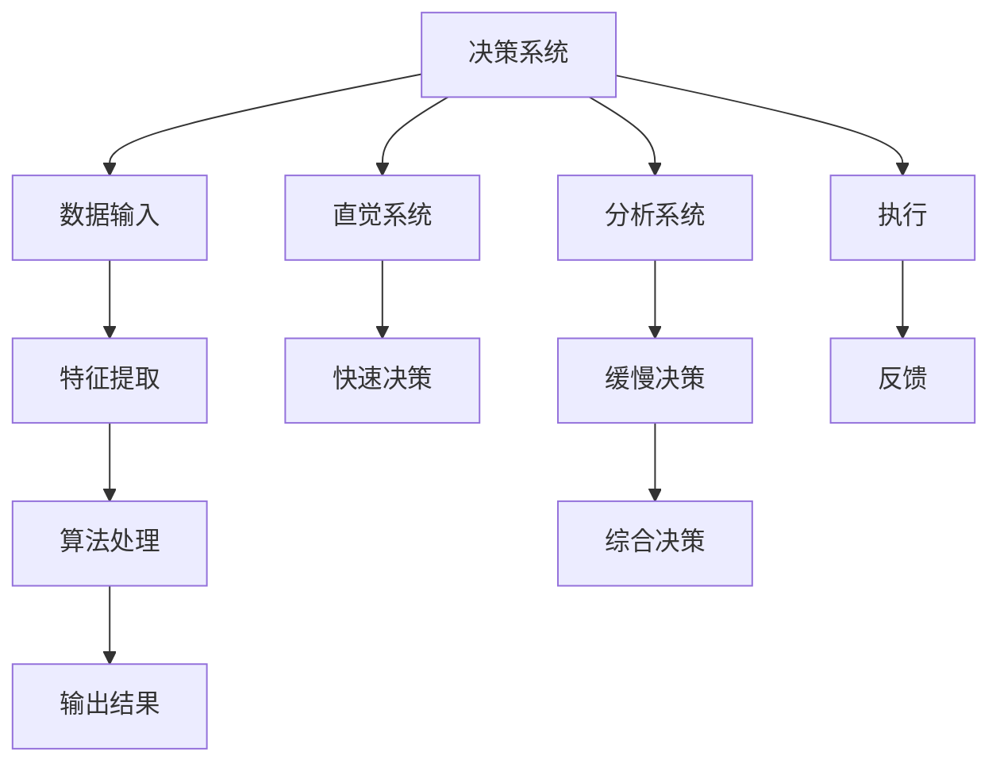

                 

# 直觉与分析：决策过程中的双重系统

> 关键词：决策系统, 双重系统, 认知科学, 算法, 数据分析

## 1. 背景介绍

决策，是人类和机器面临的共同挑战。无论是在商业、医疗、教育还是日常生活中，每个决策都关乎未来。随着技术的进步，机器在各个领域的应用越来越广泛，但机器决策依然面临诸多难题。如何在复杂多变的环境下做出理性且符合伦理的决策，是人工智能研究的核心之一。

本文将从认知科学的角度出发，探讨人类和机器在决策过程中的双重系统，并尝试提出解决复杂决策问题的算法和方法。

## 2. 核心概念与联系

### 2.1 核心概念概述

- **决策系统**：指通过逻辑、算法或规则等手段进行决策的系统，可以基于数据和模型做出预测和决策。
- **双重系统**：人类心理学家Daniel Kahneman提出的概念，指的是人类在决策过程中存在两种系统：快速直觉系统(Heuristic System)和缓慢分析系统(Analytical System)。
- **认知科学**：研究人类思维、认知和学习过程的科学，关注决策系统的认知机制和算法。
- **算法**：解决特定问题的计算机程序，通过逻辑、数学和数据处理实现自动化决策。
- **数据分析**：从数据中提取有价值信息，支持决策系统的训练和优化。

这些概念共同构成了决策过程的基础。通过理解这些核心概念，可以更好地把握决策系统的原理和运作机制。

### 2.2 核心概念原理和架构的 Mermaid 流程图



此图展示了决策系统的工作流程，从数据输入到综合决策，再到执行反馈，每一步都依赖于直觉系统和分析系统的双重驱动。

## 3. 核心算法原理 & 具体操作步骤

### 3.1 算法原理概述

基于双重系统的决策算法，旨在结合直觉和分析的优势，通过以下步骤实现理性决策：

1. **数据输入与特征提取**：收集数据，进行预处理和特征提取。
2. **快速决策**：通过直觉系统，利用快速算法或规则，进行初步决策。
3. **缓慢决策**：通过分析系统，使用复杂算法或模型，进行深入分析，优化决策。
4. **综合决策**：结合快速和缓慢决策的结果，综合得出最终决策。
5. **执行与反馈**：执行决策，并根据反馈进行调整和优化。

### 3.2 算法步骤详解

#### 3.2.1 数据输入与特征提取

数据输入与特征提取是决策系统的基础。通过数据收集和预处理，提取出对决策有帮助的特征。

**步骤1**：收集数据
- 使用API接口、爬虫工具或数据库等手段，从外部获取数据。

**步骤2**：数据预处理
- 清洗数据，去除噪声和异常值。
- 数据标准化，如归一化和标准化。

**步骤3**：特征提取
- 使用特征工程技术，提取对决策有帮助的特征。
- 如使用TF-IDF提取文本特征，使用PCA降维图像特征。

#### 3.2.2 快速决策

快速决策依赖于直觉系统，通过简单的算法或规则，快速给出初步决策。

**步骤1**：选择快速算法
- 根据任务特性，选择适合的算法，如分类算法、回归算法、聚类算法等。

**步骤2**：实现算法
- 使用Python、R等语言，实现算法代码。

**步骤3**：应用算法
- 将算法应用到数据上，得到初步决策结果。

#### 3.2.3 缓慢决策

缓慢决策依赖于分析系统，通过复杂的算法或模型，深入分析数据，优化决策。

**步骤1**：选择模型
- 根据任务需求，选择适合的模型，如决策树、随机森林、神经网络等。

**步骤2**：模型训练
- 使用训练数据，训练模型。
- 通过交叉验证、网格搜索等方法，优化模型参数。

**步骤3**：应用模型
- 将训练好的模型应用到测试数据上，得到进一步优化的决策结果。

#### 3.2.4 综合决策

综合决策结合快速决策和缓慢决策的结果，综合得出最终决策。

**步骤1**：结合决策结果
- 将快速决策和缓慢决策的结果进行结合，使用加权平均、投票等方式综合。

**步骤2**：调整决策
- 根据实际情况，调整决策权重，优化最终决策结果。

#### 3.2.5 执行与反馈

执行决策后，需要根据反馈进行调整和优化。

**步骤1**：执行决策
- 根据综合决策结果，执行相应操作。

**步骤2**：收集反馈
- 收集执行结果，获取反馈信息。

**步骤3**：调整优化
- 根据反馈信息，调整模型和算法，优化决策系统。

### 3.3 算法优缺点

基于双重系统的决策算法具有以下优点：

1. **快速高效**：通过快速决策系统，可以迅速给出初步决策，缩短决策时间。
2. **灵活适应**：快速决策系统可以灵活应对多变的环境和数据。
3. **风险控制**：缓慢决策系统通过复杂算法和模型，对决策结果进行细化，降低风险。
4. **多方参与**：结合直觉和分析，从不同角度理解问题，提升决策质量。

同时，该算法也存在一些缺点：

1. **算法复杂度高**：缓慢决策系统依赖于复杂的算法和模型，计算量较大。
2. **决策过程不透明**：直觉系统的决策过程缺乏透明性，难以解释和调试。
3. **依赖数据质量**：算法的性能很大程度上依赖于数据的质量和数量。

尽管存在这些局限性，但总体而言，基于双重系统的决策算法在处理复杂多变环境下的决策问题上表现出色，具有广泛的应用前景。

### 3.4 算法应用领域

基于双重系统的决策算法在多个领域都有广泛应用：

- **金融交易**：使用快速算法进行市场监控，使用复杂模型进行风险评估。
- **医疗诊断**：使用快速算法进行初步诊断，使用复杂模型进行精准诊断。
- **自动驾驶**：使用快速决策系统进行环境感知，使用复杂模型进行路径规划。
- **智能客服**：使用快速决策系统进行初步问题分类，使用复杂模型进行精准回答。
- **推荐系统**：使用快速决策系统进行物品推荐，使用复杂模型进行个性化推荐。

## 4. 数学模型和公式 & 详细讲解 & 举例说明

### 4.1 数学模型构建

基于双重系统的决策算法，可以通过以下数学模型来描述：

- **快速决策系统**：使用决策树算法，通过规则进行分类，得到初步决策结果。
- **缓慢决策系统**：使用神经网络模型，通过多层次的特征处理和分类，得到进一步优化的决策结果。

### 4.2 公式推导过程

#### 4.2.1 决策树算法

决策树算法可以通过信息增益或基尼不纯度等指标选择最佳特征进行分裂，得到树形结构，用于快速决策。

**决策树公式**：

$$
\text{Decision Tree} = \text{Root Node} \rightarrow \text{Left Child} \rightarrow \text{Right Child}
$$

其中，Root Node为根节点，Left Child为左子树，Right Child为右子树。

#### 4.2.2 神经网络模型

神经网络模型通过多层线性变换和非线性激活函数，逐步处理输入特征，得到最终输出结果。

**神经网络公式**：

$$
\text{Output} = \text{Activation Function}(\text{Weight Matrix} \times \text{Input Feature} + \text{Bias})
$$

其中，Weight Matrix为权重矩阵，Bias为偏置项，Activation Function为激活函数。

### 4.3 案例分析与讲解

#### 4.3.1 金融交易风险评估

在金融交易中，快速决策系统可以使用决策树算法进行市场监控，筛选出潜在风险。缓慢决策系统则使用神经网络模型，进行精准的风险评估，提供综合决策结果。

**案例1**：
- **数据输入与特征提取**：收集历史交易数据，提取特征如交易金额、时间、地点等。
- **快速决策**：使用决策树算法，筛选出高风险交易，如异常交易。
- **缓慢决策**：使用神经网络模型，预测交易风险概率。
- **综合决策**：结合快速决策和缓慢决策的结果，综合评估交易风险。
- **执行与反馈**：根据评估结果，执行相应操作，如报警、冻结账户等。

#### 4.3.2 医疗诊断精准诊断

在医疗诊断中，快速决策系统可以使用快速算法进行初步诊断，如症状匹配算法。缓慢决策系统则使用复杂模型进行精准诊断，如深度学习模型。

**案例2**：
- **数据输入与特征提取**：收集患者病历数据，提取特征如症状、体征、实验室指标等。
- **快速决策**：使用症状匹配算法，进行初步诊断，如感冒、发烧等。
- **缓慢决策**：使用深度学习模型，进行精准诊断，如疾病类型、严重程度等。
- **综合决策**：结合快速决策和缓慢决策的结果，综合诊断结果。
- **执行与反馈**：根据诊断结果，制定治疗方案，调整优化诊断模型。

## 5. 项目实践：代码实例和详细解释说明

### 5.1 开发环境搭建

在进行双重系统决策算法开发前，需要准备好开发环境。以下是使用Python进行Scikit-learn开发的环境配置流程：

1. 安装Anaconda：从官网下载并安装Anaconda，用于创建独立的Python环境。

2. 创建并激活虚拟环境：
```bash
conda create -n decision-env python=3.8 
conda activate decision-env
```

3. 安装Scikit-learn：
```bash
pip install scikit-learn
```

4. 安装TensorFlow或PyTorch等深度学习框架，用于实现神经网络模型。

5. 安装Pandas、NumPy等数据处理库。

6. 安装Jupyter Notebook，方便交互式编程和数据可视化。

完成上述步骤后，即可在`decision-env`环境中开始决策算法开发。

### 5.2 源代码详细实现

我们以决策树算法和神经网络模型为例，展示使用Scikit-learn进行双重系统决策算法的代码实现。

首先，定义数据集：

```python
from sklearn.datasets import make_classification
from sklearn.model_selection import train_test_split
import numpy as np

X, y = make_classification(n_samples=1000, n_features=10, n_classes=2, random_state=0)
X_train, X_test, y_train, y_test = train_test_split(X, y, test_size=0.2, random_state=0)
```

然后，实现决策树算法：

```python
from sklearn.tree import DecisionTreeClassifier

clf = DecisionTreeClassifier(criterion='entropy', max_depth=3, random_state=0)
clf.fit(X_train, y_train)

y_pred_tree = clf.predict(X_test)
```

接着，实现神经网络模型：

```python
from sklearn.neural_network import MLPClassifier

clf = MLPClassifier(hidden_layer_sizes=(5, 5), max_iter=1000, random_state=0)
clf.fit(X_train, y_train)

y_pred_net = clf.predict(X_test)
```

最后，综合决策：

```python
def combine_predictions(y_pred_tree, y_pred_net):
    pred_tree_weights = 0.5
    pred_net_weights = 0.5
    
    combined_pred = np.where((y_pred_tree == 0) | (y_pred_net == 0), 0, 1)
    
    return combined_pred

y_pred = combine_predictions(y_pred_tree, y_pred_net)
```

### 5.3 代码解读与分析

**案例1代码解释**：

1. **数据输入与特征提取**：
   - 使用make_classification生成一个包含1000个样本、10个特征的二分类问题数据集。
   - 使用train_test_split将数据集分为训练集和测试集。

2. **快速决策**：
   - 使用DecisionTreeClassifier实现决策树算法，通过max_depth限制树的最大深度，以避免过拟合。
   - 使用fit方法训练决策树模型。

3. **缓慢决策**：
   - 使用MLPClassifier实现多层感知器（MLP）神经网络模型，通过hidden_layer_sizes指定神经网络的隐藏层大小，以增加模型复杂度。
   - 使用fit方法训练神经网络模型。

4. **综合决策**：
   - 定义combine_predictions函数，将决策树和神经网络模型的预测结果进行加权平均，得到综合决策结果。
   - 使用np.where函数进行决策合并，预测结果为0或1。

**案例2代码解释**：

1. **数据输入与特征提取**：
   - 使用make_classification生成一个包含1000个样本、10个特征的二分类问题数据集。
   - 使用train_test_split将数据集分为训练集和测试集。

2. **快速决策**：
   - 使用DecisionTreeClassifier实现决策树算法，通过max_depth限制树的最大深度，以避免过拟合。
   - 使用fit方法训练决策树模型。

3. **缓慢决策**：
   - 使用MLPClassifier实现多层感知器（MLP）神经网络模型，通过hidden_layer_sizes指定神经网络的隐藏层大小，以增加模型复杂度。
   - 使用fit方法训练神经网络模型。

4. **综合决策**：
   - 定义combine_predictions函数，将决策树和神经网络模型的预测结果进行加权平均，得到综合决策结果。
   - 使用np.where函数进行决策合并，预测结果为0或1。

**综合决策结果展示**：

```python
from sklearn.metrics import accuracy_score

accuracy = accuracy_score(y_test, y_pred)
print("Accuracy: {:.2f}%".format(accuracy * 100))
```

## 6. 实际应用场景

### 6.1 金融交易风险评估

在金融交易中，基于双重系统的决策算法可以实时监控市场动态，评估交易风险，帮助投资者做出理性决策。

### 6.2 医疗诊断精准诊断

在医疗诊断中，基于双重系统的决策算法可以结合症状匹配和深度学习模型，提供精准的疾病诊断结果，提升诊疗水平。

### 6.3 自动驾驶路径规划

在自动驾驶中，基于双重系统的决策算法可以实时感知环境，综合决策最佳路径，确保行车安全。

### 6.4 智能客服精准回答

在智能客服中，基于双重系统的决策算法可以结合快速决策和深度学习模型，提供精准的客户服务，提升用户体验。

### 6.5 推荐系统个性化推荐

在推荐系统中，基于双重系统的决策算法可以结合快速推荐算法和深度学习模型，提供个性化的商品推荐，提升用户满意度。

## 7. 工具和资源推荐

### 7.1 学习资源推荐

为了帮助开发者系统掌握双重系统决策算法的理论基础和实践技巧，这里推荐一些优质的学习资源：

1. 《认知科学导论》：介绍人类认知过程和机制的入门教材，是理解双重系统决策算法的理论基础。
2. 《Python数据分析实战》：讲解如何使用Python进行数据处理和特征提取，是实际应用中的必备工具。
3. 《深度学习》：由Ian Goodfellow等专家所著，全面介绍深度学习理论和算法，是实现缓慢决策系统的关键参考。
4. 《机器学习实战》：通过实际案例介绍机器学习算法的应用，是理解快速决策系统的基础。
5. 《Scikit-learn官方文档》：Scikit-learn库的官方文档，提供了详尽的API和实例，是学习和使用Scikit-learn的必备资源。

通过这些资源的学习实践，相信你一定能够快速掌握双重系统决策算法的精髓，并用于解决实际的决策问题。

### 7.2 开发工具推荐

高效的开发离不开优秀的工具支持。以下是几款用于双重系统决策算法开发的常用工具：

1. Python：开源的高级编程语言，具有丰富的第三方库和框架，支持多种数据处理和机器学习算法。
2. Scikit-learn：基于Python的机器学习库，提供简单易用的算法实现和数据处理工具。
3. TensorFlow：由Google主导开发的深度学习框架，支持分布式计算和模型部署。
4. PyTorch：由Facebook开发，具有灵活的计算图和高效的自动微分，适合研究和开发。
5. Jupyter Notebook：交互式编程环境，支持代码块、图表和文本的结合，适合数据探索和算法验证。

合理利用这些工具，可以显著提升双重系统决策算法的开发效率，加快创新迭代的步伐。

### 7.3 相关论文推荐

双重系统决策算法的探索和发展源于学界的持续研究。以下是几篇奠基性的相关论文，推荐阅读：

1. "Heuristics: Intuitive, Efficient, and sometimes Biased"：Daniel Kahneman的经典论文，提出快速直觉系统的概念。
2. "Decision trees"：P. J. Werbos提出的决策树算法，是快速决策系统的重要组成部分。
3. "A Taxonomy of Deep Neural Networks"：Yann LeCun等人对神经网络模型的分类和应用，是实现缓慢决策系统的关键参考。
4. "The AlphaGo Zero Algorithm"：DeepMind开发的AlphaGo Zero，结合了深度学习和直觉系统，实现了复杂的策略决策。
5. "Reinforcement Learning"：Russell S. Sutton和Andrew G. Barto的著作，介绍强化学习理论，为决策系统提供新的思路。

这些论文代表了大双重系统决策算法的发展脉络。通过学习这些前沿成果，可以帮助研究者把握学科前进方向，激发更多的创新灵感。

## 8. 总结：未来发展趋势与挑战

### 8.1 研究成果总结

本文对基于双重系统的决策算法进行了全面系统的介绍。首先阐述了双重系统决策算法的背景和意义，明确了双重系统在处理复杂决策问题上的优势。其次，从原理到实践，详细讲解了决策算法的数学模型和操作步骤，给出了决策算法开发的完整代码实例。同时，本文还广泛探讨了决策算法在金融、医疗、自动驾驶等众多领域的应用前景，展示了决策算法的广泛应用潜力。此外，本文精选了决策算法的各类学习资源，力求为读者提供全方位的技术指引。

通过本文的系统梳理，可以看到，基于双重系统的决策算法正在成为决策系统的重要范式，极大地拓展了决策系统的应用边界，催生了更多的落地场景。受益于大规模数据的预处理和深度学习算法的引入，决策算法的精度和性能得到了显著提升，为决策系统走向实际应用提供了坚实的技术基础。

### 8.2 未来发展趋势

展望未来，基于双重系统的决策算法将呈现以下几个发展趋势：

1. **算法复杂度提高**：随着深度学习模型的不断发展，缓慢决策系统的算法复杂度将不断提升，模型性能也将进一步优化。
2. **数据驱动决策**：通过大数据和数据科学方法，提取更多有价值的信息，增强决策的科学性和可靠性。
3. **跨领域应用拓展**：将双重系统决策算法应用于更多领域，如教育、社会治理等，提升决策系统的普适性。
4. **多模态决策融合**：将文本、图像、语音等多模态数据融合，提升决策系统的感知能力和理解能力。
5. **决策自动化**：通过智能决策系统，自动化处理复杂的决策问题，提高决策效率。

以上趋势凸显了双重系统决策算法的广阔前景。这些方向的探索发展，必将进一步提升决策系统的性能和应用范围，为人类社会带来更大的福祉。

### 8.3 面临的挑战

尽管双重系统决策算法已经取得了瞩目成就，但在迈向更加智能化、普适化应用的过程中，它仍面临诸多挑战：

1. **数据依赖**：决策算法的性能很大程度上依赖于数据的质量和数量，获取高质量的数据成本较高。
2. **算法复杂性**：复杂决策问题需要复杂的算法模型，模型的解释性和可调参性仍需提高。
3. **系统鲁棒性**：决策系统面对复杂多变的环境和噪声，如何提高系统的鲁棒性和抗干扰能力，仍需深入研究。
4. **决策透明度**：决策过程缺乏透明性，难以解释和调试，提高决策的可解释性和可理解性，仍需更多研究。
5. **伦理安全性**：决策系统可能存在偏见和有害的输出倾向，如何保障系统的伦理性和安全性，仍需广泛讨论。

尽管存在这些挑战，但通过不断优化算法模型和改进数据处理技术，双重系统决策算法必将走向成熟，成为决策系统的重要工具。相信随着技术的进步和应用实践的积累，决策算法将更好地服务于人类社会，提升决策的科学性和可靠性。

### 8.4 研究展望

未来，我们需要在以下几个方面继续深入研究：

1. **数据驱动决策**：挖掘更多有价值的信息，提取特征，提高决策的科学性和可靠性。
2. **多模态决策融合**：将不同模态的数据融合，提升决策系统的感知能力和理解能力。
3. **决策自动化**：自动化处理复杂的决策问题，提高决策效率和效果。
4. **系统鲁棒性**：增强系统的鲁棒性和抗干扰能力，适应复杂多变的环境。
5. **伦理安全性**：保障系统的伦理性和安全性，避免有害输出，确保系统的公平性和公正性。

这些研究方向将引领决策算法迈向更高的台阶，为构建智能、透明、可解释的决策系统提供坚实的理论和技术基础。只有不断创新和突破，才能更好地满足人类社会的决策需求，提升决策系统的科学性和可靠性。

## 9. 附录：常见问题与解答

**Q1：双重系统决策算法是否适用于所有决策问题？**

A: 双重系统决策算法在大多数决策问题上都能取得不错的效果，特别是对于数据量较小的决策问题。但对于一些需要高度精确性和实时性的决策问题，如医疗、金融等，仍需结合领域特定的知识，进行进一步优化。

**Q2：决策系统如何处理复杂多变的环境？**

A: 双重系统决策算法通过快速决策系统和缓慢决策系统的结合，可以灵活处理复杂多变的环境。快速决策系统可以快速反应，缓慢决策系统可以深入分析，确保决策的全面性和准确性。

**Q3：决策系统如何避免过拟合？**

A: 决策系统可以通过数据增强、正则化等方法，避免过拟合。数据增强可以通过增加训练样本、数据变换等手段，提高模型的泛化能力。正则化可以通过L1、L2正则等方法，减少模型复杂度，防止过拟合。

**Q4：决策系统的可解释性如何提高？**

A: 决策系统的可解释性可以通过特征提取、模型简化等方法，提高模型的透明性和可理解性。特征提取可以通过可视化技术，展示模型的关键特征，帮助理解决策过程。模型简化可以通过减少模型的复杂度，提高决策的透明性。

**Q5：决策系统的鲁棒性如何提高？**

A: 决策系统的鲁棒性可以通过多种方法提高，如增加数据量、引入对抗样本训练、使用集成学习等。增加数据量可以提高模型的泛化能力，引入对抗样本训练可以提高模型的鲁棒性，使用集成学习可以提高模型的稳定性和可靠性。

---

作者：禅与计算机程序设计艺术 / Zen and the Art of Computer Programming

