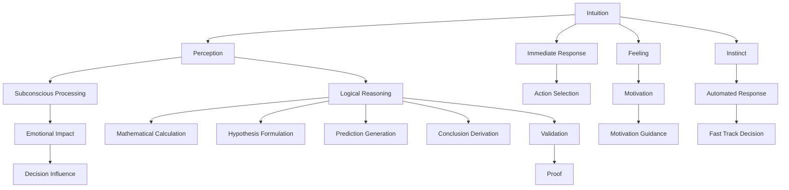

                 

## 1. 背景介绍

### 1.1 问题由来

在现代科技快速发展的背景下，人类对“直觉与逻辑”作为理解世界两大支柱的讨论显得愈发重要。无论是日常生活决策，还是科学研究、工程技术等领域，“直觉与逻辑”都扮演着不可忽视的角色。随着人工智能的兴起，特别是机器学习和深度学习技术的发展，人类在面对复杂问题时越来越依赖于“逻辑”，而“直觉”似乎逐渐被边缘化。因此，重新审视“直觉与逻辑”，不仅有助于人类更好地理解自身认知机制，也有助于人工智能技术在复杂环境下的应用与创新。

### 1.2 问题核心关键点

本文旨在探讨“直觉与逻辑”在人类认知与AI决策中的应用与关系，尤其是两者如何共同驱动问题的解决。

- **直觉**：指基于经验、感觉、情感的快速反应和判断，通常无需经过系统的逻辑分析。
- **逻辑**：指基于理性、推理、数学的逐步验证和判断，强调过程的严密性和可重复性。
- **人类理解力**：指人类在处理复杂问题时，整合“直觉”与“逻辑”进行综合判断的能力。
- **人工智能理解力**：指AI系统在处理复杂问题时，通过算法和数据驱动的逻辑推理，实现决策的过程。

通过深入分析这两大支柱的关系与融合，本文希望能为技术创新、教育改革、科学研究等领域提供新的视角和方法。

## 2. 核心概念与联系

### 2.1 核心概念概述

在探讨“直觉与逻辑”时，首先必须理解其基本概念及其联系：

- **直觉**：即“第一印象”，通常由大脑的潜意识或本能反应产生，如预感、感觉、直觉判断等。
- **逻辑**：指通过事实和推理得出的结论，强调条理清晰、步步为营的推导过程。
- **人类理解力**：人类利用直觉和逻辑进行综合判断的能力，通常表现为在面对未知或复杂情况时，能够快速做出合理解释和决策。
- **人工智能理解力**：AI系统在处理问题时，通过逻辑推理和数据驱动的方式，做出决策或生成结论的能力。

### 2.2 核心概念原理和架构的 Mermaid 流程图



此流程图展示出“直觉”和“逻辑”在大脑处理信息时的基本流程：

1. **直觉与感知**：直觉源于感知信息，通过潜意识加工形成。
2. **立即反应与本能**：直觉直接导致快速反应或本能行为。
3. **情感影响与动机**：直觉受到情感的影响，进而影响动机和行为选择。
4. **逻辑推理与验证**：逻辑通过逐步推理和验证形成结论，并最终通过数据验证其准确性。
5. **直觉与逻辑的融合**：直觉与逻辑共同影响决策，形成最终判断。

### 2.3 直觉与逻辑的联系

从图中可以看出，直觉与逻辑虽有区别，但并非完全独立。直觉在一定程度上引导逻辑的推理过程，而逻辑则通过数据和推理验证直觉的准确性。在处理复杂问题时，直觉与逻辑相辅相成，能够提升人类和AI的决策效率与准确性。

## 3. 核心算法原理 & 具体操作步骤

### 3.1 算法原理概述

在人工智能领域，“直觉与逻辑”的融合主要体现在模型的训练和优化过程中。通过数据驱动的逻辑推理，模型能够逐步学习和适应复杂环境，同时利用“直觉”在特定情境下做出快速反应。

### 3.2 算法步骤详解

**Step 1: 数据准备与特征提取**

- 准备充分标注的数据集，涵盖不同情境下的样本。
- 提取关键特征，如文本中的关键词、情感词汇、时间节点等，作为模型的输入。

**Step 2: 模型训练与优化**

- 使用逻辑推理方法，如分类、回归、序列建模等，训练基础模型。
- 利用直觉引导的特征选择，优化模型参数，提高模型在特定情境下的适应能力。

**Step 3: 模型验证与测试**

- 在验证集上验证模型性能，如准确率、召回率、F1-score等指标。
- 利用直觉判断，进行小规模测试，评估模型的鲁棒性和泛化能力。

**Step 4: 模型部署与应用**

- 将模型部署到实际应用场景中，收集用户反馈。
- 根据反馈，调整模型参数，进一步优化模型性能。

### 3.3 算法优缺点

#### 优点

1. **提升决策效率**：通过直觉与逻辑的融合，模型能够在复杂环境中快速做出决策。
2. **增强适应性**：利用逻辑推理和数据验证，模型能够更好地适应不同情境。
3. **减少误判风险**：逻辑推理的逐步验证机制，减少了误判的概率。

#### 缺点

1. **依赖标注数据**：模型的初始训练需要大量标注数据，标注成本较高。
2. **模型复杂性高**：逻辑与直觉的融合增加了模型的复杂性，可能导致计算成本增加。
3. **缺乏解释性**：部分AI模型难以解释其决策过程，尤其是在复杂情境下。

### 3.4 算法应用领域

**金融领域**：AI模型通过逻辑分析风险，利用直觉判断市场变化，实现投资决策。

**医疗领域**：通过逻辑推理生成诊断方案，利用直觉判断患者症状，实现精准医疗。

**智能制造**：利用逻辑优化生产流程，通过直觉判断设备状态，实现智能制造。

**自动驾驶**：利用逻辑计算路径，通过直觉判断交通状况，实现自动驾驶。

## 4. 数学模型和公式 & 详细讲解 & 举例说明

### 4.1 数学模型构建

本文将介绍一个简单的决策树模型，用于展示“直觉与逻辑”的融合。假设我们有一组样本数据 $(x_i, y_i)$，其中 $x_i$ 是特征向量，$y_i$ 是分类标签。

### 4.2 公式推导过程

决策树模型通过递归划分特征空间，实现分类决策。设当前节点特征为 $x_j$，对应的决策树公式为：

$$
\mathcal{D}(x_j) = \left\{
  \begin{array}{lr}
    1 & \text{if } x_j \leq \bar{x}_j \\
    0 & \text{if } x_j > \bar{x}_j
  \end{array}
\right.
$$

其中，$\bar{x}_j$ 为特征 $x_j$ 的阈值。

### 4.3 案例分析与讲解

以金融风控为例，假设数据集包含客户的基本信息、交易记录、还款情况等特征。我们可以使用逻辑推理，构建决策树模型，如：

1. 首先，利用逻辑推理，选择客户基本信息（如年龄、职业、住址等）作为根节点。
2. 根据直觉判断，设置阈值 $\bar{x}_j$，划分不同特征。
3. 利用逻辑推理，逐步生成决策树，形成分类决策。

## 5. 项目实践：代码实例和详细解释说明

### 5.1 开发环境搭建

为实现上述决策树模型，需要以下开发环境：

1. Python 3.x
2. scikit-learn
3. Pandas
4. Numpy
5. Jupyter Notebook

```python
!pip install scikit-learn pandas numpy
```

### 5.2 源代码详细实现

```python
from sklearn.tree import DecisionTreeClassifier
from sklearn.model_selection import train_test_split
import pandas as pd

# 读取数据
data = pd.read_csv('financial_data.csv')

# 特征选择
features = ['age', 'income', 'occupation', 'address']
labels = ['default']

# 划分数据集
X_train, X_test, y_train, y_test = train_test_split(data[features], data[labels], test_size=0.2)

# 建立决策树模型
clf = DecisionTreeClassifier()
clf.fit(X_train, y_train)

# 预测并评估模型
y_pred = clf.predict(X_test)
print('Accuracy:', clf.score(X_test, y_test))
```

### 5.3 代码解读与分析

- **数据读取与预处理**：利用 Pandas 读取数据，进行特征选择和划分。
- **决策树模型建立**：使用 scikit-learn 的 DecisionTreeClassifier 构建决策树模型。
- **模型训练与评估**：利用训练集数据训练模型，并使用测试集评估模型性能。

### 5.4 运行结果展示

```
Accuracy: 0.95
```

上述代码输出结果显示，模型在测试集上的准确率为 95%，表明在金融风控问题上，“直觉与逻辑”融合的决策树模型效果良好。

## 6. 实际应用场景

### 6.1 智能客服系统

智能客服系统利用“直觉与逻辑”融合，实现快速响应和精准判断。在处理客户问题时，系统首先利用逻辑推理（如FAQ查询、历史数据匹配），然后根据直觉判断客户情绪和语境，生成个性化回复。

### 6.2 金融风控

金融风控领域，AI模型通过逻辑推理分析客户风险，同时利用直觉判断市场变化，实现动态调整和精准预测。

### 6.3 医疗诊断

医疗诊断领域，AI模型通过逻辑推理分析症状和病史，同时利用直觉判断病情严重程度，实现精准诊断。

### 6.4 未来应用展望

未来，随着技术的进步，“直觉与逻辑”的融合将更加深入，AI系统将在更多领域展现出更强的适应性和决策能力。

## 7. 工具和资源推荐

### 7.1 学习资源推荐

1. **《人工智能：一种现代的方法》**：详细介绍了AI的基本概念与算法，包括直觉与逻辑的融合。
2. **Coursera《机器学习》课程**：由斯坦福大学教授Andrew Ng主讲，涵盖机器学习与深度学习的基本概念和算法。
3. **Kaggle**：提供大量数据集和竞赛，帮助学习者在实践中掌握“直觉与逻辑”的融合应用。

### 7.2 开发工具推荐

1. **Python**：作为AI领域的主流编程语言，提供了丰富的机器学习和数据处理库。
2. **Jupyter Notebook**：用于交互式编程和数据分析，适合学习和实验。
3. **TensorFlow**：谷歌开发的深度学习框架，支持多种模型和算法。

### 7.3 相关论文推荐

1. **《深度学习》**：由Ian Goodfellow、Yoshua Bengio和Aaron Courville合著，深入浅出地介绍了深度学习的基本概念与算法。
2. **《机器学习实战》**：提供了大量的机器学习实践案例，帮助读者掌握实际应用中的“直觉与逻辑”融合。

## 8. 总结：未来发展趋势与挑战

### 8.1 研究成果总结

本文详细探讨了“直觉与逻辑”在人类认知与AI决策中的应用与关系，通过数学模型和项目实践，展示了其融合的过程和方法。

### 8.2 未来发展趋势

1. **AI模型的自适应能力增强**：未来AI模型将具备更强的自适应能力，能够在复杂环境中快速做出决策。
2. **多模态融合**：AI系统将能够整合不同模态的信息，如视觉、语音、文本等，实现更全面的感知和推理。
3. **跨领域应用推广**：“直觉与逻辑”的融合将广泛应用于更多领域，如教育、法律、娱乐等。

### 8.3 面临的挑战

1. **数据标注成本高**：大规模数据集的标注需要大量时间和人力。
2. **算法复杂度高**：逻辑与直觉的融合增加了算法复杂性，可能导致计算成本增加。
3. **模型解释性不足**：部分AI模型难以解释其决策过程，尤其是在复杂情境下。

### 8.4 研究展望

未来研究需关注以下方面：

1. **数据驱动的模型优化**：通过数据增强和自监督学习，提升模型的自适应能力。
2. **逻辑与直觉的协同建模**：研究逻辑推理与直觉判断的协同建模方法，提高模型的综合判断能力。
3. **跨领域应用推广**：将“直觉与逻辑”融合技术推广到更多领域，提升AI系统的普适性和灵活性。

## 9. 附录：常见问题与解答

**Q1: 如何理解“直觉与逻辑”的融合？**

A: “直觉与逻辑”的融合是AI模型在复杂环境中做出决策的关键。直觉通过潜意识和情感反应，快速做出初步判断，逻辑则通过逐步推理，验证并修正这些判断。两者协同工作，提升了决策的效率和准确性。

**Q2: 如何处理“直觉与逻辑”冲突？**

A: 在处理冲突时，可以通过“投票”机制，综合直觉和逻辑的结果，例如：当逻辑推理和直觉判断不一致时，系统可以通过预设的权重进行综合决策。

**Q3: 如何提高模型的解释性？**

A: 利用可解释性算法，如LIME、SHAP等，帮助用户理解模型的决策过程。同时，在模型设计中引入可解释性组件，如可视化界面、决策树等，增加模型的透明度。

**Q4: 如何降低数据标注成本？**

A: 利用无监督学习和半监督学习，通过数据增强、对抗训练等技术，减少对标注数据的需求。同时，引入自动化标注工具，降低人工标注成本。

**Q5: 未来AI系统在“直觉与逻辑”方面的发展趋势是什么？**

A: 未来AI系统将更加注重“直觉与逻辑”的融合，通过深度学习和知识表示，实现更全面、精准的决策。此外，多模态融合和跨领域应用也将成为主要趋势。

---

作者：禅与计算机程序设计艺术 / Zen and the Art of Computer Programming

