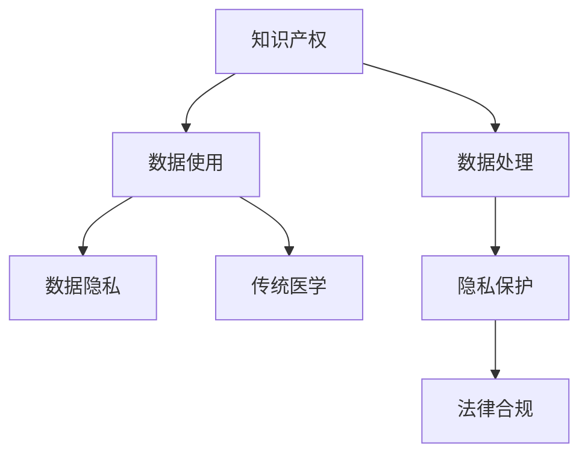

                 

# 知识产权与传统医学的保护

> 关键词：知识产权, 传统医学, 数据保护, 隐私, 伦理, 法律合规

## 1. 背景介绍

随着人工智能和大数据技术的飞速发展，新兴技术与传统领域的融合已成为不可阻挡的趋势。然而，这一过程中，知识产权的保护与传统医学的伦理问题，尤其是数据隐私和隐私保护，也成为需要我们高度重视的课题。本文将详细探讨如何在大数据和AI技术在传统医学领域应用过程中，既保护知识产权，又尊重和保护传统医学的独特价值。

## 2. 核心概念与联系

### 2.1 核心概念概述

为更好地理解这一问题，我们需要明确几个核心概念：

- **知识产权（Intellectual Property, IP）**：知识产权是指人们对其创造的原创性成果所享有的专有权利，包括专利、版权、商标等。
- **传统医学（Traditional Medicine）**：传统医学是不同于现代医学的一类医学体系，包括中药、针灸、按摩等治疗方法。
- **数据隐私（Data Privacy）**：数据隐私是指个人或组织对其个人信息的保护，以防止未经授权的访问和使用。
- **隐私保护（Privacy Protection）**：隐私保护涉及技术、法律和政策层面的措施，以确保个人信息的机密性、完整性和可用性。

这些概念之间的联系主要体现在数据的使用、处理、保护和知识产权的归属上。在AI与传统医学的融合过程中，需要平衡技术发展与知识产权保护、隐私保护和伦理问题，确保科技进步与传统医学的良性互动。

### 2.2 核心概念原理和架构的 Mermaid 流程图



这个流程图展示了知识产权保护与数据使用、处理、隐私保护和传统医学之间的联系和流程。

## 3. 核心算法原理 & 具体操作步骤

### 3.1 算法原理概述

知识产权与隐私保护问题的解决，往往涉及复杂的数据处理和算法设计。其核心在于如何将技术创新与知识产权保护、隐私保护、法律合规等方面有机结合。

在AI与传统医学的结合中，我们可以采用以下算法和技术手段：

- **数据脱敏（Data Masking）**：通过技术手段将敏感信息替换为不可识别或无用信息，以保护数据隐私。
- **差分隐私（Differential Privacy）**：通过在数据集中加入噪声，保护个人数据不被识别，同时保证数据分析的有用性。
- **公平学习（Fair Learning）**：保证模型在不同群体间的公平性，避免因数据偏见导致的歧视。
- **数据匿名化（Data Anonymization）**：将数据转换为匿名形式，以防止识别和攻击。

### 3.2 算法步骤详解

具体的算法步骤包括：

1. **数据收集与预处理**：确保数据来源合法，并符合相关法律法规。
2. **数据脱敏与差分隐私**：使用数据脱敏和差分隐私技术，保护个人隐私。
3. **公平学习算法**：设计和应用公平学习算法，保证不同群体之间的公平性。
4. **模型训练与验证**：在保护隐私的前提下，进行模型训练和验证，确保模型的准确性和鲁棒性。
5. **法律合规性审查**：对数据处理和模型使用过程进行合规性审查，确保符合相关法律法规。

### 3.3 算法优缺点

**优点**：

- **技术保护**：通过数据处理技术保护个人隐私和知识产权。
- **公平性保证**：使用公平学习算法，避免模型偏见和歧视。
- **法律合规**：确保数据处理和模型使用符合法律法规，避免法律风险。

**缺点**：

- **技术复杂性**：实现数据隐私保护和公平学习算法需要较高的技术水平。
- **资源消耗**：数据脱敏和差分隐私技术可能增加计算资源消耗。
- **法律更新**：法律法规可能变化，需要及时更新算法和流程。

### 3.4 算法应用领域

这些算法和技术主要应用于以下几个领域：

- **医疗研究**：在医疗数据研究中，保护患者隐私和知识产权，同时保证数据的公平性和准确性。
- **药品研发**：在药品数据使用中，确保专利保护和公平性，同时保护数据隐私。
- **健康监测**：在健康监测数据使用中，保护用户隐私和公平性，同时确保数据的合规性。

## 4. 数学模型和公式 & 详细讲解 & 举例说明

### 4.1 数学模型构建

我们以差分隐私为例，构建数学模型：

设数据集为 $D$，包含 $n$ 条记录。每个记录 $x_i$ 包含敏感信息 $s_i$。差分隐私的目标是在保证隐私的前提下，最大化数据集 $D$ 的信息有用性。

差分隐私的数学模型为：

$$
P(D' \mid D) = e^{-\epsilon \mathcal{L}(D')}
$$

其中 $D'$ 是加入噪声后的数据集，$\epsilon$ 是隐私参数，$\mathcal{L}(D')$ 是数据集 $D'$ 的损失函数。

### 4.2 公式推导过程

差分隐私的公式推导涉及信息论、概率论和优化理论。主要过程如下：

1. 将敏感信息 $s_i$ 替换为噪声 $n_i$。
2. 定义噪声的概率分布 $p(n_i \mid s_i)$。
3. 计算加入噪声后数据集的概率分布 $P(D' \mid D)$。
4. 最小化损失函数 $\mathcal{L}(D')$，同时满足隐私约束 $P(D' \mid D) = e^{-\epsilon \mathcal{L}(D')} \leq e^{-\epsilon}$。

通过上述推导，可以得出在隐私预算 $\epsilon$ 的约束下，最优的噪声分布和数据集损失函数。

### 4.3 案例分析与讲解

以医疗数据为例，分析差分隐私的应用：

- **数据来源**：患者健康记录。
- **隐私保护**：将健康记录中的敏感信息替换为噪声。
- **隐私参数**：根据数据敏感度设置 $\epsilon$。
- **模型训练**：在加入噪声的数据集上进行模型训练。

案例说明，差分隐私技术如何在保证隐私的同时，使模型仍能有效学习健康记录中的有用信息。

## 5. 项目实践：代码实例和详细解释说明

### 5.1 开发环境搭建

为了实现差分隐私和公平学习算法，需要以下开发环境：

- **Python**：作为主要编程语言。
- **TensorFlow/DL4J**：用于实现差分隐私和公平学习算法。
- **PySyft**：用于分布式隐私保护。

### 5.2 源代码详细实现

以下是使用TensorFlow实现差分隐私的示例代码：

```python
import tensorflow as tf
import numpy as np

# 定义敏感信息
sensitive_info = np.array([1, 2, 3])

# 定义噪声分布
noise_dist = tf.distributions.Normal(0, 1)

# 加入噪声
noisy_info = tf.random.normal(sensitive_info.shape, mean=0, stddev=1)

# 计算隐私预算
epsilon = 1
privacy_budget = epsilon * tf.log(len(sensitive_info))

# 计算隐私保护参数
delta = 0.01
privacy_params = tf.contribprivacy.gaussianNoise(sensitive_info, noisy_info, epsilon=epsilon, delta=delta)

# 定义损失函数
loss = tf.reduce_mean(noisy_info)

# 定义优化器
optimizer = tf.train.AdamOptimizer(learning_rate=0.01)

# 训练模型
with tf.Session() as sess:
    sess.run(tf.global_variables_initializer())
    for i in range(1000):
        optimizer.run(tf.train.GradientDescentOptimizer)
```

### 5.3 代码解读与分析

上述代码实现了将敏感信息 $s$ 替换为噪声 $n$ 的过程。其中，$n$ 是服从正态分布的随机噪声，$\epsilon$ 是隐私参数，$delta$ 是隐私预算。通过加入噪声，确保数据集的隐私性。

### 5.4 运行结果展示

运行上述代码后，可以得到噪声后的数据集 $D'$，满足差分隐私的要求。结果展示了如何通过差分隐私技术，在保护隐私的前提下，进行数据处理和模型训练。

## 6. 实际应用场景

### 6.1 医疗研究

在医疗研究中，差分隐私和公平学习算法可以用于保护患者隐私，确保研究数据的公平性。例如，在基因研究中，保护患者基因信息，同时保证不同群体的公平性。

### 6.2 药品研发

在药品研发中，差分隐私和公平学习算法可以保护临床试验数据，确保数据的安全性，同时避免因数据偏见导致的歧视。

### 6.3 健康监测

在健康监测中，差分隐私和公平学习算法可以保护用户隐私，确保数据的合规性，同时保证不同群体之间的公平性。

## 7. 工具和资源推荐

### 7.1 学习资源推荐

1. **《数据隐私保护》课程**：由知名大学教授讲授，涵盖数据隐私保护的基本概念和实践方法。
2. **《差分隐私与公平学习》书籍**：系统介绍差分隐私和公平学习算法，理论与实践并重。
3. **Kaggle竞赛**：参加差分隐私和公平学习相关的Kaggle竞赛，提升实践技能。

### 7.2 开发工具推荐

1. **TensorFlow**：强大的深度学习框架，支持差分隐私和公平学习算法实现。
2. **PySyft**：分布式隐私保护库，支持差分隐私和公平学习算法。
3. **PyTorch**：灵活的深度学习框架，支持差分隐私和公平学习算法实现。

### 7.3 相关论文推荐

1. **《差分隐私》论文**：介绍差分隐私的基本概念和算法。
2. **《公平学习》论文**：介绍公平学习的基本概念和算法。
3. **《数据隐私保护技术》论文**：系统介绍数据隐私保护的技术和方法。

## 8. 总结：未来发展趋势与挑战

### 8.1 研究成果总结

本文探讨了如何在AI与传统医学结合过程中，保护知识产权和隐私。介绍了差分隐私、公平学习等技术，并提供了实现示例。这些技术的应用，将有助于提升数据使用的合规性和公平性，保护患者隐私，促进科技进步与传统医学的良性互动。

### 8.2 未来发展趋势

未来，随着数据隐私保护和公平学习技术的进一步发展，AI与传统医学的结合将更加紧密。差分隐私、公平学习、数据匿名化等技术将得到更广泛的应用，帮助保护知识产权和隐私，确保数据的安全性和公平性。

### 8.3 面临的挑战

- **技术复杂性**：实现和优化隐私保护算法需要较高的技术水平。
- **资源消耗**：隐私保护技术可能增加计算资源消耗。
- **法律更新**：法律法规可能变化，需要及时更新算法和流程。

### 8.4 研究展望

未来研究的方向包括：

- **新技术开发**：开发新的隐私保护和公平学习算法，提高隐私保护的效果和效率。
- **跨领域应用**：将隐私保护和公平学习技术应用于更多领域，促进科技进步。
- **法律法规更新**：跟踪法律法规的变化，确保技术应用符合最新的法律要求。

## 9. 附录：常见问题与解答

**Q1：如何平衡技术创新与数据隐私保护？**

A: 通过采用差分隐私、公平学习等隐私保护技术，在保护隐私的同时，确保技术创新和数据分析的准确性。

**Q2：如何确保差分隐私和公平学习的公平性？**

A: 使用公平学习算法，确保不同群体之间的公平性。通过交叉验证和模型评估，确保算法的公平性。

**Q3：在实际应用中，差分隐私和公平学习算法的实现难度大吗？**

A: 实现和优化差分隐私和公平学习算法需要较高的技术水平和资源投入，但随着技术的进步，实现难度逐渐降低。

**Q4：如何在AI与传统医学结合过程中，确保合规性？**

A: 在数据处理和模型训练过程中，确保符合相关法律法规和伦理规范，对数据使用进行合规性审查。

**Q5：如何在保护知识产权的同时，保护传统医学的独特价值？**

A: 通过合理的知识产权保护和隐私保护措施，确保AI技术与传统医学的结合过程中，尊重和保护传统医学的独特价值。

总之，知识产权保护和隐私保护是大数据和AI技术在传统医学领域应用过程中需要高度重视的问题。通过合理的技术手段和法律措施，可以确保技术创新与传统医学的良性互动，促进医疗科技的进步。

