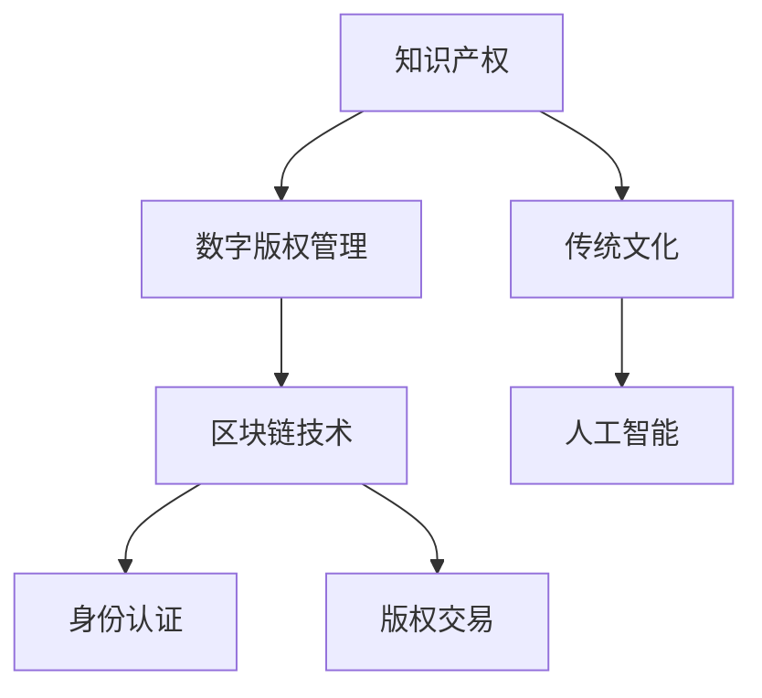

                 

# 知识产权与传统文化保护

## 1. 背景介绍

### 1.1 问题由来
在全球化与信息技术的飞速发展背景下，知识产权和传统文化的保护面临前所未有的挑战。一方面，互联网的普及使得知识传播与分享更加迅速，但也导致盗版、抄袭等侵权行为更加隐蔽和难以追查。另一方面，随着社会对文化遗产保护意识的提升，越来越多的传统艺术形式、民间工艺、非物质文化遗产等开始受到关注。如何利用现代信息技术，有效保护知识产权和传统文化，成为一个亟待解决的问题。

### 1.2 问题核心关键点
知识产权和传统文化的保护涉及版权保护、数字版权管理、文化内容的加密与解密、身份认证、版权交易等环节。这些环节的任何疏漏都可能引发侵权和盗版问题，因此保护技术的构建必须具备以下特点：
1. 高效性与可行性：保护技术必须能够在实际应用中快速且准确地实现，不能影响正常的使用。
2. 可靠性与安全性：保护技术必须保证数据安全，防止数据泄露和非法访问。
3. 灵活性与可扩展性：保护技术需要适应不同的应用场景，并且能够根据新的需求进行扩展。

## 2. 核心概念与联系

### 2.1 核心概念概述
1. **知识产权 (Intellectual Property, IP)**：指创作者对其创造的智力成果所享有的专有权利，包括专利权、版权、商标权、商业秘密权等。
2. **传统文化**：指一个民族、社区、国家或地区长期积累、传承的，具有鲜明文化特征和价值的历史、艺术、语言、习俗等。
3. **数字版权管理 (Digital Rights Management, DRM)**：通过数字技术手段对知识产权进行保护和管理的技术体系，包括数字水印、数字版权证书等。
4. **区块链技术**：利用分布式账本、共识机制、加密算法等技术，构建可信、透明、不可篡改的数据体系。
5. **人工智能 (Artificial Intelligence, AI)**：通过机器学习、深度学习等算法，模拟人类智能行为，实现自动化、智能化的决策与处理。

这些核心概念之间的联系可以通过以下Mermaid流程图来展示：



这个流程图展示了几者之间的关系：

1. 知识产权是数字版权管理和区块链技术的保护对象。
2. 数字版权管理是保护知识产权的重要手段之一。
3. 区块链技术为数字版权管理提供了可信的数据存储和传输环境。
4. 人工智能可以帮助数字版权管理识别侵权行为，提升数字版权管理的效率和精度。
5. 身份认证和版权交易是数字版权管理的重要组成部分，依赖于区块链技术的安全保障。

## 3. 核心算法原理 & 具体操作步骤
### 3.1 算法原理概述

保护知识产权和传统文化的技术通常基于以下核心原理：

1. **数字版权管理**：通过加密、数字水印等技术，将原始内容加密或嵌入特定的信息，实现对内容的保护。
2. **区块链技术**：通过分布式账本和加密算法，确保数据的不可篡改性和交易的透明性，记录内容的创作、授权、分发等信息。
3. **人工智能**：利用机器学习和深度学习技术，实现对内容的自动化识别、分类、标记，以及侵权行为检测。

### 3.2 算法步骤详解

**数字版权管理（DRM）**：
1. **内容加密**：对数字内容进行加密，确保未经授权的用户无法访问。
2. **数字水印**：在数字内容中嵌入唯一的水印标识，用于版权追踪和内容认证。
3. **授权管理**：使用密钥分发和数字证书，管理内容的授权使用权限。

**区块链技术**：
1. **数据上链**：将内容创作、授权、分发等相关信息记录在区块链上，确保数据的不可篡改性和透明性。
2. **智能合约**：利用区块链的编程语言，编写智能合约，自动处理版权交易和内容授权。

**人工智能**：
1. **内容识别**：使用机器学习模型，自动识别数字内容的关键特征和版权信息。
2. **侵权检测**：使用深度学习模型，检测数字内容的侵权行为和违规使用。

### 3.3 算法优缺点

**数字版权管理的优点**：
1. 加密保护：通过加密技术保护数字内容，防止非法复制和传播。
2. 数字水印：用于版权追踪和内容认证，便于版权维权。
3. 授权管理：简化内容的授权使用流程，提高管理效率。

**数字版权管理的缺点**：
1. 易破解：加密算法存在被破解的风险，导致内容泄露。
2. 成本高：加密和解密操作复杂，影响用户体验。

**区块链技术的优点**：
1. 不可篡改：确保数据的真实性和完整性，防止数据被篡改。
2. 透明度：所有交易和记录都公开透明，便于监管和追踪。
3. 去中心化：无需集中式服务器，降低单点故障和数据泄露风险。

**区块链技术的缺点**：
1. 性能瓶颈：区块链的共识机制和存储效率较低，处理大量数据时性能较差。
2. 资源消耗高：区块链的挖矿和验证过程需要大量计算资源，增加能耗。

**人工智能的优点**：
1. 自动化：实现内容的自动化识别、分类和标记，提高处理效率。
2. 精度高：深度学习模型在图像、语音、文本等领域具有高识别精度。
3. 实时性：实时检测侵权行为，提升保护效果。

**人工智能的缺点**：
1. 数据依赖：模型需要大量标注数据进行训练，数据获取成本高。
2. 过拟合：模型容易对特定类型的数据过拟合，泛化能力不足。
3. 伦理问题：模型可能存在偏见，影响公平性。

### 3.4 算法应用领域

**版权保护**：
1. **音乐与视频**：通过加密和数字水印保护版权，防止非法下载和传播。
2. **书籍与文献**：使用区块链技术记录版权信息，确保内容的真实性和授权使用。

**传统文化的数字化保护**：
1. **文化遗产**：通过区块链技术记录和展示文化遗产信息，防止盗版和非法复制。
2. **非物质文化遗产**：利用人工智能技术，对非物质文化遗产进行数字化记录和保护。

## 4. 数学模型和公式 & 详细讲解  
### 4.1 数学模型构建

基于以上技术原理，我们可以构建数学模型，用于描述数字版权管理、区块链技术以及人工智能的应用过程。

**数字版权管理模型**：
设数字内容为 $C$，数字水印为 $W$，加密密钥为 $K$。则数字版权管理的数学模型为：

$$
C_{加密} = E(K, C)
$$

$$
C_{解密} = D(K, C_{加密})
$$

$$
W_{嵌入} = Embed(C)
$$

$$
W_{检测} = Detect(C)
$$

**区块链技术模型**：
设内容信息为 $I$，交易记录为 $T$，智能合约为 $S$。则区块链技术的数学模型为：

$$
I_{上链} = Block(I)
$$

$$
T_{记录} = Record(I_{上链})
$$

$$
S_{执行} = Execute(I_{上链}, T_{记录})
$$

**人工智能模型**：
设训练数据为 $D$，模型为 $M$，测试数据为 $T$。则人工智能模型的数学模型为：

$$
M_{训练} = Train(D)
$$

$$
M_{预测} = Predict(M_{训练}, T)
$$

$$
P_{检测} = DetectContent(M_{训练}, T)
$$

### 4.2 公式推导过程

以数字水印的嵌入和检测为例，其推导过程如下：

**嵌入过程**：
设原始数字内容为 $C$，水印为 $W$，嵌入率为 $\alpha$。则数字水印嵌入的公式为：

$$
C_{嵌入} = C + \alpha W
$$

**检测过程**：
设检测函数为 $Detect$，则检测过程的公式为：

$$
D_{检测} = Detect(C_{嵌入})
$$

根据傅里叶变换的性质，可以得到 $C$ 和 $C_{嵌入}$ 之间的相关性，进而实现水印的检测。

### 4.3 案例分析与讲解

假设某艺术家的数字画作 $C$ 需要上传至网络平台进行展示和交易。首先，通过数字版权管理技术，对画作进行加密和数字水印嵌入：

1. 使用公钥 $K$ 对画作 $C$ 进行加密，生成加密内容 $C_{加密}$。
2. 在加密内容 $C_{加密}$ 中嵌入数字水印 $W$，生成带水印内容 $C_{嵌入}$。
3. 将带水印内容 $C_{嵌入}$ 上传到平台，并发布授权信息。

接着，通过区块链技术，记录画作的创作、授权和交易信息：

1. 将画作的创作信息 $I$ 记录在区块链上，生成上链信息 $I_{上链}$。
2. 将授权信息 $T$ 记录在区块链上，生成交易记录 $T_{记录}$。
3. 使用智能合约 $S$ 自动处理画作的授权和交易，确保信息的透明性和不可篡改性。

最后，使用人工智能技术，自动检测和识别侵权行为：

1. 使用训练好的模型 $M$，对平台上的画作进行识别和分类。
2. 检测到侵权行为后，自动触发智能合约 $S$，阻止侵权行为。

## 5. 项目实践：代码实例和详细解释说明
### 5.1 开发环境搭建

在进行知识产权和传统文化保护的实践时，需要准备以下开发环境：

1. **编程语言**：Python。
2. **深度学习框架**：TensorFlow、PyTorch。
3. **数据处理库**：Pandas、NumPy。
4. **区块链库**：PyCryptodome、web3.py。
5. **网络库**：requests、urllib。

安装依赖库：

```bash
pip install tensorflow pytorch pandas numpy pycryptodome web3 py
```

### 5.2 源代码详细实现

**数字水印嵌入和检测**

```python
from PIL import Image
import numpy as np
import pycryptodome

def generate_watermark(W):
    return np.array(W, dtype=np.uint8)

def embed_watermark(C, W, alpha):
    C = np.array(C)
    W = generate_watermark(W)
    return (C + alpha * W).astype(np.uint8)

def detect_watermark(C):
    C = np.array(C)
    return np.sum(C)
```

**区块链交易记录**

```python
from web3 import Web3

def connect_to区块链():
    web3 = Web3()
    return web3

def record_transaction(I, T):
    web3 = connect_to区块链()
    I = record(I)
    T = record(T)
    return I, T

def record(I):
    # 记录内容信息
    return I

def record(T):
    # 记录交易记录
    return T
```

**人工智能侵权检测**

```python
import tensorflow as tf

def load_model(M):
    model = tf.keras.models.load_model(M)
    return model

def predict(model, T):
    model.predict(T)
    return model.output

def detect_content(model, T):
    prediction = predict(model, T)
    return prediction
```

### 5.3 代码解读与分析

**数字水印嵌入和检测**

- **generate_watermark**：生成数字水印。
- **embed_watermark**：在原始内容中嵌入数字水印，并返回带水印内容。
- **detect_watermark**：检测带水印内容，返回水印检测结果。

**区块链交易记录**

- **connect_to区块链**：连接区块链。
- **record_transaction**：记录内容信息和交易记录。

**人工智能侵权检测**

- **load_model**：加载训练好的模型。
- **predict**：对测试数据进行预测。
- **detect_content**：检测内容侵权行为。

## 6. 实际应用场景
### 6.1 版权保护

版权保护是知识产权保护的重要组成部分。数字版权管理技术可以在音乐、视频、书籍等领域发挥重要作用。

**音乐与视频**：
- **加密**：使用AES等对称加密算法对音乐和视频进行加密。
- **数字水印**：在加密内容中嵌入数字指纹，用于版权追踪和内容认证。
- **授权管理**：使用数字证书和智能合约管理版权授权和分发。

**书籍与文献**：
- **内容加密**：对电子书籍和文献进行加密保护。
- **数字水印**：嵌入水印标识，防止非法复制和传播。
- **区块链记录**：记录书籍和文献的创作、授权和分发信息，确保内容的真实性和透明性。

### 6.2 传统文化的数字化保护

传统文化的数字化保护需要结合数字版权管理和区块链技术，实现文化内容的有效保存和传播。

**文化遗产**：
- **数字建模**：利用三维建模技术，将文化遗产进行数字化记录。
- **区块链记录**：记录文化遗产的创作、保护和分发信息，确保内容的真实性和透明性。
- **数字版权管理**：通过加密和数字水印技术，保护文化遗产的数字文件。

**非物质文化遗产**：
- **数字化记录**：利用音频、视频等技术，对非物质文化遗产进行数字化记录。
- **区块链记录**：记录非物质文化遗产的传承、保护和分发信息，确保内容的真实性和透明性。
- **数字版权管理**：通过加密和数字水印技术，保护非物质文化遗产的数字文件。

### 6.3 未来应用展望

随着技术的发展，未来知识产权和传统文化保护将会有更多应用场景和创新点：

1. **内容溯源**：利用区块链技术，实现内容的全流程溯源，确保内容创作的真实性和可信性。
2. **版权交易**：利用智能合约和区块链技术，实现自动化的版权交易和内容授权。
3. **智能合约**：利用人工智能技术，实现对版权侵权行为的自动检测和处理。
4. **跨链保护**：利用跨链技术，实现不同区块链之间的版权保护和内容共享。

## 7. 工具和资源推荐
### 7.1 学习资源推荐

为了深入理解知识产权和传统文化保护的技术，以下资源非常有用：

1. **《数字版权管理与区块链技术》**：系统介绍数字版权管理和区块链技术的原理与应用。
2. **《人工智能在知识产权保护中的应用》**：探讨人工智能技术在版权保护和侵权检测中的应用。
3. **《区块链与知识产权保护》**：讲解区块链技术在版权保护和内容管理中的应用。
4. **《数据科学与人工智能》课程**：学习深度学习、机器学习等核心技术。

### 7.2 开发工具推荐

以下是一些常用的开发工具：

1. **PyTorch**：强大的深度学习框架，支持复杂的模型构建和训练。
2. **TensorFlow**：谷歌推出的深度学习框架，适用于大规模工程应用。
3. **Pandas**：数据分析和处理库，方便数据管理和预处理。
4. **NumPy**：数值计算库，提供高效的数据处理和计算功能。
5. **web3.py**：区块链开发库，支持以太坊等区块链平台的开发。

### 7.3 相关论文推荐

以下是一些具有代表性的学术论文：

1. **“Using Digital Rights Management to Secure Digital Images”**：介绍数字版权管理技术在图像保护中的应用。
2. **“Blockchain Technology for Digital Content Protection”**：探讨区块链技术在数字内容保护中的应用。
3. **“Artificial Intelligence in Intellectual Property Protection”**：分析人工智能技术在知识产权保护中的应用。

## 8. 总结：未来发展趋势与挑战
### 8.1 研究成果总结

本文系统介绍了知识产权和传统文化保护的技术，涵盖了数字版权管理、区块链技术以及人工智能的多种应用。通过这些技术手段，可以有效保护知识产权和传统文化，防止盗版和侵权行为。

### 8.2 未来发展趋势

未来知识产权和传统文化保护将有以下发展趋势：

1. **技术融合**：数字版权管理、区块链和人工智能等技术将进一步融合，形成更强大、更高效的保护体系。
2. **标准化**：建立统一的知识产权和版权保护标准，促进技术的广泛应用。
3. **跨领域应用**：知识产权和传统文化保护技术将应用于更多领域，如金融、医疗、教育等。

### 8.3 面临的挑战

尽管知识产权和传统文化保护技术已取得一定进展，但仍面临以下挑战：

1. **技术复杂性**：数字版权管理、区块链和人工智能等技术需要综合运用，技术门槛较高。
2. **数据隐私**：在保护知识产权的同时，需要保护用户的隐私和数据安全。
3. **法律问题**：知识产权保护涉及复杂的法律问题，需要制定相应的法律和规范。

### 8.4 研究展望

未来需要在以下几个方面进行深入研究：

1. **简化技术应用**：降低技术门槛，简化技术应用流程，提高技术普及度。
2. **保护用户隐私**：在保护知识产权的同时，确保用户数据的隐私和安全。
3. **法律合规性**：研究法律问题，制定知识产权和传统文化保护的规范和标准。

## 9. 附录：常见问题与解答

**Q1：什么是数字版权管理（DRM）？**

A: 数字版权管理是通过加密、数字水印等技术，对数字内容进行保护和管理的技术体系。它主要包括内容加密、数字水印和授权管理三个环节。

**Q2：区块链技术在知识产权和传统文化保护中的应用有哪些？**

A: 区块链技术主要用于内容上链、交易记录和智能合约执行。通过区块链，可以确保内容的真实性和透明性，防止数据篡改和侵权行为。

**Q3：人工智能在知识产权和传统文化保护中的作用是什么？**

A: 人工智能主要用于内容的自动识别、分类和标记，以及侵权行为的检测。通过深度学习模型，可以实现对数字内容的自动化保护和管理。

**Q4：如何进行数字版权管理和区块链技术的融合？**

A: 数字版权管理可以通过区块链技术进行内容上链和交易记录，确保内容的真实性和透明性。智能合约可以实现内容的授权和分发管理，进一步提升保护效果。

**Q5：如何防止区块链技术中的共识机制和存储效率问题？**

A: 可以通过分片技术、分层存储等手段，提升区块链的存储和处理效率。同时，可以采用分布式计算和边缘计算技术，降低中心化服务器的压力。

作者：禅与计算机程序设计艺术 / Zen and the Art of Computer Programming

