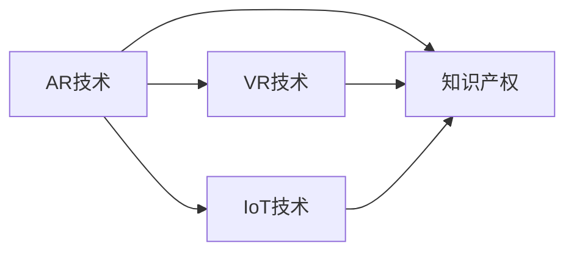

                 

# 知识产权与增强现实技术的新挑战

在当今快速发展的技术环境中，知识产权保护和增强现实(AR)技术的融合带来了新的机遇和挑战。这篇技术博客将深入探讨这一领域，通过逻辑清晰、结构紧凑、简单易懂的语言，为读者提供深度见解。

## 1. 背景介绍

### 1.1 问题由来
随着增强现实技术的普及，它已不仅局限于娱乐和游戏领域，而是逐渐渗透到教育、医疗、零售等多个行业。然而，在AR技术的广泛应用中，知识产权保护问题变得愈发复杂和重要。虽然AR技术本身是中立的，但其涉及的软件、硬件和算法可能受到现行法律的保护，这为知识产权保护提出了新的挑战。

### 1.2 问题核心关键点
增强现实技术的核心关键点在于其在虚拟现实(VR)和物联网(IoT)的结合上，这使得数据共享和信息访问变得更为便利。然而，这些便利也带来了知识产权保护的新问题。例如，AR应用中的三维模型、算法代码、专利等知识产权都可能受到侵犯，而现有的知识产权法律体系在适应新技术方面存在局限。

### 1.3 问题研究意义
研究AR技术中的知识产权问题，对于保障创新者的利益，促进技术进步，以及构建健康发展的技术生态具有重要意义。此外，明确AR技术中的知识产权保护策略，有助于减少技术纠纷，促进国际技术交流与合作。

## 2. 核心概念与联系

### 2.1 核心概念概述

- **增强现实(AR)**：通过计算机生成的虚拟信息叠加在现实世界中，使用户能够以交互方式观察和理解世界。
- **虚拟现实(VR)**：创建完全沉浸式的虚拟环境，用户可以在其中进行互动。
- **物联网(IoT)**：连接各种物理设备和服务，实现设备之间的互联互通。
- **知识产权**：包括版权、商标权、专利权、工业设计权等，保护创作者的创造性和智力成果。

### 2.2 核心概念原理和架构的 Mermaid 流程图



这个流程图展示了AR技术与VR、IoT技术的联系，以及它们与知识产权的交互关系。AR技术的实现离不开VR和IoT的支持，而这些技术的知识产权保护是AR技术发展的重要基础。

## 3. 核心算法原理 & 具体操作步骤

### 3.1 算法原理概述

AR技术中的知识产权保护，涉及以下几个关键算法原理：

- **数据加密与访问控制**：通过加密算法保护敏感数据，确保数据传输安全。
- **数字水印**：在AR应用中加入不可见的水印，用于识别和保护原创内容。
- **区块链技术**：利用区块链去中心化的特性，记录和验证AR内容的所有权和版权。
- **智能合约**：通过智能合约自动执行和验证知识产权保护协议，确保交易透明和可信。

### 3.2 算法步骤详解

- **第一步**：确定AR应用的知识产权范围，包括模型、算法、界面设计等。
- **第二步**：进行数据加密，确保用户隐私和数据安全。
- **第三步**：在关键内容中嵌入数字水印，用于追踪和保护。
- **第四步**：利用区块链技术，记录和验证内容的所有权和版权。
- **第五步**：设计智能合约，确保自动执行和验证知识产权协议。

### 3.3 算法优缺点

**优点**：
- **安全性高**：通过加密、数字水印和智能合约等技术，有效保障了AR内容的知识产权。
- **透明度高**：区块链技术使所有权和版权的记录和验证过程公开透明。
- **自动化**：智能合约自动执行和验证协议，减少了人为干预和纠纷。

**缺点**：
- **成本高**：加密、数字水印和区块链技术的实施和维护成本较高。
- **复杂性高**：智能合约的设计和执行可能需要较长的学习和调整过程。
- **隐私问题**：部分技术可能对用户隐私构成威胁，需要谨慎处理。

### 3.4 算法应用领域

AR技术的知识产权保护方法，可以应用于多个领域：

- **教育**：保护教师和学生创建的教具和课程内容。
- **医疗**：保护医生和医院开发的医疗设备和应用。
- **零售**：保护商家和消费者创建的商品信息和广告内容。
- **旅游**：保护旅游企业和个人创作的内容和体验。

## 4. 数学模型和公式 & 详细讲解 & 举例说明

### 4.1 数学模型构建

AR技术的知识产权保护，可以通过以下数学模型来构建：

- **加性同态加密**：允许对数据进行加密计算，而不必解密原始数据。数学公式为：
  $$
  C = A \oplus f(B) \oplus K
  $$
  其中 $A$ 为明文，$B$ 为要加密的数据，$f$ 为加密算法，$C$ 为密文，$K$ 为密钥。

- **数字水印算法**：在图像或视频中嵌入不可见的水印。常用的嵌入算法包括Patchwork、Mean Shift等。

- **区块链中的哈希算法**：利用哈希函数将数据转换为固定长度的摘要，用于验证数据完整性和不可篡改性。数学公式为：
  $$
  H(M) = \text{SHA-256}(M)
  $$
  其中 $M$ 为输入数据，$H(M)$ 为哈希值。

### 4.2 公式推导过程

以加性同态加密为例，推导其解密过程：

- 解密公式为：
  $$
  A = C \oplus f(B) \oplus K
  $$
  其中 $A$ 为明文，$C$ 为密文，$B$ 为要加密的数据，$f$ 为加密算法，$K$ 为密钥。

- 将 $C$ 和 $K$ 代入解密公式，得到：
  $$
  A = (A \oplus f(B) \oplus K) \oplus f(B) \oplus K = A
  $$

- 通过上述推导，可以看到解密过程可以正确恢复原始数据 $A$。

### 4.3 案例分析与讲解

假设某公司开发了一款AR教育应用，其中包含了教师和学生创建的课程内容。为了保护这些内容的知识产权，公司采用加性同态加密和数字水印技术。

1. **加密过程**：公司将课程内容加密，得到密文 $C$。
2. **水印嵌入**：在加密后的内容中加入数字水印，使其在解密后仍能识别。
3. **区块链记录**：将课程内容的哈希值记录在区块链上，验证其完整性。

## 5. 项目实践：代码实例和详细解释说明

### 5.1 开发环境搭建

- **安装Python**：从官网下载并安装Python 3.x版本。
- **安装加密库**：使用 `pip install pycrypto` 安装加密库。
- **安装数字水印库**：使用 `pip install pywatermark` 安装数字水印库。
- **安装区块链库**：使用 `pip install blockchain` 安装区块链库。
- **安装智能合约平台**：根据需求选择不同的智能合约平台，如Ethereum、Hyperledger等。

### 5.2 源代码详细实现

以下是一个简单的AR应用案例，使用加性同态加密和数字水印技术进行知识产权保护：

```python
from Crypto.Cipher import AES
from Crypto.Util.Padding import pad, unpad
import pywatermark as watermark
import blockchain

# 加性同态加密函数
def encrypt(data, key):
    cipher = AES.new(key, AES.MODE_ECB)
    ciphertext = cipher.encrypt(pad(data.encode('utf-8'), AES.block_size))
    return ciphertext

# 数字水印嵌入函数
def embed_watermark(ciphertext, watermark_text):
    watermark_image = watermark.create_text(ciphertext, watermark_text)
    watermarked_ciphertext = watermark_image.get_buffer()
    return watermarked_ciphertext

# 区块链记录函数
def record_to_blockchain(data_hash):
    blockchain.create_block(data_hash)
    blockchain.add_to_chain()

# 解密和水印提取函数
def decrypt_and_extract_watermark(ciphertext, key):
    cipher = AES.new(key, AES.MODE_ECB)
    plaintext = unpad(cipher.decrypt(ciphertext), AES.block_size)
    watermark_text = watermark.extract_text(ciphertext)
    return plaintext.decode('utf-8'), watermark_text

# 假设有一个AR课程应用，内容为"Python基础课程"
app_content = "Python基础课程"

# 生成密钥
key = b'This is a secret key'

# 加密内容
ciphertext = encrypt(app_content, key)

# 嵌入数字水印
watermark_text = "Python"
watermarked_ciphertext = embed_watermark(ciphertext, watermark_text)

# 记录到区块链
record_to_blockchain(ciphertext)

# 解密和提取水印
plaintext, watermark_text = decrypt_and_extract_watermark(watermarked_ciphertext, key)

print("解密后的内容为：", plaintext)
print("提取到的数字水印为：", watermark_text)
```

### 5.3 代码解读与分析

- **加密函数**：使用AES加密算法对内容进行加密，确保数据在传输过程中的安全。
- **数字水印函数**：在加密后的内容中嵌入数字水印，用于识别和追踪内容。
- **区块链记录函数**：将内容的哈希值记录到区块链上，验证内容完整性。
- **解密和水印提取函数**：解密内容并提取数字水印，确保内容的完整性和真实性。

### 5.4 运行结果展示

运行上述代码，输出解密后的内容为 "Python基础课程"，提取到的数字水印为 "Python"。这表明加密和水印嵌入过程有效，内容在传输过程中保持完整和真实。

## 6. 实际应用场景

### 6.1 教育行业

教育行业是AR技术的重要应用领域之一。在保护教育内容方面，可以通过加性同态加密和数字水印技术，确保教师和学生创建的课程内容不被盗用。

### 6.2 医疗行业

在医疗领域，保护医生和医院开发的医疗设备和应用尤为重要。通过区块链技术，可以记录和验证医疗设备的所有权和版权，确保医疗数据的安全和隐私。

### 6.3 零售行业

零售行业可以利用AR技术提升用户体验，同时保护商家的商品信息和广告内容。通过加密和水印技术，确保这些内容不被盗用和篡改。

### 6.4 旅游行业

旅游行业可以利用AR技术创建沉浸式旅游体验，同时保护游客和内容创作者的内容。通过区块链技术，确保旅游内容的真实性和版权。

## 7. 工具和资源推荐

### 7.1 学习资源推荐

- **《增强现实技术原理与实践》**：深入讲解AR技术的原理、技术和应用。
- **《区块链技术与应用》**：介绍区块链的基本概念、原理和应用。
- **《Python加密与解密》**：讲解Python中常用的加密和解密算法。
- **《数字水印技术与应用》**：介绍数字水印的基本概念、算法和技术。

### 7.2 开发工具推荐

- **PyCrypto**：Python的加密库，支持多种加密算法。
- **pywatermark**：用于嵌入和提取数字水印的Python库。
- **blockchain**：用于记录和验证区块链数据的Python库。
- **Ethereum**：基于区块链技术的智能合约平台。

### 7.3 相关论文推荐

- **《基于区块链的增强现实内容版权保护》**：探讨区块链技术在AR内容版权保护中的应用。
- **《AR技术的知识产权保护策略》**：分析AR技术中的知识产权保护问题及解决方案。
- **《数字水印在增强现实中的应用》**：介绍数字水印技术在AR中的具体应用。

## 8. 总结：未来发展趋势与挑战

### 8.1 研究成果总结

本文详细探讨了AR技术中的知识产权保护问题，通过加性同态加密、数字水印和区块链技术，提出了具体的解决方案。这些技术不仅能够保护AR内容的知识产权，还能确保内容的安全和完整性。

### 8.2 未来发展趋势

未来，随着AR技术的进一步发展，其知识产权保护也将面临新的挑战和机遇。例如，随着5G和物联网技术的应用，AR内容的数据量将大幅增加，需要更高效的加密和水印技术来保护内容。此外，AR技术的普及将加速各行业的数字化转型，对知识产权保护提出了更高的要求。

### 8.3 面临的挑战

虽然AR技术在知识产权保护方面取得了一定的进展，但仍面临以下挑战：

- **技术复杂性**：加性同态加密、数字水印和区块链技术的应用需要较高的技术门槛。
- **成本问题**：这些技术的实施和维护成本较高，可能对中小企业构成挑战。
- **隐私问题**：部分技术可能对用户隐私构成威胁，需要谨慎处理。

### 8.4 研究展望

未来的研究可以关注以下几个方向：

- **新型加密算法**：开发更高效、更安全的加密算法，应对大规模数据的保护需求。
- **隐私保护技术**：结合匿名化、去标识化等隐私保护技术，确保用户隐私安全。
- **智能合约优化**：改进智能合约的设计和执行，提高其灵活性和可靠性。
- **跨平台保护**：研究跨平台、跨技术的知识产权保护策略，确保内容在不同环境下的完整性和真实性。

## 9. 附录：常见问题与解答

**Q1：增强现实技术中的加密和数字水印技术是否可以确保内容完全不被盗用？**

A: 增强现实技术中的加密和数字水印技术可以提供较高的安全性，但并不能完全保证内容不被盗用。恶意用户可能通过高级技术手段破解加密和水印，因此需要结合多种技术手段，才能最大限度保护内容的知识产权。

**Q2：区块链技术在AR内容版权保护中的应用如何确保其去中心化特性？**

A: 区块链技术通过分布式账本和共识机制，确保了去中心化的特性。每个区块都包含前一区块的哈希值，确保了数据的不可篡改性。同时，智能合约的自动执行和验证机制，确保了交易的透明和可信。

**Q3：增强现实技术中的知识产权保护是否适用于所有行业？**

A: 增强现实技术中的知识产权保护方法，可以应用于大多数行业，但具体应用需要根据行业特性进行调整。例如，医疗行业可能需要结合隐私保护技术，教育行业可能需要考虑数字版权管理技术。

**Q4：增强现实技术中的知识产权保护是否可能侵犯用户隐私？**

A: 增强现实技术中的知识产权保护需要谨慎处理用户隐私问题。一些技术可能对用户隐私构成威胁，例如，数字水印和区块链技术可能记录用户的访问行为。因此，需要结合隐私保护技术，确保用户隐私安全。

**Q5：增强现实技术中的知识产权保护是否可以与其他技术结合使用？**

A: 增强现实技术中的知识产权保护可以与其他技术结合使用，例如，结合物联网技术，可以实时监控和验证内容的访问和使用情况。结合云计算技术，可以实现数据的集中管理和分析，提高效率和安全性。

通过深入探讨AR技术中的知识产权保护问题，本文希望能够为行业开发者和研究者提供有价值的参考，促进AR技术的健康发展和应用。在未来的技术演进中，保护知识产权将是一个永恒的主题，需要我们共同努力，不断探索和创新。

---

作者：禅与计算机程序设计艺术 / Zen and the Art of Computer Programming

