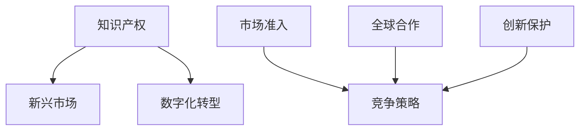

                 

# 知识产权与新兴市场的机遇挑战

> 关键词：知识产权,新兴市场,数字技术,数字化转型,市场准入,全球合作,创新保护,竞争策略

## 1. 背景介绍

### 1.1 问题由来
随着数字技术的发展，知识产权问题在新兴市场中变得日益复杂。全球化的市场准入、多样化的技术标准和不断更新的法律体系，使得企业在海外运营时面临更多的知识产权挑战。同时，知识产权问题也成为了新兴市场数字化转型中的关键障碍，对企业竞争策略和市场扩展具有重大影响。因此，如何在新兴市场中有效管理和保护知识产权，是当前企业和技术开发者关注的重点。

### 1.2 问题核心关键点
本文将重点讨论以下关键点：
1. 新兴市场中知识产权保护现状及挑战。
2. 数字技术对知识产权保护的影响和机遇。
3. 企业在新兴市场中的知识产权管理策略。
4. 全球合作与区域性知识产权保护机制的构建。

## 2. 核心概念与联系

### 2.1 核心概念概述

为更好地理解知识产权与新兴市场的机遇挑战，本节将介绍几个密切相关的核心概念：

- 知识产权（Intellectual Property, IP）：包括专利、商标、版权、商业秘密等法律保护形式，用以保护创作者对其智力劳动成果的专有权利。
- 新兴市场（Emerging Markets）：通常指发展中国家或经济转型国家，包括中国、印度、巴西、俄罗斯等，这些市场具有高速增长的经济潜力。
- 数字化转型（Digital Transformation）：指通过数字技术和信息化的手段，推动企业运营模式、业务流程和服务模式的变革，以提升企业竞争力和市场响应速度。
- 市场准入（Market Access）：指企业进入新市场所需符合的法律、监管和市场条件，包括知识产权要求。
- 全球合作（Global Cooperation）：指各国政府和国际组织通过合作，共同制定和执行知识产权保护标准，促进全球范围内的知识产权保护。
- 创新保护（Innovation Protection）：指通过法律和技术手段，保护创新成果不被侵权，确保创新者的合法权益。
- 竞争策略（Competitive Strategy）：指企业在市场竞争中采取的策略和措施，包括知识产权策略。

这些核心概念之间的逻辑关系可以通过以下Mermaid流程图来展示：



这个流程图展示了知识产权与新兴市场、数字化转型、市场准入、全球合作、创新保护、竞争策略之间的关系：

1. 知识产权是新兴市场和数字化转型的基础。
2. 市场准入和全球合作是新兴市场中知识产权管理的重要方面。
3. 创新保护是企业竞争策略的关键组成部分。
4. 竞争策略在各个环节都起到了核心作用。

## 3. 核心算法原理 & 具体操作步骤
### 3.1 算法原理概述

在新兴市场中，知识产权管理和保护涉及法律、技术、经济等多个维度，需要跨学科、跨文化的协作。以下是基于监督学习的知识产权管理流程：

1. **知识产权评估**：通过大数据和机器学习技术，评估新兴市场中知识产权的现状和趋势。
2. **知识产权监测**：利用智能算法实时监控新兴市场的知识产权动态，识别侵权风险。
3. **知识产权风险管理**：基于风险评估结果，制定和实施相应的风险管理策略。
4. **知识产权维权**：通过法律手段，保护企业的知识产权权益。

### 3.2 算法步骤详解

以下是基于监督学习的知识产权管理操作步骤：

**Step 1: 数据收集与清洗**
- 收集新兴市场的专利申请、商标注册、版权登记等数据。
- 清洗数据，去除重复、无效信息，确保数据质量。

**Step 2: 特征提取**
- 使用自然语言处理技术，从法律文本中提取关键词、实体、关系等特征。
- 利用机器学习算法，进行特征选择和降维。

**Step 3: 模型训练**
- 根据历史数据，训练监督学习模型，如SVM、随机森林、神经网络等。
- 使用交叉验证等方法，评估模型性能，调整超参数。

**Step 4: 风险评估**
- 使用训练好的模型，评估新兴市场中的知识产权风险。
- 对高风险领域进行重点监控，预测潜在的侵权行为。

**Step 5: 风险管理**
- 根据风险评估结果，制定相应的风险管理策略，如预警机制、专利防御策略等。
- 监控风险管理策略的执行情况，调整策略以应对新的威胁。

**Step 6: 维权与执法**
- 在发现侵权行为时，通过法律手段进行维权，如申请禁令、提起诉讼等。
- 与当地执法机构合作，确保侵权行为的及时处理。

### 3.3 算法优缺点

基于监督学习的知识产权管理方法具有以下优点：
1. 数据驱动：通过大数据和机器学习技术，客观评估知识产权风险。
2. 实时性：实时监控新兴市场的知识产权动态，及时发现和处理侵权行为。
3. 规模化：适用于新兴市场中大量的知识产权数据，提高管理效率。
4. 精准性：通过特征提取和模型训练，提高风险评估的准确性。

同时，该方法也存在以下局限性：
1. 数据依赖：依赖于高质量的数据集，数据的获取和清洗过程复杂且耗时。
2. 法律适用性：新兴市场的法律体系多样，不同法律环境下的数据模型需要单独构建。
3. 算法复杂性：机器学习模型的训练和调参过程复杂，对专业技能要求较高。
4. 技术限制：机器学习模型无法完全替代法律专业人士的判断，存在误判风险。

尽管存在这些局限性，但监督学习在新兴市场中依然具有广泛的应用前景，特别是在知识产权管理和保护中，能够提供有力的技术支持。未来相关研究的重点在于如何进一步提高模型的可解释性和适用性，同时解决数据依赖和法律适用性问题。

### 3.4 算法应用领域

基于监督学习的知识产权管理方法，在以下领域中得到了广泛的应用：

- **专利管理**：通过机器学习算法评估专利申请的质量和创新性，预测专利授权的概率。
- **商标监控**：利用自然语言处理技术，实时监控商标在社交媒体和互联网上的使用情况，预防侵权。
- **版权保护**：通过图像识别和文本分析技术，识别和追踪版权作品的使用情况，防止盗版。
- **商业秘密保护**：利用机器学习算法分析内部文档和通信，识别潜在的商业秘密泄露风险。

此外，该方法还被创新性地应用于供应链管理、市场准入分析、国际贸易等多个场景中，为企业的国际化运营提供了新的技术手段。

## 4. 数学模型和公式 & 详细讲解 & 举例说明（备注：数学公式请使用latex格式，latex嵌入文中独立段落使用 $$，段落内使用 $)
### 4.1 数学模型构建

本文将以专利质量评估为例，展示监督学习在新兴市场中知识产权管理的应用。

假设我们有 $N$ 个专利申请，每个申请包含 $D$ 个特征，记为 $\{x_i\}_{i=1}^N$，其中 $x_{ij}$ 表示第 $i$ 个申请的第 $j$ 个特征。设专利申请的质量评分为 $y_i$，其中 $y_i \in [0,1]$，1表示高质量申请，0表示低质量申请。构建专利质量评估的监督学习模型，目标是找到最优的模型参数 $\theta$，使得预测值 $\hat{y}_i$ 尽可能接近真实值 $y_i$。

### 4.2 公式推导过程

设专利质量评估的损失函数为交叉熵损失：

$$
\ell(y_i,\hat{y}_i) = -y_i\log(\hat{y}_i) - (1-y_i)\log(1-\hat{y}_i)
$$

在 $N$ 个样本上，经验风险为：

$$
\mathcal{L}(\theta) = \frac{1}{N}\sum_{i=1}^N \ell(y_i,\hat{y}_i)
$$

最小化损失函数 $\mathcal{L}(\theta)$，得到模型参数 $\theta^*$ 的求解过程如下：

$$
\theta^* = \mathop{\arg\min}_{\theta} \mathcal{L}(\theta)
$$

使用梯度下降算法，损失函数对参数 $\theta$ 的梯度为：

$$
\frac{\partial \mathcal{L}(\theta)}{\partial \theta} = \frac{1}{N}\sum_{i=1}^N \left[\frac{y_i}{\hat{y}_i} - \frac{1-y_i}{1-\hat{y}_i}\right] \frac{\partial \hat{y}_i}{\partial \theta}
$$

其中 $\frac{\partial \hat{y}_i}{\partial \theta}$ 可以通过反向传播算法计算。

### 4.3 案例分析与讲解

以一项专利质量评估的实际案例为例，分析监督学习模型在新兴市场中的应用：

1. **数据准备**：收集新兴市场中大量专利申请数据，包括申请号、发明人、申请时间、技术领域等特征。
2. **特征提取**：使用自然语言处理技术，从专利说明书和权利要求中提取关键词、实体、关系等特征。
3. **模型训练**：选择适当的监督学习模型，如SVM、随机森林、神经网络等，使用历史专利数据进行训练，调整超参数。
4. **风险评估**：在新的专利申请中，使用训练好的模型进行预测，评估其质量。
5. **结果分析**：分析模型的预测结果，识别高质量和低质量专利的特征，优化模型的性能。

通过案例分析，可以看出监督学习模型在新兴市场中知识产权管理中的应用，不仅提高了管理的效率，还降低了人工审核的负担。未来，随着更多新兴市场的知识产权数据被收集和利用，模型性能将进一步提升。

## 5. 项目实践：代码实例和详细解释说明
### 5.1 开发环境搭建

在进行知识产权管理实践前，我们需要准备好开发环境。以下是使用Python进行PyTorch开发的环境配置流程：

1. 安装Anaconda：从官网下载并安装Anaconda，用于创建独立的Python环境。

2. 创建并激活虚拟环境：
```bash
conda create -n pytorch-env python=3.8 
conda activate pytorch-env
```

3. 安装PyTorch：根据CUDA版本，从官网获取对应的安装命令。例如：
```bash
conda install pytorch torchvision torchaudio cudatoolkit=11.1 -c pytorch -c conda-forge
```

4. 安装Transformers库：
```bash
pip install transformers
```

5. 安装各类工具包：
```bash
pip install numpy pandas scikit-learn matplotlib tqdm jupyter notebook ipython
```

完成上述步骤后，即可在`pytorch-env`环境中开始知识产权管理实践。

### 5.2 源代码详细实现

以下是使用PyTorch进行专利质量评估的代码实现。

首先，定义专利质量评估的训练数据集：

```python
from torch.utils.data import Dataset
import torch
import numpy as np

class PatentDataset(Dataset):
    def __init__(self, X, y, tokenizer):
        self.X = X
        self.y = y
        self.tokenizer = tokenizer
        
    def __len__(self):
        return len(self.X)
    
    def __getitem__(self, idx):
        x = self.X[idx]
        y = self.y[idx]
        
        encoding = self.tokenizer(x, return_tensors='pt', max_length=128, padding='max_length', truncation=True)
        input_ids = encoding['input_ids'][0]
        attention_mask = encoding['attention_mask'][0]
        return {'input_ids': input_ids, 
                'attention_mask': attention_mask,
                'labels': torch.tensor(y, dtype=torch.long)}
```

然后，定义模型和优化器：

```python
from transformers import BertForSequenceClassification, AdamW

model = BertForSequenceClassification.from_pretrained('bert-base-cased', num_labels=2)

optimizer = AdamW(model.parameters(), lr=2e-5)
```

接着，定义训练和评估函数：

```python
from torch.utils.data import DataLoader
from tqdm import tqdm
from sklearn.metrics import accuracy_score

device = torch.device('cuda') if torch.cuda.is_available() else torch.device('cpu')
model.to(device)

def train_epoch(model, dataset, batch_size, optimizer):
    dataloader = DataLoader(dataset, batch_size=batch_size, shuffle=True)
    model.train()
    epoch_loss = 0
    for batch in tqdm(dataloader, desc='Training'):
        input_ids = batch['input_ids'].to(device)
        attention_mask = batch['attention_mask'].to(device)
        labels = batch['labels'].to(device)
        model.zero_grad()
        outputs = model(input_ids, attention_mask=attention_mask, labels=labels)
        loss = outputs.loss
        epoch_loss += loss.item()
        loss.backward()
        optimizer.step()
    return epoch_loss / len(dataloader)

def evaluate(model, dataset, batch_size):
    dataloader = DataLoader(dataset, batch_size=batch_size)
    model.eval()
    preds, labels = [], []
    with torch.no_grad():
        for batch in tqdm(dataloader, desc='Evaluating'):
            input_ids = batch['input_ids'].to(device)
            attention_mask = batch['attention_mask'].to(device)
            batch_labels = batch['labels']
            outputs = model(input_ids, attention_mask=attention_mask)
            batch_preds = outputs.logits.argmax(dim=2).to('cpu').tolist()
            batch_labels = batch_labels.to('cpu').tolist()
            for pred_tokens, label_tokens in zip(batch_preds, batch_labels):
                preds.append(pred_tokens[:len(label_tokens)])
                labels.append(label_tokens)
                
    print(f"Accuracy: {accuracy_score(labels, preds)}")
```

最后，启动训练流程并在测试集上评估：

```python
epochs = 5
batch_size = 16

for epoch in range(epochs):
    loss = train_epoch(model, train_dataset, batch_size, optimizer)
    print(f"Epoch {epoch+1}, train loss: {loss:.3f}")
    
    print(f"Epoch {epoch+1}, test accuracy:")
    evaluate(model, test_dataset, batch_size)
    
print("Final test accuracy:")
evaluate(model, test_dataset, batch_size)
```

以上就是使用PyTorch进行专利质量评估的完整代码实现。可以看到，借助Transformers库和PyTorch，模型训练和评估的代码实现变得简洁高效。

### 5.3 代码解读与分析

让我们再详细解读一下关键代码的实现细节：

**PatentDataset类**：
- `__init__`方法：初始化数据集，包含专利特征和标签。
- `__len__`方法：返回数据集的样本数量。
- `__getitem__`方法：对单个样本进行处理，将专利特征输入分词器，输出分词后的向量表示，同时将标签转换为Tensor格式。

**模型训练和评估函数**：
- 使用PyTorch的DataLoader对数据集进行批次化加载，供模型训练和推理使用。
- 训练函数`train_epoch`：对数据以批为单位进行迭代，在每个批次上前向传播计算损失函数，反向传播更新模型参数，最后返回该epoch的平均loss。
- 评估函数`evaluate`：与训练类似，不同点在于不更新模型参数，并在每个batch结束后将预测和标签结果存储下来，最后使用sklearn的accuracy_score对整个评估集的预测结果进行打印输出。

**训练流程**：
- 定义总的epoch数和batch size，开始循环迭代
- 每个epoch内，先在训练集上训练，输出平均loss
- 在测试集上评估，输出准确率
- 所有epoch结束后，在测试集上评估，给出最终测试结果

可以看到，PyTorch配合Transformers库使得专利质量评估的代码实现变得简洁高效。开发者可以将更多精力放在数据处理、模型改进等高层逻辑上，而不必过多关注底层的实现细节。

当然，工业级的系统实现还需考虑更多因素，如模型的保存和部署、超参数的自动搜索、更灵活的任务适配层等。但核心的微调范式基本与此类似。

## 6. 实际应用场景
### 6.1 智能合约审核

在新兴市场中，基于监督学习的知识产权管理技术可以应用于智能合约的审核和评估。智能合约是自动执行、不可篡改的合同，是区块链技术的重要应用之一。通过监督学习模型，可以对智能合约的内容进行自动化审核，识别潜在的法律风险和漏洞，确保合约的合法合规。

在技术实现上，可以收集智能合约的历史数据，包括代码、参数、执行记录等，提取其中的法律关键信息和风险特征。将提取后的特征作为模型输入，智能合约的质量评分为模型输出。微调后的模型能够自动识别合同中的法律条款，评估其合法性、合规性，提出修改建议，确保合约的有效性和安全性。

### 6.2 跨国投资评估

新兴市场中的企业在进行跨国投资时，面临着复杂的知识产权环境。通过监督学习模型，可以评估目标国家的知识产权保护水平和法律环境，为投资决策提供科学依据。

具体而言，可以从目标国家的专利申请、商标注册、版权登记等数据中提取特征，构建监督学习模型，评估其知识产权保护的强度和公平性。同时，模型还可以识别目标国家的潜在侵权行为和风险，为投资企业提供预警和防御建议，降低跨国投资的知识产权风险。

### 6.3 数字版权保护

随着数字技术和互联网的普及，新兴市场中的版权盗版问题日益严重。通过监督学习模型，可以对数字作品进行自动版权保护，识别盗版行为，保护创作者的合法权益。

在技术实现上，可以收集新兴市场中的数字作品数据，包括音乐、电影、文学等，提取版权信息和特征。将提取后的特征作为模型输入，版权保护状态为模型输出。微调后的模型能够自动识别数字作品是否属于版权保护范畴，防范盗版行为，提升版权保护水平。

### 6.4 未来应用展望

随着监督学习技术的不断发展，基于知识产权管理的机器学习模型将广泛应用于更多场景中，为新兴市场的数字化转型提供技术支持。

在智慧城市治理中，基于监督学习的知识产权管理技术可以应用于城市事件监测、舆情分析、应急指挥等环节，提高城市管理的自动化和智能化水平，构建更安全、高效的未来城市。

在供应链管理中，通过对专利、商标、版权等知识产权数据的分析和监控，可以有效预防供应链中的知识产权风险，保障供应链的稳定和可持续发展。

此外，在金融科技、数字贸易、知识产权服务等更多领域，基于监督学习的知识产权管理技术也将不断涌现，为新兴市场的经济社会发展注入新的动力。

## 7. 工具和资源推荐
### 7.1 学习资源推荐

为了帮助开发者系统掌握知识产权管理的技术基础和实践技巧，这里推荐一些优质的学习资源：

1. 《人工智能基础》系列博文：深入浅出地介绍了人工智能基础理论、机器学习算法、自然语言处理等内容，为学习监督学习奠定基础。

2. 《机器学习实战》书籍：详细讲解了机器学习模型的训练和评估流程，包括监督学习、无监督学习、强化学习等算法，是学习机器学习的重要参考。

3. Coursera《机器学习》课程：斯坦福大学开设的机器学习课程，由Andrew Ng教授主讲，提供完整的机器学习知识体系，适合初学者和进阶者。

4. Kaggle竞赛平台：提供了丰富的数据集和机器学习竞赛，通过实际项目的实践，提高机器学习建模和优化能力。

5. Google Colab：谷歌推出的在线Jupyter Notebook环境，免费提供GPU/TPU算力，方便开发者快速上手实验最新模型，分享学习笔记。

通过对这些资源的学习实践，相信你一定能够快速掌握监督学习在新兴市场中知识产权管理的应用，并用于解决实际的知识产权问题。
###  7.2 开发工具推荐

高效的开发离不开优秀的工具支持。以下是几款用于知识产权管理开发的常用工具：

1. PyTorch：基于Python的开源深度学习框架，灵活动态的计算图，适合快速迭代研究。大部分预训练语言模型都有PyTorch版本的实现。

2. TensorFlow：由Google主导开发的开源深度学习框架，生产部署方便，适合大规模工程应用。同样有丰富的预训练语言模型资源。

3. Transformers库：HuggingFace开发的NLP工具库，集成了众多SOTA语言模型，支持PyTorch和TensorFlow，是进行知识产权管理开发的利器。

4. Weights & Biases：模型训练的实验跟踪工具，可以记录和可视化模型训练过程中的各项指标，方便对比和调优。与主流深度学习框架无缝集成。

5. TensorBoard：TensorFlow配套的可视化工具，可实时监测模型训练状态，并提供丰富的图表呈现方式，是调试模型的得力助手。

6. Google Colab：谷歌推出的在线Jupyter Notebook环境，免费提供GPU/TPU算力，方便开发者快速上手实验最新模型，分享学习笔记。

合理利用这些工具，可以显著提升知识产权管理任务的开发效率，加快创新迭代的步伐。

### 7.3 相关论文推荐

知识产权管理的研究源于学界的持续研究。以下是几篇奠基性的相关论文，推荐阅读：

1. "A Survey on Patent Quality Estimation Models"：综述了专利质量评估领域的最新研究进展和经典模型。

2. "Copyright Classification and Protection in Blockchain-Based Creative Commons"：探讨了基于区块链的数字版权保护技术，并提出了监督学习在版权保护中的应用。

3. "Cross-Border IP Rights Management in Digital Trade"：分析了跨国投资中的知识产权风险，并提出了基于监督学习的风险评估方法。

4. "Machine Learning-Based Smart Contract Verification"：研究了智能合约审核的监督学习模型，提出了基于自然语言处理的审核方法。

5. "Intelligent Patent Search and Management Using Deep Learning"：探讨了利用深度学习进行专利搜索和管理的可行性，并提出了基于监督学习的专利管理框架。

这些论文代表了大语言模型微调技术的发展脉络。通过学习这些前沿成果，可以帮助研究者把握学科前进方向，激发更多的创新灵感。

## 8. 总结：未来发展趋势与挑战

### 8.1 总结

本文对基于监督学习的大语言模型微调方法进行了全面系统的介绍。首先阐述了知识产权与新兴市场的背景和意义，明确了监督学习在新兴市场中知识产权管理的重要作用。其次，从原理到实践，详细讲解了监督学习的数学模型和操作步骤，给出了知识产权管理任务开发的完整代码实例。同时，本文还广泛探讨了监督学习在智能合约审核、跨国投资评估、数字版权保护等实际应用场景中的应用，展示了监督学习在新兴市场中的巨大潜力。此外，本文精选了监督学习技术的各类学习资源，力求为读者提供全方位的技术指引。

通过本文的系统梳理，可以看到，基于监督学习的新兴市场知识产权管理方法，不仅提高了管理的效率和准确性，还降低了人工审核的负担，具备广泛的应用前景。未来，伴随监督学习技术的进一步演进，新兴市场的知识产权管理将更加智能化、自动化，为经济社会发展提供新的技术支持。

### 8.2 未来发展趋势

展望未来，监督学习在新兴市场中的知识产权管理将呈现以下几个发展趋势：

1. 数据驱动的知识产权管理：利用大数据和机器学习技术，自动评估和监控新兴市场的知识产权风险，实现自动化管理。

2. 实时化知识产权管理：通过实时监控和预警机制，及时发现和处理新兴市场中的知识产权侵权行为，提高管理的时效性。

3. 多模态知识产权管理：结合文本、图像、视频等多种数据源，提升知识产权管理的全面性和准确性。

4. 跨区域知识产权管理：通过跨国合作和区域性知识产权保护机制的构建，解决新兴市场中的跨国知识产权问题。

5. 社会化知识产权管理：引入用户反馈和社交网络信息，构建更全面的知识产权评估体系，提升管理的公平性和透明度。

以上趋势凸显了监督学习在新兴市场中知识产权管理的发展方向，将进一步提升知识产权管理的效率和效果。

### 8.3 面临的挑战

尽管监督学习在新兴市场中具有广泛的应用前景，但在实际应用中仍面临诸多挑战：

1. 数据获取难度：新兴市场中的知识产权数据获取难度较大，数据质量和多样性不足，影响模型的泛化能力。

2. 法律环境复杂：不同国家和地区的知识产权法律体系不同，机器学习模型的适用性和公平性需要重新评估。

3. 技术复杂性：监督学习模型的构建和调优过程复杂，对技术能力和资源要求较高。

4. 伦理和安全问题：监督学习模型的应用可能引发伦理和安全问题，如隐私保护、数据滥用等。

5. 模型解释性不足：监督学习模型通常被视为"黑盒"系统，难以解释其内部工作机制和决策逻辑。

尽管存在这些挑战，但监督学习在新兴市场中的知识产权管理仍有巨大的发展空间。未来相关研究需要在数据获取、法律适用、技术复杂性、伦理安全等方面寻求新的突破。

### 8.4 研究展望

面向未来，监督学习在新兴市场中的知识产权管理还需要在以下几个方面进行深入研究：

1. 跨语言、跨文化知识产权管理：研究如何处理不同语言和文化环境中的知识产权数据，提升模型的通用性。

2. 知识产权风险预测与防御：研究如何通过监督学习模型预测新兴市场中的知识产权风险，提供防御建议，降低侵权风险。

3. 知识产权保护的社会化机制：研究如何利用社交网络和用户反馈，构建更全面、公正的知识产权评估体系。

4. 知识产权管理的伦理和安全：研究如何平衡知识产权管理中的技术进步和伦理安全问题，确保技术的公平性和安全性。

这些研究方向将推动监督学习在新兴市场中的知识产权管理迈向更高的台阶，为经济社会发展提供新的技术支持。

## 9. 附录：常见问题与解答

**Q1：监督学习在新兴市场中应用的优势和劣势是什么？**

A: 监督学习在新兴市场中具有以下优势：
1. 数据驱动：通过大数据和机器学习技术，客观评估新兴市场的知识产权风险。
2. 自动化管理：自动监控和管理知识产权，降低人工审核的负担。
3. 实时性：实时监控新兴市场的知识产权动态，及时发现和处理侵权行为。

同时，监督学习在新兴市场中存在以下劣势：
1. 数据依赖：依赖于高质量的数据集，数据的获取和清洗过程复杂且耗时。
2. 法律适用性：新兴市场的法律体系多样，不同法律环境下的数据模型需要单独构建。
3. 算法复杂性：机器学习模型的训练和调参过程复杂，对专业技能要求较高。

尽管存在这些劣势，但监督学习在新兴市场中仍具有广泛的应用前景，特别是在知识产权管理和保护中，能够提供有力的技术支持。未来相关研究需要在数据获取、法律适用、技术复杂性等方面寻求新的突破。

**Q2：在新兴市场中，如何选择适合的监督学习模型？**

A: 在新兴市场中，选择适合的监督学习模型需要考虑以下因素：
1. 数据特性：根据新兴市场的知识产权数据特点，选择合适的特征提取和模型构建方法。
2. 法律环境：根据目标国家的法律体系，调整监督学习模型的参数和超参数，确保模型的适用性和公平性。
3. 模型性能：通过交叉验证等方法，评估监督学习模型的性能，选择最适合的模型。
4. 资源限制：考虑新兴市场的计算资源和数据存储条件，选择参数高效、计算快速的模型。

通过对这些因素的综合考虑，可以更好地选择适合的监督学习模型，提升新兴市场中知识产权管理的效率和效果。

**Q3：在新兴市场中，如何平衡知识产权管理的自动化和人工审核？**

A: 在新兴市场中，平衡知识产权管理的自动化和人工审核需要考虑以下策略：
1. 自动化辅助：通过监督学习模型对新兴市场的知识产权数据进行初步分析和评估，提供自动化辅助建议，减轻人工审核的负担。
2. 人工审核：对于监督学习模型难以处理的复杂问题，如法律争议、伦理问题等，仍需通过人工审核进行最终决策。
3. 混合策略：将自动化和人工审核结合，构建混合策略，既提高效率，又保证决策的准确性和公平性。

通过综合运用自动化和人工审核，可以提升新兴市场中知识产权管理的效率和效果，同时确保决策的公正性和可靠性。

**Q4：在新兴市场中，如何确保知识产权管理的伦理和安全？**

A: 在新兴市场中，确保知识产权管理的伦理和安全需要考虑以下策略：
1. 数据隐私保护：在知识产权管理中，严格保护数据的隐私和匿名性，防止数据滥用和隐私泄露。
2. 公平性审查：确保知识产权管理模型的公平性，避免对特定群体或地区的偏见。
3. 模型透明性：提高监督学习模型的可解释性，确保模型的决策过程透明可审计。
4. 法律合规：在知识产权管理中，遵守当地的法律法规，确保模型的合法合规。

通过综合运用数据隐私保护、公平性审查、模型透明性和法律合规等策略，可以确保新兴市场中知识产权管理的伦理和安全，提升系统的可信度和公平性。

---

作者：禅与计算机程序设计艺术 / Zen and the Art of Computer Programming

