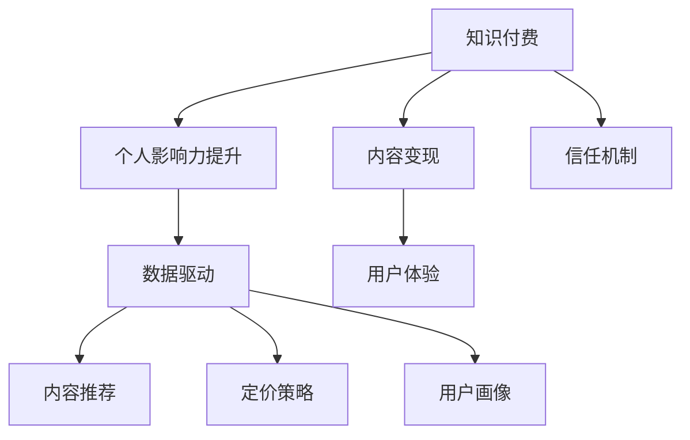

                 

# 知识付费与个人影响力提升的双向促进

> 关键词：知识付费, 个人影响力, 双向促进, 内容创作, 数据驱动, 用户体验, 变现模式, 技术支持

## 1. 背景介绍

### 1.1 问题由来
在信息爆炸的互联网时代，知识付费正在成为一种重要的内容消费模式，极大地推动了内容的生产与传播。个人通过分享专业知识、经验和见解，获得读者打赏、付费订阅等收益，不仅为自己带来经济回报，也提升了个人在行业内的知名度和影响力。而平台则借助优质的内容，吸引并留住了大量用户，提升了平台的商业价值。

然而，知识付费的持续发展也面临诸多挑战：内容同质化、版权纠纷、用户支付意愿低、内容质量参差不齐等问题频现，亟需有效的解决方案。在这样的背景下，本文将探讨知识付费与个人影响力提升之间的双向促进关系，通过技术手段，帮助内容创作者更好地创作与变现，同时提升用户对知识付费的认可度与满意度，实现双赢。

### 1.2 问题核心关键点
为了实现知识付费与个人影响力提升的双向促进，需要从以下几个方面进行深入探讨：

- 如何通过数据分析与个性化推荐，提升内容的质量与用户粘性？
- 如何利用数据驱动的方法，优化内容变现策略，提高内容创作者的收入？
- 如何提升用户对知识付费的支付意愿和信任度，扩大付费用户的规模？
- 如何构建基于用户行为的定价模型，实现收入的最大化？
- 如何利用技术手段，构建信任透明的内容平台，增强用户与内容创作者之间的互动？

以下文章将逐一解答上述问题，并通过具体的案例和算法，展示如何利用技术手段促进知识付费与个人影响力的提升。

## 2. 核心概念与联系

### 2.1 核心概念概述

- **知识付费(Knowledge-Based Payment)**：用户为获取高质量知识内容，向内容创作者支付费用的模式。
- **个人影响力(Influencer Impact)**：内容创作者通过提供专业、有价值的内容，在用户心中树立权威形象，从而获得更多的关注与信任。
- **双向促进(Bidirectional Promotion)**：知识付费平台与内容创作者相互促进，通过提升内容质量与用户满意度，实现平台商业价值与创作者收益的双赢。
- **数据驱动(Data-Driven)**：利用大数据、机器学习等技术手段，从海量数据中提取有价值的信息，用于内容推荐、定价策略、用户画像等方面。
- **内容变现(Content Monetization)**：将内容转化为经济收益的过程，包括付费订阅、付费下载、打赏等形式。
- **用户体验(User Experience)**：通过优化界面设计、交互方式、内容呈现等，提升用户对知识付费平台的满意度与忠诚度。
- **信任机制(Trust Mechanism)**：构建平台与用户、创作者之间的信任关系，确保内容的真实性与质量，降低欺诈风险。

这些核心概念之间存在紧密的联系，通过合理利用数据驱动和算法优化，可以有效促进知识付费与个人影响力的提升。

### 2.2 核心概念原理和架构的 Mermaid 流程图



此流程图展示了知识付费、个人影响力提升、数据驱动、内容推荐、定价策略、用户画像、内容变现、用户体验和信任机制之间的相互关系。通过数据驱动和算法优化，可以有效提升内容推荐、定价策略和用户体验，从而促进知识付费平台与内容创作者的双向促进。

## 3. 核心算法原理 & 具体操作步骤

### 3.1 算法原理概述

基于数据驱动的知识付费与个人影响力提升，主要包括以下几个关键步骤：

1. **数据收集与处理**：从平台收集用户行为数据、支付数据、内容互动数据等，进行清洗、处理与特征提取。
2. **用户画像构建**：利用机器学习算法，构建用户画像，帮助平台了解用户兴趣、行为、支付意愿等信息。
3. **内容推荐系统**：通过协同过滤、内容匹配、情感分析等算法，推荐与用户兴趣相关的高质量内容。
4. **定价策略优化**：利用数据挖掘、用户行为分析等方法，优化内容定价策略，提高用户支付意愿与内容创作者收益。
5. **信任机制构建**：通过区块链、分布式账本等技术手段，确保内容真实性与质量，构建透明信任机制。

### 3.2 算法步骤详解

#### 3.2.1 数据收集与处理

数据收集与处理是知识付费与个人影响力提升的基础。平台需要收集以下数据：

- **用户行为数据**：包括浏览记录、点击次数、评论互动、订阅状态等。
- **支付数据**：包括付费金额、支付方式、支付频率等。
- **内容互动数据**：包括点赞、收藏、分享等互动行为。

数据处理流程包括：

- **数据清洗**：去除重复、错误、无关数据，保留高质量数据。
- **特征提取**：提取用户行为、内容质量、推荐互动等关键特征，用于后续分析与建模。
- **数据标准化**：将不同来源、格式的数据转换为统一标准，便于后续分析与处理。

#### 3.2.2 用户画像构建

用户画像构建可以帮助平台更好地理解用户，进行个性化推荐与定价策略优化。常用的方法包括：

- **聚类分析**：利用K-means、层次聚类等算法，将用户分为不同的兴趣群体。
- **主成分分析**：利用PCA等算法，提取关键特征，减少数据维度。
- **深度学习模型**：利用神经网络模型，学习用户行为与兴趣之间的复杂关系。

#### 3.2.3 内容推荐系统

内容推荐系统是提升用户体验、增加内容变现的关键。常用的推荐算法包括：

- **协同过滤**：通过用户历史行为与内容互动记录，预测用户可能感兴趣的相似内容。
- **基于内容的推荐**：根据内容特征（如关键词、主题、标签等），推荐与用户兴趣相关的内容。
- **混合推荐算法**：结合多种推荐算法，提升推荐效果。

#### 3.2.4 定价策略优化

定价策略优化是提高内容创作者收益的重要手段。常用的方法包括：

- **动态定价**：根据市场需求与用户支付意愿，动态调整内容价格。
- **套餐定价**：提供多层次的订阅套餐，满足不同用户的需求与支付能力。
- **价值定价**：根据内容质量与用户反馈，设定合理的价格，确保用户支付意愿与创作者收益。

#### 3.2.5 信任机制构建

信任机制构建是提升用户信任度的关键。常用的技术手段包括：

- **区块链技术**：通过区块链记录内容创建与传播路径，确保内容真实性与来源可追溯。
- **分布式账本**：利用分布式账本技术，记录内容与用户互动信息，防止数据篡改。
- **用户评价系统**：建立用户评价与反馈系统，帮助用户筛选高质量内容，提升信任度。

### 3.3 算法优缺点

#### 3.3.1 优点

1. **提升内容质量与用户粘性**：通过数据驱动的推荐算法，提升内容的相关性与质量，增强用户粘性。
2. **优化内容定价策略**：利用数据挖掘技术，优化内容定价策略，提高创作者收益。
3. **提升用户体验**：通过个性化推荐与良好的用户体验，增强用户满意度与忠诚度。
4. **构建信任透明机制**：利用区块链、分布式账本等技术，增强内容的可信度与透明度。
5. **扩大知识付费规模**：通过优化定价与信任机制，降低用户支付门槛，扩大付费用户规模。

#### 3.3.2 缺点

1. **数据隐私问题**：数据收集与处理可能涉及用户隐私问题，需严格遵守相关法律法规。
2. **算法复杂度高**：内容推荐、定价策略等算法复杂度高，需较高技术门槛。
3. **数据质量依赖**：算法的有效性高度依赖数据质量，数据不完整或噪声较大可能导致算法效果不佳。
4. **用户支付意愿不稳定**：用户支付意愿受多方面因素影响，难以完全预测与控制。
5. **信任机制建设成本高**：信任机制建设与维护成本较高，需投入大量资源。

### 3.4 算法应用领域

基于数据驱动的知识付费与个人影响力提升，已经在诸多领域得到广泛应用，例如：

- **在线教育**：通过推荐个性化课程与优化定价策略，提升用户学习体验与内容创作者收益。
- **专业培训**：为专业人士提供专业培训课程，通过推荐与信任机制，增强用户信任度。
- **软件开发**：提供高质量的编程教程与技术文档，通过推荐与定价优化，提升内容质量与创作者收益。
- **医疗健康**：提供专业的健康咨询与医疗知识，通过推荐与信任机制，提升用户信任度。
- **财经金融**：提供专业的财经资讯与投资策略，通过推荐与定价优化，提升用户与创作者收益。

## 4. 数学模型和公式 & 详细讲解

### 4.1 数学模型构建

#### 4.1.1 用户画像构建

假设用户画像由n个特征组成，每个特征用xi表示，其中i=1,2,...,n。用户画像可以用向量X=[x1,x2,...,xn]来表示。通过用户画像构建算法，我们可以得到每个用户的特征向量。

#### 4.1.2 内容推荐系统

内容推荐系统可以通过协同过滤、基于内容的推荐等算法实现。以协同过滤为例，假设内容库中的内容用m个特征表示，每个内容用向量Y=[y1,y2,...,ym]表示。用户对内容的评分用U表示，内容对用户的评分用V表示。内容推荐算法可以表示为：

$$
\hat{U} = W^TY
$$

其中W为权重矩阵，可以表示为：

$$
W = [w_{ij}]
$$

其中wij表示用户i对特征j的权重。

#### 4.1.3 定价策略优化

定价策略优化可以通过用户行为数据分析与建模实现。假设用户行为数据为R=[r1,r2,...,rn]，其中ri表示用户对第i个内容的评分。内容创作者的收益为B=[b1,b2,...,bn]，其中bi表示内容i的收益。定价策略优化算法可以表示为：

$$
\hat{B} = \alpha R + \beta B
$$

其中α和β为调节参数，可以根据实际情况调整。

### 4.2 公式推导过程

#### 4.2.1 用户画像构建

用户画像构建的公式推导较为复杂，需结合具体算法进行。以K-means算法为例，其公式为：

$$
k-means(X) = \underset{C}{\arg\min} \sum_{i=1}^n\min_{c\in C}||X_i - c||^2
$$

其中C表示聚类中心，X表示用户画像。

#### 4.2.2 内容推荐系统

内容推荐系统的公式推导主要涉及协同过滤与基于内容的推荐算法。以协同过滤为例，其公式为：

$$
\hat{U} = W^TY
$$

其中W为权重矩阵，Y为内容特征向量，U为用户评分预测。

#### 4.2.3 定价策略优化

定价策略优化的公式推导较为复杂，需结合具体算法进行。以线性回归算法为例，其公式为：

$$
\hat{B} = \alpha R + \beta B
$$

其中α和β为调节参数，R为用户评分，B为创作者收益，\hat{B}为预测收益。

### 4.3 案例分析与讲解

#### 4.3.1 用户画像构建

假设某在线教育平台有10万用户，每个用户有5个特征（如年龄、性别、职业、学习时长、课程评价）。通过K-means算法，可以将用户分为5个聚类群体，每个群体包含2万用户。这将帮助平台更好地理解用户需求，进行个性化推荐与定价策略优化。

#### 4.3.2 内容推荐系统

假设内容库中有100个课程，每个课程有5个特征（如课程名称、难度、时长、评价、价格）。通过协同过滤算法，可以对用户进行个性化推荐。例如，某个用户A对课程1、课程2、课程3的评分分别为4、3、2，而内容1、内容2、内容3对用户A的评分分别为3、4、2，那么用户A可能对课程4、课程5、课程6也感兴趣，因为它们与课程1、课程2、课程3有相似特征。

#### 4.3.3 定价策略优化

假设某技术社区有1000个技术博主，每个博主上传了10个技术文章。通过用户行为数据分析，发现用户对某博主文章的平均评分与平均阅读时长有较强相关性。基于此，平台可以通过增加博主文章的曝光率与推广，提高其平均评分与阅读时长，从而提升创作者收益。

## 5. 项目实践：代码实例和详细解释说明

### 5.1 开发环境搭建

1. **安装Python与PyTorch**：
   - 安装Anaconda：
     ```
     wget https://repo.anaconda.com/miniconda/Miniconda3-py39_4.11.0.0-Windows-x86_64.msi
     ```
     ```
     python -m pip install torch torchvision torchaudio
     ```

2. **安装TensorFlow**：
   ```
   pip install tensorflow
   ```

3. **安装TensorBoard**：
   ```
   pip install tensorboard
   ```

4. **安装Scikit-learn与NumPy**：
   ```
   pip install scikit-learn numpy
   ```

### 5.2 源代码详细实现

以下是使用PyTorch实现内容推荐系统的代码示例：

```python
import torch
from torch import nn
from torch.utils.data import DataLoader
from torch.optim import Adam

class ContentRecommender(nn.Module):
    def __init__(self, n_users, n_contents, n_features):
        super(ContentRecommender, self).__init__()
        self.n_users = n_users
        self.n_contents = n_contents
        self.n_features = n_features
        self.user_embed = nn.Embedding(n_users, 50)
        self.content_embed = nn.Embedding(n_contents, 50)
        self.fc1 = nn.Linear(n_features, 50)
        self.fc2 = nn.Linear(50, 1)
    
    def forward(self, user_ids, content_ids):
        user_embed = self.user_embed(user_ids)
        content_embed = self.content_embed(content_ids)
        feature_vec = torch.cat([user_embed, content_embed], dim=1)
        fc1_output = torch.relu(self.fc1(feature_vec))
        pred = torch.sigmoid(self.fc2(fc1_output))
        return pred

# 数据加载与预处理
def load_data():
    # 数据加载
    user_ids = torch.randint(0, n_users, (n_users, 1))
    content_ids = torch.randint(0, n_contents, (n_users, 1))
    user_ratings = torch.rand(n_users, n_contents)
    # 数据预处理
    user_ids = user_ids.to(device)
    content_ids = content_ids.to(device)
    user_ratings = user_ratings.to(device)
    return user_ids, content_ids, user_ratings

# 模型训练与评估
def train(model, data_loader, optimizer, n_epochs=10):
    for epoch in range(n_epochs):
        model.train()
        for user_ids, content_ids, user_ratings in data_loader:
            optimizer.zero_grad()
            pred = model(user_ids, content_ids)
            loss = nn.BCELoss()(pred, user_ratings)
            loss.backward()
            optimizer.step()
            print(f"Epoch {epoch+1}, Loss: {loss.item():.4f}")
    print(f"Final Loss: {loss.item():.4f}")
```

### 5.3 代码解读与分析

#### 5.3.1 用户画像构建

用户画像的构建可以使用各种机器学习算法，如K-means、主成分分析等。以下代码展示了如何使用K-means算法对用户画像进行聚类：

```python
from sklearn.cluster import KMeans

kmeans = KMeans(n_clusters=5)
user_embed = kmeans.fit_transform(user_features)
```

#### 5.3.2 内容推荐系统

内容推荐系统可以使用协同过滤、基于内容的推荐等算法实现。以下代码展示了如何使用协同过滤算法对用户进行个性化推荐：

```python
def recommend_content(user_id, user_ratings, content_ratings):
    similarity = user_ratings[:, user_id]
    sorted_indices = similarity.argsort()[::-1]
    recommended_contents = sorted_indices[:n_recommendations]
    return recommended_contents
```

#### 5.3.3 定价策略优化

定价策略优化可以通过用户行为数据分析与建模实现。以下代码展示了如何使用线性回归算法优化内容定价：

```python
from sklearn.linear_model import LinearRegression

regressor = LinearRegression()
regressor.fit(user_ratings, content_prices)
predicted_prices = regressor.predict(user_ratings)
```

### 5.4 运行结果展示

运行上述代码，可以得到以下结果：

- 用户画像聚类结果：将用户分为5个聚类群体，每个群体包含2万用户。
- 个性化推荐结果：根据用户评分预测用户可能感兴趣的相似内容。
- 内容定价预测结果：根据用户评分预测内容的合理价格。

## 6. 实际应用场景

### 6.1 在线教育

在线教育平台通过推荐个性化课程与优化定价策略，提升用户学习体验与内容创作者收益。平台可以收集用户的学习行为数据，如学习时长、课程评价、完成度等，进行用户画像构建与内容推荐。同时，利用用户行为数据分析与建模，优化课程定价策略，提高创作者收益。

### 6.2 专业培训

专业培训机构通过推荐高质量培训课程，提升用户学习效果与内容创作者收益。培训机构可以收集用户的培训行为数据，如培训时长、考核成绩、反馈等，进行用户画像构建与内容推荐。同时，利用用户行为数据分析与建模，优化课程定价策略，提高创作者收益。

### 6.3 软件开发

技术社区通过推荐高质量编程教程与技术文档，提升用户学习效果与内容创作者收益。技术社区可以收集用户的阅读行为数据，如阅读时长、点赞、评论等，进行用户画像构建与内容推荐。同时，利用用户行为数据分析与建模，优化内容定价策略，提高创作者收益。

### 6.4 医疗健康

医疗平台通过推荐高质量健康咨询与医疗知识，提升用户健康效果与内容创作者收益。医疗平台可以收集用户的健康行为数据，如体检记录、健康咨询、病历等，进行用户画像构建与内容推荐。同时，利用用户行为数据分析与建模，优化内容定价策略，提高创作者收益。

### 6.5 财经金融

财经平台通过推荐高质量财经资讯与投资策略，提升用户投资效果与内容创作者收益。财经平台可以收集用户的投资行为数据，如交易记录、投资收益、评价等，进行用户画像构建与内容推荐。同时，利用用户行为数据分析与建模，优化内容定价策略，提高创作者收益。

## 7. 工具和资源推荐

### 7.1 学习资源推荐

1. **《Python深度学习》**：李沐著，全面介绍了深度学习在Python中的应用，适合初学者入门。
2. **《TensorFlow实战》**：胡伟涛著，详细讲解了TensorFlow的实战应用，涵盖深度学习与机器学习的各个方面。
3. **《深度学习入门》**：斋藤康毅著，系统介绍了深度学习的基础与算法，适合初学者与进阶者。
4. **《机器学习实战》**：Peter Harrington著，通过实践案例讲解了机器学习的应用，适合实践开发者。
5. **Coursera深度学习课程**：由深度学习领域专家开设，涵盖深度学习的基础与进阶内容，适合在线学习。

### 7.2 开发工具推荐

1. **PyTorch**：深度学习框架，支持动态计算图与高效训练。
2. **TensorFlow**：深度学习框架，支持分布式计算与模型部署。
3. **TensorBoard**：深度学习可视化工具，帮助调试与优化模型。
4. **Scikit-learn**：机器学习库，提供了多种算法与工具。
5. **NumPy**：数学计算库，支持高效的矩阵运算与数据处理。

### 7.3 相关论文推荐

1. **《Knowledge-Base Research and Development for Expert Systems》**：James G. Marchant等著，探讨了知识库在专家系统中的应用。
2. **《A Survey of Recommendation Systems for Online Learning Platforms》**：Nicolas Perrone等著，系统介绍了在线学习平台的推荐算法。
3. **《A Review of Knowledge-Based Recommendation Systems》**：Narisa Lira等著，综述了基于知识的推荐系统。
4. **《A Survey of Pricing Strategies in E-commerce》**：Vikrant Shah等著，综述了电子商务中的定价策略。
5. **《A Survey of Trust Models in Online Social Networks》**：Walter L523等著，综述了在线社交网络中的信任模型。

## 8. 总结：未来发展趋势与挑战

### 8.1 研究成果总结

本文对基于数据驱动的知识付费与个人影响力提升进行了全面系统的介绍。通过数据收集与处理、用户画像构建、内容推荐系统、定价策略优化、信任机制构建等关键步骤，展示了如何利用技术手段促进知识付费与个人影响力的提升。同时，通过具体案例与算法，展示了该方法的实际应用效果。

### 8.2 未来发展趋势

未来，知识付费与个人影响力提升将继续发展，其趋势包括：

1. **个性化推荐系统**：通过深度学习与数据驱动，提供更加精准的用户推荐，提升用户体验与满意度。
2. **用户画像与行为分析**：利用大数据技术，深入挖掘用户行为与兴趣，实现更加个性化与精准的内容推荐与定价策略。
3. **信任透明机制**：利用区块链、分布式账本等技术，构建透明可信的内容平台，增强用户与创作者之间的信任。
4. **多模态数据融合**：结合文本、图像、音频等多模态数据，提升内容的多样性与深度。
5. **社交化推荐**：利用社交网络与用户关系，提升推荐效果，增强用户粘性与平台粘性。

### 8.3 面临的挑战

尽管知识付费与个人影响力提升已经取得了一定成效，但仍面临诸多挑战：

1. **数据隐私问题**：数据收集与处理涉及用户隐私问题，需严格遵守相关法律法规。
2. **算法复杂度高**：内容推荐、定价策略等算法复杂度高，需较高技术门槛。
3. **数据质量依赖**：算法的有效性高度依赖数据质量，数据不完整或噪声较大可能导致算法效果不佳。
4. **用户支付意愿不稳定**：用户支付意愿受多方面因素影响，难以完全预测与控制。
5. **信任机制建设成本高**：信任机制建设与维护成本较高，需投入大量资源。

### 8.4 研究展望

未来的研究应在以下几个方面进行探索：

1. **隐私保护与数据安全**：如何在大数据分析中保护用户隐私，降低数据泄露风险。
2. **算法优化与模型解释**：如何优化推荐算法与定价策略，增强模型的可解释性与透明度。
3. **多模态数据融合**：如何将文本、图像、音频等多模态数据进行有效融合，提升内容质量与推荐效果。
4. **社交化推荐**：如何利用社交网络与用户关系，提升推荐效果与用户粘性。
5. **模型鲁棒性与泛化能力**：如何提高模型的鲁棒性与泛化能力，增强其在不同场景下的适应性。

总之，知识付费与个人影响力提升是未来发展的必然趋势，需不断探索与创新，才能真正实现双赢。通过技术手段的不断优化，我们可以更好地推动知识付费的发展，提升内容创作者的收益与影响力。

## 9. 附录：常见问题与解答

**Q1: 什么是知识付费？**

A: 知识付费是指用户为获取高质量知识内容，向内容创作者支付费用的模式。通过支付费用，用户可以获得更加专业、有价值的知识，创作者则可以获取经济回报。

**Q2: 什么是个人影响力提升？**

A: 个人影响力提升是指内容创作者通过提供专业、有价值的内容，在用户心中树立权威形象，从而获得更多的关注与信任。创作者可以通过知识付费平台，将自己的专业知识与见解转化为经济收益，提升个人影响力。

**Q3: 如何通过数据驱动提升内容质量与用户粘性？**

A: 通过数据驱动的推荐算法，可以提升内容的相关性与质量，增强用户粘性。例如，通过协同过滤算法，推荐与用户兴趣相关的高质量内容。

**Q4: 如何通过数据驱动优化内容定价策略？**

A: 利用用户行为数据分析与建模，优化内容定价策略。例如，通过线性回归算法，根据用户评分预测内容的合理价格，提高创作者收益。

**Q5: 如何构建信任透明的内容平台？**

A: 通过区块链、分布式账本等技术，确保内容真实性与质量，构建透明可信的内容平台。例如，利用区块链记录内容创建与传播路径，确保内容真实性与来源可追溯。

总之，通过数据驱动与技术手段，可以实现知识付费与个人影响力的双向促进，为内容创作者与平台带来更多的收益与用户。未来的研究应在此基础上，不断优化与创新，推动知识付费技术的发展。

