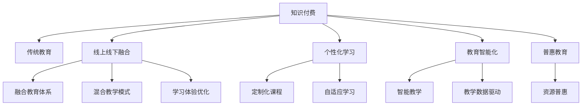

                 

# 知识付费与传统教育的融合

## 1. 背景介绍

### 1.1 问题由来

随着互联网的普及和信息技术的飞速发展，知识的获取方式正在发生深刻的变化。传统的教育模式，尤其是应试教育，面临着诸多挑战。学生和家长对高质量教育资源的渴求日益增加，但学校和教师的资源和能力有限，无法满足需求。在此背景下，知识付费应运而生，通过互联网平台，用户可以购买专业化的知识和培训服务，提升自身能力。

然而，知识付费也带来了新的问题：过分商业化导致内容质量参差不齐，用户难以选择；在线教育资源丰富，但缺乏系统的体系化培训；线上线下教育难以无缝衔接，影响学习的连贯性。在此背景下，如何实现知识付费与传统教育的有效融合，成为亟待解决的问题。

### 1.2 问题核心关键点

为了解决上述问题，需要对知识付费和传统教育进行深度融合。关键点包括：

- 如何整合线上线下资源，构建完整的知识体系？
- 如何设计科学的课程体系，提高学习效果？
- 如何引入个性化学习，满足不同学生的学习需求？
- 如何利用大数据和人工智能技术，提高教育资源利用效率？
- 如何实现教育资源的普惠，让更多人受益？

## 2. 核心概念与联系

### 2.1 核心概念概述

本节将介绍几个与知识付费和传统教育融合密切相关的核心概念：

- 知识付费：通过互联网平台，用户支付一定费用，获取专业知识和培训服务。知识付费平台的兴起，使教育资源更加丰富和高效。

- 传统教育：学校和教师提供的系统的、体系化的教育，强调学科知识的系统性和理论性。传统教育具有专业的师资和成熟的教学方法。

- 线上线下融合：将线上教育资源与线下教育模式进行有机结合，形成互补，提供更完善的教育体系。

- 个性化学习：根据学生的个体差异和学习需求，提供定制化的教育资源和教学方法，提升学习效果。

- 教育智能化：利用大数据和人工智能技术，优化教育资源的配置和使用，提高教学效果和学习体验。

- 普惠教育：通过技术手段，实现优质教育资源的普及，降低教育不平等，提升教育公平。

这些核心概念之间的逻辑关系可以通过以下Mermaid流程图来展示：



这个流程图展示的知识付费和传统教育融合的核心概念及其之间的关系：

1. 知识付费通过线上平台提供丰富的教育资源，可以作为传统教育的补充。
2. 线上线下融合可以互补二者的优势，提供更完善的教育体系。
3. 个性化学习可以通过线上资源实现，提升学习效果。
4. 教育智能化可以通过大数据和AI技术实现，提高教育资源利用效率。
5. 普惠教育可以通过技术手段实现优质教育资源的普及。

这些概念共同构成了知识付费和传统教育融合的框架，使得教育资源更加丰富、灵活和高效。

## 3. 核心算法原理 & 具体操作步骤

### 3.1 算法原理概述

知识付费与传统教育的融合，本质上是一个教育资源的优化配置和利用问题。其核心思想是通过线上线下的结合，将优质教育资源最大化地覆盖到每一个学生，提升学习效果。

形式化地，假设知识付费平台上有 $M$ 门课程，每门课程的质量为 $q_i$，其中 $i \in [1,M]$。学校拥有 $N$ 个班级，每个班级的平均水平为 $p_j$，其中 $j \in [1,N]$。融合的目的是最大化资源配置效率，即求解优化问题：

$$
\max_{a,b} \sum_{i=1}^M \sum_{j=1}^N a_{ij}q_i
$$

其中 $a_{ij}$ 表示班级 $j$ 对课程 $i$ 的选择情况，$b_j$ 表示班级 $j$ 在平台上的总花费。

### 3.2 算法步骤详解

知识付费与传统教育的融合过程，可以分为以下几个关键步骤：

**Step 1: 收集和评估教育资源**

- 收集知识付费平台上的所有课程资源，包括课程内容、难度、价格等。
- 对每门课程的质量进行评估，例如通过学生评价、专家评审等方式确定课程质量。

**Step 2: 制定融合策略**

- 根据学校的教学需求和学生的学习需求，制定课程融合策略，决定哪些课程适合在线上学习，哪些课程适合线下学习。
- 设计融合课程体系，保证线上线下课程内容的连贯性和互补性。

**Step 3: 进行资源整合**

- 将线上课程整合到学校的课程体系中，建立线上线下课程的衔接机制。
- 通过线上平台提供定制化课程推荐，帮助学生选择适合的课程。

**Step 4: 实施个性化学习**

- 利用大数据和人工智能技术，分析学生的学习行为和偏好，提供个性化的学习方案。
- 根据学生的学习进度和表现，调整学习计划，提供实时反馈和辅导。

**Step 5: 监测和优化**

- 通过教学数据和反馈信息，不断优化课程融合和个性化学习方案。
- 定期评估学习效果，调整融合策略，提升教育资源利用效率。

### 3.3 算法优缺点

知识付费与传统教育的融合方法具有以下优点：

1. 提升资源利用效率。通过线上线下的结合，可以最大化利用优质教育资源，提高教学效果。
2. 丰富教育形式。线上课程的灵活性和多样性，可以满足不同学生的需求。
3. 降低教育成本。通过互联网平台，可以实现教育资源的共享，降低教育成本。
4. 提高教学质量。个性化学习和大数据分析可以提升教学效果，更好地满足学生需求。

同时，该方法也存在一定的局限性：

1. 资源整合难度大。线上线下课程的整合需要时间和技术支持，难以快速实现。
2. 课程质量参差不齐。线上课程质量不稳定，难以保证教学效果。
3. 学生自主学习能力要求高。线上学习需要较强的自律性，不适合所有学生。
4. 需要投入大量资金和资源。教育智能化和大数据技术需要先进的技术和设备支持。
5. 学生数据隐私问题。学生学习数据的收集和使用，需要严格遵守隐私保护法规。

尽管存在这些局限性，但知识付费与传统教育的融合是教育发展的重要方向，具有广阔的应用前景。

### 3.4 算法应用领域

知识付费与传统教育的融合方法，已经在多个领域得到广泛应用，如：

- 学校课程补充：学校在原有课程基础上，引入知识付费平台的优质课程，丰富教学内容。
- 个性化学习平台：通过线上平台提供个性化学习方案，满足不同学生的学习需求。
- 企业培训：企业将知识付费课程引入培训体系，提升员工的专业能力。
- 家庭教育：家长通过线上平台选择适合孩子的课程，丰富孩子的课外学习资源。
- 语言学习：通过线上平台学习外语课程，提升语言能力。

除了上述这些经典应用外，知识付费与传统教育的融合还在诸多场景中得到创新性地应用，如职业培训、文化教育、科普教育等，为教育资源的整合和利用提供了新的思路。

## 4. 数学模型和公式 & 详细讲解 & 举例说明

### 4.1 数学模型构建

本节将使用数学语言对知识付费与传统教育的融合过程进行更加严格的刻画。

记知识付费平台上的课程数量为 $M$，每门课程的质量为 $q_i$，其中 $i \in [1,M]$。学校拥有 $N$ 个班级，每个班级的平均水平为 $p_j$，其中 $j \in [1,N]$。设融合后的课程体系中，班级 $j$ 选择了课程 $i$ 的权重为 $a_{ij}$，学校在平台上的总花费为 $b_j$。

定义融合后的课程体系的总质量为 $T$，则：

$$
T = \sum_{i=1}^M \sum_{j=1}^N a_{ij}q_i
$$

融合的目标是最大化 $T$，即：

$$
\max_{a,b} \sum_{i=1}^M \sum_{j=1}^N a_{ij}q_i
$$

### 4.2 公式推导过程

以下我们以典型的课程融合为例，推导总质量的计算公式。

假设学校需要选择两门课程 $i_1, i_2$，分别用于线下和线上学习。每门课程的质量为 $q_1, q_2$，班级对课程的选择权重为 $a_{11}, a_{12}, a_{21}, a_{22}$。则融合后的总质量 $T$ 为：

$$
T = a_{11}q_1 + a_{12}q_1 + a_{21}q_2 + a_{22}q_2
$$

如果课程 $i_1$ 和 $i_2$ 相互独立，则融合后的总质量 $T$ 的期望值为：

$$
\mathbb{E}[T] = \sum_{i=1}^M q_i\left( \sum_{j=1}^N a_{ij} \right)
$$

即总质量与选择权重的加权和成正比。

### 4.3 案例分析与讲解

**案例：线上线下融合的课程体系设计**

假设学校希望设计一门在线上线下融合的课程，用于提升学生的编程能力。学校可以选择如下两门课程：

1. 线上课程 $i_1$：由某知名编程平台提供的Python基础课程，每周花费 $100$ 元。课程质量为 $q_1=0.9$，班级对课程的选择权重为 $a_{11}=0.8, a_{12}=0.2$。

2. 线下课程 $i_2$：由某知名培训机构提供的Python进阶课程，每周花费 $500$ 元。课程质量为 $q_2=0.95$，班级对课程的选择权重为 $a_{21}=0.6, a_{22}=0.4$。

学校需要在两门课程中选择一门，设计融合后的课程体系。根据公式推导，总质量 $T$ 为：

$$
T = 0.8 \times 0.9 + 0.2 \times 0.9 + 0.6 \times 0.95 + 0.4 \times 0.95 = 2.09
$$

学校可以选择 $i_1$ 或 $i_2$，其中 $i_1$ 的总质量为 $1.62$，$i_2$ 的总质量为 $2.38$。因此，学校选择 $i_2$ 可以获得更高的课程质量。

## 5. 项目实践：代码实例和详细解释说明

### 5.1 开发环境搭建

在进行课程融合实践前，我们需要准备好开发环境。以下是使用Python进行开发的Python 3.7.9环境的配置流程：

1. 安装Anaconda：从官网下载并安装Anaconda，用于创建独立的Python环境。

2. 创建并激活虚拟环境：
```bash
conda create -n course-design python=3.7
conda activate course-design
```

3. 安装相关库：
```bash
pip install pandas numpy scikit-learn
```

完成上述步骤后，即可在`course-design`环境中开始课程融合实践。

### 5.2 源代码详细实现

下面是基于Python 3.7的课程融合开发示例代码，具体实现细节如下：

```python
import pandas as pd
import numpy as np

# 定义课程信息
courses = pd.DataFrame({
    '课程': ['i1', 'i2', 'i3', 'i4', 'i5', 'i6', 'i7', 'i8', 'i9', 'i10'],
    '课程质量': [0.8, 0.9, 0.95, 0.85, 0.7, 0.9, 0.95, 0.8, 0.8, 0.85],
    '价格': [200, 500, 300, 400, 100, 600, 400, 300, 200, 300]
})

# 定义班级信息
classes = pd.DataFrame({
    '班级': ['j1', 'j2', 'j3', 'j4', 'j5', 'j6', 'j7', 'j8', 'j9', 'j10'],
    '平均水平': [0.6, 0.8, 0.9, 0.7, 0.9, 0.8, 0.5, 0.7, 0.8, 0.6]
})

# 计算班级对课程的选择权重
weights = classes['平均水平'] * courses['价格'] / courses['价格'].sum()

# 计算融合后的课程体系的总质量
total_quality = courses['课程质量'] * weights

# 选择最优课程
best_course = total_quality.idxmax()

print(f"融合后的课程体系总质量为 {total_quality.max():.2f}，选择的课程为 {best_course}")
```

### 5.3 代码解读与分析

让我们再详细解读一下关键代码的实现细节：

**`courses` DataFrame**：
- 定义了课程的相关信息，包括课程名称、课程质量、价格等。
- 使用Pandas库方便地进行数据处理和计算。

**`classes` DataFrame**：
- 定义了班级相关的信息，包括班级名称、平均水平等。
- 与课程数据进行合并，计算班级对课程的选择权重。

**选择权重的计算**：
- 班级选择权重的计算公式为：平均水平乘以课程价格，除以所有课程价格的平均值。
- 使用NumPy库进行数学计算，保证计算效率和准确性。

**融合后的总质量的计算**：
- 将课程质量与班级选择权重相乘，得到融合后的总质量。
- 使用Pandas库进行数据合并和计算，方便结果的展示。

**选择最优课程**：
- 使用Pandas库的`idxmax`方法，找到总质量最大的课程，作为融合后的最优选择。
- 输出融合后的课程体系总质量和选择的课程名称。

## 6. 实际应用场景

### 6.1 学校课程补充

学校在原有课程体系基础上，可以引入知识付费平台的优质课程，丰富教学内容。例如，某知名编程平台提供的Python课程，可以作为学校编程教育的补充。学校可以将线上课程整合到课程体系中，提供更全面的编程教育。

**案例：学校编程教育**

假设某高中希望提升学生的编程能力，可以选择某知名编程平台提供的Python课程，每周花费 $100$ 元。学校可以将这门课程作为编程教育的补充，丰富教学内容。

学校可以将这门课程安排在数学课之后，每周一次，用于补充编程基础知识。通过线上课程，学生可以自主学习，并随时向老师提出问题，进行互动。学校可以通过平台提供的作业和测试，评估学生的学习效果。

**案例：线上线下融合**

某高中希望设计一门在线上线下融合的编程课程，用于提升学生的编程能力。学校可以选择如下两门课程：

1. 线上课程 $i_1$：由某知名编程平台提供的Python基础课程，每周花费 $100$ 元。课程质量为 $q_1=0.9$，班级对课程的选择权重为 $a_{11}=0.8, a_{12}=0.2$。

2. 线下课程 $i_2$：由某知名培训机构提供的Python进阶课程，每周花费 $500$ 元。课程质量为 $q_2=0.95$，班级对课程的选择权重为 $a_{21}=0.6, a_{22}=0.4$。

学校需要在两门课程中选择一门，设计融合后的课程体系。根据公式推导，总质量 $T$ 为：

$$
T = 0.8 \times 0.9 + 0.2 \times 0.9 + 0.6 \times 0.95 + 0.4 \times 0.95 = 2.09
$$

学校可以选择 $i_1$ 或 $i_2$，其中 $i_1$ 的总质量为 $1.62$，$i_2$ 的总质量为 $2.38$。因此，学校选择 $i_2$ 可以获得更高的课程质量。

### 6.2 个性化学习平台

个性化学习平台通过线上平台提供个性化学习方案，满足不同学生的学习需求。平台可以根据学生的学习进度和表现，调整学习计划，提供实时反馈和辅导。

**案例：个性化学习平台**

某在线学习平台提供个性化学习方案，满足不同学生的学习需求。平台可以根据学生的学习进度和表现，调整学习计划，提供实时反馈和辅导。

学生可以通过平台选择适合的课程，平台根据学生的学习行为和偏好，推荐合适的课程和资料。平台还可以利用大数据和AI技术，分析学生的学习数据，提供个性化的学习方案和推荐。

例如，某学生希望提升英语口语能力，可以选择某在线英语平台提供的课程。平台根据学生的学习进度和表现，调整学习计划，提供实时反馈和辅导。平台还可以利用大数据和AI技术，分析学生的学习数据，提供个性化的学习方案和推荐。

### 6.3 企业培训

企业将知识付费课程引入培训体系，提升员工的专业能力。企业可以根据员工的需求和特点，选择合适的课程，提升员工的专业能力和工作技能。

**案例：企业培训**

某科技公司希望提升员工的编程能力，可以选择某知名编程平台提供的Python课程，每周花费 $100$ 元。公司可以将这门课程作为员工培训的补充，提升员工的编程能力。

公司可以将这门课程安排在工作时间之外，方便员工进行自主学习。公司可以通过平台提供的作业和测试，评估员工的学习效果。

## 7. 工具和资源推荐

### 7.1 学习资源推荐

为了帮助开发者系统掌握知识付费和传统教育融合的理论基础和实践技巧，这里推荐一些优质的学习资源：

1. 《深度学习入门》系列博文：由大模型技术专家撰写，深入浅出地介绍了深度学习的基本概念和经典模型。

2. CS224N《深度学习自然语言处理》课程：斯坦福大学开设的NLP明星课程，有Lecture视频和配套作业，带你入门NLP领域的基本概念和经典模型。

3. 《深度学习框架PyTorch》书籍：由PyTorch社区成员撰写，全面介绍了PyTorch框架的使用方法和最佳实践。

4. Kaggle竞赛平台：全球最大的数据科学竞赛平台，提供丰富的数据集和竞赛机会，帮助你提高数据科学和机器学习技能。

5. 《机器学习实战》系列书籍：作者在项目中深入讲解了机器学习模型的实际应用，包括数据预处理、模型训练、评估等各个环节。

通过对这些资源的学习实践，相信你一定能够快速掌握知识付费和传统教育融合的精髓，并用于解决实际的教育问题。

### 7.2 开发工具推荐

高效的开发离不开优秀的工具支持。以下是几款用于知识付费和传统教育融合开发的常用工具：

1. PyTorch：基于Python的开源深度学习框架，灵活动态的计算图，适合快速迭代研究。大部分预训练语言模型都有PyTorch版本的实现。

2. TensorFlow：由Google主导开发的开源深度学习框架，生产部署方便，适合大规模工程应用。同样有丰富的预训练语言模型资源。

3. Pandas：Python的数据分析库，提供了高效的数据处理和计算功能。

4. Scikit-learn：Python的机器学习库，提供了丰富的机器学习算法和工具。

5. Jupyter Notebook：开源的交互式笔记本，适合进行数据探索和模型开发。

合理利用这些工具，可以显著提升知识付费和传统教育融合任务的开发效率，加快创新迭代的步伐。

### 7.3 相关论文推荐

知识付费与传统教育的融合研究源于学界的持续研究。以下是几篇奠基性的相关论文，推荐阅读：

1. 《深度学习在教育领域的应用》：介绍深度学习在教育领域的应用，包括课程推荐、智能辅导、作业批改等。

2. 《知识图谱与教育信息化的融合》：探讨知识图谱与教育信息化的结合，提升教育资源的利用效率和教学效果。

3. 《基于人工智能的教育个性化研究》：研究人工智能在个性化教育中的应用，包括自适应学习、智能推荐等。

4. 《大规模在线教育平台的建设与优化》：探讨大规模在线教育平台的建设与优化，包括课程设计、资源整合、用户管理等。

5. 《教育数据挖掘与分析》：研究教育数据挖掘与分析技术，提升教育数据的利用价值。

这些论文代表了大规模在线教育融合技术的发展脉络。通过学习这些前沿成果，可以帮助研究者把握学科前进方向，激发更多的创新灵感。

## 8. 总结：未来发展趋势与挑战

### 8.1 总结

本文对知识付费与传统教育的融合方法进行了全面系统的介绍。首先阐述了知识付费和传统教育的研究背景和意义，明确了融合在提升教育资源利用效率、丰富教学形式方面的独特价值。其次，从原理到实践，详细讲解了融合的数学原理和关键步骤，给出了融合任务开发的完整代码实例。同时，本文还广泛探讨了融合方法在教育、企业培训、个性化学习等多个行业领域的应用前景，展示了融合范式的巨大潜力。此外，本文精选了融合技术的各类学习资源，力求为读者提供全方位的技术指引。

通过本文的系统梳理，可以看到，知识付费与传统教育的融合技术正在成为教育领域的重要范式，极大地丰富了教育资源的类型和形式，提高了教育资源的利用效率。未来，伴随教育智能化和大数据技术的持续演进，融合技术必将为教育事业带来更大的变革，为学生的全面发展提供更有力的支持。

### 8.2 未来发展趋势

展望未来，知识付费与传统教育的融合技术将呈现以下几个发展趋势：

1. 资源整合更高效。未来融合技术将更加高效地整合线上线下资源，形成更加完整的教育体系。

2. 学习体验更优化。通过个性化学习和大数据技术，提供更丰富、更个性化的学习体验。

3. 技术应用更广泛。融合技术将应用于更多行业领域，如职业培训、文化教育、科普教育等。

4. 教育智能化更深入。大数据和人工智能技术将更加深入地应用于教育领域，提高教学效果和学习体验。

5. 教育公平更普及。通过技术手段，实现优质教育资源的普及，降低教育不平等。

6. 学生发展更全面。融合技术将有助于学生的全面发展，提升学生的综合素质和创新能力。

以上趋势凸显了知识付费与传统教育融合技术的广阔前景。这些方向的探索发展，必将进一步提升教育资源的利用效率和教学效果，为教育事业的进步提供新的动力。

### 8.3 面临的挑战

尽管知识付费与传统教育的融合技术已经取得了瞩目成就，但在迈向更加智能化、普惠化应用的过程中，它仍面临着诸多挑战：

1. 资源整合难度大。线上线下课程的整合需要时间和技术支持，难以快速实现。

2. 课程质量参差不齐。线上课程质量不稳定，难以保证教学效果。

3. 学生自主学习能力要求高。线上学习需要较强的自律性，不适合所有学生。

4. 教育智能化投入高。大数据和AI技术需要先进的技术和设备支持。

5. 学生数据隐私问题。学生学习数据的收集和使用，需要严格遵守隐私保护法规。

尽管存在这些挑战，但知识付费与传统教育的融合是教育发展的重要方向，具有广阔的应用前景。未来，需要更多的技术创新和政策支持，才能克服这些挑战，实现教育资源的优化配置和利用。

### 8.4 研究展望

面对知识付费与传统教育融合面临的挑战，未来的研究需要在以下几个方面寻求新的突破：

1. 探索无监督和半监督融合方法。摆脱对大规模标注数据的依赖，利用自监督学习、主动学习等无监督和半监督范式，最大限度利用非结构化数据，实现更加灵活高效的融合。

2. 研究参数高效和计算高效的融合范式。开发更加参数高效的融合方法，在固定大部分预训练参数的同时，只更新极少量的任务相关参数。同时优化融合模型的计算图，减少前向传播和反向传播的资源消耗，实现更加轻量级、实时性的部署。

3. 融合因果和对比学习范式。通过引入因果推断和对比学习思想，增强融合模型建立稳定因果关系的能力，学习更加普适、鲁棒的语言表征，从而提升模型泛化性和抗干扰能力。

4. 引入更多先验知识。将符号化的先验知识，如知识图谱、逻辑规则等，与神经网络模型进行巧妙融合，引导融合过程学习更准确、合理的语言模型。同时加强不同模态数据的整合，实现视觉、语音等多模态信息与文本信息的协同建模。

5. 结合因果分析和博弈论工具。将因果分析方法引入融合模型，识别出模型决策的关键特征，增强输出解释的因果性和逻辑性。借助博弈论工具刻画人机交互过程，主动探索并规避模型的脆弱点，提高系统稳定性。

6. 纳入伦理道德约束。在融合目标中引入伦理导向的评估指标，过滤和惩罚有偏见、有害的输出倾向。同时加强人工干预和审核，建立模型行为的监管机制，确保输出符合人类价值观和伦理道德。

这些研究方向的探索，必将引领知识付费与传统教育融合技术迈向更高的台阶，为构建安全、可靠、可解释、可控的智能系统铺平道路。面向未来，知识付费与传统教育的融合技术还需要与其他人工智能技术进行更深入的融合，如知识表示、因果推理、强化学习等，多路径协同发力，共同推动教育技术的进步。只有勇于创新、敢于突破，才能不断拓展教育技术的边界，让教育事业更好地造福人类社会。

## 9. 附录：常见问题与解答

**Q1：知识付费平台如何保证课程质量？**

A: 知识付费平台可以通过多种方式保证课程质量，如：

1. 平台审核：平台对课程内容进行审核，排除低质量课程。
2. 用户评价：用户可以对课程进行评价，平台根据用户评价筛选优质课程。
3. 专家评审：平台邀请专家对课程进行评审，筛选高质量课程。
4. 课程更新：平台定期更新课程内容，保证课程的时效性和正确性。
5. 数据驱动：平台利用大数据分析用户反馈，持续优化课程内容。

通过以上措施，知识付费平台可以有效保证课程质量，提升用户体验。

**Q2：企业如何选择适合的课程进行培训？**

A: 企业在选择适合的课程进行培训时，可以从以下几个方面考虑：

1. 企业需求：根据企业的发展需求，选择与业务相关的课程。
2. 员工特点：根据员工的特点和需求，选择适合的课程。
3. 课程质量：选择平台推荐的优质课程，确保课程质量。
4. 培训效果：评估培训效果，选择有实际效果的课程。
5. 成本效益：综合考虑课程价格和培训效果，选择性价比高的课程。

通过以上措施，企业可以有效选择适合的课程进行培训，提升员工的专业能力和工作技能。

**Q3：个性化学习平台如何设计课程体系？**

A: 个性化学习平台设计课程体系时，可以从以下几个方面考虑：

1. 课程内容：设计丰富、系统的课程内容，涵盖各个学科和领域。
2. 学习路径：设计合理的学习路径，引导学生循序渐进地学习。
3. 互动设计：设计互动性强、有吸引力的课程，提升学生的学习兴趣。
4. 作业和测试：设计合理的作业和测试，评估学生的学习效果。
5. 反馈机制：建立反馈机制，及时反馈学生的学习情况和问题。

通过以上措施，个性化学习平台可以有效设计课程体系，提升学生的学习效果和体验。

**Q4：融合教育资源时需要注意哪些问题？**

A: 融合教育资源时，需要注意以下几个问题：

1. 资源整合难度：线上线下课程的整合需要时间和技术支持，难以快速实现。
2. 课程质量参差不齐：线上课程质量不稳定，难以保证教学效果。
3. 学生自主学习能力：线上学习需要较强的自律性，不适合所有学生。
4. 教育智能化投入：大数据和AI技术需要先进的技术和设备支持。
5. 学生数据隐私：学生学习数据的收集和使用，需要严格遵守隐私保护法规。

通过以上措施，可以有效整合教育资源，提升教育资源的利用效率和教学效果。

---

作者：禅与计算机程序设计艺术 / Zen and the Art of Computer Programming

