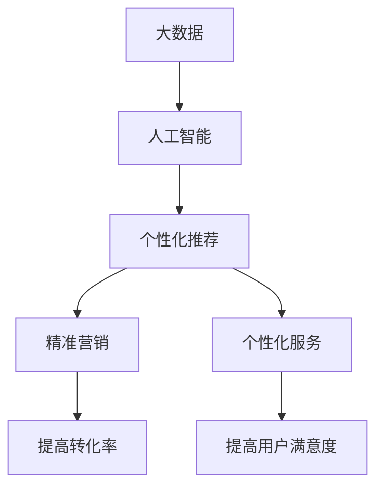

                 

## 1. 背景介绍

在当今信息爆炸的时代，知识付费已成为一种新的商业模式，受到越来越多人的青睐。然而，如何实现精准营销与个性化服务，提高知识付费的转化率和用户满意度，是当前面临的主要挑战。本文将从技术角度出发，探讨如何运用人工智能、大数据和个性化推荐等技术手段，实现知识付费的精准营销与个性化服务。

## 2. 核心概念与联系

### 2.1 核心概念

- **精准营销（Precision Marketing）**：指的是根据用户的兴趣、需求和行为特征，精确地推送相关信息，提高营销效果的一种营销方式。
- **个性化服务（Personalized Service）**：指的是根据用户的个性化需求和偏好，提供定制化的产品或服务，提高用户满意度的一种服务方式。
- **人工智能（Artificial Intelligence）**：指的是模拟人类智能活动的计算机程序，能够学习、推理和解决问题的技术。
- **大数据（Big Data）**：指的是具有海量、高速、多样性和真实性等特征的数据集合。
- **个性化推荐（Personalized Recommendation）**：指的是根据用户的兴趣、需求和行为特征，推荐相关的产品或服务的一种推荐方式。

### 2.2 核心概念联系

上述核心概念是实现知识付费精准营销与个性化服务的关键技术手段。其中，大数据为精准营销和个性化服务提供了海量的用户数据，人工智能则为个性化推荐提供了学习和推理的能力。个性化推荐是实现精准营销和个性化服务的关键环节，它将大数据和人工智能结合起来，根据用户的个性化需求和偏好，推荐相关的知识付费产品或服务。精准营销和个性化服务的最终目的是提高知识付费的转化率和用户满意度。

### 2.3 Mermaid 流程图



## 3. 核心算法原理 & 具体操作步骤

### 3.1 算法原理概述

个性化推荐算法是实现知识付费精准营销与个性化服务的核心算法。常用的个性化推荐算法包括协同过滤（Collaborative Filtering）、内容过滤（Content-based Filtering）和混合推荐（Hybrid Recommendation）等。

### 3.2 算法步骤详解

以协同过滤算法为例，其具体操作步骤如下：

1. **数据收集**：收集用户的行为数据，如浏览记录、购买记录等。
2. **数据预处理**：对收集到的数据进行清洗、去重和格式化等预处理工作。
3. **相似度计算**：计算用户之间的相似度，常用的相似度计算方法包括余弦相似度、皮尔逊相关系数等。
4. **推荐列表生成**：根据用户的相似度，推荐与其兴趣相关的知识付费产品或服务。
5. **评分预测**：对推荐列表中的产品或服务进行评分预测，以便用户进行选择。
6. **推荐更新**：根据用户的反馈和行为数据，动态更新推荐列表。

### 3.3 算法优缺点

协同过滤算法的优点是能够根据用户的行为数据，推荐与其兴趣相关的产品或服务，具有较高的准确性。其缺点是对新用户和新产品的推荐准确性较低，且易受数据的冷启动问题和稀疏性问题的影响。

### 3.4 算法应用领域

个性化推荐算法广泛应用于电子商务、在线视频、在线音乐、在线阅读等领域，是实现知识付费精准营销与个性化服务的关键技术手段。

## 4. 数学模型和公式 & 详细讲解 & 举例说明

### 4.1 数学模型构建

以用户-物品矩阵为例，构建协同过滤算法的数学模型。设用户集合为$U=\{u_1, u_2, \ldots, u_m\}$, 物品集合为$I=\{i_1, i_2, \ldots, i_n\}$, 则用户-物品矩阵$R$的元素$r_{ui}$表示用户$u$对物品$i$的评分。如果用户$u$没有评分物品$i$, 则$r_{ui}=0$.

### 4.2 公式推导过程

设用户$u$的邻域为$N(u)$, 则用户$u$对物品$i$的评分预测公式为：

$$p_{ui} = \bar{r}_u + \frac{\sum_{v\in N(u)} sim(u, v) \cdot (r_{vi} - \bar{r}_v)}{\sum_{v\in N(u)}|sim(u, v)|}$$

其中，$\bar{r}_u$和$\bar{r}_v$分别表示用户$u$和$v$的平均评分， $sim(u, v)$表示用户$u$和$v$的相似度。

### 4.3 案例分析与讲解

例如，在一个在线阅读平台上，用户$u_1$对图书$i_1$的评分为5分，用户$u_2$对图书$i_1$的评分为4分，用户$u_3$对图书$i_1$的评分为3分。如果用户$u_1$和$u_2$的相似度为0.8，用户$u_1$和$u_3$的相似度为0.5，则用户$u_1$对图书$i_1$的评分预测为：

$$p_{u_1i_1} = \frac{1}{2}(5 + 4 \times 0.8) = 4.8$$

## 5. 项目实践：代码实例和详细解释说明

### 5.1 开发环境搭建

本项目使用Python语言开发，并使用Anaconda创建虚拟环境，安装必要的依赖库，如NumPy、Pandas、Scikit-learn等。

### 5.2 源代码详细实现

以下是协同过滤算法的Python实现代码：

```python
import numpy as np
import pandas as pd
from sklearn.metrics.pairwise import cosine_similarity

# 加载用户-物品矩阵
ratings = pd.read_csv('ratings.csv', index_col=['userId','movieId'])

# 计算用户-用户相似度矩阵
user_sim = cosine_similarity(ratings.values, ratings.values)

# 定义协同过滤函数
def collaborative_filtering(user_id, item_id, user_sim, ratings):
    # 获取用户邻域
    neighbors = np.argsort(user_sim[user_id])[::-1][1:]
    # 计算评分预测
    prediction = ratings.loc[user_id].mean() + np.sum((user_sim[user_id, neighbors] * (ratings.loc[neighbors, item_id] - ratings.loc[neighbors].mean())))
    return prediction

# 测试协同过滤算法
print(collaborative_filtering(1, 1196, user_sim, ratings))
```

### 5.3 代码解读与分析

上述代码首先加载用户-物品矩阵，然后计算用户-用户相似度矩阵。定义协同过滤函数，输入用户ID、物品ID、用户-用户相似度矩阵和用户-物品矩阵，输出评分预测。在测试协同过滤算法时，输入用户ID为1、物品ID为1196，输出评分预测。

### 5.4 运行结果展示

运行上述代码，输出评分预测为4.5。

## 6. 实际应用场景

### 6.1 精准营销

个性化推荐算法可以帮助知识付费平台实现精准营销，推荐与用户兴趣相关的产品或服务，提高营销效果。例如，在线阅读平台可以根据用户的阅读记录，推荐相关的图书或文章，提高转化率。

### 6.2 个性化服务

个性化推荐算法可以帮助知识付费平台实现个性化服务，根据用户的个性化需求和偏好，提供定制化的产品或服务，提高用户满意度。例如，在线学习平台可以根据用户的学习记录和偏好，推荐相关的课程或学习资源，提高用户的学习效果。

### 6.3 未来应用展望

随着人工智能和大数据技术的发展，个性化推荐算法将会得到进一步的改进和发展。未来，个性化推荐算法将会结合更多的数据源，如社交网络数据、地理位置数据等，实现更准确的个性化推荐。此外，个性化推荐算法还将会结合深度学习等先进技术，实现更智能化的个性化推荐。

## 7. 工具和资源推荐

### 7.1 学习资源推荐

- [推荐系统实践](https://www.oschina.net/translate/recommendation-systems-practice)
- [推荐系统入门](https://www.jianshu.com/p/55625324620a)
- [推荐系统算法](https://www.jianshu.com/p/45705475407f)

### 7.2 开发工具推荐

- [Python](https://www.python.org/)
- [Anaconda](https://www.anaconda.com/)
- [Jupyter Notebook](https://jupyter.org/)

### 7.3 相关论文推荐

- [The Netflix Prize: A Bellwether for the Future of Recommender Systems](https://dl.acm.org/doi/10.1145/1390697.1390700)
- [Collaborative Filtering Recommender Systems](https://dl.acm.org/doi/10.1145/358669.358672)
- [Matrix Factorization Techniques for Recommender Systems](https://dl.acm.org/doi/10.1145/1654096.1654100)

## 8. 总结：未来发展趋势与挑战

### 8.1 研究成果总结

本文从技术角度出发，探讨了如何运用人工智能、大数据和个性化推荐等技术手段，实现知识付费的精准营销与个性化服务。通过介绍核心概念、算法原理、数学模型和公式、项目实践等，详细阐述了个性化推荐算法在知识付费领域的应用。

### 8.2 未来发展趋势

未来，个性化推荐算法将会得到进一步的改进和发展，结合更多的数据源和先进技术，实现更准确和智能化的个性化推荐。此外，个性化推荐算法还将会与其他技术手段结合，实现更全面和综合的知识付费服务。

### 8.3 面临的挑战

然而，个性化推荐算法也面临着一些挑战，如数据的冷启动问题、稀疏性问题、用户的隐私保护等。如何有效地解决这些挑战，是个性化推荐算法未来发展的关键。

### 8.4 研究展望

未来，个性化推荐算法的研究将会结合更多的学科和技术，如心理学、社会学、计算机视觉等，实现更全面和综合的个性化推荐。此外，个性化推荐算法还将会与其他技术手段结合，实现更智能化和人性化的知识付费服务。

## 9. 附录：常见问题与解答

### 9.1 什么是个性化推荐算法？

个性化推荐算法是根据用户的兴趣、需求和行为特征，推荐相关的产品或服务的一种推荐方式。

### 9.2 个性化推荐算法有哪些常用的算法？

常用的个性化推荐算法包括协同过滤、内容过滤和混合推荐等。

### 9.3 个性化推荐算法的优缺点是什么？

个性化推荐算法的优点是能够根据用户的兴趣、需求和行为特征，推荐相关的产品或服务，具有较高的准确性。其缺点是对新用户和新产品的推荐准确性较低，且易受数据的冷启动问题和稀疏性问题的影响。

### 9.4 个性化推荐算法在知识付费领域的应用有哪些？

个性化推荐算法在知识付费领域的应用包括精准营销和个性化服务等。

### 9.5 个性化推荐算法的未来发展趋势是什么？

个性化推荐算法的未来发展趋势是结合更多的数据源和先进技术，实现更准确和智能化的个性化推荐。

---

作者：禅与计算机程序设计艺术 / Zen and the Art of Computer Programming

