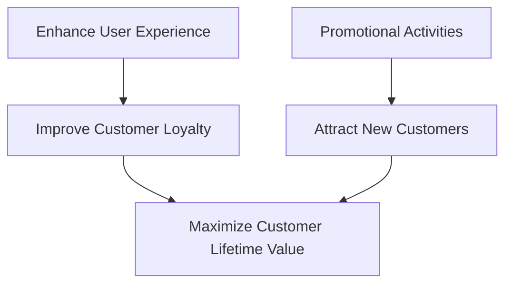

                 

**短期策略：促销活动和优化用户体验**

**作者：禅与计算机程序设计艺术 / Zen and the Art of Computer Programming**

## 1. 背景介绍

在当今竞争激烈的市场中，企业需要不断吸引新客户，留住现有客户，并提高客户忠诚度。短期策略，如促销活动和用户体验优化，是实现这些目标的关键。本文将深入探讨这些策略的原理、实现步骤，并提供实际应用和工具推荐。

## 2. 核心概念与联系

### 2.1 核心概念

- **促销活动（Promotional Activities）**：通过提供折扣、优惠券，或其他吸引力的优惠来刺激销售。
- **用户体验（User Experience, UX）**：用户与产品或服务交互时的总体印象，包括效用、易用性、可靠性、可用性，以及用户的情感反应。

### 2.2 核心概念联系

促销活动和用户体验优化是相辅相成的。促销活动可以吸引新客户，但如果用户体验不好，这些客户可能不会再次购买。优化用户体验可以提高客户忠诚度，但如果没有促销活动，新客户可能不会被吸引。两者结合可以最大化客户生命周期价值。



## 3. 核心算法原理 & 具体操作步骤

### 3.1 算法原理概述

短期策略的算法原理基于营销和用户体验的指标，如转化率、客户生命周期价值、用户满意度等。这些指标可以通过数据分析和模拟来预测和优化。

### 3.2 算法步骤详解

1. **数据收集**：收集有关客户行为、偏好，以及与产品或服务相关的数据。
2. **指标设定**：根据业务目标设定指标，如转化率、客户生命周期价值、用户满意度等。
3. **模型构建**：构建预测模型，如回归模型、决策树、神经网络等，来预测指标。
4. **优化**：使用优化算法，如遗传算法、模拟退火算法，来优化促销活动和用户体验。
5. **实施**：根据优化结果实施促销活动和用户体验改进。
6. **评估**：评估指标以衡量策略的有效性，并根据需要进行调整。

### 3.3 算法优缺点

**优点**：可以预测和优化指标，提高客户生命周期价值。

**缺点**：数据收集和模型构建需要大量时间和资源。此外，模型的准确性取决于数据的质量和完整性。

### 3.4 算法应用领域

短期策略的算法原理可以应用于各种行业，包括电子商务、零售、旅游、金融等。

## 4. 数学模型和公式 & 详细讲解 & 举例说明

### 4.1 数学模型构建

数学模型可以用来预测客户行为，如购买决策、客户生命周期价值等。常用的模型包括回归模型、决策树、神经网络等。

### 4.2 公式推导过程

例如，客户生命周期价值（CLV）可以通过以下公式计算：

$$
CLV = \text{Average Order Value} \times \text{Purchase Frequency} \times \text{Average Customer Lifetime}
$$

### 4.3 案例分析与讲解

假设一家电子商务公司想要预测客户生命周期价值。他们收集了客户的购买历史数据，并使用回归模型来预测客户的平均订单价值、购买频率，和平均客户生命周期。然后，他们使用CLV公式来预测客户生命周期价值。

## 5. 项目实践：代码实例和详细解释说明

### 5.1 开发环境搭建

为实现短期策略，需要一个数据分析和机器学习的开发环境。推荐使用Python，配合Anaconda和Jupyter Notebook。

### 5.2 源代码详细实现

以下是一个简单的Python示例，使用回归模型来预测客户生命周期价值：

```python
import pandas as pd
from sklearn.linear_model import LinearRegression

# Load data
data = pd.read_csv('customer_data.csv')

# Define features and target
X = data[['Average Order Value', 'Purchase Frequency', 'Average Customer Lifetime']]
y = data['CLV']

# Train model
model = LinearRegression()
model.fit(X, y)

# Predict CLV for new customer
new_customer = [[100, 12, 5]]
predicted_clv = model.predict(new_customer)
print(f'Predicted CLV: {predicted_clv[0]}')
```

### 5.3 代码解读与分析

这段代码使用Pandas读取客户数据，然后使用Scikit-learn的线性回归模型来预测客户生命周期价值。新客户的数据输入到模型中，预测的客户生命周期价值被打印出来。

### 5.4 运行结果展示

预测的客户生命周期价值被打印出来，例如：

```
Predicted CLV: 6000
```

## 6. 实际应用场景

### 6.1 当前应用

短期策略广泛应用于电子商务、零售、旅游等行业。例如，电子商务公司可以使用促销活动来吸引新客户，并使用用户体验优化来提高客户忠诚度。

### 6.2 未来应用展望

随着人工智能和大数据的发展，短期策略的算法原理可以进一步优化。例如，可以使用深度学习模型来预测客户行为，或使用实时数据来动态调整促销活动。

## 7. 工具和资源推荐

### 7.1 学习资源推荐

- **Books**: "Predictive Analytics" by Eric Siegel, "Customer Lifetime Value" by Peter Fader and Bruce Hardie
- **Online Courses**: Coursera's "Machine Learning" by Stanford University, Udacity's "Intro to Data Science"

### 7.2 开发工具推荐

- **Programming Languages**: Python, R
- **Data Analysis Libraries**: Pandas, NumPy, Matplotlib, Seaborn
- **Machine Learning Libraries**: Scikit-learn, TensorFlow, PyTorch

### 7.3 相关论文推荐

- "The Long and Short of It: Assessing the Value of Long-Term Customer Relationships" by Peter Fader and Bruce Hardie
- "Predictive Analytics: The Power to Predict Who Will Click, Buy, Lie, or Die" by Eric Siegel

## 8. 总结：未来发展趋势与挑战

### 8.1 研究成果总结

短期策略的算法原理可以预测和优化客户行为，提高客户生命周期价值。然而，数据收集和模型构建需要大量时间和资源。

### 8.2 未来发展趋势

随着人工智能和大数据的发展，短期策略的算法原理可以进一步优化。此外，实时数据和动态调整将变得更加重要。

### 8.3 面临的挑战

数据质量和完整性是短期策略的关键挑战。此外，模型的解释性和可信度也需要进一步提高。

### 8.4 研究展望

未来的研究可以关注动态调整促销活动和用户体验，以及使用实时数据和深度学习模型来预测客户行为。

## 9. 附录：常见问题与解答

**Q：短期策略的算法原理需要大量数据吗？**

**A**：是的，短期策略的算法原理需要大量数据来训练模型。然而，数据的质量和完整性比量更重要。

**Q：短期策略的算法原理可以应用于非营利组织吗？**

**A**：是的，短期策略的算法原理可以应用于任何需要预测和优化客户行为的组织，包括非营利组织。

**Q：短期策略的算法原理需要大量时间和资源吗？**

**A**：是的，短期策略的算法原理需要大量时间和资源来收集数据，构建模型，并优化策略。然而，这些投资可以带来更高的客户生命周期价值和更好的用户体验。

**作者：禅与计算机程序设计艺术 / Zen and the Art of Computer Programming**

