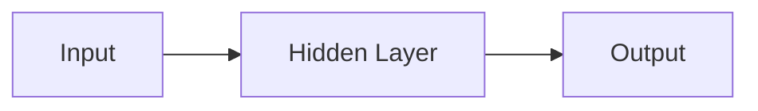

                 

**神经网络：探索未知的领域**

**作者：禅与计算机程序设计艺术 / Zen and the Art of Computer Programming**

## 1. 背景介绍

神经网络（Neural Networks）是一种模拟人类大脑神经元网络的计算模型，是机器学习和深度学习的核心。自从1943年Warren McCulloch和Walter Pitts首次提出神经元模型以来，神经网络已经发展成为一种强大的工具，被广泛应用于图像识别，自然语言处理，推荐系统，自动驾驶等领域。

## 2. 核心概念与联系

### 2.1 核心概念

- **神经元（Neuron）**：神经网络的基本单位，模拟人类大脑中的神经元。
- **权重（Weight）**：神经元之间连接的强度，通过学习调整。
- **偏置（Bias）**：神经元的固有倾向，通过学习调整。
- **激活函数（Activation Function）**：用于引入非线性，输出神经元的值。
- **损失函数（Loss Function）**：衡量网络输出与真实值之间差异的函数。

### 2.2 核心架构

神经网络通常由输入层，隐藏层，输出层组成。数据从输入层流向输出层，在隐藏层进行特征提取和表示。下图是一个简单的神经网络架构示例：



## 3. 核心算法原理 & 具体操作步骤

### 3.1 算法原理概述

神经网络的学习过程主要包括前向传播和反向传播两个阶段。前向传播计算网络输出，反向传播调整网络权重和偏置。

### 3.2 算法步骤详解

1. **前向传播**：输入数据通过每层神经元，计算每层神经元的输出。
2. **计算损失**：比较网络输出与真实值，计算损失。
3. **反向传播**：计算每层神经元的梯度，更新权重和偏置。
4. **重复步骤1-3**：直到网络收敛，即损失不再减小。

### 3.3 算法优缺点

**优点**：神经网络可以自动学习特征，适用于复杂非线性问题。

**缺点**：训练过程需要大量数据和计算资源，易陷入局部最小值。

### 3.4 算法应用领域

神经网络广泛应用于图像识别，自然语言处理，推荐系统，自动驾驶等领域。

## 4. 数学模型和公式 & 详细讲解 & 举例说明

### 4.1 数学模型构建

神经网络的数学模型可以表示为：

$$y = f(wx + b)$$

其中，$x$是输入，$w$是权重，$b$是偏置，$f$是激活函数，$y$是输出。

### 4.2 公式推导过程

神经网络的学习目标是最小化损失函数$L$：

$$\frac{\partial L}{\partial w} = \frac{\partial L}{\partial y} \frac{\partial y}{\partial w}$$

$$\frac{\partial L}{\partial b} = \frac{\partial L}{\partial y} \frac{\partial y}{\partial b}$$

### 4.3 案例分析与讲解

例如，在二分类问题中，常用的损失函数是交叉熵：

$$L = -\left[y \log(\hat{y}) + (1 - y) \log(1 - \hat{y})\right]$$

其中，$y$是真实值，$\hat{y}$是网络输出。

## 5. 项目实践：代码实例和详细解释说明

### 5.1 开发环境搭建

本项目使用Python和TensorFlow框架。需要安装Python（3.6+），TensorFlow（2.0+），NumPy，Matplotlib等库。

### 5.2 源代码详细实现

以下是一个简单的二分类神经网络实现：

```python
import tensorflow as tf
from tensorflow.keras.models import Sequential
from tensorflow.keras.layers import Dense

# 定义模型
model = Sequential()
model.add(Dense(16, activation='relu', input_shape=(10,)))
model.add(Dense(1, activation='sigmoid'))

# 编译模型
model.compile(optimizer='adam', loss='binary_crossentropy', metrics=['accuracy'])

# 训练模型
model.fit(x_train, y_train, epochs=10, batch_size=32)
```

### 5.3 代码解读与分析

- `Sequential()`创建一个顺序模型。
- `Dense()`添加全连接层，第一层需要指定输入维度。
- `compile()`编译模型，指定优化器，损失函数，评估指标。
- `fit()`训练模型，指定训练数据，训练轮数，批处理大小。

### 5.4 运行结果展示

训练完成后，模型的准确率应接近1。可以使用`model.evaluate(x_test, y_test)`评估模型在测试集上的表现。

## 6. 实际应用场景

### 6.1 当前应用

神经网络广泛应用于图像识别，自然语言处理，推荐系统，自动驾驶等领域。

### 6.2 未来应用展望

未来，神经网络将继续发展，可能会出现更强大的模型，更高效的训练算法，更广泛的应用领域。

## 7. 工具和资源推荐

### 7.1 学习资源推荐

- 书籍：《神经网络与深度学习》作者：Goodfellow, Bengio, Courville
- 课程：Stanford University的CS231n：Convolutional Neural Networks for Visual Recognition

### 7.2 开发工具推荐

- TensorFlow
- PyTorch
- Keras

### 7.3 相关论文推荐

- LeCun, Y., Bengio, Y., & Hinton, G. (2015). Deep learning. Nature, 521(7553), 436-444.

## 8. 总结：未来发展趋势与挑战

### 8.1 研究成果总结

神经网络已经取得了巨大成功，但仍有许多问题有待解决。

### 8.2 未来发展趋势

未来，神经网络可能会朝着更强大，更高效，更可解释的方向发展。

### 8.3 面临的挑战

- **计算资源**：神经网络训练需要大量计算资源。
- **数据量**：神经网络需要大量数据才能学习有效的特征。
- **可解释性**：神经网络的决策过程通常是不透明的。

### 8.4 研究展望

未来的研究可能会集中在提高神经网络的可解释性，降低计算成本，扩展神经网络的应用领域等方面。

## 9. 附录：常见问题与解答

**Q：神经网络如何避免过拟合？**

**A：常用的方法包括正则化， dropout，数据增强等。**

**Q：神经网络如何处理大数据？**

**A：神经网络通常使用批处理梯度下降算法处理大数据。**

**Q：神经网络如何处理高维数据？**

**A：神经网络通常使用降维技术，如主成分分析（PCA），处理高维数据。**

**作者：禅与计算机程序设计艺术 / Zen and the Art of Computer Programming**

