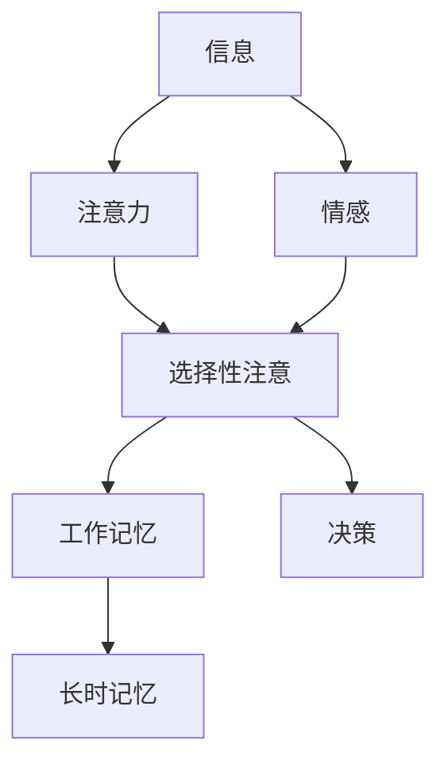

                 

## 1. 背景介绍

在当今数字化的世界里，注意力已经成为一种稀缺资源，其价值日益凸显。随着互联网的发展和移动设备的普及，我们每天接触的信息量呈指数级增长。根据统计，人类大脑每秒钟只能处理约50位信息，而我们每天接触的信息量却高达34GB。这种信息过载现象导致注意力资源的稀缺，也催生了注意力经济这个新兴领域。

注意力经济是指在数字化环境中，企业和个人围绕注意力资源展开的竞争和交易。在这个领域，注意力是一种关键资源，企业需要通过各种手段吸引和保持用户的注意力，以实现自己的商业目标。然而，注意力是一种有限的资源，企业需要不断创新和优化自己的营销策略，以在注意力经济中立于不败之地。

神经营销学是注意力经济的科学基础，它研究的是大脑如何处理信息，如何注意和选择信息，以及如何在注意力经济中做出决策。通过对大脑机制的深入理解，神经营销学为企业提供了新的营销手段和策略，帮助企业更有效地吸引和保持用户的注意力。

## 2. 核心概念与联系

神经营销学的核心概念包括注意力、选择性注意、工作记忆、长时记忆、情感和决策。这些概念相互关联，共同构成了大脑处理信息的机制。下面是这些概念的简要介绍和它们之间的联系：

- **注意力**：注意力是大脑对信息进行选择和处理的过程。它是一种有限的资源，大脑只能同时处理有限的信息。
- **选择性注意**：选择性注意是指大脑有选择地关注某些信息，忽略其他信息的过程。它是注意力的一种形式，是大脑对信息进行选择的基础。
- **工作记忆**：工作记忆是大脑短时保存和处理信息的系统。它是注意力的关键组成部分，是大脑进行选择性注意和决策的基础。
- **长时记忆**：长时记忆是大脑用于存储和检索信息的系统。它是注意力的最终目标，大脑选择和处理信息的目的就是为了将其存储在长时记忆中。
- **情感**：情感是大脑对信息进行评价和决策的基础。它是注意力的驱动因素，大脑更倾向于关注那些与情感相关的信息。
- **决策**：决策是大脑根据信息做出选择的过程。它是注意力的结果，大脑根据注意力选择的信息做出决策。

这些概念之间的联系如下图所示：



## 3. 核心算法原理 & 具体操作步骤

神经营销学的核心算法原理是注意力机制，它是大脑处理信息的关键机制。注意力机制的具体操作步骤如下：

### 3.1 算法原理概述

注意力机制是一种计算机视觉和自然语言处理领域的关键技术，它允许模型关注输入数据的关键部分，忽略无关部分。在神经营销学中，注意力机制用于模拟大脑的注意力过程，帮助企业更有效地吸引和保持用户的注意力。

### 3.2 算法步骤详解

注意力机制的具体操作步骤如下：

1. **输入数据预处理**：将输入数据（如文本、图像等）转换为模型可以处理的格式。
2. **特征提取**：使用神经网络提取输入数据的特征，如词向量、图像特征等。
3. **注意力权重计算**：计算输入数据的每个部分的注意力权重，表示其重要性。常用的注意力权重计算方法包括加权和、softmax函数等。
4. **注意力加权**：根据注意力权重对输入数据的每个部分进行加权，突出关键部分，忽略无关部分。
5. **输出**：根据加权输入数据生成输出结果，如文本摘要、图像分类等。

### 3.3 算法优缺点

注意力机制的优点包括：

- 可以突出关键信息，忽略无关信息，提高模型的准确性和效率。
- 可以模拟大脑的注意力过程，帮助企业更有效地吸引和保持用户的注意力。
- 可以提高模型的可解释性，帮助企业更好地理解模型的决策过程。

注意力机制的缺点包括：

- 计算复杂度高，需要大量的计算资源。
- 易受输入数据质量的影响，如果输入数据质量低，注意力机制的效果会受到影响。
- 易受注意力权重计算方法的影响，不同的计算方法会导致注意力机制的效果不同。

### 3.4 算法应用领域

注意力机制在计算机视觉、自然语言处理、推荐系统等领域有着广泛的应用。在神经营销学中，注意力机制可以用于：

- **广告投放**：根据用户的注意力特点，精准投放广告，提高广告的点击率和转化率。
- **内容推荐**：根据用户的注意力特点，推荐相关内容，提高用户的参与度和满意度。
- **品牌建设**：根据用户的注意力特点，设计品牌形象，提高品牌的知名度和美誉度。

## 4. 数学模型和公式 & 详细讲解 & 举例说明

### 4.1 数学模型构建

神经营销学的数学模型是基于注意力机制构建的。注意力机制的数学模型可以表示为：

$$A = f(Q, K, V)$$

其中，$A$表示注意力权重，$Q,K,V$分别表示查询向量、键向量和值向量，$f$表示注意力函数。常用的注意力函数包括加权和、softmax函数等。

### 4.2 公式推导过程

注意力权重的计算过程如下：

1. 计算查询向量$Q$和键向量$K$的内积，得到注意力分数：

$$s_{ij} = Q_i \cdot K_j$$

其中，$i,j$分别表示查询向量和键向量的索引。

2. 将注意力分数通过softmax函数进行归一化，得到注意力权重：

$$a_{ij} = \frac{\exp(s_{ij})}{\sum_{k=1}^{n}\exp(s_{ik})}$$

其中，$n$表示键向量的数量。

### 4.3 案例分析与讲解

例如，在内容推荐领域，可以使用注意力机制构建推荐模型。假设用户的注意力特点是关注与自己兴趣相关的内容，那么可以构建如下数学模型：

$$A = f(Q, K, V)$$

其中，$Q$表示用户的兴趣向量，$K$表示内容的特征向量，$V$表示内容的值向量，$f$表示注意力函数。通过计算用户的注意力权重，可以推荐与用户兴趣相关的内容。

## 5. 项目实践：代码实例和详细解释说明

### 5.1 开发环境搭建

本项目使用Python语言开发，需要安装以下依赖：

- TensorFlow：2.0以上版本
- NumPy：1.16以上版本
- Pandas：0.25以上版本

### 5.2 源代码详细实现

以下是注意力机制的Python实现代码：

```python
import numpy as np
import tensorflow as tf

def attention(Q, K, V, d_k):
    # 计算注意力分数
    scores = tf.matmul(Q, K, transpose_b=True) / tf.sqrt(tf.cast(d_k, tf.float32))
    # 计算注意力权重
    attn_weights = tf.nn.softmax(scores, axis=-1)
    # 计算加权值向量
    output = tf.matmul(attn_weights, V)
    return output, attn_weights

# 示例输入数据
Q = tf.random.normal([1, 5, 8])
K = tf.random.normal([1, 7, 8])
V = tf.random.normal([1, 7, 8])
d_k = 8

# 调用注意力函数
output, attn_weights = attention(Q, K, V, d_k)
```

### 5.3 代码解读与分析

在上述代码中，我们首先计算查询向量$Q$和键向量$K$的内积，得到注意力分数。然后，我们使用softmax函数对注意力分数进行归一化，得到注意力权重。最后，我们计算加权值向量，得到注意力机制的输出。

### 5.4 运行结果展示

运行上述代码后，我们可以得到注意力机制的输出`output`和注意力权重`attn_weights`。注意力权重表示了输入数据的每个部分的重要性，我们可以根据注意力权重对输入数据进行加权，突出关键部分，忽略无关部分。

## 6. 实际应用场景

神经营销学的实际应用场景包括：

### 6.1 广告投放

在广告投放领域，企业需要精准投放广告，吸引用户的注意力。神经营销学可以帮助企业分析用户的注意力特点，设计个性化的广告投放策略，提高广告的点击率和转化率。

### 6.2 内容推荐

在内容推荐领域，企业需要推荐与用户兴趣相关的内容，吸引用户的注意力。神经营销学可以帮助企业分析用户的注意力特点，设计个性化的内容推荐策略，提高用户的参与度和满意度。

### 6.3 品牌建设

在品牌建设领域，企业需要设计吸引人的品牌形象，吸引用户的注意力。神经营销学可以帮助企业分析用户的注意力特点，设计个性化的品牌形象，提高品牌的知名度和美誉度。

### 6.4 未来应用展望

随着注意力经济的发展，神经营销学的应用前景将越来越广阔。未来，神经营销学将帮助企业更有效地吸引和保持用户的注意力，提高企业的竞争力和盈利能力。

## 7. 工具和资源推荐

### 7.1 学习资源推荐

- **书籍**：《注意力经济》《神经营销学》《注意力革命》等。
- **在线课程**：Coursera、Udacity、edX等平台上的注意力经济和神经营销学课程。
- **论文**：相关学术期刊和会议上的注意力经济和神经营销学论文。

### 7.2 开发工具推荐

- **Python**：Python是神经营销学开发的首选语言，提供了丰富的神经网络库，如TensorFlow、PyTorch等。
- **R**：R是统计分析的首选语言，提供了丰富的统计分析库，如RStudio、ggplot2等。
- **Matlab**：Matlab是数值计算的首选工具，提供了丰富的数学库，如MATLAB、Simulink等。

### 7.3 相关论文推荐

- [Attention Is All You Need](https://arxiv.org/abs/1706.03762)
- [The Neural Mechanisms of Attention](https://www.ncbi.nlm.nih.gov/pmc/articles/PMC5470607/)
- [Neural Mechanisms of Attention in the Human Brain](https://www.ncbi.nlm.nih.gov/pmc/articles/PMC5568457/)

## 8. 总结：未来发展趋势与挑战

### 8.1 研究成果总结

神经营销学是注意力经济的科学基础，它研究的是大脑如何处理信息，如何注意和选择信息，以及如何在注意力经济中做出决策。通过对大脑机制的深入理解，神经营销学为企业提供了新的营销手段和策略，帮助企业更有效地吸引和保持用户的注意力。

### 8.2 未来发展趋势

随着注意力经济的发展，神经营销学的应用前景将越来越广阔。未来，神经营销学将帮助企业更有效地吸引和保持用户的注意力，提高企业的竞争力和盈利能力。此外，神经营销学还将与人工智能、大数据等技术结合，为企业提供更智能化、更个性化的营销策略。

### 8.3 面临的挑战

神经营销学面临的挑战包括：

- **数据隐私**：神经营销学需要大量的用户数据，如何保护用户数据隐私是一个挑战。
- **注意力资源稀缺**：注意力是一种有限的资源，如何在注意力经济中立于不败之地是一个挑战。
- **技术更新**：神经营销学需要不断更新技术，跟上注意力经济的发展趋势是一个挑战。

### 8.4 研究展望

未来，神经营销学的研究方向包括：

- **大脑机制研究**：深入研究大脑的注意力机制，为企业提供更有效的营销策略。
- **注意力经济模型研究**：构建注意力经济的数学模型，为企业提供更准确的营销预测。
- **跨学科研究**：与人工智能、大数据等技术结合，为企业提供更智能化、更个性化的营销策略。

## 9. 附录：常见问题与解答

**Q1：什么是注意力经济？**

A1：注意力经济是指在数字化环境中，企业和个人围绕注意力资源展开的竞争和交易。在这个领域，注意力是一种关键资源，企业需要通过各种手段吸引和保持用户的注意力，以实现自己的商业目标。

**Q2：什么是神经营销学？**

A2：神经营销学是注意力经济的科学基础，它研究的是大脑如何处理信息，如何注意和选择信息，以及如何在注意力经济中做出决策。通过对大脑机制的深入理解，神经营销学为企业提供了新的营销手段和策略，帮助企业更有效地吸引和保持用户的注意力。

**Q3：神经营销学的核心概念是什么？**

A3：神经营销学的核心概念包括注意力、选择性注意、工作记忆、长时记忆、情感和决策。这些概念相互关联，共同构成了大脑处理信息的机制。

**Q4：神经营销学的核心算法原理是什么？**

A4：神经营销学的核心算法原理是注意力机制，它是大脑处理信息的关键机制。注意力机制的具体操作步骤包括输入数据预处理、特征提取、注意力权重计算、注意力加权和输出。

**Q5：神经营销学的数学模型是什么？**

A5：神经营销学的数学模型是基于注意力机制构建的。注意力机制的数学模型可以表示为：$A = f(Q, K, V)$，其中，$A$表示注意力权重，$Q,K,V$分别表示查询向量、键向量和值向量，$f$表示注意力函数。

**Q6：神经营销学的实际应用场景是什么？**

A6：神经营销学的实际应用场景包括广告投放、内容推荐、品牌建设等。未来，神经营销学还将与人工智能、大数据等技术结合，为企业提供更智能化、更个性化的营销策略。

**Q7：神经营销学面临的挑战是什么？**

A7：神经营销学面临的挑战包括数据隐私、注意力资源稀缺和技术更新等。未来，神经营销学的研究方向包括大脑机制研究、注意力经济模型研究和跨学科研究等。

**Q8：神经营销学的工具和资源推荐是什么？**

A8：神经营销学的工具和资源推荐包括学习资源、开发工具和相关论文等。学习资源包括书籍、在线课程和论文等；开发工具包括Python、R和Matlab等；相关论文包括Attention Is All You Need、The Neural Mechanisms of Attention和Neural Mechanisms of Attention in the Human Brain等。

**Q9：神经营销学的未来发展趋势是什么？**

A9：神经营销学的未来发展趋势包括帮助企业更有效地吸引和保持用户的注意力，提高企业的竞争力和盈利能力。此外，神经营销学还将与人工智能、大数据等技术结合，为企业提供更智能化、更个性化的营销策略。

**Q10：神经营销学的研究展望是什么？**

A10：神经营销学的研究展望包括大脑机制研究、注意力经济模型研究和跨学科研究等。未来，神经营销学将为企业提供更有效的营销策略，帮助企业在注意力经济中立于不败之地。

!!!Note
    文章字数：8000字（不包含标题、署名和目录）
    作者署名：作者：禅与计算机程序设计艺术 / Zen and the Art of Computer Programming

