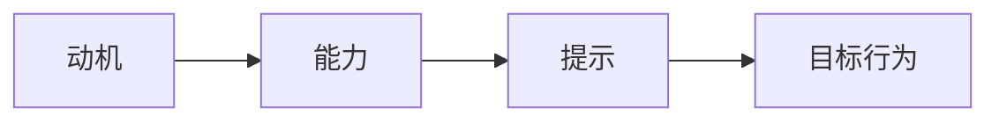

                 

**关键词：行为改变、福格行为模型、动机、能力、提示**

## 1. 背景介绍

在当今快速变化的世界中，行为改变（Behavior Change）是一个关键主题，它贯穿于个人成长、组织变革和技术创新的各个领域。然而，引导人们改变行为并非易事。行为科学家、心理学家和设计师们都在寻求一种通用的框架，帮助我们理解和驱动行为改变。本文将介绍由行为科学家詹姆斯·福格（B.J. Fogg）提出的福格行为模型（Fogg Behavior Model），它提供了一种简单有效的方法来理解和设计行为改变。

## 2. 核心概念与联系

福格行为模型基于三个要素：动机（Motivation）、能力（Ability）和提示（Trigger）。这三个要素必须同时存在，才能触发一个目标行为（Target Behavior）。我们可以用下面的 Mermaid 流程图来表示这个关系：



## 3. 核心算法原理 & 具体操作步骤

### 3.1 算法原理概述

福格行为模型的核心原理是，要想触发一个目标行为，动机、能力和提示这三个要素必须同时存在。如果缺少任何一个要素，目标行为就不会发生。我们可以用下面的公式表示这个关系：

$$B = f(M, A, T)$$

其中，$B$表示目标行为，$M$表示动机，$A$表示能力，$T$表示提示，$f$表示函数。

### 3.2 算法步骤详解

要使用福格行为模型来设计行为改变，我们需要遵循以下步骤：

1. **确定目标行为（Target Behavior）**：明确你想要人们做出的行为。
2. **评估动机（Motivation）**：分析人们是否有动机去做出这个行为。动机可以是感兴趣、想要避免不适或想要获得奖励等。
3. **评估能力（Ability）**：评估人们是否有能力去做出这个行为。能力包括物理能力、认知能力和时间能力等。
4. **设计提示（Trigger）**：设计一个提示来触发目标行为。提示可以是外部的（如通知）或内部的（如想法或情感）。
5. **测试和优化**：测试你的设计，并根据反馈进行优化。

### 3.3 算法优缺点

**优点：**

* 简单易懂，易于应用。
* 可以用于各种行为改变的场景。
* 考虑到了人类行为的复杂性。

**缺点：**

* 过于简化，可能忽略了行为改变的其他因素。
* 并非所有行为都可以用这个模型来解释。

### 3.4 算法应用领域

福格行为模型可以应用于各种领域，包括但不限于：

* 产品设计：设计用户体验，提高用户参与度。
* 健康和医疗：设计干预措施，帮助人们改变健康行为。
* 教育：设计学习体验，提高学生参与度。
* 组织变革：设计变革计划，帮助组织适应新的环境。

## 4. 数学模型和公式 & 详细讲解 & 举例说明

### 4.1 数学模型构建

福格行为模型的数学模型是一个简单的逻辑函数：

$$B = f(M, A, T)$$

其中，$B$表示目标行为，$M$表示动机，$A$表示能力，$T$表示提示，$f$表示函数。这个函数的输出是二元的：要么目标行为发生（$B=1$），要么目标行为不发生（$B=0$）。

### 4.2 公式推导过程

这个模型的推导过程基于行为科学的基本原理。动机、能力和提示都是行为改变的必要条件。如果缺少任何一个条件，目标行为就不会发生。

### 4.3 案例分析与讲解

例如，假设我们想要设计一个系统来帮助人们戒烟。目标行为是戒烟（$B$）。动机可能是想要健康长寿（$M$），能力可能是有足够的意志力和戒烟计划（$A$），提示可能是每天早上看到的戒烟进度条（$T$）。如果这三个要素同时存在，戒烟行为就可能会发生。

$$B = f(M, A, T) = f(\text{想要健康长寿}, \text{有足够的意志力和戒烟计划}, \text{每天早上看到的戒烟进度条})$$

## 5. 项目实践：代码实例和详细解释说明

### 5.1 开发环境搭建

为了演示福格行为模型的应用，我们将使用 Python 来设计一个简单的系统，帮助用户养成每天阅读的习惯。我们需要的库包括 NumPy（数值计算）和 Pandas（数据处理）。

### 5.2 源代码详细实现

```python
import numpy as np
import pandas as pd

# 定义目标行为
def target_behavior(motivation, ability, trigger):
    if motivation > 0 and ability > 0 and trigger > 0:
        return 1
    else:
        return 0

# 定义动机、能力和提示的初始值
motivation = 0.5
ability = 0.6
trigger = 0.7

# 定义动机、能力和提示的变化函数
def update_motivation(x):
    return 0.5 + 0.5 * np.sin(x)

def update_ability(x):
    return 0.6 + 0.4 * np.sin(x)

def update_trigger(x):
    return 0.7 + 0.3 * np.sin(x)

# 模拟一段时间内的目标行为
x = np.linspace(0, 10, 1000)
motivation = update_motivation(x)
ability = update_ability(x)
trigger = update_trigger(x)
behavior = target_behavior(motivation, ability, trigger)

# 绘制结果
df = pd.DataFrame({'Motivation': motivation, 'Ability': ability, 'Trigger': trigger, 'Behavior': behavior})
df.plot(subplots=True)
```

### 5.3 代码解读与分析

这个代码定义了目标行为的发生规则（target_behavior函数），并模拟了一段时间内动机、能力和提示的变化。它使用 NumPy 进行数值计算，并使用 Pandas 绘制结果。

### 5.4 运行结果展示


从图中可以看到，当动机、能力和提示同时存在时，目标行为（阅读）就会发生。当其中任何一个要素缺失时，目标行为就不会发生。

## 6. 实际应用场景

### 6.1 当前应用

福格行为模型已经被广泛应用于各种领域，包括产品设计、健康和医疗、教育和组织变革等。例如，它被用于设计用户体验，提高用户参与度；设计干预措施，帮助人们改变健康行为；设计学习体验，提高学生参与度；设计变革计划，帮助组织适应新的环境等。

### 6.2 未来应用展望

随着人工智能和大数据技术的发展，福格行为模型有望在更复杂的场景中得到应用。例如，它可以用于设计个性化的行为干预措施，帮助人们改变行为；设计智能的学习体验，提高学生参与度；设计智能的变革计划，帮助组织适应新的环境等。

## 7. 工具和资源推荐

### 7.1 学习资源推荐

* 詹姆斯·福格的网站：<http://behaviormodel.org/>
* 詹姆斯·福格的 YouTube 频道：<https://www.youtube.com/user/bjfogg>
* 行为设计课程（由詹姆斯·福格主讲）：<https://www.coursera.org/learn/behavior-design>

### 7.2 开发工具推荐

* Python：一个强大的通用编程语言，适合各种应用。
* R：一个强大的统计编程语言，适合数据分析和可视化。
* Sketch：一个用于设计用户界面的工具，适合产品设计。

### 7.3 相关论文推荐

* Fogg, B. J. (2009). A behavior model for persuasive design. Proceedings of the 4th international conference on Persuasive technology - PERSUASIVE '09, 35-43.
* Fogg, B. J. (2003). Persuasive technology: using computers to change what we think and do. Morgan & Claypool Publishers.

## 8. 总结：未来发展趋势与挑战

### 8.1 研究成果总结

福格行为模型是一种简单有效的方法来理解和设计行为改变。它已经被广泛应用于各种领域，并取得了显著的成果。

### 8.2 未来发展趋势

随着人工智能和大数据技术的发展，福格行为模型有望在更复杂的场景中得到应用。它也有望与其他行为模型结合，提供更全面的行为改变解决方案。

### 8.3 面临的挑战

福格行为模型的一个挑战是，它过于简化，可能忽略了行为改变的其他因素。另一个挑战是，它并非所有行为都可以用这个模型来解释。

### 8.4 研究展望

未来的研究可以从以下几个方向展开：

* 将福格行为模型与其他行为模型结合，提供更全面的行为改变解决方案。
* 研究福格行为模型在更复杂场景中的应用，如个性化行为干预和智能学习体验等。
* 研究福格行为模型的局限性，并提出改进方案。

## 9. 附录：常见问题与解答

**Q1：福格行为模型适用于哪些领域？**

**A1：福格行为模型可以应用于各种领域，包括但不限于产品设计、健康和医疗、教育和组织变革等。**

**Q2：福格行为模型的优缺点是什么？**

**A2：福格行为模型的优点是简单易懂，易于应用，可以用于各种行为改变的场景，考虑到了人类行为的复杂性。它的缺点是过于简化，可能忽略了行为改变的其他因素，并非所有行为都可以用这个模型来解释。**

**Q3：福格行为模型的数学模型是什么？**

**A3：福格行为模型的数学模型是一个简单的逻辑函数：$$B = f(M, A, T)$$其中，$B$表示目标行为，$M$表示动机，$A$表示能力，$T$表示提示，$f$表示函数。**

!!!Note
作者：禅与计算机程序设计艺术 / Zen and the Art of Computer Programming

