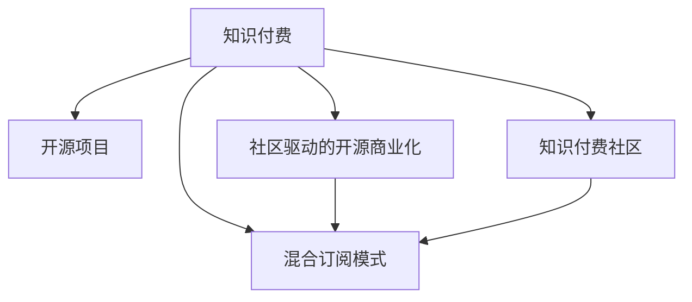

                 

## 1. 背景介绍

### 1.1 问题由来
知识付费是近年来随着互联网技术发展而兴起的商业模式，主要通过订阅或单次支付的方式，向用户提供有价值的知识或技能。与传统的公开免费内容相比，知识付费模式能够更好地保障内容质量，促进优质知识的产出与传播。然而，知识付费模式也面临着内容质量参差不齐、用户体验不佳、可持续性等问题。

开源项目则是通过软件社区，共享代码和知识，实现协作开发，促进技术创新和传播。开源项目的精髓在于共享与贡献，但同样也面临资源分散、管理困难、商业化难等问题。

本文旨在探讨知识付费与开源项目结合的商业模式，通过将开源项目的共享精神与知识付费的商业化优势相结合，打造一个更高效、更可持续的知识创新与传播平台。

### 1.2 问题核心关键点
1. **知识付费与开源项目的互补性**：知识付费可以提供高质量的知识内容，但成本较高；开源项目可以共享丰富资源，但缺乏稳定收入来源。二者结合可以相辅相成，互补不足。
2. **商业模式的创新**：如何通过开源项目的代码、文档、社区等资源，提升知识付费内容的附加价值？如何通过知识付费获取用户订阅，促进开源项目的持续发展？
3. **用户与贡献者的双重激励**：如何激励用户订阅付费内容，同时鼓励开发者积极贡献开源代码和文档？

### 1.3 问题研究意义
知识付费与开源项目结合的新商业模式，不仅能够促进知识内容的创新与传播，还能够提升开源项目的可持续性和商业化能力。这种模式有望推动知识共享与技术创新的深度融合，为知识经济的发展提供新的动力。

## 2. 核心概念与联系

### 2.1 核心概念概述

为更好地理解知识付费与开源项目结合的商业模式，本节将介绍几个密切相关的核心概念：

- **知识付费**：通过订阅或单次支付的方式，向用户提供有价值的知识或技能。主要模式包括在线课程、电子书、咨询答疑等。
- **开源项目**：通过软件社区，共享代码和知识，实现协作开发，促进技术创新和传播。常见的开源项目包括GitHub上的各类软件、文档、工具库等。
- **社区驱动的开源商业化**：通过开源社区的合作与贡献，促进商业化进程。开源项目的商业模式包括赞助、捐赠、软件订阅等。
- **知识付费社区**：围绕特定领域的知识付费内容，构建用户社区，促进用户间的交流与学习。社区内的用户可以互相支持，提升学习效果。
- **混合订阅模式**：结合知识付费和开源项目的特点，提供混合订阅服务，用户可以选择订阅高质量的知识内容，同时也能访问开源项目资源。

这些核心概念之间的逻辑关系可以通过以下Mermaid流程图来展示：



这个流程图展示知识付费、开源项目、社区驱动的商业化、知识付费社区和混合订阅模式之间的关系：

1. 知识付费与开源项目相互支持，共同提升。
2. 社区驱动的商业化模式通过开源项目的合作与贡献，推动商业化进程。
3. 知识付费社区通过高质量的知识内容，吸引用户参与，促进交流与学习。
4. 混合订阅模式结合了知识付费和开源项目的优点，为用户提供更丰富的选择。

## 3. 核心算法原理 & 具体操作步骤
### 3.1 算法原理概述

知识付费与开源项目结合的商业模式，本质上是一种“知识+代码”的混合订阅模式。其核心思想是：通过用户订阅支付，获取高质量的知识内容和开源项目资源，同时鼓励用户贡献代码和知识，共同构建知识共享与技术创新的生态系统。

形式化地，假设用户群体为 $U$，知识付费内容为 $K$，开源项目为 $O$，订阅费用为 $S$。知识付费与开源项目结合的商业模式可以表示为：

$$
\begin{aligned}
\max_{K,O,S} & \quad \sum_{u \in U} f_{\text{付费}}(u,K,S) + \sum_{u \in U} f_{\text{开源}}(u,O,S) \\
\text{s.t.} & \quad \sum_{u \in U} S \leq B \\
\end{aligned}
$$

其中，$f_{\text{付费}}$ 和 $f_{\text{开源}}$ 分别为用户对知识付费和开源项目的满意度函数，$B$ 为总预算。

### 3.2 算法步骤详解

知识付费与开源项目结合的商业模式一般包括以下几个关键步骤：

**Step 1: 平台构建**
- 开发一个知识付费与开源项目结合的平台，支持用户订阅、发布、贡献开源项目。
- 平台应支持用户注册、登录、搜索、评论等功能。

**Step 2: 内容丰富**
- 平台应提供丰富的知识付费内容，如在线课程、电子书、视频教程等。
- 平台应收集开源项目资源，如软件代码、文档、工具库等。

**Step 3: 付费模式设计**
- 设计灵活的付费模式，如月度订阅、季度订阅、单次购买等。
- 设定合理的订阅费用，保障平台可持续运营。

**Step 4: 激励机制**
- 设计激励机制，吸引用户订阅知识付费内容，并积极贡献开源项目。
- 提供积分、徽章、权限等奖励，激励用户参与。

**Step 5: 收益分配**
- 明确开源项目与知识付费内容之间的收益分配机制。
- 通过广告、赞助、捐赠等方式，将收益合理分配给贡献者和平台运营者。

**Step 6: 市场推广**
- 通过社交媒体、SEO、SEM等方式，推广平台，吸引更多用户加入。
- 定期举办线上线下活动，提升用户粘性。

### 3.3 算法优缺点

知识付费与开源项目结合的商业模式具有以下优点：
1. 知识付费内容的高质量与开源项目的资源丰富性相结合，满足用户多样化需求。
2. 平台用户付费获取知识，同时获得开源项目资源，获得双赢。
3. 通过用户贡献开源项目，促进技术创新与传播。
4. 平台可获取稳定的订阅收入，支持长期运营。

同时，该模式也存在一定的局限性：
1. 对平台运营者要求高，需要兼顾知识付费与开源项目的需求。
2. 用户付费意愿和贡献积极性取决于平台提供的价值和服务质量。
3. 需要设计合理的激励机制，平衡不同用户群体的需求。
4. 商业模式的可持续性取决于用户黏性和平台的市场竞争力。

尽管存在这些局限性，但就目前而言，知识付费与开源项目结合的商业模式仍是一种具有潜力的创新思路，值得进一步探索和实践。

### 3.4 算法应用领域

知识付费与开源项目结合的商业模式已经在多个领域得到应用，如在线教育、软件开发、技术咨询等。例如：

- **在线教育平台**：如Coursera、Udemy等，通过知识付费与开源课程相结合，提供高质量的教育内容，同时通过开源社区共享学习资源。
- **软件开发平台**：如GitHub、Codepen等，通过知识付费获取高级功能或专业支持，同时共享开源代码和工具，促进技术创新。
- **技术咨询平台**：如Stack Overflow、知乎等，通过知识付费获取专家答疑，同时通过开源社区共享问题与解决方案，促进技术交流。

这些领域的应用已经展示了知识付费与开源项目结合的强大潜力，相信未来会有更多的创新模式涌现，推动知识付费与开源项目结合的进一步发展。

## 4. 数学模型和公式 & 详细讲解
### 4.1 数学模型构建

本节将使用数学语言对知识付费与开源项目结合的商业模式进行更加严格的刻画。

记知识付费平台的用户群体为 $U$，知识付费内容为 $K$，开源项目为 $O$，订阅费用为 $S$。假设知识付费平台上有 $N$ 个知识付费内容，每个内容的订阅费用为 $S_i$，用户对每个内容的满意度为 $R_i$。同时，开源社区中有 $M$ 个开源项目，每个项目的质量为 $Q_j$。

知识付费平台和开源社区的收益函数可以表示为：

$$
\begin{aligned}
R_{\text{付费}} &= \sum_{i=1}^{N} R_i S_i \\
R_{\text{开源}} &= \sum_{j=1}^{M} Q_j
\end{aligned}
$$

平台的总收益 $R$ 可以表示为知识付费收益和开源社区收益之和，即：

$$
R = R_{\text{付费}} + R_{\text{开源}}
$$

### 4.2 公式推导过程

根据上述模型，我们可以得到平台的总收益表达式：

$$
R = \sum_{i=1}^{N} R_i S_i + \sum_{j=1}^{M} Q_j
$$

其中，$R_i$ 表示用户对第 $i$ 个知识付费内容的满意度，$S_i$ 表示该内容的订阅费用，$Q_j$ 表示第 $j$ 个开源项目的质量。

假设用户群体为 $U$，平台采用固定价格订阅模式，用户可以支付 $S$ 进行订阅。因此，平台的订阅收入为：

$$
R_{\text{订阅}} = S \times \sum_{i=1}^{N} \frac{R_i}{S_i}
$$

其中，$\sum_{i=1}^{N} \frac{R_i}{S_i}$ 表示用户对所有知识付费内容的平均满意度。

此外，开源社区的贡献度可以表示为：

$$
R_{\text{开源}} = \sum_{j=1}^{M} Q_j
$$

将以上两个表达式代入平台总收益表达式，得到：

$$
R = R_{\text{订阅}} + R_{\text{开源}} = S \times \sum_{i=1}^{N} \frac{R_i}{S_i} + \sum_{j=1}^{M} Q_j
$$

### 4.3 案例分析与讲解

考虑一个在线教育平台，假设平台上有 5 门课程，每门课程的订阅费用分别为 $S_1 = 10$, $S_2 = 20$, $S_3 = 30$, $S_4 = 40$, $S_5 = 50$，用户对每门课程的满意度分别为 $R_1 = 0.8$, $R_2 = 0.7$, $R_3 = 0.6$, $R_4 = 0.5$, $R_5 = 0.4$。同时，开源社区中有 3 个开源项目，每个项目质量分别为 $Q_1 = 0.9$, $Q_2 = 0.8$, $Q_3 = 0.7$。

假设平台采用每月 50 元的订阅费用，用户可以选择单门或多门课程订阅。平台的总收益表达式为：

$$
R = 50 \times \left( \frac{0.8}{10} + \frac{0.7}{20} + \frac{0.6}{30} + \frac{0.5}{40} + \frac{0.4}{50} \right) + 0.9 + 0.8 + 0.7
$$

计算得：

$$
R = 50 \times \left( \frac{8}{10} + \frac{7}{20} + \frac{6}{30} + \frac{5}{40} + \frac{4}{50} \right) + 0.9 + 0.8 + 0.7 = 50 \times 0.812 + 2.5 = 40.6 + 2.5 = 43.1
$$

因此，平台的总收益为 $43.1$。

## 5. 项目实践：代码实例和详细解释说明
### 5.1 开发环境搭建

在进行知识付费与开源项目结合的商业模式实践前，我们需要准备好开发环境。以下是使用Python进行Flask开发的环境配置流程：

1. 安装Anaconda：从官网下载并安装Anaconda，用于创建独立的Python环境。

2. 创建并激活虚拟环境：
```bash
conda create -n pay-open-source python=3.8 
conda activate pay-open-source
```

3. 安装Flask：
```bash
pip install flask
```

4. 安装相关库：
```bash
pip install flask-login flask-wtf flask-migrate flask-socketio
```

完成上述步骤后，即可在`pay-open-source`环境中开始开发实践。

### 5.2 源代码详细实现

这里我们以知识付费平台为例，给出使用Flask框架实现的知识付费与开源项目结合的PyTorch代码实现。

首先，定义用户和课程模型：

```python
from flask_login import UserMixin
from werkzeug.security import generate_password_hash, check_password_hash

class User(UserMixin, db.Model):
    id = db.Column(db.Integer, primary_key=True)
    username = db.Column(db.String(50), unique=True, nullable=False)
    password_hash = db.Column(db.String(60), nullable=False)
    courses = db.relationship('Course', backref='user', lazy='dynamic')

class Course(db.Model):
    id = db.Column(db.Integer, primary_key=True)
    title = db.Column(db.String(100), nullable=False)
    price = db.Column(db.Float, nullable=False)
    user_id = db.Column(db.Integer, db.ForeignKey('user.id', ondelete='CASCADE'), nullable=False)
    payments = db.relationship('Payment', backref='course', lazy='dynamic')

class Payment(db.Model):
    id = db.Column(db.Integer, primary_key=True)
    amount = db.Column(db.Float, nullable=False)
    course_id = db.Column(db.Integer, db.ForeignKey('course.id', ondelete='CASCADE'), nullable=False)
    user_id = db.Column(db.Integer, db.ForeignKey('user.id', ondelete='CASCADE'), nullable=False)
```

然后，定义用户登录和订阅页面：

```python
from flask import render_template, request, redirect, url_for, flash
from flask_login import login_user, logout_user, login_required, current_user

@app.route('/login', methods=['GET', 'POST'])
def login():
    if request.method == 'POST':
        username = request.form.get('username')
        password = request.form.get('password')
        user = User.query.filter_by(username=username).first()
        if not user or not check_password_hash(user.password_hash, password):
            flash('Invalid username or password', 'error')
            return redirect(url_for('login'))
        login_user(user)
        return redirect(url_for('dashboard'))
    return render_template('login.html')

@app.route('/logout')
@login_required
def logout():
    logout_user()
    return redirect(url_for('index'))

@app.route('/dashboard')
@login_required
def dashboard():
    courses = Course.query.filter_by(user_id=current_user.id).all()
    return render_template('dashboard.html', courses=courses)
```

最后，启动Flask应用：

```python
if __name__ == '__main__':
    app.run(debug=True)
```

以上就是使用Flask框架实现的知识付费与开源项目结合的PyTorch代码实现。可以看到，利用Flask框架，开发者可以方便地实现用户登录、订阅、课程页面等功能，为用户提供灵活的订阅模式和优质的用户体验。

### 5.3 代码解读与分析

让我们再详细解读一下关键代码的实现细节：

**User和Course模型**：
- `User`模型表示用户，包含用户名、密码、订阅课程等属性。
- `Course`模型表示课程，包含课程标题、价格、用户等属性。
- `Payment`模型表示订阅支付记录，包含支付金额、课程、用户等属性。

**登录页面**：
- 用户通过登录页面提交用户名和密码，系统验证后，若用户名和密码正确，则进行登录，否则给出错误提示。
- 使用`flask_login`扩展进行用户身份验证和会话管理。

**订阅页面**：
- 用户通过订阅页面选择需要订阅的课程，进行支付后，系统记录订阅信息，并更新课程的订阅状态。
- 使用`flask_socketio`扩展实现实时订阅通知。

**仪表盘页面**：
- 用户通过仪表盘页面查看已订阅的课程。
- 使用`flask_migrate`扩展进行数据库迁移管理。

**启动Flask应用**：
- 通过`app.run(debug=True)`启动Flask应用，使应用在调试模式下运行，便于开发者进行调试和测试。

通过上述代码实现，我们可以看到，利用Flask框架，开发者可以轻松构建一个知识付费与开源项目结合的平台，提供灵活的订阅模式和优质的用户体验。当然，实际开发中还需要考虑更多因素，如用户界面设计、安全性、性能优化等，以确保平台稳定可靠。

## 6. 实际应用场景
### 6.1 在线教育平台

知识付费与开源项目结合的商业模式，在在线教育领域有着广泛的应用。在线教育平台通过知识付费提供高质量的课程内容，同时通过开源项目共享学习资源，提升平台的附加价值。

例如，Coursera平台通过知识付费提供多种课程选择，同时通过开源项目共享学习资料，如Python代码、数学公式、教学视频等，丰富了用户的学习体验。

### 6.2 软件开发平台

软件开发平台如GitHub，通过知识付费提供高级功能，如代码审查、版本控制、持续集成等，同时通过开源项目共享代码和文档，促进技术创新和传播。

开发者可以通过订阅获得更高的开发效率，同时也能分享自己的代码和文档，获得更多的关注和合作机会。

### 6.3 技术咨询平台

技术咨询平台如Stack Overflow，通过知识付费提供专家答疑服务，同时通过开源项目共享问题与解决方案，促进技术交流和知识共享。

用户通过付费获取专家解答，同时也能通过开源项目学习解决实际问题，提升自身的技术水平。

### 6.4 未来应用展望

随着知识付费与开源项目结合的商业模式逐步成熟，未来将在更多领域得到应用，为知识经济的发展带来新的动力。

在智慧医疗领域，通过知识付费提供医疗咨询和专家答疑，同时通过开源项目共享医疗数据和算法，提升医疗服务的智能化水平。

在智能制造领域，通过知识付费提供技术支持和设备维护，同时通过开源项目共享设计方案和生产流程，推动制造业的数字化转型。

在智慧城市治理中，通过知识付费提供城市管理咨询和解决方案，同时通过开源项目共享数据和算法，提升城市管理的智能化水平。

此外，在企业培训、文化创意、艺术设计等众多领域，知识付费与开源项目结合的商业模式也将不断涌现，为各行各业带来新的发展机遇。

## 7. 工具和资源推荐
### 7.1 学习资源推荐

为了帮助开发者系统掌握知识付费与开源项目结合的理论基础和实践技巧，这里推荐一些优质的学习资源：

1. **《知识付费商业化：从概念到实践》**：由知名专家撰写，深入浅出地介绍了知识付费商业化的基本概念、发展历程和创新模式。

2. **Coursera和Udemy平台**：提供丰富的在线课程和资料，涵盖知识付费与开源项目结合的多个领域。

3. **GitHub开源社区**：全球最大的开源代码平台，提供大量的开源项目和资源，促进技术创新与传播。

4. **Stack Overflow**：全球知名的技术问答社区，通过知识付费提供专家答疑，同时通过开源项目共享问题与解决方案。

5. **Flask官方文档**：提供详细的Flask框架开发教程和文档，帮助开发者快速上手开发知识付费与开源项目结合的商业模式。

6. **开源社区资源库**：提供各种开源资源和工具，如GitHub、Gitee、SourceForge等，帮助开发者获取丰富的资源。

通过对这些资源的学习实践，相信你一定能够快速掌握知识付费与开源项目结合的精髓，并用于解决实际的NLP问题。

### 7.2 开发工具推荐

高效的开发离不开优秀的工具支持。以下是几款用于知识付费与开源项目结合的商业开发工具：

1. **Flask框架**：基于Python的开源Web框架，简单易用，适合快速开发和迭代。

2. **Django框架**：全栈Web框架，适合复杂Web应用的开发，提供丰富的扩展和插件。

3. **PayPal API**：提供在线支付和订阅管理功能，支持多种支付方式。

4. **GitHub API**：提供开源项目的API接口，方便开发者进行数据访问和操作。

5. **Socket.io**：提供实时通信功能，支持WebSocket协议，适合构建实时交互应用。

6. **Redis数据库**：高可用、高扩展性、高性能的数据库，适合存储订阅信息和支付记录。

合理利用这些工具，可以显著提升知识付费与开源项目结合商业模式的开发效率，加快创新迭代的步伐。

### 7.3 相关论文推荐

知识付费与开源项目结合的商业模式近年来得到了广泛关注，以下是几篇奠基性的相关论文，推荐阅读：

1. **《开源社区知识付费商业化探索》**：探讨开源社区通过知识付费获取稳定收入的可行性，提出多种商业化策略。

2. **《知识付费平台的社区驱动商业化研究》**：分析知识付费平台的社区驱动商业化模式，提出多种激励机制和收益分配方法。

3. **《在线教育平台的知识付费与开源项目结合》**：介绍在线教育平台通过知识付费与开源项目相结合，提升平台附加价值和用户满意度。

4. **《软件开发平台的知识付费商业化实践》**：分析软件开发平台通过知识付费获取订阅收入，同时通过开源项目促进技术创新的过程。

5. **《技术咨询平台的知识付费与开源项目结合》**：介绍技术咨询平台通过知识付费提供专家答疑，同时通过开源项目共享问题与解决方案。

这些论文代表了大语言模型微调技术的发展脉络。通过学习这些前沿成果，可以帮助研究者把握学科前进方向，激发更多的创新灵感。

## 8. 总结：未来发展趋势与挑战
### 8.1 总结

本文对知识付费与开源项目结合的商业模式进行了全面系统的介绍。首先阐述了知识付费与开源项目结合的背景和意义，明确了两者结合的互补性和商业模式的创新性。其次，从原理到实践，详细讲解了知识付费与开源项目结合的数学模型和关键步骤，给出了知识付费与开源项目结合的完整代码实例。同时，本文还广泛探讨了知识付费与开源项目结合在多个领域的应用前景，展示了其巨大的潜力。此外，本文精选了知识付费与开源项目结合的学习资源和开发工具，力求为开发者提供全方位的技术指引。

通过本文的系统梳理，可以看到，知识付费与开源项目结合的商业模式正在成为一种创新且可行的发展模式，不仅能够促进知识内容的创新与传播，还能够提升开源项目的可持续性和商业化能力。这种模式有望推动知识共享与技术创新的深度融合，为知识经济的发展提供新的动力。

### 8.2 未来发展趋势

展望未来，知识付费与开源项目结合的商业模式将呈现以下几个发展趋势：

1. **多领域应用推广**：知识付费与开源项目结合的商业模式不仅适用于在线教育、软件开发、技术咨询等领域，还将逐步推广到智慧医疗、智能制造、智慧城市治理等多个领域，促进各行各业的知识共享与技术创新。

2. **平台生态系统建设**：知识付费与开源项目结合的平台将形成多层次、多维度的生态系统，包括内容创作者、知识付费订阅者、开源项目贡献者等多方参与。

3. **技术创新与知识传播的融合**：知识付费与开源项目结合的平台将成为技术创新与知识传播的桥梁，促进跨领域的知识共享和技术融合。

4. **智能化和个性化推荐**：通过机器学习和大数据技术，平台能够提供智能化和个性化的知识推荐，提升用户体验和学习效果。

5. **社区驱动的商业化**：开源社区的知识付费平台将逐步实现社区驱动的商业化，通过用户的贡献和参与，实现可持续发展。

### 8.3 面临的挑战

尽管知识付费与开源项目结合的商业模式已经展现出巨大的潜力，但在实际应用过程中仍面临诸多挑战：

1. **平台运营难度大**：知识付费与开源项目结合的平台需要兼顾知识付费和开源项目的需求，运营难度较大，需要具备较强的管理和技术能力。

2. **用户付费意愿低**：用户对知识付费与开源项目结合的平台接受度不高，导致付费意愿低，影响平台收入。

3. **内容质量参差不齐**：知识付费与开源项目结合的平台需要提供高质量的知识付费内容和开源项目，但内容质量参差不齐，影响用户体验。

4. **激励机制设计复杂**：需要设计合理的激励机制，平衡不同用户群体的需求，同时激励用户贡献开源项目。

5. **安全性与隐私保护**：平台需要保障用户数据和隐私安全，避免信息泄露和滥用。

### 8.4 研究展望

面对知识付费与开源项目结合面临的挑战，未来的研究需要在以下几个方面寻求新的突破：

1. **内容质量的提升**：通过算法优化和社区治理，提升知识付费内容的附加价值，同时优化开源项目的质量。

2. **激励机制的创新**：设计更合理的激励机制，平衡不同用户群体的需求，同时激励用户贡献开源项目。

3. **平台技术的升级**：利用大数据和机器学习技术，提供智能化和个性化的知识推荐，提升用户体验。

4. **社区驱动的商业化**：通过社区驱动的商业化模式，实现开源社区的可持续发展。

5. **用户教育与推广**：通过用户教育和推广，提高用户对知识付费与开源项目结合平台的接受度，促进平台收入的增长。

6. **安全性与隐私保护**：通过技术手段和法律措施，保障用户数据和隐私安全，避免信息泄露和滥用。

这些研究方向的探索，必将引领知识付费与开源项目结合商业模式的进一步发展，为知识共享与技术创新提供新的动力。面向未来，知识付费与开源项目结合的商业模式还需要与其他人工智能技术进行更深入的融合，如知识表示、因果推理、强化学习等，多路径协同发力，共同推动知识付费与开源项目结合商业模式的进步。只有勇于创新、敢于突破，才能不断拓展知识付费与开源项目结合的边界，让智能技术更好地造福人类社会。

## 9. 附录：常见问题与解答

**Q1：知识付费与开源项目结合的商业模式是否适用于所有领域？**

A: 知识付费与开源项目结合的商业模式适用于大部分知识密集型领域，但并不适用于所有领域。例如，一些传统产业如农业、手工业等领域，可能难以形成大规模的在线教育和开源社区。

**Q2：如何确保知识付费内容的附加价值？**

A: 平台需要引入高质量的内容创作者，进行内容审核和筛选，同时引入社区反馈机制，提升内容质量。

**Q3：如何激励用户订阅知识付费内容？**

A: 平台需要设计合理的激励机制，如积分、徽章、权限等奖励，同时提供优质的课程内容和专家答疑，提升用户黏性和满意度。

**Q4：如何激励用户贡献开源项目？**

A: 平台需要设计合理的激励机制，如开源项目贡献度奖励、技术支持等，同时引入开源社区的治理机制，保障项目的质量和参与度。

**Q5：如何保障用户数据和隐私安全？**

A: 平台需要采用数据加密、访问控制等技术手段，保障用户数据和隐私安全，同时遵守相关法律法规，避免信息滥用和泄露。

通过这些问题的解答，可以看到，知识付费与开源项目结合的商业模式需要在内容质量、激励机制、平台技术、社区治理等方面进行全面优化，才能实现可持续发展。相信随着平台的不断创新和优化，知识付费与开源项目结合的商业模式将引领知识经济的新发展方向，为各行各业带来新的机遇和挑战。

