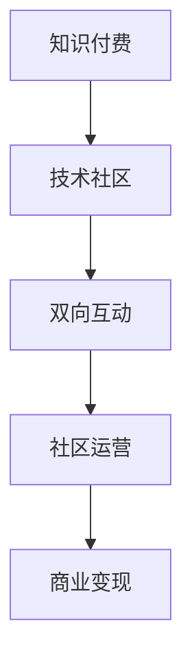

                 

# 知识付费与技术社区运营:程序员的双向互动

> 关键词：知识付费,技术社区,程序员,双向互动,社区运营,付费模式,互动机制,社区生态,商业变现

## 1. 背景介绍

### 1.1 问题由来
随着互联网技术的飞速发展，技术社区和知识付费平台在过去几年内迅速崛起，逐渐成为程序员获取技术资讯、交流经验、学习成长的重要渠道。然而，尽管这些平台在信息分享和社群交流方面取得了显著成效，但在盈利模式、互动机制、商业变现等方面仍存在诸多挑战。

知识付费模式因其较高的信息质量和专业性，为程序员提供了一个高质量的学习渠道，但也面临内容生产成本高、用户参与度低、流量变现难等问题。技术社区平台则通过提供技术交流和经验分享的空间，吸引了大量程序员的参与，但其核心竞争力与商业化进程间仍存在矛盾。

如何构建一个既能满足程序员知识需求，又能实现可持续发展的社区运营模式，成为当前技术行业亟需解决的重要问题。本文将详细探讨知识付费与技术社区运营的结合，分析双向互动机制的构建，旨在为未来技术社区的商业变现和生态建设提供方向。

### 1.2 问题核心关键点
知识付费与技术社区运营的核心在于如何实现高质量内容的生产与分发，同时吸引用户参与和贡献，形成良性互动，最终实现商业变现和生态循环。关键点包括：
- 高质量内容的产出与筛选
- 用户参与和互动机制的设计
- 商业变现模式的探索
- 社区生态的构建与维护

本文将重点分析以上问题，提出一套双向互动机制，以期为技术社区的运营和盈利提供参考。

## 2. 核心概念与联系

### 2.1 核心概念概述

为更好地理解知识付费与技术社区运营，本节将介绍几个密切相关的核心概念：

- 知识付费：指用户为获取高质量内容和服务，支付费用的付费模式。通过付费获取专业信息，提升学习效率，满足个性化需求。

- 技术社区：以技术交流、经验分享为主题的在线社区，通常采用论坛、博客、问答等形式，聚集程序员交流和成长。

- 双向互动：指社区平台与用户之间、用户与用户之间的多向信息交流和反馈机制，通过互动增强内容价值和用户体验。

- 社区运营：指社区平台对平台内容、用户行为、商业变现等多方面进行管理和优化，以提升平台价值和用户黏性。

- 商业变现：指社区平台通过用户订阅、广告、电商等多种方式实现盈利的过程。

这些核心概念之间的逻辑关系可以通过以下Mermaid流程图来展示：



这个流程图展示出知识付费与技术社区运营的逻辑关系：

1. 知识付费通过高质量内容吸引用户，提供信息价值，为社区提供良好的基础。
2. 技术社区平台以双向互动为手段，增强用户参与和贡献，提升社区活跃度。
3. 社区运营通过管理内容、用户和商业变现环节，实现平台可持续发展和商业化。
4. 商业变现是社区平台最终的目标，通过盈利反哺社区运营和内容生产，形成良性循环。

## 3. 核心算法原理 & 具体操作步骤
### 3.1 算法原理概述

知识付费与技术社区运营的核心算法原理涉及内容推荐、用户互动、商业变现等多个环节。其核心在于通过算法实现内容的个性化推荐、互动的激励和变现的多元化。

- 内容推荐算法：利用协同过滤、内容匹配、聚类等技术，根据用户的历史行为和偏好，推荐可能感兴趣的内容。

- 用户互动算法：通过行为分析、情感分析等手段，识别用户需求和偏好，设计激励机制，提升用户互动频率和质量。

- 商业变现算法：通过用户行为数据分析，设计多种商业变现模式，如付费订阅、付费文章、广告投放、电商链接等，实现盈利。

### 3.2 算法步骤详解

基于核心算法原理，社区运营主要分为以下几个步骤：

**Step 1: 数据收集与清洗**
- 收集用户行为数据，如浏览历史、点赞评论、订阅关注等。
- 清洗数据，去除噪音和异常值，保证数据质量。

**Step 2: 用户画像构建**
- 利用机器学习算法对用户行为数据进行建模，生成用户画像，包括兴趣偏好、活跃度、互动倾向等。

**Step 3: 内容推荐系统设计**
- 设计内容推荐模型，使用协同过滤、内容匹配等技术，对用户进行个性化推荐。
- 通过A/B测试，优化推荐算法，提升推荐效果。

**Step 4: 用户互动激励机制设计**
- 设计激励机制，如积分奖励、徽章系统、排行榜等，提升用户参与度。
- 定期评估互动机制效果，根据反馈进行调整。

**Step 5: 商业变现模式探索**
- 根据用户行为数据和社区需求，设计付费订阅、付费文章、广告投放、电商链接等多种商业变现模式。
- 通过试运营和数据分析，评估每种模式的盈利能力和用户接受度。

**Step 6: 社区生态维护**
- 定期更新和维护社区内容，保障平台质量。
- 通过用户反馈和数据分析，优化社区结构和互动机制。

### 3.3 算法优缺点

知识付费与技术社区运营的算法具有以下优点：
1. 内容个性化推荐：通过算法，实现用户与内容的精准匹配，提升用户体验和学习效率。
2. 用户互动激励：设计激励机制，激发用户参与和贡献，形成社区良性循环。
3. 多元化商业变现：通过多渠道商业变现，降低风险，实现可持续发展。
4. 数据驱动决策：通过数据分析，实时优化社区运营策略，提升平台价值。

同时，该算法也存在一定的局限性：
1. 算法复杂度较高：推荐、互动和变现算法涉及多学科知识，设计和优化复杂。
2. 数据隐私问题：用户数据涉及隐私保护，如何平衡用户隐私和平台利益是一个难题。
3. 推荐算法依赖：推荐系统的好坏直接影响用户体验，算法失败可能导致用户体验下降。
4. 变现模式单一：过度依赖单一变现模式，易受市场波动影响，存在较大风险。
5. 社区生态脆弱：用户参与和内容质量是社区生态的关键，一旦出现问题，可能影响平台整体健康。

尽管存在这些局限性，但就目前而言，该算法仍是实现知识付费与技术社区运营的有效手段。未来相关研究的方向在于如何进一步降低算法复杂度，提升数据处理和隐私保护能力，以及设计更加灵活的商业变现模式。

### 3.4 算法应用领域

知识付费与技术社区运营的算法在多个领域得到了广泛应用，例如：

- 技术社区平台：如Stack Overflow、GitHub、CSDN等，通过内容推荐和互动激励，形成活跃的程序员社区。
- 知识付费平台：如知识星球、知乎付费、网易云课堂等，提供高质量的课程和内容，吸引用户付费订阅。
- 在线教育平台：如Coursera、edX等，利用社区互动和个性化推荐，提升用户学习效果。
- 智能问答系统：如GitHub的Ask bot、技术社区的智能客服等，通过自然语言处理和推荐技术，提供问题解答和互动服务。

除了上述这些经典应用外，知识付费与技术社区运营的算法还被创新性地应用到更多场景中，如智能广告推荐、产品评论分析、用户行为预测等，为技术社区的发展提供了新的技术支持。

## 4. 数学模型和公式 & 详细讲解  
### 4.1 数学模型构建

本节将使用数学语言对知识付费与技术社区运营的核心算法进行更加严格的刻画。

假设社区平台有用户 $U$ 和内容 $C$，用户与内容之间的互动可以用矩阵 $I \in \mathbb{R}^{N\times M}$ 来表示，其中 $N$ 为内容数量，$M$ 为用户数量。假设 $I_{ij}=1$ 表示用户 $i$ 与内容 $j$ 发生了互动，否则为 $0$。

定义用户兴趣向量 $\mathbf{u}_i \in \mathbb{R}^d$ 和内容热度向量 $\mathbf{v}_j \in \mathbb{R}^d$，其中 $d$ 为特征维度。用户与内容的匹配度可以用余弦相似度计算，即：

$$
\text{similarity}(\mathbf{u}_i, \mathbf{v}_j) = \mathbf{u}_i \cdot \mathbf{v}_j = \sum_{k=1}^d u_{ik} v_{jk}
$$

内容推荐算法可以表示为：

$$
\text{Recommendations}(\mathbf{u}_i) = \arg\max_j \text{similarity}(\mathbf{u}_i, \mathbf{v}_j) I_{ij}
$$

用户互动激励算法可以表示为：

$$
\text{Reward}_i = f(\text{activity}_i) = g(\text{interaction}_1, \text{interaction}_2, \ldots, \text{interaction}_k)
$$

其中 $\text{activity}_i$ 表示用户 $i$ 的互动行为，$g$ 为激励函数，可以设计为积分、徽章、排行榜等形式。

商业变现算法可以表示为：

$$
\text{Revenue} = \sum_i \text{Fee}_i \times \text{Activity}_i = \sum_i p_i \times c_i \times f_i
$$

其中 $p_i$ 为用户付费比例，$c_i$ 为每次付费金额，$f_i$ 为用户活跃度。

### 4.2 公式推导过程

以下我们以推荐算法为例，推导协同过滤算法的基本形式。

假设社区平台有 $M$ 个用户，$N$ 个内容，每个用户对 $K$ 个内容的评分 $R \in \mathbb{R}^{M\times N}$，每个内容的热度向量 $C \in \mathbb{R}^N$。协同过滤算法的目标是最小化预测评分与实际评分的误差，即：

$$
\min_{\theta} \sum_{i=1}^M \sum_{j=1}^N (r_{ij} - \theta_i^T C_j)^2
$$

其中 $r_{ij}$ 为用户 $i$ 对内容 $j$ 的实际评分，$\theta_i$ 为用户的隐向量表示。

使用矩阵分解的方法，将用户评分矩阵 $R$ 分解为两个矩阵的乘积：

$$
R = U \times V
$$

其中 $U \in \mathbb{R}^{M\times d}$ 为用户隐向量矩阵，$V \in \mathbb{R}^{d\times N}$ 为内容热度矩阵。通过求解矩阵分解问题，可以得到用户的隐向量表示 $\theta_i = U_i$，内容的隐向量表示 $C_j = V_j$。

用户对内容 $j$ 的预测评分可以表示为：

$$
\hat{r}_{ij} = \theta_i^T V_j = U_i^T V_j
$$

通过不断迭代优化，可以最小化预测评分与实际评分的误差，得到最佳的隐向量表示，进而实现个性化内容推荐。

## 5. 项目实践：代码实例和详细解释说明
### 5.1 开发环境搭建

在进行知识付费与技术社区运营的实践前，我们需要准备好开发环境。以下是使用Python进行Django开发的环境配置流程：

1. 安装Anaconda：从官网下载并安装Anaconda，用于创建独立的Python环境。

2. 创建并激活虚拟环境：
```bash
conda create -n django-env python=3.8 
conda activate django-env
```

3. 安装Django：从官网获取Django安装包，或使用conda安装。例如：
```bash
pip install django
```

4. 安装相关库：
```bash
pip install numpy pandas matplotlib scikit-learn
```

5. 创建项目和应用：
```bash
django-admin startproject community
cd community
python manage.py startapp forum
```

完成上述步骤后，即可在`django-env`环境中开始项目开发。

### 5.2 源代码详细实现

这里我们以社区内容推荐为例，给出使用Django进行社区内容推荐功能开发的详细代码实现。

首先，定义模型和视图：

```python
from django.contrib.auth.models import User
from django.contrib.contenttypes.models import ContentType
from django.db import models
from django.contrib.auth import authenticate, login, logout

from django.shortcuts import render, redirect
from django.http import HttpResponse
from django.views.decorators.csrf import csrf_exempt

# 定义模型
class Forum(models.Model):
    title = models.CharField(max_length=200)
    content = models.TextField()
    author = models.ForeignKey(User, on_delete=models.CASCADE)

    def __str__(self):
        return self.title

# 定义视图
@csrf_exempt
def forum_list(request):
    if request.method == 'POST':
        author = request.POST.get('author')
        title = request.POST.get('title')
        content = request.POST.get('content')
        forum = Forum(title=title, content=content, author=User.objects.get(username=author))
        forum.save()
        return redirect('forum_list')
    else:
        forums = Forum.objects.all().order_by('-created_at')
        return render(request, 'forum/forum_list.html', {'forums': forums})
```

然后，定义用户注册、登录、退出等视图：

```python
from django.contrib.auth import authenticate, login, logout
from django.contrib.auth.decorators import login_required

# 定义注册视图
def register(request):
    if request.method == 'POST':
        username = request.POST.get('username')
        password = request.POST.get('password')
        user = User.objects.create_user(username=username, password=password)
        login(request, user)
        return redirect('forum_list')
    else:
        return render(request, 'forum/register.html')

# 定义登录视图
def login_view(request):
    if request.method == 'POST':
        username = request.POST.get('username')
        password = request.POST.get('password')
        user = authenticate(request, username=username, password=password)
        if user is not None:
            login(request, user)
            return redirect('forum_list')
        else:
            return HttpResponse('Invalid credentials')
    else:
        return render(request, 'forum/login.html')

# 定义退出视图
@login_required
def logout_view(request):
    logout(request)
    return redirect('home')
```

最后，定义内容推荐视图：

```python
from django.contrib.auth.decorators import login_required

# 定义推荐视图
@login_required
def forum_recommend(request):
    forum = Forum.objects.filter(author=request.user).order_by('-created_at')
    return render(request, 'forum/forum_recommend.html', {'forum': forum})
```

以上就是使用Django实现社区内容推荐功能的完整代码实现。可以看到，利用Django的强大模板和视图系统，我们能够快速搭建一个社区平台，并提供个性化推荐功能。

### 5.3 代码解读与分析

让我们再详细解读一下关键代码的实现细节：

**Forum模型**：
- 定义了论坛帖子模型的基本属性，包括标题、内容、作者等。

**forum_list视图**：
- 通过视图函数，实现了论坛帖子的列表展示。
- 从数据库中查询论坛帖子，按时间倒序排序，并渲染至模板中。

**register视图**：
- 通过视图函数，实现了用户注册功能。
- 在POST请求中，从请求参数中获取用户名和密码，创建用户并登录。

**login_view视图**：
- 通过视图函数，实现了用户登录功能。
- 在POST请求中，从请求参数中获取用户名和密码，进行用户认证，成功则登录，失败则返回错误提示。

**logout_view视图**：
- 通过视图函数，实现了用户退出功能。
- 在登录状态下，调用`logout`函数退出当前登录用户。

**forum_recommend视图**：
- 通过视图函数，实现了内容推荐功能。
- 在登录状态下，查询当前用户发布的论坛帖子，按时间倒序排序，并渲染至模板中。

可以看到，Django的视图系统使得代码结构清晰、易于扩展。通过视图函数，我们能够灵活地实现各种功能模块，满足社区平台的多样化需求。

当然，工业级的系统实现还需考虑更多因素，如用户权限管理、用户行为分析、互动激励机制等。但核心的推荐范式基本与此类似。

## 6. 实际应用场景
### 6.1 技术社区

技术社区平台以高质量内容为核心，利用内容推荐和互动激励机制，吸引程序员参与和贡献，形成活跃的程序员社区。

- **社区内容推荐**：通过协同过滤、内容匹配等算法，为社区用户提供个性化的内容推荐，提升用户满意度和学习效率。
- **用户互动激励**：通过积分奖励、徽章系统、排行榜等机制，激发用户参与和贡献，形成社区良性循环。
- **商业变现**：通过用户订阅、广告投放、电商链接等方式，实现商业变现，反哺社区运营和发展。

**案例分析**：
- Stack Overflow：通过高质量的内容和推荐算法，吸引了大量程序员参与，成为最受欢迎的技术社区之一。通过用户积分系统和专家认证，提升社区信任度和参与度。
- GitHub：通过社区问答、代码分享等互动机制，促进开源项目的合作和交流。通过企业订阅和广告投放，实现商业变现。

### 6.2 知识付费平台

知识付费平台利用社区互动和推荐技术，提供高质量的课程和内容，吸引用户付费订阅，实现商业化。

- **内容推荐算法**：通过用户行为数据分析，实现个性化内容推荐，提升用户体验和学习效果。
- **互动激励机制**：通过积分奖励、课程评分、专家讲座等方式，激发用户参与和贡献，形成社区良性循环。
- **商业变现模式**：通过付费订阅、付费文章、广告投放、电商链接等多种方式，实现商业变现，反哺平台运营和发展。

**案例分析**：
- 知识星球：通过高质量的内容和推荐算法，吸引用户付费订阅，形成知识共享和互动的社区。通过专家讲座、课程推荐等方式，提升用户粘性和参与度。
- 知乎付费：通过高质量的问题和答案，吸引用户付费订阅，实现内容变现。通过专家认证和推荐系统，提升内容质量和用户满意度。

### 6.3 在线教育平台

在线教育平台利用社区互动和推荐技术，提供课程和资源，提升用户学习效果，实现商业化。

- **内容推荐算法**：通过用户行为数据分析，实现个性化课程推荐，提升用户学习效果。
- **互动激励机制**：通过作业评分、论坛互动、课程问答等方式，激发用户参与和贡献，形成社区良性循环。
- **商业变现模式**：通过付费课程、证书认证、广告投放等方式，实现商业变现，反哺平台运营和发展。

**案例分析**：
- Coursera：通过高质量的课程和推荐算法，吸引用户付费订阅，提升学习效果。通过课程评分、论坛互动等方式，提升用户粘性和满意度。
- edX：通过社区问答、在线测试、课程推荐等方式，提升用户学习效果和参与度。通过付费课程和证书认证，实现商业变现。

## 7. 工具和资源推荐
### 7.1 学习资源推荐

为了帮助开发者系统掌握知识付费与技术社区运营的理论基础和实践技巧，这里推荐一些优质的学习资源：

1. 《Python Web Development with Django》：一本深入浅出地介绍Django开发框架的书籍，涵盖Django的安装、配置、视图、模板等核心技术，适合Django开发初学者。

2. 《Django for Beginners》：一个Django入门教程，通过实例讲解Django的基本用法和高级特性，适合Django开发入门者。

3. 《Django REST framework》：一本介绍Django REST framework的书籍，涵盖API设计和开发技巧，适合开发RESTful风格的Web服务。

4. Django官方文档：Django官方提供的详细文档，包含Django的核心概念、API和最佳实践，适合Django开发高级用户。

5. Coursera《Web Development with Django》：Coursera平台上的Django课程，由Django核心开发者授课，涵盖Django全栈开发技术，适合Django开发进阶者。

通过对这些资源的学习实践，相信你一定能够快速掌握Django开发框架和知识付费与技术社区运营的精髓，并用于解决实际的Web开发问题。

### 7.2 开发工具推荐

高效的开发离不开优秀的工具支持。以下是几款用于Django开发和知识付费与技术社区运营的工具：

1. PyCharm：一款功能强大的Python IDE，支持Django开发、调试、测试等全过程。

2. Django Debug Toolbar：一款Django调试工具，提供详细的请求和响应分析，帮助开发者快速定位问题。

3. Django REST framework：一款Django的RESTful框架，支持API开发和资源管理。

4. Django Admin：一款Django的管理后台，提供丰富的管理界面，简化开发和管理流程。

5. Git：一款版本控制系统，支持代码版本控制、团队协作等，是Django开发不可或缺的工具。

6. Docker：一款容器化平台，支持Django应用的快速部署和迁移，方便团队协作和部署。

合理利用这些工具，可以显著提升Django开发效率，确保开发质量和项目进度。

### 7.3 相关论文推荐

知识付费与技术社区运营的研究涉及多学科知识，以下是几篇奠基性的相关论文，推荐阅读：

1. "The General Problem of Interpretation"（图灵奖论文）：这篇经典论文提出了计算机程序可解释性的重要性，为后续知识付费和社区运营的研究提供了理论基础。

2. "The Challenge of Recommender Systems"：一篇关于推荐系统的综述论文，介绍了协同过滤、内容匹配、聚类等推荐算法的基本原理和应用。

3. "Social Media Dynamics: A Survey of Results"：一篇关于社交媒体社区的研究综述，介绍了社区互动和激励机制的设计和优化。

4. "Economics of online communities"：一篇关于社区经济学的研究论文，探讨了社区平台商业变现的模式和策略。

这些论文代表了大语言模型微调技术的发展脉络。通过学习这些前沿成果，可以帮助研究者把握学科前进方向，激发更多的创新灵感。

## 8. 总结：未来发展趋势与挑战

### 8.1 总结

本文对知识付费与技术社区运营进行了全面系统的介绍。首先阐述了知识付费和社区运营的核心概念和逻辑关系，明确了双向互动机制的构建对平台价值和用户黏性的重要意义。其次，从原理到实践，详细讲解了推荐算法、互动激励机制和商业变现算法的核心思想和实现细节，给出了Django实现的完整代码实例。同时，本文还广泛探讨了知识付费与技术社区运营在多个领域的应用，展示了其巨大的潜力和影响力。

通过本文的系统梳理，可以看到，知识付费与技术社区运营通过双向互动机制，成功地将高质量内容、用户参与和商业变现结合在一起，实现了社区平台的可持续发展和商业化。未来，伴随技术社区的不断发展和创新，相信知识付费模式将更广泛地应用于技术社区的商业变现和生态建设中，为社区运营提供更多的可能性。

### 8.2 未来发展趋势

展望未来，知识付费与技术社区运营的发展趋势如下：

1. 技术社区和知识付费平台将更加融合，形成一体化的平台生态。通过内容推荐、互动激励和商业变现等手段，实现社区和平台的协同发展。

2. 推荐算法将更加智能化和多样化。引入深度学习、协同过滤、增强学习等算法，提升推荐效果和用户满意度。

3. 互动激励机制将更加灵活和多样化。设计更多的积分奖励、徽章系统、排行榜等机制，激发用户参与和贡献。

4. 商业变现模式将更加多元和灵活。通过课程订阅、付费文章、广告投放、电商链接等方式，实现商业变现的多元化。

5. 数据驱动决策将更加深入和全面。通过大数据分析和机器学习算法，实现社区运营的智能化和自动化。

6. 社区生态将更加健康和可持续。通过用户行为分析和社区管理，确保社区环境的健康和积极。

以上趋势凸显了知识付费与技术社区运营的广阔前景。这些方向的探索发展，必将进一步提升社区平台的价值和用户黏性，为社区运营提供更多的可能性。

### 8.3 面临的挑战

尽管知识付费与技术社区运营已经取得了显著成效，但在迈向更加智能化、普适化应用的过程中，仍面临诸多挑战：

1. 内容质量和用户参与度：高质量内容是社区运营的基础，如何保持内容的更新和多样性，吸引用户参与和贡献，是一个长期挑战。

2. 商业变现模式的可持续性：过度依赖单一变现模式，易受市场波动影响，如何设计多元化的商业变现模式，确保平台的可持续发展。

3. 用户隐私和数据安全：社区平台涉及大量用户数据，如何保护用户隐私和数据安全，避免数据泄露和滥用，是一个重要的法律和道德问题。

4. 社区管理的复杂性：社区运营涉及用户管理、内容审核、互动激励等多个环节，如何高效管理社区环境，避免负面内容和行为，是一个复杂的系统工程。

5. 技术实现的难度：推荐算法、互动激励和商业变现算法涉及多学科知识，设计和优化复杂，如何实现高效、稳定、可扩展的技术方案，是一个重要的技术挑战。

6. 生态建设的多样性：社区平台需要多样化用户和内容，如何吸引不同背景和兴趣的用户，提供多样化的内容和功能，是一个需要不断探索的问题。

正视社区运营面临的这些挑战，积极应对并寻求突破，将是大语言模型微调走向成熟的必由之路。相信随着学界和产业界的共同努力，这些挑战终将一一被克服，知识付费与技术社区运营必将在构建人机协同的智能时代中扮演越来越重要的角色。

### 8.4 研究展望

面对知识付费与技术社区运营所面临的种种挑战，未来的研究需要在以下几个方面寻求新的突破：

1. 探索新的推荐算法：引入深度学习、协同过滤、增强学习等算法，提升推荐效果和用户满意度。

2. 设计更加灵活的互动激励机制：设计更多的积分奖励、徽章系统、排行榜等机制，激发用户参与和贡献。

3. 探索多元化的商业变现模式：通过课程订阅、付费文章、广告投放、电商链接等方式，实现商业变现的多元化。

4. 引入社区管理的自动化技术：通过机器学习算法和大数据分析，实现社区运营的智能化和自动化。

5. 加强用户隐私和数据安全保护：设计用户数据保护机制，确保用户隐私和数据安全，避免数据泄露和滥用。

6. 设计社区生态的动态模型：通过用户行为分析和社区管理，确保社区环境的健康和积极。

这些研究方向的探索，必将引领知识付费与技术社区运营技术迈向更高的台阶，为社区运营提供更多的可能性。面向未来，知识付费与技术社区运营需要与其他人工智能技术进行更深入的融合，如知识表示、因果推理、强化学习等，多路径协同发力，共同推动技术社区的进步。只有勇于创新、敢于突破，才能不断拓展社区平台的边界，让知识付费和社区运营真正融入人工智能技术的发展洪流中。

## 9. 附录：常见问题与解答

**Q1：知识付费与技术社区运营的核心是什么？**

A: 知识付费与技术社区运营的核心在于通过高质量内容的推荐、用户互动激励和商业变现，实现社区平台的可持续发展和商业化。

**Q2：社区平台如何实现高质量内容推荐？**

A: 社区平台通过协同过滤、内容匹配、聚类等算法，对用户行为和内容属性进行分析，实现个性化推荐。

**Q3：用户互动激励机制的设计思路是什么？**

A: 设计激励机制，如积分奖励、徽章系统、排行榜等，激发用户参与和贡献，形成社区良性循环。

**Q4：社区平台如何实现商业变现？**

A: 社区平台通过用户订阅、广告投放、电商链接等方式，实现商业变现，反哺社区运营和发展。

**Q5：社区平台的用户行为分析包括哪些方面？**

A: 用户行为分析包括用户活跃度、内容访问量、互动频率、付费比例等，用于优化社区运营策略。

**Q6：社区平台的推荐算法有哪些？**

A: 社区平台的推荐算法包括协同过滤、内容匹配、聚类、基于深度学习的推荐等。

这些问答展示了知识付费与技术社区运营的核心概念和实现细节，帮助读者更好地理解和应用相关技术。

---

作者：禅与计算机程序设计艺术 / Zen and the Art of Computer Programming

