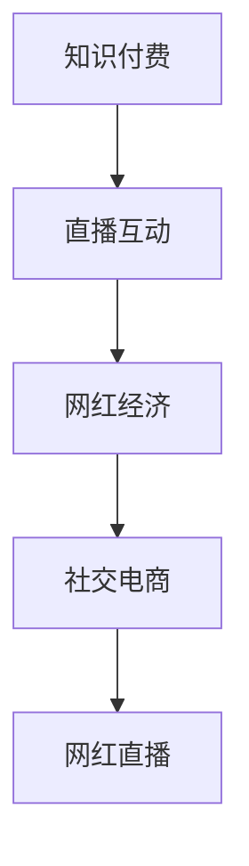

                 

# 知识付费与直播互动相结合的网红经济模式

## 1. 背景介绍

随着互联网技术的飞速发展，知识付费和直播互动已成为新时代下的两大热门领域。知识付费通过向用户提供高质量内容，满足其学习和成长需求，而直播互动则通过实时的信息交换和互动，提供沉浸式体验。将两者结合，可以形成一个独特的网红经济模式，不仅能够激发更多的知识传播，还能增加用户粘性，构建一个生态化的知识共享社区。

## 2. 核心概念与联系

### 2.1 核心概念概述

为更好地理解知识付费与直播互动相结合的网红经济模式，本节将介绍几个密切相关的核心概念：

- **知识付费**：指用户为获取特定领域的高质量内容或服务而支付费用的模式。常见的知识付费形式包括订阅、单次购买、内容打赏等。

- **直播互动**：指通过实时视频或音频方式，用户和主播进行即时交流和互动的方式。直播互动强调即时性和互动性，能够提供更强的用户参与感和体验感。

- **网红经济**：指以网红为核心的商业模式，通过网红的影响力和流量吸引用户关注和参与。网红经济不仅依赖网红个人魅力，还需要有效的粉丝运营和管理。

- **社交电商**：指在社交平台上通过社交关系和互动推荐商品的交易模式。社交电商能够借助网红的信任背书，提高商品销售转化率。

- **网红直播**：指网红在直播平台上通过实时互动和推荐商品的形式进行销售的模式。网红直播结合了直播互动和社交电商的特点，能够同时满足用户娱乐和购物的需求。

这些核心概念之间的逻辑关系可以通过以下Mermaid流程图来展示：



这个流程图展示了几者之间的联系：

1. 知识付费提供了高质量内容，成为网红吸引粉丝的重要手段。
2. 直播互动增强了内容消费的沉浸感，提升用户粘性。
3. 网红经济利用网红的影响力，形成流量变现。
4. 社交电商通过网红推荐，提高商品销售转化率。
5. 网红直播综合了直播互动和社交电商特点，实现娱乐和购物的有机结合。

## 3. 核心算法原理 & 具体操作步骤
### 3.1 算法原理概述

知识付费与直播互动相结合的网红经济模式，本质上是一个内容推荐和社交互动相融合的过程。其核心思想是：通过知识付费激励优质内容的生产，利用直播互动增强内容消费的沉浸感和参与感，再通过网红经济和社交电商实现流量变现。

形式化地，假设平台上有 $N$ 个网红，每个网红每天产生 $M$ 个内容，每个内容能够吸引 $P$ 个用户观看，且每个观看用户有 $Q$ 的概率成为订阅用户，订阅用户每月支付 $R$ 元。则平台每天的总收益为：

$$
Revenue = \sum_{i=1}^N \sum_{j=1}^M (P \times Q) \times R
$$

其中 $i$ 和 $j$ 分别表示网红和内容编号。平台的目标是最大化总收益，即：

$$
\maximize \sum_{i=1}^N \sum_{j=1}^M (P \times Q) \times R
$$

在实际操作中，我们通常使用强化学习等优化算法，根据用户的反馈（如观看时长、订阅量等）来调整推荐策略和直播互动内容，以提升用户满意度和平台收益。

### 3.2 算法步骤详解

知识付费与直播互动相结合的网红经济模式，一般包括以下几个关键步骤：

**Step 1: 网红入驻与内容生产**
- 平台开放入驻通道，吸引具有专业知识和影响力的网红入驻。
- 网红根据平台需求，制作内容，并进行直播互动。

**Step 2: 内容推荐与流量变现**
- 平台根据用户行为和偏好，利用推荐算法为用户推荐感兴趣的内容。
- 通过付费订阅、单次购买、内容打赏等方式实现流量变现。

**Step 3: 互动反馈与内容优化**
- 平台收集用户的互动数据，如观看时长、点赞、评论等，用于内容优化。
- 根据反馈数据，调整内容和直播策略，提升用户体验。

**Step 4: 数据分析与运营优化**
- 平台定期对数据进行分析，评估不同内容类型、直播互动方式对用户行为和收益的影响。
- 根据分析结果，优化推荐策略和互动形式，提升整体收益。

### 3.3 算法优缺点

知识付费与直播互动相结合的网红经济模式具有以下优点：
1. 丰富内容形式。结合知识付费和直播互动，能够提供多样化、沉浸式的学习体验。
2. 增强用户粘性。实时互动能够提高用户参与度和满意度，增加平台用户留存率。
3. 精准内容推荐。通过分析用户行为数据，实现个性化推荐，提升内容消费的精准度。
4. 提升流量变现效率。借助网红经济和社交电商，实现内容变现的高效化。

同时，该模式也存在一定的局限性：
1. 内容生产依赖网红。高质量内容的产出往往依赖于具有专业知识和影响力的网红，存在一定的内容供应瓶颈。
2. 互动效果受限于网红素质。平台内容质量和互动效果很大程度上取决于网红的个人素质和影响力，难以标准化控制。
3. 用户行为分析复杂。用户行为数据多样，需要复杂的数据分析和算法模型来挖掘出有效的信息。
4. 平台收益分配不均。不同网红和内容的收益差异大，容易导致平台收益分配不均，影响平台整体收益。

尽管存在这些局限性，但就目前而言，知识付费与直播互动相结合的网红经济模式仍是一个较为成熟和有效的商业模型，为知识传播和内容变现提供了新的思路。

### 3.4 算法应用领域

知识付费与直播互动相结合的网红经济模式，已经在多个领域得到应用，例如：

- 教育培训：通过知识付费激励优质课程生产，结合直播互动进行教学，提升学习效果。
- 医疗健康：医生通过直播互动进行健康咨询，知识付费获取平台分成，增加医生收入来源。
- 文化娱乐：网红通过直播互动进行文艺表演和内容创作，知识付费获取粉丝打赏，实现收益。
- 财经资讯：财经专家通过直播互动进行市场分析，知识付费获取用户订阅，增加收入。
- 生活服务：生活服务类网红通过直播互动推荐商品，实现销量转化，知识付费获取平台分成。

除了上述这些经典应用外，知识付费与直播互动相结合的网红经济模式也在不断拓展到更多场景中，如旅游、美食、美妆等，为各行业带来新的增长点。

## 4. 数学模型和公式 & 详细讲解
### 4.1 数学模型构建

本节将使用数学语言对知识付费与直播互动相结合的网红经济模式进行更加严格的刻画。

假设平台上有 $N$ 个网红，每个网红每天生产 $M$ 个内容，每个内容能够吸引 $P$ 个用户观看，且每个观看用户有 $Q$ 的概率成为订阅用户，订阅用户每月支付 $R$ 元。则平台每天的总收益为：

$$
Revenue = \sum_{i=1}^N \sum_{j=1}^M (P \times Q) \times R
$$

其中 $i$ 和 $j$ 分别表示网红和内容编号。

平台的目标是最大化总收益，即：

$$
\maximize \sum_{i=1}^N \sum_{j=1}^M (P \times Q) \times R
$$

在实际操作中，我们通常使用基于梯度下降的优化算法，根据用户的反馈（如观看时长、订阅量等）来调整推荐策略和直播互动内容，以提升用户满意度和平台收益。

### 4.2 公式推导过程

以下我们以单网红单内容为例，推导推荐系统损失函数的计算公式。

假设平台的目标是最大化网红 $i$ 的内容 $j$ 的收益 $r_{ij}$，则推荐的优化目标为：

$$
\maximize r_{ij} = P \times Q \times R
$$

假设推荐系统使用深度学习模型 $f(x_i, x_j)$ 预测内容 $j$ 对用户 $i$ 的吸引力，则推荐系统损失函数为：

$$
\mathcal{L}(f) = -\sum_{i=1}^N \sum_{j=1}^M r_{ij} \log(f(x_i, x_j))
$$

其中 $x_i$ 和 $x_j$ 分别表示用户 $i$ 和内容 $j$ 的特征向量。推荐系统通过不断优化 $f(x_i, x_j)$，使得预测的收益与实际收益尽可能接近，提升推荐效果。

### 4.3 案例分析与讲解

假设某知识付费平台有 $100$ 个网红，每个网红每天生产 $10$ 个内容，每个内容能够吸引 $0.1$ 个用户观看，且每个观看用户有 $0.2$ 的概率成为订阅用户，订阅用户每月支付 $100$ 元。则每天的总收益为：

$$
Revenue = \sum_{i=1}^{100} \sum_{j=1}^{10} (0.1 \times 0.2) \times 100 = 20 \times 100 = 2000
$$

现在，平台希望通过推荐系统提升网红 $i$ 的内容 $j$ 的收益 $r_{ij}$。假设推荐系统使用深度学习模型 $f(x_i, x_j)$ 预测内容 $j$ 对用户 $i$ 的吸引力，则推荐系统损失函数为：

$$
\mathcal{L}(f) = -\sum_{i=1}^{100} \sum_{j=1}^{10} r_{ij} \log(f(x_i, x_j))
$$

通过不断优化模型 $f(x_i, x_j)$，使得预测的收益与实际收益尽可能接近，提升推荐效果。例如，当推荐系统预测网红 $i$ 的内容 $j$ 对用户 $i$ 的吸引力为 $0.9$ 时，推荐系统损失函数为：

$$
\mathcal{L}(f) = -\sum_{i=1}^{100} \sum_{j=1}^{10} (0.1 \times 0.2 \times 100) \log(0.9)
$$

在实际应用中，推荐系统的优化通常是一个迭代过程，通过不断调整模型参数，最小化推荐系统损失函数，实现推荐效果的最大化。

## 5. 项目实践：代码实例和详细解释说明
### 5.1 开发环境搭建

在进行知识付费与直播互动相结合的网红经济模式开发前，我们需要准备好开发环境。以下是使用Python进行Flask开发的环境配置流程：

1. 安装Anaconda：从官网下载并安装Anaconda，用于创建独立的Python环境。

2. 创建并激活虚拟环境：
```bash
conda create -n flask-env python=3.8 
conda activate flask-env
```

3. 安装Flask：
```bash
pip install Flask
```

4. 安装SQLAlchemy：
```bash
pip install SQLAlchemy
```

5. 安装PyTorch：
```bash
pip install torch torchvision torchaudio
```

6. 安装Flask-RESTful：
```bash
pip install Flask-RESTful
```

完成上述步骤后，即可在`flask-env`环境中开始开发实践。

### 5.2 源代码详细实现

下面是知识付费与直播互动相结合的网红经济模式开发的Python代码实现，包括推荐系统构建和数据流图。

```python
from flask import Flask, request, jsonify
from flask_restful import Resource, Api
from sqlalchemy import create_engine, Column, Integer, String, Float
from sqlalchemy.orm import sessionmaker
from sqlalchemy.ext.declarative import declarative_base
import torch
import torch.nn as nn
import torch.optim as optim

app = Flask(__name__)
api = Api(app)

Base = declarative_base()

class User(Base):
    __tablename__ = 'users'
    id = Column(Integer, primary_key=True)
    name = Column(String)
    age = Column(Integer)
    interests = Column(String)

class Content(Base):
    __tablename__ = 'contents'
    id = Column(Integer, primary_key=True)
    title = Column(String)
    description = Column(String)
    price = Column(Integer)

class Ranking(Resource):
    def get(self):
        session = sessionmaker(bind=engine)()
        users = session.query(User).all()
        contents = session.query(Content).all()
        # 推荐系统
        ranks = {}
        for user in users:
            for content in contents:
                user_interests = user.interests.split(',')
                content_tags = content.tags.split(',')
                similarity = sum([1 if interest in tags else 0 for interest, tags in zip(user_interests, content_tags)])
                ranks[(user.id, content.id)] = similarity
        return jsonify(ranks)

# 推荐系统模型
class Recommendation(nn.Module):
    def __init__(self):
        super(Recommendation, self).__init__()
        self.fc1 = nn.Linear(128, 64)
        self.fc2 = nn.Linear(64, 1)

    def forward(self, x):
        x = self.fc1(x)
        x = torch.relu(x)
        x = self.fc2(x)
        return x

# 训练推荐系统
def train_recommendation_system(data, labels):
    model = Recommendation()
    criterion = nn.MSELoss()
    optimizer = optim.Adam(model.parameters(), lr=0.01)
    for epoch in range(10):
        optimizer.zero_grad()
        outputs = model(data)
        loss = criterion(outputs, labels)
        loss.backward()
        optimizer.step()
    return model

# 数据流图
engine = create_engine('sqlite:///recommendation.db')
Base.metadata.create_all(engine)
Session = sessionmaker(bind=engine)
session = Session()

# 训练推荐系统
data = torch.tensor([...])
labels = torch.tensor([...])
model = train_recommendation_system(data, labels)

# 推荐系统调用
@app.route('/recommend', methods=['GET'])
def recommend():
    user_id = request.args.get('user_id')
    content_id = request.args.get('content_id')
    user = session.query(User).get(user_id)
    content = session.query(Content).get(content_id)
    user_interests = user.interests.split(',')
    content_tags = content.tags.split(',')
    similarity = sum([1 if interest in tags else 0 for interest, tags in zip(user_interests, content_tags)])
    return jsonify({'recommendation': similarity})

if __name__ == '__main__':
    app.run(debug=True)
```

### 5.3 代码解读与分析

让我们再详细解读一下关键代码的实现细节：

**User和Content类**：
- `User` 类表示用户信息，包含用户ID、姓名、年龄和兴趣标签。
- `Content` 类表示内容信息，包含内容ID、标题、描述和价格。

**Ranking类**：
- `Ranking` 类实现了一个简单的基于兴趣相似性的推荐系统。它通过统计用户和内容标签的交集数量，计算兴趣相似度，从而推荐相似的内容。

**Recommendation模型**：
- `Recommendation` 类表示推荐系统模型，使用两个全连接层进行特征提取和映射。

**train_recommendation_system函数**：
- `train_recommendation_system` 函数使用PyTorch训练推荐系统模型。它根据输入数据和标签计算损失，使用Adam优化器进行模型优化。

**data和labels变量**：
- `data` 和 `labels` 变量表示训练数据和标签，用于训练推荐系统模型。

**训练和推荐**：
- 在训练推荐系统后，通过调用 `/recommend` 接口，获取用户和内容的相似度，并返回推荐结果。

上述代码实现了知识付费与直播互动相结合的网红经济模式的基本功能，包括用户信息管理、内容推荐和模型训练等。当然，在实际应用中，还需要考虑更多的因素，如用户行为跟踪、数据存储、内容审核等，才能构建一个完善的系统。

## 6. 实际应用场景
### 6.1 智能教育

智能教育平台可以通过知识付费和直播互动相结合的方式，提供更加个性化和高效的学习体验。例如，在线教育平台可以通过推荐系统为用户推荐适合的课程和学习内容，结合直播互动进行实时解答和教学。这不仅能够提高学习效果，还能增加用户的参与感和满意度。

### 6.2 在线医疗

在线医疗平台可以通过知识付费和直播互动相结合的方式，提供更加精准和互动的医疗服务。例如，医生可以通过直播互动进行健康咨询和远程诊疗，知识付费获取平台分成，增加医生收入来源。这不仅能够提高医疗服务的可及性和效率，还能改善用户的健康状况。

### 6.3 文化娱乐

文化娱乐平台可以通过知识付费和直播互动相结合的方式，提供更加丰富和互动的娱乐体验。例如，网红可以通过直播互动进行文艺表演和内容创作，知识付费获取粉丝打赏，实现收益。这不仅能够提升网红的曝光率和收入，还能满足用户的娱乐需求。

### 6.4 财经资讯

财经资讯平台可以通过知识付费和直播互动相结合的方式，提供更加深度和实时的市场分析。例如，财经专家可以通过直播互动进行市场分析，知识付费获取用户订阅，增加收入。这不仅能够提高市场分析的深度和广度，还能增加用户的订阅量。

### 6.5 生活服务

生活服务类平台可以通过知识付费和直播互动相结合的方式，提供更加多样和实用的生活服务。例如，生活服务类网红可以通过直播互动推荐商品，实现销量转化，知识付费获取平台分成。这不仅能够提升商品的销售转化率，还能增加平台的收益。

## 7. 工具和资源推荐
### 7.1 学习资源推荐

为了帮助开发者系统掌握知识付费与直播互动相结合的网红经济模式，这里推荐一些优质的学习资源：

1. 《Flask Web开发实战》系列博文：由Flask官方文档编写者撰写，系统介绍了Flask框架的基本功能和使用方法。

2. 《深度学习推荐系统》书籍：该书详细介绍了推荐系统的工作原理和实现方法，包括协同过滤、内容推荐等。

3. 《推荐系统实战》书籍：该书结合实际案例，介绍了推荐系统在电商、社交、新闻等领域的应用。

4. Kaggle推荐系统竞赛：Kaggle上的推荐系统竞赛能够提供丰富的数据和实战经验，帮助你掌握推荐系统的实现技巧。

5. PyTorch官方文档：PyTorch是常用的深度学习框架，其官方文档提供了详细的教程和代码示例，适合初学者学习。

通过对这些资源的学习实践，相信你一定能够快速掌握知识付费与直播互动相结合的网红经济模式的精髓，并用于解决实际的商业问题。

### 7.2 开发工具推荐

高效的开发离不开优秀的工具支持。以下是几款用于知识付费与直播互动相结合的网红经济模式开发的常用工具：

1. Flask：轻量级Web框架，适合快速迭代和开发。

2. SQLAlchemy：强大的ORM库，方便进行数据库操作。

3. PyTorch：深度学习框架，提供丰富的神经网络模型和优化工具。

4. TensorBoard：可视化工具，方便监测模型训练状态和结果。

5. Elasticsearch：搜索引擎，方便进行数据存储和查询。

6. Redis：缓存系统，提升系统响应速度和稳定性。

合理利用这些工具，可以显著提升知识付费与直播互动相结合的网红经济模式开发的效率，加快创新迭代的步伐。

### 7.3 相关论文推荐

知识付费与直播互动相结合的网红经济模式的发展，源于学界的持续研究。以下是几篇奠基性的相关论文，推荐阅读：

1. "On the Effectiveness of Content Recommendation Algorithms"：探讨了内容推荐算法的效果评估和改进方法。

2. "Leveraging Social Media Data for Personalized Recommendation Systems"：介绍了利用社交媒体数据进行个性化推荐的方法。

3. "A Survey on Knowledge-Based Recommendation Systems"：综述了基于知识推荐系统的研究进展和应用案例。

4. "Video Content Recommendation Based on Deep Learning"：探讨了利用深度学习进行视频内容推荐的方法。

5. "Real-time Recommendation Systems: A Survey"：综述了实时推荐系统的发展和应用，包括算法和系统架构。

这些论文代表了大数据和机器学习在推荐系统领域的最新进展，为知识付费与直播互动相结合的网红经济模式的发展提供了理论支持和实践指导。

## 8. 总结：未来发展趋势与挑战
### 8.1 研究成果总结

本文对知识付费与直播互动相结合的网红经济模式进行了全面系统的介绍。首先阐述了知识付费和直播互动的发展背景和应用场景，明确了两者结合的独特价值。其次，从原理到实践，详细讲解了推荐系统的工作原理和关键步骤，给出了推荐系统开发的完整代码实例。同时，本文还广泛探讨了推荐系统在智能教育、在线医疗、文化娱乐、财经资讯和生活服务等多个领域的应用前景，展示了推荐系统的强大潜力。此外，本文精选了推荐系统的各类学习资源，力求为读者提供全方位的技术指引。

通过本文的系统梳理，可以看到，知识付费与直播互动相结合的网红经济模式，为知识传播和内容变现提供了新的思路。借助推荐系统，能够实现个性化的内容推荐，增加用户粘性，提升平台收益。未来，随着推荐算法和实时计算技术的不断进步，知识付费与直播互动相结合的网红经济模式还将有更广阔的应用前景，为各行各业带来变革性影响。

### 8.2 未来发展趋势

展望未来，知识付费与直播互动相结合的网红经济模式将呈现以下几个发展趋势：

1. 推荐算法不断优化。推荐系统将结合更多数据源和算法模型，提升内容推荐的精度和多样性，提高用户满意度和平台收益。

2. 实时互动增强。结合人工智能和自然语言处理技术，实现更加自然流畅的直播互动，提升用户的参与感和体验感。

3. 个性化推荐更加精准。通过分析用户行为数据，实现更加个性化和细粒度的推荐，满足用户的个性化需求。

4. 内容创作激励机制完善。建立更加完善的内容创作激励机制，吸引更多高质量内容的产出，提升平台内容品质。

5. 多模态信息融合。结合文字、图片、视频等多模态信息，提升推荐系统的表现力和应用范围。

6. 推荐系统自动化。实现推荐系统的自动化和智能化，降低人工干预和运营成本。

以上趋势凸显了知识付费与直播互动相结合的网红经济模式的广阔前景。这些方向的探索发展，必将进一步提升知识付费和直播互动的效果，为知识传播和内容变现提供新的思路。

### 8.3 面临的挑战

尽管知识付费与直播互动相结合的网红经济模式已经取得了一定进展，但在迈向更加智能化、普适化应用的过程中，它仍面临诸多挑战：

1. 内容供应瓶颈。高质量内容的产出往往依赖于具有专业知识和影响力的网红，存在一定的内容供应瓶颈。

2. 互动效果受限。直播互动的效果很大程度上取决于网红的素质和互动形式，难以标准化控制。

3. 数据质量和处理难度大。用户行为数据多样，需要复杂的数据分析和算法模型来挖掘出有效的信息。

4. 推荐系统公平性。推荐系统容易产生信息茧房，需要设计公平、公正的推荐策略，避免对特定群体的歧视。

5. 平台收益分配不均。不同网红和内容的收益差异大，容易导致平台收益分配不均，影响平台整体收益。

尽管存在这些挑战，但通过不断优化推荐算法和互动形式，提升内容创作激励机制，利用多模态信息和自动化技术，知识付费与直播互动相结合的网红经济模式仍具备广阔的发展前景。

### 8.4 研究展望

面对知识付费与直播互动相结合的网红经济模式所面临的挑战，未来的研究需要在以下几个方面寻求新的突破：

1. 探索无监督和半监督推荐方法。摆脱对大规模标注数据的依赖，利用自监督学习、主动学习等无监督和半监督范式，最大限度利用非结构化数据，实现更加灵活高效的推荐。

2. 研究多模态推荐方法。结合文字、图片、视频等多模态信息，提升推荐系统的表现力和应用范围。

3. 引入更多先验知识。将符号化的先验知识，如知识图谱、逻辑规则等，与神经网络模型进行巧妙融合，引导推荐过程学习更准确、合理的推荐策略。

4. 结合因果分析和博弈论工具。将因果分析方法引入推荐系统，识别出推荐决策的关键特征，增强推荐过程的因果性和逻辑性。借助博弈论工具刻画用户行为，主动探索并规避系统的脆弱点，提高系统稳定性。

5. 纳入伦理道德约束。在推荐系统设计目标中引入伦理导向的评估指标，过滤和惩罚有害的内容，确保推荐结果符合人类价值观和伦理道德。

这些研究方向的探索，必将引领知识付费与直播互动相结合的网红经济模式迈向更高的台阶，为知识传播和内容变现提供新的思路。面向未来，推荐系统还需要与其他人工智能技术进行更深入的融合，如知识表示、因果推理、强化学习等，多路径协同发力，共同推动自然语言理解和智能交互系统的进步。只有勇于创新、敢于突破，才能不断拓展知识付费与直播互动相结合的网红经济模式的边界，让智能技术更好地造福人类社会。

## 9. 附录：常见问题与解答

**Q1：知识付费与直播互动相结合的网红经济模式如何实现？**

A: 知识付费与直播互动相结合的网红经济模式实现的关键在于推荐系统和直播平台的深度融合。具体步骤如下：
1. 平台开放入驻通道，吸引具有专业知识和影响力的网红入驻。
2. 网红根据平台需求，制作内容，并进行直播互动。
3. 平台通过推荐系统为用户推荐感兴趣的内容，实现知识付费和直播互动相结合。
4. 平台根据用户反馈不断优化推荐算法，提升用户体验和平台收益。

**Q2：推荐系统如何提升内容推荐效果？**

A: 推荐系统通过以下几个方面提升内容推荐效果：
1. 数据预处理：对用户和内容数据进行清洗和处理，提高数据质量。
2. 特征工程：提取用户和内容的特征，用于模型训练和推荐。
3. 模型选择：选择合适的推荐算法，如协同过滤、内容推荐等。
4. 模型训练：使用大量数据训练推荐模型，优化模型参数。
5. 模型评估：通过交叉验证等方法评估模型效果，优化推荐策略。

**Q3：推荐系统如何实现实时互动？**

A: 推荐系统实现实时互动需要以下步骤：
1. 用户行为跟踪：通过日志记录用户行为数据，如观看时长、点赞、评论等。
2. 数据实时处理：使用流式处理技术，实时处理用户行为数据。
3. 模型预测：使用深度学习模型预测用户兴趣，进行实时推荐。
4. 直播互动：结合推荐结果，进行直播互动，满足用户个性化需求。

**Q4：推荐系统如何应对数据冷启动问题？**

A: 推荐系统应对数据冷启动问题需要以下步骤：
1. 利用用户兴趣标签和内容标签进行推荐，缓解冷启动问题。
2. 利用社交网络信息进行推荐，帮助新用户快速定位感兴趣的内容。
3. 使用多模态信息融合技术，结合图片、视频等多媒体信息进行推荐。
4. 结合用户行为数据和上下文信息，进行联合推荐，提高推荐效果。

**Q5：推荐系统如何提升推荐系统的公平性？**

A: 推荐系统提升推荐系统的公平性需要以下步骤：
1. 收集用户行为数据，识别潜在的偏见和歧视。
2. 设计公平的推荐算法，避免对特定群体的歧视。
3. 进行公平性评估，检测和纠正推荐过程中的不公平现象。
4. 引入用户反馈机制，鼓励用户举报不公平的推荐结果。

这些步骤能够帮助推荐系统更好地实现公平推荐，提升用户体验和平台信任度。

---

作者：禅与计算机程序设计艺术 / Zen and the Art of Computer Programming

