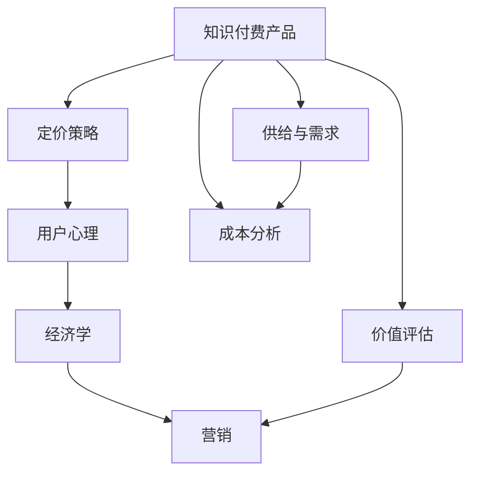

                 

# 知识付费产品的定价心理学

> 关键词：知识付费, 定价策略, 用户心理, 经济学, 营销

## 1. 背景介绍

在数字化信息爆炸的当下，知识付费已经成为连接知识创作者和广大受众的重要桥梁。各类知识付费平台如雨后春笋般涌现，如得到、喜马拉雅、新东方在线等，将在线教育和知识传播带入了一个新高度。然而，如何确定合理的价格策略，使之既能实现知识创作者的利益，又能吸引广大用户的参与，成为知识付费产品运营中至关重要的一环。

知识付费的定价需要考虑到多重因素，包括成本、市场定位、用户心理和竞争状况等。本文将通过经济学和心理学的角度，深入分析知识付费产品的定价心理学，为知识创作者和平台运营者提供参考，以期优化产品定价策略，提升用户价值，实现可持续发展。

## 2. 核心概念与联系

### 2.1 核心概念概述

#### 知识付费

知识付费是指消费者为获取知识或信息而支付费用的行为，如购买电子书、在线课程、知识问答等。它将信息作为一种商品，通过付费机制激励知识生产，保护知识产权，同时也是知识消费者对知识价值的认同与尊重。

#### 定价策略

定价策略是指企业在确定产品或服务价格时所采用的方法和原则。在知识付费领域，定价策略需要平衡知识创作者的收入与用户可负担性，同时反映知识内容的价值和稀缺性。

#### 用户心理

用户心理指的是用户对价格的心理感受和反应，包括价值感知、满意度和消费动机等。在知识付费中，合理的价格能够激发用户的购买欲望，增强用户的忠诚度，从而提升知识付费产品的市场竞争力。

#### 经济学

经济学涉及商品和服务的供给与需求，价格形成机制，以及市场效率等重要概念。在知识付费的定价中，经济学原理提供了丰富的理论基础和方法论支持。

#### 营销

营销是指通过各种手段促进产品或服务销售的商业活动，包括市场调研、产品定位、价格策略、推广渠道等。在知识付费领域，营销策略能帮助产品精准定位用户需求，提高产品知名度和用户参与度。

### 2.2 核心概念原理和架构的 Mermaid 流程图



这个流程图展示了知识付费产品定价策略的核心组成元素，它们相互作用，共同影响定价过程。供给与需求决定价格的上下限，成本和价值评估影响定价策略的具体选择，而用户心理和营销策略则影响用户对价格的反应和购买意愿。

## 3. 核心算法原理 & 具体操作步骤

### 3.1 算法原理概述

知识付费产品的定价通常基于以下经济学原则：

- **价值感知理论**：用户对产品价值的感知与实际价格相关，价格越高，用户对价值的期望也越高。因此，适当调高价格，有助于提升用户对知识内容价值的感知。
- **竞争定价策略**：参考市场上类似产品的定价，调整自身产品定价以保持市场竞争力。
- **成本加成定价**：基于产品生产成本，加上一定比例的利润，形成最终售价。
- **价值导向定价**：根据知识内容的独特价值和稀缺性，设定高价。

### 3.2 算法步骤详解

#### Step 1: 成本分析

确定产品定价的第一步是对生产成本进行分析，包括人力成本、知识获取成本、技术开发成本、市场推广成本等。了解成本，能够确保产品定价不会低于其成本，保证运营可持续性。

#### Step 2: 市场调研

了解市场上类似产品的定价情况，分析其优缺点，找出差距和机会。市场调研有助于制定符合市场定位和用户需求的定价策略。

#### Step 3: 价值评估

评估知识内容对用户的价值和稀缺性，通过专家评测、用户调研等方式，获取知识内容的市场认知。高价值、稀缺的知识内容可以设定相对较高的价格。

#### Step 4: 定价模型选择

根据成本、市场和价值评估结果，选择合适的定价模型，如价值导向定价、竞争定价或成本加成定价。

#### Step 5: 定价策略实施

根据定价模型和市场调研结果，制定具体的定价策略，考虑用户心理和营销手段，确保产品定价能够吸引用户，并反映知识价值。

### 3.3 算法优缺点

#### 优点

- **精确反映知识价值**：高价值的知识内容可以设定高价，确保创作者获得应得的回报。
- **提升用户价值感知**：合理的定价策略能够提高用户对知识内容的价值感知，激发购买动机。
- **保持市场竞争力**：参考市场定价，调整自身定价，保持市场竞争力。

#### 缺点

- **定价过高**：定价过高可能超出用户承受能力，影响用户购买意愿。
- **市场反应不确定**：用户对价格的反应受多种因素影响，定价策略可能需要多次迭代才能确定最优。
- **可能被视为不平等**：高价值与高价格未必总是匹配，定价策略可能引发用户对公平性的质疑。

### 3.4 算法应用领域

知识付费定价策略广泛应用于在线教育、知识问答、学术研究等多个领域。无论是在线课程、电子书、还是专家咨询，合理的定价策略都能提高知识付费产品的吸引力和用户粘性。

## 4. 数学模型和公式 & 详细讲解 & 举例说明

### 4.1 数学模型构建

知识付费产品定价的数学模型通常基于以下变量：

- **C**：生产成本
- **V**：知识内容的价值
- **P**：定价
- **D**：市场需求
- **S**：供应

定价模型可以表示为：

$$ P = f(C, V, D, S) $$

其中，$f$ 表示定价函数。

### 4.2 公式推导过程

根据上述变量，推导出如下定价公式：

- **成本加成定价**：

$$ P = C + kV $$

其中 $k$ 为利润率。

- **价值导向定价**：

$$ P = \frac{V}{(1 - \beta)} $$

其中 $\beta$ 为折扣率，表示实际价格与理论价格的差异。

- **竞争定价**：

$$ P = P_{\text{参考}} + \delta $$

其中 $P_{\text{参考}}$ 为参考产品的价格，$\delta$ 为差异化定价。

### 4.3 案例分析与讲解

#### 案例一：在线课程定价

假设有门在线课程的生产成本为 $C = 500$ 元，知识内容的价值为 $V = 2000$ 元，市场需求为 $D = 1000$，供应为 $S = 100$。

**成本加成定价**：

$$ P = 500 + 0.3 \times 2000 = 2200 $$

**价值导向定价**：

$$ P = \frac{2000}{(1 - 0.1)} = 2222.22 $$

**竞争定价**：

假设参考产品的价格为 $P_{\text{参考}} = 1500$，若要增加10%的差异化定价，则：

$$ P = 1500 + 0.1 \times 1500 = 1650 $$

根据上述计算，可以选择 $P = 2200$ 元作为定价，既反映了知识内容的价值，又考虑了市场需求和成本。

## 5. 项目实践：代码实例和详细解释说明

### 5.1 开发环境搭建

知识付费产品的定价算法通常使用Python编程语言实现。以下是Python开发环境搭建的步骤：

1. 安装Python：可以从官网下载Python 3.x版本，或使用Anaconda等Python发行版。
2. 安装相关库：如NumPy、Pandas、Matplotlib等，使用pip命令安装。
3. 配置开发工具：如Jupyter Notebook、PyCharm等。

### 5.2 源代码详细实现

#### Step 1: 成本分析

假设知识付费产品生产成本为 $C$，可以定义为：

```python
import pandas as pd
from sympy import symbols, Rational

# 定义成本变量
C = 500
```

#### Step 2: 市场调研

假设有若干产品，可以定义市场需求和供应：

```python
# 市场需求和供应
D = 1000
S = 100

# 计算供需比率
supply_ratio = S / D
```

#### Step 3: 价值评估

假设有专家评估知识内容价值为 $V$，可以定义：

```python
# 知识内容价值
V = 2000
```

#### Step 4: 定价模型选择

选择合适的定价模型，这里以价值导向定价为例：

```python
# 折扣率
beta = Rational(1, 10)

# 定价函数
def price_function(V, beta):
    return V / (1 - beta)

# 计算定价
P_value_based = price_function(V, beta)
print("价值导向定价：", P_value_based)
```

#### Step 5: 定价策略实施

假设参考产品价格为 $P_{\text{参考}}$，选择竞争定价：

```python
# 参考产品价格
P_reference = 1500

# 差异化定价
delta = P_reference * Rational(1, 10)

# 计算定价
P_competitive = P_reference + delta
print("竞争定价：", P_competitive)
```

### 5.3 代码解读与分析

这段代码展示了如何通过Python实现知识付费产品的定价计算。通过定义成本、市场需求、供应和价值变量，选择定价模型，并进行实际定价计算。可以看到，价值导向定价和竞争定价的计算过程相对简单，但结果却能反映知识内容的价值和市场竞争状况。

### 5.4 运行结果展示

根据上述代码运行结果，得到价值导向定价为2222.22元，竞争定价为1650元。在选择定价策略时，需要综合考虑知识内容价值、市场需求、供应、成本等多个因素，才能制定出符合用户心理和市场竞争的定价策略。

## 6. 实际应用场景

### 6.1 在线教育

在线教育平台如Coursera、Udacity等广泛使用知识付费定价策略，通过设置课程价格，激励用户付费学习。对于高价值的课程内容，如MBA、编程课程等，定价较高，而针对大众用户提供免费入门课程，以吸引用户关注。

### 6.2 知识问答

知识问答平台如知乎、知乎live等，通过定价策略提高平台价值。专家通过付费回答问题，提高问题质量和回答专业性，同时平台收取一定比例的手续费，保障平台运营。

### 6.3 学术研究

学术研究平台如ResearchGate、Academia等，通过知识付费策略促进科研交流。研究者付费获取论文或研究报告，同时平台收取一定比例的佣金，保障平台运营，推动科研合作。

### 6.4 未来应用展望

随着人工智能和大数据技术的发展，知识付费产品的定价策略将进一步优化。通过数据分析和机器学习，能够更加精准地把握用户需求，实现个性化定价，提升用户价值和满意度。

## 7. 工具和资源推荐

### 7.1 学习资源推荐

- **《经济学原理》**：由N·格里高利·曼昆（N. Gregory Mankiw）所著，涵盖了微观经济学和宏观经济学的基本概念和理论，是经济学学习的经典教材。
- **《行为经济学》**：由理查德·塞勒（Richard Thaler）所著，探讨了行为经济学中的认知偏差、情感驱动等心理学原理，对理解用户心理和行为有重要意义。
- **《定价心理学》**：由卡洛·庞皮（Carlo Perotta）所著，专门探讨了定价策略中的心理学因素，如价值感知、公平感等，对制定知识付费产品定价策略有很高的参考价值。

### 7.2 开发工具推荐

- **Jupyter Notebook**：开源的交互式计算环境，支持Python和其他编程语言，适合数据处理和算法开发。
- **PyCharm**：专业的Python开发环境，提供强大的代码编辑、调试、测试等功能。
- **Anaconda**：Python发行版，内置了多种科学计算和数据分析库，方便开发者快速上手。

### 7.3 相关论文推荐

- **《行为经济学中的定价》**：丹尼尔·卡纳曼（Daniel Kahneman）、保罗·斯洛维奇（Philip E. Tetlock）等的研究论文，探讨了心理因素在定价中的作用。
- **《基于数据的定价策略》**：Thomas Hastie、Robert Tibshirani等的研究论文，讨论了机器学习在定价策略中的应用。

## 8. 总结：未来发展趋势与挑战

### 8.1 研究成果总结

本文通过经济学和心理学的角度，详细分析了知识付费产品的定价策略，提供了数学模型和实际案例，展示了知识付费定价的决策过程和影响因素。通过成本分析、市场调研、价值评估和定价模型选择，能够制定出既反映知识内容价值，又符合市场竞争的定价策略。

### 8.2 未来发展趋势

未来，知识付费定价策略将进一步智能化、数据化。通过机器学习和大数据分析，能够更加精准地把握用户需求，实现个性化定价，提升用户价值和满意度。同时，结合AI和自然语言处理技术，能够进一步优化定价算法，提高定价决策的科学性和效率。

### 8.3 面临的挑战

尽管知识付费定价策略已经较为成熟，但仍面临诸多挑战：

- **用户需求多变**：不同用户对知识内容的需求和支付能力各异，如何精准把握用户心理和需求变化，是定价策略的关键。
- **市场竞争激烈**：知识付费市场竞争激烈，如何制定有竞争力的定价策略，保持市场份额，需要不断创新和优化。
- **公平性问题**：高价值的知识内容对应高价格，但用户感知到的价值可能存在差异，如何平衡价值和价格，增强用户公平感，需要深入研究。

### 8.4 研究展望

未来的研究需要进一步探索以下方向：

- **个性化定价**：利用大数据和机器学习技术，实现个性化定价，提升用户价值和满意度。
- **用户心理分析**：深入研究用户心理因素，如需求驱动、情感因素等，优化定价策略，增强用户粘性。
- **定价算法优化**：结合经济学和心理学原理，优化定价算法，提高定价决策的科学性和效率。

这些研究方向的探索，将为知识付费产品的定价策略提供新的思路和方法，进一步推动知识付费行业的发展和创新。

## 9. 附录：常见问题与解答

**Q1: 什么是知识付费？**

A: 知识付费是指消费者为获取知识或信息而支付费用的行为，如购买电子书、在线课程、知识问答等。

**Q2: 如何进行市场调研？**

A: 市场调研可以通过问卷调查、数据分析、竞争对比等方式进行，了解市场上类似产品的定价和用户反馈，找出差距和机会。

**Q3: 如何进行价值评估？**

A: 价值评估可以通过专家评测、用户调研等方式进行，获取知识内容的市场认知和用户价值感知。

**Q4: 如何确定合理的定价策略？**

A: 确定合理的定价策略需要考虑成本、市场、用户心理和竞争状况，选择适合的定价模型，并进行实际计算和迭代优化。

**Q5: 如何提高用户价值？**

A: 提高用户价值需要不断优化产品内容和服务体验，同时提供个性化定价和精准营销，增强用户粘性和满意度。

---

作者：禅与计算机程序设计艺术 / Zen and the Art of Computer Programming

