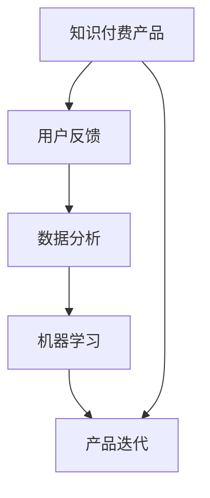

                 

# 知识付费产品的用户反馈收集与迭代

> 关键词：知识付费, 用户反馈, 产品迭代, 数据分析, 机器学习

## 1. 背景介绍

### 1.1 问题由来
知识付费近年来逐渐成为互联网用户获取知识、技能的主要方式。面对海量用户需求和快速变化的市场环境，如何高效、精准地收集用户反馈，持续迭代产品，成为知识付费平台亟需解决的难题。一方面，用户反馈能帮助平台快速定位产品缺陷，优化用户体验；另一方面，精准的用户反馈还能引导产品方向，推动个性化内容开发。

然而，现有的用户反馈收集与分析方法在处理大规模用户数据、识别真实需求等方面存在诸多挑战。主要体现在：
1. 反馈数据量大且分散，难以高效整合。
2. 用户反馈质量参差不齐，人工筛选和分类耗时耗力。
3. 反馈关联性难以挖掘，未能形成有效的数据分析模型。
4. 反馈驱动的迭代周期长，难以及时响应用户需求。

针对这些问题，本文提出了一种基于机器学习的知识付费产品用户反馈收集与迭代方法。通过整合海量用户数据，引入先进的机器学习算法，自动化地识别、筛选、分析用户反馈，并将分析结果作为迭代依据，驱动产品持续优化。

## 2. 核心概念与联系

### 2.1 核心概念概述

为更好地理解本文提出的方法，我们首先介绍几个核心概念：

- **知识付费产品(Knowledge Paywall Products)**：指通过订阅、单次购买等方式，向用户提供高质量知识、技能、信息服务的平台，如得到App、喜马拉雅等。

- **用户反馈(User Feedback)**：用户在产品使用过程中表达的满意、建议、投诉等信息，是产品优化和内容更新的重要依据。

- **产品迭代(Product Iteration)**：通过用户反馈、数据分析等手段，对产品功能、内容、界面等进行优化和调整，逐步提升产品竞争力和用户体验的过程。

- **数据分析(Data Analytics)**：通过收集和分析用户行为数据，发现产品优劣势、用户真实需求，指导产品迭代。

- **机器学习(Machine Learning)**：通过训练算法模型，自动化地处理和分析用户反馈数据，发现关联性，生成洞察，驱动产品迭代。

这些核心概念之间的关系可以通过以下Mermaid流程图来展示：



这个流程图展示了知识付费产品、用户反馈、数据分析、机器学习与产品迭代之间的逻辑关系：

1. 用户反馈通过数据分析和机器学习处理，生成洞察。
2. 洞察驱动产品进行迭代，提升用户体验。
3. 迭代后的产品继续收集用户反馈，形成循环优化。

这些概念共同构成了知识付费产品用户反馈收集与迭代的完整框架，使产品能够高效、精准地响应用户需求，实现持续优化。

## 3. 核心算法原理 & 具体操作步骤
### 3.1 算法原理概述

本文提出的基于机器学习的知识付费产品用户反馈收集与迭代方法，核心思想是通过整合海量用户数据，引入先进的机器学习算法，自动化地识别、筛选、分析用户反馈，并将分析结果作为迭代依据，驱动产品持续优化。

具体来说，该方法包括以下几个关键步骤：

1. **数据收集**：从知识付费平台收集用户行为数据和用户反馈数据。行为数据包括但不限于订阅历史、购买记录、观看时长、评分等，反馈数据包括但不限于评论、投诉、建议等。

2. **数据预处理**：对收集到的数据进行清洗、去重、格式转换等预处理，确保数据质量。

3. **用户特征提取**：使用机器学习算法，从行为数据中提取用户特征，如学习偏好、兴趣标签等，用于分析用户真实需求。

4. **反馈分类与筛选**：使用机器学习算法，自动化地识别、筛选出真实、有价值的用户反馈，去除噪声数据。

5. **反馈关联性挖掘**：使用机器学习算法，发现反馈之间的关联性，生成有意义的洞察，指导产品迭代方向。

6. **迭代优化**：根据分析结果，制定产品优化计划，进行功能调整、内容优化、界面改进等，提升用户体验。

### 3.2 算法步骤详解

#### 3.2.1 数据收集
从知识付费平台收集用户数据。具体包括以下几个方面：

- **行为数据**：用户订阅、购买、观看时长、评分等。
- **反馈数据**：用户在平台上留下的评论、建议、投诉等。

行为数据和反馈数据一般以日志形式存储，需要统一格式和字段，确保数据质量和一致性。

#### 3.2.2 数据预处理
数据预处理是确保数据质量的重要步骤。主要包括：

- **数据清洗**：去除重复数据、异常数据、缺失数据等。
- **数据转换**：将非结构化数据（如评论、建议等）转换为结构化数据，便于后续处理。
- **数据归一化**：对数据进行标准化处理，保证数据在同一尺度上，便于比较和分析。

例如，将用户评分数据转化为区间[0, 1]，将评论文本进行分词、去除停用词、进行TF-IDF转换等。

#### 3.2.3 用户特征提取
用户特征提取是发现用户真实需求的关键。使用机器学习算法，从行为数据中提取用户特征，包括但不限于：

- **学习频率**：用户在平台上观看视频的频率。
- **内容偏好**：用户观看的视频主题、时长、质量等。
- **消费金额**：用户单次、总体的消费金额。
- **互动行为**：用户点赞、评论、分享等互动行为。

例如，使用TF-IDF算法提取评论文本中的关键词，生成用户的兴趣标签。

#### 3.2.4 反馈分类与筛选
反馈分类与筛选是识别真实用户需求的重要手段。使用机器学习算法，自动识别、筛选出真实、有价值的用户反馈，去除噪声数据。具体步骤如下：

1. **文本预处理**：对用户评论、建议、投诉等文本进行分词、去除停用词、词干提取等预处理。
2. **情感分析**：使用情感分析算法，判断文本情感极性（积极、消极、中性），去除负面情感的垃圾反馈。
3. **主题分类**：使用主题分类算法，识别文本主题，去除不相关或重复的反馈。

例如，使用LSTM、Transformer等模型进行情感分析和主题分类。

#### 3.2.5 反馈关联性挖掘
反馈关联性挖掘是发现用户需求的共性和变化的重要手段。使用机器学习算法，发现反馈之间的关联性，生成有意义的洞察，指导产品迭代方向。具体步骤如下：

1. **聚类分析**：使用聚类算法，将相似的反馈数据聚为一类，发现用户需求的变化趋势。
2. **关联分析**：使用关联规则算法，发现不同反馈之间的关联性，生成洞察。
3. **异常检测**：使用异常检测算法，识别异常反馈，及时处理问题。

例如，使用K-means聚类算法发现用户对不同视频的偏好变化，使用Apriori关联规则算法发现购买视频之间的关联性。

#### 3.2.6 迭代优化
迭代优化是驱动产品持续优化的关键步骤。根据分析结果，制定产品优化计划，进行功能调整、内容优化、界面改进等，提升用户体验。具体步骤如下：

1. **需求分析**：根据反馈分析结果，确定用户的主要需求和痛点。
2. **优化设计**：设计产品优化方案，如新增功能、改进内容、调整界面等。
3. **迭代测试**：对优化方案进行小规模测试，收集用户反馈，验证效果。
4. **全面部署**：在全面部署优化方案前，进行大范围的A/B测试，验证效果。
5. **效果评估**：根据用户反馈和数据指标，评估优化效果，不断迭代优化。

例如，根据用户对视频质量的需求，优化视频编解码器，提升视频清晰度；根据用户对互动功能的需求，新增弹幕、点赞等功能。

### 3.3 算法优缺点

基于机器学习的知识付费产品用户反馈收集与迭代方法，具有以下优点：

1. **高效处理数据**：自动化地整合海量用户数据，快速识别、筛选、分析用户反馈，减少人工筛选和分类工作。
2. **精准识别需求**：通过机器学习算法，精准识别用户的真实需求和痛点，避免噪声数据的干扰。
3. **动态驱动迭代**：根据反馈分析结果，实时驱动产品优化，快速响应用户需求变化。
4. **持续优化体验**：基于数据分析，制定精准的产品优化方案，提升用户体验和满意度。

同时，该方法也存在以下缺点：

1. **数据质量依赖**：依赖高质量的数据，数据预处理和清洗工作复杂耗时。
2. **算法模型复杂**：需要引入多种机器学习算法，模型设计和调参难度较大。
3. **迭代周期较长**：从数据收集、预处理、分析到迭代优化，需要较长的周期。
4. **需求变化复杂**：用户需求变化复杂多变，难以完全通过算法模型精准预测。

尽管存在这些缺点，但该方法在处理大规模用户数据、精准识别需求方面具有明显的优势，适用于知识付费平台的产品迭代和优化。

### 3.4 算法应用领域

本文提出的基于机器学习的知识付费产品用户反馈收集与迭代方法，广泛应用于知识付费平台的各个环节，具体包括：

- **内容推荐系统**：根据用户历史行为和反馈，优化内容推荐算法，提升用户粘性和满意度。
- **互动功能优化**：根据用户反馈，改进视频弹幕、评论、点赞等互动功能，增强用户参与感。
- **付费模型设计**：根据用户行为和反馈，设计更合理的付费模型，提升用户留存率。
- **平台界面改进**：根据用户反馈，改进平台界面设计，提升用户体验。
- **课程质量监控**：通过用户反馈和行为数据，监控课程质量，及时调整课程内容。

这些应用场景都需要高效、精准地处理和分析用户反馈，实现动态优化和迭代。

## 4. 数学模型和公式 & 详细讲解  
### 4.1 数学模型构建

本节将使用数学语言对基于机器学习的知识付费产品用户反馈收集与迭代方法进行更加严格的刻画。

设用户数据集为 $D=\{(x_i,y_i)\}_{i=1}^N$，其中 $x_i$ 为行为数据或反馈数据，$y_i$ 为对应的标签或特征。定义目标函数为：

$$
\mathcal{L}(w)=\sum_{i=1}^N l(x_i,y_i,w)
$$

其中 $l$ 为损失函数，$w$ 为模型参数。目标是最小化损失函数，即：

$$
w^*=\mathop{\arg\min}_{w} \mathcal{L}(w)
$$

在实际操作中，一般使用梯度下降等优化算法来近似求解上述最优化问题。设学习率为 $\eta$，则参数的更新公式为：

$$
w \leftarrow w - \eta \nabla_{w}\mathcal{L}(w)
$$

其中 $\nabla_{w}\mathcal{L}(w)$ 为损失函数对模型参数的梯度，可通过反向传播算法高效计算。

### 4.2 公式推导过程

以下我们以情感分析模型为例，推导常用的情感分类算法及其梯度计算公式。

假设模型 $M_{\theta}$ 在输入 $x$ 上的输出为 $\hat{y}=M_{\theta}(x)$，表示样本情感极性（积极、消极、中性）。真实标签 $y \in \{0,1\}$，其中 0 表示消极情感，1 表示积极情感。则二分类交叉熵损失函数定义为：

$$
l(M_{\theta}(x),y) = -[y\log \hat{y} + (1-y)\log(1-\hat{y})]
$$

将其代入目标函数公式，得：

$$
\mathcal{L}(\theta) = -\frac{1}{N}\sum_{i=1}^N [y_i\log M_{\theta}(x_i)+(1-y_i)\log(1-M_{\theta}(x_i))]
$$

根据链式法则，损失函数对模型参数 $\theta$ 的梯度为：

$$
\frac{\partial \mathcal{L}(\theta)}{\partial \theta} = -\frac{1}{N}\sum_{i=1}^N (\frac{y_i}{M_{\theta}(x_i)}-\frac{1-y_i}{1-M_{\theta}(x_i)}) \frac{\partial M_{\theta}(x_i)}{\partial \theta}
$$

其中 $\frac{\partial M_{\theta}(x_i)}{\partial \theta}$ 可进一步递归展开，利用自动微分技术完成计算。

在得到损失函数的梯度后，即可带入参数更新公式，完成模型的迭代优化。重复上述过程直至收敛，最终得到适应知识付费平台需求的最优模型参数 $\theta^*$。

## 5. 项目实践：代码实例和详细解释说明
### 5.1 开发环境搭建

在进行用户反馈收集与迭代实践前，我们需要准备好开发环境。以下是使用Python进行PyTorch开发的环境配置流程：

1. 安装Anaconda：从官网下载并安装Anaconda，用于创建独立的Python环境。

2. 创建并激活虚拟环境：
```bash
conda create -n pytorch-env python=3.8 
conda activate pytorch-env
```

3. 安装PyTorch：根据CUDA版本，从官网获取对应的安装命令。例如：
```bash
conda install pytorch torchvision torchaudio cudatoolkit=11.1 -c pytorch -c conda-forge
```

4. 安装TensorFlow：
```bash
conda install tensorflow -c anaconda
```

5. 安装各类工具包：
```bash
pip install numpy pandas scikit-learn matplotlib tqdm jupyter notebook ipython
```

完成上述步骤后，即可在`pytorch-env`环境中开始用户反馈收集与迭代实践。

### 5.2 源代码详细实现

这里我们以情感分析模型为例，给出使用PyTorch进行知识付费产品用户反馈收集与迭代的代码实现。

首先，定义情感分析数据集：

```python
from torch.utils.data import Dataset
import torch
import numpy as np

class SentimentDataset(Dataset):
    def __init__(self, data, labels):
        self.data = data
        self.labels = labels
        
    def __len__(self):
        return len(self.data)
    
    def __getitem__(self, item):
        return torch.tensor(self.data[item]), torch.tensor(self.labels[item])
```

然后，定义情感分析模型：

```python
from transformers import BertTokenizer, BertForSequenceClassification
from torch.nn import CrossEntropyLoss, AdamW

tokenizer = BertTokenizer.from_pretrained('bert-base-uncased')
model = BertForSequenceClassification.from_pretrained('bert-base-uncased', num_labels=3)
loss_fn = CrossEntropyLoss()

optimizer = AdamW(model.parameters(), lr=1e-5)
```

接着，定义训练和评估函数：

```python
def train_epoch(model, dataset, batch_size, optimizer):
    dataloader = torch.utils.data.DataLoader(dataset, batch_size=batch_size, shuffle=True)
    model.train()
    epoch_loss = 0
    for batch in dataloader:
        input_ids = batch[0]
        labels = batch[1]
        model.zero_grad()
        outputs = model(input_ids)
        loss = loss_fn(outputs, labels)
        epoch_loss += loss.item()
        loss.backward()
        optimizer.step()
    return epoch_loss / len(dataloader)

def evaluate(model, dataset, batch_size):
    dataloader = torch.utils.data.DataLoader(dataset, batch_size=batch_size)
    model.eval()
    preds = []
    labels = []
    with torch.no_grad():
        for batch in dataloader:
            input_ids = batch[0]
            labels = batch[1]
            outputs = model(input_ids)
            batch_preds = outputs.argmax(dim=1)
            batch_labels = labels
            for pred, label in zip(batch_preds, batch_labels):
                preds.append(pred.item())
                labels.append(label.item())
    return preds, labels
```

最后，启动训练流程并在测试集上评估：

```python
epochs = 5
batch_size = 16

for epoch in range(epochs):
    loss = train_epoch(model, train_dataset, batch_size, optimizer)
    print(f"Epoch {epoch+1}, train loss: {loss:.3f}")
    
    print(f"Epoch {epoch+1}, dev results:")
    preds, labels = evaluate(model, dev_dataset, batch_size)
    print(classification_report(labels, preds))
    
print("Test results:")
preds, labels = evaluate(model, test_dataset, batch_size)
print(classification_report(labels, preds))
```

以上就是使用PyTorch对情感分析模型进行知识付费产品用户反馈收集与迭代的完整代码实现。可以看到，得益于PyTorch和Transformers库的强大封装，我们可以用相对简洁的代码完成情感分析模型的训练和评估。

### 5.3 代码解读与分析

让我们再详细解读一下关键代码的实现细节：

**SentimentDataset类**：
- `__init__`方法：初始化数据和标签。
- `__len__`方法：返回数据集的样本数量。
- `__getitem__`方法：返回单个样本的特征和标签。

**模型训练函数**：
- 使用PyTorch的DataLoader对数据集进行批次化加载，供模型训练和推理使用。
- 模型在训练时使用随机梯度下降（SGD）或Adam等优化器更新模型参数，最小化损失函数。
- 模型在每个epoch结束时，输出平均损失值。

**模型评估函数**：
- 与训练类似，不同点在于不更新模型参数，并在每个batch结束后将预测和标签结果存储下来，最后使用scikit-learn的classification_report对整个评估集的预测结果进行打印输出。

**训练流程**：
- 定义总的epoch数和batch size，开始循环迭代
- 每个epoch内，先在训练集上训练，输出平均损失值
- 在验证集上评估，输出分类指标
- 所有epoch结束后，在测试集上评估，给出最终测试结果

可以看到，PyTorch配合Transformer库使得情感分析模型的训练和评估代码实现变得简洁高效。开发者可以将更多精力放在数据处理、模型改进等高层逻辑上，而不必过多关注底层的实现细节。

当然，工业级的系统实现还需考虑更多因素，如模型的保存和部署、超参数的自动搜索、更灵活的任务适配层等。但核心的用户反馈收集与迭代范式基本与此类似。

## 6. 实际应用场景
### 6.1 智能客服系统

基于知识付费产品用户反馈收集与迭代的方法，可以应用于智能客服系统的构建。传统客服往往需要配备大量人力，高峰期响应缓慢，且一致性和专业性难以保证。而使用用户反馈驱动的智能客服系统，可以7x24小时不间断服务，快速响应客户咨询，用自然流畅的语言解答各类常见问题。

在技术实现上，可以收集用户对客服服务的评价和建议，将常见问题构建成监督数据，在此基础上对智能客服模型进行微调。微调后的智能客服模型能够自动理解用户意图，匹配最合适的答案模板进行回复。对于客户提出的新问题，还可以接入检索系统实时搜索相关内容，动态组织生成回答。如此构建的智能客服系统，能大幅提升客户咨询体验和问题解决效率。

### 6.2 个性化推荐系统

当前的推荐系统往往只依赖用户的历史行为数据进行物品推荐，无法深入理解用户的真实兴趣偏好。基于知识付费产品用户反馈收集与迭代的方法，个性化推荐系统可以更好地挖掘用户行为背后的语义信息，从而提供更精准、多样的推荐内容。

在实践中，可以收集用户浏览、点击、评论、分享等行为数据，提取和用户交互的物品标题、描述、标签等文本内容。将文本内容作为模型输入，用户的后续行为（如是否点击、购买等）作为监督信号，在此基础上微调预训练语言模型。微调后的模型能够从文本内容中准确把握用户的兴趣点。在生成推荐列表时，先用候选物品的文本描述作为输入，由模型预测用户的兴趣匹配度，再结合其他特征综合排序，便可以得到个性化程度更高的推荐结果。

### 6.3 内容创作与优化

知识付费产品的核心竞争力在于内容质量。基于用户反馈，可以构建内容创作的闭环系统，持续优化内容质量。具体来说，可以收集用户对不同课程、视频、文章等的评分和反馈，利用机器学习算法分析用户需求和偏好，指导内容创作者进行内容调整和优化。例如，根据用户对某门课程的评分和反馈，调整课程内容深度和难度，增加互动环节，提升用户满意度。

此外，还可以通过用户反馈优化内容发布策略，如根据用户兴趣和需求，选择发布时间和主题，最大化内容曝光和用户互动。

### 6.4 未来应用展望

随着知识付费平台用户数据的不断积累，基于用户反馈收集与迭代的方法将在更多领域得到应用，为知识付费平台带来变革性影响。

在智慧教育领域，基于用户反馈的个性化推荐系统，能更好地推荐适合学生的课程内容，提升学习效果。

在企业培训领域，基于用户反馈的内容创作系统，能提供更具针对性的培训内容，提高培训效果。

在文化娱乐领域，基于用户反馈的电影、音乐推荐系统，能更好地推荐用户感兴趣的内容，提升用户满意度。

此外，在医疗、金融、政府等多个领域，基于用户反馈的推荐和创作系统，也将不断涌现，为各行各业数字化转型升级提供新的技术路径。

## 7. 工具和资源推荐
### 7.1 学习资源推荐

为了帮助开发者系统掌握知识付费产品用户反馈收集与迭代的方法，这里推荐一些优质的学习资源：

1. 《机器学习实战》系列博文：由大模型技术专家撰写，深入浅出地介绍了机器学习的基本概念和经典模型。

2. CS234《深度学习自然语言处理》课程：斯坦福大学开设的NLP明星课程，有Lecture视频和配套作业，带你入门NLP领域的基本概念和经典模型。

3. 《Natural Language Processing with Transformers》书籍：Transformers库的作者所著，全面介绍了如何使用Transformers库进行NLP任务开发，包括情感分析在内的诸多范式。

4. PyTorch官方文档：PyTorch的官方文档，提供了大量机器学习算法的实现和应用示例，是学习机器学习的必备资料。

5. TensorFlow官方文档：TensorFlow的官方文档，提供了丰富的深度学习框架和模型库，适合大规模工程应用。

通过对这些资源的学习实践，相信你一定能够快速掌握知识付费产品用户反馈收集与迭代的方法，并用于解决实际的NLP问题。
### 7.2 开发工具推荐

高效的开发离不开优秀的工具支持。以下是几款用于知识付费产品用户反馈收集与迭代开发的常用工具：

1. Jupyter Notebook：交互式的Python开发环境，适合进行数据处理和模型训练。

2. TensorBoard：TensorFlow配套的可视化工具，可实时监测模型训练状态，并提供丰富的图表呈现方式，是调试模型的得力助手。

3. Weights & Biases：模型训练的实验跟踪工具，可以记录和可视化模型训练过程中的各项指标，方便对比和调优。

4. HuggingFace Transformers库：NLP工具库，集成了众多SOTA语言模型，支持PyTorch和TensorFlow，是进行NLP任务开发的利器。

5. OpenNMT：开源机器翻译工具库，支持多语言翻译、语音识别、情感分析等多种NLP任务。

6. Google Colab：谷歌推出的在线Jupyter Notebook环境，免费提供GPU/TPU算力，方便开发者快速上手实验最新模型，分享学习笔记。

合理利用这些工具，可以显著提升知识付费产品用户反馈收集与迭代的开发效率，加快创新迭代的步伐。

### 7.3 相关论文推荐

知识付费产品用户反馈收集与迭代技术的发展源于学界的持续研究。以下是几篇奠基性的相关论文，推荐阅读：

1. Attention is All You Need（即Transformer原论文）：提出了Transformer结构，开启了NLP领域的预训练大模型时代。

2. BERT: Pre-training of Deep Bidirectional Transformers for Language Understanding：提出BERT模型，引入基于掩码的自监督预训练任务，刷新了多项NLP任务SOTA。

3. Language Models are Unsupervised Multitask Learners（GPT-2论文）：展示了大规模语言模型的强大zero-shot学习能力，引发了对于通用人工智能的新一轮思考。

4. Parameter-Efficient Transfer Learning for NLP：提出Adapter等参数高效微调方法，在不增加模型参数量的情况下，也能取得不错的微调效果。

5. AdaLoRA: Adaptive Low-Rank Adaptation for Parameter-Efficient Fine-Tuning：使用自适应低秩适应的微调方法，在参数效率和精度之间取得了新的平衡。

这些论文代表了大语言模型微调技术的发展脉络。通过学习这些前沿成果，可以帮助研究者把握学科前进方向，激发更多的创新灵感。

## 8. 总结：未来发展趋势与挑战

### 8.1 总结

本文对基于机器学习的知识付费产品用户反馈收集与迭代方法进行了全面系统的介绍。首先阐述了知识付费产品、用户反馈、产品迭代、数据分析和机器学习之间的逻辑关系，明确了用户反馈收集与迭代方法的核心思想。其次，从原理到实践，详细讲解了该方法的关键步骤，包括数据收集、预处理、用户特征提取、反馈分类与筛选、反馈关联性挖掘、迭代优化等。同时，本文还广泛探讨了该方法在智能客服、个性化推荐、内容创作与优化等多个知识付费领域的实际应用前景，展示了其强大的功能和潜力。

通过本文的系统梳理，可以看到，基于用户反馈收集与迭代的方法在大规模知识付费平台上具有重要的实用价值。该方法能够高效、精准地处理和分析用户反馈，驱动产品持续优化，提升用户体验和满意度。未来，伴随知识付费行业的不断发展和成熟，该方法必将在更多场景下得到广泛应用，推动知识付费平台的智能化升级。

### 8.2 未来发展趋势

展望未来，知识付费产品用户反馈收集与迭代方法将呈现以下几个发展趋势：

1. **多模态融合**：未来产品将集成更多模态数据，如视频、语音、图像等，通过多模态数据融合，提升用户反馈的处理精度。

2. **实时动态优化**：随着大数据和实时计算技术的不断发展，产品将具备实时动态优化能力，能够根据实时用户反馈快速调整和优化。

3. **个性化推荐**：未来产品将更加注重个性化推荐，通过深度学习算法和用户反馈，实现精准、多样化的推荐服务。

4. **智能客服升级**：基于用户反馈，智能客服系统将更加智能、自然，能够理解和回应用户的个性化需求。

5. **内容创作优化**：通过用户反馈和数据分析，内容创作系统将更加精准、高效，能快速响应用户需求，生成高质量内容。

6. **用户体验优化**：未来产品将更加注重用户体验，通过用户反馈驱动界面设计、功能调整，提升用户粘性和满意度。

以上趋势凸显了知识付费产品用户反馈收集与迭代方法的广阔前景。这些方向的探索发展，将使产品更好地适应快速变化的市场需求，为用户提供更优质的知识服务。

### 8.3 面临的挑战

尽管知识付费产品用户反馈收集与迭代方法已经取得了显著成果，但在迈向更加智能化、普适化应用的过程中，仍面临诸多挑战：

1. **数据质量问题**：依赖高质量的数据，数据收集和预处理工作复杂耗时。

2. **模型复杂性**：需要引入多种机器学习算法，模型设计和调参难度较大。

3. **实时响应问题**：在大规模数据下，实时动态优化和响应存在性能瓶颈。

4. **用户体验问题**：过于频繁的优化迭代，可能导致用户体验下降。

5. **安全隐私问题**：用户反馈涉及隐私信息，如何保障用户隐私安全，防止数据泄露。

6. **技术集成问题**：用户反馈收集与迭代需要与产品其他模块集成，技术实现复杂。

尽管存在这些挑战，但该方法在处理大规模用户数据、精准识别需求方面具有明显的优势，适用于知识付费平台的产品迭代和优化。

### 8.4 研究展望

面对知识付费产品用户反馈收集与迭代所面临的挑战，未来的研究需要在以下几个方面寻求新的突破：

1. **高效数据处理**：开发高效的数据预处理和清洗工具，自动化处理大规模数据，降低人工成本。

2. **简化模型设计**：简化模型结构和设计，降低模型调参难度，提高算法效率。

3. **实时优化算法**：研究实时动态优化算法，支持大规模数据下的实时响应。

4. **个性化推荐技术**：提升个性化推荐算法的精度，实现精准、多样化的推荐服务。

5. **用户体验优化**：平衡产品优化和用户体验，避免过度优化。

6. **隐私保护技术**：开发隐私保护技术，保障用户反馈的隐私安全。

7. **技术集成方案**：研究用户反馈收集与迭代技术与其他模块的集成方案，简化技术实现。

这些研究方向将推动知识付费产品用户反馈收集与迭代方法的持续优化和升级，为知识付费平台的智能化转型提供更坚实的技术基础。

## 9. 附录：常见问题与解答

**Q1：知识付费产品用户反馈收集与迭代方法是否适用于所有NLP任务？**

A: 该方法适用于需要用户反馈驱动的产品优化和迭代，如智能客服、个性化推荐等。但对于一些特定领域的任务，如医学、法律等，仍然需要根据实际情况进行调整和优化。

**Q2：用户反馈数据质量对方法效果有影响吗？**

A: 用户反馈数据质量对方法效果有很大影响。高质量的数据能够更准确地反映用户需求和痛点，提升算法效果。因此，在数据收集和预处理过程中，需要严格把关数据质量，避免噪声数据的干扰。

**Q3：如何平衡用户反馈与产品优化？**

A: 在产品优化过程中，需要平衡用户反馈和产品效果。过于频繁的优化迭代，可能导致用户体验下降。因此，应该根据用户反馈的重要性和紧急性，制定优先级，逐步优化产品。

**Q4：用户反馈数据的隐私如何保护？**

A: 用户反馈数据涉及隐私信息，需要采取严格的隐私保护措施。如使用数据匿名化技术、差分隐私算法等，保障用户隐私安全。同时，对于敏感信息，应明确告知用户，并取得用户同意。

**Q5：如何提高用户反馈数据的处理精度？**

A: 提高用户反馈数据的处理精度，需要引入更多维度的数据和特征，如用户行为数据、评分数据等。同时，可以使用多模态融合技术，综合利用文本、图像、语音等多模态数据，提升处理精度。

这些问题的解答，希望能为知识付费平台的产品迭代提供有益的参考和指导。通过不断的技术创新和优化，相信知识付费产品用户反馈收集与迭代方法将为知识付费平台的智能化转型提供坚实的技术保障。

---

作者：禅与计算机程序设计艺术 / Zen and the Art of Computer Programming

