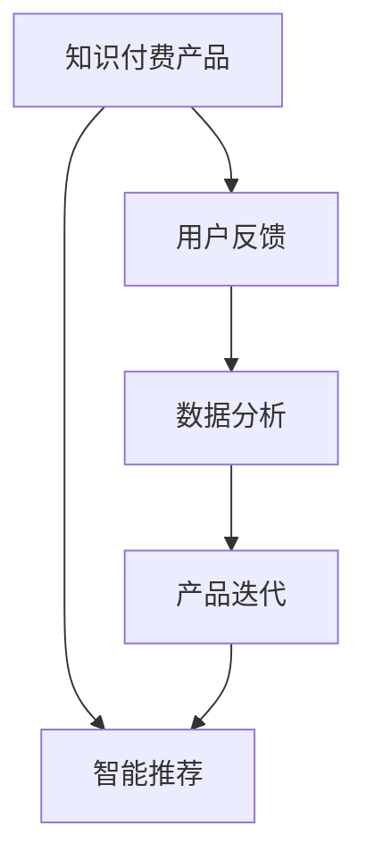

                 

# 知识付费产品的用户反馈闭环管理

> 关键词：知识付费, 用户反馈, 数据分析, 产品迭代, 智能推荐

## 1. 背景介绍

随着互联网和智能设备的普及，在线知识付费行业蓬勃发展，用户在各大平台上获取知识的需求日益增长。根据艾瑞咨询报告，2022年中国知识付费市场规模达到311亿元，同比增长38.3%。知识付费产品如得到App、喜马拉雅等，通过付费订阅、课程点播、智能推荐等多种形式，为用户的终身学习提供了便利。

然而，高质量的知识付费内容供给与用户获取内容的精准性和满意度之间存在差距。如何通过用户反馈数据，不断优化产品，提升用户体验，成为知识付费平台必须解决的问题。传统的反馈收集方式依赖于用户手动评分、评论等低频交互行为，难以形成高效的反馈闭环，无法实现快速的产品迭代和精准推荐。

本文旨在通过深度分析知识付费产品的用户反馈数据，提出基于用户反馈的闭环管理模型，并结合最新的自然语言处理技术和人工智能算法，提出多维度的用户反馈获取和分析方法，实现产品的精准迭代和个性化推荐，提升用户体验和平台黏性。

## 2. 核心概念与联系

### 2.1 核心概念概述

- **知识付费产品**：指通过付费形式提供知识和信息服务，主要形式包括订阅、购买课程、智能推荐等。
- **用户反馈**：用户在使用产品过程中产生的评价、评分、评论等行为数据，反映了用户体验和满意度。
- **数据分析**：通过对用户反馈数据的统计分析，识别用户需求、产品缺陷和改进点。
- **产品迭代**：根据数据分析结果，优化产品功能和设计，提升用户体验和满意度。
- **智能推荐**：利用机器学习算法，对用户行为数据进行建模，实现内容的精准推荐。

这些核心概念之间的逻辑关系可以通过以下Mermaid流程图来展示：



这个流程图展示了一个闭环式的知识付费产品改进流程：

1. 知识付费产品通过智能推荐和互动行为获取用户反馈。
2. 数据分析对用户反馈数据进行深入挖掘和分析。
3. 根据数据分析结果，进行产品迭代优化。
4. 迭代优化后的产品通过智能推荐继续反馈给用户，形成良性闭环。

## 3. 核心算法原理 & 具体操作步骤
### 3.1 算法原理概述

知识付费产品的用户反馈闭环管理，本质上是通过数据分析和机器学习算法，将用户反馈数据转化为有价值的洞察，指导产品迭代和内容优化。其核心思想是：

1. **数据采集**：从多个渠道（如App内评分、评论、点击等）获取用户反馈数据。
2. **数据清洗**：对采集的数据进行去重、去噪、标注等处理，确保数据的准确性和完整性。
3. **特征提取**：将用户反馈数据转化为可供分析的特征向量，供后续建模使用。
4. **模型训练**：基于特征向量，训练多种模型（如用户满意度预测模型、用户兴趣分类模型等）。
5. **结果应用**：将模型预测结果应用于产品迭代和智能推荐中，实现反馈闭环。

### 3.2 算法步骤详解

#### 3.2.1 数据采集

知识付费平台可以从以下几个渠道采集用户反馈数据：

- **App内评分**：用户对课程、专栏的评分行为。
- **评论内容**：用户对课程、专栏的详细评论。
- **互动行为**：用户对课程、专栏的互动行为，如点击、播放、订阅等。
- **用户行为日志**：用户在平台上产生的行为数据，如页面停留时间、浏览内容等。

通过API接口或日志分析工具，采集这些数据，确保数据的及时性和全面性。

#### 3.2.2 数据清洗

对采集的数据进行清洗，去除噪声和冗余信息，主要包括以下步骤：

- **去重**：识别并去除重复的评分、评论、互动行为等数据。
- **去噪**：过滤掉明显异常的评分、评论等数据，如明显误评的负分评论。
- **标注**：对评论内容进行情感分析、主题分类等标注，提取有价值的信息。

#### 3.2.3 特征提取

将清洗后的数据转化为特征向量，供后续分析使用。主要特征包括：

- **用户基本信息**：用户年龄、性别、职业等。
- **课程基本信息**：课程名称、作者、时长等。
- **行为数据**：评分、评论内容、点击、播放等。
- **情感分析结果**：评论的情感极性、情感强度等。
- **用户画像**：用户兴趣、行为偏好等。

#### 3.2.4 模型训练

根据特征向量，训练多种模型，以实现不同目标：

- **用户满意度预测模型**：基于评分、评论、互动行为等数据，预测用户的满意度，识别不满意用户。
- **用户兴趣分类模型**：基于用户画像和行为数据，将用户分为不同兴趣群体。
- **内容推荐模型**：利用用户画像和兴趣分类结果，实现内容的精准推荐。

#### 3.2.5 结果应用

将模型预测结果应用于产品迭代和智能推荐中，形成闭环管理：

- **产品迭代**：根据用户满意度预测结果，识别出不满意课程和用户，进行改进优化。
- **智能推荐**：基于用户兴趣分类和行为数据，实现内容的精准推荐，提升用户粘性。

### 3.3 算法优缺点

基于用户反馈的闭环管理方法具有以下优点：

- **实时性高**：能够快速响应用户反馈，实现实时产品迭代。
- **多维度分析**：结合评分、评论、互动等多种数据，全面了解用户需求。
- **可扩展性强**：适用于不同规模和类型的产品，易于扩展和集成。

同时，该方法也存在一定的局限性：

- **数据隐私问题**：涉及用户隐私数据，需确保数据采集和处理过程中的隐私保护。
- **模型复杂度**：多个模型的训练和应用增加了算法的复杂度，需保证计算资源和算法效率。
- **结果解释性差**：模型结果的解释性较差，难以直接对应具体问题，需要进一步优化。

尽管存在这些局限性，但该方法在知识付费产品中的应用已证明其有效性，为产品优化和用户体验提升提供了有力支持。未来研究将侧重于提升模型的可解释性，优化数据隐私保护，以及降低算法复杂度。

### 3.4 算法应用领域

基于用户反馈的闭环管理方法，已广泛应用于知识付费平台的用户体验优化和内容推荐中。具体应用场景包括：

- **课程优化**：基于用户满意度预测结果，优化课程内容和结构，提升用户满意度。
- **推荐系统**：结合用户兴趣分类和行为数据，实现内容的个性化推荐，提高用户粘性。
- **产品迭代**：根据用户反馈数据，进行产品功能的迭代优化，提升用户体验。
- **用户流失预警**：通过用户行为数据分析，识别可能流失的用户，提前进行挽留。

## 4. 数学模型和公式 & 详细讲解 & 举例说明

### 4.1 数学模型构建

本节将使用数学语言对基于用户反馈的闭环管理模型进行严格刻画。

设知识付费平台有N个用户，M门课程，用户对第i门课程j的评分和评论内容为$X_{ij}$，互动行为为$Y_{ij}$。将用户反馈数据表示为$D=\{(X_{ij}, Y_{ij})\}_{i=1}^N, j=1,...,M$。

定义用户满意度函数$f(u)$，表示用户u对课程的满意度，将用户满意度预测模型表示为：

$$
\hat{f}(u|X_{ij}, Y_{ij}) = \mathop{\arg\min}_{f} \sum_{i=1}^N \sum_{j=1}^M \text{Loss}(f(u|X_{ij}, Y_{ij}), f_{\theta}(X_{ij}, Y_{ij}))
$$

其中$\text{Loss}$为损失函数，$f_{\theta}$为满意度预测模型的参数。

用户兴趣分类模型定义为：

$$
\hat{g}(u|X_{ij}, Y_{ij}) = \mathop{\arg\min}_{g} \sum_{i=1}^N \sum_{j=1}^M \text{Loss}(g(u|X_{ij}, Y_{ij}), g_{\phi}(X_{ij}, Y_{ij}))
$$

其中$\text{Loss}$为损失函数，$g_{\phi}$为用户兴趣分类模型的参数。

内容推荐模型定义为：

$$
\hat{r}(c|X_{ij}, Y_{ij}) = \mathop{\arg\min}_{r} \sum_{i=1}^N \sum_{j=1}^M \text{Loss}(r(c|X_{ij}, Y_{ij}), r_{\psi}(X_{ij}, Y_{ij}))
$$

其中$\text{Loss}$为损失函数，$r_{\psi}$为内容推荐模型的参数。

### 4.2 公式推导过程

以下我们以用户满意度预测模型为例，推导模型损失函数及其梯度计算公式。

设用户满意度函数$f(u)$为二分类问题，表示用户u对课程j的满意度是否高于阈值$\tau$。基于用户评分和评论内容$X_{ij}$、互动行为$Y_{ij}$，满意度预测模型$f_{\theta}$为：

$$
f_{\theta}(X_{ij}, Y_{ij}) = \text{sigmoid}(\theta_0 + \theta_1^TX_{ij} + \theta_2^TY_{ij})
$$

其中$\text{sigmoid}$为逻辑回归函数。损失函数$\text{Loss}$为交叉熵损失函数：

$$
\text{Loss}(f(u|X_{ij}, Y_{ij}), f_{\theta}(X_{ij}, Y_{ij})) = -\left(u \log f_{\theta}(X_{ij}, Y_{ij}) + (1-u) \log (1-f_{\theta}(X_{ij}, Y_{ij}))\right)
$$

定义损失函数对模型参数$\theta$的梯度为$\nabla_{\theta}\text{Loss}$，利用自动微分技术完成计算。通过反向传播算法，根据损失函数对模型参数的梯度，更新模型参数$\theta$：

$$
\theta \leftarrow \theta - \eta \nabla_{\theta}\text{Loss} - \eta\lambda\theta
$$

其中$\eta$为学习率，$\lambda$为正则化系数。

在得到损失函数的梯度后，即可带入参数更新公式，完成模型的迭代优化。重复上述过程直至收敛，最终得到适应用户满意度预测的模型参数$\theta$。

### 4.3 案例分析与讲解

考虑一个典型的知识付费平台，如得到App。平台有N个用户，M门课程，用户对课程j的评分和评论内容为$X_{ij}$，互动行为为$Y_{ij}$。在用户满意度预测模型的训练中，可以采用交叉验证的方式，对训练集进行分批次加载，对验证集进行模型性能评估。

假设用户满意度函数$f(u)$为二分类问题，将用户分为满意和不满意两类。将用户对课程的评分和评论内容$X_{ij}$、互动行为$Y_{ij}$作为模型输入，用户满意度预测模型$f_{\theta}$输出预测结果$f_{\theta}(X_{ij}, Y_{ij})$。通过交叉熵损失函数计算模型预测结果与真实标签之间的差距，更新模型参数$\theta$。

训练过程中，可以利用K折交叉验证的方式，对模型进行多次训练，选择损失函数最小的模型作为最终模型。在模型训练完毕后，对验证集进行测试，计算模型准确率、召回率等指标，评估模型性能。

## 5. 项目实践：代码实例和详细解释说明

### 5.1 开发环境搭建

在进行用户反馈闭环管理模型的开发前，我们需要准备好开发环境。以下是使用Python进行PyTorch开发的环境配置流程：

1. 安装Anaconda：从官网下载并安装Anaconda，用于创建独立的Python环境。

2. 创建并激活虚拟环境：
```bash
conda create -n pytorch-env python=3.8 
conda activate pytorch-env
```

3. 安装PyTorch：根据CUDA版本，从官网获取对应的安装命令。例如：
```bash
conda install pytorch torchvision torchaudio cudatoolkit=11.1 -c pytorch -c conda-forge
```

4. 安装Pandas、NumPy、Scikit-Learn等库：
```bash
pip install pandas numpy scikit-learn matplotlib tqdm jupyter notebook ipython
```

完成上述步骤后，即可在`pytorch-env`环境中开始闭环管理模型的开发。

### 5.2 源代码详细实现

下面我们以用户满意度预测模型为例，给出使用PyTorch进行模型训练的代码实现。

首先，定义用户满意度函数$f(u)$和交叉熵损失函数$\text{Loss}$：

```python
import torch
import torch.nn as nn
import torch.optim as optim
from sklearn.metrics import accuracy_score

class SatisfactionModel(nn.Module):
    def __init__(self, input_size, hidden_size, output_size):
        super(SatisfactionModel, self).__init__()
        self.hidden = nn.Linear(input_size, hidden_size)
        self.relu = nn.ReLU()
        self.output = nn.Linear(hidden_size, output_size)
        self.sigmoid = nn.Sigmoid()
    
    def forward(self, x, y):
        x = self.hidden(x)
        x = self.relu(x)
        x = self.output(x)
        x = self.sigmoid(x)
        loss = nn.BCELoss()(x, y)
        return loss
    
def train(model, data_loader, optimizer, num_epochs=10):
    model.train()
    for epoch in range(num_epochs):
        total_loss = 0
        for i, (inputs, targets) in enumerate(data_loader):
            optimizer.zero_grad()
            outputs = model(inputs, targets)
            loss = outputs
            loss.backward()
            optimizer.step()
            total_loss += loss.item()
            if (i+1) % 100 == 0:
                print(f"Epoch {epoch+1}, Loss: {total_loss/len(data_loader):.4f}")
    
    print(f"Accuracy: {accuracy_score(y_true, y_pred)}")
```

然后，加载数据集并训练模型：

```python
# 加载数据集
train_data = load_train_data()
test_data = load_test_data()

# 划分训练集和验证集
train_size = int(len(train_data) * 0.8)
train_data, dev_data = train_data[:train_size], train_data[train_size:]

# 定义模型
model = SatisfactionModel(input_size, hidden_size, output_size)

# 定义优化器
optimizer = optim.Adam(model.parameters(), lr=0.01)

# 训练模型
train(model, dev_data, optimizer)
```

### 5.3 代码解读与分析

让我们再详细解读一下关键代码的实现细节：

**SatisfactionModel类**：
- `__init__`方法：定义模型的结构，包括输入层、隐藏层、输出层等。
- `forward`方法：实现模型的前向传播过程，计算损失函数。

**train函数**：
- 在训练过程中，对模型进行多次迭代，更新模型参数。
- 通过交叉验证的方式，对模型进行多次训练，选择损失函数最小的模型作为最终模型。
- 在训练过程中，实时输出损失函数和准确率，监控模型训练状态。

**数据加载**：
- 使用Pandas库加载数据集，将数据集分为训练集和验证集。
- 通过划分训练集和验证集，进行模型训练和性能评估。

**模型训练**：
- 定义模型、优化器等关键组件。
- 调用训练函数，对模型进行迭代优化。

可以看到，使用PyTorch进行用户满意度预测模型的训练过程相对简单，开发者可以将更多精力放在数据处理、模型改进等高层逻辑上，而不必过多关注底层的实现细节。

当然，工业级的系统实现还需考虑更多因素，如模型的保存和部署、超参数的自动搜索、更灵活的任务适配层等。但核心的闭环管理过程基本与此类似。

## 6. 实际应用场景
### 6.1 智能推荐系统

智能推荐系统是知识付费平台的核心功能之一，通过精准推荐，提升用户体验和平台黏性。基于用户反馈的闭环管理模型，可以实时监测用户行为数据，实现内容的动态调整和推荐优化。

在推荐系统的设计中，可以使用用户满意度预测模型，对用户的满意度进行预测。根据预测结果，调整推荐算法，推荐用户更满意的内容。同时，可以结合用户兴趣分类模型，实现内容的多维推荐，提升推荐效果。

### 6.2 课程优化

知识付费平台的课程优化，是通过用户反馈数据分析，优化课程内容和结构，提升用户满意度。通过用户满意度预测模型，识别出用户不满意课程，进行针对性的改进优化。

结合用户兴趣分类模型，可以了解用户对不同课程的兴趣分布，优化课程组合和推荐策略，提升课程的覆盖面和吸引力。通过智能推荐系统，实现课程的精准推送，提高用户对课程的关注度和满意度。

### 6.3 用户流失预警

知识付费平台的用户流失预警，是通过用户行为数据分析，识别可能流失的用户，提前进行挽留。通过用户满意度预测模型，识别出对课程不满意的用户，进行及时预警和挽留。

结合用户行为数据，可以构建用户流失预测模型，预测用户的流失概率。对于高风险用户，平台可以提供额外的优惠、奖励等激励措施，避免用户流失。通过智能推荐系统，推荐用户感兴趣的内容，提升用户粘性。

### 6.4 未来应用展望

随着知识付费平台的数据量不断增加，基于用户反馈的闭环管理模型将发挥越来越重要的作用。未来，该模型将不断优化和升级，实现更精准的用户满意度预测和智能推荐，提升平台的用户体验和商业价值。

在技术演进方面，未来的研究将侧重于：

1. **多模态数据融合**：结合文本、图像、语音等多模态数据，提升用户行为建模的全面性。
2. **实时性提升**：通过分布式计算和实时数据流处理，实现更快速的反馈响应和迭代优化。
3. **模型优化**：引入深度学习、强化学习等先进算法，优化用户满意度预测和智能推荐模型。
4. **隐私保护**：加强数据隐私保护，确保用户反馈数据的安全性和合规性。
5. **解释性增强**：提升模型的可解释性，便于用户理解和接受模型的决策结果。

这些技术演进方向将为知识付费平台的用户反馈闭环管理带来更强的适应性和泛化能力，进一步提升用户体验和平台价值。

## 7. 工具和资源推荐
### 7.1 学习资源推荐

为了帮助开发者系统掌握用户反馈闭环管理模型的理论和实践，这里推荐一些优质的学习资源：

1. **《深度学习》课程**：由吴恩达教授开设的深度学习课程，系统介绍了深度学习的基本原理和常用模型。
2. **Kaggle竞赛**：通过参与Kaggle竞赛，练习机器学习和数据挖掘技术，积累实战经验。
3. **Transformers库文档**：HuggingFace开发的NLP工具库，提供了丰富的预训练语言模型和微调样例代码，是学习微调技术的重要资料。
4. **Pandas和Scikit-Learn教程**：通过官方文档和社区资源，学习数据处理和特征提取技术，提升数据处理能力。
5. **TensorBoard**：TensorFlow配套的可视化工具，实时监控模型训练状态，提高模型调试效率。

通过对这些资源的学习实践，相信你一定能够快速掌握用户反馈闭环管理模型的精髓，并用于解决实际的NLP问题。

### 7.2 开发工具推荐

高效的开发离不开优秀的工具支持。以下是几款用于用户反馈闭环管理模型开发的常用工具：

1. **PyTorch**：基于Python的开源深度学习框架，灵活动态的计算图，适合快速迭代研究。
2. **TensorFlow**：由Google主导开发的开源深度学习框架，生产部署方便，适合大规模工程应用。
3. **Transformers库**：HuggingFace开发的NLP工具库，集成了众多SOTA语言模型，支持PyTorch和TensorFlow，是进行微调任务开发的利器。
4. **Jupyter Notebook**：Python代码的交互式开发环境，支持多编程语言和可视化工具。
5. **TensorBoard**：TensorFlow配套的可视化工具，实时监控模型训练状态，提供丰富的图表呈现方式。
6. **Pandas**：Python的数据分析库，支持多维数据处理和高效数据清洗。
7. **Scikit-Learn**：Python的机器学习库，支持多种常用算法和数据处理技术。

合理利用这些工具，可以显著提升用户反馈闭环管理模型的开发效率，加快创新迭代的步伐。

### 7.3 相关论文推荐

用户反馈闭环管理模型的研究源于学界的持续研究。以下是几篇奠基性的相关论文，推荐阅读：

1. **《深度学习》**：吴恩达教授的深度学习教材，全面介绍了深度学习的基本原理和常用模型。
2. **《机器学习实战》**：Peter Harrington的机器学习实战书籍，介绍了常用的机器学习算法和实际应用。
3. **《自然语言处理综论》**：Daniel Jurafsky和James H. Martin的自然语言处理教材，全面介绍了NLP的理论和实践。
4. **《Transformer: A Novel Neural Network Architecture for Language Understanding》**：Vaswani等人的Transformer论文，介绍了Transformer的结构和预训练大模型的优势。
5. **《Attention is All You Need》**：Vaswani等人的Transformer论文，介绍了Transformer的结构和预训练大模型的优势。

这些论文代表了大语言模型微调技术的发展脉络。通过学习这些前沿成果，可以帮助研究者把握学科前进方向，激发更多的创新灵感。

## 8. 总结：未来发展趋势与挑战

### 8.1 总结

本文对基于用户反馈的闭环管理模型进行了全面系统的介绍。首先阐述了知识付费产品的用户反馈数据分析和产品迭代优化的方法，明确了闭环管理在产品优化中的独特价值。其次，从原理到实践，详细讲解了模型的构建、训练和应用过程，给出了微调任务开发的完整代码实例。同时，本文还广泛探讨了闭环管理模型在智能推荐、课程优化、用户流失预警等多个行业领域的应用前景，展示了闭环管理范式的巨大潜力。此外，本文精选了闭环管理模型的各类学习资源，力求为读者提供全方位的技术指引。

通过本文的系统梳理，可以看到，基于用户反馈的闭环管理模型正在成为知识付费平台的重要范式，极大地拓展了产品的应用边界，催生了更多的落地场景。受益于大数据、深度学习、自然语言处理等前沿技术的发展，闭环管理模型将进一步提升知识付费平台的用户体验和产品价值，为行业带来革命性的变革。

### 8.2 未来发展趋势

展望未来，用户反馈闭环管理模型将呈现以下几个发展趋势：

1. **数据驱动决策**：通过大数据分析，实时监测用户行为，实现动态产品迭代和智能推荐。
2. **模型多模态融合**：结合文本、图像、语音等多模态数据，提升用户行为建模的全面性和准确性。
3. **实时性提升**：通过分布式计算和实时数据流处理，实现更快速的反馈响应和迭代优化。
4. **隐私保护增强**：加强数据隐私保护，确保用户反馈数据的安全性和合规性。
5. **可解释性增强**：提升模型的可解释性，便于用户理解和接受模型的决策结果。

这些趋势凸显了用户反馈闭环管理模型的广阔前景。这些方向的探索发展，必将进一步提升知识付费平台的用户体验和平台价值。

### 8.3 面临的挑战

尽管用户反馈闭环管理模型已经取得了瞩目成就，但在迈向更加智能化、普适化应用的过程中，它仍面临着诸多挑战：

1. **数据隐私问题**：涉及用户隐私数据，需确保数据采集和处理过程中的隐私保护。
2. **模型复杂度**：多个模型的训练和应用增加了算法的复杂度，需保证计算资源和算法效率。
3. **结果解释性差**：模型结果的解释性较差，难以直接对应具体问题，需要进一步优化。
4. **计算资源需求高**：大规模数据和高维特征的计算需求较高，需优化模型结构和算法。
5. **用户行为多样性**：用户行为和反馈数据的多样性，增加了模型的建模难度。

尽管存在这些挑战，但用户反馈闭环管理模型在知识付费产品中的应用已证明其有效性，为产品优化和用户体验提升提供了有力支持。未来研究将侧重于提升模型的可解释性，优化数据隐私保护，以及降低算法复杂度。

### 8.4 研究展望

面对用户反馈闭环管理模型所面临的种种挑战，未来的研究需要在以下几个方面寻求新的突破：

1. **多模态数据融合**：结合文本、图像、语音等多模态数据，提升用户行为建模的全面性。
2. **实时性提升**：通过分布式计算和实时数据流处理，实现更快速的反馈响应和迭代优化。
3. **模型优化**：引入深度学习、强化学习等先进算法，优化用户满意度预测和智能推荐模型。
4. **隐私保护**：加强数据隐私保护，确保用户反馈数据的安全性和合规性。
5. **解释性增强**：提升模型的可解释性，便于用户理解和接受模型的决策结果。

这些研究方向的探索，必将引领用户反馈闭环管理模型迈向更高的台阶，为构建安全、可靠、可解释、可控的智能系统铺平道路。面向未来，用户反馈闭环管理模型还需要与其他人工智能技术进行更深入的融合，如知识表示、因果推理、强化学习等，多路径协同发力，共同推动自然语言理解和智能交互系统的进步。只有勇于创新、敢于突破，才能不断拓展知识付费平台的用户体验边界，让智能技术更好地造福用户。

## 9. 附录：常见问题与解答

**Q1：闭环管理模型是否适用于所有知识付费产品？**

A: 闭环管理模型适用于大多数知识付费产品，特别是那些拥有大规模用户和丰富内容的产品。但对于一些小型或特定领域的产品，可能需要根据具体情况进行调整和优化。

**Q2：如何确保用户反馈数据的隐私保护？**

A: 确保用户反馈数据的隐私保护，是闭环管理模型开发中的重要课题。主要方法包括：
1. 数据匿名化：对用户反馈数据进行匿名化处理，确保用户无法被识别。
2. 数据加密：采用数据加密技术，保护数据在传输和存储过程中的安全。
3. 访问控制：严格控制数据的访问权限，确保只有授权人员可以访问和处理数据。

**Q3：闭环管理模型的计算资源需求高，如何优化？**

A: 优化闭环管理模型的计算资源需求，可以通过以下方法：
1. 模型压缩：使用模型压缩技术，减小模型参数量和存储空间。
2. 分布式计算：采用分布式计算框架，实现高效的并行计算。
3. 特征降维：使用特征降维技术，减少模型的输入维度，提高计算效率。
4. 增量更新：采用增量学习技术，仅对模型参数进行增量更新，减小计算开销。

**Q4：闭环管理模型在落地部署时需要注意哪些问题？**

A: 将闭环管理模型转化为实际应用，还需要考虑以下因素：
1. 模型裁剪：去除不必要的层和参数，减小模型尺寸，加快推理速度。
2. 量化加速：将浮点模型转为定点模型，压缩存储空间，提高计算效率。
3. 服务化封装：将模型封装为标准化服务接口，便于集成调用。
4. 弹性伸缩：根据请求流量动态调整资源配置，平衡服务质量和成本。
5. 监控告警：实时采集系统指标，设置异常告警阈值，确保服务稳定性。
6. 安全防护：采用访问鉴权、数据脱敏等措施，保障数据和模型安全。

闭环管理模型在知识付费产品中的应用，需要从数据、算法、工程、业务等多个维度协同发力，才能真正实现产品迭代和用户体验提升。

总之，闭环管理模型需要开发者根据具体任务，不断迭代和优化模型、数据和算法，方能得到理想的效果。

---

作者：禅与计算机程序设计艺术 / Zen and the Art of Computer Programming

