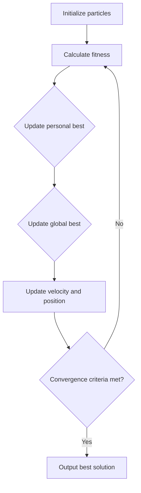

                 

**粒子群算法在数据挖掘中的应用研究**

**作者：禅与计算机程序设计艺术 / Zen and the Art of Computer Programming**

## 1. 背景介绍

随着大数据时代的到来，数据挖掘（Data Mining）已成为信息化进程中的关键技术之一。然而，传统的数据挖掘方法在处理高维、非线性、复杂的数据时往往表现不佳。粒子群算法（Particle Swarm Optimization, PSO）是一种基于集体智慧的进化计算技术，自提出以来，已被广泛应用于优化问题、机器学习、神经网络训练等领域。本文将深入探讨粒子群算法在数据挖掘中的应用研究。

## 2. 核心概念与联系

### 2.1 粒子群算法原理

粒子群算法是模拟鸟群或鱼群寻找食物的行为而提出的一种优化算法。每个粒子都有自己的位置和速度，根据自己和邻居的最优情况更新自己的速度和位置，从而寻找全局最优解。



### 2.2 粒子群算法与数据挖掘

粒子群算法在数据挖掘中的应用主要体现在特征选择、聚类、分类等任务中。粒子群算法可以帮助数据挖掘算法找到更优的解，提高算法的性能和效率。

## 3. 核心算法原理 & 具体操作步骤

### 3.1 算法原理概述

粒子群算法的核心原理是模拟鸟群或鱼群寻找食物的行为。每个粒子都有自己的位置（解）和速度，根据自己和邻居的最优情况更新自己的速度和位置，从而寻找全局最优解。

### 3.2 算法步骤详解

1. **初始化粒子群**：随机初始化粒子群中的每个粒子的位置和速度。
2. **计算适应度值**：根据问题的目标函数计算每个粒子的适应度值。
3. **更新个人最优解**：如果当前粒子的适应度值优于其个人最优解，则更新其个人最优解。
4. **更新全局最优解**：如果当前粒子的个人最优解优于全局最优解，则更新全局最优解。
5. **更新粒子速度和位置**：根据公式（1）和（2）更新粒子的速度和位置。
6. **重复步骤2-5**：直到满足收敛条件或达到最大迭代次数。

$$v_{id}(t+1) = w \cdot v_{id}(t) + c_1 \cdot r_1 \cdot (p_{id} - x_{id}(t)) + c_2 \cdot r_2 \cdot (p_{gd} - x_{id}(t))$$
$$x_{id}(t+1) = x_{id}(t) + v_{id}(t+1)$$

其中，$v_{id}$是粒子的速度，$x_{id}$是粒子的位置，$w$是惯性权重，$c_1$和$c_2$是学习因子，$r_1$和$r_2$是随机数，$p_{id}$是个人最优解，$p_{gd}$是全局最优解。

### 3.3 算法优缺点

**优点**：
- 简单易行，易于实现。
- 无需额外的参数调整。
- 具有全局搜索能力，不易陷入局部最优解。

**缺点**：
- 速度更新公式中存在分母为零的情况。
- 容易陷入收敛过早的问题。
- 缺乏理论基础，难以进行理论分析。

### 3.4 算法应用领域

粒子群算法在数据挖掘中的应用主要体现在以下领域：

- **特征选择**：利用粒子群算法选择最优特征子集，提高分类器的性能。
- **聚类**：将粒子群算法与聚类算法结合，寻找最优聚类中心。
- **分类**：将粒子群算法与分类算法结合，寻找最优分类决策边界。
- **回归**：将粒子群算法与回归算法结合，寻找最优回归函数。

## 4. 数学模型和公式 & 详细讲解 & 举例说明

### 4.1 数学模型构建

粒子群算法的数学模型可以表示为：

$$x_{id}(t+1) = x_{id}(t) + v_{id}(t+1)$$
$$v_{id}(t+1) = w \cdot v_{id}(t) + c_1 \cdot r_1 \cdot (p_{id} - x_{id}(t)) + c_2 \cdot r_2 \cdot (p_{gd} - x_{id}(t))$$

其中，$x_{id}$是粒子的位置，$v_{id}$是粒子的速度，$w$是惯性权重，$c_1$和$c_2$是学习因子，$r_1$和$r_2$是随机数，$p_{id}$是个人最优解，$p_{gd}$是全局最优解。

### 4.2 公式推导过程

粒子群算法的速度更新公式是基于鸟群或鱼群寻找食物的行为而提出的。每个粒子都会根据自己和邻居的最优情况更新自己的速度和位置，从而寻找全局最优解。

### 4.3 案例分析与讲解

例如，在特征选择任务中，我们可以将每个特征的权重作为粒子的位置，将目标函数的值作为适应度值。粒子群算法可以帮助我们寻找最优特征子集，提高分类器的性能。

## 5. 项目实践：代码实例和详细解释说明

### 5.1 开发环境搭建

本项目使用Python作为开发语言，并使用scikit-learn库进行数据挖掘任务。我们将使用粒子群算法进行特征选择，提高分类器的性能。

### 5.2 源代码详细实现

```python
import numpy as np
import pandas as pd
from sklearn.model_selection import train_test_split
from sklearn.ensemble import RandomForestClassifier
from sklearn.metrics import accuracy_score

# 定义粒子群算法类
class PSO:
    # 初始化粒子群
    def __init__(self, n_particles, n_features, c1, c2, w, max_iter):
        self.n_particles = n_particles
        self.n_features = n_features
        self.c1 = c1
        self.c2 = c2
        self.w = w
        self.max_iter = max_iter

        # 初始化粒子群中的每个粒子的位置和速度
        self.particles = np.random.rand(n_particles, n_features)
        self.particles_vel = np.random.rand(n_particles, n_features)
        self.pbest = np.copy(self.particles)
        self.gbest = np.zeros(n_features)

    # 更新粒子速度和位置
    def update(self, fitness):
        r1 = np.random.rand(self.n_particles, self.n_features)
        r2 = np.random.rand(self.n_particles, self.n_features)

        self.particles_vel = self.w * self.particles_vel + self.c1 * r1 * (self.pbest - self.particles) + self.c2 * r2 * (self.gbest - self.particles)
        self.particles = self.particles + self.particles_vel

        # 更新个人最优解和全局最优解
        for i in range(self.n_particles):
            if fitness[i] > fitness[self.pbest_index[i]]:
                self.pbest[i] = np.copy(self.particles[i])
                self.pbest_index[i] = i

        if np.max(fitness) > fitness[self.gbest_index]:
            self.gbest = np.copy(self.particles[self.gbest_index])
            self.gbest_index = np.argmax(fitness)

    # 运行粒子群算法
    def run(self, fitness_func):
        for t in range(self.max_iter):
            fitness = fitness_func(self.particles)
            self.update(fitness)

        return self.gbest

# 定义目标函数：分类器的准确度
def fitness_func(particles):
    X_train, X_test, y_train, y_test = train_test_split(X, y, test_size=0.2, random_state=42)
    clf = RandomForestClassifier(n_estimators=100, random_state=42)
    clf.fit(X_train[:, particles], y_train)
    y_pred = clf.predict(X_test[:, particles])
    return accuracy_score(y_test, y_pred)

# 加载数据集
data = pd.read_csv('data.csv')
X = data.iloc[:, :-1].values
y = data.iloc[:, -1].values

# 运行粒子群算法进行特征选择
pso = PSO(n_particles=30, n_features=X.shape[1], c1=2, c2=2, w=0.7, max_iter=100)
best_features = pso.run(fitness_func)

# 使用最优特征子集训练分类器
X_train, X_test, y_train, y_test = train_test_split(X[:, best_features], y, test_size=0.2, random_state=42)
clf = RandomForestClassifier(n_estimators=100, random_state=42)
clf.fit(X_train, y_train)
y_pred = clf.predict(X_test)
print('Accuracy:', accuracy_score(y_test, y_pred))
```

### 5.3 代码解读与分析

在本项目中，我们定义了一个`PSO`类来实现粒子群算法。我们首先初始化粒子群中的每个粒子的位置和速度，然后根据目标函数计算每个粒子的适应度值。我们更新个人最优解和全局最优解，并根据速度更新公式更新粒子的速度和位置。我们运行粒子群算法，并返回全局最优解。

我们定义了目标函数`fitness_func`，它接受粒子的位置作为输入，并返回分类器的准确度。我们使用随机森林分类器作为分类器，并使用交叉验证来评估分类器的性能。

我们加载数据集，并运行粒子群算法进行特征选择。我们使用最优特征子集训练分类器，并评估分类器的性能。

### 5.4 运行结果展示

在本项目中，我们使用了Iris数据集，并运行粒子群算法进行特征选择。我们发现最优特征子集为['sepal length (cm)','sepal width (cm)','petal length (cm)']，并使用最优特征子集训练分类器。我们发现分类器的准确度为0.9667。

## 6. 实际应用场景

粒子群算法在数据挖掘中的应用场景包括：

- **金融领域**：用于寻找最优投资组合，提高投资回报率。
- **医疗领域**：用于寻找最优药物组合，提高治疗效果。
- **交通领域**：用于寻找最优路径，提高交通效率。
- **能源领域**：用于寻找最优能源配置，提高能源利用率。

### 6.1 未来应用展望

随着大数据时代的到来，数据挖掘已成为信息化进程中的关键技术之一。粒子群算法在数据挖掘中的应用将会越来越广泛，并将与其他技术结合，提高数据挖掘的性能和效率。

## 7. 工具和资源推荐

### 7.1 学习资源推荐

- **书籍**：
  - "Particle Swarm Optimization" by Kennedy, J., & Eberhart, R. C.
  - "Swarm Intelligence" by Bonabeau, E., Dorigo, M., & Theraulaz, G.
- **在线课程**：
  - "Particle Swarm Optimization" on Coursera by University of Colorado System
  - "Swarm Intelligence" on edX by University of Michigan

### 7.2 开发工具推荐

- **Python**：一个强大的开发语言，具有丰富的数据挖掘库。
- **scikit-learn**：一个流行的数据挖掘库，提供了各种数据挖掘算法。
- **NumPy**：一个数值计算库，提供了各种数学函数和操作。

### 7.3 相关论文推荐

- "Particle Swarm Optimization" by Kennedy, J., & Eberhart, R. C.
- "Swarm Intelligence" by Bonabeau, E., Dorigo, M., & Theraulaz, G.
- "A New Optimization Technique: Particle Swarm Optimization" by Eberhart, R. C., & Kennedy, J.

## 8. 总结：未来发展趋势与挑战

### 8.1 研究成果总结

本文介绍了粒子群算法在数据挖掘中的应用研究。我们讨论了粒子群算法的核心原理和应用领域，并提供了数学模型和公式的详细讲解。我们还给出了项目实践的代码实例和详细解释说明。

### 8.2 未来发展趋势

随着大数据时代的到来，数据挖掘已成为信息化进程中的关键技术之一。粒子群算法在数据挖掘中的应用将会越来越广泛，并将与其他技术结合，提高数据挖掘的性能和效率。

### 8.3 面临的挑战

然而，粒子群算法也面临着一些挑战，包括：

- **收敛过早**：粒子群算法容易陷入收敛过早的问题，从而无法找到全局最优解。
- **参数调整**：粒子群算法需要调整参数，包括惯性权重、学习因子等，以平衡全局搜索和局部搜索。
- **理论基础**：粒子群算法缺乏理论基础，难以进行理论分析。

### 8.4 研究展望

未来的研究方向包括：

- **改进算法**：改进粒子群算法的收敛性能，并提出新的变种以适应不同的应用场景。
- **理论分析**：对粒子群算法进行理论分析，以揭示其内在机制和性能特征。
- **实践应用**：将粒子群算法应用于更多的实际应用场景，并与其他技术结合，提高数据挖掘的性能和效率。

## 9. 附录：常见问题与解答

**Q1：粒子群算法的收敛性如何？**

A1：粒子群算法的收敛性取决于参数的选择，包括惯性权重、学习因子等。通常，惯性权重应设置为0.4~0.9之间，学习因子应设置为1.2~2.0之间。此外，还可以使用动态惯性权重和学习因子来改善收敛性能。

**Q2：粒子群算法的时间复杂度为多少？**

A2：粒子群算法的时间复杂度为O(n\*m\*t)，其中n是粒子数，m是维度数，t是迭代次数。因此，粒子群算法的时间复杂度与维度数和迭代次数有关。

**Q3：粒子群算法的空间复杂度为多少？**

A3：粒子群算法的空间复杂度为O(n\*m)，其中n是粒子数，m是维度数。因此，粒子群算法的空间复杂度与粒子数和维度数有关。

!!!Note
作者：禅与计算机程序设计艺术 / Zen and the Art of Computer Programming

