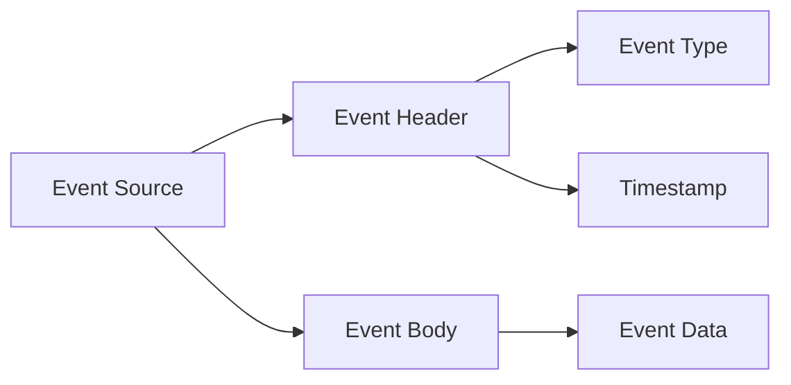
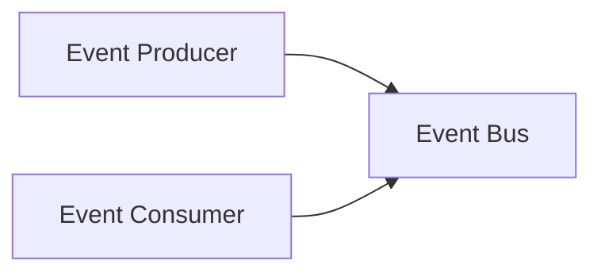
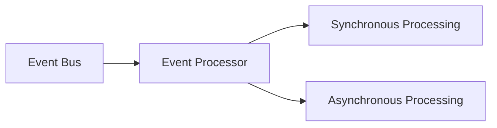

                 

## 1. 背景介绍

在当今快速变化的商业环境中，传统的面向对象和服务导向的软件架构已经无法满足需求。这些架构往往是静态的，无法应对不断变化的业务需求和市场需求。事件驱动架构（EDA）是一种新的软件架构范式，它将软件系统视为一个事件流，这些事件在系统内部和外部被产生、传播和处理。EDA可以更好地应对变化，提供更高的灵活性和可扩展性。

## 2. 核心概念与联系

### 2.1 事件

在事件驱动架构中，事件是最小的单位。它表示系统内部或外部发生的事情。事件可以是用户点击按钮，也可以是系统内部的状态变化。事件通常包含两部分：事件头（header）和事件体（body）。事件头包含元数据，如事件类型、时间戳等；事件体包含事件的具体数据。



### 2.2 事件总线

事件总线是事件驱动架构的核心。它是一个中介，负责事件的发布和订阅。任何系统组件都可以向事件总线发布事件，任何系统组件也可以订阅事件总线上的事件。事件总线确保事件的传播，并提供了系统组件之间的解耦。



### 2.3 事件处理器

事件处理器是事件驱动架构中的另一个关键组件。它监听事件总线上的事件，并根据事件类型执行相应的操作。事件处理器可以是同步的，也可以是异步的。同步事件处理器在事件发生时立即执行操作；异步事件处理器则将事件放入队列中，等待后台线程处理。



## 3. 核心算法原理 & 具体操作步骤

### 3.1 算法原理概述

事件驱动架构的核心算法是事件路由算法。它负责将事件从事件总线路由到相应的事件处理器。事件路由算法的目标是确保事件被正确处理，并最小化系统组件之间的耦合。

### 3.2 算法步骤详解

1. 事件总线接收到一个事件。
2. 事件路由算法检查事件的类型。
3. 根据事件类型，事件路由算法确定应该处理这个事件的事件处理器。
4. 事件路由算法将事件发送到相应的事件处理器。
5. 事件处理器处理事件，并可能发布新的事件到事件总线。
6. 重复步骤2-5，直到所有事件都被处理。

### 3.3 算法优缺点

事件路由算法的优点是它提供了高度的解耦，允许系统组件独立地发展和变化。它的缺点是它可能会导致系统的复杂性增加，因为事件的路由和处理需要额外的代码和资源。

### 3.4 算法应用领域

事件驱动架构和事件路由算法在许多领域都有应用，包括实时分析、物联网、金融服务、电子商务等。任何需要处理大量事件，并需要高度解耦的系统都可以从事件驱动架构中受益。

## 4. 数学模型和公式 & 详细讲解 & 举例说明

### 4.1 数学模型构建

事件驱动架构可以用有向图表示，其中节点表示事件处理器，边表示事件流。事件总线可以表示为图中的一个特殊节点，它连接所有其他节点。

### 4.2 公式推导过程

给定一个事件驱动架构的有向图 $G = (V, E)$，其中 $V$ 是事件处理器的集合，$E$ 是事件流的集合。如果一个事件处理器 $v_i \in V$ 可以处理事件 $e_j \in E$，那么我们就说 $v_i$ 与 $e_j$ 相关联。我们可以用一个关系矩阵 $R$ 表示这些关联，其中 $R_{ij} = 1$ 表示事件处理器 $v_i$ 与事件 $e_j$ 相关联，$R_{ij} = 0$ 表示它们不相关联。

### 4.3 案例分析与讲解

例如，考虑一个简单的在线购物系统。当用户点击“购买”按钮时，系统发布一个“购买”事件。这个事件被路由到“订单处理”事件处理器，它创建一个新的订单。然后，“订单处理”事件处理器发布一个“订单创建”事件。这个事件被路由到“库存管理”事件处理器，它更新库存。最后，“库存管理”事件处理器发布一个“库存更新”事件。这个事件被路由到“通知”事件处理器，它发送一封电子邮件通知用户订单已创建。

## 5. 项目实践：代码实例和详细解释说明

### 5.1 开发环境搭建

为了实现事件驱动架构，我们需要一个消息中间件，如RabbitMQ或Apache Kafka。我们还需要一个编程语言，如Java或Python，以及一个框架，如Spring Boot或Flask。

### 5.2 源代码详细实现

以下是一个简单的事件驱动架构的Java实现。我们使用Spring Boot框架和RabbitMQ消息中间件。

```java
import org.springframework.amqp.core.*;
import org.springframework.amqp.rabbit.annotation.RabbitListener;
import org.springframework.context.annotation.AnnotationConfigApplicationContext;
import org.springframework.context.annotation.Bean;
import org.springframework.context.annotation.Configuration;

@Configuration
public class EventBusConfig {

    @Bean
    public Queue eventQueue() {
        return new Queue("eventQueue");
    }

    @Bean
    public DirectExchange eventExchange() {
        return new DirectExchange("eventExchange");
    }

    @Bean
    public Binding binding(Queue eventQueue, DirectExchange eventExchange) {
        return BindingBuilder.bind(eventQueue).to(eventExchange).with("eventRoutingKey");
    }

    @RabbitListener(queues = "eventQueue")
    public void listen(String event) {
        // Process event
    }
}

public class EventProducer {

    private final AmqpTemplate amqpTemplate;

    public EventProducer(AmqpTemplate amqpTemplate) {
        this.amqpTemplate = amqpTemplate;
    }

    public void publishEvent(String event) {
        amqpTemplate.convertAndSend("eventExchange", "eventRoutingKey", event);
    }
}
```

### 5.3 代码解读与分析

在`EventBusConfig`类中，我们配置了一个RabbitMQ队列“eventQueue”和一个直接交换机“eventExchange”。我们还配置了一个绑定，将队列绑定到交换机，并设置了路由键“eventRoutingKey”。`listen`方法是事件处理器，它监听队列中的事件。

在`EventProducer`类中，我们有一个`publishEvent`方法，它将事件发布到交换机“eventExchange”，并使用路由键“eventRoutingKey”。

### 5.4 运行结果展示

当我们运行应用程序时，任何发布到“eventExchange”的事件都会被路由到“eventQueue”，并由`listen`方法处理。

## 6. 实际应用场景

事件驱动架构在许多领域都有实际应用。例如，在金融服务领域，事件驱动架构可以用于实时分析和交易处理。在物联网领域，事件驱动架构可以用于设备状态监控和故障诊断。在电子商务领域，事件驱动架构可以用于订单处理和库存管理。

### 6.1 当前应用现状

目前，事件驱动架构已经在许多大型企业中得到广泛应用，如Netflix、Amazon、Google等。它们使用事件驱动架构来处理大量事件，并提供高度解耦的系统。

### 6.2 未来应用展望

随着物联网和实时分析的发展，事件驱动架构的应用将会越来越广泛。未来，事件驱动架构将会成为云计算和边缘计算的标准架构之一。

## 7. 工具和资源推荐

### 7.1 学习资源推荐

- “Event-Driven Architecture” by Martin Fowler (https://martinfowler.com/bliki/EventSourcing.html)
- “Event-Driven Architecture: A Modern Approach to Software Design” by Adam Bellemare (https://www.infoq.com/articles/event-driven-architecture/)
- “Event-Driven Architecture with Apache Kafka” by Ben Stopford (https://www.oreilly.com/library/view/event-driven-architecture/9781492038834/)

### 7.2 开发工具推荐

- RabbitMQ (https://www.rabbitmq.com/)
- Apache Kafka (https://kafka.apache.org/)
- Spring Boot (https://spring.io/projects/spring-boot)
- Flask (https://flask.palletsprojects.com/en/2.0.x/)

### 7.3 相关论文推荐

- “Event-Driven Architecture: A New Paradigm for Software Design” by Arnon Rotem-Gal-Oz (https://arxiv.org/abs/1803.04338)
- “Event-Driven Architecture for Real-Time Analytics” by Ben Lorica (https://www.oreilly.com/radar/event-driven-architecture-for-real-time-analytics/)
- “Event-Driven Architecture in the Cloud” by John Carnell (https://thenewstack.io/event-driven-architecture-in-the-cloud/)

## 8. 总结：未来发展趋势与挑战

### 8.1 研究成果总结

事件驱动架构是一种新的软件架构范式，它提供了高度的解耦，允许系统组件独立地发展和变化。事件路由算法是事件驱动架构的核心算法，它负责将事件从事件总线路由到相应的事件处理器。

### 8.2 未来发展趋势

未来，事件驱动架构将会成为云计算和边缘计算的标准架构之一。它将会应用于物联网、实时分析、金融服务等领域。

### 8.3 面临的挑战

事件驱动架构的主要挑战是系统的复杂性。事件的路由和处理需要额外的代码和资源，这可能会导致系统的复杂性增加。

### 8.4 研究展望

未来的研究将会关注事件驱动架构的可扩展性、可靠性和安全性。此外，研究还将关注事件驱动架构在云计算和边缘计算中的应用。

## 9. 附录：常见问题与解答

### 9.1 事件驱动架构和消息队列有什么区别？

事件驱动架构是一种软件架构范式，它将软件系统视为一个事件流。消息队列是事件驱动架构的一种实现方式，它提供了事件的传播和存储机制。事件驱动架构可以使用其他机制来实现事件的传播和存储，如共享内存或数据库。

### 9.2 事件驱动架构和面向对象有什么区别？

面向对象是一种软件设计范式，它将软件系统视为一组对象，这些对象有状态和行为。事件驱动架构则将软件系统视为一个事件流。在面向对象中，对象之间通过方法调用进行通信；在事件驱动架构中，对象之间通过事件进行通信。

### 9.3 事件驱动架构和服务导向有什么区别？

服务导向是一种软件架构范式，它将软件系统视为一组服务，这些服务通过网络进行通信。事件驱动架构则将软件系统视为一个事件流。在服务导向中，服务之间通过远程过程调用进行通信；在事件驱动架构中，服务之间通过事件进行通信。

!!!Note
作者：禅与计算机程序设计艺术 / Zen and the Art of Computer Programming

