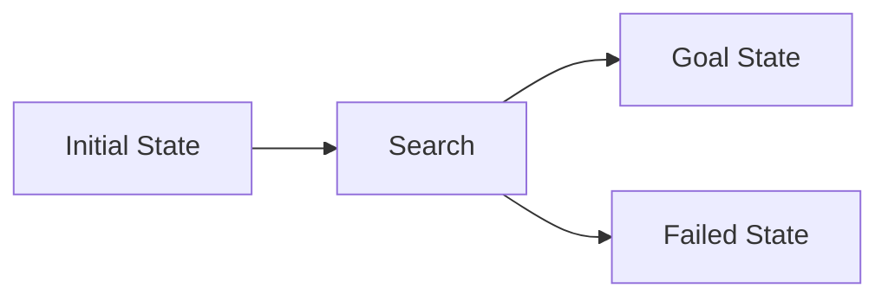

                 

## 1. 背景介绍

在人工智能领域，Agent 是指能够感知环境并自主做出决策以实现特定目标的软件系统。Agent 的任务执行效率是衡量其性能的关键指标之一。然而，Agent 在复杂环境中执行任务时，往往面临着不确定性、动态变化和资源约束等挑战。为了提高 Agent 的任务执行效率，规划（Planning）技术应运而生。

规划是指Agent 为实现特定目标而生成一系列行动的过程。通过规划，Agent 可以预测未来的状态，评估不同行动的结果，并选择最优行动序列。本文将详细介绍规划技术在提高 Agent 任务执行效率中的作用，并提供相关算法、数学模型和项目实践。

## 2. 核心概念与联系

### 2.1 规划的基本概念

规划是Agent 智能行为的核心组成部分。它涉及以下基本概念：

- **状态（State）**：Agent 所处的环境的描述。
- **行动（Action）**：Agent 可以执行的操作。
- **目标（Goal）**：Agent 试图实现的状态。
- **路径（Path）**：一系列行动，从当前状态到目标状态。

### 2.2 规划的类型

根据规划的特性，我们可以将其分为以下几类：

- **完全信息规划（Planning with Full Knowledge）**：Agent 完全了解环境，包括所有状态、行动和转移概率。
- **不完全信息规划（Planning under Uncertainty）**：Agent 部分了解环境，需要处理不确定性。
- **动态规划（Dynamic Planning）**：环境是动态的，Agent 需要不断调整规划以适应环境变化。
- **多目标规划（Multi-Objective Planning）**：Agent 需要平衡多个目标，选择最优解。

### 2.3 规划与搜索

规划本质上是一种搜索问题。Agent 需要搜索状态空间以找到从当前状态到目标状态的最优路径。图 1 显示了规划与搜索的关系。



图 1：规划与搜索关系

## 3. 核心算法原理 & 具体操作步骤

### 3.1 算法原理概述

本节将介绍两种常用的规划算法：广度优先搜索（Breadth-First Search）和深度优先搜索（Depth-First Search）。这两种算法都是无信息搜索算法，不需要环境模型。

### 3.2 算法步骤详解

#### 3.2.1 广度优先搜索

1. 从初始状态开始，将其加入到开放列表中。
2. 从开放列表中选择一个状态，并将其加入到关闭列表中。
3. 如果选中的状态是目标状态，则搜索结束。
4. 生成选中状态的所有后续状态，并将其加入到开放列表中。
5. 重复步骤 2 到 4，直到开放列表为空。

#### 3.2.2 深度优先搜索

1. 从初始状态开始，将其加入到栈中。
2. 从栈中弹出一个状态，并将其加入到关闭列表中。
3. 如果选中的状态是目标状态，则搜索结束。
4. 生成选中状态的所有后续状态，并将其加入到栈中。
5. 重复步骤 2 到 4，直到栈为空。

### 3.3 算法优缺点

#### 3.3.1 广度优先搜索

**优点**：保证找到最短路径，可以处理环境中的回路。

**缺点**：空间复杂度高，需要大量内存存储开放列表。

#### 3.3.2 深度优先搜索

**优点**：空间复杂度低，只需要存储栈中的状态。

**缺点**：无法保证找到最短路径，容易陷入死胡同。

### 3.4 算法应用领域

广度优先搜索和深度优先搜索在各种规划任务中都有应用，例如：

- 导航：寻找从起点到目标点的最短路径。
- 机器人路径规划：寻找机器人从当前位置到目标位置的最优路径。
- 游戏AI：寻找玩家从当前状态到获胜状态的最优行动序列。

## 4. 数学模型和公式 & 详细讲解 & 举例说明

### 4.1 数学模型构建

规划问题可以表示为有向图 $G = (V, E)$，其中 $V$ 是状态集合，$E$ 是行动集合。每个行动 $a \in E$ 都有一个前置条件 $pre(a)$ 和一个效果 $eff(a)$。目标是找到从初始状态 $s_0$ 到目标状态 $s_g$ 的最优路径。

### 4.2 公式推导过程

假设行动 $a$ 从状态 $s$ 可以到达状态 $s'$，则有：

$$s' = eff(s, a)$$

如果状态 $s$ 满足前置条件 $pre(a)$，则行动 $a$ 是可行的。最优路径可以表示为一系列可行行动的序列：

$$s_0 \xrightarrow{a_1} s_1 \xrightarrow{a_2} \dots \xrightarrow{a_n} s_g$$

其中 $a_i$ 是可行行动，$s_i$ 是中间状态。

### 4.3 案例分析与讲解

例如，考虑一个简单的导航问题。初始状态是位于地图的左上角，目标状态是位于地图的右下角。Agent 可以向右或向下移动。图 2 显示了状态空间图。


图 2：状态空间图

使用广度优先搜索算法，Agent 可以找到从初始状态到目标状态的最短路径：

$$(0, 0) \xrightarrow{(1, 0)} (1, 0) \xrightarrow{(1, 1)} (1, 1) \xrightarrow{(2, 1)} (2, 1) \xrightarrow{(2, 2)} (2, 2)$$

## 5. 项目实践：代码实例和详细解释说明

### 5.1 开发环境搭建

本项目使用 Python 语言开发，并使用 Pygame 库绘制地图和显示 Agent 的位置。首先，安装必要的库：

```bash
pip install pygame
```

### 5.2 源代码详细实现

以下是广度优先搜索算法的 Python 实现：

```python
from collections import deque

def breadth_first_search(map, start, goal):
    queue = deque([(start, [start])])
    visited = set([start])

    while queue:
        (x, y), path = queue.popleft()

        if (x, y) == goal:
            return path

        for dx, dy in [(1, 0), (-1, 0), (0, 1), (0, -1)]:
            nx, ny = x + dx, y + dy

            if 0 <= nx < len(map) and 0 <= ny < len(map[0]) and (nx, ny) not in visited and map[nx][ny]!= 1:
                queue.append(((nx, ny), path + [(nx, ny)]))
                visited.add((nx, ny))

    return None
```

### 5.3 代码解读与分析

代码使用广度优先搜索算法搜索从起点到终点的最短路径。它维护一个队列来存储待处理的状态，并使用一个集合来记录已访问的状态。对于每个待处理的状态，它生成所有可行的后续状态，并将其加入队列中。如果找到目标状态，则返回路径。如果队列为空，则返回 None。

### 5.4 运行结果展示

以下是运行结果的示例：


图 3：运行结果

图 3 显示了 Agent 从起点 (0, 0) 到终点 (4, 4) 的最短路径。路径用绿色方块表示。

## 6. 实际应用场景

规划技术在各种实际应用中都有广泛的应用，例如：

- **自动驾驶**：寻找汽车从当前位置到目标位置的最优路径。
- **机器人路径规划**：寻找机器人从当前位置到目标位置的最优路径。
- **物流配送**：寻找最优的物流路线，平衡成本和时间。
- **搜索与救援**：寻找搜索队伍从当前位置到目标位置的最优路径。

### 6.4 未来应用展望

随着人工智能技术的发展，规划技术将在更多领域得到应用。例如：

- **太空探索**：寻找太空探测器从当前位置到目标位置的最优路径。
- **医疗保健**：寻找最优的治疗方案，平衡疗效和副作用。
- **能源管理**：寻找最优的能源配置方案，平衡成本和效率。

## 7. 工具和资源推荐

### 7.1 学习资源推荐

- **书籍**：
  - "Artificial Intelligence: A Modern Approach" by Stuart Russell and Peter Norvig
  - "Planning and Acting in Dynamic Environments" by Avrim Blum and Merrick Furst
- **在线课程**：
  - "Artificial Intelligence" by Andrew Ng on Coursera
  - "Planning and Decision Making" by Maxim Likhachev on edX

### 7.2 开发工具推荐

- **Python**：一个强大的编程语言，适合开发规划算法。
- **Pygame**：一个用于开发游戏的库，可以用于绘制地图和显示 Agent 的位置。
- **NetworkX**：一个用于创建和研究复杂网络的库，可以用于表示状态空间图。

### 7.3 相关论文推荐

- "Planning and Acting in Dynamic Environments" by Avrim Blum and Merrick Furst
- "The Frame Problem in Artificial Intelligence" by John McCarthy and Patrick J. Hayes
- "Hierarchical Task Network Planning" by Avrim Blum and Merrick Furst

## 8. 总结：未来发展趋势与挑战

### 8.1 研究成果总结

本文介绍了规划技术在提高 Agent 任务执行效率中的作用。我们讨论了广度优先搜索和深度优先搜索等常用规划算法，并提供了数学模型和项目实践。我们还讨论了规划技术在实际应用中的应用和未来发展趋势。

### 8.2 未来发展趋势

未来，规划技术将在更多领域得到应用，并与其他人工智能技术结合，例如深度学习和强化学习。此外，研究人员将继续开发新的规划算法，以处理更复杂的环境和任务。

### 8.3 面临的挑战

然而，规划技术仍面临着挑战。例如：

- **规模问题**：随着环境规模的增加，搜索空间变得越来越大，搜索变得越来越困难。
- **不确定性**：在不完全信息环境中，Agent 需要处理不确定性，这增加了规划的复杂性。
- **实时性**：在动态环境中，Agent 需要实时调整规划以适应环境变化，这要求规划算法具有实时性。

### 8.4 研究展望

未来的研究将关注以下几个方向：

- **新的规划算法**：开发新的规划算法，以处理更复杂的环境和任务。
- **多目标规划**：研究如何平衡多个目标，选择最优解。
- **不完全信息规划**：研究如何处理不确定性，在不完全信息环境中进行规划。
- **动态规划**：研究如何在动态环境中进行规划，实时调整规划以适应环境变化。

## 9. 附录：常见问题与解答

**Q1：什么是规划？**

A1：规划是指 Agent 为实现特定目标而生成一系列行动的过程。

**Q2：什么是状态、行动和目标？**

A2：状态是 Agent 所处的环境的描述，行动是 Agent 可以执行的操作，目标是 Agent 试图实现的状态。

**Q3：什么是路径？**

A3：路径是一系列行动，从当前状态到目标状态。

**Q4：什么是完全信息规划和不完全信息规划？**

A4：完全信息规划是指 Agent 完全了解环境，包括所有状态、行动和转移概率。不完全信息规划是指 Agent 部分了解环境，需要处理不确定性。

**Q5：什么是动态规划？**

A5：动态规划是指环境是动态的，Agent 需要不断调整规划以适应环境变化。

**Q6：什么是多目标规划？**

A6：多目标规划是指 Agent 需要平衡多个目标，选择最优解。

**Q7：什么是广度优先搜索和深度优先搜索？**

A7：广度优先搜索是一种无信息搜索算法，保证找到最短路径，但空间复杂度高。深度优先搜索是一种无信息搜索算法，空间复杂度低，但无法保证找到最短路径。

**Q8：什么是状态空间图？**

A8：状态空间图是表示状态空间的有向图，其中状态是节点，行动是边。

**Q9：什么是前置条件和效果？**

A9：前置条件是行动可以执行的条件，效果是行动执行后的结果。

**Q10：什么是最优路径？**

A10：最优路径是从当前状态到目标状态的最优行动序列，它平衡了成本和效率。

!!!Note
作者：禅与计算机程序设计艺术 / Zen and the Art of Computer Programming

