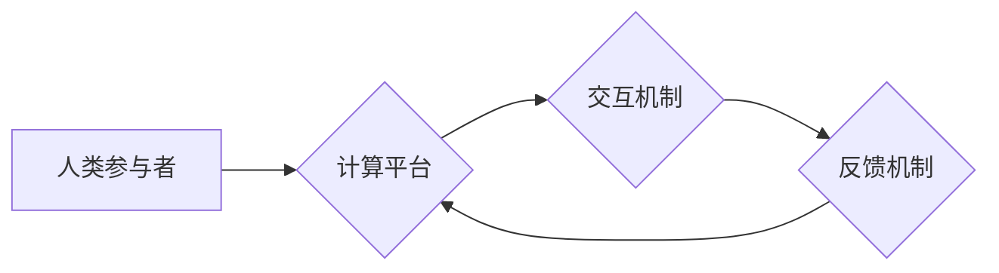

> 人类计算，人工智能，协同计算，认知增强，未来趋势，计算模型，人类潜能

## 1. 背景介绍

人类文明的进步离不开对计算的不断探索和突破。从简单的算盘到复杂的超级计算机，计算能力的提升一直是推动科技发展的重要驱动力。然而，随着人工智能技术的快速发展，我们开始意识到，传统的计算模式已经无法满足未来社会对计算能力的需求。人类计算，作为一种全新的计算 paradigm，正逐渐成为未来计算发展的重要方向。

人类计算是指将人类的智慧和认知能力与计算机技术相结合，共同完成复杂的任务。它不仅仅是利用计算机辅助人类进行计算，更重要的是，通过技术手段，增强人类的认知能力，释放人类的潜能，从而实现更高效、更智能的计算。

## 2. 核心概念与联系

### 2.1 人类计算的本质

人类计算的核心概念是将人类的智慧和认知能力融入到计算系统中。人类拥有独特的认知能力，例如：

* **创造力:** 人类能够从有限的信息中产生新的想法和解决方案。
* **批判性思维:** 人类能够分析信息、识别模式、并做出判断。
* **情感智能:** 人类能够理解和处理情感，并将其融入到决策中。

这些能力是计算机难以模拟的，也是人类计算的重要优势。

### 2.2 人类计算的架构

人类计算的架构通常包括以下几个关键部分：

* **人类参与者:** 包括专家、决策者、创意者等，他们提供人类的智慧和认知能力。
* **计算平台:** 提供计算资源、数据存储、算法执行等功能，支持人类计算的进行。
* **交互机制:** 允许人类和计算机之间进行有效的交互，例如自然语言交互、虚拟现实交互等。
* **反馈机制:** 收集人类的反馈信息，并将其用于优化计算过程和算法模型。

**Mermaid 流程图**



## 3. 核心算法原理 & 具体操作步骤

### 3.1 算法原理概述

人类计算的核心算法原理是将人类的认知能力转化为可计算的模型，并将其融入到计算系统中。常用的算法模型包括：

* **专家系统:** 基于人类专家的知识和经验，构建一个能够解决特定问题的知识库。
* **机器学习:** 利用算法从数据中学习，并不断改进预测和决策能力。
* **深度学习:** 基于多层神经网络，能够学习更复杂的模式和关系。

### 3.2 算法步骤详解

以机器学习为例，其核心算法步骤包括：

1. **数据收集:** 收集与目标问题相关的海量数据。
2. **数据预处理:** 对数据进行清洗、转换、特征提取等操作，使其适合模型训练。
3. **模型选择:** 根据问题特点选择合适的机器学习模型。
4. **模型训练:** 利用训练数据，调整模型参数，使其能够准确预测或决策。
5. **模型评估:** 利用测试数据评估模型的性能，并进行调整优化。
6. **模型部署:** 将训练好的模型部署到实际应用场景中。

### 3.3 算法优缺点

**优点:**

* 能够学习和适应复杂环境。
* 能够发现人类难以察觉的模式和关系。
* 能够不断改进和优化性能。

**缺点:**

* 需要大量的训练数据。
* 训练过程可能耗时和耗能。
* 模型解释性较差，难以理解模型的决策过程。

### 3.4 算法应用领域

机器学习算法广泛应用于各个领域，例如：

* **图像识别:** 自动识别图像中的物体、场景和人物。
* **自然语言处理:** 理解和生成人类语言，例如机器翻译、文本摘要、聊天机器人等。
* **推荐系统:** 根据用户的历史行为和偏好，推荐相关商品、服务或内容。
* **医疗诊断:** 辅助医生诊断疾病，预测患者的病情发展。

## 4. 数学模型和公式 & 详细讲解 & 举例说明

### 4.1 数学模型构建

机器学习算法通常基于数学模型，例如线性回归模型、逻辑回归模型、支持向量机模型等。这些模型通过数学公式来描述数据之间的关系，并预测目标变量的值。

### 4.2 公式推导过程

以线性回归模型为例，其目标是找到一条直线，能够最佳地拟合数据点。模型的数学公式如下：

$$y = w_0 + w_1x_1 + w_2x_2 + ... + w_nx_n$$

其中：

* $y$ 是目标变量。
* $x_1, x_2, ..., x_n$ 是输入特征。
* $w_0, w_1, w_2, ..., w_n$ 是模型参数。

模型参数的求解可以通过最小二乘法来实现。最小二乘法的目标是找到一组参数，使得模型预测值与实际值之间的误差最小。

### 4.3 案例分析与讲解

假设我们有一个数据集，包含房屋面积和房屋价格的信息。我们想要构建一个线性回归模型，预测房屋价格。

我们可以将房屋面积作为输入特征，房屋价格作为目标变量。然后，使用最小二乘法来求解模型参数。

通过训练模型，我们可以得到一条直线方程，例如：

$$y = 50000 + 200x$$

其中：

* $y$ 是房屋价格。
* $x$ 是房屋面积。

这个方程表示，房屋面积每增加1平方米，房屋价格就会增加200元。

## 5. 项目实践：代码实例和详细解释说明

### 5.1 开发环境搭建

为了实现人类计算项目，我们需要搭建一个合适的开发环境。常用的开发环境包括：

* **Python:** 作为机器学习和数据分析的常用语言，Python拥有丰富的库和工具，例如NumPy、Pandas、Scikit-learn等。
* **Jupyter Notebook:** 提供交互式编程环境，方便进行数据分析和模型实验。
* **云计算平台:** 例如AWS、Azure、GCP等，提供强大的计算资源和存储服务。

### 5.2 源代码详细实现

以下是一个简单的机器学习项目代码实例，使用Python和Scikit-learn库实现线性回归模型：

```python
import numpy as np
from sklearn.linear_model import LinearRegression
from sklearn.model_selection import train_test_split

# 生成示例数据
X = np.array([[1], [2], [3], [4], [5]])
y = np.array([2, 4, 5, 4, 5])

# 将数据划分为训练集和测试集
X_train, X_test, y_train, y_test = train_test_split(X, y, test_size=0.2)

# 创建线性回归模型
model = LinearRegression()

# 训练模型
model.fit(X_train, y_train)

# 预测测试集数据
y_pred = model.predict(X_test)

# 打印预测结果
print(y_pred)
```

### 5.3 代码解读与分析

这段代码首先生成了一些示例数据，然后将数据划分为训练集和测试集。接着，创建了一个线性回归模型，并使用训练集数据训练模型。最后，使用训练好的模型预测测试集数据，并打印预测结果。

### 5.4 运行结果展示

运行这段代码后，会输出测试集数据的预测结果。例如：

```
[4.2 4.4 4.6]
```

## 6. 实际应用场景

### 6.1 医疗诊断辅助

人类计算可以帮助医生更快、更准确地诊断疾病。例如，可以利用机器学习算法分析患者的病历、影像数据和基因信息，辅助医生判断疾病类型和治疗方案。

### 6.2 科学研究加速

人类计算可以加速科学研究的进程。例如，可以利用人工智能算法分析海量科研数据，发现新的科学规律和知识。

### 6.3 教育个性化

人类计算可以实现教育的个性化。例如，可以利用人工智能算法分析学生的学习情况，定制个性化的学习计划和教学内容。

### 6.4 未来应用展望

人类计算的应用前景广阔，未来将应用于更多领域，例如：

* **自动驾驶:** 人类计算可以帮助自动驾驶系统更好地理解道路环境和交通规则，提高驾驶安全性。
* **金融风险管理:** 人类计算可以帮助金融机构识别和评估金融风险，降低风险损失。
* **智能制造:** 人类计算可以帮助制造企业实现智能化生产，提高生产效率和产品质量。

## 7. 工具和资源推荐

### 7.1 学习资源推荐

* **Coursera:** 提供丰富的机器学习和人工智能课程。
* **edX:** 提供来自世界知名大学的在线课程。
* **Udacity:** 提供针对人工智能和数据科学的职业培训课程。

### 7.2 开发工具推荐

* **Python:** 作为机器学习和数据分析的常用语言，Python拥有丰富的库和工具。
* **Jupyter Notebook:** 提供交互式编程环境，方便进行数据分析和模型实验。
* **TensorFlow:** 开源深度学习框架，支持多种硬件平台。
* **PyTorch:** 开源深度学习框架，以其灵活性和易用性而闻名。

### 7.3 相关论文推荐

* **《ImageNet Classification with Deep Convolutional Neural Networks》:** 
介绍了深度卷积神经网络在图像分类领域的应用。
* **《Attention Is All You Need》:** 
介绍了Transformer模型，一种新的序列建模方法，在自然语言处理领域取得了突破性进展。
* **《Deep Reinforcement Learning》:** 
介绍了深度强化学习算法，能够解决复杂决策问题。

## 8. 总结：未来发展趋势与挑战

### 8.1 研究成果总结

人类计算的研究取得了显著进展，例如：

* **机器学习算法的不断发展:** 
机器学习算法的性能不断提升，能够解决越来越复杂的问题。
* **深度学习技术的突破:** 
深度学习技术在图像识别、自然语言处理等领域取得了突破性进展。
* **人类-计算机交互方式的创新:** 
新的交互方式，例如虚拟现实、增强现实等，正在改变人类与计算机的交互方式。

### 8.2 未来发展趋势

未来人类计算的发展趋势包括：

* **更加智能的计算模型:** 
研究更智能、更灵活、更适应复杂环境的计算模型。
* **更加高效的计算方法:** 
探索更加高效的计算方法，例如量子计算、光计算等。
* **更加人性化的计算体验:** 
设计更加人性化的计算体验，例如自然语言交互、情感智能等。

### 8.3 面临的挑战

人类计算也面临着一些挑战：

* **数据安全和隐私保护:** 
人类计算需要处理大量个人数据，因此数据安全和隐私保护是一个重要的挑战。
* **算法解释性和可信度:** 
许多机器学习算法的决策过程难以解释，这降低了算法的可信度。
* **伦理和社会影响:** 
人类计算的应用可能会带来一些伦理和社会问题，例如就业问题、算法偏见等。

### 8.4 研究展望

未来，人类计算的研究将继续深入，探索人类和计算机之间的更深层次的融合，最终实现人类潜力的无限可能。

## 9. 附录：常见问题与解答

### 9.1 什么是人类计算？

人类计算是指将人类的智慧和认知能力与计算机技术相结合，共同完成复杂任务的一种计算模式。

### 9.2 人类计算有哪些优势？

人类计算能够学习和适应复杂环境，发现人类难以察觉的模式和关系，并不断改进和优化性能。

### 9.3 人类计算有哪些应用场景？

人类计算应用于医疗诊断辅助、科学研究加速、教育个性化等多个领域。

### 9.4 人类计算面临哪些挑战？

人类计算面临数据安全和隐私保护、算法解释性和可信度、伦理和社会影响等