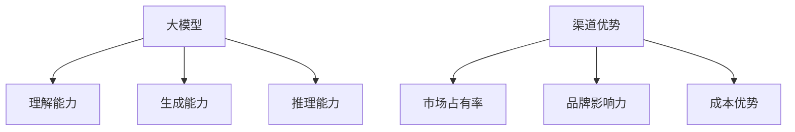

                 

## AI 大模型创业：如何利用渠道优势？

> 关键词：大模型、创业、渠道优势、商业模式、数据策略、合作伙伴、市场拓展

## 1. 背景介绍

随着人工智能（AI）技术的不断发展，大模型（Large Language Models）已成为AI领域的热点之一。大模型的出现，为各行各业带来了巨大的创业机遇。然而，如何利用渠道优势，将大模型商业化，是创业者面临的关键挑战。本文将从渠道优势、商业模式、数据策略、合作伙伴和市场拓展等方面，为您提供利用大模型创业的指南。

## 2. 核心概念与联系

### 2.1 大模型的定义与特点

大模型是指通过大规模数据训练而成的模型，具有强大的理解、生成和推理能力。大模型的特点包括：

- **理解能力**：大模型可以理解上下文，并根据上下文生成相关的回复。
- **生成能力**：大模型可以生成人类难以区分的文本，包括代码、诗歌和小说等。
- **推理能力**：大模型可以进行简单的推理和逻辑判断。

### 2.2 渠道优势的定义与作用

渠道优势是指企业在市场渠道中所处的有利地位，它可以帮助企业快速占领市场，提高市场份额。渠道优势的作用包括：

- **市场占有率**：渠道优势可以帮助企业快速提高市场占有率。
- **品牌影响力**：渠道优势可以提高企业的品牌知名度和影响力。
- **成本优势**：渠道优势可以帮助企业降低市场推广成本。

### 2.3 核心概念联系图



## 3. 核心算法原理 & 具体操作步骤

### 3.1 算法原理概述

大模型的核心算法是Transformer模型，它使用自注意力机制（Self-Attention）和位置编码（Positional Encoding）来处理序列数据。自注意力机制允许模型关注输入序列的不同部分，位置编码则帮助模型理解输入序列的顺序。

### 3.2 算法步骤详解

1. **数据预处理**：对输入数据进行预处理，包括分词、去除停用词和标记化等。
2. **位置编码**：为输入序列添加位置编码，帮助模型理解输入序列的顺序。
3. **自注意力机制**：使用自注意力机制关注输入序列的不同部分。
4. **全连接层**：使用全连接层生成输出序列。
5. **训练**：使用大规模数据集训练模型，优化模型参数。

### 3.3 算法优缺点

**优点**：

- **理解能力**：大模型可以理解上下文，并根据上下文生成相关的回复。
- **生成能力**：大模型可以生成人类难以区分的文本。
- **推理能力**：大模型可以进行简单的推理和逻辑判断。

**缺点**：

- **训练成本**：大模型需要大规模的数据集和计算资源进行训练，成本高昂。
- **泛化能力**：大模型可能存在泛化能力不足的问题，无法处理未见过的数据。
- **解释性**：大模型的决策过程缺乏解释性，难以理解模型是如何做出决策的。

### 3.4 算法应用领域

大模型的应用领域包括：

- **自然语言处理（NLP）**：大模型可以用于文本生成、翻译、问答系统等NLP任务。
- **计算机视觉（CV）**：大模型可以用于图像生成、图像分类等CV任务。
- **推荐系统**：大模型可以用于个性化推荐、内容生成等推荐系统任务。

## 4. 数学模型和公式 & 详细讲解 & 举例说明

### 4.1 数学模型构建

大模型的数学模型是基于Transformer模型构建的。Transformer模型使用自注意力机制和位置编码来处理序列数据。自注意力机制可以表示为：

$$Attention(Q, K, V) = softmax(\frac{QK^T}{\sqrt{d_k}})V$$

其中，Q、K、V分别表示查询、键和值，d\_k表示键的维度。

### 4.2 公式推导过程

自注意力机制的推导过程如下：

1. **查询、键和值的生成**：查询、键和值都是通过线性变换从输入序列生成的。
2. **注意力分数的计算**：计算查询和键的点积，并除以键的维度的平方根，得到注意力分数。
3. **softmax函数的应用**：应用softmax函数对注意力分数进行归一化，得到注意力权重。
4. **值的加权求和**：使用注意力权重对值进行加权求和，得到自注意力机制的输出。

### 4.3 案例分析与讲解

例如，在文本生成任务中，大模型可以用于生成新闻标题。输入序列为新闻文章，输出序列为新闻标题。大模型使用自注意力机制关注输入序列的不同部分，生成相关的新闻标题。

## 5. 项目实践：代码实例和详细解释说明

### 5.1 开发环境搭建

大模型的开发环境需要配备强大的计算资源，包括GPU和大量内存。推荐使用NVIDIA A100 GPU和TensorFlow 2.x进行开发。

### 5.2 源代码详细实现

大模型的源代码可以参考[Transformer模型的开源实现](https://github.com/tensorflow/tensor2tensor)，以下是大模型训练过程的伪代码：

```python
def train_model(data, model, optimizer, epochs):
    for epoch in range(epochs):
        for batch in data:
            with tf.GradientTape() as tape:
                loss = model(batch, training=True)
            gradients = tape.gradient(loss, model.trainable_variables)
            optimizer.apply_gradients(zip(gradients, model.trainable_variables))
```

### 5.3 代码解读与分析

在训练过程中，使用`tf.GradientTape()`记录模型的梯度，然后使用优化器更新模型参数。在每个epoch结束时，模型的损失函数会下降，模型的性能会提高。

### 5.4 运行结果展示

训练好的大模型可以用于文本生成、翻译、问答系统等NLP任务。以下是大模型生成的新闻标题示例：

输入：一只名为“小明”的企鹅在动物园里表演了精彩的节目。

输出：企鹅“小明”表演精彩节目，动物园观众叫好

## 6. 实际应用场景

### 6.1 文本生成

大模型可以用于文本生成任务，包括新闻标题生成、诗歌生成、小说生成等。例如，可以使用大模型生成新闻标题，帮助记者提高工作效率。

### 6.2 翻译

大模型可以用于机器翻译任务，帮助用户翻译外语文本。例如，可以使用大模型翻译外语新闻，帮助用户获取国际新闻。

### 6.3 问答系统

大模型可以用于问答系统任务，帮助用户快速获取信息。例如，可以使用大模型构建智能客服系统，帮助企业提高客户服务质量。

### 6.4 未来应用展望

未来，大模型将会应用于更多的领域，包括自动驾驶、医疗诊断、金融风控等。大模型将会帮助企业提高效率，降低成本，提高竞争力。

## 7. 工具和资源推荐

### 7.1 学习资源推荐

- **课程**：[Stanford CS224n Natural Language Processing with Deep Learning](https://online.stanford.edu/courses/cs224n-natural-language-processing-deep-learning-winter-2019)
- **书籍**：[Attention is All You Need](https://arxiv.org/abs/1706.03762)

### 7.2 开发工具推荐

- **框架**：TensorFlow 2.x、PyTorch
- **硬件**：NVIDIA A100 GPU、Tesla V100 GPU

### 7.3 相关论文推荐

- [Attention is All You Need](https://arxiv.org/abs/1706.03762)
- [BERT: Pre-training of Deep Bidirectional Transformers for Language Understanding](https://arxiv.org/abs/1810.04805)
- [T5: Text-to-Text Transfer Transformer](https://arxiv.org/abs/1910.10683)

## 8. 总结：未来发展趋势与挑战

### 8.1 研究成果总结

大模型的出现，为各行各业带来了巨大的创业机遇。大模型的核心算法是Transformer模型，它使用自注意力机制和位置编码来处理序列数据。大模型的应用领域包括NLP、CV、推荐系统等。

### 8.2 未来发展趋势

未来，大模型将会应用于更多的领域，包括自动驾驶、医疗诊断、金融风控等。大模型将会帮助企业提高效率，降低成本，提高竞争力。此外，大模型的训练成本将会进一步降低，使得更多企业能够利用大模型创业。

### 8.3 面临的挑战

然而，大模型也面临着泛化能力不足、解释性缺乏等挑战。此外，大模型的训练成本高昂，需要大规模的数据集和计算资源。如何解决这些挑战，是大模型创业者面临的关键问题。

### 8.4 研究展望

未来，大模型的研究将会集中在以下几个方向：

- **泛化能力**：如何提高大模型的泛化能力，使其能够处理未见过的数据。
- **解释性**：如何提高大模型的解释性，使得用户能够理解模型是如何做出决策的。
- **训练成本**：如何降低大模型的训练成本，使得更多企业能够利用大模型创业。

## 9. 附录：常见问题与解答

**Q1：大模型的优点是什么？**

A1：大模型的优点包括理解能力、生成能力和推理能力。

**Q2：大模型的缺点是什么？**

A2：大模型的缺点包括训练成本高昂、泛化能力不足和解释性缺乏。

**Q3：大模型的应用领域有哪些？**

A3：大模型的应用领域包括NLP、CV和推荐系统等。

**Q4：如何利用大模型创业？**

A4：利用大模型创业需要考虑渠道优势、商业模式、数据策略、合作伙伴和市场拓展等因素。

**Q5：大模型的未来发展趋势是什么？**

A5：大模型的未来发展趋势包括应用于更多领域、训练成本降低等。

## 作者：禅与计算机程序设计艺术 / Zen and the Art of Computer Programming

